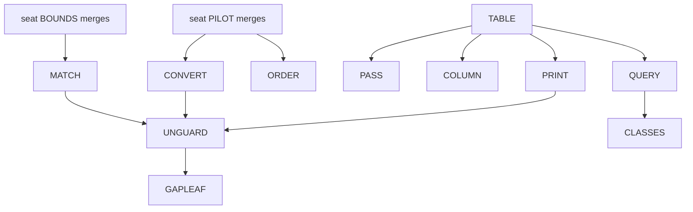

# 2026-10-06 the next slices, refined: a plan for review

Status: a research note (history, not authority). It rules nothing. The coordinator wrote it at
the owner's request, for the second reader's review before any slice starts. Base: main at
`afbfc646`. Two seats still run: seat PILOT (the fiber rule) and seat BOUNDS (the match by
bounds). Their merges come first, and sections 5.5 to 5.7 can change with them.

## 1. Question

Which slices come next, in which order, and what does each owe? What do the second reader's
reports change in the designs that we have?

## 2. The words of this note

- An **address table** holds one entry for each address of a program: the typing environment
  there, and the checker's answer there.
- An entry is **typed**, **refused** or **not reached**. It is not reached where a step on the
  way reads a sibling that the checker refuses.
- A **label** is data with a check: a rank or an order list, and a `Bool` function that reads it.
- The **frame of an edit** is the set of entries that an edit at an address cannot change.

Every other word is the dictionary's (`docs/core/controlled-english.md`): address, focus, focus
function, typing environment, omit, fill, union member, member rule, lifted rule, eliminator,
type slice, site.

## 3. What was read or run

| What | Evidence |
| --- | --- |
| The second reader's report on questions D2, D3, D5 and D6 of `docs/research/2026-10-06-probe-questions.md`, relayed by the owner in the session and not filed | reading |
| Lean 4.33.1 under `~/.elan/toolchains/leanprover--lean4---v4.33.1/src/lean`: `Lean/Elab/InfoTree/Types.lean`, `Lean/SubExpr.lean`, `Lean/Server/InfoUtils.lean`, `Lean/Language/Basic.lean`, `Lean/Meta/Transform.lean`, `Lean/Expr.lean`, `Lean/Server/Rpc/RequestHandling.lean`, `Lean/Widget/UserWidget.lean`, `Init/Data/List/Basic.lean` | reading, by search and by line |
| Batteries at the pinned revision `4488d40d`: `Batteries/Recycling/RBTree/Alter.lean`, and the README of that folder | reading |
| Decisions rows 281 to 297; the study of a gap with holes, sections 8 to 10; the receipts of the focus function and of seats UNION, FORM and CENSUS; the landing probe of the uniform eliminators | reading |
| Seat BOUNDS's draft receipt and seat PILOT's design note, each in its worktree | reading; neither is handed back, so each can change |
| `docs/research/2026-10-06-graph-labels-probe.lean.txt`, with its output | tested: exit 0; two theorems at `[propext, Quot.sound]` |
| `docs/research/2026-10-06-address-table-probe.lean.txt` | tested: exit 0 with no output; 15 guards on five programs; no theorem |

Both probes ran through the Lean slot on main. Neither is a theorem of the tree.

## 4. Findings

### 4.1 The report, checked against the pinned sources

**Confirmed (read).** Each name stands where the report says, with the content that it gives.

- `InfoTree` has three constructors: `context`, `node` and `hole`. `TermInfo` holds the local
  context, the expected type and the expression. `TacticInfo` holds the goals and the
  metavariable contexts before and after. `InfoState.assignment` maps a hole to a tree.
- `SubExpr.Pos` is a `Nat` with four children for each node, and its four folds are `partial`.
- `SnapshotTree`, `SnapshotBundle.old?` and `SyntaxGuarded` are as the report says.
  `InfoTree.visitM` and `InfoTree.hoverableInfoAtM?` are `partial`.
- Batteries holds a path type with `zoom_fill'`, in a folder that its README calls deprecated.
- `transform` is `partial` and caches in a monad. The two evaluators of the RPC method and of
  the widget are private `unsafe` definitions of Lean core. The manifest holds no ProofWidgets.
- `Node.at_`, `Node.replaceAt`, `RefsWithin`, `Path.rank`, `Checker.check`,
  `ts/eff/json.gen.ts` and `ts/eff/wire.gen.ts` exist where the report names them.

**Corrected.**

| The report says | What the source says |
| --- | --- |
| The nearest thing to Lean's typed hole is `proof_goal` | A sketch's hole row is nearer: a host row with a declared type (`Row.hole` and `Sketch`, `src/Effect4/Program/Sketch.lean`; rows 288 and 291). `proof_goal` is the hole of a proof, and no hole of a program |
| `transform` caches by pointer equality | Its docstring says so. `ExprStructEq.beq` is `Expr.equal`, an equality by structure with a hash (`Lean/Expr.lean`). The conclusion stands: no pinned source has a pure generic form |
| Widget code stays under `tools/` because Lean's evaluators are `unsafe` | The trust rule binds the tree's own code, not Lean's. Two other reasons hold. A widget imports Lean's server modules. It also needs a JavaScript module, and a package needs the owner's yes |
| Form 1 of D5, as written, reduces under `decide` | As written it quantifies over every node, and it has no `Decidable` instance. As a check over the edge list it reduces (tested) |
| Form 3 reads `List.indexOf?` | The name is `List.idxOf?` in 4.33.1 |
| `WellFounded.fix` does not reduce in the kernel | Measured on one function by well-founded recursion on a number: `decide` and `rfl` fail, `decide +kernel` passes, and `simp` with the equation passes (tested). The proposition `WellFounded r` has no `Decidable` instance (tested) |
| `Path.rank : List Nat → Nat` | It takes a list of paths and a path: the rank of a site in the sorted list of sites |
| `ContextInfo` stores `env`, `mctx`, `fileMap` and `openDecls` | `CommandContextInfo` holds them, and `ContextInfo` extends it |

**Not checked:** the commit of ProofWidgets. No source of the tree holds it.

**On the orders:** the second reader agrees with the coordinator's probe
(`docs/research/2026-10-06-order-classes-probe.lean.txt`). Seat ORDER's brief stands as written.

### 4.2 Six findings that change what we build

1. **The address table is the first-order form of Lean's info tree.** Lean stores what its
   elaborator saw, by a side effect, and a request walks the stored tree. Our checker is a
   function, so the table is a function of the program. The probe states it from landed
   functions only. The generated path fold lists the addresses. `Node.envAt` answers the
   environment, and `Checker.check` answers the type or the refusal (tested). The program
   stores nothing more.
2. **Three slices stop waiting for the one pass.** The table is a specification. A tool, the
   TypeScript printer and a type slice can read it today, at the cost of the focus function. The linear
   pass becomes an implementation with one agreement theorem. It comes when a measure asks.
3. **Total marking has a specification at the addresses of a program.** The table's distinct
   refusals are the checker's refusals at every address of a program that it reaches. Take a
   generator body with two refused
   programs. `explain` answers one refusal, and the table holds both (tested). Where a later
   program reads a refused one, its entries are not reached (tested). Both halves of
   `marking-agrees` then follow from landed laws (not compiled). The entry at the root is the
   checker's answer. A typed program has a typed focus at every address (`hasTy_focusAt`).
4. **Reuse after an edit has a law here.** Lean reuses a result when the old syntax equals the
   new (`SyntaxGuarded`). We can reuse on a weaker test, with a proof: the edit keeps the
   focus's type. Each entry outside the focus is then unchanged (tested on one program). At the
   root that is `check_replace_focusAt`. The statement at every address is a proposed claim:
   the frame of an edit.
5. **A label is data with a check.** `decide`, `rfl` and the kernel read a rank and an order
   list alike (tested). One theorem says what the check means (`ranked_acyclic`, proved in
   scratch). The tree has such a label already: `RefsWithin` over `Path.rank`
   (`src/Effect4/Laws/Program/ReferenceExpansion.lean`). A `WellFounded` proposition is no
   label that a gate reads.
6. **Compute on demand needs no server and no package.** Four operations of the study's tool
   table have their function and their law in the tree today. They are the check, the
   omission, the filling and the context of a hole. A driver that reads one request
   and prints one answer is enough for a click. An editor view needs a JavaScript module, so it
   waits for the owner.

### 4.3 What the two running seats change (draft, not handed back)

- **Seat PILOT** fixes the form of a conversion: a member rule, the guarded rule
  `UnionRule.liftOne`, and five facts for each eliminator in one law module. The converted
  rule keeps the raw answer where the old rule answered (row 296, point 5).
- **Seat BOUNDS's draft** says: replace the match of a template by one function, under one
  premise. It leaves the owner two decisions: three declarations of the prelude, and the reading
  of a request with its interim guard. Its end state needs the printer's type arguments.
- **So the typed print is on three paths**: the guard's removal (row 292), the end state of
  the match, and `checker-monotone` (row 293, point 6). Finding 2 lets it start early.

## 5. Proposals (not rulings): the slices

### 5.0 The order



| Wave | Slices | Why together |
| --- | --- | --- |
| 1 | ORDER, TABLE | Each adds modules and changes no statement. Their files are disjoint |
| 2 | PRINT, CONVERT, and QUERY beside them | The printer's files and the typing rules' files are disjoint. QUERY stands under `tools/` only |
| 3 | MATCH | It edits `src/Effect4/Program/Ty.lean`, so it rebuilds the tree. It runs alone |
| 4 | UNGUARD, COLUMN | UNGUARD needs PRINT, CONVERT and MATCH |
| Later | PASS, CLASSES, GAPLEAF | Each has an entry condition (5.9 to 5.11) |

The critical path is TABLE, PRINT, UNGUARD. At most two code seats build at one time
(the machine has two Lean slots).

### 5.1 ORDER: the order of a lifted rule in Lean core's classes

The brief is written: `docs/research/2026-10-05-claude-lead/briefs/seat-order-brief.md`, with
its compiled probe. The review changed nothing in it. It starts from main after seat PILOT's
merge, because both edit `src/Effect4/Laws/Program/UnionRule.lean`.

### 5.2 TABLE: the address table and the list of refusals

- **Goal**: the address table as a library function, as the specification of every later pass.
- **New files**: `src/Effect4/Program/Typing/Table.lean` (a core module),
  `src/Effect4/Laws/Program/Typing/Table.lean`, `Test/Program/TableControls.lean`.
- **A first step.** `Node.foldList` and `PathYield` stand in the law graph
  (`src/Effect4/Laws/Program/PathFold.lean`), and a core module cannot import it. Write
  `Node.addresses` over the generated `foldMapAt` functions, or move the two definitions to a
  core module. Say which in the design note.
- **Definitions**, as the probe has them: `Node.addresses`, `Table.Entry`, `table` and
  `refusals`. Add `Sketch.table` over a sketch's signature, as `Sketch.focusAt` does.
- **A second part, for PRINT**: the environment of a term slot as a function, for the four
  slots that extend their node's environment. It is open items 2 and 3 of
  `docs/research/2026-10-06-seat-TRACE-receipt.md`.
- **Statements** (not compiled; the names are proposals):

```lean
-- not compiled
theorem mem_addresses_iff (n : Node Op) (a : List Nat) :
    a ∈ n.addresses ↔ (n.at_ a).isSome = true
theorem refusals_head (s : Signature Op) (env0 : TyEnv) (p : Eff Op) :
    (refusals s env0 p).head? = explain s env0 p
theorem refusals_nil_iff (s : Signature Op) (env0 : TyEnv) (p : Eff Op) :
    refusals s env0 p = [] ↔ (effTy s env0 p).isSome = true
-- the frame of an edit: a filling of the focus's type changes no entry outside the focus
theorem table_replace_outside {s : Signature Op} {env0 : TyEnv} {p p' q : Eff Op}
    {path a : List Nat} {f : Focus Op} (hf : focusAt s env0 p path = some f)
    (hq : effTy s f.env q = some f.ty)
    (hp : (Node.eff p).replaceAt path (.eff q) = some (.eff p')) (ha : ¬ path <+: a) :
    (Node.eff p').envAt s (.env env0) a = (Node.eff p).envAt s (.env env0) a ∧
      (focusAt s env0 p' a).map (·.ty) = (focusAt s env0 p a).map (·.ty)
```

- **Proof plan.** The first is the path fold's law (`foldList_subset_of_at`), with its converse
  to prove.
  The second and third read the root's entry and `hasTy_focusAt`. The fourth is the
  replacement law at each sub-program on the way to `a` (`NodeHasTy.replace_envAt`). It is
  read in both directions, since the old focus has the new one's type.
- **Controls**: the probe's 15 guards move to the control file.
- **Do not touch**: `Checker.check`; the functions of `src/Effect4/Program/Typing/Focus.lean`.

| Statement | Concept; claim | Reach | It does not establish | Consumer |
| --- | --- | --- | --- | --- |
| `mem_addresses_iff` | `initial-algebras-folds`; a step of `focus-function` | every node of the seven sorts | an order of the addresses | each statement below; QUERY |
| `refusals_head`, `refusals_nil_iff` | the same; `marking-agrees`, role compatibility; R14's open part becomes a claim | the addresses of a program | a refusal of a statement's, an action's or a layer's own rule, but through the program above it; a mark after a refused sibling that a rule reads; a repair | QUERY's refusals; the study's section 8.5 |
| `table_replace_outside` | the same; the proposed claim `edit-frame`, role substitution; R14 | a filling of the focus's type in the focus's environment; every address outside the focus | an edit that changes the focus's type; the entries inside the focus; behaviour | a tool that answers again after an edit; PASS |

### 5.3 QUERY: one driver that answers on demand

- **Goal**: one executable reads a request and prints an answer. Each operation is one library
  function, and each answer names the law that it stands on.
- **New files**: `tools/Drivers/Query.lean`, and a transcript fixture with its check. The
  `lean_exe` entry of `lakefile.toml` is the coordinator's: propose it in the receipt.
- **Input.** The program arrives as its canonical bytes (`decodeProgram`,
  `src/Effect4/Store/Domain/ProgramWire.lean`), at the empty application first. A search found
  no canonical codec of a sketch. The second step derives one, since this boundary reads it.
- **The operations, first version.** Each function is landed, or is TABLE's.

| Operation | Function | The law that the answer names |
| --- | --- | --- |
| check | `Sketch.check` | the checker decides; `holes_conservative` |
| addresses | `Node.addresses` | `mem_addresses_iff` |
| focus at an address | `Sketch.focusAt` | `focusAt_typed` |
| table, refusals | `Sketch.table`, `refusals` | `refusals_head`, `refusals_nil_iff` |
| omit at an address | `Sketch.omitAt`, with the hole row of the focus's type | `Sketch.check_omit_focusAt` |
| fill at an address | `Sketch.fillAt` | `Sketch.check_fill_focusAt` at the focus's type; a new check otherwise |

- **The protocol** is one JSON object for each request and each answer, with Lean's own `Json`
  under `tools/`. No server and no package. An MCP tool then maps to one operation.
- **Acceptance**: the transcript of the focus controls' example. Each answer equals the value
  that `Test/Program/FocusControls.lean` guards.
- **It does not establish**: any behaviour; a view; a stored session. It adds no theorem.
- **Later operations**: a type slice (COLUMN), a graph with its label (CLASSES) and the typed
  print (PRINT). The host session has the run's operations today.

### 5.4 PRINT: the printer writes the type arguments at a join

- **Goal**: at an eliminator whose term has more than one union member, the printed call
  carries its type arguments. Nothing else moves.
- **Step 1, a finite probe with tsgo 7.** List every printed form of the slot table of
  `docs/research/2026-10-06-seat-TRACE-receipt.md`, and the atoms of seat BOUNDS's draft. For
  each, run the form with the type arguments written at the join. The landing probe ran a few.
- **Step 2, a second printer beside the first.** `printTyped` takes the typing environment
  where `print` takes its length. It gives each child its environment by `Node.childEnv`. A
  typed term printer asks `termTy` at each argument, so a term needs no address.
- **Step 3, the connector.** Let `NoJoin` say that no site of step 1's list needs a join. At
  an eliminator, its term has at most one union member. At an atom's application, each
  parameter's lower bounds have a greatest one (the guard of seat BOUNDS's draft). Under
  `NoJoin` the two printers agree. While the guards stand, every admitted program has it.

```lean
-- not compiled; the names are proposals
theorem printTyped_eq_print (sig : Signature Op) (env : TyEnv) (e : Eff Op)
    (h : NoJoin sig env e) : printTyped sig env e = print sig env.length e
theorem check_noJoin (sig : Signature Op) (env : TyEnv) (e : Eff Op) (t : EffTy)
    (h : Checker.check sig env [] e = .ok t) : NoJoin sig env e   -- while the guards stand
```

- **Step 4, the reader.** A named map erases the type arguments of a join from printed syntax.
  The reader is today's reader after it. One law carries every read law over: the erased typed
  print is today's print.
- **Step 5**: the callers move to `printTyped`, and `print` stays as the form under `NoJoin`.
- **Controls**: the 73 modules of the truth lane and the 400 generated programs are unchanged
  byte for byte. Red: a join's type arguments with one member too few, refused by tsgo.
- **The type arguments are the lifted rule's answer.** By `Eliminator.adjoint` they are the
  least arguments at which the call checks. At an atom they are the match's least bindings.
  State that as the printer's one fact for each site.
- **Do not touch**: the template table's rows for other constructors; `Checker.check`.
- **Gates at the merge**: the wide gates with `check-tsdiag`, `check-corpus` and `check-ingest`.

| Statement | Concept; claim | Reach | It does not establish | Consumer |
| --- | --- | --- | --- | --- |
| the connector, the erasure law | `exact-codecs`; a step of the claim that `Effect4.Program.roundTrip_eq` serves | every program that the two printers print | that tsgo accepts a printed form: the lanes test that | UNGUARD; MATCH's end state |

### 5.5 CONVERT: the other eliminators, in seat PILOT's form

- **Goal**: each rule that reads a head is its member rule's guarded rule, as the fiber rule is.
- **The rules**, from the landing probe and row 293: `Checker.listOf?`, `Checker.exitOf?`,
  `Decision.arms` at an option, and the cause rule. The cause rule reads two heads and owes
  four member facts. A rule on an invariant handle is not converted.
- **Then the equalities**, as one slice: `Ty.sub t T` in place of `t = T` at the four Boolean
  tests, `restore`, the scope of `forkIn`, `setContext` and the interruptor.
- **Each conversion keeps the raw answer** where the old rule answered, until MATCH lands.
- **Controls and gates**: seat PILOT's differential on the two corpora, and the case policy
  pinned again, as its receipt will say. A program that was admitted and is refused is a
  finding, and the owner hears of it first (row 294, point 5).
- **Placement**: concept `subtyping-algebra`; the claim `union-rule-lift`, one instance each;
  R14. Each conversion admits more programs: at `never`, and at one union member under a raw
  union. The coordinator reports each to the owner (row 285, point 3).

### 5.6 MATCH: the match of a template by bounds

The slice is written after seat BOUNDS's hand-back. Its draft gives the function, six
statements with their placement, and the churn. Two decisions are the owner's (section 7).
The slice runs alone. It carries the repair of the population filter (row 293, point 9), since
both rebuild the tree.

### 5.7 UNGUARD: the guard goes, and the checker is monotone at its eliminators

- **Entry**: PRINT, CONVERT and MATCH are merged, and the owner has heard.
- **Two steps of one line each.** The converted rules answer the normal form. Then
  `UnionRule.liftOne` becomes `UnionRule.lift`.
- **The statement** is `checker-monotone`, in the corrected sentence of the study's section
  10.2, with seat BOUNDS's amendment of its clause on schemes.
- **Gates**: the conservativity script with the policy's names; the truth lane and the
  diagnostics lane on programs with a proper union, printed by `printTyped`.

### 5.8 COLUMN: type slices of the error and of the requirement

The study's brief stands (its section 9.7), with two changes. Its premise is row 290's: no
closed edge above an omitted address, or an error of `never` there. Its first step reads
TABLE's table, so it waits for no pass.

### 5.9 PASS: the linear pass, as a design probe

**Entry condition**: a measure. Run `table` on the largest programs of the two corpora first.
Three candidates, none compiled:

| Candidate | The idea | Cost |
| --- | --- | --- |
| M | The checker over a monad that records each node | The 65 arms and each proof that unfolds one (row 294, point 3). It marks at every sort |
| H | The node over holes. Check each child once. Omit each child to a hole row of its type, and ask the checker for the node over the holes | The checker does not change. The agreement is the omission's law (`Sketch.check_omit_focusAt`). It is exact where checked types are in normal form, so it follows UNGUARD |
| I | Keep the table. After an edit, check the focus again, and the entries that read a changed type | It needs `edit-frame`, and a stored table beside the sketch |

### 5.10 CLASSES: a label for each graph

**Entry condition**: QUERY has landed, and a view or a gate asks for a label.

- One small module: the two checks of the probe, `ranked_acyclic`, and a check that each node
  has one parent at most. No framework beyond what a consumer reads.
- **The labels.** The addresses of a program are a tree: the parent of an address drops its
  last index, and the rank is the length. The layer references have their rank already. The
  sites of a slice view form a tree, which the descent over a tree of sites reads (row 286,
  point 3). The order of `Node.addresses` is an order list for the table's own dependencies.
  That is a reading: an entry reads the entries above it and those of earlier siblings.
- **The first consumer** is QUERY: a graph's answer holds the nodes, the edges and the label.
  A view then picks a layout by the label, and a client runs the check again.
- The module graph and the proof plan get no label: Lean and Lake check both already.

### 5.11 GAPLEAF: the gap as a leaf of `Ty`

The study's brief stands (its section 9.7). It follows UNGUARD and TABLE. The coordinator tells
the owner before the append lands (row 288, point 5). Seat BOUNDS's draft adds one fact: the
gap's rule at a cell is the function of the match by bounds.

### 5.12 The small repairs, each placed

| Repair | Lands with |
| --- | --- |
| The population filter reads a name as generated (rows 286 and 293) | MATCH |
| The five items of row 297, point 8 | COLUMN, or one short seat |
| The items of row 295, point 8, on the TypeScript lanes | PRINT |
| A generated step for the 54 arms and the 60 cases (the focus function's receipt, item 5) | PASS, if candidate M is taken |

### 5.13 What a lander needs beyond `AGENTS.md`

- Run every Lean, Lake and `make` command through `scratch/lean-slot.sh`. Run one `lake` in a
  worktree at a time.
- Write `-o ts/eff/node_modules -o harness/truth/node_modules` on every `make` call.
- Install nothing. A `bun` run outside `ts/eff` and `harness/truth` takes `--no-install`.
- Run tsgo by its path under `ts/eff/node_modules/.bin`.
- Send a design note first, one page, with each statement compiled in scratch.
- End with a receipt in the handoff form of `AGENTS.md`, and propose each registry text there.

The coordinator merges each head with the wide gates, in this order:

1. `lake build`, `make gen-fixtures` and `make corpus`;
2. `dune build` and `dune test --force engine`, each through `opam exec --switch=effect4`;
3. `make gen-truth` and `make check-truth`;
4. `make gen-semantics`, `make check-semantics`, `make check-cases`, `make check-docs` and
   `make check-language`;
5. `make gen-architecture` and `lake env lean Test/All.lean`;
6. `make check-conservativity` against the base, and `make check-tsdiag`.

## 6. Questions for the review

1. **TABLE.** Does `table_replace_outside` have a counterexample? Look where `Node.childEnv`
   reads something that is no sibling's type: the arms of `select`, and the cursor of `iterate`.
2. **TABLE.** After the head, is the order of `refusals` the checker's own order? The plan
   claims the head only.
3. **PRINT.** Which printed form has no place for a type argument? Give the full list for step 1.
4. **PRINT.** Is a table by address better than the second printer? It needs an address
   inside a term, which the tree does not have.
5. **QUERY.** A program's bytes do not name its row table. Which identity does a request carry?
6. **ORDER.** The brief's item 4 has two forms. Count the statements and the lines of each.
7. **PASS.** Does candidate H hold at a node whose rule reads a child's raw type?
8. **CLASSES.** Which graph gets its label first, and what reads it?

## 7. What waits for the owner

1. **At seat BOUNDS's merge**: three declarations of the prelude, and the reading of a request
   with its interim guard. The coordinator's reading, for that report: this plan's order needs
   no interim package. The match keeps today's reading until PRINT lands, and then takes its
   end state.
2. **Rows 296 (point 5) and 297 (point 4)** stay open to overrule.
3. **Each widening of the admitted programs**: CONVERT's and UNGUARD's, each reported with its
   merge.
4. **The append of the gap's leaf**, before it lands.
5. **An editor view** needs a JavaScript package. The plan proposes none.

The plan assumes that the coordinator merges each slice with the wide gates and writes the
records, as `AGENTS.md` says.

## 8. What this does not establish

- No theorem of the tree. Each statement of section 5 is not compiled, but for the two probes.
- The probes are finite: five programs, and one relation of four nodes.
- The cost of the table is not measured.
- Sections 5.5 to 5.7 rest on two documents that are not handed back.
- Step 1 of PRINT is not run. The landing probe ran a few forms with written type arguments.
- The second reader's claims on a library that is no dependency are not checked.
