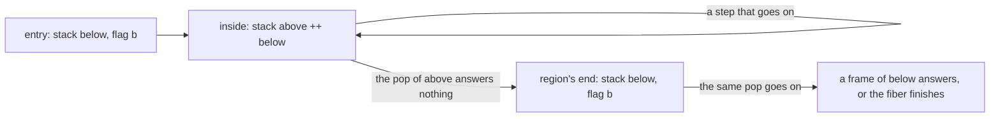
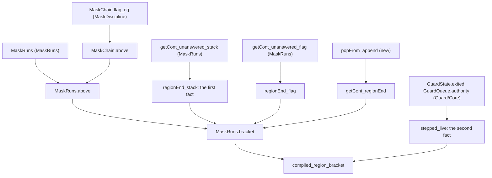

# 2026-10-06 seat BRACKET design: a region ends with its entry flag

Status: a design note (history, not authority). Brief:
`docs/research/2026-10-05-claude-lead/briefs/seat-bracket-brief.md`. Base: `76a6f215`. No file
of the slice is in the tree yet, so this note claims no theorem. Each statement below is in a
scratch probe at the base, and section 8 lists what each probe shows.

Three words are used in one sense here.

- **Live.** A fiber is live while its field `exit` is `none`.
- **Cut of a run.** A state of one fiber on a run. On the frame machine it is a `FrameFiber`.
  On the fiber machine it is a reached machine with one of its fibers. This is the brief's
  sense of the word. It is not the registry's `Cut` (`tools/Tools/SemanticsRegistry.lean`).
- **Own frames.** The frames that a fiber pushed after a region's entry and has not popped.

## 1. The answer to the brief's question

The cuts are defined on the frame machine. The second fact is proved at the compiled program's
interpreter. The journaled run is not the home.

| Home | What it holds | Why |
| --- | --- | --- |
| The frame machine (`src/Effect4/Machine/Frames.lean`) | the two cuts, the first fact, the bracket's general form | a region is no syntax of the machine, and the stack alone marks it |
| The fiber machine along a run | the general form over two reached machines | the invariant `MaskRuns` (`src/Effect4/Laws/Machine/MaskRuns.lean`) reads the frame's stack there |
| The compiled program's interpreter | the second fact, and the claim's pointer | only there does the command loop step live fibers alone (section 4) |
| The journaled run | nothing | a region's entry and its end fall inside one row's command loop (section 5, D3) |

## 2. The two cuts of a region

A region is the part of a fiber's run between two cuts. The machine stores no mark of it.

- **The entry** is a cut. Its stack is the entry's stack, written `below`. Its flag is the
  entry flag. The fiber's code there is the body, or the action that opens a region.
- **A cut inside the region** is a later cut whose stack is `above ++ below`. The frames
  `above` are the own frames.
- **The end** is inside one step, at a cut inside the region. The step pops the own frames, and
  no own frame answers. The fiber that this pop leaves, over the entry's stack, is the
  region's end.

The end is no cut between two steps in general. A restoring frame passes inside the pop that
delivers the body's exit. So does a handler of the other arm. The stack then goes from
`above ++ below` to a part of `below` in one step (section 5, D1).



Three definitions carry this, in `namespace Effect4.FrameFiber`.

```lean
/-- The fiber over more frames: the frames `below` are put under its stack. -/
def under (f : FrameFiber ν σ β ε δ ι α) (below : List (Prim ν σ β ε δ ι α)) :
    FrameFiber ν σ β ε δ ι α :=
  { f with stack := f.stack ++ below }

/-- A region's own fiber: the fiber with the frames `above` alone. -/
def own (f : FrameFiber ν σ β ε δ ι α) (above : List (Prim ν σ β ε δ ι α)) :
    FrameFiber ν σ β ε δ ι α :=
  { f with stack := above }

/-- The region's end: the fiber that the pop of the own frames leaves, over the entry's stack. -/
def regionEnd (f : FrameFiber ν σ β ε δ ι α) (below : List (Prim ν σ β ε δ ι α)) (demand : Arm)
    (skip : Bool) (cause : Option (Cause ε δ ι α) := none) : FrameFiber ν σ β ε δ ι α :=
  (f.getCont demand skip cause).fiber.under below
```

A cut of a compiled program's command loop is a fourth definition, in
`namespace Effect4.Program`. `Machine.Steps id c` says that the command `c` steps the fiber
`id`: it is `Cmd.loop id _` or `Cmd.deliver id _`.

```lean
structure LoopCut (p : NativeEff) (table : RowTable) (bases : List Bool) (m : NativeMachine)
    (cmds : List NCmd) : Prop where
  state : GuardState m
  queue : GuardQueue p table m cmds
  registration : RegistrationQueue cmds
  kept : MaskRuns bases m
```

`GuardState`, `GuardQueue` and `RegistrationQueue` are the guard's invariants of a compiled
program's command loop (`src/Effect4/Laws/Program/Guard/Core.lean`, DI-68).

## 3. The statements

Lean elaborates each one in scratch. Each statement over a pop takes the four instances
`[DecidableEq ε] [DecidableEq δ] [DecidableEq ι] [DecidableEq α]`.

### The bracket's conclusion

```lean
structure RegionEnds (entry g : FrameFiber ν σ β ε δ ι α) (above : List (Prim ν σ β ε δ ι α))
    (demand : Arm) (skip : Bool) (cause : Option (Cause ε δ ι α)) : Prop where
  stack : (regionEnd (g.own above) entry.stack demand skip cause).stack = entry.stack
  flag : (regionEnd (g.own above) entry.stack demand skip cause).interruptible =
    entry.interruptible
  answer : (g.getCont demand skip cause).answer =
    ((regionEnd (g.own above) entry.stack demand skip cause).getCont demand skip
      ((g.own above).getCont demand skip cause).carriedCause).answer
  fiber : (g.getCont demand skip cause).fiber =
    ((regionEnd (g.own above) entry.stack demand skip cause).getCont demand skip
      ((g.own above).getCont demand skip cause).carriedCause).fiber
  carried : (g.getCont demand skip cause).carriedCause =
    ((regionEnd (g.own above) entry.stack demand skip cause).getCont demand skip
      ((g.own above).getCont demand skip cause).carriedCause).carriedCause
```

`entry` is the fiber at the region's entry, and `g` is the fiber at a cut inside the region.
The fields `stack` and `flag` are the bracket. The last three fields say that the pop of `g`
goes on as the pop of the region's end. So the frames under a region are popped from an empty
scratch stack, at the entry flag.

### The claim's pointer, at the compiled program's interpreter

```lean
@[semantics "scope-lifetime-finalization" (requirement := R11)]
theorem compiled_region_bracket (p : NativeEff) (table : RowTable) {bases bases' : List Bool}
    {m m' : NativeMachine} {c c' : NCmd} {rest rest' : List NCmd}
    (entry : LoopCut p table bases m (c :: rest)) (later : LoopCut p table bases' m' (c' :: rest'))
    (grown : bases <+: bases') {id : FiberId} (steps : Steps id c) (steps' : Steps id c')
    {f g : NFiber} (found : m.fiber? id = some f) (found' : m'.fiber? id = some g)
    {above : List NCode} (inside : g.frame.stack = above ++ f.frame.stack)
    (demand : Effect4.Arm) (skip : Bool) (cause : Option CauseV)
    (unanswered : ((g.frame.own above).getCont demand skip cause).answer = ContAnswer.empty) :
    RegionEnds f.frame g.frame above demand skip cause
```

It takes no premise on an exit. Both cuts are at a command that steps the fiber, and such a
fiber is live (section 4). A printed form shows the fiber's default code and frame types at
each `f.frame`.

### The general form

```lean
theorem MaskRuns.above {bases bases' : List Bool} {m m' : RunMachine ν σ β ε δ ι α χ St}
    (kept : MaskRuns bases m) (kept' : MaskRuns bases' m') (grown : bases <+: bases')
    {f g : RunFiber ν σ β ε δ ι α χ} (mem : f ∈ m.fibers) (mem' : g ∈ m'.fibers)
    (same : g.id = f.id) (live : f.exit = none) (live' : g.exit = none)
    {above : List (Prim ν σ β ε δ ι α)} (inside : g.frame.stack = above ++ f.frame.stack) :
    MaskChain f.frame.interruptible g.frame.interruptible above

theorem MaskRuns.bracket {bases bases' : List Bool} {m m' : RunMachine ν σ β ε δ ι α χ St}
    (kept : MaskRuns bases m) (kept' : MaskRuns bases' m') (grown : bases <+: bases')
    {f g : RunFiber ν σ β ε δ ι α χ} (mem : f ∈ m.fibers) (mem' : g ∈ m'.fibers)
    (same : g.id = f.id) (live : f.exit = none) (live' : g.exit = none)
    {above : List (Prim ν σ β ε δ ι α)} (inside : g.frame.stack = above ++ f.frame.stack)
    (demand : Arm) (skip : Bool) (cause : Option (Cause ε δ ι α))
    (unanswered : ((g.frame.own above).getCont demand skip cause).answer = ContAnswer.empty) :
    RegionEnds f.frame g.frame above demand skip cause
```

`MaskRuns.above` is the form that holds at every cut inside a region. The own frames hold the
chain `MaskChain` at the entry flag. So the entry flag is to the region what the start flag is
to the fiber. `MaskRuns.flag_eq` is its case of no own frame.

A placed structure `RegionBracket` holds the general statements as six fields, and
`Machine.saved_mask_region_bracket` proves it. The fields are `chain`, `between`, `answered`,
`frames`, `inside` and `ends`.

### The steps on the frame machine

| Name | Premises | Conclusion |
| --- | --- | --- |
| `MaskChain.append_iff` | none | `MaskChain base flag (above ++ below) ↔ ∃ mid, MaskChain mid flag above ∧ MaskChain base mid below` |
| `MaskChain.above` | `MaskChain base flag (above ++ below)`, `MaskChain base entry below` | `MaskChain entry flag above` |
| `popFrom_append_answered` | the pop of `above` answers | the pop of `above ++ below` is that pop, with `below` under its fiber's stack |
| `popFrom_append_unanswered` | the pop of `above` answers nothing | the pop of `above ++ below` goes on over `below`, from the fiber and the carried cause that the first pop left |
| `getCont_under_answered` | `(f.getCont demand skip cause).answer ≠ ContAnswer.empty` | `(f.under below).getCont demand skip cause` is that pop, with `below` under its fiber's stack |
| `step_under` | `(f.step interp).fst = FrameStep.running next` | `((f.under below).step interp).fst = FrameStep.running (next.under below)` |
| `regionEnd_stack` | `(f.getCont demand skip cause).answer = ContAnswer.empty` | `(regionEnd f below demand skip cause).stack = below` |
| `regionEnd_flag` | the same, and `MaskChain entry f.interruptible f.stack` | `(regionEnd f below demand skip cause).interruptible = entry` |
| `getCont_regionEnd` | the same as `regionEnd_stack` | the pop of `f.under below` goes on as the pop of the region's end |
| `regionEnds_of_base` | two fibers at one base, the second inside the region of the first, an unanswered pop | `RegionEnds entry g above demand skip cause` |

The pop's law asks for no scratch premise. Both sides drain the same pushed frame. The pop's
other laws ask for an empty scratch stack (`popFrom_maskChain`,
`src/Effect4/Laws/Machine/MaskDiscipline.lean`).

### The steps at the compiled program's interpreter

| Name | Premises | Conclusion |
| --- | --- | --- |
| `stepped_live` | `GuardState m`, `GuardQueue p table m (c :: rest)`, `Steps id c`, `m.fiber? id = some f` | `f.exit = none` |
| `clearsExited_of_guard` | `GuardState m`, `GuardQueue p table m cmds` | `ClearsExited m cmds` |
| `guarded_driveStep_maskRuns` | `GuardQueue p table m (c :: rest)`, `MaskRuns bases m` | the invariant after the command, at a table that `bases` is a prefix of |
| `LoopCut.step`, `LoopCut.drive` | a cut | a cut after one command, and after the command loop at every budget, at a longer table |
| `LoopCut.evaluate`, `LoopCut.load` | `GuardState m` and `MaskRuns bases m`, or none | the start of an `evaluate` decision is a cut, and so is the loaded machine |

## 4. Which landed statement gives each step



| Step | The landed statement that gives it |
| --- | --- |
| The entry flag is the base of the own frames | `MaskChain.flag_eq` (`src/Effect4/Laws/Machine/MaskDiscipline.lean`), after the chain's split, which is new |
| The chain at both cuts, at one base | the invariant `MaskRuns`, as `MaskRuns.flag_eq` reads it (`src/Effect4/Laws/Machine/MaskRuns.lean`) |
| The first fact: the stack at the region's end | `getCont_unanswered_stack` (the same file), and the pop's law over two lists, which is new |
| The flag at the region's end | `getCont_unanswered_flag` (the same file), at the entry flag as the base |
| Between the cuts | `resumeValue_frame`, `resumeCause_frame` and their siblings (`src/Effect4/Machine/Frames.lean`), over the pop's law |
| The second fact: the fiber is live at both cuts | `GuardState.exited` and `GuardQueue.authority` (`src/Effect4/Laws/Program/Guard/Core.lean`) |
| The guard's invariants along a command loop | `driveStep_invariants` (`src/Effect4/Laws/Program/Guard/Driver.lean`), `guardState_load` and `guardQueue_evaluate_drainDue` |
| The chain's invariant along a compiled command loop | `driveStep_maskRuns` (`src/Effect4/Laws/Machine/MaskRuns.lean`) and `evaluateNative_keepsMask` (`src/Effect4/Laws/Program/MaskRuns.lean`) |

**A finding beside the slice.** Seat LIFT's receipt lists one fact as assumed by reading: no
compiled program reaches a machine where the command loop steps an exited fiber. The guard's
invariants give it at each cut of a compiled command loop (tested: `stepped_live` in scratch,
at `[propext, Quot.sound]`).

## 5. What is not provable as stated

Each row is a candidate that this design drops. Each counterexample is a finite probe, and the
battery keeps it as a red control.

| # | Candidate | Why it is dropped | Counterexample |
| --- | --- | --- | --- |
| D1 | The region's end is a cut between two steps whose stack is the entry's stack | Such a cut does not exist where the last own frame passes | Entry stack `[onSuccess _ 3]`, body `onFailure (success 2) 5`. The stacks of the run have lengths 1, 2 and 0. The handler passes inside the pop that delivers the value |
| D2 | A fiber that the command loop steps is live, at every interpreter | False at a hand-written interpreter | Seat LIFT's run: a second fiber evaluates the registration of a race that fiber 0 hosts. A cut has `Cmd.loop ⟨0⟩ _` at its head, and fiber 0 has exited |
| D3 | The cuts are rows of a journal | A region's entry and its end fall inside one row | A compiled program with nested regions. Its command loop has cuts inside each region. Its one decision cut after the start shows an exited root |
| D4 | A frame that does not answer leaves the stack alone | False since `asyncFinalizer` | `popFrom_asyncFinalizer_pops_its_push` (`src/Effect4/Machine/Frames.lean`), and the note in `src/Effect4/Laws/Machine/LiveStack.lean`. So the stack's law is over a whole pop and over a step, not over one passed frame |
| D5 | The flag is one flag inside a region | A body holds regions of its own | Under a masked caller, a body with an `interruptible` region has a cut at flag true |
| D6 | The own frames hold the chain at the fiber's base | They hold it at the entry flag | Base true, entry stack `[setInterruptible true]`, entry flag false, no own frame |
| D7 | The region's end has the entry flag at every pop | Only where no own frame answers | Own frames `[onSuccess _ 3, setInterruptible true]` and a value: the first frame answers, and the pop's fiber is masked over one frame |
| D8 | The bracket holds for a fiber that has exited at the second cut | The invariant ranges over the live fibers | Seat LIFT's reached machine: fiber 0 started at flag true over an empty stack, and it ends exited at flag false over an empty stack |

One more statement is true and is not landed. The step that ends a region is the step of the
region's end, where that fiber's code is the delivered exit. With the code unchanged the
statement is false on a failure: a passed handler rewrites the carried cause
(`skippedCause`, `src/Effect4/Machine/Frames.lean`). The bracket reads the pop, which is
`getCont_regionEnd`, so it does not need the step's form.

## 6. The client premise stays where it is

The mask's derived form has one premise for its clients. Nothing is acquired or registered
before the body begins (decisions rows 227 and 244 to 246). The bracket takes no hypothesis for
it, and it does not discharge it.

- The bracket reads a region from its entry. It states nothing of the two checkpoints of the
  form before its body.
- An interrupt at one of those checkpoints ends the form before its body. The premise makes
  that equal to an interrupt before the form. That argument is the client's.
- The docstring of each placed theorem names the premise as the client's.

## 7. The files, by the import graph

| File | Imports | Content |
| --- | --- | --- |
| `src/Effect4/Laws/Machine/MaskBracket.lean` | `Effect4.Laws.Machine.MaskRuns` | the cuts, the first fact, the general form, `saved_mask_region_bracket` |
| `src/Effect4/Laws/Program/MaskBracket.lean` | the file above, `Effect4.Laws.Program.MaskRuns`, `Effect4.Laws.Program.Guard.Decision` | `LoopCut`, the second fact, `compiled_region_bracket` |
| `Test/Machine/MaskBracket.lean` | both, `Test.Program.MaskContract`, `ProofGraph.Plan` | the controls |

**One difference from the brief: two law modules, not one.** The general form imports nothing
of `src/Effect4/Laws/Program`. The pointer reads the guard's invariants, which are there. Seat
LIFT's modules have the same split. The two imports go after the last import of a `MaskRuns`
module in `src/Effect4/Laws.lean`.

The module that imports the guard cannot use the identifier `over`. A command of
`src/Effect4/Laws/Auto/Positions.lean` reserves the word. The hypothesis is named `inside`.

**The steps.**

1. Both modules land with the definitions, the two facts and each step. The two placed
   theorems are planned goals (`proof_goal`), placed at `scope-lifetime-finalization` and R11.
2. The bracket along a run lands, and both goals are proved in place.
3. The battery lands.
4. The receipt lands.

## 8. The probes, the controls and what the slice does not establish

| Probe (scratch) | Result | Evidence |
| --- | --- | --- |
| `final/m.lean` | the general module's text, with warnings as errors; `saved_mask_region_bracket` at `[propext, Quot.sound]` | tested |
| `final/combined.lean` | both modules' texts; `compiled_region_bracket`, `LoopCut.load` and `LoopCut.drive` at `[propext, Quot.sound]` | tested |
| `dev.lean` | the command cuts of one compiled program with nested regions: 25 cuts in the root's first command loop | reproduced: a finite probe |

The bracket closes in scratch, so the stop rule does not apply to the general form or to the
pointer.

**The controls** (`Test/Machine/MaskBracket.lean`).

- The frame machine: a sweep of stacks, split at each point. It reads the chain's split, the
  pop's law, the step between the cuts and the region's end.
- A compiled program whose region changes no flag, and whose body changes the flag and
  returns. A nested region. A region whose body is interrupted. Each is read at the cuts of its
  command loop, on each pair of cuts.
- The mask's derived form under a masked caller.
- Red controls: D1, D2, D5, D6, D7 and D8 of section 5. A pair of cuts with two stacks has two
  flags. A fiber that has exited at the second cut has another flag at the entry's stack.

**What the slice does not establish.**

- **That a cut has the stack `above ++ below`.** It is the reader's premise at the second cut.
  `step_under` and `getCont_under_answered` give it for the frame machine's step and for a pop.
  No theorem carries it along the fiber machine's commands. The fiber machine writes a stack
  at other places. A park pushes `asyncFinalizer`, and a region's entry pushes a restoring
  frame. The parallel close pushes an iterator. Each is a push, by reading. A law of each
  evaluator arm and of each command is the next step for a wrapper's law.
- A region whose fiber exits inside it. Cleanup, release counts, delivery, budget and liveness.
- A cut at the start of a decision other than `evaluate`. The guard's own lift holds those
  queues (`src/Effect4/Laws/Program/Guard/OuterDriver.lean`).
- An invariant is not progress.
