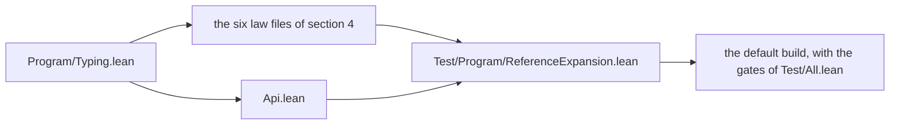

# 2026-10-06 seat CHECK design: the checker tests the references' formation only

Status: a design note (history, not authority). Brief:
`docs/research/2026-10-05-claude-lead/briefs/seat-check-brief.md`. Base: `8fcab517`. The
slice is decisions row 273, point 2. Scratch probes at the base state each proof below over
the new forms, and the kernel accepts each. No definition has changed yet, so this note claims
no theorem.

## 1. The change

Two definitions change, in one commit. The first is `typeOfProgram`
(`src/Effect4/Program/Typing.lean`).

```lean
-- before
def typeOfProgram (sig : Signature Op) (program : Eff Op) : Option EffTy :=
  if program.layerRefsWF && (program.expandRefs.refSites []).isEmpty then
    typeOf sig program.expandRefs
  else none
-- after
def typeOfProgram (sig : Signature Op) (program : Eff Op) : Option EffTy :=
  if program.layerRefsWF then typeOf sig program.expandRefs else none
```

The second is `Api.explain` (`src/Effect4/Api.lean`).

```lean
-- before
def explain (program : Program) (table : RowTable := []) : Option Effect4.Program.TypeRefusal :=
  if program.layerRefsWF then
    match program.expandRefs.refSites [] with
    | (site, target) :: _ => some ⟨site, .layerReference target⟩
    | [] => Effect4.Program.explain (nativeSignature table) [] program.expandRefs
  else some ⟨[], .referencesIllFormed⟩
-- after
def explain (program : Program) (table : RowTable := []) : Option Effect4.Program.TypeRefusal :=
  if program.layerRefsWF then
    Effect4.Program.explain (nativeSignature table) [] program.expandRefs
  else some ⟨[], .referencesIllFormed⟩
```

No constructor goes. `TypeReason.layerReference` (`src/Effect4/Program/Typing/Blame.lean`)
keeps a producer: `Checker.checkLayer` (`src/Effect4/Program/Checker.lean`) answers it at a
reference.

## 2. Placement

- Concept: `initial-algebras-folds`; property: the reference expansion leaves no reference.
- Question: no new statement. The slice is a simplification under the claim
  `reference-expansion-complete`, whose witness is `expanded_refs_nil_of_wf`
  (`src/Effect4/Laws/Program/ReferenceExpansion.lean`). It keeps `Api.explain_none_iff`,
  which states the located refusal's completeness against `Api.wellTyped`.
- Reach: every operation alphabet and typing signature for `typeOfProgram`; the native
  signature at every row table for `Api.explain`.
- Does not establish: any new fact. It gives no typing success, and it says nothing about a
  run. The compile does not expand a reference.
- Unlocks: nothing on the M5 to M7 spine. It serves R5.

## 3. The measure

The commands ran in the worktree at the base. `SCRATCH` is
`/private/tmp/claude-501/-Users-pooks-Dev-lean4-effect4/acf2315e-02ac-4acd-9ef9-b0734bd686a7/scratchpad/check`.

| Command | Result |
| --- | --- |
| `grep -rlw typeOfProgram <area> --include='*.lean'`, counted by `wc -l` | 4 files of the runtime root, 13 of the law graph, 9 batteries, 1 tool, 0 under `harness` |
| `grep -rnw typeOfProgram <area> --include='*.lean'`, counted by `wc -l` | 12 lines in the runtime root, 41 in the law graph, 24 in the batteries, 1 in the tools |
| the same word under `ocaml`, `ts`, `scripts` and `src/OCaml5` | 0 files |
| `grep -c` of seven names in the four LCNF outputs and their four closure files | 0 in each file: no LCNF root reaches either definition |
| `grep -rn explain src Test tools harness --include='*.lean'` | the facade's `explain` is unfolded in one proof, `Api.explain_none_iff` |
| a `grep -rnE` for a tactic that names `typeOfProgram` | ten tactic sites in seven files; section 4 lists each |
| `python3 SCRATCH/cone.py Effect4.Program.Typing` | 569 modules import the file, directly or through others: 74 of the runtime root, 233 of the law graph, 233 under `Test`, 29 under `tools` and `src/OCaml5` |

The uses that unfold no definition are of four kinds.

- **A premise.** The typed state's theorems take the checker's answer as a premise
  (`load_typed`, `reachable_typed`, `obs_typed` and `exits_hasTy` under
  `src/Effect4/Laws/Program/Typed/`). Each reads the premise through
  `layerRefsWF_of_typeOf` or through the load, and section 4 lists both.
- **A certificate field.** `TypedProgram.typed` (`src/Effect4/Program/CheckedTyping.lean`)
  holds the checker's equation, and `checkTypedProgram` matches on the checker's answer.
- **A kernel evaluation.** The batteries state the answer of a closed program and prove it by
  `decide +kernel` or by `rfl'`. The answer is the same, so each proof holds.
- **A `#guard`, or a call in a driver.** `tools/Drivers/Corpus.lean` and
  `harness/truth/Truth.lean` call the facade. Each call evaluates the same answer.

## 4. Each proof that unfolds either definition

The receipt of seat REFS names seven declarations in its proposal P4, from reading. The measure
finds ten tactic sites, one in each of ten declarations: nine of the law graph and one of the
runtime root.

| Declaration | File | How it unfolds | After the change |
| --- | --- | --- | --- |
| `Api.explain_none_iff` | `src/Effect4/Api.lean` | `unfold explain wellTyped typeOf Program.typeOfProgram Program.typeOf`, then `split` and `simp_all` | breaks; a new proof by cases on the one test (section 5) |
| `typeOfProgram_eq_if_refsWF` | `src/Effect4/Laws/Program/ReferenceTyping.lean` | `unfold typeOfProgram`, then `expanded_refs_nil_of_wf` | the proof is `rfl`: the equation is the definition |
| `TypedProgram.layerRefsWF` | `src/Effect4/Laws/Program/CheckedTyping.lean` | `unfold`, `split`, then the first half of the conjunction | breaks; the hypothesis of the `split` is the fact |
| `TypedProgram.expanded_refSites` | the same file | `unfold`, `split`, then the second half | breaks; it is `expanded_refs_nil_of_wf` at `TypedProgram.layerRefsWF` |
| `TypedProgram.hasTy` | the same file | `simpa [typeOfProgram, typeOf, …]` | breaks: one simp argument has no use; a rewrite by the equation and `if_pos` |
| `typeOfProgram_ext` | `src/Effect4/Laws/Program/Signature.lean` | `unfold`, `split`, `if_pos` | holds, with its script unchanged |
| `typeOfProgram_looped` | `src/Effect4/Laws/Program/TypedRun.lean` | `simp [typeOfProgram, hwf, hfixed, hrefs, typeOf]` | breaks: `hrefs` has no use; a rewrite by the equation and two facts |
| `layerRefsWF_of_typeOf` | `src/Effect4/Laws/Program/Typed/Assembly.lean` | `unfold`, `split`, then the first half | breaks; the hypothesis of the `split` is the fact |
| `load_typed_of_denotesTyped` | the same file | `unfold`, `split`, `exact` | holds, with its script unchanged |
| `load_typed_of_denotesTyped_typed` | `src/Effect4/Laws/Program/Typed/Commands/Finish.lean` | `unfold`, `split`, `exact` | holds, with its script unchanged |

Three of the ten are beyond P4's list: `layerRefsWF_of_typeOf` and the two load theorems. The
column "After the change" is tested, not proved: `SCRATCH/probe-laws.lean` and
`SCRATCH/probe-api.lean` state each declaration over a copy of the new forms. Each script is the
one that lands. Lean elaborates both files with exit 0 under `-DwarningAsError=true`.

Three more proofs use the equation by name and unfold nothing: `typeOfProgram_expandRefs`,
`checkTypedProgram_of_hasTy` and `Api.blame_none_iff`. Their scripts stay, and the probes
hold the same scripts over the new forms.

## 5. The runtime root imports no law

`Api.explain_none_iff` needs no law of the proof graph. With one test on each side, the proof
is one case split.

```lean
theorem explain_none_iff (program : Program) (table : RowTable) :
    explain program table = none ↔ wellTyped program table = true := by
  unfold explain wellTyped typeOf Program.typeOfProgram
  cases program.layerRefsWF with
  | true => exact Program.explain_none_iff (nativeSignature table) [] program.expandRefs
  | false => exact ⟨nofun, nofun⟩
```

`Program.explain_none_iff` (`src/Effect4/Program/Typing/Agreement.lean`) is the structural
law of the runtime root. `SCRATCH/probe-api.lean` imports `Effect4.Api` and no other module,
and the kernel accepts the proof there (tested). So no proof of the runtime root needs the
expansion theorem, and the stop condition of the brief does not apply.

`src/Effect4/Api.lean` and `src/Effect4/Program/Typing.lean` gain no import. Two comments
there name `expanded_refs_nil_of_wf` with its path, as a comment of
`src/Effect4/Program/Refs.lean` does at the base.

## 6. No answer changes

Each old form is the new form at every input. Both equations need the expansion theorem, so
they belong to the law graph.

| Statement | Evidence at the base |
| --- | --- |
| The old `typeOfProgram` is the new form, at every typing signature and program | proved: `typeOfProgram_eq_if_refsWF`, in the tree at the base |
| The old `Api.explain` is the new form, at every program and row table | tested: `explain_eq_new` in `SCRATCH/probe-laws.lean`; the kernel accepts it at `[propext, Quot.sound]` |
| The old arm's condition holds at no program | tested: `old_arm_unreachable` in the same probe, from `expanded_refs_nil_of_wf` |
| The two forms agree on the nine programs of the battery | tested: a `#guard` in the probe (a finite probe) |
| The two forms agree on the corpus that `make corpus` prints | tested: a `#guard` over 408 programs (a finite probe) |

The old arm's condition holds at no program. So no program has a refusal that came from the
dead arm. The receipt says so, and the battery states the reason as a proved `example`. The
probe also measures the corpus: 4 of the 408 programs hold a reference. Each of the 408 has
well-formed references, and none is at the old arm.

After the change `typeOfProgram_eq_if_refsWF` says nothing about the old form. The slice
keeps no copy of an old definition in the tree. The old forms are in history at
`git:8fcab517:src/Effect4/Program/Typing.lean` and `git:8fcab517:src/Effect4/Api.lean`.

One reading beside the proof: the structural checker refuses every reference that it meets.
On the two programs of the battery whose expansion keeps a site, its refusal is the
`layerReference` refusal at that site (tested, a finite probe). The formation test refuses both
programs first.

## 7. The controls

`Test/Program/ReferenceExpansion.lean` gains `import Effect4.Api` and these checks. Each
expected value is the answer at the base, from `SCRATCH/answers.lean` and
`SCRATCH/answers2.lean`.

| Check | Expected |
| --- | --- |
| the checker's answer on the five well-formed programs | `some (EffTy.pure .nat)`, each |
| the checker's answer on the four refused programs | `none`, each, as before |
| `Api.explain` on the five | `none`, each |
| `Api.explain` on the four | `some ⟨[], .referencesIllFormed⟩`, each |
| a tenth program, `refusedBody`: one well-formed reference, and a body that fails at a Boolean | `Api.explain` answers `some ⟨[1], .errorNotAdmitted .bool⟩`: the structural refusal of the expansion, past the reference site |
| the structural refusal of `refusedBody` as written | `some ⟨[0, 1], .layerReference [0, 0]⟩`: the checker's own arm keeps its producer |
| no program is at the arm that `Api.explain` lost | a proved `example`, from `expanded_refs_nil_of_wf` |
| the plan status of five statements | the equation rests on no node; `TypedProgram.expanded_refSites` rests on `expanded_refs_nil_of_wf` |

Each new positive check has a red control beside it: a guard that a different expected value
is not the answer. A falsified copy of the battery in `SCRATCH` changes each new check, and the
receipt gives its count of errors.

`Test/Program/LayerRefs.lean` needs no change: its facts are kernel evaluations of the same
answers.

## 8. What else moves

- **The pinned plan status.** `#plan_status` reads the edges from the proof terms. The
  equation's line loses its edge to `expanded_refs_nil_of_wf`.
- **The pinned axioms.** No pinned `#print axioms` output moves (tested:
  `SCRATCH/probe-axioms.lean` prints each statement's axioms before, and each new proof's).
  The equation's `rfl` still prints `[propext, Quot.sound]`: the output counts the axioms of
  the definitions that the statement names.
- **The proof-style baseline.** `Test/fixtures/proof-style/baseline.tsv` loses two lines:
  `explain_none_iff` with two `simp_all`, and `typeOfProgram_looped` with one `simp` without
  `only`. The gate refuses a stale entry.
- **Comments.** The comments that describe two tests change in the files that the slice
  edits.
- **One comment outside the brief's files.** The header of
  `src/Effect4/Laws/Program/ReferenceExpansion.lean` lists the theorem's consumers. After the
  change the consumers are `typeOfProgram_expandRefs` and `TypedProgram.expanded_refSites`. No
  proof of that file breaks, so the brief does not give the file. The seat does not edit it
  without the coordinator's word, and proposal P4 carries the text.
- **The coordinator's files.** `docs/core/semantics.md` says that the second test follows from
  the first. `generated/semantics.md` counts what two placed nodes bring in. The receipt
  proposes the text, and the seat edits neither file.
- **No generated file.** The LCNF roots reach neither definition (section 3). The fixtures and
  the corpus index read the answers, which stay.

## 9. The build

`src/Effect4/Program/Typing.lean` is low in the graph. The cone of section 3 holds 540 modules
of the runtime root, the law graph and `Test`. So the default build makes most of the tree
anew. The slice changes the definitions once, with every proof of section 4 in the same edit.
Then it builds in narrow steps, and each step keeps the work of the step before.



An instrument compares the tree before and after. `SCRATCH/envdump.lean` writes one line for
each declaration of every `Effect4.*` and `Test.*` module. A line holds the name, the hash of
the type and the hash of the value. At the base it lists 88976 declarations of 758 modules,
the counts of the axiom gate. A changed type hash after the build is a changed statement.

## 10. What this does not establish

- No theorem is new, and no claim's status moves.
- The premise of `expanded_refs_nil_of_wf` stays: the references are well formed. A refused
  program may keep a reference site in its expansion.
- The slice says nothing about a run, about layer sharing or about the lowering to OCaml.
- The probes are finite or stated over copies. The landed proofs are the evidence, after the
  build.

## 11. Proposals (not rulings)

- **P1.** Rewrite the sentence of `docs/core/semantics.md` that names a second test. The
  receipt carries the text.
- **P2.** Run `make gen-semantics` at the merge: the counts of two placed nodes move.
- **P3.** A comment of `src/Effect4/Laws/Program/DenoteR.lean` cites `typeOfProgram` by a line
  range of `Program/Typing.lean`. The lines do not hold the definition at the base. The seat
  does not edit that file.
- **P4.** Replace the consumers' line in the header of
  `src/Effect4/Laws/Program/ReferenceExpansion.lean` by this text: "consumers:
  `typeOfProgram_expandRefs` (`Laws/Program/ReferenceTyping.lean`) and
  `TypedProgram.expanded_refSites` (`Laws/Program/CheckedTyping.lean`). The checker
  (`typeOfProgram`, `Program/Typing.lean`) and the facade's refusal (`Api.explain`) make no
  second test because of it."

## 12. Addendum: the coordinator's answer, and one statement

The coordinator answered the note's question on 2026-10-06, after commit `649ebab3`. Four
points change the plan above.

- **The header of `ReferenceExpansion.lean` is in the slice.** The comment edit of proposal P4
  lands in the commit that changes the two definitions.
- **The pinned plan status moves in that commit**, and the receipt names the edge that left.
- **The baseline's two lines go by hand.** The coordinator confirms with
  `make record-proof-style` at the merge.
- **The facade's equation is a theorem**, if it adds no second copy of the old definition.

The last point takes the route that seat REFS took for the checker. One commit states the
equation with the new form on its right side, before any definition changes. Its proof there
uses `expanded_refs_nil_of_wf`, so the tree of that commit proves that no refusal changes. The
next commit changes the two definitions, and the proof becomes `rfl`. The statement holds the
new form only, so the tree never holds a copy of the old definition.

```lean
theorem explain_eq_if_refsWF (program : Program) (table : RowTable) :
    explain program table =
      if program.layerRefsWF then
        Effect4.Program.explain (nativeSignature table) [] program.expandRefs
      else some ⟨[], .referencesIllFormed⟩
```

Its placement:

- Concept: `initial-algebras-folds`; property: the reference expansion leaves no reference,
  read at the facade's refusal.
- Question: a step under the claim `reference-expansion-complete`, whose pointer stays
  `expanded_refs_nil_of_wf`. Consumer: no proof in the tree. The coordinator asked for it as
  the record that the facade may lose its arm, as `typeOfProgram_eq_if_refsWF` is the checker's.
- Reach: the native signature at every row table, and every program. It has no premise.
- Does not establish: that a refusal is right, any typing success, or any fact about a run.
  After the definitions change, it is the definition's own equation.
- Unlocks: nothing on the M5 to M7 spine. It serves R5.

Its file is `src/Effect4/Laws/Api/Codegen.lean`, in the namespace `Effect4.Api`. The checker's
equation is in `src/Effect4/Laws/Program/ReferenceTyping.lean`, which holds laws at every
operation alphabet and does not import the facade. The measure (`SCRATCH/closure.py`): 166
modules import that file, directly or through others, and 5 of them do not reach `Effect4.Api`
today. A new import there puts the facade under the file and under those 5.
`Laws/Api/Codegen.lean` imports the facade and reaches the expansion theorem already, so the
theorem lands with no change of an import.

The battery pins the new statement too, so it imports `Effect4.Laws.Api.Codegen`. Section 7's
last row then names six statements.

## 13. Addendum: two predictions of section 4 were wrong

Section 4 says that `load_typed_of_denotesTyped` and `load_typed_of_denotesTyped_typed` keep
their scripts. Both scripts failed in the first default build after the change, on 2026-10-06.

- **The cause.** Each proof first takes the formation fact from the checker's answer
  (`layerRefsWF_of_typeOf`), so the fact is in the context. After the change the checker's `if`
  tests that fact and no other. `split` then rewrites the `if` to its `then` branch in both
  cases, from the fact in the context. The second case no longer holds an equation of `none`,
  and `cases` fails there.
- **Why the probe passed.** `SCRATCH/probe-laws.lean` states the inner step alone, with no
  formation fact in its context. `SCRATCH/probe-split.lean` now holds the mechanism in three
  examples (tested).
- **The repair.** Both proofs rewrite by the equation and `if_pos` at the fact. No `split`
  remains in them.

So nine of the ten declarations of section 4 change their proof text, and `typeOfProgram_ext`
keeps its script. The environment dump agrees: each of the ten has a new proof term, and no
statement of the ten changed.

The dump also finds six proof terms that section 3 does not name. Three batteries prove the
field `typed` of a certificate by `cbv`, which evaluates through the definition's equation. The
answer is the same, and each proof passes.
