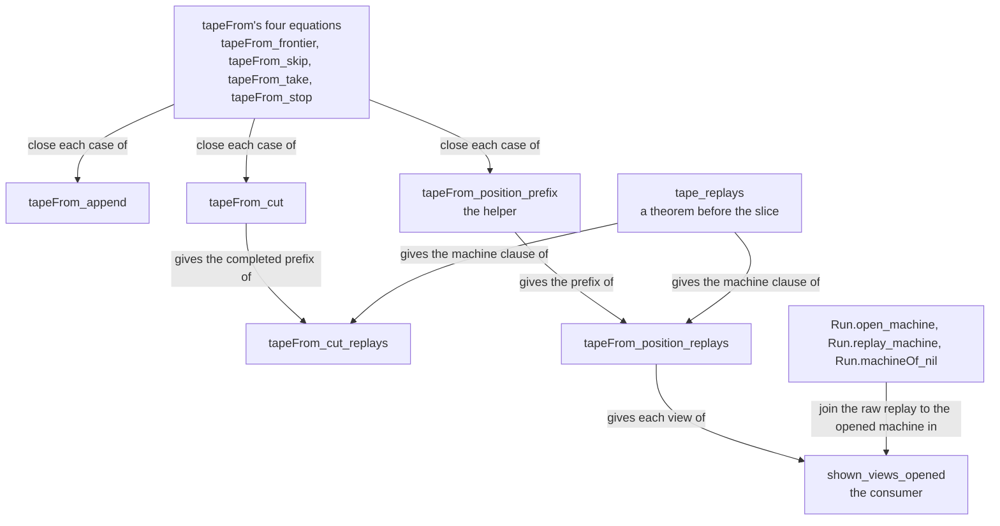

# 2026-10-06 seat CUTS design: a journal's completed prefix and its positions are raw replays

Status: a design note (history, not authority). Brief:
`docs/research/2026-10-05-claude-lead/briefs/seat-cuts-brief.md`. Base: `bc0ee4c1`. Evidence:
tested. A scratch probe at the base states and proves every statement below. The kernel accepts
each one at `[propext, Quot.sound]`. No statement of the slice is in the tree yet, so this note
claims no theorem.

## 1. The words

- **The journal's cut.** The split of a journal into a completed prefix and an unread rest.
  `tapeFrom` (`Test/Dogfood/Scenario.lean`) makes it: the positions come from the prefix, and
  the rest is `(tapeFrom s rows).2`. The semantics registry's cut is a different term.
- **A position.** One entry of the machine tape (`Position`): the decision that moved the
  machine, and the run after the row that gave it.
- **A stopped row.** The first unread row. `tapeFrom` stops there for one of two reasons.
  - **A frontier row** ends at a frontier (`tapeFrom_frontier`).
  - **A decision that the raw replay does not read past** (`tapeFrom_stop`): the row gives a
    decision, and `readsOn` answers false.

The second reason has one source, by reading. A control row that progressed always reads on
(`Run.advance_progressed`, `src/Effect4/Laws/Run.lean`). So such a row is a reply application.
The session applied the reply, because the guard is gone. The command budget did not cover
the rest of the step. The probe of §5 finds such a row on the crew.

## 2. The statements, as Lean elaborates them

Five statements stand beside `tapeFrom` in `Test/Dogfood/Scenario.lean`. Four are the brief's
connectors. The fifth, `tapeFrom_position_prefix`, is Codex's helper of the position law.

```lean
theorem tapeFrom_append (s : Run) (a b : List Command) :
    tapeFrom s (a ++ b) =
      if (tapeFrom s a).2 = [] then
        ((tapeFrom s a).1 ++ (tapeFrom (s.play a) b).1,
          (tapeFrom (s.play a) b).2)
      else ((tapeFrom s a).1, (tapeFrom s a).2 ++ b)

theorem tapeFrom_cut (s : Run) (rows : List Command) :
    ∃ done, rows = done ++ (tapeFrom s rows).2 ∧
      tapeFrom s done = ((tapeFrom s rows).1, [])

theorem tapeFrom_cut_replays (s : Run) (rows : List Command) :
    ∃ done, rows = done ++ (tapeFrom s rows).2 ∧
      tapeFrom s done = ((tapeFrom s rows).1, []) ∧
      (s.play done).machine =
        Run.machineOf (Run.replayFrom s.built.program s.built.table s.budget.fuel
          ((tapeFrom s rows).1.map (·.decision)) s.machine)

theorem tapeFrom_position_prefix (s : Run) (rows : List Command)
    (i : Nat) (position : Position)
    (found : (tapeFrom s rows).1[i]? = some position) :
    ∃ done tail, rows = done ++ tail ∧
      s.play done = position.after ∧
      tapeFrom s done = ((tapeFrom s rows).1.take (i + 1), [])

theorem tapeFrom_position_replays (s : Run) (rows : List Command)
    (i : Nat) (position : Position)
    (found : (tapeFrom s rows).1[i]? = some position) :
    position.after.machine =
      Run.machineOf (Run.replayFrom s.built.program s.built.table s.budget.fuel
        (((tapeFrom s rows).1.take (i + 1)).map (·.decision)) s.machine)
```

The consumer stands in `Test/Dogfood/Scenario/Tape.lean`, in the namespace
`Test.Dogfood.Scenario.Lowered`.

```lean
theorem shown_views_opened (l : Lowered) (b : Api.Built) (id : String) (budget : Api.Budget)
    (profile : String) (fresh : l.opened = Run.open b id budget profile) :
    l.shown.raw.map (·.2) = l.shown.views
```

The diagram shows which statement the proof of each statement uses. It claims no proof: the
evidence is the probe.



## 3. The differences from Codex's sketch

Codex's four statements are true as written, once they parse. The probe proves each one.

| Statement | Difference | Reason |
| --- | --- | --- |
| `tapeFrom_append`, `tapeFrom_cut`, `tapeFrom_cut_replays` | none | Each elaborates as written. |
| `tapeFrom_position_replays`, `tapeFrom_position_prefix` | The premise is named `found`, not `at`. | `at` is a reserved token. Lean answers `unexpected token 'at'; expected '_' or identifier`. |
| `shown_views_opened` | The fresh open is a premise, `fresh : l.opened = Run.open b id budget profile`. Codex writes a `let` at the head of the statement. | The brief asks for the premise. A statement that opens with `let` is no rewrite rule, and a fixture's run gives the premise by `rfl`. Codex's form follows by `rfl`: the probe proves it from this one. |
| `shown_views_opened` | Its placement is R8, with the concept `translation-simulation`. | The brief places the four connectors at R13, and names the consumer as R8's replay view. `tape_replays` stands at R8. |

Two facts of the elaboration are no difference, and they matter for the trust ceiling.

- The test `(tapeFrom s a).2 = []` elaborates with `List.instDecidableEqNil`. That instance
  asks no decidable equality of `Command`.
- No statement compares two values of `Position`, which holds a whole `Run`.

Codex's derivation of the position law compiles nearly as written. `tape_replays` takes the
empty rest from `congrArg Prod.snd`, and `rw` moves the two equations of the helper into it.

## 4. The lemma that closes each case

Each induction is over the journal, with the run general. The cases are `tapeFrom`'s own. I
split on the three tests that the definition makes, in its order:

1. the frontier test of the row's phase;
2. `decisionOf` of the row;
3. `readsOn` of the decision.

| Case | Equation | `tapeFrom_append` | `tapeFrom_cut` | `tapeFrom_position_prefix` |
| --- | --- | --- | --- | --- |
| no row | `tapeFrom` at `[]`, by `rfl` | both sides reduce, by `rfl` | `done := []` | no position: the premise is false |
| a frontier row | `tapeFrom_frontier` | `if_neg` with `List.cons_ne_nil` | `done := []` | no position: the premise is false |
| a row with no decision | `tapeFrom_skip` | the induction hypothesis at `s.step c` | `done := c :: done'` | `done := c :: done'`, the same index |
| a decision read on | `tapeFrom_take` | the induction hypothesis, then a split of the test | `done := c :: done'` | index zero: `done := [c]`; a successor: `done := c :: done'` at the index before |
| a decision not read on | `tapeFrom_stop` | `if_neg` with `List.cons_ne_nil` | `done := []` | no position: the premise is false |

`Run.play_cons` moves the run under a prepended row. No case needs `Run.play_append`,
`Run.step_built` or `Run.step_budget`: the statements name the run `s.play a`, and
`tape_replays` already carries the budgets.

| Statement | Proof |
| --- | --- |
| `tapeFrom_cut_replays` | `tapeFrom_cut` gives the prefix. `tape_replays` at that prefix gives the machine. |
| `tapeFrom_position_replays` | `tapeFrom_position_prefix` gives the prefix and the run. `tape_replays` at that prefix gives the machine. |
| `shown_views_opened` | `Run.replay_machine` and `Run.open_machine` turn each raw replay into `Run.replayFrom` from the opened machine. `List.range_succ_eq_map` splits the opened view from the positions' views. `Run.machineOf_nil` closes the opened view. `List.ext_getElem` and `tapeFrom_position_replays` close each position's view. |

The consumer uses its premise once, for `Run.open_machine`. The position law needs no fresh
open: it replays from the machine of the run that the tape was read from.

## 5. The controls

**Where.** The controls stand in `Test/Dogfood/Scenario/Tape.lean`, as one scenario's record
with its gate. `Test/Dogfood/Scenario.lean` builds no program, so it can hold no journal.
Decisions row 254 asks that every check be a control of a placed claim, and the gate holds a
control to its claim. The other choice is a list of `#guard` lines, which names its claim in a
comment only.

**The record.** Its name is `cuts`. Its claim is `shown_views_opened`. Its assembled clause is
`tapeFrom_position_replays`, which the claim's proof uses. Its associated laws are
`tapeFrom_cut_replays` and `tapeFrom_append`. Its observation is `machineView`.

**The runs.** Two scripts of the workers record are opened again at a small command budget.
The record writes no script.

| Run | Script of the workers record | What its journal holds |
| --- | --- | --- |
| `stopped` | `lowest` | Five positions, then one reply application that the session applies and the raw replay does not read past. |
| `frontier` | `cancelled-root` | Two positions, two held calls, then the root's cancellation, which ends at a frontier. |

**The budget.** The command budget is 60. The scratch probe `Explore3.lean` measures, on the
crew, the least budget at which each row reads on: tested, a finite probe.

| Row | Least budget |
| --- | --- |
| the start | 40 |
| the flush | 29 |
| the first three reply applications of `lowest` | 11, 12, 11 |
| the last reply application of `lowest` | 103 |
| the root's cancellation | 84 |

So each budget from 40 to 83 gives both journals their shape. A change of the crew or of the
machine's command counts can move the bounds. Each control then fails by its shape test, and
the budget is pinned again.

**The controls.** Each compares `machineView`, or the tape's decisions and unread rows.

| Entry | Colour | What the control shows |
| --- | --- | --- |
| `cut` | green | On `stopped`, the completed prefix ends before the stopped row, and its machine shows the raw replay of the five decisions. |
| `cut` | green | On `frontier`, the completed prefix ends before the frontier row, after the two held calls, and its machine shows the raw replay of the two decisions. |
| `cut` | red | On `stopped`, the stopped row's own machine shows another view than the raw replay of the completed prefix's decisions. |
| `cut` | red | On `frontier`, the frontier row's own machine shows another view too. |
| `position` | green | On `stopped`, the lowered run's raw views are its session views at every position, and one row stays unread. |
| `position` | red | On a run that has started before the script, the raw replay of a new load shows another opened view. |
| `append` | green | Split at each row, the tape of `stopped` is the tape of its first part, then the tape of the rest from the run after it. |
| `append` | red | A flush after the stopped row is not read. From the stopped row's own machine it would give a position. |

The first three rows of the table are the brief's three controls. The probe `Explore4.lean`
computes every comparison above with the expected answer: tested, a finite probe.

**The header of `Tape.lean`.** It says that the module has no control and no gate, so it
builds whatever the committed fixtures hold. The new gate reads no fixture, so the module
still builds whatever they hold. I reword the sentence to say so. `Test/Dogfood/README.md`
holds the same sentence, and it is not my file: the receipt proposes its new wording.

## 6. The steps

1. This note.
2. The four connectors as planned goals, each with its placement, and their plan status pinned.
3. `tapeFrom_append`, proved in place.
4. `tapeFrom_cut` and `tapeFrom_cut_replays`, proved in place.
5. The helper, and `tapeFrom_position_replays` proved in place. The axioms are pinned.
6. The consumer, with its axioms and its plan status pinned.
7. The record, its controls and its gate.
8. The receipt.

## 7. What the slice does not establish

- The machine after a stopped row. The red controls show that it is not the replay of the
  completed prefix. No law states what it is.
- A continuation. A second run command on a stopped row's machine is no continuation of the
  first (row 226).
- Equal session ledgers. The raw replay has no session.
- `Shown.agrees`. It also needs a tape that reads every row.
- Anything about a lowered engine. The engine's finite comparisons stay as they are.
- The consumer at a run that is not a fresh open.
