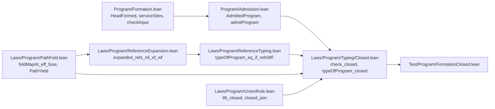

# 2026-10-06 seat FORM receipt: a type variable is formed in a template only, and a formed program that the checker admits has closed types

Status: receipt (history, not authority). Brief:
`docs/research/2026-10-05-claude-lead/briefs/seat-form-brief.md`, with the dispatch message.
Design note: `docs/research/2026-10-06-seat-FORM-design.md`. The coordinator sent three
messages after the dispatch: four answers to the design note, two organization requests, and
the request to merge main.

**The one thing to know before merging:** the carrier step, commit `2d3a9c81`, refuses more
than a type variable. It makes a declared service carrier a strict formation site, so every
clause of formation applies there. Program admission now refuses four kinds of declared
carrier:

- a carrier that holds a type variable;
- a carrier that repeats a field name;
- a carrier with a map key that is no string;
- a carrier with a deferred's error column outside the error alphabet.

Until the step no carrier was a formation site. So decisions rows 192, 193, 42 and 120 did not
reach a carrier. No typing signature of the tree declares such a carrier (tested: the default
build passes, and no older battery changed). The step changes the type of
`AdmittedProgram.formed`. It is one commit. Its reverse patch applies to five of its six files
(tested on `2f473187`). In the sixth, `src/Effect4/Laws/Program/Typing/Closed.lean`, the
import list and the header need a hand edit.

Ten more facts stand beside it.

- **The planned goal is a theorem.** `check_closed` is stated as a planned goal in `09fec1e3`
  and proved in place in `0cf6b3c0`. Each type operation of the checker keeps closed types
  closed. No planned goal of the slice is open.
- **`make check-cases` refuses two rows until the policy is pinned.** Item 4 gives the two
  lines and the pin. With the pin on a scratch copy of the policy, the census passes (tested).
- **The checker narrows too, at two rules.** The record rule of the term typer and the row rule
  read strict formation. So `HasTy` gives no type to a record declaration that holds a
  variable. It gives none to a row use whose instantiated column holds one. No law proof
  needed a repair.
- **Two verdicts of older batteries moved.** Each guard states the new verdict: the pin of
  decisions row 212, and one module refusal (item 6).
- **No stored program holds a variable in an annotation.** Four corpora hold 560 programs, and
  the new reason refuses none of them (tested, item 6).
- **Main is merged at `9d50ac20`**, as the coordinator asked. The merge commit `4e41a09f` has
  no conflict. I did not build it alone. Its child `2f473187` is built.
- **The nine fusion laws are in `src/Effect4/Laws/Program/PathFold.lean`**, in the bundled
  form: one hypothesis in place of seven (item 8).
- **The combinator's law replaces the slice's lemma.** `Record.closed_fieldType` and
  `Record.closed_setType` are `UnionRule.lift_closed` at their member rules. Four lemmas are
  cut, `Ty.closed_memberwise` among them (item 8).
- **`generated/semantics.md` is stale until `make gen-semantics` runs.** R14 gains 97 placed
  theorems, since the brief asks for a tag on each new theorem (item 9, proposal P7).
- **I edited none of the coordinator's files.** Item 9 holds the proposed text for the
  semantics registry, the documents and the decisions register.

The sections below carry item numbers. Item 1 is the bold paragraph above.

## 2. Base, head and commits

| Item | Value |
| --- | --- |
| Branch | `seat/form`, in the worktree `/Users/pooks/Dev/lean4-effect4-qsteps` |
| Base | `ea0f584a` |
| Main-line head taken in | `9d50ac20`, by the merge commit `4e41a09f` |
| Head | the commit that holds this receipt; its parent is `2d14f2c8` |

Nothing is pushed.

| Commit | Step | Content |
| --- | --- | --- |
| `b2345689` | 0 | the design note |
| `d5d4a5f0` | 1 | the clause and its reason; the regenerated refusal alphabet; the guard list; two moved guards |
| `09fec1e3` | 2 | the new law module, with `check_closed` as a planned goal, placed; the import in the Laws root |
| `0cf6b3c0` | 2 | the goal proved in place |
| `c994ddd4` | 3 | the battery and its import |
| `136b1cb0` | 3 | `typeOfProgram_closed`: the whole-program checker, with layer references |
| `2d3a9c81` | 4 | the carrier step, separable (item 1) |
| `4e41a09f` | 5 | the merge of main at `9d50ac20` |
| `2f473187` | 5 | the fusion laws moved and bundled; the combinator's law in place of the slice's lemma |
| `2d14f2c8` | 5 | one direct import line in the new law module |
| the head | 6 | this receipt |

## 3. Changed files

`git diff --stat 9d50ac20..2d14f2c8` lists 14 files. This receipt is the fifteenth.

| Group | File | What changed |
| --- | --- | --- |
| The `Effect4` root | `src/Effect4/Program/Formation.lean` | the clause `.var _ => template = true` of `HeadFormed`; the reason `FormationReason.typeVariable`, appended last; `Formation.reason` answers it. In the carrier step: `serviceSites`; `input`, `InputFormed`, `checkInput` and `checkInput_eq_none_iff` take the declared carriers, with the empty list as the default |
| The `Effect4` root | `src/Effect4/Program/Admission.lean` | in the carrier step: `AdmittedProgram.formed` and `admitProgram` read the application's carriers; the premise of `admitProgram_type_int` names them; item 4 of the module text |
| The `Effect4` root, generated | `src/Effect4/Api/RefusalsDerived.lean` | nine lines: the reason's `Canonical` instance at constructor 3, and the appended guard list |
| The generator's input | `tools/Effect4Gen/guards/refusals.lean` | the guard list `formationReasons` gains the reason |
| The laws | `src/Effect4/Laws/Program/Typing/Closed.lean` | new: 88 theorems and 24 definitions, in seven sections |
| The laws | `src/Effect4/Laws/Program/PathFold.lean` | one import; a paragraph of the header; a last section with nine fusion theorems |
| The laws | `src/Effect4/Laws/Program/CheckedTyping.lean`, `src/Effect4/Laws/Run.lean` | in the carrier step, one line each: the certificate's field `formed` names the carriers |
| The laws | `src/Effect4/Laws.lean` | one import, directly after `import Effect4.Laws.Api.Formation` |
| The batteries | `Test/Program/FormationClosed.lean` | new: 50 guards, 5 examples, 2 theorems and 12 printed axiom lines |
| The batteries | `Test/Program/FormationContract.lean` | one guard moved, with its comment |
| The batteries | `Test/Codegen/TermRows.lean` | one guard moved, and one new guard that keeps the printer's refusal under control |
| The batteries | `Test/All.lean` | one import, directly after `import Test.Program.FormationContract` |
| The notes | `docs/research/2026-10-06-seat-FORM-design.md`, and this receipt | new |

The new law module imports in this order. An arrow reads "is imported by". The diagram shows
direct imports only, and not each one. It claims no proof.



I edited none of the coordinator's files: `docs/core/decisions.md`, `docs/STATE.md`,
`lakefile.toml`, `generated/semantics.md`, `docs/core/semantics.md` and
`tools/Tools/SemanticsRegistry.lean`. The merge took main's side in each. I edited no case
policy and no compatibility policy. I edited no contract packet.

## 4. Commands, results and evidence

Each Lean, Lake or `make` command ran through
`/Users/pooks/Dev/lean4-effect4/scratch/lean-slot.sh`, named `SLOT` below. Each `make` took the
flags `-o build -o ts/eff/node_modules -o harness/truth/node_modules`, named `FLAGS`. The
scratch folder is
`/private/tmp/claude-501/-Users-pooks-Dev-lean4-effect4/acf2315e-02ac-4acd-9ef9-b0734bd686a7/scratchpad/seat-form/`,
named `SCRATCH`. It holds each log.

| Command | Result | Evidence |
| --- | --- | --- |
| `SLOT lake env lean SCRATCH/exp2_statement.lean`, on the base | the statement of `check_closed` elaborates as a proposition; the base verdicts of five programs and of the carrier (`exp2_statement.base.out`) | tested, on the base |
| `SLOT python3 scripts/generate.py --only derived`, after the clause | `PASS generate`; one file moved, `src/Effect4/Api/RefusalsDerived.lean` | tested |
| `SLOT lake build Effect4Laws`, after the clause | `Build completed successfully (696 jobs)`. No law proof needed a repair | tested |
| a narrow build of the batteries that read formation, two runs | the first run stops at one guard of `Test/Codegen/TermRows.lean`, the second moved verdict; the second run passes (480 jobs). The target list is not on file | tested |
| `SLOT lake build Effect4.Laws.Program.Typing.Closed` on `09fec1e3`, and `SLOT lake build Effect4.Laws` on `09fec1e3` and on `0cf6b3c0` | each passes, as the commit messages record. No log is on file | tested |
| `SLOT lake build Test.Program.FormationClosed` on `c994ddd4`, and `SLOT lake build Test.Program.FormationClosed Effect4.Laws` on `136b1cb0` | each passes, as the commit messages record. No log is on file | tested |
| `SLOT lake build Effect4Laws`, on the tree of `2d3a9c81` | `Build completed successfully (697 jobs)` | tested |
| `SLOT lake build`, five runs | each `Build completed successfully`; the table below | proved, and tested |
| `SLOT make FLAGS gen-fixtures`, on `2d3a9c81` and on `2f473187` | `PASS generate: requested producers ran in dependency order`, each time. No tracked file moved | tested |
| `SLOT make FLAGS check-cases`, on `2d3a9c81` and on `2f473187` | `conform cases: REFUSED, exit 1`, each time, with the same two lines (below) | tested |
| the census's own command, with a scratch copy of the policy that holds the pin | `conform-cases: 231/231 subjects, 231 pass, 0 refused, 0 counterexample, 0 unresolved, exit 0` | tested |
| `SLOT make FLAGS check-docs`, on `2d3a9c81` and on `2f473187` | `PASS check-docs: every path, link, citation and make target in 76 documents resolves`, each time | tested |
| `SLOT python3 scripts/generate.py --only derived`, on `2d3a9c81` and on `2f473187` | `PASS generate`, each time. No file moved: the committed file is the generator's output | tested |
| `SLOT lake env lean SCRATCH/count_truth.lean`, and `SCRATCH/count_goldens.lean`, on `2d3a9c81` and on `2d14f2c8` | the four lines of item 6, the same each time | tested |
| `git merge --no-commit --no-ff 9d50ac20` | `Automatic merge went well`; no unmerged path | tested |
| `SLOT lake build Effect4.Laws.Program.PathFold Effect4.Laws.Program.Typing.Closed`, after the merge | `Build completed successfully (287 jobs)` | tested |
| `SLOT lake env lean -DwarningAsError=true SCRATCH/statements2.lean`, on `2f473187` | the statements, the axioms and the plan status of item 5; the head verdicts of item 6 | tested |
| `SLOT lake env lean -DwarningAsError=true SCRATCH/binder_head.lean`, on `2d14f2c8` | the fifth battery program: no type from the checker alone, a formation refusal, not admitted | tested |
| `git apply --check -R`, on the patch of `2d3a9c81`, file by file, on `2f473187` | five files pass. `src/Effect4/Laws/Program/Typing/Closed.lean` fails at its first hunk | tested |
| `python3 scripts/check-language.py --strict` on the design note and on this receipt | `PASS check-language: no finding in` the file, for each | tested |

The default builds, with the gate lines that `Test/All.lean` prints:

| Tree | Jobs | API and Laws-only modules | Modules, declarations | Planned goals, declarations on goals | Proof style: uses, unread, entries |
| --- | --- | --- | --- | --- | --- |
| `c994ddd4` | 1039 | 179, 323 | 789, 92151 | 28, 12 | 1911, 52, 1161 |
| `2d3a9c81` | 1039 | 179, 323 | 789, 92339 | 28, 12 | 1911, 52, 1161 |
| `2f473187`, before its battery comment | 1045 | 181, 325 | 795, 92632 | 28, 12 | 1911, 52, 1161 |
| `2f473187` | 1045 | 181, 325 | 795, 92632 | 28, 12 | 1911, 52, 1161 |
| `2d14f2c8` | 1045 | 181, 325 | 795, 92632 | 28, 12 | 1911, 52, 1161 |

On each run the library-root gate reports that every library source is reachable, and that
`Effect4` never reaches Laws. The axiom gate reports the semantic and test axioms at
`[propext, Quot.sound]`, with the exact implementation boundary of 17 modules and 23
declarations. The goal gate reports that no other declaration reaches `sorryAx`. The
proof-style gate refuses nothing. I ran no default build on the base, and none on the merge
commit alone. The head commit adds this receipt only, and no build ran after it.

### The two lines of `make check-cases`

```text
counterexample lcnf.cases.default caseSite:Effect4.Program.Ty/Effect4.Program.Formation.instDecidableHeadFormed/0: `Effect4.Program.Formation.instDecidableHeadFormed`'s default arm on `Effect4.Program.Ty` does not match its cover: covered but no longer absorbed (stale policy): var. absorbed = never, unit, nat, int, string, bool, handle, option, list, prod, except, exitOf, causeOf, fiberOf, union, lit, refOf, unknown, tuple, app, null, undefined, number, bytes, cover = never, unit, nat, int, string, bool, handle, option, list, prod, except, exitOf, causeOf, fiberOf, union, lit, refOf, var, unknown, tuple, app, null, undefined, number, bytes
counterexample lcnf.cases.default caseSite:Effect4.Program.Ty/Effect4.Program.Formation.reason/0: `Effect4.Program.Formation.reason`'s default arm on `Effect4.Program.Ty` does not match its cover: covered but no longer absorbed (stale policy): var. absorbed = never, unit, nat, int, string, bool, handle, option, list, prod, except, exitOf, causeOf, fiberOf, union, lit, refOf, unknown, map, tuple, app, null, undefined, number, bytes, cover = never, unit, nat, int, string, bool, handle, option, list, prod, except, exitOf, causeOf, fiberOf, union, lit, refOf, var, unknown, map, tuple, app, null, undefined, number, bytes
conform-cases: 231/231 subjects, 229 pass, 0 refused, 2 counterexample, 0 unresolved, exit 1
```

**The pin, which is the coordinator's.** In `tools/Conform/Effect4/cases-policy.json`, family
`Effect4.Program.Ty`, delete the line `"var",` from the `cover` of two functions:
`Effect4.Program.Formation.instDecidableHeadFormed` and `Effect4.Program.Formation.reason`.
Each function now names the variable in an arm of its own. `SCRATCH/cases-policy.proposed.json`
is that policy. The census on `2f473187` gives the same two lines, so the merge and the
reorganization move no other row.

### Not run

- `make check-gen`, `make check-slow`, `make check-corpus`, `make check-target`,
  `make check-truth`, the conservativity script and `make gen-semantics`.
- `make check`, `make check-full` and `make status`, as targets.
- `make check-semantics`, `make gen-architecture`, `make record-proof-style` and
  `make check-language`.
- `make check-tsdiag` and `make check-schema-ts`, which the dispatch names as red.
- Every TypeScript lane and every host run. No generated TypeScript file moved.
- Every OCaml run. No generated OCaml file moved.
- A default build on the base, on the merge commit alone, and on a tree without the carrier
  step after `c994ddd4`.

### Red or stale for a reason outside the slice

Nothing that I ran is red for such a reason. Three older states showed, and I left each:

- the guard list `formationReasons` (`tools/Effect4Gen/guards/refusals.lean`) does not hold
  `FormationReason.deferredError`. The instance's laws cover that reason, and the finite guards
  do not;
- twelve older lines of `src/Effect4/Laws/Program/PathFold.lean` are longer than 100 columns;
- the proof-style gate lists 52 unread commands, as its baseline records.

### What is proved, and what is only tested

| Claim | Evidence |
| --- | --- |
| A formed program that the checker admits has closed types, at a closed environment and a typing signature with closed atoms and closed carriers | proved: `check_closed` |
| The same, for the whole-program checker, with no premise on a layer reference | proved: `typeOfProgram_closed` |
| A program that program admission admits has closed types, with no premise | proved: `AdmittedProgram.closed` (in the carrier step) |
| The native typing signature has closed atoms and closed carriers, at every row table | proved: `closedSig_native` |
| An application's typing signature has them, when its declared carriers are formed | proved: `closedSig_app` (in the carrier step) |
| A type whose sites are formed outside a template is closed | proved: `Formation.closed_of_formed` |
| Each rule of the six typing judgments keeps closed types closed | proved: `hasTy_closed` and its five siblings |
| The row rule answers closed types, with no premise on the row | proved: `closed_rowTy` |
| A program's expansion states what the program states | proved: `Formation.annotationsAll_expandRefs` |
| A path fold, through a homomorphism that reads no path, is the fold with no path | proved: `foldMapAt_eff_fuse`, its six siblings, and the two laws of a term |
| Formation refuses a variable at each of the five kinds of annotation site, with its path | tested: one program for each kind |
| Each premise of `check_closed` is needed | tested, at one program for each of the four parts: formation, the environment, the atoms and the carriers. For the last two, the failure of `ClosedSig` at that program is proved: `openAtoms_not_closed` and `openCarrier_not_closed` |
| A row whose columns hold a parameter is still formed, typed and admitted | tested: one host row, and each native row |
| No program of the four corpora holds a variable in an annotation | tested: 560 programs |
| The base verdicts of item 6 | tested on the base for five programs and one carrier. The item marks each other one as assumed or as not known |

No evidence of the slice is host-only, and no host ran. Each guard of the battery is bounded:
one program each. The four counts are bounded by their corpora. The theorems are not bounded in
the operation alphabet, in the typing signature or in the program.

## 5. The statements as compiled, with axioms and plan status

`SCRATCH/statements2.out` holds the full output. The main statements:

```lean
structure ClosedSig {Op : Type} (sig : Signature Op) : Prop where
  atom : ∀ (name : String) (tys : List Ty) (ty : Ty), sig.atomOf name tys = some ty →
    (∀ t ∈ tys, t.closed = true) → ty.closed = true
  service : ∀ (key : ServiceKey) (ty : Ty), sig.serviceTy key = some ty → ty.closed = true

@check_closed : ∀ {Op : Type} [inst : ScopedOp Op] (sig : Signature Op),
  ClosedSig sig →
    ∀ {env : TyEnv},
      (∀ (t : Ty), t ∈ env → t.closed = true) →
        ∀ {p : List Nat} {e : Eff Op} {t : EffTy},
          Formation.Formed (Formation.programSites e) →
            Checker.check sig env p e = Except.ok t → t.answer.closed = true ∧ t.error.closed = true
@typeOfProgram_closed : ∀ {Op : Type} [inst : ScopedOp Op] (sig : Signature Op),
  ClosedSig sig →
    ∀ {e : Eff Op} {t : EffTy},
      Formation.Formed (Formation.programSites e) →
        typeOfProgram sig e = some t → t.answer.closed = true ∧ t.error.closed = true
@AdmittedProgram.closed : ∀ {program : NativeEff} {app : SigApp} (admitted : AdmittedProgram program app),
  admitted.ty.answer.closed = true ∧ admitted.ty.error.closed = true
typeOfProgram_closed_app : ∀ (app : SigApp) {e : NativeEff} {t : EffTy},
  Formation.InputFormed e app.rows app.services →
    typeOfProgram app.signature e = some t → t.answer.closed = true ∧ t.error.closed = true
closedSig_native : ∀ (table : RowTable), ClosedSig (nativeSignature table)
closedSig_app : ∀ (app : SigApp), Formation.Formed (Formation.serviceSites app.services) → ClosedSig app.signature
@hasTy_closed : ∀ {Op : Type} [inst : ScopedOp Op] {sig : Signature Op},
  ClosedSig sig →
    ∀ {env : TyEnv} {e : Eff Op} {t : EffTy},
      HasTy sig env e t → ClosedEnv env → Formation.AnnotationsClosed EffFam.eff e → t.Closed
@Formation.closed_of_formed : ∀ {path : List String} {ty : Ty},
  Formation.Formed (Formation.sites false path ty) → ty.closed = true
@Formation.programAnnotations_all : ∀ {Op : Type} [inst : ScopedOp Op] (P : Ty → Prop) (e : Eff Op),
  Formation.allTypes P (Formation.programAnnotations e) ↔ Formation.AnnotationsAll P EffFam.eff e
@Formation.annotationsAll_expandRefs : ∀ {Op : Type} [inst : ScopedOp Op] (P : Ty → Prop) (root : Eff Op),
  Formation.AnnotationsAll P EffFam.eff root → Formation.AnnotationsAll P EffFam.eff root.expandRefs
@closed_rowTy : ∀ {row : Program.Row} {request : Ty} {use : Option TermUse} {t : EffTy},
  rowTy row request use = some t → t.Closed
@foldMapAt_eff_fuse : ∀ {Op : Type} {M : Type u_1} {N : Type u_2} (φ : M → N) {unit : M} {op : M → M → M} {unit' : N}
  {op' : N → N → N},
  (∀ (a b : M), φ (op a b) = op' (φ a) (φ b)) →
    ∀ {f : (fam : EffFam) → EffSelfCarrier Op fam → List Nat → M} {g : (fam : EffFam) → EffSelfCarrier Op fam → N},
      (∀ (fam : EffFam) (n : EffSelfCarrier Op fam) (q : List Nat), φ (f fam n q) = g fam n) →
        ∀ (e : Eff Op) (p : List Nat),
          φ
              (foldMapAt_eff unit op p e (f EffFam.eff) (f EffFam.stmt) (f EffFam.stmts) (f EffFam.effs)
                (f EffFam.action) (f EffFam.layer) (f EffFam.layers)) =
            foldMap_eff unit' op' e (g EffFam.eff) (g EffFam.stmt) (g EffFam.stmts) (g EffFam.effs) (g EffFam.action)
              (g EffFam.layer) (g EffFam.layers)
```

The axioms, from the same file. The axiom gate holds every declaration of the slice at
`[propext, Quot.sound]`.

```text
'Effect4.Program.check_closed' depends on axioms: [propext, Quot.sound]
'Effect4.Program.typeOfProgram_closed' depends on axioms: [propext, Quot.sound]
'Effect4.Program.AdmittedProgram.closed' depends on axioms: [propext, Quot.sound]
'Effect4.Program.typeOfProgram_closed_app' depends on axioms: [propext, Quot.sound]
'Effect4.Program.closedSig_native' depends on axioms: [propext, Quot.sound]
'Effect4.Program.closedSig_app' depends on axioms: [propext, Quot.sound]
'Effect4.Program.hasTy_closed' depends on axioms: [propext, Quot.sound]
'Effect4.Program.Formation.closed_of_formed' depends on axioms: [propext, Quot.sound]
'Effect4.Program.Formation.programAnnotations_all' depends on axioms: [propext, Quot.sound]
'Effect4.Program.Formation.annotationsAll_expandRefs' depends on axioms: [propext, Quot.sound]
'Effect4.Program.foldMapAt_eff_fuse' depends on axioms: [propext]
'Effect4.Program.foldMapAt_stmt_fuse' depends on axioms: [propext]
'Effect4.Program.foldMapAt_stmts_fuse' depends on axioms: [propext]
'Effect4.Program.foldMapAt_effs_fuse' depends on axioms: [propext]
'Effect4.Program.foldMapAt_action_fuse' depends on axioms: [propext]
'Effect4.Program.foldMapAt_layer_fuse' depends on axioms: [propext]
'Effect4.Program.foldMapAt_layers_fuse' depends on axioms: [propext]
'Effect4.Program.foldMapAt_term_fuse' depends on axioms: [propext]
'Effect4.Program.foldMapAt_terms_fuse' depends on axioms: [propext]
'Effect4.Program.Record.closed_fieldType' depends on axioms: [propext, Quot.sound]
'Effect4.Program.Record.closed_setType' depends on axioms: [propext, Quot.sound]
```

The plan status:

```text
Effect4.Program.check_closed: proved; nearest []; 0 lemmas, 0 definitions
next goals: 0
Effect4.Program.typeOfProgram_closed: proved; nearest []; 0 lemmas, 0 definitions
next goals: 0
Effect4.Program.AdmittedProgram.closed: proved; nearest []; 0 lemmas, 0 definitions
next goals: 0
Effect4.Program.closedSig_native: proved; nearest []; 0 lemmas, 0 definitions
next goals: 0
Effect4.Program.hasTy_closed: proved; nearest []; 0 lemmas, 0 definitions
next goals: 0
```

No statement of the slice rests on a planned goal. The goal gate counts 28 planned goals on
each tree that I built, and none of them is the slice's.

## 6. Each verdict that moved, and the count

A verdict is the answer of one boundary on one input. The base column is the answer on
`ea0f584a`. "Tested on the base" is `SCRATCH/exp2_statement.base.out`. "The old guard" is the
guard as the base holds it.

### By the clause, commit `d5d4a5f0`

| Input | Boundary | Base | Head | Evidence of the base; pin of the head |
| --- | --- | --- | --- | --- |
| `Deferred.make<T0, number>()` | `admitProgram`, at the empty application | admitted | refused: formation, at `program, argument, 0, op, typeArgs, 0, type, 0`, the type `T0`, the reason `typeVariable` | the old guard; `Test/Program/FormationContract.lean` |
| `Deferred.make<T0, never>()` | `Api.emitModule` | refused by the printer: `typeSpelling "A"` | refused: formation, at the same path, with the same reason | the old guard; `Test/Codegen/TermRows.lean` |
| `succeed` of a record whose field `a` is declared at `T7` | `admitProgram` | admitted | refused: formation, at `program, argument, 0, term, fields, type, 1` | tested on the base; the new battery |
| the same | the checker alone | the type `{ readonly a?: T7 }`, not closed | no type. `Api.explain` names the record term and its declaration | tested on the base; the new battery |
| `Deferred.make<T5, number>()` | `admitProgram` | admitted | refused: formation, at `program, argument, 0, op, typeArgs, 0, type, 0` | tested on the base; the new battery |
| a loop whose cursor type is stated at `number \| T2` | `admitProgram` | admitted | refused: formation, at `program, cursorTy, type, 2` | tested on the base; the new battery |
| a list fold whose accumulator is stated at `number \| T2` | `admitProgram` | admitted | refused: formation, at `program, argument, 0, term, accTy, type, 2` | tested on the base; the new battery |
| `Ref.make` of that fold | `admitProgram` | admitted | refused: formation, at `program, argument, 1, term, accTy, type, 2` | tested on the base; `SCRATCH/statements2.out` |
| the same | the checker alone | the type `Ref.Ref<number \| T2>`, not closed | no type: the row rule refuses the instantiated column | tested on the base; `SCRATCH/statements2.out` |
| `Ref.update` whose binder term holds that fold | `admitProgram` | not known: not run on the base. Formation had no rule to refuse it | refused: formation, at `program, 1, argument, 0, op, term, accTy, type, 2`. The checker alone gives it no type at the head | the new battery; `SCRATCH/binder_head.out` |
| a row with the request `T0`, used at the request `T3` | `checkRow` | assumed accepted: not run on the base | refused: formation, at `row, request, type, 0`, the type `T3` | the new battery |

Three verdicts of the checker alone do not move, and the battery pins each. It still types
`Deferred.make<T5, number>()` at `Deferred<never, number>`. It still types the stated cursor and
the stated accumulator at `number | T2`, which is not closed. Formation refuses those three
programs, and the checker does not. So `check_closed` needs its formation premise.

Every checked boundary shares the refusal of the five battery programs: `admitProgram`,
`Api.emitModule`, `Api.printDecl` and `Api.replayChecked` (tested at the head). On the base I
ran `admitProgram` alone on such programs. The old guard above is the one base answer of
`Api.emitModule`.

### By the carrier step, commit `2d3a9c81`

| Input | Boundary | Before the step | Head | Evidence of the earlier answer; pin of the head |
| --- | --- | --- | --- | --- |
| the declared carrier `Ref<T3>`, and the program `Effect.service(key)` | `admitSig` | accepted | accepted | tested on the base; the new battery |
| the same | `admitProgram` | admitted, at the type `Ref.Ref<T3>` | refused: formation, at `service, 0, carrier, type, 1`, the type `T3`, the reason `typeVariable` | tested on the base, and a guard of `c994ddd4`; the new battery |
| the declared carrier `Ref<{ x: number; x?: string }>`, and `succeed` of a unit | `admitProgram` | assumed admitted: not run | refused: formation, the reason `repeatedField "x"` | the new battery |
| the declared carrier `Ref<Record<number, number>>`, and the same program | `admitProgram` | assumed admitted: not run | refused: formation, the reason `mapKey` | the new battery |
| the declared carrier `Ref<Deferred<number, boolean>>`, and the same program | `admitProgram` | assumed admitted: not run | refused: formation, the reason `deferredError` | the new battery |

`admitSig` accepts each of the four carriers before and after: the step is in the formation
pass of `admitProgram`. A boundary at a row table alone reads the sites that it read before
(tested: five programs). No battery of the tree changed with the step.

### The count

Four corpora are enumerable, and I measured each on `2d3a9c81` and again on `2d14f2c8`.

| Corpus | Programs | Annotations | Programs that hold a variable in an annotation | Refused with the new reason |
| --- | --- | --- | --- | --- |
| the truth lane, `OCaml5.Truth.corpus` (`harness/truth/Truth.lean`) | 73 | 562 | 0 | 0 |
| the wire corpus, `Wire.Corpus.all` | 8 | 2 | 0 | 0 |
| the generated corpus, `Test.Program.Gen.sample` | 400 | 14 | 0 | 0 |
| the golden programs, `OCaml5.Eff.Corpus.corpus` | 79 | 23 | 0 | 0 |

The battery pins the zero of the wire corpus and of the generated corpus. The generated corpus
states 14 annotations in 400 programs, so it exercises the annotation sites thinly.

The batteries are not enumerable as data. A search of the tracked Lean files finds four places
that write a type variable in an annotation, outside the new battery.

| Place | What it holds | Verdicts |
| --- | --- | --- |
| `Test/Program/FormationContract.lean` | `Deferred.make<T0, number>()`, in three guards | `admitProgram` moves. The checker's type and the collector's list do not |
| `Test/Codegen/TermRows.lean` | `Deferred.make<T0, never>()`, in two guards | `Api.emitModule` moves. The printer alone does not: it refuses the spelling as before |
| `Test/Codegen/RecordTerms.lean` | a record term declared at `T99`, in one guard | none: the guard reads the two faces alone |
| `Test/Codegen/Record.lean` | a record declaration at `T99`, in one guard | none: the guard reads the record syntax alone |

The search has a limit: it reads text, so it does not see a variable behind a name. The
default build is the wider check. Each battery guard passes on it, and I changed two guards.
No tracked fixture and no generator writes a variable in an annotation (tested: a search of
the tracked files that are no Lean source). The type printer has no form for a variable, so no
TypeScript reading gives one (`Types.ofTy`, `src/Effect4/Codegen/Types.lean`; pinned by
`Test/Codegen/TypeReader.lean`).

`Test/contracts/` holds no sentence that states the old behaviour (tested: a search of the
packets for a type argument, a parameter and `never`). `Test/contracts/faces.contract.md` says
that raw formation reaches a type argument. That stays true.

## 7. Each landed theorem's placement

**The clause** (`Formation.HeadFormed`, `src/Effect4/Program/Formation.lean`):

- Concept: `subtyping-algebra`; claim: `raw-formation`, role decidability. Its pointer
  `Formation.checkInput_eq_none_iff` keeps its name. Its statement now covers a variable, and
  the declared carriers after the carrier step.
- Reach: every annotation of a program, each instantiated column of a row use, and each record
  declaration that the term typer reads. A row's column in a table is a template site.
- It does not establish closed types of the checker: an atom and a carrier are no annotation.
- Consumer: `Formation.closed_of_formed`, and through it `check_closed`.

**`check_closed`** (`src/Effect4/Laws/Program/Typing/Closed.lean`), tagged
`@[semantics "subtyping-algebra" (requirement := R14)]`:

- Concept: `subtyping-algebra`; claim: the proposed `checked-types-closed`, role inversion.
- Reach: every operation alphabet; the structural checker `Checker.check` at any path. Three
  premises: a closed environment, a typing signature with closed atoms and closed carriers
  (`ClosedSig`), and annotations formed outside a template. No premise on a row.
- It does not establish a type of a program with a layer reference: `Checker.check` refuses
  one. It gives no closed type of a sketch with a gap, and nothing of a run.
- It unlocks stage 6 of the study's plan: a gap is then the only open leaf of a sketch's type.
  It serves R14, and the premise that the brief names for `ofSchema_schema`.

**`typeOfProgram_closed`** (the same file), tagged the same:

- Concept and claim: the same claim, at the checker that program admission and the API run.
- Reach: every operation alphabet; `ClosedSig`; formation of the stored program. No premise on
  a layer reference: an expansion states what the program states.
- It does not establish that the references are well formed. The checker's own test does that.
- Consumers: `typeOfProgram_closed_app`, `AdmittedProgram.closed`, and the battery.

**`AdmittedProgram.closed`** and **`typeOfProgram_closed_app`** (the same file, section 7; in
the carrier step), tagged the same:

- Concept and claim: the same claim, at program admission.
- Reach: the native alphabet; any application's typing signature. The first has no premise. The
  second asks the formed input alone.
- They do not establish closed carriers from `admitSig` alone (finding F2).
- Consumer: none in the tree yet. The brief names the type printer and the codec.

**`closedSig_native`** and **`closedSig_app`** (the same file): the two typing signatures of
the tree have the premise `ClosedSig`. The first holds at every row table. The second asks
formed carriers. Consumers: the three corollaries above, and the battery.

**`hasTy_closed`** and its five siblings (the same file): the claim at the six judgments, one
line for each rule. Reach: `ClosedSig`, a closed environment, and the annotations' fold.
Consumer: `check_closed` through `check_sound`, and `typeOfProgram_closed` through
`effTy_sound`.

**`foldMapAt_eff_fuse`**, its six siblings and the two laws of a term
(`src/Effect4/Laws/Program/PathFold.lean`), tagged
`@[semantics "initial-algebras-folds" (requirement := R14)]`:

- Concept: `initial-algebras-folds`; no registry claim. Each is a step of `check_closed`.
- Reach: every operation alphabet, every carrier with an operation, every homomorphism of the
  operation. One hypothesis: the image of a node's value does not depend on the path.
- It does not establish a law of the unit, which no fold of the family reads.
- Consumers: `Formation.programAnnotations_all`, `Formation.layerAll_of_layerAt` and
  `Formation.termAnnotations_all`.

The other theorems are steps. Each docstring names the statement that it is a step of.

| Section of `Closed.lean` | Steps |
| --- | --- |
| 1. Strict formation gives a closed type | `Formation.formed_sites_iff`, `mem_nodes_field`, `mem_nodes_item`, `closed_of_nodes`, `closed_of_formed`, `annotations_closed` |
| 2. Each type operation | the tag residuals and payloads; `Ty.closed_instantiate` under `ClosedSubst`; the record rules; `Tuple.closed_project`, `closed_typeAt`; `Decision.closed_arms`; `closed_fiberTy`, `closed_catchIfError`; `Ty.closedSubst_infer`, `closedSubst_matchTemplate`; an atom's scheme (`NativeAtom.Scheme.closed_apply`, `spec_answersClosed`) |
| 3. The annotations as a fold | `Formation.allTypes` and its three laws; `termAnnotations_all`, `causeAnnotations_all`, `argumentAnnotations_all`, `nodeAnnotations_all`; `programAnnotations_all`; `effAll_onRef` and its six siblings; `layerAll_of_layerAt`; `annotationsAll_expandRefs` |
| 4. Terms and causes | `argTy_closed`, `argsTy_closed`, `termTy_closed`, `causeTy_closed` |
| 5. The six judgments | `closed_rowTy`, `closed_joinAnswer`, the four laws of `GenTy`, `hasTy_closed` and its five siblings |
| 6. The checker | `check_closed`, `typeOfProgram_closed`, `closed_nativeAtomTy`, `closed_nativeServiceTy`, `closedSig_native` |
| 7. An application's typing signature | `Formation.services_closed`, `inputFormed_services`, `inputFormed_program`, `closed_serviceTy`, `closedSig_app`, `typeOfProgram_closed_app`, `AdmittedProgram.closed` |

## 8. The coordinator's requests, each with its answer

| Request | Answer |
| --- | --- |
| Take the carrier repair into the slice, as its own commit | done: `2d3a9c81`. A carrier is a site of the shared formation pass, with the strict flag, and `flatCarrier` is unchanged |
| A corollary with no `ClosedSig` premise for an admitted typing signature | it holds at the formation pass (`typeOfProgram_closed_app`) and at program admission (`AdmittedProgram.closed`). It does not hold at `admitSig` alone (finding F2) |
| Stop if a real typing signature of the tree holds such a carrier | none does. The declared carriers of the batteries are a number, a string, a cell of a number, a record, and two handles (a search of the service declarations). The default build passes |
| List every verdict that the carrier step moves | item 6, the second table |
| Search `Test/contracts/` for the old behaviour of row 212 | no sentence states it (item 6). No packet is edited |
| Keep the lemma for a rule that reads a union member by member over the explicit shape, and name it | done at `09fec1e3`, as `Ty.closed_memberwise`. The later request replaces it, below |
| Prove `ClosedSig (nativeSignature table)`; the cursor and the accumulator as red controls | done: `closedSig_native`; two programs of the battery |
| Move the nine fusion theorems to `PathFold.lean` | done: `2f473187`. No import forbids it. The module gains the import of the placement attribute. The root anchor does not move |
| Say whether the fusion law reads shorter over a bundle, and use it if so | it does, and I use one (below) |
| Say whether the generator of `src/Effect4/Program/Fold.lean` can emit the fusion law | it can (below). Not done in this slice |
| Merge `9d50ac20`, replace the lemma by the combinator's laws, and cut what has no use | done: `4e41a09f` and `2f473187` (below) |

### The bundle

The law reads shorter over a bundle. Each of the seven statements has one hypothesis in place
of seven, and two function binders in place of fourteen. The section is 162 lines, after 301.
Each proof is still one line for its sort.

The bundle is one function of the generated family, not `PathYield`:
`f : (fam : EffFam) → EffSelfCarrier Op fam → List Nat → M`. Three facts decide it.

1. `PathYield` yields lists. The law holds at every carrier with an operation, and its
   consumer maps lists to propositions. The fold with no path takes no path, so its side
   needs a second bundle of another type.
2. The collector's node function is a function of the family already
   (`Formation.nodeAnnotations`), and so is its counterpart `NodeAll`. So the one hypothesis
   is the collector's own law, `Formation.nodeAnnotations_all`.
3. No definition is added.

The two laws of a term keep two hypotheses. A term has two sorts, and the one consumer passes
two functions that are no family.

One limit stands. A caller whose seven node functions are no family states the family first.
`Eff.refSites` is such a caller: `refYield` sets one field of `PathYield` and leaves six.
Nothing asks the law of it today.

### The generator

The generator can emit the law. `emitBlock` (`tools/Effect4Gen/Fold.lean`) already writes a
law of this shape for each plain block: `foldM_natural_eff` and its siblings. It is one
statement for each sort in a mutual block. Each constructor has one `simp only` call, at the
fold's equation and at the law of each recursive argument. The fusion law needs the same
inputs: the two folds of the sort, and the sort of each recursive argument.

It would be emitted for the three plain blocks: `Eff`, `Term` and `CauseTerm`. A nested block
such as `Ty` has no path fold. The generated module is in the `Effect4` root, so a generated
law carries no placement tag. The nine hand theorems then go, and `PathFold.lean` keeps the
consumers' side. A change of the generator rebuilds the whole tree, so it is a slice of its
own (proposal P8).

### The combinator's law

After the merge the field read and the overwrite are lifted rules. Each of the two record
lemmas is one line:

```lean
theorem closed_fieldType … : ty.closed = true :=
  UnionRule.lift_closed (fun _ _ hm hr => closed_fieldOf hm hr) h ht
```

Four lemmas of the slice have no use left, and I cut them:

- `Ty.closed_memberwise`, which `UnionRule.lift_closed` states;
- `Ty.closed_join`, which `UnionRule.closed_join` states, at its 23 uses;
- `Ty.forall_of_mapM` and `Record.closed_joinResults`, two steps of the first.

The member rules' own facts stay in the slice: `Record.closed_fieldOf` and
`Record.closed_setOf`. The combinator's docstring names the claim `checked-types-closed` as its
consumer, and the two record lemmas are that use.

## 9. Findings, choices and proposals

### Findings

- **F1. A declared carrier was outside raw formation.** On the base, `Effect.service` at a
  declared carrier `Ref<T3>` is admitted at the type `Ref.Ref<T3>` (reproduced: compiled on
  the base). `flatCarrier` (`src/Effect4/Program/SigApp.lean`) accepts a cell at every type,
  and no formation site read a carrier. The study did not see this site. The carrier step
  repairs it, for all four clauses (item 1).
- **F2. `admitSig` alone does not give closed carriers.** The step puts the carrier in the
  formation pass, as a row's columns are. So a typing signature that `admitSig` accepts can
  still hold a carrier that formation refuses, and `LawfulSig` does not give `ClosedSig`. The
  missing piece for a corollary at `admitSig` is a formation check inside it: one entry of
  `serviceChecks` (`src/Effect4/Program/SigApp.lean`). I did not take it: one defect would then
  have two refusal forms, at two places.
- **F3. No type operation fails.** The brief asks me to stop at an operation that does not
  keep closed types closed. None does. `Ty.instantiate` answers a closed type at closed
  bindings, since it closes an unbound parameter to `never`.
- **F4. The study's premise on rows is not needed.** The row rule checks strict formation of
  each instantiated column. With the clause that judgment gives a closed type. So
  `check_closed` asks nothing of a row, and `closed_rowTy` has no premise.
- **F5. The whole-program checker needs no premise on a layer reference.** `Checker.check`
  refuses a reference, so `check_closed` alone is silent on such a program. The expansion
  states what the stored program states (`Formation.annotationsAll_expandRefs`).
- **F6. The sentence of `Ty.closed`'s docstring was false and is now a theorem.** The
  docstring (`src/Effect4/Program/Ty.lean`) says that every type the checker gives a program
  is closed. I did not edit that file.
- **F7. The clause gives the premise of three template laws.** `NativeOp.typeArgsClosed`
  (`src/Effect4/Laws/Program/Template.lean`) is the premise of `NativeOp.row_templateAdmissible`,
  `NativeOp.row_wellScoped` and `NativeOp.row_wellScoped_of_none`. Its docstring assumes that a
  program's annotations are closed. Formation now gives that at each operation of a formed
  program. No theorem states the step, and the three laws have no caller outside their file.
- **F8. `Formation.formed_sites_iff` restates two older lemmas.** They are its two directions:
  `Formation.headFormed_of_nodes` (`src/Effect4/Laws/Program/Typed/Denotation.lean`) and
  `formed_sites` (`src/Effect4/Laws/Modules/Waiting.lean`). The slice uses the first direction
  only. Both older files are later in the import order, so the general form sits early.
- **F9. Strict formation of a hole row's raw column gives its closed column.** The open part
  `sketch-admission` of R14 asks for raw formation of each hole row and for closed columns.
  With the clause, strict formation of a raw column is both (`Formation.closed_of_formed`).
- **F10. The generated corpus states few annotations**: 14 in 400 programs (item 6).

### Choices

- **C1. The reason carries no index.** The refusal keeps the raw type, which is the variable.
- **C2. The premise on annotations is a fold of the program** (`Formation.AnnotationsAll`). A
  rule induction reads it by projections. One law relates it to the collector.
- **C3. `ClosedSig` is a structure of two fields**, one for atoms and one for carriers. The
  rows need none.
- **C4. The carrier's site is in `Formation.input`**, between the table's sites and the
  program's. The declared carriers are an argument with the empty list as its default. So a
  boundary at a row table alone does not change.
- **C5. The carrier step adds no refusal constructor.** The refusal is the located formation
  refusal, at the path `service`, the carrier's position, `carrier`.
- **C6. One commit holds both changes after the merge.** Both are organization, and one narrow
  build covers both.
- **C7. The nine fusion laws keep a tag of their own concept**,
  `@[semantics "initial-algebras-folds" (requirement := R14)]`. The brief asks for
  `subtyping-algebra` on each new theorem. They are laws of the folds.
- **C8. The design note is not amended after the merge.** Its section 5 records the lemma over
  the explicit shape. This receipt records what replaced it.

### Proposals (not rulings)

- **P1. The registry claim**, for `tools/Tools/SemanticsRegistry.lean`. It replaces the line
  `checked-types-closed (proposed claim; …)` in the open parts of R14. `Effect4.Program.check_closed`
  joins the top nodes of R14, as the three sketch claims did.

  ```lean
  { id := "checked-types-closed", concept := "subtyping-algebra", role := .inversion
    title := "A formed program that the checker admits has closed types: at a closed environment, a typing signature with closed atoms and closed service carriers, and annotations formed outside a template; no premise on a row or on a layer reference (decisions row 288, point 6 a)"
    pointer := .witness `Effect4.Program.check_closed },
  ```

  `Effect4.Program.typeOfProgram_closed` is the other candidate for the pointer. It is the
  statement at the checker that the API runs. `AdmittedProgram.closed` is a candidate only if
  the carrier step is merged.
- **P2. The title of `raw-formation`** gains its last clause:

  ```text
  Raw formation checking agrees with distinct record names, admitted map keys, a deferred's admitted error column, and no type variable outside a template
  ```

- **P3. The required properties**, for `docs/core/semantics.md` §2.6:

  > - **Raw formation (`raw-formation`)**: The raw check agrees with distinct record names, the
  >   admitted map-key predicate, a deferred's admitted error column and the variable rule.
  >   A type variable is formed in a template only (row 288, point 6 a).
  >   A row's column is a template site, and a program's annotation is not.
  >   A declared service carrier is no template either.
  >   Formation establishes no inhabitance, codec admission or execution property.
  > - **Closed types of the checker (`checked-types-closed`)**: A formed program that the
  >   checker admits has closed types (`check_closed`,
  >   `src/Effect4/Laws/Program/Typing/Closed.lean`; seat FORM).
  >   The statement fixes a closed environment and a typing signature with closed atoms and
  >   closed service carriers.
  >   It asks nothing of a row: the row rule checks strict formation of each instantiated
  >   column.
  >   The whole-program checker has the same property with no premise on a layer reference
  >   (`typeOfProgram_closed`), and so has an admitted program (`AdmittedProgram.closed`).
  >   The checker alone does not have it: it types a stated cursor at a type that is not
  >   closed.
  >   It establishes no closed type of a sketch with a gap, and nothing of a run.

- **P4. Decisions rows.**

  | Row | Proposed text |
  | --- | --- |
  | 212, a status line | **Changed 2026-10-06** (seat FORM): formation refuses a type variable in an operation's type arguments (row 288, point 6 a). Program admission refuses `Deferred.make<T0, number>()` with the located variable. The checker alone still types the node at `never`. The pin in `Test/Program/FormationContract.lean` states the refusal |
  | 288, point 6 a, a status line | **Landed 2026-10-06** (seat FORM): the clause, the reason `FormationReason.typeVariable`, and `check_closed`. The term typer's record rule and the row rule read strict formation, so the checker narrows at those two rules too. Two guards of older batteries moved |
  | a new row | **A declared service carrier is a strict formation site.** Each clause of formation applies to a carrier: no type variable, distinct record names, a string map key, and a deferred's error column in the error alphabet. Until then no carrier was a formation site, and `Effect.service` at a declared `Ref<T3>` was admitted at a type that is not closed. `admitSig` keeps its local checks. Decided by the coordinator under row 288, point 6 a; landed by seat FORM (`2d3a9c81`). It narrows the admitted programs by those whose application declares such a carrier. No typing signature of the tree does |

- **P5. A row of `docs/ARCHITECTURE.md`** for the new law module:

  | File | Role |
  | --- | --- |
  | `src/Effect4/Laws/Program/Typing/Closed.lean` | the checker gives a formed program closed types (`check_closed`, `typeOfProgram_closed`, `AdmittedProgram.closed`), for R14. It holds one lemma for each type operation of the checker, and the annotations of a program as a fold (`Formation.programAnnotations_all`). The law of that fold is in `src/Effect4/Laws/Program/PathFold.lean` |

- **P6. Dictionary candidates**, each with its anchor: "closed type" (`Ty.closed`,
  `src/Effect4/Program/Ty.lean`); "type variable" (`Ty.var`); "annotation"
  (`Formation.programAnnotations`); "template site" (`Formation.Site.template`); "path fold"
  (`foldMapAt_eff`, `src/Effect4/Program/Fold.lean`).
- **P7. Fewer placed theorems.** The brief's rule makes each of the 97 new theorems a placed
  theorem of R14. If the report should list the statements only, keep the tag on nine:
  `check_closed`, `typeOfProgram_closed`, `AdmittedProgram.closed`, `closedSig_native`,
  `closedSig_app`, `hasTy_closed`, `Formation.closed_of_formed`,
  `Formation.programAnnotations_all` and `foldMapAt_eff_fuse`.
- **P8. Later slices**, each small:
  - the generator emits the fusion law (item 8);
  - `Formation.headFormed_of_nodes` and `formed_sites` become corollaries of
    `Formation.formed_sites_iff` (finding F8);
  - `UnionRule.closed_join` moves beside `Ty.closed_normalize`, as a law of `Ty.join`;
  - the docstring of `Ty.closed` cites the theorem (finding F6);
  - the guard list `formationReasons` gains `deferredError`;
  - a corollary at the two code-generation certificates, `ModuleEmission` and `ModuleReading`
    (`src/Effect4/Codegen/Checked.lean`, `src/Effect4/Codegen/Admit.lean`). Each is one line
    from `typeOfProgram_closed` and `closedSig_native`. No consumer asks for it yet.

## 10. The requirements R1 to R14

The slice serves R14, and it touches R3 and R5. R14 loses one open part when the coordinator
registers the claim: `checked-types-closed` is proved, and it rests on no planned goal. No
requirement closes. R3's top node `Formation.checkInput_eq_none_iff` keeps its name and says
more: the judgment has the variable rule, and the input has the declared carriers. R5 is
touched by the carrier step alone: a declared service carrier is formed, or program admission
refuses the application. R1 and R4 are not advanced. `admitSig`, the one located refusal of a
typing signature, is unchanged, and a row's column is still a template. The slice has no
relation to R2, R6, R7, R8, R9, R10, R11, R12 or R13. It states nothing of a run, of a host,
of a profile or of a resource. Every open part and every planned goal of those requirements
stays as it is. I did not regenerate the report, so these lines read the registry as main
holds it at `9d50ac20`.

## 11. Open obligations

No obligation of the brief's table is open, and no planned goal of the slice is open. Three
things wait for the coordinator:

1. the pin of the case policy (item 4);
2. the choice to keep or leave out the carrier step (item 1);
3. the registry claim, the documents' text and the decisions rows (item 9).

No consumer outside the slice calls its theorems yet (tested: a search of `src`, `Test`,
`tools` and `harness`). The brief names three: the premise of `ofSchema_schema`, the type
printer and the codec.
