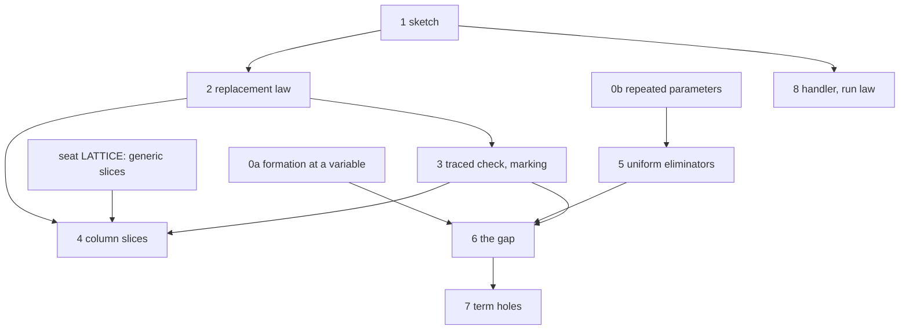

# 2026-10-06 seat GAP: what a true type gap with holes gives this language

Status: research note (history, not authority). Base: `42492024`, branch `seat/gap`. The note
edits no tracked source, and it rules nothing.

**The one thing the owner should know.** A hole needs no new constructor and no new type. A
hole is a host row with a declared type, appended after the row table. Two landed theorems,
`check_ext` and `check_restrict` (`src/Effect4/Laws/Program/Signature.lean`), already make that
language a conservative extension of ours. The checker admits a program with holes modulo its
holes, as the kernel accepts a theorem modulo its planned goals. One law is new: in `HasTy`, any
program of a hole's declared type stands in the hole's place, and the whole program keeps its
type. The true gap is the second step, not the first. It is the type of a hole whose type is
not stated. It costs one appended leaf of `Ty` with one name per hole, and it pays only where a
value reaches a cell.

## 1. Question

The owner asks what a true type gap with holes gives this language. The brief
(`docs/research/2026-10-05-claude-lead/briefs/seat-gap-brief.md`) sets two duties. Read each
paper at its page. Ask of each piece what our algebra already gives, before any new thing is
proposed. It gives six readings to test and five parts to write.

Three inputs arrived during the work, and this note takes them in.

- The owner authorized the line as first-class work (row 282, requirement R14). The coordinator
  then asked for three additions: slices to dispatch from, Lean's metaprogramming as a design
  input, and the algorithms.
- The coordinator asked for three exact answers. They are `Ty.var` as the gap, a hole as a host
  row, and the three judgments on a program with holes.
- The coordinator then fixed three inputs: the tool's promise, the host row with one replacement
  law, and an appended leaf `Ty.gap` later. Sections 6.6, 5.7 and 9.2 hold them. Section 9.6
  corrects one of the two stated defects.

## 2. What was read or run

The evidence words are those of `docs/core/controlled-english.md` §3.8. This note adds three
phrases, because its Lean text is outside the tree.

- **Compiled in scratch**: Lean elaborated the text in a scratch file against the tree at the
  base. A `def … : Prop` in that state is a statement that nothing here proves.
- **Proved in scratch**: the kernel accepted the theorem in a scratch file. It is not a theorem
  of the tree, and no gate has read it.
- **Not compiled**: Lean has not read the text.

A page number is a page of the vendored PDF. A statement about a paper carries its page. A
statement from memory is marked so, and no recommendation rests on one.

| What | How | Evidence |
| --- | --- | --- |
| Carroll, Madhavapeddy and Omar, *Bidirectional Type Slicing* (arXiv 2607.12197v1, 2026), 28 pages | read in full | reading |
| Omar, Voysey, Hilton and others, *Hazelnut: A Bidirectionally Typed Structure Editor Calculus* (arXiv 1607.04180v5), 20 pages | read in full | reading |
| Allais, Atkey, Chapman, McBride and McKinna, *A Type and Scope Safe Universe of Syntaxes with Binding*, 30 pages | read in full | reading |
| Huet, *The Zipper*, 6 pages | read in full | reading |
| Foster, Greenwald, Moore, Pierce and Schmitt, *Combinators for Bi-Directional Tree Transformations* (report MS-CIS-04-15, 2004) | pages 5 and 6 | reading |
| Xia, Zakowski and others, *Interaction Trees* | pages 4, 5 and 11 | reading |
| Garcia, Clark and Tanter, *Abstracting Gradual Typing* (POPL 2016), 14 pages | read in full | reading |
| Castagna, Lanvin, Petrucciani and Siek, *Gradual Typing: A New Perspective* (POPL 2019), 112 pages | body, pages 1 to 29, in full; appendix B.5 | reading |
| Siek, Vitousek, Cimini and Boyland, *Refined Criteria for Gradual Typing* (SNAPL 2015) | pages 6 and 11 to 14 | reading |
| Zhao, Maroof, Dukkipati, Blinn, Pan and Omar, *Total Type Error Localization and Recovery with Holes* (POPL 2024), 28 pages | body in full | reading |
| Omar, Voysey, Chugh and Hammer, *Live Functional Programming with Typed Holes* (arXiv 1805.00155v4, 2018), 40 pages | body, pages 1 to 27, in full | reading |
| McBride, *The Derivative of a Regular Type is its Type of One-Hole Contexts* (extended abstract), 11 pages | pages 6 to 9 | reading |
| Dunfield and Krishnaswami, *Bidirectional Typing* (arXiv 1908.05839v2, 2020) | sections 3, 4 and 9.2 | reading |
| The tree at the base: each declaration that this note names, at its path | read | reading |
| The type model `gap_types.py`: a finite fragment of `Ty` with a gap, three runs | `python3 gap_types.py list 2`, `rec 1`, `ref 2` | tested |
| The checker model `gap_checker.py`: a small checker with holes, in five modes | `python3 gap_checker.py 5` | tested |
| `probe_var.lean`: the tree's `Ty` at a variable, 23 guards and two enumerations | `lake env lean -M6144`, through the Lean slot, exit 0 | tested, compiled in scratch |
| `probe_rows.lean`: a hole as a host row, 7 theorems and 25 guards | the same, exit 0 | proved in scratch; tested |
| `probe_hole_rule.lean`: the hole's rule, the replacement law's statements, the judgments | the same, exit 0; three theorems print `[propext, Quot.sound]` | proved in scratch; compiled in scratch |
| `probe_steps.lean`: ten more single steps of the replacement law | the same, exit 0; two print `[propext, Quot.sound]` | proved in scratch |
| `probe_where.lean`: the address of the first refusal, for three programs | the same, exit 0 | tested |
| `count-sites.sh`: the files and lines that name one constructor | run from the worktree's root | tested |
| `d1_cells.py`: the refused omissions of the checker model that hold a cell | `python3 d1_cells.py 5` | tested |

Not run: any TypeScript, any OCaml, the battery, any gate. One default `lake build` ran at the
base before the probes (1031 jobs, exit 0). One read-only `git log` ran inside the coordinator's
checkout by mistake. It wrote nothing there.

Two earlier notes carry "hazel" in their names (`2026-09-07-hazel-design-notes.md` and
`2026-09-08-hazel-external-row.md`, untracked, in the coordinator's checkout). They are about de
Vilhena's separation logic for effect handlers, and not about the Hazel editor. They say nothing
of holes (reading).

The models, the probes and their outputs are filed beside this note, as text.

| File under `docs/research/` | What it is |
| --- | --- |
| `2026-10-06-seat-GAP-gap_types.py.txt` | the type model |
| `2026-10-06-seat-GAP-gap_checker.py.txt` | the checker model; it imports the type model |
| `2026-10-06-seat-GAP-out-types-list.txt`, `-out-types-rec.txt`, `-out-types-ref.txt` | the three runs of the type model |
| `2026-10-06-seat-GAP-out-checker-5.txt` | the run of the checker model at size 5 |
| `2026-10-06-seat-GAP-probe_var.lean.txt`, `-probe_rows.lean.txt`, `-probe_hole_rule.lean.txt`, `-probe_steps.lean.txt`, `-probe_where.lean.txt` | the five Lean probes |
| `2026-10-06-seat-GAP-probe_var.out.txt`, `-probe_rows.out.txt`, `-probe_hole_rule.out.txt`, `-probe_steps.out.txt`, `-probe_where.out.txt` | their outputs |
| `2026-10-06-seat-GAP-count-sites.sh.txt` | the counting script |
| `2026-10-06-seat-GAP-d1_cells.py.txt` | a count over the checker model: which refused omissions hold a cell |

To run a model again:

1. Copy the three `.py.txt` files to one folder as `gap_types.py`, `gap_checker.py` and
   `d1_cells.py`.
2. Run `python3 gap_types.py ref 2`, `python3 gap_checker.py 5` or `python3 d1_cells.py 5`.

To run a probe again:

1. Copy the `.lean.txt` file to a scratch folder as a `.lean` file.
2. Run `lake env lean -M6144 <file>` from the worktree's root, through the Lean slot.

## 3. The words of this note

Each word below is new to the dictionary. Section 10.3 gives the entries as proposals.

| Word | Meaning here | Source |
| --- | --- | --- |
| hole | An address of a program where no program is written yet. | Omar and others, Hazelnut, p. 3: an empty hole |
| hole row | A host row that declares a hole's type: a request, an answer, an error and a requirement. | the hole context `u :: τ[Γ]`, Omar and others 2018, p. 13 |
| hole table | The hole rows of one sketch, in order, appended after the row table. | the same, `Δ` |
| sketch | A program with its hole table. With an empty hole table it is a program. | Hazelnut, p. 1: a program with holes |
| to omit | To replace a sub-program by a hole. The slicing paper's verb (p. 9). | Carroll and others, p. 9 |
| mask | The set of omitted addresses of one program. | the plan, section 4.2 |
| type slice | A mask that keeps a queried type fact. The dictionary's "slice" is a bounded change. | Carroll and others, Definition 4.1, p. 9 |
| gap | A type that is not stated yet: a leaf that stands for one static type, chosen later. | `□`, Carroll and others, p. 6; a frame variable, Castagna and others, p. 6 |
| gap type | A type that holds a gap. A static type holds none. | Castagna and others, p. 6 |
| instance | The static type that a gap type becomes when each gap is given a static type. | materialization, Castagna and others, Definition 2.2, p. 7 |
| precision | `g ⊑ g′`: every instance of `g′` is an instance of `g`. The gap is least. | Carroll and others, p. 7 |
| consistent subtyping | `g ≲ g′`: some instance of `g` is below some instance of `g′` in `Ty.sub`. | Garcia and others, Definition 7, p. 7; Castagna and others, Definition B.30, p. 71 |

Garcia and others order precision the other way (Definition 2, p. 4). This note uses the
slicing paper's direction, where less precise is smaller.

## 4. The six readings

| # | The reading | Verdict | What decides |
| --- | --- | --- | --- |
| 1 | Holes are the free construction over the same signature, and conservativity follows from `hom_eq_cata_eff`. | Corrected | `check_restrict` proves conservativity today, by `cata_eff_congr_on` |
| 2 | Graduality is a monotone algebra: one ordered theorem and one lemma per constructor. | Confirmed as a pattern; corrected in what needs it | `cata_admits_sub`; the checker model, 7,069 omissions |
| 3 | The focus is the derivative of the signature, and the composition law is "the checker is a fold". | Confirmed for access; corrected for typing | `Node.child`, `replaceAt_spec`; the six judgments of `HasTy.lean` |
| 4 | Marking is the same algebra with errors as data, and its erasure law is a fusion law. | Confirmed, with a correction | `foldM_natural_eff`; Zhao and others, Theorems 2.1 and 2.2, p. 7 |
| 5 | We have typed holes in two places already. | Confirmed and enlarged: nine places | the list of 4.5 |
| 6 | Running to a hole is a frontier, and reply admission states the law of filling it. | Confirmed in shape; the law is stated nowhere | `Await`, `admitAnswer`; Omar and others 2018, Theorems 4.1 and 4.2, p. 22 |

No reading is refuted outright. Three are corrected.

### 4.1 Reading 1: the free construction

The free construction exists already. `Eff Op` (`src/Effect4/Program/Eff.lean`) is free over its
operations, and a hole is one more operation. No constructor is added.

- A hole is `perform (external i) request`, where `i` is a position after the row table.
- Its row declares its type. Section 5.7 states the rule and proves it in scratch.
- Conservativity is proved today. `check_restrict` says that a program reading only the old rows
  is checked the same under every extension, refusals included. `rows_append` says that
  appended rows are an extension.
- The proof of `check_restrict` is fold congruence on a program's reads (`cata_eff_congr_on`).
  It is not `hom_eq_cata_eff`. The reading named the wrong lemma.

For an appended constructor the reading's lemma would be the right one. The larger fold,
restricted to old programs, is a homomorphism. `hom_eq_cata_eff` then makes it the old fold.
That statement is not compiled.

The papers agree with the row form. Allais and others define terms as the free relative monad
over a description (Figure 16, p. 11). A hole is then a variable of a second kind. Omar and
others record each hole with its type and its environment, `u :: τ[Γ]` (Figure 8, p. 13). A
hole row is that record.

### 4.2 Reading 2: graduality as a monotone algebra

The pattern exists at the type sort and not at the program sort.

- At `Ty`: `cata_admits_sub` (`src/Effect4/Laws/Program/Admits.lean`) is one ordered theorem
  over a generated structure, `AdmitsSub`, with one field per constructor.
  `cata_admits_instantiate` (`src/Effect4/Laws/Program/Template.lean`) is its twin for
  bindings, over `AdmitsMono`.
- At `Eff`: no structure states that an `EffAlgebra` is monotone, and no theorem uses one.
- In the papers: the simulation lemma of Allais and others is the generic form (Figure 44,
  p. 22).

The correction is about what needs monotonicity. The guarantee for an omission does not need it.

- With a declared hole, the omission keeps the type exactly. That is the replacement law (5.7).
- With a named gap, the original's types are a witness instance. The checker model finds 0
  refusals and 0 wrong types in 7,069 omissions (tested).

Monotonicity is the law of two other things. One is filling a hole at a smaller type. The
other is the answer-only column slices of candidate A. It fails today at three kinds of rule.

| Where it fails | Smallest witness | Evidence |
| --- | --- | --- |
| A shape eliminator at `never`: `fiberTy`, `Decision.arms .bool`, `Decision.arms .option` | `Fiber.join(x)` with `x : never` is refused | tested (compiled guards) |
| A scheme that binds one parameter at two covariant places: `getOrElse`, `ite`, a loop with no cursor annotation | `getOrElse(some(x), "d")` is typed under `x : number \| string` and refused under `x : number` | tested (compiled guards) |
| An invariant position: a cell made from a hole of type `never` | `Ref.make(x)` with `x : never`, then `Ref.set(cell, 7)`, is refused | tested (compiled guard) |

### 4.3 Reading 3: the focus as a derivative

The reading holds for access to a focus. It needs a correction for the typing of a context.

- Access is generated. `Node.child` and `Node.setChild` (`src/Effect4/Program/NodeLenses.lean`)
  come from `tools/Effect4Gen/binders.json`, and `Node.replaceAt`
  (`src/Effect4/Program/Refs.lean`) has its three lens laws and a frame law
  (`replaceAt_spec`, `replaceAt_self`, `replaceAt_overwrite`, `at_replaceAt_disjoint`,
  `src/Effect4/Laws/Program/References.lean`). The first two are the laws of a well-behaved
  lens (Foster and others, Definitions 3.1.1 and 3.1.2, p. 5).
- The papers: McBride gives one-hole contexts as the derivative, and plugging as an action of
  the monoid of contexts (Figure 5, p. 8; p. 9). Huet gives one path operator per constructor
  and argument (p. 5). Allais and others leave derived contexts as future work (p. 28).
- Terms are not addressable. `Node` has no term sort, so a focus is a program, a statement, a
  race, an action or a layer.

The typing of a context is the derivative of the typing relation, not of the program syntax.
The slicing paper says so: one context rule for each typing rule and focus location (p. 13).
The tree need not add that judgment. Two existing things carry it.

- As a statement, the replacement law of 5.7 says decomposition and composition in one
  sentence over `HasTy`.
- As a function, it is the checker's fold with each child call logged (9.4).

"The composition law is that the checker is a fold" is right, in the declarative system. I read
the six judgments in full: each rule reads a child program through its judgment only. No rule
reads a child program's syntax.

### 4.4 Reading 4: marking

Zhao and others prove that marking is total and that erasing the marks gives the program back
(Theorems 2.1 and 2.2, p. 7). The reading holds, with one correction.

- If the marks are kept beside the program, as a list of located refusals, erasure is trivial.
  The program was never changed.
- The laws with content are totality and agreement. Agreement is a fusion law. The map from a
  list of refusals to the first one is a monad morphism. `foldM_natural_eff`
  (`src/Effect4/Program/Fold.lean`) carries it through the fold.
- One more law has content, and it is where a hole's type is needed. A marked program is well
  typed, with each mark read as a hole (Carroll and others, p. 16; Zhao and others, Theorem
  2.1, p. 7). That needs a type for the marked place: a declared row, `never` with uniform
  eliminators, or a gap.

Their second lesson is about edits. Typed edit actions give way to plain edits and a total
marking pass (pp. 18 and 19). For us an edit is `Node.replaceAt` and a re-check. No action
calculus is owed.

### 4.5 Reading 5: the typed holes that we have

The tree holds typed holes in nine places, not two.

| # | Where | The hole | Its filling law |
| --- | --- | --- | --- |
| 1 | `Tpl` (`src/Effect4/Codegen/Template.lean`) | `.hole i`, `.strHole i`, `.intHole i`, `.arrHole i` | `match_inst` (`src/Effect4/Laws/Codegen/Template.lean`), `read_print` (`src/Effect4/Laws/Codegen/ReadPrint.lean`) |
| 2 | Schema templates (`src/Effect4/Schema/Template.lean`) | a child reference | `fill` |
| 3 | A row's columns | `Ty.var`, a template parameter | `matchTemplate_sound` (`src/Effect4/Laws/Program/Template.lean`) |
| 4 | A host row | an operation with a declared row and no implementation | reply admission, `admitAnswer` (`src/Effect4/Program/Admit.lean`) |
| 5 | A required service | `service key`, listed in the requirement row | `provide_discharges`, `provide_closed` (`src/Effect4/Program/Provision.lean`) |
| 6 | A layer reference | `LayerTerm.ref` | `Eff.expandRefs`, `Eff.hoistAll` (`src/Effect4/Program/Refs.lean`) |
| 7 | An operation's binder term | `Signature.termOf`, `withTerm` | `Signature.termUse` (`src/Effect4/Program/Typing/Rules.lean`) |
| 8 | A loop's cursor type | `iterate`'s optional annotation | the rule's two `Ty.sub` premises |
| 9 | A schema's effectful slot | proposed, no carrier | none yet |

Four things are missing.

- The type of a hole whose type is not stated: the gap.
- The replacement law, which says that a filling fits.
- The hole table as an object of its own, apart from the row table.
- An address for a term. A term hole is `Term.app atom args` in shape, but the atoms belong to
  Σ_core, and `SigExtends` asks for equal `atomOf`.

### 4.6 Reading 6: running to a hole

The shape is there. The law is not.

- A run that reaches a host row waits at a frontier. `Await` holds the fiber, the token, the
  operation and the evaluated request (`src/Effect4/Program/Admit.lean`).
- With a request that is the tuple of the variables in scope, the frontier shows the hole's
  environment. That is a hole closure (Omar and others 2018, Figure 5, p. 10).
- `admitAnswer` checks a reply at the row's answer and error columns. That is membership at the
  hole's declared type.

No statement says that replying `v` at the frontier agrees with running the program whose hole
is `succeed v`. Omar and others prove filling and commutativity for a pure calculus (Theorems
4.1 and 4.2, p. 22). They say that a language with non-commutative effects loses commutativity
(p. 22). Ours has such effects. Section 7 gives the law that can hold here.

## 5. Part 1: the gap in our type language

### 5.1 One recipe

One recipe lifts every operation of the checker's type vocabulary to gap types.

1. A gap type stands for the set of its instances (Garcia and others, Definition 1, p. 4).
2. A predicate holds of gap types when it holds of some instances (the same, Definition 3,
   p. 4; Castagna and others, Definition B.30, p. 71).
3. A function answers the most precise gap type whose instances cover its values on the
   instances (Garcia and others, Definition 6, p. 5).

The recipe is a definition and not an algorithm. Garcia and others warn that a rule lifted piece
by piece can miss an inconsistency (p. 6). So the model tests each structural rule against the
definition, by exhaustive enumeration over a finite fragment.

The recipe has one place of entry in a checker. An analysing site is where the bidirectional
recipe puts subsumption (Dunfield and Krishnaswami, pp. 10 and 11). A gradual system puts
consistency in that rule (the same, p. 32; Hazelnut, Figure 4, p. 3).

The fragment has the atoms `nat`, `num` and `str`, with `nat` below `num`. It has `never`,
`unknown`, unions as sorted antichains, and one constructor per run: a covariant list, a record
with one field, or an invariant cell.

### 5.2 One gap per hole

One anonymous gap is not enough. Three counterexamples show it (tested).

| Finding | Counterexample | Count |
| --- | --- | --- |
| `join` forgets an instance | `join(list(□), list(□)) = list(□)`, but `list(nat) \| list(str)` is a join of two instances | 3,636 of 204,548 pairs (list run); 1,008 of 67,643 (record run); 33,192 of 671,549 (cell run) |
| `join` is not monotone in precision | `join(list(□), list(□)) = list(□)`, and `join(list(nat), list(□)) = list(nat) \| list(□)` | 124, 556 and 532 pairs of short types |
| An omission's type is not below the original's | `if([1], ["a"]) : list(nat) \| list(str)` becomes `if([?], [?]) : list(□)` | 4 of 7,069 omissions |

The cause is `normalize`. It removes a repeated member, and two anonymous gaps are one member.
With one name per hole each count is 0: 0 refusals and 0 wrong types in 7,069 omissions.

A named gap is Castagna and others' frame variable. They replace each occurrence of `?` by a
frame variable (Definition 2.1, p. 7). The frame variables share no member with the type
variables (p. 6). A named gap is also the provenance of Zhao and others (p. 22).

The tree's order and normal form already treat a variable as the model treats a named gap
(tested, compiled in scratch).

- 23 guards: `Ty.sub` is reflexive at a variable, `never` is below it and `unknown` above it,
  and nothing else. `normalize` merges one name and keeps two names apart.
- `normalize` commutes with `instantiate`: over 5,110 templates and 64 bindings, 0 pairs differ.
- `Ty.sub` on normal forms is kept by `instantiate`: over 70 by 70 templates and 64 bindings, 0
  fail. Castagna and others prove the same of their relation (Proposition B.32, p. 71).

So the algebra of a named gap is the algebra of `Ty.var`. Its binder is not, and section 6.6
separates the two.

### 5.3 Each lifted operation

| Operation | Lifted rule | Evidence |
| --- | --- | --- |
| `Ty.sub` at an analysing site: candidate M | `sub`'s recursion and three lines: a gap on the left is below all, a gap member on the right is above all, an invariant argument compares both ways | exact on the list and record runs (0 of 208,849 and 0 of 105,625 pairs); at a cell it accepts 16,200 of 1,221,025 pairs with no witness and refuses no witnessed pair |
| The same with bounds: candidate B | each member picks a member, as in `sub`; a gap under an invariant constructor collects a lower and an upper bound from each member; each lower bound is below each upper bound | exact on the three runs (0 and 0) |
| `Ty.normalize`, `Ty.join` | unchanged: a gap is an opaque member, and equal names merge | exact with names; an anonymous gap loses an instance (5.2) |
| `Record.fieldType`, `Record.setType`, `Tuple.project`: member by member, total at `never` | the same rule; a gap member answers a new gap that depends on it | `fieldType`: 0 wrong of 325 gap types |
| `Checker.listOf?`, `fiberTy`, `exitOf?`, `Decision.arms .option`: they match one shape and refuse a union and `never` | as they are, no structural rule is exact: 21 and 4 wrong of 457; made uniform first, the member-by-member rule is exact: 0 of 457 | type model, L9 |
| A test by equality: `t = .bool`, `t = .nat`, `t = Ty.scope` | `t` is the type, a gap, or a union of the two | 0 wrong of 457, for `t = str` |
| `t.normalize = .never`, a release's error | the least instance of `t` is `never` | 0 wrong |
| An invariant argument: `refOf`, `deferredOf`, a map key | consistency: a common instance; it is not consistent subtyping both ways | 252 counterexamples in the list run: `list(□)` and `list(nat) \| list(str)` |
| `Ty.matchTemplate`, `Scheme.apply` | bind as today, with each gap opaque; guard by candidate M or B | modelled for `Ref.get` and `Ref.set` only |
| `Decision.arms .tag` and `.recordTag` | member by member, as the field read | not modelled; a reading |

Two results matter for the plan.

- The uniform eliminators of candidate N are the groundwork of the gap. With them each lifted
  eliminator is the old rule and one line for a gap member. Without them no structural rule
  is exact.
- `never` cannot stand for the gap at an invariant position. The plan's example decides it
  (tested, compiled): with the first child at `never`, `Ref.set(cell, 7)` is refused, at the
  write.

### 5.4 A canonical form with a gap

- A gap type has a normal form: `normalize` with the gap opaque. `Normal`
  (`src/Effect4/Program/Ty.lean`) has that case for a variable already.
- The normal form is not canonical for the meaning. Distinct normal forms have the same
  instances: 84 classes among 235 meanings in the list run, 72 among 253 in the record run.
  One class is `list(nat) | □`, `list(nat | □) | □` and `list(nat) | list(□) | □`.
- `□ | T` is not the gap. It stands for the supertypes of `T` (0 counterexamples). Only `never`
  is absorbed: `□ | never = □`. And `□ | unknown = unknown`.
- `normalize` owes one thing: to commute with instantiation. It does, on the enumeration of 5.2.
- No rule of the checker asks whether two gap types have the same instances. So no merging rule
  is owed. One candidate, `□ | M ↦ □ | lo M`, still leaves 30 classes in the list run.

### 5.5 The cell, kept exact

The member-by-member rule over-accepts at a cell, and it can be made exact at a cost.

- The counterexample is `ref(nat) | ref(str) ≲ ref(□)`. Each member finds its own instance of
  the one gap. No single instance serves both.
- Candidate B is exact on all 1,221,025 pairs of the cell run. It needs no join: `sub` reads a
  union on the left member by member, so each pair of bounds is one call of `sub`.
- Both candidates are conservative on static types and monotone in precision (0
  counterexamples each). The guarantee for an omission needs those two facts and no more. It
  holds under either rule.
- The cheaper rule loses the converse. A sketch that passes the gap check may have no hole
  table. Two exhibits show it, of 10 and 11 nodes (tested, each verdict checked one by one).

| Exhibit | The gap check | A static typing of the hole | A filling |
| --- | --- | --- | --- |
| `let(mk(?), if(set(v0, "a"), (get(v0) : nat)))` | passes | none: `str` is a lower bound and `nat` an upper bound | none of size 4 or less |
| `let(mk(mk(?)), set(v0, if(mk(1), mk("a"))))` | passes | none: two cells need two contents | none of size 4 or less |
| `let(mk(?), if(set(v0, "a"), set(v0, 1)))` | passes | `? := nat \| str` | `mk(if(1, "a"))` |

- Across a whole sketch, exactness needs the bounds of each named gap carried through the fold.
  An expected union with several members of one head adds a choice. That part is not modelled.
- The papers leave the cell open. Siek and others show that invariant references break the
  guarantee when `Ref int` may not become `Ref ?`. They conjecture the repair by consistent
  contents (section 5.2, pp. 11 and 12). So the law for a cell is ours to prove.
- No over-acceptance reaches an admitted program. A sketch with every hole filled performs no
  hole row, and `check` decides it (H1 of 5.7).

### 5.6 The laws, by enumeration

Every line is a finite test. The counterexamples are kept in the output files.

| Law | Result |
| --- | --- |
| L1. On static types the lifted relation is `Ty.sub`. | 0 counterexamples: the definition, M and B, three runs |
| L2. `□ \| never = □`, `□ \| unknown = unknown`, `□ \| □ = □`. | hold; only `never` is absorbed |
| L3. A structural rule equals the definition. | M: 0, 0, and 16,200 too many at a cell. B: 0 on the three runs |
| L4. The relation is kept when either side loses precision. | 0 counterexamples: the definition, M and B |
| L5. Consistent subtyping is transitive. | refuted: `nat ≲ □ ≲ str` |
| L6. `join` on gap types covers the joins of the instances. | refuted for one anonymous gap (5.2); it never gains an instance |
| L7. Equal instances give equal normal forms. | refuted (5.4) |
| L8. Consistency is consistent subtyping both ways. | holds in the record and cell runs; refuted in the list run, 252 pairs |
| L9. A lifted eliminator equals the definition. | 5.3 |
| L10. `t = str` and `t ≡ never`, lifted. | 0 counterexamples |

The checker model compares five ways to type a hole, on the same programs. Its language has
literals, variables, `let` and a two-armed `if` that joins. It has a list with its eliminator, a
cell with `mk`, `get` and `set`, and an analysing site. Its output writes "fold" for an
omission, and "local" for the gap check.

| Mode | Refused, of 7,069 omissions | Admitted at a type that the original does not fit |
| --- | --- | --- |
| N: the hole at `never`, the eliminators as they are | 212 | 1,292 |
| N with uniform eliminators | 24, each in a sketch with a cell (`d1_cells.py`) | 1,308 |
| G: one anonymous gap | 0 | 4 |
| G: one gap per hole | 0 | 0 |
| G: one gap per hole, uniform eliminators | 0 | 0 |

| Sketches written directly: 180,892, up to size 6 | The eliminators as they are | Uniform eliminators |
| --- | --- | --- |
| pass the gap check | 21,322 | 21,336 |
| have a static typing of their holes | 21,315 | 21,336 |
| pass, with no static typing | 15 | 0 |
| have a static typing, and fail the gap check | 8 | 0 |
| have a static typing, and no filling of size 3 or less | 1,900 | 1,915 |

The last line is bounded by the size of the fillings. It is no count of sketches that cannot be
filled.

Of these sketches 58,406 hold no cell. With uniform eliminators three verdicts agree on every
one: the gap check, each hole at `never`, and a static typing. Each verdict is yes on 8,012 of
them.

### 5.7 The guarantee, as Lean states it

This section holds the coordinator's second and third points. Parts (a) to (f) need no gap.

**(a) The hole's rule.** No rule is added to `HasTy`
(`src/Effect4/Laws/Program/Typing/HasTy.lean`). The rule `perform` types a hole, with
`rowTy_closed` (`src/Effect4/Laws/Program/Template.lean`). Proved in scratch, at
`[propext, Quot.sound]`:

```lean
-- proved in scratch (probe_hole_rule.lean)
theorem hole_hasTy (t : RowTable) (name : String) (answer error : Ty) (requires : List ServiceKey)
    (env : TyEnv) (hans : answer.closed = true) (herr : error.closed = true)
    (formed : Formation.Formed
      (Formation.instantiatedSites (holeRow name answer error requires).normalizeTypes [])) :
    HasTy (nativeSignature (t ++ [holeRow name answer error requires])) env
      (.perform (.external t.length) (.lit .unit))
      ⟨answer.normalize.normalize, error.normalize.normalize, Requirement.ofList requires⟩
```

`holeRow` is a host row with a unit request and the three declared columns. The rule holds in
every environment.

**(b) What the two landed theorems give.** Proved in scratch, each in one line from `check_ext`,
`check_restrict` and `rows_append`:

```lean
-- proved in scratch (probe_rows.lean)
-- H1: a program that performs no hole row is checked the same, refusals included
theorem holes_conservative (t H : RowTable) {e : NativeEff}
    (hp : SigProgram (nativeSignature t) e) (env : TyEnv) (p : List Nat) :
    Checker.check (nativeSignature (t ++ H)) env p e = Checker.check (nativeSignature t) env p e
-- H2: a sketch stays admitted, at the same type, when more holes are declared
theorem sketch_more_holes (t H H' : RowTable) {e : NativeEff} {env : TyEnv} {p : List Nat}
    {ty : EffTy} (h : Checker.check (nativeSignature (t ++ H)) env p e = .ok ty) :
    Checker.check (nativeSignature ((t ++ H) ++ H')) env p e = .ok ty
-- H3: the verdict reads the rows of the holes that the sketch performs, and no later row
theorem sketch_reads_its_holes (t H H' : RowTable) {e : NativeEff}
    (hp : SigProgram (nativeSignature (t ++ H)) e) (env : TyEnv) (p : List Nat) :
    Checker.check (nativeSignature ((t ++ H) ++ H')) env p e =
      Checker.check (nativeSignature (t ++ H)) env p e
```

The two theorems do not give the omission itself. That is the next law.

**(c) The replacement law.** It is the first proof slice of the plan. Its statement, as
compiled in scratch:

```lean
-- compiled in scratch as a statement; nothing here proves it (probe_hole_rule.lean)
def ReplacementLaw : Prop :=
  ∀ {Op : Type} (s : Signature Op) (env0 : TyEnv) (p q : Eff Op) (T : EffTy) (path : List Nat),
    HasTy s env0 p T → (Node.eff p).at_ path = some (.eff q) →
    ∃ (env : TyEnv) (t : EffTy), HasTy s env q t ∧
      ∀ (s' : Signature Op) (q' p' : Eff Op), SigExtends s s' → HasTy s' env q' t →
        (Node.eff p).replaceAt path (.eff q') = some (.eff p') → HasTy s' env0 p' T
```

It says two things at once. An admitted program splits at an address into an environment and a
type of the focus. Every program of that type, under every extension of the signature, stands
in the focus's place, and the whole keeps its type. The first half is the paper's decomposition
(Carroll and others, Theorem 5.2, p. 14). The second is its composition at a focus that
synthesises exactly the type (Theorem 5.3, p. 14).

The law ranges over the six judgments of `HasTy.lean`. Its proof needs one sibling statement per
judgment, each with a program as its focus. All six are compiled in scratch: `ReplacementLaw`,
`ReplacementLawStmts`, `ReplacementLawEffs`, `ReplacementLawAction`, `ReplacementLawLayer` and
`ReplacementLawLayers`.

The proof has one case per rule and per premise on a child. I counted them by reading.

| Judgment | Rules with a child | Premises on a child | Proved in scratch |
| --- | --- | --- | --- |
| `HasTy` | 18 | 27: 24 on a program, 3 on another sort | 9: `bind`, both children; the bodies of `catchCause`, `catchIf`, `iterate`, `provideLayer` and `scoped`; the first arm of `select`; the acquire of `acquireRelease` |
| `StmtsHasTy` | 5 | 10: 2 on a program, 8 on a statement list | 1: the program of `bindYield` |
| `EffsHasTy` | 1 | 2 | 1: the head |
| `ActionHasTy` | 4 | 4 | 1: the program of `forkScoped` |
| `LayerHasTy` | 8 | 11 | 1: the body of `effect` |
| `LayersHasTy` | 2 | 3 | none |
| Total | 38 | 57 | 13 |

So 44 cases are left: 18 in `HasTy` and 26 in the five other judgments. Those of `HasTy`:

| Premise on | Rules of `HasTy` | Cases left |
| --- | --- | --- |
| a program, one body | `suspend`, `exit`, `uninterruptible`, `interruptible`, `provideService`, `restore` | 6 |
| a program, two children | the handlers of `catchCause` and `catchIf`; the second arm of `select`; both children of `onExit`; the release of `acquireRelease` | 6 |
| a program, three children | `matchCause` | 3 |
| another sort | `gen` (a statement list), `withFiber` (an action), `provideLayer` (a layer) | 3 |

Each case has the same two steps, as the thirteen proved ones show.

1. Apply the parent's rule again, with the new judgment at the focus child.
2. Move each other premise along the extension, by `hasTy_ext` or its sibling.

Four of the thirteen need a third step. Their conclusion names the signature's scope key or
`bodyRequires`, and one rewrite by the extension's own equation moves it. They are
`acquireRelease`, `scoped`, `forkScoped` and a layer's `effect`. The thirteen were chosen to meet
each kind of side premise: a term at an extended environment, a decision's arms, a layer.

```lean
-- proved in scratch (probe_rows.lean): one step, at the first child of a `bind`
theorem fold_bind_first {Op : Type} {s s' : Signature Op} (h : SigExtends s s') {env : TyEnv}
    {rest hole : Eff Op} {f r : EffTy}
    (hr : HasTy s (env ++ [f.answer]) rest r) (hh : HasTy s' env hole f) :
    HasTy s' env (.bind hole rest)
      ⟨r.answer, f.error.join r.error, f.requires.union r.requires⟩ :=
  .bind hh (hasTy_ext h hr)
```

The law holds because of one fact, which I read off the six judgments in full. Each rule reads a
child program through its judgment only. No rule reads a child program's syntax. Two details
are for the proof's author.

- The path language has a statement node, and no judgment types a statement alone. The step
  through `Stmts.cons` reads two path indices together.
- `typeOfProgram` expands layer references before it types. The law is about `HasTy`, so it
  speaks of the expanded program.

The law does not need a hole. It is a law of the checker we have. With (a) it gives both uses.

- **To omit**: take `q'` to be the hole at a row that declares `t`. The sketch has the type `T`.
- **To fill**: take `q'` to be any program of type `t` in the environment `env`.

**(d) Two forms of the hole row.** The row can declare three columns or the answer alone.

| | Three columns: answer, error, requirement | The answer alone: error `never`, no requirement |
| --- | --- | --- |
| The omission | keeps the whole type, at every address | keeps the answer; the error and the requirement lose the omitted part |
| Under a handler, an exit, a fork | the same | the error flows into a value, and the type changes |
| What proves it | the replacement law | the replacement law and column monotonicity, which no theorem gives today |
| Use | authoring, filling, a frame for a rewrite | provenance of an error or of a required service |

The compiled counterexample for the second form: the exit of the omitted part goes into a cell,
and a second exit is written to it.

- Original: `a = exit(fail "boom")`, `cell = Ref.make(a)`, `b = exit(fail "boom")`,
  `Ref.set(cell, b)`. The checker admits this program.
- Three columns, the hole at `⟨never, string, ∅⟩`: admitted at the original's type.
- The answer alone, the hole at `⟨never, never, ∅⟩`: refused. The cell holds
  `Exit<never, never>`, and the write offers `Exit<never, string>`.

Outside those contexts the second form does what the plan wants. For `fail "boom"` then
`succeed 1`, the original has the error `string`, and the sketch has the error `never`.

With three columns the type never moves, so that form explains no provenance. The two forms
serve two consumers, and both are host rows.

The plan's own example (`Ref.make(5)`, a write, a read) separates the candidates (tested,
compiled).

| The first child becomes | Verdict |
| --- | --- |
| a program of type `never` (candidate N) | refused, at the write |
| a hole row that declares `number` | admitted at `number`, the original's type |
| a hole row that declares `string` | refused, at the write |
| a hole, checked at the base table | refused, at the hole |

**(e) The three judgments on a sketch.** Their definitions are compiled in scratch.

```lean
-- compiled in scratch (probe_hole_rule.lean)
def AdmittedModulo (t H : RowTable) (sketch : NativeEff) (T : EffTy) : Prop :=
  Checker.check (nativeSignature (t ++ H)) [] [] sketch = .ok T
def Declarable (t : RowTable) (sketch : NativeEff) : Prop :=
  ∃ (H : RowTable) (T : EffTy), AdmittedModulo t H sketch T
```

| Name | Meaning | Decided by |
| --- | --- | --- |
| admitted modulo its holes | the checker admits the sketch's program at the row table extended by its hole table | `check`, today |
| declarable | some hole table makes the sketch admitted modulo its holes | a search for the rows; a solver of bounds when it is built |
| fillable | some programs with no hole, one per hole, give a program that the checker admits | no procedure in general |
| passes the gap check | each analysing site, taken alone, holds by consistent subtyping | the gap checker, when it is built |

My message to the coordinator said "gap-admitted" and "completable". The dictionary keeps
"admitted" for an input with its stage and "complete" for completeness against a judgment. So
this note writes "passes the gap check" and "fillable".

| From | To | Verdict | Evidence |
| --- | --- | --- | --- |
| fillable | declarable | holds: each filling's type declares its hole | the replacement law; 13 of its 57 cases proved in scratch |
| declarable | fillable | holds for a hole of a program, and says nothing: every such declaration has a program of exactly its type that dies first | tested, compiled: `dieAt`, at two declarations |
| declarable | fillable | fails for a hole of a value: `? := never` can be the only typing, and no value fits `never` | tested: `let(?, if((v0 : nat), (v0 : str)))` |
| declarable | passes the gap check | holds with uniform eliminators | tested: 0 of 180,892 against; 8 against with the eliminators as they are |
| passes the gap check | declarable | holds off cells, with uniform eliminators: `never` is the witness | tested: 58,406 sketches, the verdicts agree on all |
| passes the gap check | declarable | fails at a cell | tested: the two exhibits of 5.5 |

`dieAt a e` is a defect first. After it come a branch that fails at `e` and a loop whose cursor
annotation is `a`. Neither runs, and the two annotations give the error and the answer columns.
The error column must pass `admittedErrTy`. For a hole of a program, "fillable" is
therefore free. What an author wants of a filling is a law, and a type does not state one (8.3).

**(f) What a tool may promise at a hole.** It promises "admitted modulo its holes", and it
always answers with a hole table.

- The present checker decides it. It is exact at a cell, because a declared row has no gap.
- A program that the checker admits in the hole's environment, at exactly the declared type,
  fits. The whole keeps its type (the replacement law).
- The checker still admits the sketch's program when more holes are declared (H2).
- A sketch with every hole filled is an ordinary program, and `check` decides it (H1).
- For a hole with no stated type the tool first infers a declaration. It then promises the same
  for that declaration. "Passes the gap check" alone is a necessary test and no more.

A tool may not promise a fit at a smaller type. `getOrElse(some(x), "d")` is typed after a
first child of type `number | string`, and refused after `succeed 1` (tested, compiled). After a
filling of another type the tool declares the hole again at that type and checks the context
again.

**(g) The statement for a gap.** Not compiled: `Ty.gap`, `fill`, `checkGap` and `Mask.omit` do
not exist.

```lean
-- not compiled
theorem gap_graduality (sig : Signature Op) (p : Eff Op) (m : Mask) (t : EffTy)
    (h : check sig [] [] p = .ok t) :
    ∃ g : EffTy, checkGap sig [] [] (m.omit p) = .ok g ∧
      ∃ σ : GapTyping, (g.fill σ).normalize = t.normalize
```

Its proof shape is naturality in the instance, and not induction on precision.

1. Take `σ` to be the types that `check` gave the omitted sub-programs.
2. Show, rule by rule, that the gap checker's type at `σ` is the checker's type. Each total
   operation commutes with `fill` up to normal form, as `normalize_instantiate_congr`
   (`src/Effect4/Laws/Program/Template.lean`) does for `instantiate`.
3. At each analysing site, the static check is the witness that consistent subtyping asks for.
4. At each eliminator, the lifted rule covers the static rule's answer on the instance. This
   step needs the uniform eliminators.

So the proof owes one lemma per operation of the type vocabulary, about twenty, and none per
constructor of `Eff`. The slicing paper states the property for its calculus (Definition 2.1,
p. 5; Theorem 3.5, p. 8).

### 5.8 Castagna's Materialize, followed

Castagna and others add one rule to a static system: from `Γ ⊢ e : τ′` and `τ′ ≼ τ`, conclude
`Γ ⊢ e : τ` (Figure 1, p. 6). The static gradual guarantee then follows at once (Proposition
2.3, p. 7).

The same rule in our tree would be this.

```lean
-- not compiled: `Materializes` is `∃ σ, t.fill σ = t'`, column by column
| materialize {env : TyEnv} {e : Eff Op} {t t' : EffTy} :
    HasTy sig env e t → Materializes t t' → HasTy sig env e t'
```

It has three costs, each a landed fact that it breaks.

| What it breaks | Where | What replaces it |
| --- | --- | --- |
| A program has one type: `hasTy_unique` | `src/Effect4/Laws/Program/Typing/Sound.lean` | a principal type, up to materialization |
| `check_complete`: a derivation at `t` gives `check = .ok t` | `src/Effect4/Laws/Program/Typing/CheckSound.lean`; named in 41 lines of 5 files | `check = .ok t₀` for some `t₀` that materializes to `t` (Castagna and others, Proposition 2.5, p. 7) |
| `HasTy` is the static system | every consumer of `effTy_complete`: 56 lines in 9 files | a second judgment beside it |

The checker would then owe three things, to stay complete against the larger judgment.

- At each premise `Ty.sub a b = true`: consistent subtyping. Castagna and others need a lemma to
  move a materialization across a subtyping step (Proposition 4.7, p. 21).
- At each eliminator premise (`fiberTy`, `Decision.arms`, `Checker.listOf?`): the lifted
  eliminator. Hazelnut calls it the matched arrow (p. 3); the slicing paper writes
  `τ ⊔ (□ → □)` (Figure 7, p. 8).
- At the rule `perform`: a match of a request that holds gaps against the row's template.

My finding is that the row form gets the paper's benefit with no added rule. The declarative
device that gives the guarantee at once exists already: it is the extension of the signature.

- To materialize a hole's type is to choose its row. `Declarable` puts the existential outside
  the judgment.
- `HasTy` stays the static system at each hole table. `hasTy_unique`, `check_sound` and
  `check_complete` stay as they are.
- The guarantee is the replacement law. Its proof is one rule application per step, with no
  induction on precision.

The lead also sets the form of the later law. The gap checker will owe completeness against
`Declarable`, in the shape of Proposition 2.5. A declarable sketch passes the gap check, at a
gap type that has the declared type as an instance. One limit of the paper carries over. An
occurrence of `?` cannot always be replaced by a static type (p. 8). Our exhibits at a cell
are that case.

## 6. Part 2: holes in the syntax

### 6.1 Which sorts can hold a hole

| Sort | A hole today | What is missing |
| --- | --- | --- |
| program | an operation at a hole row | nothing |
| statement, race, action, layer | a program hole inside the node: `bindYield`, an entrant, `fork`, `LayerTerm.effect` | a hole for a whole statement list or a whole layer; a layer has `LayerTerm.ref` |
| term | hoisted: a hole of a program, bound before the term that uses it | a hole under the body of `Term.fold`, which reads the fold's own binders |
| type | none | the gap |
| requirement row | a declared list of keys | an open row; not proposed |

A term hole is the hard one. `Term.app atom args` has the shape of a hole closure, with `args`
as the environment. But the atoms are Σ_core: `SigExtends` asks for equal `atomOf`. Two ways are
open, and section 9 places them last: host atoms in Σ_app, or an appended constructor of `Term`.

### 6.2 A new constructor, or the language we have

The language we have serves a hole of a program.

- The hole table is a suffix of the row table. A hole is marked by its position, not by a field
  of `Row`. So `Row` and its wire form do not change.
- A sketch is first-order data: a program and a list of rows. No Lean function and no host
  object is stored.
- The program with no hole is exactly `SigProgram` at the base table
  (`src/Effect4/Laws/Program/Signature.lean`): it performs no operation outside the table.
- Publishing and running read the row table, not the hole table. A sketch checked at the row
  table alone is refused at the hole's address (tested, compiled). So no new refusal is needed
  to keep a hole out of a run.
- A sketch prints, by my reading: its hole is a call of a declared host function, and a host
  row needs no new template. No printer ran, and no tsgo result exists for a sketch.

### 6.3 The seven judgments at a hole and at a gap

| Judgment | At a hole row | At a gap |
| --- | --- | --- |
| Formation | a row of the hole table: closed columns, formed after instantiation, as `rowTy_closed` asks | formed in a sketch's type; refused in an annotation and in a row's column |
| Canonical form | `Row.normalizeTypes` normalizes the three columns | a normal form with the gap opaque; not canonical for the meaning (5.4) |
| Membership | a reply fits the declared answer, by `admitAnswer` | no value fits a gap, as no value fits `Ty.var` today |
| Inhabitance | a hole of a program: always, by a defect; a term hole, at stage 7: `inhabited` (`src/Effect4/Program/Columns.lean`) decides | inhabited when some instance is |
| Profile support | the row prints as a host call | no type reference: `ofTy` (`src/Effect4/Codegen/Types.lean`) answers `none` at a variable today, and should at a gap |
| Codec admission | a reply crosses at the declared type | refused, as `ty_var` is (`src/Effect4/Schema/Codec.lean`) |
| Reply admission | the hole's frontier is an `Await`; `admit` decides a reply | none: a hole with a gap in its type cannot take a reply |

No judgment gains a rule for a hole row. Each gains one refusal for a gap, and each such refusal
exists today for a variable.

### 6.4 What R2's eight conditions ask

DB-01 (`docs/DESIGN-BASIS.md`) lists C1 to C8. A hole table is an append to Σ_app. `Ty.gap` is
an append to Σ_core, under DI-47's finite gate.

| Condition | For a hole table | For `Ty.gap` |
| --- | --- | --- |
| C1, syntax | vacuous: rows are data | an appended constructor: the old term algebra embeds; a discipline, not a theorem |
| C2, meaning | operational until DI-69: an old program's run against the longer table is its own run | no value has a gap type, so no meaning changes |
| C3, checker | proved both ways: `check_ext`, `check_restrict` | owed: the gap checker on a static program is `check` (L1 in the model) |
| C4, protocol typing | open for `TypedProg`, as for every host row | not touched while a gap does not run |
| C5, world | not touched | not touched |
| C6, lawfulness | `lawful_append`; a hole row that runs passes `rowChecks` (7.2) | none |
| C7, representation | a published program is pinned to its table (row 115), so a sketch is not published | tag 28 appended; old bytes read unchanged; the mirrors regenerate; the policy names it |
| C8, forms | none | none |

### 6.5 The cost of an append, counted

`docs/GENERATED.md` lists what regenerates. The hand sites are the cost. I counted the files and
lines that name three constructors appended earlier, with `count-sites.sh`. A count by name is
an upper bound: a name can occur outside the constructor.

| Appended earlier | Pattern | `src/Effect4` by hand | `src/Effect4` generated | `Test` | `tools` |
| --- | --- | --- | --- | --- | --- |
| `Ty.refOf`, a recursive constructor | `refOf` | 26 files, 192 lines | 5 files, 59 lines | 45 files, 205 lines | 14 files, 116 lines |
| `Term.recordSet` | `recordSet` | 34 files, 136 lines | 2 files, 26 lines | 25 files, 94 lines | 3 files, 28 lines |
| `Eff.restore`, the last appended constructor of `Eff` | its arms and its algebra field | 41 files, 128 lines | 6 files, 33 lines | 5 files, 8 lines | 3 files, 3 lines |
| a leaf of `Ty`, as an algebra field | `ty_bytes` | 6 files, 9 lines | 3 files, 14 lines | 0 | 0 |

A leaf of `Ty` is the cheapest append of the three sorts. Beside its algebra fields, a leaf sits
in a leaf group of 9 hand match lines in 3 files of `src/Effect4`. An append to `Eff` is the
dearest.

A leaf of `Ty` also reaches the generated files that name the type family (reading of
`docs/GENERATED.md` and of `tools/Effect4Gen/manifest.json`). They are the algebras and views,
the equality and the codecs, the wire tags, and the mirrors under `ocaml/eff` and `ts/eff`.

### 6.6 `Ty.var` as the gap, place by place

This section holds the coordinator's first point. The coordinator has since fixed the input: the
gap is an appended leaf, later. The table stays as the reason.

| Place | Declaration | At a variable today | For a gap written as a variable |
| --- | --- | --- | --- |
| Formation of a program's type | `Formation.HeadFormed` (`src/Effect4/Program/Formation.lean`) | no rule: every variable is formed | the present rule serves; it is also defect (a) of 9.6 |
| The order | `Ty.sub` (`src/Effect4/Program/Ty.lean`) | reflexive only; `never` below, `unknown` above | the present rule serves; consistent subtyping is a new relation in either design |
| The normal form | `Ty.normalize`, `members`, `key`, `Normal` | an opaque member; equal indices merge | the present rule serves |
| Instantiation | `Ty.instantiate` | an unbound variable becomes `never` | a new rule: it must leave a gap alone |
| A row's scope | `Row.wellScoped`, `Ty.templateAdmissible` (`src/Effect4/Program/SigApp.lean`, `Ty.lean`) | every variable is a parameter of the row | a new rule: a gap is not a parameter |
| Membership | `Val.hasTy` (`src/Effect4/Program/Typed.lean`), `Fits` (`src/Effect4/Laws/Program/Typed/Membership.lean`) | `false`: no value | a refusal, as today |
| The codec | `ty_var` in `src/Effect4/Schema/Codec.lean` | refused | a refusal, as today |
| The schema bridge | `schema`, `ofSchema` (`src/Effect4/Schema/Bridge.lean`) | written as a parameter declaration, which `ofSchema` refuses | a refusal, as today |
| Profile support | `ofTy` (`src/Effect4/Codegen/Types.lean`) | `none` | a refusal, as today |
| Error support | `rawSupportedErrTy`, `payloadFieldTy` (`src/Effect4/Program/Eff.lean`) | `false` | a refusal, as today |
| The spelling | `Ty.renderRaw` | `A`, `E`, then `T7` | a new rule: a gap needs its own spelling |
| The wire and the mirrors | `tools/Effect4Gen/wire-tags.json` | tag 18, active | no event |
| The conservativity policy | `scripts/lib/conservativity.py`, clause C4; row 172 | one of four constructors that the policy does not name | its line would name two uses |

Two compiled facts decide against reuse.

- **The binder differs.** A row binds a variable for one use, and `instantiate` closes an
  unbound one to `never`. `Deferred.make<T5, number>()` is typed at `Deferred<never, number>`
  today. A gap in a type argument would be closed the same way, silently.
- **The order rule differs.** A variable is rigid: `Ty.sub` at it is reflexivity only. That is
  right for a parameter of a template that must hold for every use. A gap is flexible: it holds
  for some instance. One constructor would need two order rules.

Castagna and others keep the two apart: their frame variables and their type variables are two
sets with no common member (p. 6).

The sentence for the owner, if the ruling were no append: a variable in a program's type then
means a gap. `Ty.closed` stops holding of every type that the checker gives. `instantiate` must
stop closing a free variable to `never`. And a rigid parameter of a reusable sketch can no
longer be told from a gap.

One more fact came out of the table. "Never a program's type" (`src/Effect4/Program/TyCore.lean`)
is a convention today, and no check enforces it. Section 9.6 makes it a repair.

## 7. Part 3: a hole at run time

### 7.1 Three candidates

| Candidate | At a hole | What the tree has | What is owed |
| --- | --- | --- | --- |
| A hole does not run | the program is refused before a run | today's behaviour: a sketch at the base table is refused at the hole | nothing |
| A frontier with a typed answer | the run waits; a reply is checked at the declared type | a hole row that is a lawful host row: `Await`, `admitAnswer`, the journal | the law of 7.4 |
| An operation that a layer provides | a program answers the hole's operation | services: `service`, `provideService`, `provide_discharges`; no handler for a row | a handler construct: an append to `Eff` |

The three are not rivals. They are three stages of one hole's life: refused, answered by hand,
answered by a program.

The papers name the second and the third. Xia and others read a visible event as an effect with
no interpretation yet (p. 5). Their `interp` gives each event to a handler (Figure 9, p. 11).
A hole row is such an event, and the third candidate is its handler.

### 7.2 Which holes can wait at a frontier

Only a hole whose row is a lawful host row. `rowChecks` (`src/Effect4/Program/SigApp.lean`) asks
for an external, asynchronous row with no `int` and no internal handle in its answer or error.

- A hole of type `number`, or of a record of data, can wait and take a reply.
- A hole of type `Ref<number>` can be checked and cannot take a reply. The machine mints a cell;
  a host does not (row 97).

So the second candidate serves data holes. A hole whose type holds a cell, a fiber, a deferred
or a scope stays with the first candidate until a program fills it.

### 7.3 What `reachable_typed` needs

Nothing new. A hole row that waits is a host row. `reachable_typed`
(`src/Effect4/Laws/Program/Typed/Commands/Clauses/All.lean`) covers it exactly as far as it
covers any host row. That is on ghost-admitted host answers, with M7 at the empty row table and
on answer-free tapes (`docs/core/system-map.md` §8; `docs/core/host-boundary.md`). R6 is
parked, and a hole does not move it.

With a request that is the tuple of the variables in scope, a frontier at a hole shows the
values of the hole's environment. Omar and others call that a hole closure (Figure 5, p. 10).
The journal then holds, for each hole, the requests that reached it and the replies given.
That list is a table of examples for the hole.

### 7.4 The law of filling a hole that has run

Omar and others prove that filling commutes with evaluation, for a pure calculus (Theorems 4.1
and 4.2, p. 22). They add that non-commutative effects lose the property (p. 22). They also
advise asking the programmer before evaluation goes past a hole (p. 23). Our frontier is that
question.

Two statements can hold here. Neither is compiled.

- **A filling by a term.** Let the hole be filled by `succeed f`, with `f` a term over the
  request. Then the run that replies `f`'s value at each frontier of the hole has the same
  observation as the run of the filled program. The fragment is the one of `run_eq_meaning`
  (`src/Effect4/Laws/Program/Agreement/Machine.lean`). It is an equal-observation claim, and
  its proof is a simulation.
- **A filling by a program.** No general law holds: the filling's own effects interleave with
  the rest. The journal is then a test of the filling and not a proof. Replay the filled
  program against the recorded decisions, and compare the observation.

### 7.5 A gap in a running program's type

It means that the program is not ready to run. No value fits a gap, so no reply is admitted at a
hole whose declared type holds one. A tool closes the gap first: it infers a declaration, and
the author accepts it.

No cast enters the machine. Gradual languages check at run time what the static checker let
pass (Omar and others 2018, Figure 5, p. 10: failed casts). Here the one run-time check is reply
admission at a declared type, and it exists.

## 8. Part 4: what it gives

Each story has a program of ours, before and after. The running example is the plan's own, and
its verdicts are compiled in scratch.

```text
x    = succeed 5
cell = Ref.make(x)
_    = Ref.set(cell, 7)
Ref.get(cell)                      -- the checker admits it at number
```

### 8.1 A skeleton first

Before: an author writes the whole program and learns of a refusal at the end.

After: the author writes the context and declares the hole.

```text
x    = hole h0 : ⟨number, never, ∅⟩
cell = Ref.make(x)
_    = Ref.set(cell, 7)
Ref.get(cell)                      -- admitted modulo its holes, at number
```

- Declared at `string` instead, the sketch is refused at the write, before any filling exists.
- The refusal is final for that declaration. By the replacement law, a filling of the declared
  type gives the same judgment, so no such filling repairs it.
- The author repairs the context or the declaration, and has written no dead code.

### 8.2 Asking what can stand at a place

Before: `explain` (`src/Effect4/Program/Checker.lean`) answers the first refusal and nothing
about a place that checks.

After: for an address, the tool answers the environment and the type of the focus.

| Address in the example | Environment | Type of the focus | What the context expects |
| --- | --- | --- | --- |
| the first child | empty | `⟨number, never, ∅⟩` | nothing: `Ref.make` takes any type |
| the write | `number`, `Ref<number>` | the row's own answer, error `never` | the request below `readonly [Ref<A>, A]` |

The table is a reading of the rules. No function computes it yet (stage 3). The replacement law
is its statement.

### 8.3 Filling with a law

A hole row states a type. Section 5.7 shows that a type alone is always fillable, by a defect.
So an author who wants more states a law. Three carriers exist or are proposed.

- **Examples**: the requests and replies that a run recorded at the hole (7.3). A filling is
  tested by replay against them.
- **A planned goal about the filling**: `proof_goal` states a property that the filling's
  program owes. The hole and the goal then share one name.
- **A protocol on the row**: an earlier note on de Vilhena's thesis proposes a precondition and
  a postcondition per row. The note is `docs/research/2026-09-08-hazel-external-row.md`,
  untracked, in the coordinator's checkout. A hole row would carry one. It is a proposal there,
  and here.

None of the three is built.

### 8.4 Omitting for a type slice, with cells

Before: no view of a program hides a part and keeps its types.

After: omit a part with three columns, and every type of the rest is unchanged. That includes a
part whose error reaches a cell: the compiled case of 5.7 (d).

For provenance the answer-only row is the tool. Take `fail "boom"` and then `succeed 1`.

- The query is: why can this program fail with `string`?
- Omit the first child with the answer-only row. The error becomes `never`, so the query fails.
- So the first child is in every type slice for the query. The second child is in none.

### 8.5 Every refusal, with its repair places

Before: for the example with `succeed "x"` as first child, the checker answers one refusal, at
the write (tested, compiled).

After, with total marking and the traced check:

- every refusal of the program, each at its address, in one pass;
- for this one, the two repair places: the value `7`, and the first child that made the cell a
  `Ref<string>`. They are the paper's analysis slice and synthesis slice (Carroll and others,
  Definition 6.1, p. 15; Definition 4.1, p. 9).

### 8.6 Running to a hole

Before: a program with an unwritten part cannot run.

After, for a data hole: the run waits at the hole's frontier, with the values of the request.
The author replies `5`. `admitAnswer` admits the reply at `number`, the run resumes, and the
journal records the pair. This is a reading of `src/Effect4/Program/Admit.lean`. No session ran
for this note.

### 8.7 A template that composes

A sketch is a template, and its hole table is its parameter list.

- To instantiate it is to fill its holes. The replacement law is the law.
- To compose two is to fill a hole of one with the other. The hole tables append, and H2 says
  that the first verdict stands.
- Two things are missing. Composition needs a renaming of hole positions, which is a map of
  `Eff` on its operations. A template whose hole type varies needs a rigid variable in a hole
  row, and that is `Ty.var` as it is today.

The second point is one more reason for a separate leaf. A reusable template wants a rigid
variable, and a pending hole wants a flexible gap.

### 8.8 A hole and a required service

| | A hole | A required service |
| --- | --- | --- |
| Where | one address | every `service key` in scope |
| Declared type | a request and three columns | one flat carrier per key (`flatCarrierAlg`, `src/Effect4/Program/SigApp.lean`) |
| Listed in | the hole table | the requirement row of the program's type |
| Filled by | a program at the address | `provideService` or `provideLayer`, at the edge |
| Law | the replacement law, to prove | `provide_discharges`, `provide_closed`, `build_total`, landed |
| Reads local variables | yes: its environment | no |
| Unfilled, at a run | waits at a frontier, if it is a data hole | refused: M7 asks for an empty requirement row (row 117) |

The requirement row is the hole table of the value holes that a layer fills. The tree has had
that kind of typed hole, with its filling laws, since the layer work.

### 8.9 The operations of an MCP tool, each with its law

| Operation | Answer | Law | First stage |
| --- | --- | --- | --- |
| `sketch.check` | admitted modulo its holes at a type, or the located refusal | `check` decides; H1 to H3 | 1 |
| `sketch.omit(address)` | a new hole that declares the part's three columns | the replacement law: the same type | 2 |
| `hole.fill(h, program)` | admitted, or a refusal in the filling or in the context | the replacement law at the declared type; a re-check of the context otherwise | 2 |
| `hole.context(h)` | the environment, the declared type, the expectations | the traced check agrees with `check` | 3 |
| `sketch.refusals` | every refusal with its address | the first mark is `explain`'s refusal | 3 |
| `slice.why(column, member)` | one minimal type slice, by a fixed order | LATTICE's descent, on a monotone instance | 4 |
| `run.toHole` | a frontier at the hole, with the request's values | none new: a host row waits | today, for a data hole |
| `hole.reply(h, value)` | the resumed run, journaled | `admitAnswer`; `journal_replays` (`src/Effect4/Laws/Run.lean`) | today, for a data hole |

## 9. Part 5: the plan and its limits

### 9.1 The stages, least change first

| Stage | What | Change to the tree | Append |
| --- | --- | --- | --- |
| 0a | formation refuses a variable in a program's annotation (9.6) | one clause of `Formation.HeadFormed`; one refusal reason | to the formation reasons only |
| 0b | atoms that bind one parameter at two covariant places (9.6) | a prelude change, after a ruling | none |
| 1 | the sketch: the hole table, H1 to H3, the hole's rule | new modules; no existing declaration changes | none |
| 2 | the replacement law | a new law module | none |
| 3 | the traced check, and total marking | new algebras beside `Checker.check.alg` | none |
| 4 | type slices of the error and requirement columns: candidate A | an instance for LATTICE's module | none |
| 5 | uniform eliminators: candidate N | the checker's domain widens, after a ruling | none |
| 6 | the gap: `Ty.gap`, consistent subtyping, the gap check, inferred declarations | a leaf of `Ty`; a second algebra | the first append |
| 7 | term holes | `Term.hole`, or atoms in Σ_app | to `Term`, or to Σ_app |
| 8 | a handler for a hole's operation; the law of 7.4 | a constructor of `Eff` | to `Eff` |



Stages 0a, 1 and 2 need no ruling. Stage 1 can start now: its proofs exist in scratch.

### 9.2 Where an append is first needed, and why

Stage 6 is the first, and the append is one leaf: `Ty.gap (name : Nat)`, at tag 28.

- A hole with no stated type has no row to declare.
- Its type must still be a value of `Ty`. It enters an environment, a join, a row's request and
  a cell's content.
- `never` cannot stand for it at a cell: the plan's example is refused at the write (tested,
  compiled).
- A variable cannot stand for it: `instantiate` closes it to `never`, and `Ty.sub` holds it
  rigid (tested, compiled; 6.6).

Until stage 6 a tool has an interim rule for a hole with no stated type. It declares the hole
at `⟨never, never, ∅⟩`, the type of the defect that would fill it. With stage 5 that rule agrees
with the gap check on every sketch without a cell (tested: 58,406 sketches). So the leaf is
needed for cells, and for a report that says "not stated" and not `never`.

### 9.3 Candidates A and N in this plan

- **A** is stage 4: the hole row that declares the answer alone. It needs no ruling.
- **N** is stage 5. It is a repair of the checker in its own right, and the groundwork of the
  gap: with it each lifted eliminator is exact (5.3). It changes which programs the checker
  admits, so it is the owner's.
- **G** splits. A hole with a declared type is stages 1 and 2, with no gap. The gap is stage 6.

### 9.4 Lean's metaprogramming, as a design input

The tree generates per constructor today: the algebras and folds (`tools/Effect4Gen/Fold.lean`),
the views (`LayerView.lean`, `View.lean`), the lenses and binders (from `binders.json`).
`fold_of` (`src/Effect4/Program/FoldOf.lean`) derives a fold's algebra and its agreement
theorem from a function. `proof_goal` and `proof_sketch` (`tools/ProofGraph/`) manage open
obligations.

| Needed for every sort or constructor | Generated, generic or neither | With what | One more command or handler |
| --- | --- | --- | --- |
| A fold over a sketch | nothing to do | `Eff Op` is free over `Op`; every fold reads `external i` already | none |
| A fold over an appended `Term.hole` | generated | the fold generator; `fold_of` re-derives each algebra | none: each hand algebra gains one field |
| Precision on `Ty` | generic | `g ⊑ g′` when `g′` is an instance of `g`; `fill` is one fold | none |
| Precision on programs | generic | a mask ordered by inclusion: LATTICE's carrier | none |
| One monotonicity statement per constructor of an `EffAlgebra` | to generate | the pattern exists: `AdmitsSub` (`src/Effect4/Laws/Program/TyView.lean`), `TyAlgebra.Commutes` (`src/Effect4/Program/TyFoldExtras.lean`) | a generated structure `EffAlgebra.Mono`, and one ordered theorem over it |
| One-hole contexts | generated | `Node.child`, `Node.setChild` | none |
| The context typing, as a judgment | not needed | the replacement law states it over `HasTy` | none |
| The 57 cases of the replacement law | derivable | each case is one constructor and `hasTy_ext` | a command that reads an inductive judgment and emits one congruence lemma per premise |
| The context typing, as a function | generic | `EffAlgebra.ofLayer` and `ArgF` (`src/Effect4/Program/LayerView.lean`) | one generic function, `EffAlgebra.traced`; not a generator |
| Total marking | generic | `EffMAlgebra`, `foldM_natural_eff` | none |
| A hole in an author's Lean term | Lean's own | the authoring surface (`src/Effect4/Program/Authoring.lean`) | a term elaborator that turns `?h` into a hole row and returns the hole table |

Where a built-in procedure of Lean serves:

- **A finite check**: `decide +kernel` on a closed instance, as the tree does now. A minimal
  type slice of one small program is such an instance.
- **A monotonicity lemma**: `aesop` with a named bank of monotone facts (`Ty.join`, `Row.union`,
  `Row.diff` in its left argument). A bank lands with its two controls (row 65).
- **A case of the replacement law**: `cases` on the judgment, then `constructor`. A bank of the
  six judgments' constructors is the candidate for a searched proof. It is not tried.
- **An author's hole**: Lean's elaborator names it and places it. `proof_sketch` is the model:
  it turns a script's open goals, each closed over its hypotheses, into planned goals
  (`tools/ProofGraph/Sketch.lean`). A program-side command would close each hole over its
  environment.

Where it must not:

- `native_decide` is banned, for a finite check too.
- The checker, the gap check and the descent stay ordinary functions with their laws. No tactic
  is the shipped algorithm.
- Lean's unifier does not decide `Ty.sub`. It may place a hole. It may not type one.
- No `Expr` and no metavariable is stored program content. The elaborator's output is a program
  and a list of rows.

### 9.5 The algorithms

**The paper's structural calculus** (its section 8) slices a term for a queried part of its type.
It answers the term slice, the slice's type and the assumptions that the slice needs (p. 19).

- A pair splits the query between its components (p. 19).
- An application slices the function for the queried result and omits the argument (p. 20).
- A binder slices its body first. It then slices the definition for the part that the body
  needs (p. 20).
- The paper calls `case` its hard rule: the join of two arms seems to need an iterated fixed
  point (p. 20). Hazel splits the query disjointly and ignores the overflow, to run in linear
  time (p. 21).
- A slice of minimum size is NP-hard, by set cover (p. 22). The map from slices to types does
  not keep meets, so no Galois connection gives a best slice (p. 23).

**What our checker's shape allows.**

| Rule shape | In the paper | In our checker | Verdict |
| --- | --- | --- | --- |
| a join of two arms | `case`, a join in the precision order | `select`, the handlers, a race: the answer is a union, and so are the error and the requirement | easy: a member of a union comes from an arm that offers it |
| a binder | body first, then the definition | `bind`, `bindYield`, a handler's binder: the entry is the child's answer or error | the same order |
| an application | slice the function, omit the argument | `perform`: the row's template binds by first occurrence | by anchors: `paramOccurrences`, `anchored` (`src/Effect4/Laws/Program/Template.lean`) |
| a residual | none | `catchIfError`, `Row.diff`, `bodyRequires` | total functions, case by case |

Our hard rule is not `case`. It is the cell, where a query on the content needs stage 6.

**The first algorithm** is member provenance of a column: why does this program fail with `E`,
or require this service?

1. Check the program once with the traced check. Every node's type is then known.
2. Walk down from the root with the queried member. At each node keep the leftmost child that
   offers the member. Omit each other child with the answer-only row.
3. Check the resulting sketch once. If the member is lost, take the full program as the start.
4. Run LATTICE's one-step descent from the start.

Its law: the answer is a minimal valid type slice. The law rests on LATTICE's theorem and on
one fact of this instance, that the map from a mask to the column is monotone. Step 2 is an
accelerator that nothing trusts: step 3 checks its result. The instance owes LATTICE that one
fact and nothing else.

The contribution slice keeps every offering child in step 2. Its cost is one check for the
start. The descent then pays one check per candidate, and a check after one omission can reuse
every result off the path to the root.

The algorithm does not give a slice of minimum size. It does not slice an answer type through a
cell, and it does not take a query on a term.

### 9.6 Two repairs of the present checker

**(a) A variable in a program's annotation.** This one is a defect.

- The smallest programs, each one node (tested, compiled). `succeed` of an empty record whose
  optional field `a` is declared at `var 7` is admitted, and its answer `{ readonly a?: T7 }` is
  not closed. `Deferred.make<T5, number>()` is admitted at `Deferred<never, number>`.
- The cause: `Formation.HeadFormed` has no rule at a variable, in a template or outside one.
  `Formation.programSites` collects every annotation, so the clause has one place to go.
- The repair: a variable is formed in a template only. An operation's type arguments are
  annotation sites (`argumentAnnotations`), so the same clause refuses the second program.
- `instantiate` is not at fault. Closing an unbound parameter to `never` is its documented rule
  for a row. The defect is that a program's variable can reach it.
- It narrows the admitted programs, by each program that holds a variable in an annotation. A
  search for `Ty.var` under `tools`, `scripts`, `Test/Audit` and `Test/fixtures` finds three
  files, and none generates a program (reading). A generator could still write the constructor
  without its prefix. I expect no corpus row to move, and seat CENSUS's count decides.
- The claim it serves: `raw-formation` gains the clause. A new claim follows,
  `checked-types-closed`: every type that the checker gives a formed program is closed. Its
  consumers are `ofSchema_schema`'s premise, `ofTy` and the codec. R14 needs it too: a gap is
  then the only open leaf of a sketch's type.

**(b) One parameter at two covariant places.** The coordinator lists it as a defect. I correct
that: the checker follows its oracle here, and the repair is a change of the prelude.

- The smallest programs (tested, compiled). `succeed (getOrElse(some(1), "d"))` is refused.
  After a first child of type `number | string`, `getOrElse(some(v0), "d")` is admitted. After
  `succeed 1` it is refused. `ite(true, v0, "a")` behaves the same, and so does a loop with no
  cursor annotation.
- The cause: `Ty.infer` binds a parameter at its first occurrence. With `join`, a later
  supertype replaces the binding. Two types with no order between them are refused.
- It agrees with the prelude. The prelude declares `getOrElse` with one parameter, and
  `generated/row-citations.tsv` records that the scheme and the declaration agree. From memory,
  and no premise here: TypeScript infers one parameter from two such arguments in the same way.
- It differs from rc.112. Its own `Option.getOrElse` has two parameters and answers `A | B`
  (`vendor/effect-4.0.0-rc.112/src/Option.ts`, the declaration of `getOrElse`).
- The repair: two parameters and a union answer, in the prelude and in the scheme together. The
  map atom of `src/Effect4/Program/NativeAtom.lean` has that shape already, with
  `union (var 0) (var 1)` in its answer. The candidates are `getOrElse`, `ite`, `cons` and the
  list append. For `cons` the atom's own note says that the prelude has two parameters already,
  so the scheme alone would follow. For a loop the cursor annotation is the repair, and it
  exists.
- It widens the admitted programs. A program with two unordered candidates at such a use
  becomes admitted, at the union. No admitted program becomes refused, and an admitted program
  keeps the normal form of each type. A raw type changes, and an atom's answer is not
  normalized, so a printed type can move. Seat CENSUS can count the corpus rows that apply such
  an atom, and the refused rows whose first refusal is such an argument.
- The claim it serves: `checker-monotone`, whose corrected sentence is in 10.2.
- Who decides: the owner or the coordinator. The prelude is a face of the target, and tsgo is
  its oracle.

### 9.7 The slices, each as a brief

Each brief gives the files, the statements as planned goals with their placement, the controls,
and what the seat must not touch. Every seat keeps the rules of `AGENTS.md`. Every statement
below is not compiled unless its brief says so.

#### Slice SKETCH (stage 1): a program with its hole table

- **Goal**: the sketch as data, and the four theorems that the landed laws already give.
- **New files**: `src/Effect4/Program/Sketch.lean` (a core module: `Sketch`, `holeRow`, the
  extended signature, the check); `src/Effect4/Laws/Program/Sketch.lean`;
  `Test/Program/SketchControls.lean`. Root anchors: the ends of the import lists.
- **Statements**: `holes_conservative`, `sketch_more_holes`, `sketch_reads_its_holes` and
  `hole_hasTy`, as section 5.7 gives them. All four are proved in scratch. State each for
  `SigApp.signature` too, with `SigApp.rows_append`.
- **Controls**: green, the plan's example with a hole at `number`. Red, three controls. The
  hole at `string` is refused at the write. The sketch at the base table is refused at the
  hole. A hole row put before the table is no extension (`prepend_not_extends`,
  `Test/Program/SignatureControls.lean`).
- **Do not touch**: `Row`, `Eff`, `Ty`, `Term`, the checker, the wire tags.

| Statement | Concept; claim | Reach | It does not establish | Consumer |
| --- | --- | --- | --- | --- |
| H1 | `initial-algebras-folds`; `sketch-conservative`, role compatibility; R14, from R2's C3 | every table and every appended hole table; every environment and path | anything of a program that performs a hole | each tool answer on a filled sketch |
| H2, H3 | the same; `sketch-weakening`, role weakening | the same | the omission | composition of sketches |
| `hole_hasTy` | the same; `hole-rule`, role compatibility | a unit request; closed, formed columns; every environment | a request that reads the environment; a run | slice REPLACE |

#### Slice REPLACE (stage 2): the replacement law

- **Goal**: prove `ReplacementLaw` and its five siblings (5.7 c). It is the first proof slice.
- **New files**: `src/Effect4/Laws/Program/Typing/Replace.lean`;
  `Test/Program/ReplaceControls.lean`.
- **Statements**: the six statements, compiled in scratch as written. Two corollaries at the
  checker: an omission to a three-column hole keeps `check`'s answer, and a filling of the
  declared type keeps it.
- **Proof plan**: induct on the path, mutually over the six judgments. Close each of the 57
  cases with the parent's constructor and `hasTy_ext`. Thirteen are done in scratch
  (`probe_rows.lean`, `probe_steps.lean`). The step also needs the fact that a replaced child
  keeps its sort, which `replaceAt_spec` gives. A `proof_sketch` could leave the cases as
  parts; whether it takes a mutual induction is not tried.
- **Controls**: green, the defect-first program fills a hole and the type stays. Red: a filling
  of another type is refused in the context; the answer-only row is refused under an exit that
  reaches a cell.
- **Do not touch**: the rules of `HasTy`; the checker; `Node.replaceAt`.

| Statement | Concept; claim | Reach | It does not establish | Consumer |
| --- | --- | --- | --- | --- |
| the six statements | `initial-algebras-folds`; `typed-replacement`, role substitution; it restates `focus-decomposes` and `focus-composes` as one claim; R14 | the six judgments; a program as focus; every address; every signature extension; the type of the focus kept exactly | behaviour; a focus of a smaller type; a term as focus; a program before its layer references expand | the tool's `omit` and `fill`; Codex's focus slices; a frame for a rewrite |

#### Slice FORM (stage 0a): formation at a variable

- **Goal**: a variable is formed in a template only (9.6 a).
- **Files**: `src/Effect4/Program/Formation.lean` (one clause, one reason);
  `src/Effect4/Laws/Program/Template.lean` where a proof reads `HeadFormed`; a new law file for
  `checked-types-closed`; `Test/Program/` controls. The refusal alphabet regenerates.
- **Statements**:

```lean
-- not compiled
theorem check_closed (sig : Signature Op) (lawful : sig.RowsWellScoped) {env : TyEnv}
    (henv : ∀ t ∈ env, t.closed = true) {e : Eff Op} {t : EffTy}
    (formed : Formation.Formed (Formation.programSites e))
    (h : Checker.check sig env [] e = .ok t) :
    t.answer.closed = true ∧ t.error.closed = true
```

- **Controls**: red, the two one-node programs of 9.6 are refused at formation. Green: a row
  whose columns hold a parameter is still formed.
- **Do not touch**: `Ty.instantiate`; the rows.
- **Gates at the merge**: the conservativity script, since a verdict can move.

| Statement | Concept; claim | Reach | It does not establish | Consumer |
| --- | --- | --- | --- | --- |
| the clause | `subtyping-algebra`; `raw-formation`, role decidability | every program annotation | closed types of the checker | `check_closed` |
| `check_closed` | `subtyping-algebra`; `checked-types-closed`, role inversion; R1, R3, R14 | a closed environment; a signature with well-scoped rows and schemes | a closed type of a sketch with a gap | `ofSchema_schema`, `ofTy`, the codec; stage 6 |

#### Slice TRACE (stage 3): the traced check and total marking

- **Goal**: the environment and type at each address, and every refusal in one pass, as two
  algebras beside the checker's.
- **New files**: `src/Effect4/Program/Trace.lean`, `src/Effect4/Program/Marking.lean`, their
  law files under `src/Effect4/Laws/Program/`, and controls.
- **Statements**:

```lean
-- not compiled
theorem traced_check (sig : Signature Op) (env : TyEnv) (p : List Nat) (e : Eff Op) :
    (checkTraced sig env p e).result = Checker.check sig env p e
theorem focusAt_typed {env0 env : TyEnv} {e q : Eff Op} {t : EffTy} {path : List Nat} :
    focusAt sig env0 e path = some (env, t) → (Node.eff e).at_ path = some (.eff q) →
    HasTy sig env q t
theorem mark_first (sig : Signature Op) (env : TyEnv) (e : Eff Op) :
    (mark sig env e).refusals.head? = explain sig env e
theorem mark_none_iff (sig : Signature Op) (env : TyEnv) (e : Eff Op) :
    (mark sig env e).refusals = [] ↔ (effTy sig env e).isSome
```

- **Proof plan**: `traced_check` and `mark_first` are fusion: each new algebra maps to the
  checker's by a homomorphism, and `hom_eq_cata_eff` or `foldM_natural_eff` concludes.
- **Controls**: red, a program with two independent refusals shows both marks; green, the
  marks of an admitted program are empty.
- **Do not touch**: `Checker.check`. The new checks stand beside it with their agreement
  theorems.

| Statement | Concept; claim | Reach | It does not establish | Consumer |
| --- | --- | --- | --- | --- |
| `traced_check`, `focusAt_typed` | `initial-algebras-folds`; `focus-function`, role compatibility; R14 | every program and address of a program | an expectation that arrives through a binder | `hole.context`; slice COLUMN |
| `mark_first`, `mark_none_iff` | the same; `marking-agrees`, role compatibility | refusals of analysing rules first, where the rule's answer does not read the refused premise | a repair; a ranking of causes; no cascade past a refused term without stage 5 | `sketch.refusals` |

#### Slice COLUMN (stage 4): type slices of two columns

- **Goal**: the answer-only instance of LATTICE's module, for the error and the requirement.
- **New files**: `src/Effect4/Laws/Slice/Column.lean`; `Test/Program/ColumnSlice.lean`.
- **Statements**:

```lean
-- not compiled
theorem column_mono (sig : Signature Op) (e : Eff Op) {m m' : Mask} (hle : m ≤ m')
    (hopen : m.ColumnOpen e) {t t' : EffTy}
    (h : checkMasked sig e m = .ok t) (h' : checkMasked sig e m' = .ok t') :
    t.answer = t'.answer ∧ Ty.sub t.error.normalize t'.error.normalize = true ∧
      t.requires ⊆ t'.requires
```

- **Reach**: `ColumnOpen` holds when no omitted address is under a handler's body, an exit or a
  fork. Seat CENSUS's first table measures how often that holds.
- **Controls**: the paper's four incomparable minimal slices (p. 18), as a program of ours. Red:
  the case of 5.7 (d), where an omitted error reaches a cell.
- **Do not touch**: LATTICE's module. This instance owes it monotonicity and nothing else.

| Statement | Concept; claim | Reach | It does not establish | Consumer |
| --- | --- | --- | --- | --- |
| `column_mono` | `context-requirements`; `column-graduality`, role monotonicity; R14 | masks that are `ColumnOpen`; the answer-only row | answer types; cells; a term | `slice.why`; `slice-completion`, which is this fact read upward |

#### Slice UNIFORM (stage 5), after a ruling

- **Goal**: every eliminator reads a union member by member and is total at `never`. With the
  ruling of 9.6 (b), no scheme binds one parameter at two covariant places.
- **Files**: `fiberTy`, `Checker.listOf?`, `exitOf?` (`src/Effect4/Program/Typing/Rules.lean`,
  `Checker.lean`); `Decision.arms` (`src/Effect4/Program/Decision.lean`); the matching rules of
  `HasTy` and the proofs of `check_sound` and `check_complete`; the prelude, if ruled.
- **Statement**: `checker_monotone`, as 10.2 corrects it.
- **Controls**: the compiled refusals of 4.2 become admissions, each named in the compatibility
  policy. Red: an invariant position still refuses.
- **Gates at the merge**: the conservativity script with its policy names; the truth lane, since
  admitted programs change.

| Statement | Concept; claim | Reach | It does not establish | Consumer |
| --- | --- | --- | --- | --- |
| `checker_monotone` | `subtyping-algebra`; `checker-monotone`, role monotonicity; R14 | terms and programs; a pointwise smaller environment; a child of a smaller type | invariant positions | a filling at a smaller type; marking past a refused term; stage 6's exact eliminators |

#### Slice GAPLEAF (stage 6), after ratification

- **Goal**: `Ty.gap`, consistent subtyping, and the gap check as a second algebra.
- **Files**: `src/Effect4/Program/TyCore.lean`, for the leaf, appended last. The wire tags and
  the compatibility policy. Each hand algebra and leaf group (6.5). New modules for `Ty.csub`,
  `fill` and `checkGap`, with their laws and controls.
- **Statements**, four. The gap check on a program with no gap is `check`. A declarable sketch
  passes the gap check. `gap_graduality` holds (5.7 g). Candidate B is exact against the
  definition.
- **Controls**: the counterexamples of 5.2 and 5.5 as fixtures. Red: one anonymous gap at a
  join; the member-by-member rule at a cell.
- **Do not touch**: `Ty.var` and its laws; `HasTy`.

| Statement | Concept; claim | Reach | It does not establish | Consumer |
| --- | --- | --- | --- | --- |
| the four | `subtyping-algebra`; `gradual-checker`, split in three (10.2); R14, with R2 and R3 for the append | every sketch; one gap per hole | that a sketch that passes is declarable at a cell, before the bounds; any run | a hole with no stated type; an answer-type slice through a cell |

### 9.8 What stays unknown

- Whether tsgo accepts a printed sketch. No TypeScript ran.
- Whether tsgo reads a union member by member where stage 5 would. A probe must come before
  the ruling.
- The exact rule for a whole sketch at cells: the bounds across sites, and the choice at a
  union.
- Whether `check_closed` holds as stated: each type operation must keep closed types closed.
- How a hole keeps its identity under edits. A position shifts when an earlier hole is filled.
  A row has a name, and the name may be the identity.
- The request of a hole row: a unit, or the tuple of the variables in scope. The second shows
  values at a frontier and prints differently.

## 10. Proposals (not rulings)

### 10.1 The obligations, as one table

| Claim (proposed) | Statement, in words | Concept; role | Evidence today | Stage |
| --- | --- | --- | --- | --- |
| `sketch-conservative` | a program that performs no hole row is checked the same with any hole table | `initial-algebras-folds`; compatibility | proved in scratch from `check_restrict` | 1 |
| `sketch-weakening` | a sketch that the checker admits stays admitted, at its type, with more holes declared | the same; weakening | proved in scratch from `check_ext` | 1 |
| `hole-rule` | a hole row with closed, formed columns types its `perform` at those columns | the same; compatibility | proved in scratch | 1 |
| `typed-replacement` | an admitted program splits at an address into an environment and a type; a program of that type stands there | the same; substitution | compiled as six statements; 13 of 57 cases proved in scratch | 2 |
| `raw-formation`, one clause | a variable is formed in a template only | `subtyping-algebra`; decidability | the defect is tested, compiled | 0a |
| `checked-types-closed` | a formed program that the checker admits has closed types | `subtyping-algebra`; inversion | not compiled | 0a |
| `focus-function` | the traced check answers the environment and type at each address, and agrees with `check` | `initial-algebras-folds`; compatibility | not compiled | 3 |
| `marking-agrees` | the marking checker's first mark is `explain`'s refusal; no mark exactly at an admitted program | the same; compatibility | not compiled | 3 |
| `column-graduality` | under the answer-only row, more omission gives the same answer and smaller columns | `context-requirements`; monotonicity | tested on one program; a compiled counterexample outside its reach | 4 |
| `checker-monotone` | 10.2 | `subtyping-algebra`; monotonicity | refuted as the registry states it | 5 |
| `gap-conservative` | the gap check on a program with no gap is `check` | `subtyping-algebra`; compatibility | tested in the model: 0 counterexamples | 6 |
| `gap-necessary` | a declarable sketch passes the gap check | the same; compatibility | tested: 0 of 180,892 against, with uniform eliminators | 6 |
| `gap-graduality` | an omission passes the gap check at a gap type that has the original's type as an instance | the same; monotonicity | tested: 0 of 7,069 against | 6 |
| `gap-exact-off-cells` | off invariant positions, a sketch that passes the gap check is declarable | the same; compatibility | tested: 58,406 sketches agree | 6 |
| `fill-by-term` | a reply of a term's value at a hole's frontier and the filled program have one observation | `translation-simulation`; simulation | not compiled; a reading | 8 |

### 10.2 Corrections to R14's open parts

| Open part (`tools/Tools/SemanticsRegistry.lean`) | Correction |
| --- | --- |
| `focus-decomposes`, `focus-composes` | State them as one claim over `HasTy`, with the signature extension in the statement. "Fits its mode" is "has exactly the focus's type": our checker synthesises at every program address. The reach is every address of a program in the six judgments. |
| `column-graduality` | Right on its reach. Add the second form: with three declared columns the omission keeps the whole type at every address, by the replacement law. |
| `slice-conservative` | For a hole as a row it is `check_restrict`. It is a corollary, not an open part. |
| `slice-completion` | For the answer-only row it is `column-graduality` read upward. For three columns it is the replacement law. |
| `marking-erases` | With the marks beside the program it is trivial. The claim with content is that a marked program is admitted when each mark is read as a hole. |
| `gradual-checker` | Three corrections. Say "one gap per hole": with one anonymous gap the guarantee fails at a join. Say which rule converts a cell's content: the member-by-member rule over-accepts, and the rule with bounds is exact. Split it: `gap-conservative`, `gap-necessary`, `gap-graduality`. |
| `checker-monotone` | False as stated. The corrected sentence follows. |
| "a hole at run time" | Designed in section 7: a data hole waits at a frontier today; the law is `fill-by-term`; a handler waits. |

The corrected sentence for `checker-monotone`:

> checker-monotone (proposed claim; subtyping-algebra): with every eliminator and every test by
> equality reading a union member by member and total at never, and with no scheme, row or loop
> that binds one parameter at two covariant places, a typed term stays typed at a smaller type
> under a pointwise smaller environment, and a program stays admitted at a smaller type when a
> child is replaced by a program of a smaller type; false today at the shape eliminators
> (fiberTy, Decision.arms), at getOrElse, ite and a loop with no cursor annotation (seat GAP's
> probes); it is the law of filling a hole at a smaller type and of the answer-only column
> slices, and the guarantee for an omission does not need it (candidate N, decisions row 282)

### 10.3 Dictionary entries, as I would have them

| Term | Meaning here | Tree anchor | Literature | Do not use | Qualifier |
| --- | --- | --- | --- | --- | --- |
| **hole** | An address of a program where no program is written yet. It is written as an operation at a hole row. | `Sketch` (proposed, `src/Effect4/Program/Sketch.lean`) | empty hole (Omar and others, Hazelnut, p. 3) | "placeholder", "stub", "todo" | — |
| **hole row** | A host row that declares a hole's type: a request, an answer, an error and a requirement. | `holeRow` (proposed); `rows_append` (`src/Effect4/Laws/Program/Signature.lean`) | hole context entry `u :: τ[Γ]` (Omar and others 2018, p. 13) | — | — |
| **hole table** | The hole rows of one sketch, in order, appended after the row table. | `Sketch` (proposed) | hole context `Δ` (the same) | "hole context" | — |
| **sketch** | A program with its hole table. With an empty hole table it is a program. | `Sketch` (proposed) | a program with holes (Hazelnut, p. 1) | "partial program" | — |
| **omit** (omitted, omission) | Replace a sub-program by a hole. | `Node.replaceAt` (`src/Effect4/Program/Refs.lean`) | Carroll and others, p. 9 | "fold" (it is the catamorphism), "cut" (it is the registry's) | — |
| **admitted modulo its holes** | The checker admits the sketch's program at the row table extended by its hole table. | `check_ext`, `check_restrict` | typing under a hole context (Omar and others 2018, p. 12) | — | as admission: name the sketch |
| **declarable** | Some hole table makes the sketch admitted modulo its holes. | — | typable under some static typing of the holes (by name) | "typable" | — |
| **fillable** | Some programs with no hole, one per hole, give a program that the checker admits. | — | completion (Zhao and others, p. 7) | "completable": "complete" is completeness against a judgment | — |
| **gap** | A type that is not stated yet: a leaf of `Ty` that stands for one static type, chosen later. One gap per hole. | `Ty.gap` (proposed, stage 6) | `□` (Carroll and others, p. 6); frame variable (Castagna and others, p. 6) | "unknown" (it is `Ty.unknown`, the top), "any", "dynamic" | — |
| **gap check** | The test on a sketch whose holes have no declared type: each analysing site holds alone, by consistent subtyping. It is necessary for declarable. | `checkGap` (proposed, stage 6) | gradual type checking (by name) | "gap-admitted" | — |
| **instance** (of a gap type) | The static type that a typing of the gaps gives. | `fill` (proposed) | materialization (Castagna and others, Definition 2.2, p. 7) | "concretization" | — |
| **precision** | `g ⊑ g′`: every instance of `g′` is an instance of `g`. The gap is least. | — | Carroll and others, p. 7 | — | — |
| **consistent subtyping** | Some instance of the first is below some instance of the second, in `Ty.sub`. It is not transitive. | `Ty.csub` (proposed) | Garcia and others, Definition 7, p. 7 | "compatible" | — |
| **type slice** | A mask of one program that keeps a queried type fact. | LATTICE's module (in work) | Carroll and others, Definition 4.1, p. 9 | "slice", alone: it is a bounded change | every use: "type" |

R14's title says "a partial program". With these entries it would say "a sketch".

**The parallel with a planned goal**, as the coordinator asks for it.

| A theorem and its planned goals | A sketch and its holes |
| --- | --- |
| `proof_goal G : P` names a statement with no proof | a hole row names a type with no program |
| downstream proofs use `G` as a theorem | the context performs the hole as an operation |
| the kernel accepts the theorem modulo `G` | the checker admits the sketch modulo its holes |
| proving `G` in place changes nothing downstream | filling at the declared type keeps the whole type |
| a proof of another statement does not fit in place | a program of another type does not fit in place |
| the plan derives a status: goal, modulo, proved | a hole; a program admitted modulo its holes; an admitted program |
| a requirement's top node is proved only when it rests on no goal | a program is published or run only when it performs no hole row |
| `proof_sketch` turns a script's open goals into planned goals, each closed over its hypotheses | omitting turns sub-programs into hole rows, each closed over its environment |

Where the parallel stops:

- **A goal can be false, and a hole's type cannot be empty.** A goal's body is `sorry`, and no
  proof may exist. A hole row always has a program of exactly its type that dies first. So the
  open question at a goal is whether it holds. At a hole it is which filling is right.
- **Proofs are irrelevant, and programs are not.** Any proof of `G` serves. Two fillings of one
  type behave differently, and the replacement law says nothing of behaviour.
- **A goal is used many times, and a hole is one address.** The many-times analogue is a
  required service, or an operation.
- **A sketch can run to its hole.** A proof with a goal does not run.

### 10.4 The owner's questions, with a recommendation

My recommendation in one paragraph. Land slices SKETCH, REPLACE and FORM now: they need no
ruling and no append. Decide the uniform eliminators and the prelude's parameters with the
census's counts. Keep the gap for its first consumer, a hole with no stated type at a cell.

| # | Question | Recommendation |
| --- | --- | --- |
| 1 | Is the hole table an object beside the row table, or do hole rows live in Σ_app with a mark? | Beside it. `Row` and the wire stay as they are, and a published program cannot hold a hole by construction. |
| 2 | Which row does an omission declare? | Three columns by default. The answer-only row for provenance views. |
| 3 | Uniform eliminators, and the prelude's repeated parameters? | Yes to both, together, after CENSUS's counts and a tsgo probe. Both widen the admitted programs. |
| 4 | When does `Ty.gap` land? | When a consumer needs a hole with no stated type at a cell. Until then declare such a hole at `never`. |
| 5 | Does a hole run? | A data hole waits at a frontier, as a host row does today. A handler for a hole's operation waits for a consumer. |
| 6 | The word for R14's object: "sketch" or "partial program"? | "Sketch": it has one meaning, and it matches `proof_sketch`. |

### 10.5 Rows that I would propose for the decisions register

- A hole of a program is a host row of a hole table that is appended after the row table. No
  constructor is added. The tool's promise at a hole is "admitted modulo its holes".
- The gap is an appended leaf `Ty.gap`, one name per hole. `Ty.var` keeps its one meaning.
- Formation refuses a variable outside a template.
- The prelude's atoms with one parameter at two covariant places: open, with 9.6 (b).

## 11. Connections that nobody asked for

1. **A hole is a planned goal, for programs.** The estate has built the discipline once, in
   rows 203 and 207. Section 10.3 gives the parallel and its four limits.
2. **The requirement row is a hole table.** It lists the value holes that a layer fills, and
   `provide_discharges` is their filling law (8.8).
3. **Materialize is the signature extension.** The one declarative device that gives the
   guarantee at once exists as `SigExtends` (5.8).
4. **A variable is rigid and a gap is flexible.** They share an algebra and differ in the
   binder: for every use, or for some instance. That is why they are two leaves (6.6).
5. **Candidate N is the interim gap.** Off cells, with uniform eliminators, `never` is the
   witness, and the three verdicts agree (5.6).
6. **The three-column omission is a frame law for a rewrite.** A rewrite that keeps a region's
   type keeps the program's type. Codex's first rewrite and each pass of the LCNF lowering can
   cite the replacement law for typing.
7. **Every effect type has a program.** The defect-first program has exactly a declared type.
   So a type never constrains whether a filling exists, only which fillings fit.
8. **The journal is a table of examples for a hole** (7.3).
9. **The fold gives a local re-check.** After one edit, every result off the path to the root
   stands. A cache of child results makes a re-check cost the depth.
10. **The printer's templates are sketches of target syntax.** `Tpl` has holes, and `match_inst`
    is its replacement law.
11. **The cell is our hard rule, not `case`.** Our joins are unions, so the paper's fixed point
    is not needed. Its place is taken by the invariant position.

## 12. Open questions

- Does tsgo accept a printed sketch whose holes are declared host functions?
- Does tsgo read a union member by member at `Fiber.join` and at the other shape eliminators?
- What is the exact rule for a whole sketch at cells, with bounds across sites?
- Does `check_closed` hold as stated?
- Is a hole's identity its position or its row's name?
- Is the default request of a hole row a unit or the tuple of the variables in scope?
- Which map of `Eff` on its operations renames hole positions, for composition?
- How does a term get an address?

## 13. What this does not establish

- Nothing here is a theorem of the tree. A theorem proved in scratch was accepted by the kernel
  in a scratch file. No gate has read it.
- The replacement law is not proved. Its six statements elaborate, and 13 of its 57 cases are
  proved in scratch. The induction on the path is not written.
- Each model is a finite fragment. The type model has one constructor per run, at depth 1. The
  checker model has terms up to size 5 and sketches up to size 6. Its write answers `nat`, and
  the tree's row answers the cell. A count of it is a finite test and no theorem.
- A typing law says nothing of behaviour. No statement here relates two runs.
- No TypeScript ran. Each sentence about tsgo is a question, and each sentence about
  TypeScript's inference is marked as memory.
- No corpus was counted. Each "narrows" and "widens" names the programs by their shape.
- The gap check, the bounds, the traced check and the marking checker are designs.
- A statement about a paper is a reading at its page. No proof of a paper is checked again.
- The host boundary stays where `docs/core/host-boundary.md` puts it. A hole that waits is a
  host row, with every limit of R6.
