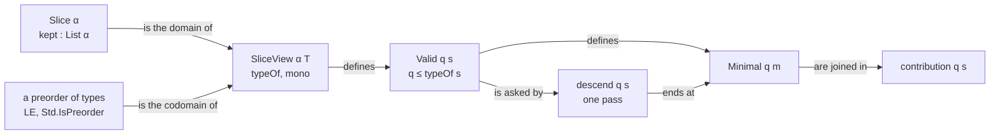

# 2026-10-06 seat LATTICE design: the generic theory of slices

Status: a design note (history, not authority). Brief:
`docs/research/2026-10-05-claude-lead/briefs/seat-lattice-brief.md`. Base: `57ed776a`. Plan:
`docs/research/2026-10-06-type-slicing-plan.md`, sections 2, 4.2 and 6. The paper is Carroll,
Madhavapeddy and Omar 2026, *Bidirectional Type Slicing*
(`vendor/papers/program-graphs/bidirectional-type-slicing-2607.12197v1.pdf`). Each page number
below is read on the vendored PDF. Lean elaborates each statement below in the seat's scratch
files. No file of the tree holds one yet.

## 1. The words of this note

- A **slice** is the paper's type slice: the part of one program that is kept. The dictionary's
  slice is a unit of work. This note writes "the work" for that.
- A **site** is one place of a program that a slice keeps or folds: an address.
- A **view** is a map from the slices of one program to types: the **type map**.
- A **monotone** map keeps the order: a slice that keeps less has a type at or below.
- A **query** is a type. A query is **valid** for a slice when the slice's type is at or above it.
- A slice is **minimal** for a query when it is valid and no valid slice below it keeps less.
- The **descent** is the function that goes from a valid slice down to a minimal one.

## 2. The decision

The module owns one concrete carrier: a slice is the list of the sites that it keeps. Its order
is inclusion of the kept sites. A smaller slice keeps less. An instance gives a type map and one
fact, its monotonicity. It proves nothing about its carrier.



The diagram shows the definitions and what each is built from. It claims no proof.

## 3. The interface, as Lean elaborates it

The carrier and its order. Each instance is one of Lean core's order classes
(`Init/Data/Order/Classes.lean` of the pinned toolchain), which `CTy` and `ErrTy` carry already
(`src/Effect4/Laws/Program/TypeAlgebra.lean`).

```lean
/-- A slice of one program: the sites that it keeps. -/
structure Slice (α : Type u) where
  kept : List α

instance : LE (Slice α) := ⟨fun a b => a.kept ⊆ b.kept⟩       -- a ≤ b: a keeps no more than b
instance : Std.IsPreorder (Slice α)
instance : Max (Slice α) := ⟨fun a b => ⟨a.kept ++ b.kept⟩⟩   -- the join keeps what either keeps
instance : Std.LawfulOrderSup (Slice α)
instance [DecidableEq α] : Min (Slice α)                       -- the meet keeps what both keep
instance [DecidableEq α] : Std.LawfulOrderInf (Slice α)
instance [DecidableEq α] (a b : Slice α) : Decidable (a ≤ b)
```

The view, validity and minimality.

```lean
/-- A view of one program: the type of each slice. An instance owes `mono` and nothing else. -/
structure SliceView (α : Type u) (T : Type v) [LE T] where
  typeOf : Slice α → T
  mono : ∀ {a b : Slice α}, a ≤ b → typeOf a ≤ typeOf b

def SliceView.Valid (v : SliceView α T) (q : T) (s : Slice α) : Prop := q ≤ v.typeOf s

def SliceView.Minimal (v : SliceView α T) (q : T) (m : Slice α) : Prop :=
  v.Valid q m ∧ ∀ j : Slice α, j ≤ m → v.Valid q j → m ≤ j
```

The executable functions.

```lean
-- one pass over the sites not yet tried; `done` holds the sites tried and kept
def Slice.sweep (valid : Slice α → Bool) : List α → List α → List α
  | done, [] => done
  | done, x :: rest =>
    if valid ⟨done ++ rest⟩ then sweep valid done rest else sweep valid (done ++ [x]) rest

-- the same pass with the slices that it asked about
def Slice.sweepLog (valid : Slice α → Bool) : List α → List α → List α × List (Slice α)

-- the paper's descent: take the first valid slice one site below, and start again
def Slice.restart (valid : Slice α → Bool) (l : List α) : List α

def SliceView.descend [DecidableLE T] (v : SliceView α T) (q : T) (s : Slice α) : Slice α :=
  ⟨Slice.sweep (fun c => decide (v.Valid q c)) [] s.kept⟩

def SliceView.asked [DecidableLE T] (v : SliceView α T) (q : T) (s : Slice α) : List (Slice α)

-- valid, and not valid without any one kept site: at most one question for each kept site, and one
def SliceView.isMinimal [DecidableEq α] [DecidableLE T] (v : SliceView α T) (q : T)
    (m : Slice α) : Bool

-- every minimal slice below `s`, by a search of every sub-list of its sites
def SliceView.minimals [DecidableEq α] [DecidableLE T] (v : SliceView α T) (q : T)
    (s : Slice α) : List (Slice α)

-- the sites of `s` that some minimal slice below `s` keeps
def SliceView.contribution [DecidableEq α] [DecidableLE T] (v : SliceView α T) (q : T)
    (s : Slice α) : Slice α

-- a view from a type map of what is folded: the plan's mask
def SliceView.ofFolded [DecidableEq α] (sites : List α) (f : List α → T)
    (anti : ∀ {F G : List α}, F ⊆ G → G ⊆ sites → f G ≤ f F) : SliceView α T
```

The statements, copied from `#check`. Each becomes a planned goal placed at R14, and then a
theorem in place.

```lean
SliceView.valid_up : ∀ {α : Type u_1} {T : Type u_2} [inst : LE T] [Std.IsPreorder T]
  (v : SliceView α T) {q : T} {a b : Slice α}, v.Valid q a → a ≤ b → v.Valid q b

SliceView.minimal_iff_drop : ∀ {α : Type u_1} {T : Type u_2} [inst : LE T]
  [inst_1 : DecidableEq α] [Std.IsPreorder T] (v : SliceView α T) (q : T) (m : Slice α),
  v.Minimal q m ↔ v.Valid q m ∧ ∀ (x : α), x ∈ m.kept → ¬v.Valid q (m.drop x)

SliceView.isMinimal_iff : ∀ {α : Type u_1} {T : Type u_2} [inst : LE T] [inst_1 : DecidableEq α]
  [Std.IsPreorder T] [inst_3 : DecidableLE T] (v : SliceView α T) (q : T) (m : Slice α),
  v.isMinimal q m = true ↔ v.Minimal q m

SliceView.descend_sublist : ∀ {α : Type u_1} {T : Type u_2} [inst : LE T]
  [inst_1 : DecidableLE T] (v : SliceView α T) (q : T) (s : Slice α),
  (v.descend q s).kept.Sublist s.kept

SliceView.descend_minimal : ∀ {α : Type u_1} {T : Type u_2} [inst : LE T] [DecidableEq α]
  [Std.IsPreorder T] [inst_3 : DecidableLE T] (v : SliceView α T) {q : T} {s : Slice α},
  v.Valid q s → v.Minimal q (v.descend q s)

SliceView.descend_eq_restart : ∀ {α : Type u_1} {T : Type u_2} [inst : LE T] [Std.IsPreorder T]
  [inst_2 : DecidableLE T] (v : SliceView α T) (q : T) (s : Slice α),
  v.descend q s = { kept := Slice.restart (fun c => decide (v.Valid q c)) s.kept }

SliceView.descend_asks : ∀ {α : Type u_1} {T : Type u_2} [inst : LE T] [inst_1 : DecidableLE T]
  (v : SliceView α T) (q : T) (s : Slice α),
  (v.asked q s).length = s.kept.length ∧
    ∀ (valid' : Slice α → Bool),
      (∀ (c : Slice α), c ∈ v.asked q s → valid' c = decide (v.Valid q c)) →
        Slice.sweep valid' [] s.kept = (v.descend q s).kept

SliceView.exists_minimal_below : ∀ {α : Type u_1} {T : Type u_2} [inst : LE T] [DecidableEq α]
  [Std.IsPreorder T] [DecidableLE T] (v : SliceView α T) {q : T} {s : Slice α},
  v.Valid q s → ∃ m, m ≤ s ∧ v.Minimal q m

SliceView.minimal_refine : ∀ {α : Type u_1} {T : Type u_2} [inst : LE T] [DecidableEq α]
  [Std.IsPreorder T] [DecidableLE T] (v : SliceView α T) {q₁ q₂ : T} {m₂ : Slice α},
  q₁ ≤ q₂ → v.Minimal q₂ m₂ → ∃ m₁, m₁ ≤ m₂ ∧ v.Minimal q₁ m₁

SliceView.valid_max : ∀ {α : Type u_1} {T : Type u_2} [inst : LE T] [Std.IsPreorder T]
  [inst_2 : Max T] [Std.LawfulOrderSup T] (v : SliceView α T) {q₁ q₂ : T} {a b : Slice α},
  v.Valid q₁ a → v.Valid q₂ b → v.Valid (max q₁ q₂) (max a b)

SliceView.contribution_lub : ∀ {α : Type u_1} {T : Type u_2} [inst : LE T]
  [inst_1 : DecidableEq α] [Std.IsPreorder T] [inst_3 : DecidableLE T] (v : SliceView α T)
  (q : T) (s u : Slice α),
  v.contribution q s ≤ u ↔ ∀ (m : Slice α), m ≤ s → v.Minimal q m → m ≤ u

SliceView.contribution_valid : ∀ {α : Type u_1} {T : Type u_2} [inst : LE T]
  [inst_1 : DecidableEq α] [Std.IsPreorder T] [inst_3 : DecidableLE T] (v : SliceView α T)
  {q : T} {s : Slice α}, v.Valid q s → v.Valid q (v.contribution q s)

SliceView.ofFolded_full : ∀ {α : Type u_1} {T : Type u_2} [inst : LE T] [inst_1 : DecidableEq α]
  (sites : List α) (f : List α → T) (anti : ∀ {F G : List α}, F ⊆ G → G ⊆ sites → f G ≤ f F),
  (SliceView.ofFolded sites f ⋯).typeOf { kept := sites } = f []
```

## 4. The decisions, each with its reason

### 4.1 The carrier: the kept sites, as a list

The brief names two ways to ask for a finite lattice with no Mathlib. The seat wrote three
candidates in scratch and met each with two instances. The first instance is the toy of the
battery: a term with holes over five constructors, with sliced assumptions. The second is a mask
over a list of addresses, at `CTy` and at `ErrTy`.

| Candidate | The carrier | What an instance owes | Verdict |
| --- | --- | --- | --- |
| I | an abstract type with a decidable order and a list of all its elements | The carrier must be a type with finitely many elements, so it is tied to one program. The instance owes six facts before its monotonicity: the order's three laws, the wholeness of the list, and two laws of the slices one step below | refused: the instance proves its own carrier's finiteness |
| III-b | flags by position over a fixed list of sites | its monotonicity, after an adapter of the module from flags to kept sites. Lengths must agree, or the order is not antisymmetric. Each statement reads a slice through the adapter | refused: the same fact owed, and more plumbing in each statement |
| III-a | the list of the kept sites, ordered by inclusion | its monotonicity | **taken** |

The reasons for III-a:

1. **Finiteness is free.** A slice is a list, so the slices below it are its sub-lists. The
   module lists them (`Slice.below`). It proves that each slice below keeps the same sites as
   one member of the list.
2. **An instance reasons by membership.** A real type map folds a node when its address is not
   kept. Its monotonicity proof then reads "kept in `a`, so kept in `b`", with no index.
3. **The order is the paper's.** The paper writes a slice as a highlight of the program (p. 7).
   The kept sites are the highlight. Inclusion of highlights is the paper's precision.
4. **The direction is in the name.** The field is `kept`. A list of addresses with no name can
   be read as the folded ones. The plan's mask lists the folded ones, and `ofFolded` is the
   adapter (4.7).

What III-a costs, and where the cost is paid:

- **The order is a preorder.** Two lists that keep the same sites differ as values. So
  `Minimal` asks that a valid slice below keeps the same sites, not that it is equal. On a
  partial order the two notions agree, and the paper's Definition 4.3 (p. 9) is the equal one.
- **A lookup is linear.** A type map that tests many addresses converts the list once in each
  call. The module's own work on a list is dominated by the instance's type map.
- **The kept sites need not be closed under parents.** The paper's carrier is the lower set of a
  term under precision: a kept node has a kept parent. Here a slice may keep a node under a
  folded one. A type map built from a fold ignores such a node. A minimal slice then keeps none:
  `minimal_iff_drop` drops it.

Candidate I is not lost. The paper proves existence by enumeration (Theorem 4.5, p. 9), with no
use of monotonicity. `Slice.below` is that enumeration for the taken carrier.

### 4.2 The type side: core's order classes

- **Validity needs a preorder**: `[LE T] [Std.IsPreorder T]`. Only transitivity is used.
- **The executable descent needs a decision**: `[DecidableLE T]`.
- **Theorem 4.7 alone needs a join**: `[Max T] [Std.LawfulOrderSup T]`.
- **The search needs equal sites decided**: `[DecidableEq α]`. The gate admits no classical
  axiom, so a proof by cases on membership needs the decision.

The reason for classes: `CTy` and `ErrTy` carry all four (`instIsPartialOrder`,
`instLawfulOrderSup`, `src/Effect4/Laws/Program/TypeAlgebra.lean`). Tested: each class resolves
at both carriers in the scratch sketch. Core's lemmas then apply as they are (`Std.le_trans`,
`Std.max_le_iff`, `Std.left_le_max`).

The cost: one type carries one order. `Ty` itself carries its key order as `LE`. A view by
precision over a type that already has subtyping needs a wrapper type. The alternative is an
order as data, as `WorldOrder` is (`src/Effect4/Laws/Effects/Protocol.lean`). The seat did not
take it: each statement would then name the order, and no core lemma would apply.

### 4.3 Validity is "at or above", and an exact slice need not exist

`Valid q s` is `q ≤ typeOf s`: the paper's condition `υ ⊑ φ` (Definition 4.1, p. 9). It is not
an equality. The paper's Counterexample 4.2 (p. 9) is the reason. Its program is
`x : 1 → 1 ⊢ (x, x)`, and its query is `(1 → □) × (□ → 1)`. The only valid slice is the whole
program, and its type is strictly above the query. The battery renders it in the toy.

A query that the start slice does not serve is served by no slice below it. That is
`valid_up`, read backwards. The battery holds it as a red control.

### 4.4 The descent is one pass, and it is the paper's descent

The brief's descent takes the first valid slice one step below and starts again. `Slice.restart`
is that function. Under monotonicity a site that failed once fails at every later slice. So one
pass gives the same slice: `Slice.sweep`. `descend_eq_restart` states the equality, and the
executable `descend` is the pass.

- **Its choice is fixed.** It tries the sites in the order of the start's list, once each. It
  drops a site exactly when the slice without it is still valid.
- **Its termination is by structure.** The pass recurses on the list of sites not yet tried.
- **Its cost is one question for each site of the start.** `descend_asks` states it in two
  parts. The log has one entry for each site. The result depends on the validity at the logged
  slices only. No counter beside the function carries the claim.
- **It returns one minimal slice, not the smallest.** The paper proves that a minimum-size
  slice is NP-hard in its calculus (section 10, p. 22).

Tested, a finite probe: with validity "keeps the first half of `n` sites", `restart` asks 120
questions at `n = 20` and 255 at `n = 30`. The pass asks 20 and 30, and the two slices are equal.

The paper states the bound `O(n × T)` for its descent (p. 10). The pass meets it: `n` questions.

### 4.5 Minimality is decided one step below

`minimal_iff_drop`: a valid slice is minimal exactly when no slice one site below is valid.
This is the paper's "if none of the slices satisfy the query, then a minimal slice has been
found, by graduality" (pp. 9 and 10). `isMinimal` is its executable form, and it gives
`Decidable (v.Minimal q m)`. So `decide` proves the minimality of one slice of a finite
instance.

### 4.6 The contribution slice is a search, and it says so

The paper's contribution slice is the join of all minimal slices (section 4.6, p. 12).
`contribution q s` keeps the sites of `s` that some minimal slice below `s` keeps.
`contribution_lub` states that it is their least upper bound, and `contribution_valid` that it
is valid when `s` is. `valid_max` is Theorem 4.7 itself (p. 12).

The function searches every sub-list of the start's sites. That is `2 ^ n` slices. The module
states no better bound, and decisions row 282 promises the contribution slice on request only.
A view with a structural calculus computes it another way: the paper's section 8, outside this
work.

### 4.7 The plan's mask, and why the adapter's premise is relative

The plan's mask lists the folded addresses. `Slice.folded sites s` is the sites that `s` does
not keep, and `ofFolded sites f anti` is the view of a type map `f` of the folded sites. Its
premise `anti` is owed below `sites` only: `F ⊆ G → G ⊆ sites → f G ≤ f F`.

The reason: a real instance folds only some addresses. Under candidate A they are the addresses
whose error flows into no value. Its graduality holds for those and for no other list. A premise
over every list would be false for it. `ofFolded_full` is the plan's conservativity in one
line: the full slice folds nothing.

### 4.8 Where the definitions live

One law module, `src/Effect4/Laws/Slice/Lattice.lean`. No core module: the `Effect4` root has
no caller of the descent today. A definition of the module uses a theorem in three places only:

- the termination of `restart`;
- the `Decidable` instance of `Minimal`;
- the proof field of `ofFolded`.

Each of those theorems is in the module, and none uses a tool of the law graph. So a later move
of the definitions to a core module is a cut of the file, when a view reaches the API.

## 5. The statements and their placement

Concept: `subtyping-algebra`. Requirement: R14. Claim: the proposed `slice-lattice-minimal`.
Reach: every monotone map from the slices of one program to a preorder of types, with the
decisions that 4.2 lists. Consumer: each slice view, first the error and requirement provenance
of the plan's slice 4.

| Statement | The paper | What ours adds, and what it leaves out |
| --- | --- | --- |
| `valid_up` | the validity condition and graduality (pp. 5 and 9) | stated for any monotone map; the paper has it by Theorem 3.5 for its calculus |
| `minimal_iff_drop`, `isMinimal_iff` | the brute-force algorithm's last step (pp. 9 and 10) | an executable test with its law; minimal means "keeps the same sites", on a preorder |
| `exists_minimal_below` | Theorem 4.5 (p. 9) | uses monotonicity, which the paper's proof by enumeration does not; names two decision premises; leaves out a map that is not monotone |
| `descend_sublist`, `descend_minimal` | the brute-force algorithm (pp. 9 and 10) | a function with its law; the result lists the start's sites in the start's order |
| `descend_eq_restart` | the same | the paper's descent and the single pass give one slice |
| `descend_asks` | the bound `O(n × T)` (p. 10) | the number of questions, as a statement about the function |
| `minimal_refine` | Theorem 4.6 (p. 10) | the same statement; nothing upwards, as the paper says (p. 11) |
| `valid_max` | Theorem 4.7 (p. 12) | the same statement, with the type join as core's `max` |
| `contribution_lub`, `contribution_valid` | the contribution slice (p. 12) | a function, by search, with its two laws |
| `ofFolded_full` | none: the plan's `slice-conservative` | the adapter's one law |

Each helper names the statement that it is a step of, in its docstring.

## 6. What was run

- Tested: `P1.lean` to `P3.lean` and `DraftCheck.lean` of the seat's scratch folder elaborate
  under `-DwarningAsError=true`. `#print axioms` gives `[propext, Quot.sound]` at most for each
  statement of section 3.
- Tested: the toy instance (`ToyCheck.lean`). Its one fact is `synth_mono`. With its helper it
  takes 59 lines of the scratch file. On the paper's example of page 18 the search finds four
  minimal slices, and the descent returns one of them.
- Tested: the address sketch (`AddrCheck.lean`). `SliceView.ofFolded` meets a record of sites, a
  column and its graduality, at `CTy` and at `ErrTy`.
- Tested: the two refused candidates against the same toy (`AltCheck.lean`).
- Tested: the count of questions of section 4.4, and `decide +kernel` on the search of the page
  18 example, 1024 slices (`MeasureCheck.lean`).
- A measured trap: `#print axioms` gives `Classical.choice` for `List.filter_eq_nil_iff` and for
  `List.eq_nil_iff_forall_not_mem` on this toolchain. `Slice.folded_full` is proved by a `match`
  instead.

## 7. What this does not establish

- That any real type map is monotone. That is each instance's one fact, and for the checker it
  is the plan's `column-graduality`.
- A least slice. The paper shows that the type map does not keep meets (p. 23). The battery
  renders its example.
- A minimum-size slice.
- A bound for the contribution slice below the search.
- Anything about `Eff`, `Ty` or the checker. No statement names one.

## 8. The order of the work

1. This note.
2. The module with its definitions and each statement of section 3 as a planned goal.
3. The proofs in place, in four steps:
   - validity and the one-step test;
   - the descent, with Theorems 4.5 and 4.6;
   - the cost, and the agreement with the restart;
   - Theorem 4.7, with the contribution slice and the adapter.
4. The battery, with the paper's examples and the red controls.
5. The receipt, with the note on speed and on Lean's tools.
