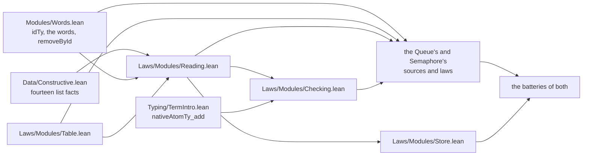

# 2026-10-06 seat MOVE receipt: each shared piece of the composed modules has one home that names no module

Status: receipt (history, not authority). Brief:
`docs/research/2026-10-05-claude-lead/briefs/seat-move-brief.md`, with the dispatch message.
The coordinator sent four messages after the brief. Item 2 names what each one changed.

**The one thing to know before merging:** two of the coordinator's files name
`src/Effect4/Laws/Modules/Queue/Checking.lean`, and this branch deletes that file.
`make check-docs` fails at one line of `docs/core/decisions.md`. The semantics registry lists
one default module that is not loaded, so the report's producer refuses it. Item 8 gives each
line with its new path. The coordinator accepts this state until the merge (message 3).

Eight more facts stand beside it.

- **No statement changed.** The comparison against `023dc609` finds equal types for 191 moved
  declarations and for 1820 declarations that stay. It names 13 planned differences, and it
  finds no other difference (item 4). One of the 13 is the 192nd moved declaration,
  `reads_removeById`: its statement names the pass by the pass's new name.
- **No proof changed but the planned ones.** Every other proof term of the scope is equal
  after the renames. Three proofs change as the brief asks: `reads_removeTaker`,
  `reads_removeOffer` and `evalTerm_weaken`.
- **No step term moved.** `make gen-fixtures` leaves `git status` empty after step 1, after
  step 3 and at the head. No line of `Test/Program/QueueFaces.lean` changed.
- **Nothing under `Test/Dogfood` changed.** The default build elaborates those batteries
  again after the edit of `src/Effect4/Data/Constructive.lean`, and each passes.
- **`generated/semantics.md` is stale after the merge.** Three placed nodes have new full
  names, and the report shows four names with their module (item 8).
- **The proof-style baseline loses one `unread` entry**, by the repair of the token `under`.
  The four kinds of uses keep their totals (item 7).
- **The control of the token stands in the default build**, as a fixture that the proof-style
  scan reads. `Test/Audit/TraversalCensus.lean` is as the base has it (item 6, choice 16).
- **The steps ran in the order 1, 2, 4, 3, 5.** The coordinator agreed (message 2).

## 2. Base, head and commits

| Item | Value |
| --- | --- |
| Branch | `seat/move`, in the worktree `/Users/pooks/Dev/lean4-effect4-mask` |
| Base of the dispatch | `4990177f` |
| Main-line head taken in | `023dc609`, by a fast-forward before the first commit. The comparison's base is `023dc609` |
| Head | the commit that adds this receipt; its parent is `5d66aa15` |

Nothing is pushed. Main moved after `023dc609`, and this branch does not merge it (message 3).
Main is at `c33d1b7d` as I write. It changes 37 files after `023dc609`, and no one of them is
a file that this branch changes. Its 22 changed Lean files name no moved namespace (tested: one
search of each file at `c33d1b7d`). I did not build the merge.

| Commit | Step of the brief | Content |
| --- | --- | --- |
| `707a3ff3` | 1 | `src/Effect4/Modules/Words.lean`: `idTy`, twelve words and the pass `removeById`; both modules read them |
| `b056be1c` | 2 | `Table.lean`, `Reading.lean` and `Checking.lean` under `src/Effect4/Laws/Modules/`; the Queue's `Checking.lean` leaves |
| `be72cb42` | 4 | fourteen facts into `src/Effect4/Data/Constructive.lean`, in one edit; `lookup_weaken` exposed; `getElem?_weaken` removed |
| `3825c89c` | 3 | `src/Effect4/Laws/Modules/Store.lean`; Semaphore's nine other statements; the Queue's two removals as the shared pass |
| `3a88bef6` | 5 | `&" under "` in three commands, a first control in the census battery, and the recorded baseline |
| `372d3eec` | 5 | `displayName` in the semantics report, with nine controls |
| `28d738c0` | 5 | `docs/ARCHITECTURE.md` and the role register |
| `2374fd2a` | — | one title line of Semaphore's `Reading.lean`, which named the words that left |
| `5d66aa15` | 5 | the control of the token as a scanned fixture in `Test/Audit/ProofStyle.lean`; the census battery as the base has it |

The coordinator's messages, in order:

1. It names main at `023dc609`. It asks for a word in the first item if a moved word changes
   a file under `Test/Dogfood`.
2. It accepts step 4 before step 3, as one edit of `Constructive.lean` with `lookup_weaken` in
   the same build. It accepts `Effect4.Constructive.Decidable` for `not_decide_lt`. It asks
   for each fact's axioms after the move.
3. It chooses the deletion of the emptied file, with no pointer module. It asks for each such
   line of its documents, with the new path beside it. It names a change that lands on main,
   and it merges this branch into that change itself.
4. It takes the red fixture of the slow lane as its own, and it repairs that fixture on main.
   It accepts the control's place in the default build. It asks which pinned outputs the
   scratch copy of the census battery checks (item 4).

The shared files import in one order. An arrow reads "is imported by".



A file reads a shared piece in one way. It imports the piece's file, and it writes
`open Effect4.Modules`. It opens a list fact by its name, as
`open Effect4.Constructive.List (foldl_keep)`. The Queue's and Semaphore's files do so, and the
next module's files can do the same.

## 3. The moved declarations

The comparison's file `moved.tsv` lists 192 authored declarations that move: 23 definitions, 4
inductive types, 5 constructors and 160 theorems. A structure's field that is a proof counts
as a theorem. The old full name of a declaration is its old namespace and the same local name.

| New file | Declarations |
| --- | --- |
| `src/Effect4/Modules/Words.lean` | 13 |
| `src/Effect4/Laws/Modules/Table.lean` | 7 |
| `src/Effect4/Laws/Modules/Reading.lean` | 90 |
| `src/Effect4/Laws/Modules/Checking.lean` | 64 |
| `src/Effect4/Laws/Modules/Store.lean` | 3 |
| `src/Effect4/Laws/Program/Typing/TermIntro.lean` | 1 |
| `src/Effect4/Data/Constructive.lean` | 14 |

Three notes on the table below.

- **`removeById` is not a row.** It is a new name in `Words.lean`. Its value is the base
  tree's value of `Effect4.Queue.removeTaker`, and the comparison checks that. The Queue keeps
  `removeTaker` and `removeOffer` as its own names, each one application of `removeById`.
- **`reads_removeById` is the one row whose type differs by more than a moved name.** Its
  statement names the pass by the new name, `removeById`, where it named `Queue.removeTaker`.
- **The generated declarations follow.** Each matcher, recursor and equation lemma of a moved
  declaration has the new prefix, and the comparison holds it to the same equality.

| New full name | Kind | Old namespace | Old file | New file |
| --- | --- | --- | --- | --- |
| `Effect4.Constructive.Decidable.not_decide_lt` | theorem | `Effect4.Semaphore.Model` | `src/Effect4/Laws/Modules/Semaphore/Reading.lean` | `src/Effect4/Data/Constructive.lean` |
| `Effect4.Constructive.List.flatMap_congr` | theorem | `Effect4.Program.Ty` | `src/Effect4/Laws/Program/Template.lean` | `src/Effect4/Data/Constructive.lean` |
| `Effect4.Constructive.List.mem_zip_map_self` | theorem | `Effect4.Program.Ty` | `src/Effect4/Laws/Program/Template.lean` | `src/Effect4/Data/Constructive.lean` |
| `Effect4.Constructive.List.mem_zip_middle` | theorem | `Effect4.Program.Ty` | `src/Effect4/Laws/Program/Template.lean` | `src/Effect4/Data/Constructive.lean` |
| `Effect4.Constructive.List.eq_of_mem_zip_map` | theorem | `Effect4.Program.Ty` | `src/Effect4/Laws/Program/Template.lean` | `src/Effect4/Data/Constructive.lean` |
| `Effect4.Constructive.List.lookup_of_mem_nodup` | theorem | `Effect4.Program.Ty` | `src/Effect4/Laws/Program/Template.lean` | `src/Effect4/Data/Constructive.lean` |
| `Effect4.Constructive.List.foldl_keep` | theorem | `Effect4.Queue.Model` | `src/Effect4/Laws/Modules/Queue/Reading.lean` | `src/Effect4/Data/Constructive.lean` |
| `Effect4.Constructive.List.foldl_append_flatMap` | theorem | `Effect4.Queue.Model` | `src/Effect4/Laws/Modules/Queue/Reading.lean` | `src/Effect4/Data/Constructive.lean` |
| `Effect4.Constructive.List.foldl_snoc_map` | theorem | `Effect4.Queue.Model` | `src/Effect4/Laws/Modules/Queue/Steps.lean` | `src/Effect4/Data/Constructive.lean` |
| `Effect4.Constructive.List.foldl_or_any` | theorem | `Effect4.Queue.Model` | `src/Effect4/Laws/Modules/Queue/Steps.lean` | `src/Effect4/Data/Constructive.lean` |
| `Effect4.Constructive.List.foldl_fromFirst` | theorem | `Effect4.Semaphore.Model` | `src/Effect4/Laws/Modules/Semaphore/Reading.lean` | `src/Effect4/Data/Constructive.lean` |
| `Effect4.Constructive.List.length_dropWhile_le` | theorem | `Effect4.Semaphore.Model` | `src/Effect4/Laws/Modules/Semaphore/Reading.lean` | `src/Effect4/Data/Constructive.lean` |
| `Effect4.Constructive.List.fromFirst_find?` | theorem | `Effect4.Semaphore.Model` | `src/Effect4/Laws/Modules/Semaphore/Reading.lean` | `src/Effect4/Data/Constructive.lean` |
| `Effect4.Constructive.List.decide_length_zero` | theorem | `Effect4.Semaphore.Model` | `src/Effect4/Laws/Modules/Semaphore/Steps.lean` | `src/Effect4/Data/Constructive.lean` |
| `Effect4.Modules.Types` | definition | `Effect4.Queue.Model` | `src/Effect4/Laws/Modules/Queue/Checking.lean` | `src/Effect4/Laws/Modules/Checking.lean` |
| `Effect4.Modules.TypesEach` | definition | `Effect4.Queue.Model` | `src/Effect4/Laws/Modules/Queue/Checking.lean` | `src/Effect4/Laws/Modules/Checking.lean` |
| `Effect4.Modules.CapturedTy` | inductive | `Effect4.Queue.Model` | `src/Effect4/Laws/Modules/Queue/Checking.lean` | `src/Effect4/Laws/Modules/Checking.lean` |
| `Effect4.Modules.CapturedTy.mk` | constructor | `Effect4.Queue.Model` | `src/Effect4/Laws/Modules/Queue/Checking.lean` | `src/Effect4/Laws/Modules/Checking.lean` |
| `Effect4.Modules.CapturedTy.atScope` | theorem | `Effect4.Queue.Model` | `src/Effect4/Laws/Modules/Queue/Checking.lean` | `src/Effect4/Laws/Modules/Checking.lean` |
| `Effect4.Modules.CapturedTy.underFold` | theorem | `Effect4.Queue.Model` | `src/Effect4/Laws/Modules/Queue/Checking.lean` | `src/Effect4/Laws/Modules/Checking.lean` |
| `Effect4.Modules.Types.to` | theorem | `Effect4.Queue.Model` | `src/Effect4/Laws/Modules/Queue/Checking.lean` | `src/Effect4/Laws/Modules/Checking.lean` |
| `Effect4.Modules.Types.tree` | theorem | `Effect4.Queue.Model` | `src/Effect4/Laws/Modules/Queue/Checking.lean` | `src/Effect4/Laws/Modules/Checking.lean` |
| `Effect4.Modules.types_lit` | theorem | `Effect4.Queue.Model` | `src/Effect4/Laws/Modules/Queue/Checking.lean` | `src/Effect4/Laws/Modules/Checking.lean` |
| `Effect4.Modules.types_nat` | theorem | `Effect4.Queue.Model` | `src/Effect4/Laws/Modules/Queue/Checking.lean` | `src/Effect4/Laws/Modules/Checking.lean` |
| `Effect4.Modules.types_bool` | theorem | `Effect4.Queue.Model` | `src/Effect4/Laws/Modules/Queue/Checking.lean` | `src/Effect4/Laws/Modules/Checking.lean` |
| `Effect4.Modules.types_unit` | theorem | `Effect4.Semaphore.Model` | `src/Effect4/Laws/Modules/Semaphore/Typing.lean` | `src/Effect4/Laws/Modules/Checking.lean` |
| `Effect4.Modules.TypesAll` | definition | `Effect4.Queue.Model` | `src/Effect4/Laws/Modules/Queue/Checking.lean` | `src/Effect4/Laws/Modules/Checking.lean` |
| `Effect4.Modules.argsTy_ok` | theorem | `Effect4.Queue.Model` | `src/Effect4/Laws/Modules/Queue/Checking.lean` | `src/Effect4/Laws/Modules/Checking.lean` |
| `Effect4.Modules.TypesAll.trees` | theorem | `Effect4.Queue.Model` | `src/Effect4/Laws/Modules/Queue/Checking.lean` | `src/Effect4/Laws/Modules/Checking.lean` |
| `Effect4.Modules.types_app` | theorem | `Effect4.Queue.Model` | `src/Effect4/Laws/Modules/Queue/Checking.lean` | `src/Effect4/Laws/Modules/Checking.lean` |
| `Effect4.Modules.types_field` | theorem | `Effect4.Queue.Model` | `src/Effect4/Laws/Modules/Queue/Checking.lean` | `src/Effect4/Laws/Modules/Checking.lean` |
| `Effect4.Modules.types_recordSet` | theorem | `Effect4.Queue.Model` | `src/Effect4/Laws/Modules/Queue/Checking.lean` | `src/Effect4/Laws/Modules/Checking.lean` |
| `Effect4.Modules.types_tupleAt` | theorem | `Effect4.Queue.Model` | `src/Effect4/Laws/Modules/Queue/Checking.lean` | `src/Effect4/Laws/Modules/Checking.lean` |
| `Effect4.Modules.types_record` | theorem | `Effect4.Queue.Model` | `src/Effect4/Laws/Modules/Queue/Checking.lean` | `src/Effect4/Laws/Modules/Checking.lean` |
| `Effect4.Modules.types_minted_acc` | theorem | `Effect4.Queue.Model` | `src/Effect4/Laws/Modules/Queue/Checking.lean` | `src/Effect4/Laws/Modules/Checking.lean` |
| `Effect4.Modules.types_minted_item` | theorem | `Effect4.Queue.Model` | `src/Effect4/Laws/Modules/Queue/Checking.lean` | `src/Effect4/Laws/Modules/Checking.lean` |
| `Effect4.Modules.types_var` | theorem | `Effect4.Queue.Model` | `src/Effect4/Laws/Modules/Queue/Checking.lean` | `src/Effect4/Laws/Modules/Checking.lean` |
| `Effect4.Modules.types_minted` | theorem | `Effect4.Queue.Model` | `src/Effect4/Laws/Modules/Queue/Checking.lean` | `src/Effect4/Laws/Modules/Checking.lean` |
| `Effect4.Modules.capturedTy_var` | theorem | `Effect4.Queue.Model` | `src/Effect4/Laws/Modules/Queue/Checking.lean` | `src/Effect4/Laws/Modules/Checking.lean` |
| `Effect4.Modules.capturedTy_minted` | theorem | `Effect4.Queue.Model` | `src/Effect4/Laws/Modules/Queue/Checking.lean` | `src/Effect4/Laws/Modules/Checking.lean` |
| `Effect4.Modules.capturedTy_answer` | theorem | `Effect4.Queue.Model` | `src/Effect4/Laws/Modules/Queue/Checking.lean` | `src/Effect4/Laws/Modules/Checking.lean` |
| `Effect4.Modules.capturedTy_field` | theorem | `Effect4.Queue.Model` | `src/Effect4/Laws/Modules/Queue/Checking.lean` | `src/Effect4/Laws/Modules/Checking.lean` |
| `Effect4.Modules.types_foldWith` | theorem | `Effect4.Queue.Model` | `src/Effect4/Laws/Modules/Queue/Checking.lean` | `src/Effect4/Laws/Modules/Checking.lean` |
| `Effect4.Modules.types_foldWith_same` | theorem | `Effect4.Queue.Model` | `src/Effect4/Laws/Modules/Queue/Checking.lean` | `src/Effect4/Laws/Modules/Checking.lean` |
| `Effect4.Modules.atomOf_native` | theorem | `Effect4.Queue.Model` | `src/Effect4/Laws/Modules/Queue/Checking.lean` | `src/Effect4/Laws/Modules/Checking.lean` |
| `Effect4.Modules.types_nilT` | theorem | `Effect4.Queue.Model` | `src/Effect4/Laws/Modules/Queue/Checking.lean` | `src/Effect4/Laws/Modules/Checking.lean` |
| `Effect4.Modules.types_noneT` | theorem | `Effect4.Queue.Model` | `src/Effect4/Laws/Modules/Queue/Checking.lean` | `src/Effect4/Laws/Modules/Checking.lean` |
| `Effect4.Modules.types_some` | theorem | `Effect4.Queue.Model` | `src/Effect4/Laws/Modules/Queue/Checking.lean` | `src/Effect4/Laws/Modules/Checking.lean` |
| `Effect4.Modules.types_len` | theorem | `Effect4.Queue.Model` | `src/Effect4/Laws/Modules/Queue/Checking.lean` | `src/Effect4/Laws/Modules/Checking.lean` |
| `Effect4.Modules.types_isEmpty` | theorem | `Effect4.Queue.Model` | `src/Effect4/Laws/Modules/Queue/Checking.lean` | `src/Effect4/Laws/Modules/Checking.lean` |
| `Effect4.Modules.types_notT` | theorem | `Effect4.Queue.Model` | `src/Effect4/Laws/Modules/Queue/Checking.lean` | `src/Effect4/Laws/Modules/Checking.lean` |
| `Effect4.Modules.types_andT` | theorem | `Effect4.Queue.Model` | `src/Effect4/Laws/Modules/Queue/Checking.lean` | `src/Effect4/Laws/Modules/Checking.lean` |
| `Effect4.Modules.types_orT` | theorem | `Effect4.Queue.Model` | `src/Effect4/Laws/Modules/Queue/Checking.lean` | `src/Effect4/Laws/Modules/Checking.lean` |
| `Effect4.Modules.types_ifT_above` | theorem | `Effect4.Queue.Model` | `src/Effect4/Laws/Modules/Queue/Checking.lean` | `src/Effect4/Laws/Modules/Checking.lean` |
| `Effect4.Modules.types_ifT` | theorem | `Effect4.Queue.Model` | `src/Effect4/Laws/Modules/Queue/Checking.lean` | `src/Effect4/Laws/Modules/Checking.lean` |
| `Effect4.Modules.types_ifT_below` | theorem | `Effect4.Queue.Model` | `src/Effect4/Laws/Modules/Queue/Checking.lean` | `src/Effect4/Laws/Modules/Checking.lean` |
| `Effect4.Modules.types_same` | theorem | `Effect4.Queue.Model` | `src/Effect4/Laws/Modules/Queue/Checking.lean` | `src/Effect4/Laws/Modules/Checking.lean` |
| `Effect4.Modules.types_take` | theorem | `Effect4.Queue.Model` | `src/Effect4/Laws/Modules/Queue/Checking.lean` | `src/Effect4/Laws/Modules/Checking.lean` |
| `Effect4.Modules.types_drop` | theorem | `Effect4.Queue.Model` | `src/Effect4/Laws/Modules/Queue/Checking.lean` | `src/Effect4/Laws/Modules/Checking.lean` |
| `Effect4.Modules.types_noneOf` | theorem | `Effect4.Queue.Model` | `src/Effect4/Laws/Modules/Queue/Checking.lean` | `src/Effect4/Laws/Modules/Checking.lean` |
| `Effect4.Modules.types_append` | theorem | `Effect4.Queue.Model` | `src/Effect4/Laws/Modules/Queue/Checking.lean` | `src/Effect4/Laws/Modules/Checking.lean` |
| `Effect4.Modules.types_single` | theorem | `Effect4.Queue.Model` | `src/Effect4/Laws/Modules/Queue/Checking.lean` | `src/Effect4/Laws/Modules/Checking.lean` |
| `Effect4.Modules.types_snoc` | theorem | `Effect4.Queue.Model` | `src/Effect4/Laws/Modules/Queue/Checking.lean` | `src/Effect4/Laws/Modules/Checking.lean` |
| `Effect4.Modules.types_lt` | theorem | `Effect4.Queue.Model` | `src/Effect4/Laws/Modules/Queue/Checking.lean` | `src/Effect4/Laws/Modules/Checking.lean` |
| `Effect4.Modules.types_sub` | theorem | `Effect4.Queue.Model` | `src/Effect4/Laws/Modules/Queue/Checking.lean` | `src/Effect4/Laws/Modules/Checking.lean` |
| `Effect4.Modules.types_add` | theorem | `Effect4.Semaphore.Model` | `src/Effect4/Laws/Modules/Semaphore/Typing.lean` | `src/Effect4/Laws/Modules/Checking.lean` |
| `Effect4.Modules.types_isZero` | theorem | `Effect4.Semaphore.Model` | `src/Effect4/Laws/Modules/Semaphore/Typing.lean` | `src/Effect4/Laws/Modules/Checking.lean` |
| `Effect4.Modules.types_minT` | theorem | `Effect4.Queue.Model` | `src/Effect4/Laws/Modules/Queue/Checking.lean` | `src/Effect4/Laws/Modules/Checking.lean` |
| `Effect4.Modules.types_head` | theorem | `Effect4.Queue.Model` | `src/Effect4/Laws/Modules/Queue/Checking.lean` | `src/Effect4/Laws/Modules/Checking.lean` |
| `Effect4.Modules.types_pair` | theorem | `Effect4.Queue.Model` | `src/Effect4/Laws/Modules/Queue/Checking.lean` | `src/Effect4/Laws/Modules/Checking.lean` |
| `Effect4.Modules.types_tuple2` | theorem | `Effect4.Queue.Model` | `src/Effect4/Laws/Modules/Queue/Checking.lean` | `src/Effect4/Laws/Modules/Checking.lean` |
| `Effect4.Modules.types_tuple3` | theorem | `Effect4.Queue.Model` | `src/Effect4/Laws/Modules/Queue/Checking.lean` | `src/Effect4/Laws/Modules/Checking.lean` |
| `Effect4.Modules.types_sameItem` | theorem | `Effect4.Queue.Model` | `src/Effect4/Laws/Modules/Queue/Typing.lean` | `src/Effect4/Laws/Modules/Checking.lean` |
| `Effect4.Modules.types_removeById` | theorem | `Effect4.Queue.Model` | `src/Effect4/Laws/Modules/Queue/Typing.lean` | `src/Effect4/Laws/Modules/Checking.lean` |
| `Effect4.Modules.typeAt` | definition | `Effect4.Queue.Model` | `src/Effect4/Laws/Modules/Queue/Typing.lean` | `src/Effect4/Laws/Modules/Checking.lean` |
| `Effect4.Modules.typeAt_of_types` | theorem | `Effect4.Queue.Model` | `src/Effect4/Laws/Modules/Queue/Typing.lean` | `src/Effect4/Laws/Modules/Checking.lean` |
| `Effect4.Modules.typeAt_tree` | theorem | `Effect4.Queue.Model` | `src/Effect4/Laws/Modules/Queue/Typing.lean` | `src/Effect4/Laws/Modules/Checking.lean` |
| `Effect4.Modules.sub_nil_list` | theorem | `Effect4.Queue.Model` | `src/Effect4/Laws/Modules/Queue/Typing.lean` | `src/Effect4/Laws/Modules/Checking.lean` |
| `Effect4.Modules.Reads` | definition | `Effect4.Queue.Model` | `src/Effect4/Laws/Modules/Queue/Relation.lean` | `src/Effect4/Laws/Modules/Reading.lean` |
| `Effect4.Modules.Captured` | inductive | `Effect4.Queue.Model` | `src/Effect4/Laws/Modules/Queue/Relation.lean` | `src/Effect4/Laws/Modules/Reading.lean` |
| `Effect4.Modules.Captured.mk` | constructor | `Effect4.Queue.Model` | `src/Effect4/Laws/Modules/Queue/Relation.lean` | `src/Effect4/Laws/Modules/Reading.lean` |
| `Effect4.Modules.Captured.atScope` | theorem | `Effect4.Queue.Model` | `src/Effect4/Laws/Modules/Queue/Relation.lean` | `src/Effect4/Laws/Modules/Reading.lean` |
| `Effect4.Modules.Captured.underFold` | theorem | `Effect4.Queue.Model` | `src/Effect4/Laws/Modules/Queue/Relation.lean` | `src/Effect4/Laws/Modules/Reading.lean` |
| `Effect4.Modules.Reads.to` | theorem | `Effect4.Queue.Model` | `src/Effect4/Laws/Modules/Queue/Reading.lean` | `src/Effect4/Laws/Modules/Reading.lean` |
| `Effect4.Modules.Reads.eval` | theorem | `Effect4.Queue.Model` | `src/Effect4/Laws/Modules/Queue/Reading.lean` | `src/Effect4/Laws/Modules/Reading.lean` |
| `Effect4.Modules.reads_lit` | theorem | `Effect4.Queue.Model` | `src/Effect4/Laws/Modules/Queue/Reading.lean` | `src/Effect4/Laws/Modules/Reading.lean` |
| `Effect4.Modules.reads_nat` | theorem | `Effect4.Queue.Model` | `src/Effect4/Laws/Modules/Queue/Reading.lean` | `src/Effect4/Laws/Modules/Reading.lean` |
| `Effect4.Modules.reads_bool` | theorem | `Effect4.Queue.Model` | `src/Effect4/Laws/Modules/Queue/Reading.lean` | `src/Effect4/Laws/Modules/Reading.lean` |
| `Effect4.Modules.Pointwise` | inductive | `Effect4.Queue.Model` | `src/Effect4/Laws/Modules/Queue/Reading.lean` | `src/Effect4/Laws/Modules/Reading.lean` |
| `Effect4.Modules.Pointwise.nil` | constructor | `Effect4.Queue.Model` | `src/Effect4/Laws/Modules/Queue/Reading.lean` | `src/Effect4/Laws/Modules/Reading.lean` |
| `Effect4.Modules.Pointwise.cons` | constructor | `Effect4.Queue.Model` | `src/Effect4/Laws/Modules/Queue/Reading.lean` | `src/Effect4/Laws/Modules/Reading.lean` |
| `Effect4.Modules.ReadsAll` | definition | `Effect4.Queue.Model` | `src/Effect4/Laws/Modules/Queue/Reading.lean` | `src/Effect4/Laws/Modules/Reading.lean` |
| `Effect4.Modules.mapM_loop_ok` | theorem | `Effect4.Queue.Model` | `src/Effect4/Laws/Modules/Queue/Reading.lean` | `src/Effect4/Laws/Modules/Reading.lean` |
| `Effect4.Modules.mapM_ok` | theorem | `Effect4.Queue.Model` | `src/Effect4/Laws/Modules/Queue/Reading.lean` | `src/Effect4/Laws/Modules/Reading.lean` |
| `Effect4.Modules.evalTerms_ok` | theorem | `Effect4.Queue.Model` | `src/Effect4/Laws/Modules/Queue/Reading.lean` | `src/Effect4/Laws/Modules/Reading.lean` |
| `Effect4.Modules.ReadsAll.trees` | theorem | `Effect4.Queue.Model` | `src/Effect4/Laws/Modules/Queue/Reading.lean` | `src/Effect4/Laws/Modules/Reading.lean` |
| `Effect4.Modules.reads_app` | theorem | `Effect4.Queue.Model` | `src/Effect4/Laws/Modules/Queue/Reading.lean` | `src/Effect4/Laws/Modules/Reading.lean` |
| `Effect4.Modules.reads_field` | theorem | `Effect4.Queue.Model` | `src/Effect4/Laws/Modules/Queue/Reading.lean` | `src/Effect4/Laws/Modules/Reading.lean` |
| `Effect4.Modules.reads_recordSet` | theorem | `Effect4.Queue.Model` | `src/Effect4/Laws/Modules/Queue/Reading.lean` | `src/Effect4/Laws/Modules/Reading.lean` |
| `Effect4.Modules.Pointwise.of_map` | theorem | `Effect4.Queue.Model` | `src/Effect4/Laws/Modules/Queue/Reading.lean` | `src/Effect4/Laws/Modules/Reading.lean` |
| `Effect4.Modules.reads_record` | theorem | `Effect4.Queue.Model` | `src/Effect4/Laws/Modules/Queue/Reading.lean` | `src/Effect4/Laws/Modules/Reading.lean` |
| `Effect4.Modules.resolve_go_last` | theorem | `Effect4.Queue.Model` | `src/Effect4/Laws/Modules/Queue/Reading.lean` | `src/Effect4/Laws/Modules/Reading.lean` |
| `Effect4.Modules.resolve_last` | theorem | `Effect4.Queue.Model` | `src/Effect4/Laws/Modules/Queue/Reading.lean` | `src/Effect4/Laws/Modules/Reading.lean` |
| `Effect4.Modules.mint_acc_ne_item` | theorem | `Effect4.Queue.Model` | `src/Effect4/Laws/Modules/Queue/Reading.lean` | `src/Effect4/Laws/Modules/Reading.lean` |
| `Effect4.Modules.minted_tree` | theorem | `Effect4.Queue.Model` | `src/Effect4/Laws/Modules/Queue/Reading.lean` | `src/Effect4/Laws/Modules/Reading.lean` |
| `Effect4.Modules.minted_acc_tree` | theorem | `Effect4.Queue.Model` | `src/Effect4/Laws/Modules/Queue/Reading.lean` | `src/Effect4/Laws/Modules/Reading.lean` |
| `Effect4.Modules.minted_item_tree` | theorem | `Effect4.Queue.Model` | `src/Effect4/Laws/Modules/Queue/Reading.lean` | `src/Effect4/Laws/Modules/Reading.lean` |
| `Effect4.Modules.reads_minted_acc` | theorem | `Effect4.Queue.Model` | `src/Effect4/Laws/Modules/Queue/Reading.lean` | `src/Effect4/Laws/Modules/Reading.lean` |
| `Effect4.Modules.reads_minted_item` | theorem | `Effect4.Queue.Model` | `src/Effect4/Laws/Modules/Queue/Reading.lean` | `src/Effect4/Laws/Modules/Reading.lean` |
| `Effect4.Modules.mint_reserved` | theorem | `Effect4.Queue.Model` | `src/Effect4/Laws/Modules/Queue/Reading.lean` | `src/Effect4/Laws/Modules/Reading.lean` |
| `Effect4.Modules.var_tree` | theorem | `Effect4.Queue.Model` | `src/Effect4/Laws/Modules/Queue/Reading.lean` | `src/Effect4/Laws/Modules/Reading.lean` |
| `Effect4.Modules.captured_var` | theorem | `Effect4.Queue.Model` | `src/Effect4/Laws/Modules/Queue/Reading.lean` | `src/Effect4/Laws/Modules/Reading.lean` |
| `Effect4.Modules.resolve_under_pair` | theorem | `Effect4.Queue.Model` | `src/Effect4/Laws/Modules/Queue/Reading.lean` | `src/Effect4/Laws/Modules/Reading.lean` |
| `Effect4.Modules.captured_minted` | theorem | `Effect4.Queue.Model` | `src/Effect4/Laws/Modules/Queue/Reading.lean` | `src/Effect4/Laws/Modules/Reading.lean` |
| `Effect4.Modules.mint_acc_ne_answer` | theorem | `Effect4.Queue.Model` | `src/Effect4/Laws/Modules/Queue/Reading.lean` | `src/Effect4/Laws/Modules/Reading.lean` |
| `Effect4.Modules.mint_item_ne_answer` | theorem | `Effect4.Queue.Model` | `src/Effect4/Laws/Modules/Queue/Reading.lean` | `src/Effect4/Laws/Modules/Reading.lean` |
| `Effect4.Modules.written_ne_mint` | theorem | `Effect4.Queue.Model` | `src/Effect4/Laws/Modules/Queue/Reading.lean` | `src/Effect4/Laws/Modules/Reading.lean` |
| `Effect4.Modules.mint_depth_inj` | theorem | `Effect4.Queue.Model` | `src/Effect4/Laws/Modules/Queue/Reading.lean` | `src/Effect4/Laws/Modules/Reading.lean` |
| `Effect4.Modules.captured_answer` | theorem | `Effect4.Queue.Model` | `src/Effect4/Laws/Modules/Queue/Reading.lean` | `src/Effect4/Laws/Modules/Reading.lean` |
| `Effect4.Modules.captured_lit` | theorem | `Effect4.Queue.Model` | `src/Effect4/Laws/Modules/Queue/Reading.lean` | `src/Effect4/Laws/Modules/Reading.lean` |
| `Effect4.Modules.reads_foldWith` | theorem | `Effect4.Queue.Model` | `src/Effect4/Laws/Modules/Queue/Reading.lean` | `src/Effect4/Laws/Modules/Reading.lean` |
| `Effect4.Modules.reads_foldWith_model` | theorem | `Effect4.Queue.Model` | `src/Effect4/Laws/Modules/Queue/Reading.lean` | `src/Effect4/Laws/Modules/Reading.lean` |
| `Effect4.Modules.atom_nil` | theorem | `Effect4.Queue.Model` | `src/Effect4/Laws/Modules/Queue/Reading.lean` | `src/Effect4/Laws/Modules/Reading.lean` |
| `Effect4.Modules.atom_none` | theorem | `Effect4.Queue.Model` | `src/Effect4/Laws/Modules/Queue/Reading.lean` | `src/Effect4/Laws/Modules/Reading.lean` |
| `Effect4.Modules.atom_some` | theorem | `Effect4.Queue.Model` | `src/Effect4/Laws/Modules/Queue/Reading.lean` | `src/Effect4/Laws/Modules/Reading.lean` |
| `Effect4.Modules.atom_length` | theorem | `Effect4.Queue.Model` | `src/Effect4/Laws/Modules/Queue/Reading.lean` | `src/Effect4/Laws/Modules/Reading.lean` |
| `Effect4.Modules.atom_isZero` | theorem | `Effect4.Queue.Model` | `src/Effect4/Laws/Modules/Queue/Reading.lean` | `src/Effect4/Laws/Modules/Reading.lean` |
| `Effect4.Modules.atom_not` | theorem | `Effect4.Queue.Model` | `src/Effect4/Laws/Modules/Queue/Reading.lean` | `src/Effect4/Laws/Modules/Reading.lean` |
| `Effect4.Modules.atom_and` | theorem | `Effect4.Queue.Model` | `src/Effect4/Laws/Modules/Queue/Reading.lean` | `src/Effect4/Laws/Modules/Reading.lean` |
| `Effect4.Modules.atom_or` | theorem | `Effect4.Queue.Model` | `src/Effect4/Laws/Modules/Queue/Reading.lean` | `src/Effect4/Laws/Modules/Reading.lean` |
| `Effect4.Modules.atom_ite` | theorem | `Effect4.Queue.Model` | `src/Effect4/Laws/Modules/Queue/Reading.lean` | `src/Effect4/Laws/Modules/Reading.lean` |
| `Effect4.Modules.atom_take` | theorem | `Effect4.Queue.Model` | `src/Effect4/Laws/Modules/Queue/Reading.lean` | `src/Effect4/Laws/Modules/Reading.lean` |
| `Effect4.Modules.atom_drop` | theorem | `Effect4.Queue.Model` | `src/Effect4/Laws/Modules/Queue/Reading.lean` | `src/Effect4/Laws/Modules/Reading.lean` |
| `Effect4.Modules.atom_append` | theorem | `Effect4.Queue.Model` | `src/Effect4/Laws/Modules/Queue/Reading.lean` | `src/Effect4/Laws/Modules/Reading.lean` |
| `Effect4.Modules.atom_cons` | theorem | `Effect4.Queue.Model` | `src/Effect4/Laws/Modules/Queue/Reading.lean` | `src/Effect4/Laws/Modules/Reading.lean` |
| `Effect4.Modules.atom_lt` | theorem | `Effect4.Queue.Model` | `src/Effect4/Laws/Modules/Queue/Reading.lean` | `src/Effect4/Laws/Modules/Reading.lean` |
| `Effect4.Modules.atom_sub` | theorem | `Effect4.Queue.Model` | `src/Effect4/Laws/Modules/Queue/Reading.lean` | `src/Effect4/Laws/Modules/Reading.lean` |
| `Effect4.Modules.atom_add` | theorem | `Effect4.Semaphore.Model` | `src/Effect4/Laws/Modules/Semaphore/Reading.lean` | `src/Effect4/Laws/Modules/Reading.lean` |
| `Effect4.Modules.atom_get` | theorem | `Effect4.Queue.Model` | `src/Effect4/Laws/Modules/Queue/Reading.lean` | `src/Effect4/Laws/Modules/Reading.lean` |
| `Effect4.Modules.atom_pair` | theorem | `Effect4.Queue.Model` | `src/Effect4/Laws/Modules/Queue/Reading.lean` | `src/Effect4/Laws/Modules/Reading.lean` |
| `Effect4.Modules.atom_tuple` | theorem | `Effect4.Queue.Model` | `src/Effect4/Laws/Modules/Queue/Reading.lean` | `src/Effect4/Laws/Modules/Reading.lean` |
| `Effect4.Modules.atom_sameHandle` | theorem | `Effect4.Queue.Model` | `src/Effect4/Laws/Modules/Queue/Reading.lean` | `src/Effect4/Laws/Modules/Reading.lean` |
| `Effect4.Modules.reads_nilT` | theorem | `Effect4.Queue.Model` | `src/Effect4/Laws/Modules/Queue/Reading.lean` | `src/Effect4/Laws/Modules/Reading.lean` |
| `Effect4.Modules.reads_noneT` | theorem | `Effect4.Queue.Model` | `src/Effect4/Laws/Modules/Queue/Reading.lean` | `src/Effect4/Laws/Modules/Reading.lean` |
| `Effect4.Modules.reads_some` | theorem | `Effect4.Queue.Model` | `src/Effect4/Laws/Modules/Queue/Reading.lean` | `src/Effect4/Laws/Modules/Reading.lean` |
| `Effect4.Modules.reads_len` | theorem | `Effect4.Queue.Model` | `src/Effect4/Laws/Modules/Queue/Reading.lean` | `src/Effect4/Laws/Modules/Reading.lean` |
| `Effect4.Modules.reads_isEmpty` | theorem | `Effect4.Queue.Model` | `src/Effect4/Laws/Modules/Queue/Reading.lean` | `src/Effect4/Laws/Modules/Reading.lean` |
| `Effect4.Modules.reads_notT` | theorem | `Effect4.Queue.Model` | `src/Effect4/Laws/Modules/Queue/Reading.lean` | `src/Effect4/Laws/Modules/Reading.lean` |
| `Effect4.Modules.reads_andT` | theorem | `Effect4.Queue.Model` | `src/Effect4/Laws/Modules/Queue/Reading.lean` | `src/Effect4/Laws/Modules/Reading.lean` |
| `Effect4.Modules.reads_orT` | theorem | `Effect4.Queue.Model` | `src/Effect4/Laws/Modules/Queue/Reading.lean` | `src/Effect4/Laws/Modules/Reading.lean` |
| `Effect4.Modules.reads_ifT` | theorem | `Effect4.Queue.Model` | `src/Effect4/Laws/Modules/Queue/Reading.lean` | `src/Effect4/Laws/Modules/Reading.lean` |
| `Effect4.Modules.reads_same` | theorem | `Effect4.Queue.Model` | `src/Effect4/Laws/Modules/Queue/Reading.lean` | `src/Effect4/Laws/Modules/Reading.lean` |
| `Effect4.Modules.reads_take` | theorem | `Effect4.Queue.Model` | `src/Effect4/Laws/Modules/Queue/Reading.lean` | `src/Effect4/Laws/Modules/Reading.lean` |
| `Effect4.Modules.reads_drop` | theorem | `Effect4.Queue.Model` | `src/Effect4/Laws/Modules/Queue/Reading.lean` | `src/Effect4/Laws/Modules/Reading.lean` |
| `Effect4.Modules.reads_noneOf` | theorem | `Effect4.Queue.Model` | `src/Effect4/Laws/Modules/Queue/Reading.lean` | `src/Effect4/Laws/Modules/Reading.lean` |
| `Effect4.Modules.reads_append` | theorem | `Effect4.Queue.Model` | `src/Effect4/Laws/Modules/Queue/Reading.lean` | `src/Effect4/Laws/Modules/Reading.lean` |
| `Effect4.Modules.reads_snoc` | theorem | `Effect4.Queue.Model` | `src/Effect4/Laws/Modules/Queue/Reading.lean` | `src/Effect4/Laws/Modules/Reading.lean` |
| `Effect4.Modules.reads_lt` | theorem | `Effect4.Queue.Model` | `src/Effect4/Laws/Modules/Queue/Reading.lean` | `src/Effect4/Laws/Modules/Reading.lean` |
| `Effect4.Modules.reads_sub` | theorem | `Effect4.Queue.Model` | `src/Effect4/Laws/Modules/Queue/Reading.lean` | `src/Effect4/Laws/Modules/Reading.lean` |
| `Effect4.Modules.reads_minT` | theorem | `Effect4.Queue.Model` | `src/Effect4/Laws/Modules/Queue/Reading.lean` | `src/Effect4/Laws/Modules/Reading.lean` |
| `Effect4.Modules.reads_head` | theorem | `Effect4.Queue.Model` | `src/Effect4/Laws/Modules/Queue/Reading.lean` | `src/Effect4/Laws/Modules/Reading.lean` |
| `Effect4.Modules.reads_pair` | theorem | `Effect4.Queue.Model` | `src/Effect4/Laws/Modules/Queue/Reading.lean` | `src/Effect4/Laws/Modules/Reading.lean` |
| `Effect4.Modules.reads_tuple2` | theorem | `Effect4.Queue.Model` | `src/Effect4/Laws/Modules/Queue/Reading.lean` | `src/Effect4/Laws/Modules/Reading.lean` |
| `Effect4.Modules.reads_tuple3` | theorem | `Effect4.Queue.Model` | `src/Effect4/Laws/Modules/Queue/Reading.lean` | `src/Effect4/Laws/Modules/Reading.lean` |
| `Effect4.Modules.reads_add` | theorem | `Effect4.Semaphore.Model` | `src/Effect4/Laws/Modules/Semaphore/Reading.lean` | `src/Effect4/Laws/Modules/Reading.lean` |
| `Effect4.Modules.reads_isZero` | theorem | `Effect4.Semaphore.Model` | `src/Effect4/Laws/Modules/Semaphore/Reading.lean` | `src/Effect4/Laws/Modules/Reading.lean` |
| `Effect4.Modules.reads_unit` | theorem | `Effect4.Semaphore.Model` | `src/Effect4/Laws/Modules/Semaphore/Reading.lean` | `src/Effect4/Laws/Modules/Reading.lean` |
| `Effect4.Modules.reads_removeById` | theorem | `Effect4.Semaphore.Model` | `src/Effect4/Laws/Modules/Semaphore/Reading.lean` | `src/Effect4/Laws/Modules/Reading.lean` |
| `Effect4.Modules.step_updates` | theorem | `Effect4.Queue.Model` | `src/Effect4/Laws/Modules/Queue/Steps.lean` | `src/Effect4/Laws/Modules/Store.lean` |
| `Effect4.Modules.step_keeps_cell` | theorem | `Effect4.Queue.Model` | `src/Effect4/Laws/Modules/Queue/Steps.lean` | `src/Effect4/Laws/Modules/Store.lean` |
| `Effect4.Modules.cell_read` | theorem | `Effect4.Queue.Model` | `src/Effect4/Laws/Modules/Queue/Steps.lean` | `src/Effect4/Laws/Modules/Store.lean` |
| `Effect4.Modules.Table` | inductive | `Effect4.Queue.Model` | `src/Effect4/Laws/Modules/Queue/Relation.lean` | `src/Effect4/Laws/Modules/Table.lean` |
| `Effect4.Modules.Table.mk` | constructor | `Effect4.Queue.Model` | `src/Effect4/Laws/Modules/Queue/Relation.lean` | `src/Effect4/Laws/Modules/Table.lean` |
| `Effect4.Modules.Table.handle` | definition | `Effect4.Queue.Model` | `src/Effect4/Laws/Modules/Queue/Relation.lean` | `src/Effect4/Laws/Modules/Table.lean` |
| `Effect4.Modules.Table.hint` | definition | `Effect4.Queue.Model` | `src/Effect4/Laws/Modules/Queue/Relation.lean` | `src/Effect4/Laws/Modules/Table.lean` |
| `Effect4.Modules.Table.Injective` | definition | `Effect4.Queue.Model` | `src/Effect4/Laws/Modules/Queue/Relation.lean` | `src/Effect4/Laws/Modules/Table.lean` |
| `Effect4.Modules.Table.renew` | definition | `Effect4.Queue.Model` | `src/Effect4/Laws/Modules/Queue/Relation.lean` | `src/Effect4/Laws/Modules/Table.lean` |
| `Effect4.Modules.Table.Injective.decides` | theorem | `Effect4.Queue.Model` | `src/Effect4/Laws/Modules/Queue/Reading.lean` | `src/Effect4/Laws/Modules/Table.lean` |
| `Effect4.Program.nativeAtomTy_add` | theorem | `Effect4.Semaphore.Model` | `src/Effect4/Laws/Modules/Semaphore/Typing.lean` | `src/Effect4/Laws/Program/Typing/TermIntro.lean` |
| `Effect4.Modules.idTy` | definition | `Effect4.Queue` | `src/Effect4/Modules/Queue/Cell.lean` | `src/Effect4/Modules/Words.lean` |
| `Effect4.Modules.nilT` | definition | `Effect4.Queue` | `src/Effect4/Modules/Queue/Steps.lean` | `src/Effect4/Modules/Words.lean` |
| `Effect4.Modules.noneT` | definition | `Effect4.Queue` | `src/Effect4/Modules/Queue/Steps.lean` | `src/Effect4/Modules/Words.lean` |
| `Effect4.Modules.len` | definition | `Effect4.Queue` | `src/Effect4/Modules/Queue/Steps.lean` | `src/Effect4/Modules/Words.lean` |
| `Effect4.Modules.snoc` | definition | `Effect4.Queue` | `src/Effect4/Modules/Queue/Steps.lean` | `src/Effect4/Modules/Words.lean` |
| `Effect4.Modules.notT` | definition | `Effect4.Queue` | `src/Effect4/Modules/Queue/Steps.lean` | `src/Effect4/Modules/Words.lean` |
| `Effect4.Modules.andT` | definition | `Effect4.Queue` | `src/Effect4/Modules/Queue/Steps.lean` | `src/Effect4/Modules/Words.lean` |
| `Effect4.Modules.orT` | definition | `Effect4.Queue` | `src/Effect4/Modules/Queue/Steps.lean` | `src/Effect4/Modules/Words.lean` |
| `Effect4.Modules.isEmpty` | definition | `Effect4.Queue` | `src/Effect4/Modules/Queue/Steps.lean` | `src/Effect4/Modules/Words.lean` |
| `Effect4.Modules.ifT` | definition | `Effect4.Queue` | `src/Effect4/Modules/Queue/Steps.lean` | `src/Effect4/Modules/Words.lean` |
| `Effect4.Modules.same` | definition | `Effect4.Queue` | `src/Effect4/Modules/Queue/Steps.lean` | `src/Effect4/Modules/Words.lean` |
| `Effect4.Modules.noneOf` | definition | `Effect4.Queue` | `src/Effect4/Modules/Queue/Steps.lean` | `src/Effect4/Modules/Words.lean` |
| `Effect4.Modules.minT` | definition | `Effect4.Queue` | `src/Effect4/Modules/Queue/Steps.lean` | `src/Effect4/Modules/Words.lean` |

## 4. Commands, results and the comparison

Each Lean, Lake or `make` command ran through
`/Users/pooks/Dev/lean4-effect4/scratch/lean-slot.sh`, named `SLOT` below. Each `make` took
the flags `-o build -o ts/eff/node_modules`, named `FLAGS`. The scratch folder is
`/private/tmp/claude-501/-Users-pooks-Dev-lean4-effect4/acf2315e-02ac-4acd-9ef9-b0734bd686a7/scratchpad/move/`,
named `SCRATCH`. It holds each log, each script and each dump.

| Command | Result | Evidence |
| --- | --- | --- |
| `SLOT lake build`, on `4990177f` | `Build completed successfully (978 jobs)`; Lake restored each module | tested: the baseline |
| `git merge --ff-only 023dc609`, then `SLOT lake build` | `Build completed successfully (978 jobs)`; seven modules built again; the gate lines of the base are in the table below | tested: the base of the comparison |
| `MOVE_DUMP_OUT=SCRATCH/before.tsv SLOT lake env lean -M6144 SCRATCH/tool/Dump.lean`, on `023dc609`, twice | `wrote 5039 rows`; the two files are equal byte for byte | tested: the dump is one function of the tree |
| `python3 SCRATCH/tool/compare.py SCRATCH/before.tsv SCRATCH/after-0.tsv --steps ""` | 2019 stayed and equal, 3020 `aux` equal, 0 different | tested: the base against itself |
| `python3 SCRATCH/tool/plan_check.py`, in `SCRATCH` | each of the 171 planned names is a declaration of the base. One moved declaration names a declaration that stays: `reads_removeById` names the pass | tested |
| `SLOT lake build Effect4.Laws.Modules.Queue.Steps …`, on step 1's first form | failed: four type mismatches in the Queue's `Reading.lean` | tested: the old proofs of the two removals read the pass at one unfolding (item 6, choice 11) |
| `SLOT lake build`, after each of steps 1, 2, 4, 3 and 5 | five runs, each `Build completed successfully`; the table of gate lines below | proved, and tested |
| `SLOT make FLAGS gen-fixtures`, after step 1, after step 3, on `2374fd2a` and on `5d66aa15`; then `git status` | `PASS generate: requested producers ran in dependency order`; `git status` lists no fixture | reproduced: a fresh run of each writer gives the committed bytes |
| `python3 SCRATCH/tool/compare.py …`, after each of steps 1, 2, 4 and 3, on `2374fd2a` and on `5d66aa15` | exit 0 each; the last output is below. The dump of `5d66aa15` equals the dump of `2374fd2a` byte for byte | tested |
| `python3 SCRATCH/tool/red_controls.py …`, on each of those dumps | exit 0 each: every falsified dump is refused | tested: the comparison's red controls |
| `python3 SCRATCH/tool/after_check.py SCRATCH/after-final.tsv`, the dump of `5d66aa15` | no shared file names a declaration of a module; Semaphore's sources read no declaration of the Queue's namespaces | tested |
| `SLOT lake env lean -M6144 -DwarningAsError=true SCRATCH/probe/ConstructiveNew.lean`, before the edit | exit 0, no output: the new `Constructive.lean` elaborates alone | tested |
| `SLOT lake env lean -M6144 -DwarningAsError=true SCRATCH/probe/RulesNew.lean`, before the edit | exit 0: `Rules.lean` with `lookup_weaken` exposed elaborates alone | tested |
| `SLOT lake env lean … SCRATCH/probe/AxiomsBefore.lean` and `AxiomsAfter.lean` | the fourteen facts have the same axioms before and after (item 5). The second probe gives the same list on `5d66aa15` | proved |
| `SLOT lake build`, the long build of step 4 | `Build completed successfully (981 jobs)`; 552 modules built again, the 15 files of `Test/Dogfood` among them; 9 minutes 50 seconds | proved, and tested |
| `SLOT lake env lean -DwarningAsError=true SCRATCH/under/Hypothesis.lean`, before step 5 | exit 1: `unexpected token 'under'; expected '_' or identifier` | tested: the red control of the token |
| the same, after step 5 and on `5d66aa15` | exit 0, no output | tested |
| `SLOT lake build`, after the token's change and before the record | failed at `Test/Audit/ProofStyle.lean`: `stale entry: unread in definitionsUnder` | tested: the scan reads that command now |
| `SLOT make FLAGS record-proof-style` | `proof style: recorded 1923 uses and 59 unread commands`; one line leaves the baseline | tested |
| `SLOT lake build Tools.Semantics Drivers.SemanticsControls Drivers.Semantics` | `Build completed successfully (17 jobs)` | tested |
| `SLOT make FLAGS check-semantics` | `PASS semantics controls: imported tags and all statuses; 34 report refusals; 18 register controls; 4 traversal controls; 9 name controls` | tested |
| `SLOT lake env lean -M6144 --run SCRATCH/step5/Render.lean`, on the stored report of the coordinator's checkout | the page changes in 13 of 3373 lines, and only at four names | tested: one stored report |
| `SLOT lake build Tools.ArchitectureRoles Tools.Architecture` | `Build completed successfully (5 jobs)` | tested |
| `SLOT lake env lean SCRATCH/step5/Areas.lean` | each new file has its own area; 105 declared areas, and each declared path exists | tested |
| `python3 scripts/check-language.py --show docs/ARCHITECTURE.md`, before and after | 23 findings each time, the same set; none at an edited row | tested |
| `SLOT lake build`, on `28d738c0` | `Build completed successfully (982 jobs)`; Lake built no module again | proved, and tested |
| `SLOT lake build`, on `2374fd2a` | `Build completed successfully (982 jobs)`; seven modules built again; the same gate lines | proved, and tested |
| `SLOT lake build Test.Audit.TraversalCensus`, on `2374fd2a` | failed at `Test/Audit/ExhaustiveFixture.lean`: `Missing cases: (Term.fold none _ _ _) (Term.fold (some _) _ _ _)`, in `onTerm` | tested: red on the base, for a reason outside the slice |
| `SLOT lake build`, with the control and before its commit | `Build completed successfully (982 jobs)`; `Test.Audit.ProofStyle`, `Test.All` and `Test` built again; the same gate lines | proved, and tested |
| `SLOT lake env lean -M6144 -DwarningAsError=true Test/All.lean`, with the control | exit 0; the three gate lines with the same counts | tested: a fresh run of the three gates |
| `SLOT lake build`, on `5d66aa15` | `Build completed successfully (982 jobs)`; Lake built no module again | proved, and tested |
| `SLOT lake env lean -DwarningAsError=true Test/Audit/ProofStyle.lean`, on `5d66aa15` | exit 0: the control's pinned refusal holds, `new use: first in named` | tested: the scan reads the theorem, and it counts the use inside it |
| `SLOT lake env lean -DwarningAsError=true SCRATCH/under/ReservedScan.lean`, on `5d66aa15` | exit 1: `new unread command: named` | tested: the control's red twin, with the token reserved again |
| `SLOT lake env lean -M6144 -DwarningAsError=true SCRATCH/under/CensusProbe.lean`, on `5d66aa15` | exit 0: four pinned outputs of the census battery hold | tested: the table of the token's controls below |
| `SLOT lake env lean -M6144 -DwarningAsError=true SCRATCH/under/CensusRest.lean`, on `5d66aa15` | exit 0, no error line: the battery's eight commands that pin no output | tested |
| `SLOT make FLAGS corpus`, on `28d738c0`; then `git status` | `kept 408 (readable 385) refused 0`; `generated/corpus-index.tsv` is unchanged | reproduced |
| the same, on `5d66aa15` | `lake build Drivers.Corpus` builds no module, and make cuts no corpus again; `git status` lists no generated file | tested: Lake's trace of the driver is the trace of `28d738c0` |
| `opam exec --switch=effect4 -- dune build`, in `ocaml/`, on `28d738c0` and on `5d66aa15` | exit 0, no output, each time | tested |
| `opam exec --switch=effect4 -- dune test --force engine`, in `ocaml/`, with `E4_LEAN_CORPUS` at this worktree's `.lake/corpus`, on both commits | exit 0; 1754 `PASS` lines and no `FAIL` line; `test_queue: 19 checks, 0 failures`; `test_semaphore: 19 checks, 0 failures` | tested |
| `SLOT make FLAGS check-cases`, on `28d738c0` | `conform cases: PASS, exit 0; .lake/conform/cases.json`. No refusal line | tested |
| the same, on `5d66aa15` | `Nothing to be done`: make finds the check newer than its inputs | tested: the inputs are the core root's trace and the Conform sources |
| `SLOT make FLAGS check-docs`, on `28d738c0` and on `5d66aa15` | `FAIL check-docs: 1 stale reference(s) in 1 of 75 documents`: row 257 of `docs/core/decisions.md` names the path `src/Effect4/Laws/Modules/Queue/Checking.lean` | tested: the one accepted line |
| `SLOT make FLAGS check-semantics`, on `5d66aa15` | the same `PASS` line, with `9 name controls` | tested |
| `SLOT lake env lean -M6144 SCRATCH/final/Placed.lean`, on `28d738c0` and on `5d66aa15` | the axioms and the plan status of 40 placed theorems (item 5); the two outputs are equal | proved |
| `SLOT lake env lean -M6144 SCRATCH/final/Registry.lean`, on both commits | of the semantics registry's 40 default modules, one is not loaded; the two outputs are equal | tested |

One hook refused one command of mine: a `grep` over Lean files that sent its error output to
`/dev/null`. The hook reads that as a Lean command with hidden errors. I ran the same search
again without the redirection, as the hook's message asks.

### The comparison of statements

`SCRATCH/tool/Dump.lean` writes one line for each declaration of the modules in scope. The
scope holds the two modules' sources, laws and batteries, and the shared files. It also holds
seven files of parts 1 and 3 of the brief: `Constructive.lean`, `Template.lean`, `Rules.lean`,
`ListFold.lean`, `Membership.lean`, `TermIntro.lean` and `src/Effect4/Program/Ty.lean`.

A line holds the declaring module, the declaration's lines, its kind, its full name and its
type. Every constant of the type stands by its full name, and each binder keeps its name and
its kind. For a value, the line holds a digest of the value's shape. It also holds the
value's constants in the order of their first use.

`SCRATCH/tool/compare.py` applies the plan (`SCRATCH/moves.tsv`: old name, new name, new file,
step) to each name of the base dump. Then it asks for equality with the new dump. A dump
renames nothing, so one dump of the base serves each later comparison.

The three commands, the last one in `SCRATCH`:

```text
MOVE_DUMP_OUT=SCRATCH/before.tsv SLOT lake env lean -M6144 SCRATCH/tool/Dump.lean         on 023dc609
MOVE_DUMP_OUT=SCRATCH/after-final.tsv SLOT lake env lean -M6144 SCRATCH/tool/Dump.lean    on 5d66aa15
python3 tool/compare.py before.tsv after-final.tsv --steps 1,2,3,4 \
  --base 023dc609 --tree /Users/pooks/Dev/lean4-effect4-mask --out cmp-final
```

The output, with exit 0:

```text
comparison of before.tsv and after-final.tsv; moves of steps ['1', '2', '3', '4']
declarations: 5039 before, 5038 after; planned moves in force: 171
moved, equal     191
stayed, equal    1820
expected         13
new, planned     1
DIFFERENT        0
GONE             0
NEW              0
aux equal        3017
aux different    0
aux gone         0
aux new          0
of the equal ones, proof term differs: 0
  expected: Effect4.Program.evalTerm_weaken  (its variable case reads lookup_weaken)
  expected: Effect4.Program.evalTerm_weaken._f  (an auxiliary of Effect4.Program.evalTerm_weaken, whose proof changes as planned)
  expected: Effect4.Program.getElem?_weaken  (removed: lookup_weaken states the same (the brief, part 3))
  expected: Effect4.Program.getElem?_weaken._proof_1_1  (an auxiliary of Effect4.Program.getElem?_weaken, which the plan removes)
  expected: Effect4.Program.lookup_weaken  (exposed: it was private (the brief, part 3))
  expected: Effect4.Queue.Model.reads_removeOffer  (one application of reads_removeById (the brief) [value differs])
  expected: Effect4.Queue.Model.reads_removeTaker  (one application of reads_removeById (the brief) [value differs])
  expected: Effect4.Queue.removeOffer -> Effect4.Modules.removeById  (the shared pass has the base tree's value of Effect4.Queue.removeOffer)
  expected: Effect4.Queue.removeOffer  (the body is one application of removeById [value differs])
  expected: Effect4.Queue.removeTaker -> Effect4.Modules.removeById  (the shared pass has the base tree's value of Effect4.Queue.removeTaker)
  expected: Effect4.Queue.removeTaker  (the body is one application of removeById [value differs])
  expected: Effect4.Semaphore.Model.reads_removeById -> Effect4.Modules.reads_removeById  (the pass is named removeById: Effect4.Queue.removeTaker reads as Effect4.Modules.removeById)
  expected: Effect4.Semaphore.removeWaiter  (the pass is named removeById: the body names Effect4.Modules.removeById)
  new, planned: Effect4.Modules.removeById  (the removal pass under its shared name; its value is the base tree's Effect4.Queue.removeTaker)
source text of the moved declarations, without docstrings, qualifiers of moved names dropped: 187 equal, 0 different
```

How to read it:

- **`moved, equal`** and the one moved row under `expected` are the 192 rows of item 3.
- **`stayed, equal`** is each other authored declaration of the scope: the same name holds
  the same type, after the renames of the moved names inside it.
- **`expected`** is a difference that the plan names. The script checks that each one is
  exactly that difference. One kind is a type that is equal after the one rename of the pass.
  The other kinds are a body that changed under an unchanged type, and a private name made
  public.
- **`aux`** follows the repository's own predicate, `ProofGraph.isAuxiliary`
  (`tools/ProofGraph/Population.lean`). It covers each generated declaration, and each private
  one too, because a private name holds a module prefix. The script holds an `aux` row to the
  same equality, and a row that differs, leaves or is new fails the comparison.
- **`proof term differs: 0`**: each theorem's proof term has the same shape and the same
  constants after the renames. The three proofs under `expected` are the exceptions.
- **The last line** compares the source lines of each moved declaration, without its
  docstring. Five of the 192 are constructors, which have no lines of their own.

The red controls falsify one line of a dump each, and the comparison refuses each one:

```text
red, as it must be:  DIFFERENT Effect4.Modules.len
red, as it must be:  DIFFERENT Effect4.Modules.len
red, as it must be:  DIFFERENT Effect4.Modules.step_updates
red, as it must be:  DIFFERENT Effect4.Queue.Model.takeStep_agrees
red, as it must be:  GONE Effect4.Queue.Model.takeStep_agrees
red, as it must be:  NEW Effect4.Modules.notPlanned
the untouched dump passes: True
```

Two controls falsify a moved definition: its value, then its type. Two falsify a statement: a
moved theorem's, then a stayed theorem's. One removes a declaration, and one adds a declaration
that nobody planned.

What the comparison does not read: a docstring, a comment, a module's header and an `open`
line. It reads no declaration outside its scope. The default build covers those.

### The default builds, with the gate lines of `Test/All.lean`

| Tree | Jobs | API and Laws-only modules | Modules, declarations | Planned goals, declarations on goals | Proof style: uses, unread |
| --- | --- | --- | --- | --- | --- |
| `4990177f` | 978 | no line | no line | no line | 1923, 60 |
| `023dc609` | 978 | 170, 296 | 728, 87145 | 24, 11 | 1923, 60 |
| `707a3ff3`, step 1 | 979 | 171, 296 | 729, 87146 | 24, 11 | 1923, 60 |
| `b056be1c`, step 2 | 981 | 171, 298 | 731, 87146 | 24, 11 | 1923, 60 |
| `be72cb42`, step 4 | 981 | 171, 298 | 731, 87144 | 24, 11 | 1923, 60 |
| `3825c89c`, step 3 | 982 | 171, 299 | 732, 87144 | 24, 11 | 1923, 60 |
| `28d738c0`, step 5; `2374fd2a`; `5d66aa15` | 982 | 171, 299 | 732, 87144 | 24, 11 | 1923, 59 |

Lake restored `Test.All` from its cache on `4990177f`, so that build gave no gate line. The
counts follow the plan.

- **Modules.** Step 1 adds `Words.lean` to the API modules. Step 2 adds three law files and
  removes one. Step 3 adds `Store.lean`.
- **Declarations.** Step 1 adds one, `removeById`. Step 4 removes two: `getElem?_weaken` and
  its one auxiliary. The dumps count the same two changes: 5039 rows before and 5038 after.
- **Goals.** No step changes the 24 planned goals, or the 11 declarations that rest on them.

Each of the last three trees has its own build with the same lines. The three commits of step
5 touch separate files, and I built them as one tree, the tree of `28d738c0`. So no build
ran on `3a88bef6` alone or on `372d3eec` alone.

On each run the library-root gate reports that every library source is reachable, and that
`Effect4` never reaches Laws. The axiom gate reports the semantic and test axioms at
`[propext, Quot.sound]`. The goal gate reports that no other declaration reaches `sorryAx`.

### The acceptance, item by item

| Item of the brief | Result |
| --- | --- |
| 1. The comparison shows no difference for a moved declaration | yes (tested), on `5d66aa15`. The 13 planned differences are named above |
| 2. No term moved | yes (reproduced), on `5d66aa15`: `make gen-fixtures` leaves `git status` empty; `Test/Program/QueueFaces.lean` is unchanged |
| 3. The default build | green on `5d66aa15`, 982 jobs; the gate lines are above |
| 3. `make corpus`, `dune build`, `dune test --force engine` | each exit 0, on `28d738c0` and on `5d66aa15`; the table of commands holds each result |
| 3. `make check-cases` | PASS on `28d738c0`, and fresh by make's rule on `5d66aa15`. It gives no refusal line, and I pinned no policy |
| 3. `make check-docs` | one stale reference, the accepted line of `docs/core/decisions.md` (item 8) |
| 4. The commands that the coordinator runs | not run: the list below |

### The controls of the token `under`

The control in the tree is a fixture, `Test/fixtures/proof-style/under/Sample.lean`. It holds
one theorem with a hypothesis named `under`, and one `first` inside the proof.
`Test/Audit/ProofStyle.lean` scans it against the empty baseline. That module's environment
holds the three commands. The default build pins the scan's answer:

```text
error: proof style: 1 finding(s)
new use: first in named (Test/fixtures/proof-style/under/Sample.lean, lines [6]); 1 > 0 recorded
```

So the scan reads the theorem, and it counts the use inside the proof. The red twin is
`SCRATCH/under/ReservedScan.lean`. It declares one rule of Lean syntax that reserves the word,
as the three commands did, and it scans the same fixture:

```text
error: proof style: 1 finding(s)
new unread command: named (Test/fixtures/proof-style/under/Sample.lean, lines [5]): the scan cannot parse it, so banned uses in it go uncounted; 1 > 0 recorded
```

That answer is the failure of seat QTYPES's receipt
(`docs/research/2026-10-05-seat-QTYPES-receipt.md`, section 10, proposal 5).

The three commands still read their clause. `Test/Audit/TraversalCensus.lean` holds their
pinned outputs. That battery is in the slow lane, and it imports the red fixture, so it does
not build on this branch. Two scratch copies run every command of the battery but one
(message 4).

| The battery's command | Its pin | Result in the scratch copies |
| --- | --- | --- |
| `#traversal_census Effect4.Program.Ty under Test.Audit.TraversalFixture` | nine rows and two summary lines | equal |
| `#traversal_class Effect4.Program.Ty for …`, at four definitions | four rows | equal |
| `#traversal_census Effect4.Representation`, twice | one substring each time | each substring is present |
| `#traversal_census`, at `Eff`, `Ty`, `Term`, `Representation` and `Store.Val` | none | each runs: 393, 189, 141, 36 and 307 rows |
| `#exhaustive_gate Effect4.Program.Ty under Test.Audit.ExhaustiveFixture` | three rows and two summary lines | **not checked**: the command reads the red fixture |
| `#exhaustive_gate`, at `Ty`, `Term` and `Store.Val` | none | each runs: 81, 47 and 301 rows |

So four of the battery's five pinned outputs are checked, and the fifth is not. The first copy
adds two things. `#exhaustive_gate Effect4.Program.Ty under Test.Audit.TraversalFixture` runs
with its clause and gives 8 rows. A hypothesis named `under` elaborates beside the commands.

### Not run

- `make check-gen`, `make check-slow`, `make check-corpus`, `make check-target`,
  `make check-truth`, the conservativity script and `make gen-semantics`.
- `make gen-architecture`: it needs `make gen-semantics`, and its map is a report.
- `make check`, `make check-full`, `make check-ocaml`, `make check-host-protocol` and
  `make status`, as targets.
- `make check-roots` and `make check-proof-style`, as targets. I ran the Lean command of each
  rule directly: `Test/All.lean` and `Test/Audit/ProofStyle.lean` in the table above.
- The census battery, `Test/Audit/TraversalCensus.lean`, as a module. Two scratch copies stand
  for it, with one pinned output that they do not check.
- Every TypeScript lane and every host run. No tsgo run and no bun run is in this slice.

### Red or stale for a reason outside the slice

- **A fixture of the slow lane does not build on the base.** `onTerm` of
  `Test/Audit/ExhaustiveFixture.lean` has no arm for `Term.fold`, so Lean reports two missing
  cases. `Test/Audit/TraversalCensus.lean` imports the fixture, and it does not build either.
  The coordinator repairs the fixture on main (message 4). I did not touch it.
- The engine's cross face reports `agree=9 differ=2`. The test does not gate on
  it. Seat SEM's receipt names it already.
- Main moved after `023dc609`. This branch holds none of that change.

### A coordinator's note on the two removal wrappers (2026-10-06, after Codex's review)

The comparison holds `Effect4.Queue.removeTaker` and `Effect4.Queue.removeOffer` by their
types only. Each stands among the planned differences, and the tool does not read the body of
a planned difference. So two kinds of evidence stand apart here.

- **The comparison** (tested): every other moved or staying declaration has an equal type,
  and every other proof term is equal after the renames.
- **The two wrappers' bodies** (reading, then tested): the seat read both sources. The
  coordinator then checked both at `b199c15f`, in a scratch file. `@Effect4.Queue.removeTaker`
  equals `@Effect4.Modules.removeById` by `rfl`, and so does `@Effect4.Queue.removeOffer`. A
  pass of the same type that removes nothing gives another term at one input: the red
  control.

No battery holds the two lines yet. The Queue's batteries are seat PUB's files in its slice,
and the seat adds them there. No wrapper was found faulty.

## 5. Axiom output and plan status

The axiom gate holds every declaration at `[propext, Quot.sound]` on each build above.

Three moved theorems carry a placement. `SCRATCH/final/Placed.lean` gives, on `28d738c0` and
again on `5d66aa15`:

```text
'Effect4.Modules.step_updates' depends on axioms: [propext]
'Effect4.Modules.step_keeps_cell' depends on axioms: [propext, Quot.sound]
'Effect4.Modules.cell_read' depends on axioms: [propext]
Effect4.Modules.step_updates: proved; nearest []; 0 lemmas, 0 definitions
Effect4.Modules.step_keeps_cell: proved; nearest []; 0 lemmas, 0 definitions
Effect4.Modules.cell_read: proved; nearest []; 0 lemmas, 0 definitions
next goals: 0
```

`Test/Program/QueueRelation.lean` pins the three axiom lines by `#guard_msgs`, under the new
names. The same probe lists the 37 placed theorems that stay in the two modules' folders.
Each is `proved`, none is above `[propext, Quot.sound]`, and the line `next goals` says 0.

The coordinator asks for the axioms of each fact that step 4 moves (message 2). Each fact
has the same axioms before and after (`SCRATCH/axioms-list-facts-before.txt`,
`SCRATCH/axioms-list-facts-after.txt`). The list after the move:

```text
'Effect4.Constructive.Decidable.not_decide_lt' does not depend on any axioms
'Effect4.Constructive.List.flatMap_congr' depends on axioms: [propext, Quot.sound]
'Effect4.Constructive.List.mem_zip_map_self' depends on axioms: [propext]
'Effect4.Constructive.List.mem_zip_middle' depends on axioms: [propext]
'Effect4.Constructive.List.eq_of_mem_zip_map' depends on axioms: [propext]
'Effect4.Constructive.List.lookup_of_mem_nodup' depends on axioms: [propext, Quot.sound]
'Effect4.Constructive.List.foldl_keep' depends on axioms: [propext]
'Effect4.Constructive.List.foldl_append_flatMap' depends on axioms: [propext]
'Effect4.Constructive.List.foldl_snoc_map' depends on axioms: [propext]
'Effect4.Constructive.List.foldl_or_any' does not depend on any axioms
'Effect4.Constructive.List.foldl_fromFirst' depends on axioms: [propext]
'Effect4.Constructive.List.length_dropWhile_le' depends on axioms: [propext]
'Effect4.Constructive.List.fromFirst_find?' depends on axioms: [propext, Quot.sound]
'Effect4.Constructive.List.decide_length_zero' does not depend on any axioms
'Effect4.Program.lookup_weaken' depends on axioms: [propext]
'Effect4.Program.evalTerm_weaken' depends on axioms: [propext, Quot.sound]
'Effect4.Program.argTy_weaken' depends on axioms: [propext, Quot.sound]
'Effect4.Program.Typed.mem_zip_self' depends on axioms: [propext]
'Effect4.Program.Ty.matchTemplate_complete_anchored' depends on axioms: [propext, Quot.sound]
'Effect4.Program.Typed.fold_typed_atomic_update' depends on axioms: [propext, Quot.sound]
```

No fact reaches `Classical.choice`. The lines after the fourteen facts are `lookup_weaken` and
the consumers that Codex's review names: the two weakenings, `Typed.mem_zip_self`, and the two
top statements.

The list before the move holds 17 of these lines under the old names: the fourteen facts, the
two weakenings and `Typed.mem_zip_self`. Each of the 17 names the same axioms. `lookup_weaken`
was private, so it has a line after the move only. The two top statements have a line after
the move only. `getElem?_weaken` had `[propext, Quot.sound]`, and it is removed.

## 6. The choices of a home that the brief left open

1. **`minT` moves with the words.** The brief's list omits it, and Semaphore does not use it.
   Its two rules, `reads_minT` and `types_minT`, are rules of a word, and the brief moves each
   such rule. A shared rule cannot name a declaration of the Queue's folder.
2. **`typeAt`, `typeAt_of_types` and `typeAt_tree` are in the shared `Checking.lean`.**
   Semaphore's batteries read the first two, and no one of the three names a type of the Queue.
3. **`sub_nil_list` is in the shared `Checking.lean`.** Both modules' initial values use it.
   The other candidate is the namespace `Ty` of `TermIntro.lean`, beside `Ty.sub_list`.
4. **`types_sameItem` moves with `types_removeById`**, which reads it.
5. **`Table.afterTake` and `Table.afterOffer` stay in the Queue's namespace and file.** They
   read the model's replies. The field notation `tb.afterTake …` needs a name under the
   table's namespace, so `src/Effect4/Laws/Modules/Queue/Relation.lean` exports two aliases
   there. No statement's text changes, and no stayed declaration has a new full name. Two
   other routes exist: the call `Table.afterTake tb …` at 17 places, or a declaration under
   `_root_.Effect4.Modules.Table`, as the tree does for other receivers.
6. **`mapM_loop_ok`, `mapM_ok`, `evalTerms_ok`, `resolve_go_last` and `resolve_last` are in the
   shared `Reading.lean`.** Each names `Pointwise`, a term or a scope's names, so none is a
   fact of lists and numbers alone.
7. **Nine list facts of the two modules go into `Constructive.lean`**: seat SEM's six
   candidates, and the Queue's `foldl_append_flatMap`, `foldl_snoc_map` and `foldl_or_any`.
   The file changes once, so each fact that names lists alone goes with that one edit.
8. **`not_decide_lt` is in `Effect4.Constructive.Decidable`.** It names no list.
9. **Each consumer of a list fact opens the names that it reads**, as
   `open Effect4.Constructive.List (foldl_keep)`. So no consumer's proof changes its text.
10. **The Queue's `removeTaker` and `removeOffer` keep their names.** Each is one application
    of `removeById`, so `reads_removeTaker` and `reads_removeOffer` keep their statements.
11. **The Queue's two removals change in step 3, not in step 1.** The old proofs of their two
    reading lemmas elaborate at one unfolding of the pass. They fail at two: a build of step 1
    gave four type mismatches. In step 3 each proof is one application of `reads_removeById`.
12. **`reads_sameOffer` keeps its statement and has no consumer now.** Its one consumer was
    the old proof of `reads_removeOffer`. I deleted no theorem.
13. **`Typed.mem_zip_self` keeps its proof.** The proof through `mem_zip_map_self` needs
    `List.map_id`. A probe reports `[propext, Quot.sound]` for it, and the theorem depends on
    `propext` alone today.
14. **`lookup_weaken` keeps its proof and is only exposed.** Codex's review offers the explicit
    proof of `getElem?_weaken` for it. That proof is at
    `git:023dc609:src/Effect4/Laws/Program/Typed/ListFold.lean`. It would remove the baseline's
    entry `lookup_weaken`, two uses of `simp` without `only`.
15. **The report shows the fewest last components that tell a name from its neighbours.**
    The brief asks for two components. Two do not tell the two steps apart: each is
    `Model.takeStep_types`. So the two read as `Queue.Model.takeStep_types` and
    `Semaphore.Model.takeStep_types`.
16. **The control of the token is a fixture that the proof-style scan reads**, in
    `Test/Audit/ProofStyle.lean`. The brief asks for a battery that the audit environment
    reads, and the scan is where the reserved word failed. The first control stood in
    `Test/Audit/TraversalCensus.lean`. That battery is in the slow lane, so no default build
    read the control. `5d66aa15` puts the battery back as the base has it.
17. **The role register has one area for each new file**, each a detail of its folder's area.
18. **`cell_read`'s docstring names a cell, not the Queue's `size`.** Its statement is as it was.

## 7. The proof-style baseline's diff, by kind

`make record-proof-style` rewrites `Test/fixtures/proof-style/baseline.tsv`. Its diff against
`023dc609` is one removed line:

```text
-src/Effect4/Laws/Auto/Traversals.lean	definitionsUnder	unread	1
```

| Kind | Entries at `023dc609` | Uses at `023dc609` | Entries at the head | Uses at the head |
| --- | --- | --- | --- | --- |
| `simp-without-only` | 731 | 1402 | 731 | 1402 |
| `first` | 203 | 280 | 203 | 280 |
| `try` | 112 | 156 | 112 | 156 |
| `simp_all` | 80 | 85 | 80 | 85 |
| `unread` | 54 | 60 | 53 | 59 |

The totals come from one `awk` sum over each file's fourth column, by its third. No moved
proof holds a recorded use, so no entry changes its file. `lookup_weaken` keeps its entry
under its name. The one `unread` entry leaves because the scan reads `definitionsUnder` now:
its binder is named `under`, and the word is no reserved token any more.

The new control records nothing. It scans its fixture against the empty baseline of the red
controls, `Test/fixtures/proof-style/red-baseline.tsv`, and `make record-proof-style` reads
`src/Effect4` only.

## 8. Proposals (proposals only)

### The default concepts of the new files, for the semantics registry

| Module | Proposed default | Reason |
| --- | --- | --- |
| `Effect4.Laws.Modules.Checking` | `store-typing`, in place of `Effect4.Laws.Modules.Queue.Checking` | the same judgment and rules; each consumer is a node of R4 |
| `Effect4.Laws.Modules.Reading` | `translation-simulation` | where the Queue's `Reading.lean` stands; each consumer is a step statement |
| `Effect4.Laws.Modules.Table` | `translation-simulation` | the relation's table, with one fact |
| `Effect4.Laws.Modules.Store` | `translation-simulation` | two of its three theorems carry that tag; `step_keeps_cell` keeps its own tag, `store-typing` |
| `Effect4.Modules.Words` | none | it holds no theorem |
| `Effect4.Data.Constructive` | none | a library below the concepts; its facts serve two concepts |

`SCRATCH/final/Registry.lean` loads the semantics registry beside the law graph. Of 40 default
modules, one is not loaded: `Effect4.Laws.Modules.Queue.Checking`, under `store-typing`
(tested). `buildReport` (`tools/Tools/Semantics.lean`) refuses such a semantics registry
(reading: I did not run the producer).

What the report shows after that edit (reading, not measured):

- The three placed nodes read as `Effect4.Modules.step_updates`, `Effect4.Modules.cell_read`
  and `Effect4.Modules.step_keeps_cell`.
- Nine theorems leave the placement's universe: the Queue's four list facts and Semaphore's
  five. Each was inherited under `translation-simulation`. Template's five were outside it.
- In R4 and R10, four names show their module (item 6, choice 15).

### The coordinator's lines that name a moved piece

| File and place | It says | The new path |
| --- | --- | --- |
| `docs/core/decisions.md`, row 257 | `types_tupleAt`, `src/Effect4/Laws/Modules/Queue/Checking.lean` | `src/Effect4/Laws/Modules/Checking.lean`. This is the line that `make check-docs` refuses |
| `docs/core/decisions.md`, row 257 | `captured_minted` (`src/Effect4/Laws/Modules/Queue/Reading.lean`); then `written_ne_mint` and `mint_depth_inj`, with no path | `src/Effect4/Laws/Modules/Reading.lean`, for the three. The old path resolves, and it no longer holds the theorem |
| `docs/core/decisions.md`, row 257 | `step_keeps_cell` (`src/Effect4/Laws/Modules/Queue/Steps.lean`) | `src/Effect4/Laws/Modules/Store.lean`. The old path resolves too |
| `tools/Tools/SemanticsRegistry.lean`, concept `store-typing` | the default module `Effect4.Laws.Modules.Queue.Checking` | `Effect4.Laws.Modules.Checking`, with the table above |
| `docs/STATE.md`, the Queue's entry | `Relation.lean`: the encoding table; `Steps.lean`: three proved connectors to the store | `src/Effect4/Laws/Modules/Table.lean`; `src/Effect4/Laws/Modules/Store.lean` |
| `docs/STATE.md`, the entry of the cleanup that waits | five list facts move, `lookup_weaken` is exposed, `getElem?_weaken` goes | landed in `be72cb42` |
| `generated/semantics.md` | the three placed nodes under `Effect4.Queue.Model`; two names that stand twice | regenerate after the semantics registry's edit |

### Other proposals

| # | Topic | Proposal |
| --- | --- | --- |
| 1 | Row 237, or a new row for this slice | Record what landed: five shared files in `Effect4.Modules`; 192 declarations moved with their statements; fourteen list facts in `Effect4.Constructive`; `lookup_weaken` exposed; the token `under` a keyword in place; the report's names |
| 2 | Row 257 | The three citations of the table above |
| 3 | The module procedure, step 9 | A module's seat writes a new builder rule or a new word's rule in the shared file at once. Semaphore's nine statements waited one slice in its folder |
| 4 | `lookup_weaken`'s proof | Choice 14 of item 6. A proof edit inside a module file leaves its importers fresh, so the swap needs no long build (reading of `docs/ARCHITECTURE.md`) |
| 5 | `reads_sameOffer` | Delete it with the public path's slice if that slice does not read it (choice 12) |
| 6 | The battery helpers `termAt` and `measure` | `Test/Program/SemaphoreSteps.lean` reads them from `Test/Program/QueueSteps.lean`. A third module's battery will read them too. No shared battery file is in this slice |
| 7 | The Makefile's rule for the proof-style check | List `Test/fixtures/proof-style/under/Sample.lean` among the rule's inputs, beside `Test/fixtures/proof-style/red/Sample.lean`. The Makefile is not a file of this slice. Until then an edit of the new fixture alone leaves the check's marker fresh |
| 8 | The census battery's fifth pinned output | Build `Test.Audit.TraversalCensus` on main after the fixture's repair. It is the one pinned output of the three commands that this branch does not check |

## 9. Requirements R1 to R13: three lists

The source is `generated/semantics.md` at `023dc609`, with the plan status of item 5. I keep no
other list of statuses.

### List 1: what the slice advances

Nothing. A move advances no requirement. No node is added, no node is removed, and no node
changes its status. No planned goal is added: the goal gate counts 24 before and after. Three
placed nodes have new full names: `step_updates` and `cell_read` at R10, and `step_keeps_cell`
at R4. The report at `023dc609` lists 10 next goals. The slice states no goal and proves none,
so the list stays (reading: I did not run the report's producer).

### List 2: what the moved placed theorems still rest on

No moved theorem rests on a planned goal: each plan status says `proved`. The premises below
stay with the user of each theorem, as they did.

| Theorem | Premises that its user owes |
| --- | --- |
| `step_updates` | the store's cell holds the cell's value; the step's term reads the pair of a reply and a next value, under the cell's value as its last binder |
| `step_keeps_cell` | `sig.atomOf = nativeAtomTy`; `EnvTyped` for the captured values; the step's `termTy` equation; the cell's lookup; the cell's membership in its type; the step's evaluation |
| `cell_read` | the store's cell holds the cell's value |

### List 3: the open parts that the slice leaves untouched

| Requirement | Status in the report | Open parts | Nodes that are not proved |
| --- | --- | --- | --- |
| R1 | open | 4 | none |
| R2 | open | 5 | none |
| R3 | open | 6 | none |
| R4 | open | 5 | `atomic` (modulo); `bounded`, `committed`, `counted`, `cleans_once` (goals) |
| R5 | open | 2 | `unauthorized_calls_nothing` (goal) |
| R6 | open | 7 | `timeout`, `workers` (modulo); `stale_never_applies`, `cleanup_keeps`, `retries_declared`, `releases_once` (goals) |
| R7 | open | 4 | no node |
| R8 | open | 6 | none |
| R9 | open | 1 | none |
| R10 | open | 12 | `routing` (modulo); `infrastructure_escapes`, `retries_declared`, `unauthorized_calls_nothing` (goals) |
| R11 | open | 6 | `cleans_once`, `cleanup_keeps`, `releases_once` (goals) |
| R12 | open | 7 | none |
| R13 | open | 4 | none |

The slice touches the folders of two requirements, and it closes no part of either.

- **R4** keeps its five open parts. Among them are `semaphore-accounting-preserved`,
  `atomic-attempt-isolation`, the faces of `Ref<A>` and `Deferred<A, E>`, and the target half
  of `handle-identity-laws`.
- **R10** keeps its twelve open parts. Among them are the module-profile part, "a composed
  module's law, Agrees profile module expansion", `queue-expansion-agrees`,
  `semaphore-expansion-agrees` and `posted-wake-profile-agrees`.

No open planned goal in the two modules' folders does not mean that either module's
semantics is finished.

## 10. Changed files, by group

| Group | File | What changed |
| --- | --- | --- |
| The shared homes | `src/Effect4/Modules/Words.lean` | new: 14 declarations |
| The shared homes | `src/Effect4/Laws/Modules/Table.lean`, `Reading.lean`, `Checking.lean`, `Store.lean` | new: 7, 90, 64 and 3 moved declarations |
| The shared homes | `src/Effect4/Data/Constructive.lean` | 14 facts added: 1 under `Decidable`, 13 under `List` |
| The shared homes | `src/Effect4/Laws/Program/Typing/TermIntro.lean` | `nativeAtomTy_add`; the header names both modules |
| The Queue | `src/Effect4/Modules/Queue/Cell.lean`, `Steps.lean` | `idTy` and the words leave; the two removals read `removeById` |
| The Queue | `src/Effect4/Laws/Modules/Queue/Relation.lean`, `Reading.lean`, `Typing.lean`, `Steps.lean` | each keeps what names the Queue; two aliases in `Relation.lean`; two proofs in `Reading.lean` |
| The Queue | `src/Effect4/Laws/Modules/Queue/Checking.lean` | removed |
| Semaphore | `src/Effect4/Modules/Semaphore/Cell.lean`, `Steps.lean` | they import and open the shared words |
| Semaphore | `src/Effect4/Laws/Modules/Semaphore/Relation.lean`, `Reading.lean`, `Typing.lean`, `Steps.lean` | each keeps what names Semaphore; no import and no `open` of the Queue's |
| Codex's list facts | `src/Effect4/Laws/Program/Template.lean` | five facts leave; one `open` line serves their eight call sites |
| Codex's list facts | `src/Effect4/Program/Typing/Rules.lean`, `src/Effect4/Laws/Program/Typed/ListFold.lean` | `lookup_weaken` exposed; `getElem?_weaken` removed; `evalTerm_weaken` reads the former |
| The roots | `src/Effect4.lean`, `src/Effect4/Laws.lean` | one import, and four imports with one removed |
| The token | `src/Effect4/Laws/Auto/Exhaustive.lean`, `Traversals.lean` | `&" under "` three times |
| The token | `Test/Audit/ProofStyle.lean`, `Test/fixtures/proof-style/under/Sample.lean` | one control and its new fixture |
| The baseline | `Test/fixtures/proof-style/baseline.tsv` | one line removed |
| The report | `tools/Tools/Semantics.lean`, `tools/Drivers/SemanticsControls.lean` | `displayName`; nine controls |
| The documents | `docs/ARCHITECTURE.md`, `tools/Tools/ArchitectureRoles.lean` | ten new rows; five new areas, and eight roles that name more |
| The batteries | eleven files under `Test/Program/` | each opens `Effect4.Modules`; qualifiers, imports and pinned names follow |
| This receipt | `docs/research/2026-10-06-seat-MOVE-receipt.md` | new |

The eleven batteries are `QueueAgreement`, `QueueMask`, `QueueRelation`, `QueueScenarios`,
`QueueSteps`, `QueueTyping`, `QueueWorkload`, `SemaphoreAgreement`, `SemaphoreRelation`,
`SemaphoreScenarios` and `SemaphoreSteps`. A guard's text changed only by the qualifier of a
moved name. A pinned line changed only where it names a moved declaration.

The new fixture holds one `first`, by design. It is the use that the scan must count, as the
red fixture's four uses are. It is under `Test/fixtures/`, outside `src/` and outside the
module-closure gate.

The branch changes 44 files against `023dc609`, and this receipt is one more. `git` counts
the shared `Checking.lean` as a rename of the Queue's.

I edited none of the coordinator's files: `docs/core/decisions.md`, `lakefile.toml`,
`docs/STATE.md`, `generated/semantics.md`, `tools/Tools/SemanticsRegistry.lean` and
`Test/Audit/AxiomGate.lean`. `Test/All.lean`, `Test/Audit/TraversalCensus.lean` and the
Makefile are as the base has them. I edited no contract packet, no model file and no file
under `Test/Dogfood`, `ocaml/` or `harness/`.

## 11. Evidence, and open obligations

| Claim | Evidence |
| --- | --- |
| Each moved declaration has its base type under its new name | tested: the comparison of two dumps, with six red controls |
| Each moved or stayed theorem has its base proof term, but the three planned ones | tested: the same comparison, on the shape and the constants of each value |
| Each moved theorem is a theorem of the head | proved: the default build and its axiom gate |
| No step term moved | reproduced: each fixture's writer gives the committed bytes; the pins of `Test/Program/QueueFaces.lean` pass unchanged |
| No shared file names a declaration of a module | tested: a check of the head's dump, over types and values |
| Semaphore's sources read no declaration of the Queue's namespaces | tested: the same check |
| The fourteen list facts keep their axioms | proved: each fact's axioms, listed before and after |
| A hypothesis may have the name `under` | tested: one probe, red before and green after |
| The proof-style scan reads a theorem with such a hypothesis | tested: the control in the default build, with its red twin in scratch; the scan reads `definitionsUnder` too |
| The three commands still read their clause | tested: every command of the census battery but one, in two scratch copies; four of five pinned outputs |
| The report tells two nodes of one name apart | tested: nine controls, and one stored report rendered again |
| The semantics registry holds one default module that is not loaded | tested for the module's absence; reading for the producer's refusal |

No evidence of the slice is host-only, and no host ran. The comparison is bounded by its
scope: the modules that its dump reads. The default build covers the rest of the tree.

Open obligations:

1. **The coordinator's two edits at the merge**: row 257's path and the default modules of
   the semantics registry (item 8). Until then `make check-docs` and the report's producer
   refuse.
2. **`generated/semantics.md`** after those edits.
3. **The Queue's public path** starts on the shared homes. It owes what seat SEM's and seat
   QTYPES's receipts list. That is the wrapper's law, the capture premises at its own scope,
   and the membership premise of `step_keeps_cell`.
4. **The battery helpers** of proposal 6.
5. **The census battery's fifth pinned output** is not checked on this branch (proposal 8).
6. **The Makefile's input list** for the proof-style check lacks the new fixture (proposal 7).
