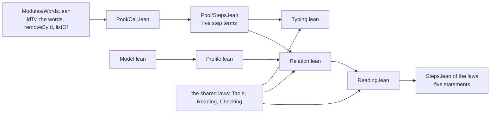

# 2026-10-06 seat POOL receipt: Pool's contract, model, cell and five steps, each step typed and proved to agree with the model

Status: receipt (history, not authority). Brief:
`docs/research/2026-10-05-claude-lead/briefs/seat-pool-brief.md`, with the dispatch message.
Design note: `docs/research/2026-10-06-seat-POOL-design.md`. The coordinator sent six messages
after the brief. Items 2 and 7 name what each one changed.

**The one thing to know before merging:** the engine's fixture holds two programs' bytes as the
wire stands at `8fcab517`. After a merge that changes the wire or a form those programs use,
the first guard of `Test/Program/PoolEngine.lean` fails until `make gen-fixtures` runs.

Eight more facts stand beside it.

- **No planned goal remains.** Every obligation of the brief's table is a theorem. The goal
  gate counts 24 planned goals, as it did before step 6 declared the five.
- **The step statements hold on every model state.** No statement takes the profile as a
  premise. The brief's table asks for the profile's states only. The profile stays the reach
  of the closure and of the enrolment rule.
- **A step term must never stand inside another step term.** Four lease steps in one term
  made one battery run for 16 minutes (item 9, entry 1).
- **`use` cannot take `waitRetry` as it stands.** The wrapper's own mask ends before the
  body's hook is installed. Two red controls on the machine show both ways to fail (item 9,
  entry 2).
- **An item's field `lease` has a meaning only while `borrowed` is true** (item 7, choice 1).
- **The semantics registry names no claim and no default module of Pool.** Item 10 proposes
  each. The semantics report already lists the 18 placed theorems as nodes.
- **The row `fixtures` of `docs/GENERATED.md` does not name Pool's lane.** The producer finds
  the lane by its writer (item 10, row 6).
- **Main was at `8fcab517` when I wrote this.** The branch holds it, so the merge is a
  fast-forward. Main holds step 8's first two commits already. It does not hold `80dbac95`,
  the mask's two red controls, nor this receipt.

The sections below carry the brief's item numbers. Item 1 is the bold line above.

## 2. Base, head and commits

| Item | Value |
| --- | --- |
| Branch | `seat/pool`, in the worktree `/Users/pooks/Dev/lean4-effect4-qtypes` |
| Base | `c957bfab` |
| Main-line heads taken in | `e212766f` by a fast-forward, before step 4; `38837c5f` as the merge `64cad824`; `00b160d2` by a fast-forward, before step 8; `6a0f1918` as the merge `0ce54b8e`; `8fcab517` as the merge `6a7ff960`. No conflict |
| The coordinator's merges of this branch | steps 1 to 3 as `e212766f`; step 4 as `e87777e9`; steps 5 to 7 as `0cd730ca`; step 8's first two commits as `c9428f73` |
| Head | the commit that adds this receipt; its parent is `6a7ff960` |

Nothing is pushed.

| Commit | Step | Content |
| --- | --- | --- |
| `685d60f4` | 1 | the design note |
| `af7f6099` | 2 | `Test/Program/PoolScenarios.lean`: seven cases and three more on the machine, with four red controls |
| `7f76f0b9` | 3 | the packet, `Model.lean`, `Profile.lean` with the closure and five more facts proved, and the contract battery |
| `bd84d0c1` | 4 | `Cell.lean` and `Steps.lean` of the module, `Typing.lean`, the steps battery, and eleven declarations in four shared files; the scenarios now run the library's steps |
| `d16654c1` | 5 | `Test/Program/PoolAgreement.lean`: each step against the model on a finite universe |
| `64cad824` | — | the merge of `38837c5f`: step 4 as merged, and seat MASKPOP's mask discipline |
| `ac686afd` | 6 | `Relation.lean`, the five step goals as planned goals, and the relation battery; one paragraph of the packet corrected |
| `3907e404` | 7 | `Reading.lean`, and the five goals proved in place with each statement unchanged |
| `ec65822b` | 8 | the engine's lane: PP4 and the control of PP5 through the wire, on both carriers |
| `5af5d45d` | 8 | the rows of `docs/ARCHITECTURE.md` and the roles of the role register |
| `80dbac95` | 8 | two red controls of the mask of `use` in the scenarios battery, and their two mentions in the packet |
| `0ce54b8e` | — | the merge of `6a0f1918`: step 8 as merged, and seat CUTS's journal cuts |
| `6a7ff960` | — | the merge of `8fcab517`: seat QINV's run invariant of the Queue's model |

The coordinator's messages, in order:

1. It sends three reuse pointers from Codex's review, and it allocates the places of the
   rules of `eq`.
2. It accepts the design note's choices. It asks for the sentence on `lease` and `borrowed`,
   and for one control of a stale lease. It asks for the limit of `waitRetry` first in item 9.
3. It merges steps 1 to 3. It notes the finding on `List.nodup_range`, and it asks for the
   default concept of each law module.
4. It accepts the edits of the shared files. It corrects one paragraph of the packet: PP3
   reaches the control's state. It asks for two findings in the receipt.
5. It merges step 4, and it names main at `38837c5f`.
6. It merges steps 5 to 7, and it names main at `00b160d2`. It asks that the placement names
   every model state, and that the receipt names the corpus folder of each `dune test`.

**The three pointers hold as compiled.**

- The empty value of an option is `get` of an empty list: the lease's reply uses it
  (`noItem`). An item keeps a flag and a number, and the coordinator accepted that (item 7).
- The atom `eq` compares two stamps. Its three rules stand at the three allocated places.
- The selection is `take` and `drop`, with no fold.

## 3. Changed files, by group

The counts of declarations come from the census of item 5. The counts of guards and pins
come from the script that writes the falsified copies (item 4). The counts of examples and of
a battery's theorems come from `grep`.

| Group | File | What it holds |
| --- | --- | --- |
| The module | `src/Effect4/Modules/Pool/Cell.lean` | new: 10 definitions: three field lists, three types, an item's record, and the initial value at a list of resources with its two passes |
| The module | `src/Effect4/Modules/Pool/Steps.lean` | new: 15 definitions: ten words and passes, and the five step terms |
| The module | `src/Effect4.lean` | two imports and one comment, after `import Effect4.Modules.Semaphore.Steps` |
| The laws | `src/Effect4/Laws/Modules/Pool/Model.lean` | new: 15 definitions, two structures and one inductive type; no theorem |
| The laws | `src/Effect4/Laws/Modules/Pool/Profile.lean` | new: the structure `Profile` with seven conditions, 39 theorems, one `Decidable` instance |
| The laws | `src/Effect4/Laws/Modules/Pool/Typing.lean` | new: the structure `ResourceTy`, four reply types and 59 theorems |
| The laws | `src/Effect4/Laws/Modules/Pool/Relation.lean` | new: 11 definitions, no theorem |
| The laws | `src/Effect4/Laws/Modules/Pool/Reading.lean` | new: 35 theorems |
| The laws | `src/Effect4/Laws/Modules/Pool/Steps.lean` | new: the structure `StepsAgree` and 9 theorems |
| The laws | `src/Effect4/Laws.lean` | six imports, after `import Effect4.Laws.Modules.Semaphore.Steps` |
| The shared files | `src/Effect4/Modules/Words.lean` | three words at the file's end: `single`, `front`, `listOf` |
| The shared files | `src/Effect4/Laws/Program/Typing/TermIntro.lean` | one rule, after `nativeAtomTy_lt`: `nativeAtomTy_eq` |
| The shared files | `src/Effect4/Laws/Modules/Reading.lean` | `reads_eq`, after `reads_lt`; at the file's end `reads_single`, `reads_front`, `depth_under` |
| The shared files | `src/Effect4/Laws/Modules/Checking.lean` | `types_eq`, after `types_lt`; at the file's end `types_front`, `types_listOf` |
| The packet | `Test/contracts/pool.contract.md` | new |
| The batteries | `Test/Program/PoolScenarios.lean` | new: 46 guards, and the text of the engine's fixture |
| The batteries | `Test/Program/PoolContract.lean` | new: 43 guards and 10 pinned outputs |
| The batteries | `Test/Program/PoolSteps.lean` | new: 55 guards, 7 examples, 6 theorems and 14 pinned outputs |
| The batteries | `Test/Program/PoolAgreement.lean` | new: 51 guards |
| The batteries | `Test/Program/PoolRelation.lean` | new: 18 guards, 1 example, 3 theorems and 18 pinned outputs |
| The batteries | `Test/Program/PoolEngine.lean` | new: 12 guards over the committed fixture |
| The batteries | `Test/All.lean` | six imports, after `import Test.Program.SemaphoreEngine` |
| The engine's lane | `ocaml/engine/test/pool/write.lean` | new: the fixture's writer |
| The engine's lane | `ocaml/engine/test/pool/pool.txt` | new, generated by `make gen-fixtures` |
| The engine's lane | `ocaml/engine/test/pool/test_pool.ml`, and `dune` beside it | new: the properties P1 to P4, 19 checks |
| The documents | `docs/ARCHITECTURE.md` | one line of the layer sketch, one sentence in the row of `Words.lean`, and two new rows |
| The documents | `tools/Tools/ArchitectureRoles.lean` | two new roles, and the text of two parents and of `Words.lean` |
| The notes | `docs/research/2026-10-06-seat-POOL-design.md`, and this receipt | new |

The files import in one order. An arrow reads "is imported by".



I edited no file of the Queue's folders and none of Semaphore's. I edited neither
`src/Effect4/Modules/Waiting.lean` nor `src/Effect4/Laws/Modules/Waiting.lean`. I edited none
of the coordinator's files: `docs/core/decisions.md`, `lakefile.toml`, `docs/STATE.md`,
`generated/semantics.md`, `docs/core/semantics.md`, `tools/Tools/SemanticsRegistry.lean` and
`Test/Audit/AxiomGate.lean`. I edited no file under `harness/truth/`.

No source file of the slice holds a `match` on `Eff`, on `ActionTerm`, on `Term` or on
`Val`. The model matches on its own `Op`. One battery holds a hand `match` on `Eff`: `rowTerm`
of `Test/Program/PoolSteps.lean` reads the row of `Ref.modifyWith` under three binders, with
a catch-all. The scenarios battery matches on the build's refusal, on a `RunEvent` with a
catch-all, and on an exit. `make check-cases` refuses none of them.

## 4. Commands, results and evidence

Each Lean, Lake or `make` command ran through
`/Users/pooks/Dev/lean4-effect4/scratch/lean-slot.sh`, named `SLOT` below. Each `make` took
the flags `-o build -o ts/eff/node_modules -o harness/truth/node_modules`, named `FLAGS`. The
scratch folder is
`/private/tmp/claude-501/-Users-pooks-Dev-lean4-effect4/acf2315e-02ac-4acd-9ef9-b0734bd686a7/scratchpad/pool/`,
named `SCRATCH`. It holds each log.

| Command | Result | Evidence |
| --- | --- | --- |
| `SLOT lake build`, on `c957bfab` | `Build completed successfully (990 jobs)` | tested: the baseline |
| `SLOT lake env lean -M6144 -DwarningAsError=true Test/All.lean`, on `c957bfab` | the base's gate lines; Lake had restored `Test.All` with an empty log | tested |
| `SLOT lake env lean SCRATCH/Probe1.lean`, and two more probes | each case's exit and trace, before the battery | tested: part 1's first runs |
| `SLOT lake build`, after each step that changes Lean | seven runs, each `Build completed successfully`; the table below | proved, and tested |
| `SLOT lake build`, on the tree of `5af5d45d` | `Build completed successfully (1006 jobs)`; Lake builds no module again, and it replays each log | proved, and tested |
| `SLOT lake build`, on the tree of `80dbac95` | `Build completed successfully (1006 jobs)`; Lake builds the scenarios battery, the binding battery and `Test.All` again | proved, and tested |
| `SLOT lake build`, on the trees of `0ce54b8e` and of `6a7ff960` | `Build completed successfully`, at 1006 and at 1008 jobs; Lake restores the other seats' modules, and it builds `Test.All` again | proved, and tested |
| `SLOT lake env lean -M6144 -DwarningAsError=true` on six falsified copies | exit 1 each; 46, 53, 69, 51, 36 and 12 errors; the table of the batteries | tested: the red controls |
| `SLOT make FLAGS gen-fixtures`, before `ec65822b` | `PASS generate: requested producers ran in dependency order`; it writes `pool.txt` | tested |
| the same, on each tree from `5af5d45d` to `6a7ff960`, then `git status` | the same line; five lanes' writers run; `git status` lists no fixture, so each one is byte-identical | tested: four fresh runs of the producer |
| `SLOT make FLAGS corpus`, before each `dune test` | the first run: `kept 408 (readable 385) refused 0`, into `.lake/corpus` of my worktree. The three later runs find the corpus up to date. `generated/corpus-index.tsv` unchanged | tested |
| `opam exec --switch=effect4 -- dune build`, in `ocaml/` | exit 0, with no output; it builds `test_pool.exe` | tested |
| `opam exec --switch=effect4 -- dune test --force engine`, in `ocaml/`, on the trees of `ec65822b`, of `80dbac95`, of `0ce54b8e` and of `6a7ff960` | exit 0 each; 1773 `PASS` lines and no `FAIL` line; `test_pool: 19 checks, 0 failures` | tested |
| the corpus folder of each of the four runs | `/Users/pooks/Dev/lean4-effect4-qtypes/.lake/corpus: 408 files, 408 decoded`; `E4_LEAN_CORPUS` was not set | tested |
| the built `test_pool.exe`, under `opam exec`, on four fixtures in `SCRATCH/red8/` | a copy of the committed one: exit 0, 19 `PASS` lines. Three falsified ones: exit 1 each, with 5, 1 and 2 `FAIL` lines | tested: the red controls of the engine's test |
| `SLOT lake env lean` on the binding battery, at the same four fixtures | the copy: exit 0. The three falsified ones: exit 1 each, with 2, 3 and 2 errors | tested: the red controls of the binding |
| `SLOT make FLAGS check-cases`, on the tree of `5af5d45d` | `conform cases: PASS, exit 0; .lake/conform/cases.json`. No refusal line. On each later tree the target has nothing to do: no core source changed after it | tested |
| `SLOT make FLAGS check-docs`, on each tree from `5af5d45d` to `6a7ff960` | `PASS check-docs: every path, link, citation and make target in 76 documents resolves`, each time | tested |
| `python3 scripts/check-language.py --strict` on the design note, the packet and this receipt | `PASS check-language: no finding`, for each | tested |
| `python3 scripts/check-language.py --show docs/ARCHITECTURE.md` | 23 findings before the edit and 23 after it; none at an edited line | tested |
| `SLOT lake build Tools.ArchitectureRoles` | `Build completed successfully (2 jobs)` | tested |
| `SLOT lake env lean SCRATCH/final/Census.lean` | the counts of items 3, 5 and 8 | tested: a census of the environment |
| `SLOT lake env lean SCRATCH/final/AutoCensus.lean` | plain `aesop` closes 25 of 157 theorem constants from their statements | tested: `#auto_census` |
| `SLOT lake env lean SCRATCH/final/Occurrences.lean` | the places of the cell's source in each step, and the size of nested lease steps | tested |
| `SLOT lake env lean SCRATCH/final/MaskProbe.lean` | the first run of the mask's two red controls, before they entered the battery | tested |

The default builds, with the gate lines of `Test/All.lean`:

| Tree | Jobs | API and Laws-only modules | Modules, declarations | Planned goals, declarations on goals |
| --- | --- | --- | --- | --- |
| `c957bfab` | 990 | 173, 302 | 740, 87684 | 24, 11 |
| `af7f6099` | 991 | 173, 302 | 741, 87857 | 24, 11 |
| `7f76f0b9` | 994 | 173, 304 | 744, 88097 | 24, 11 |
| `bd84d0c1` | 998 | 175, 305 | 748, 88440 | 24, 11 |
| `d16654c1` | 999 | 175, 305 | 749, 88599 | 24, 11 |
| `ac686afd` | 1004 | 175, 308 | 754, 88750 | 29, 15 |
| `3907e404` | 1005 | 175, 309 | 755, 88789 | 24, 11 |
| `5af5d45d` | 1006 | 175, 309 | 756, 88803 | 24, 11 |
| `80dbac95` | 1006 | 175, 309 | 756, 88810 | 24, 11 |
| `0ce54b8e` | 1006 | 175, 309 | 756, 88833 | 24, 11 |
| `6a7ff960` | 1008 | 175, 310 | 758, 88983 | 24, 11 |

On each run the library-root gate reports that every library source is reachable, and that
`Effect4` never reaches Laws. The axiom gate reports the semantic and test axioms at
`[propext, Quot.sound]`. The goal gate reports that no other declaration reaches `sorryAx`.
The proof-style gate reports 1914 recorded uses and 52 recorded unread commands in 1163
entries. It reports the same counts on each run from step 3 on, and it refuses nothing. The
run of `ac686afd` covers the merge `64cad824`. The working tree of step 8's lane gave the
lines of `5af5d45d` before its commit, and that run built `Test.Program.PoolEngine` and
`Test.All`. The last two rows are the merged trees: they hold seat CUTS's declarations, and
then seat QINV's. The head commit adds this receipt only, and no build ran after it.

**One build was stopped by hand.** The first default build of step 4 ran for 16 minutes and
27 seconds in `Test/Program/PoolSteps.lean`. I ended that one Lean process by its number, and
Lake reported the exit 143. The cause and the repair are item 9's first entry.

### Part 1, case by case

Each run is one schedule on Lean's machine. The profile's answers are the card's section 9
(`docs/research/2026-10-05-claude-lead/module-cards/pool.md`). The pin's side of them is the
card's reading of its host probes (assumed: I ran no host probe).

| Case | The machine's answer | The profile's |
| --- | --- | --- |
| PP1 | B's commit names the same resource. The finalizer's one row is the last, at the scope's close | the same |
| PP2 | After the two returns the idle stamps are `[1, 0]`. C gets the resource 2, then D gets the resource 1 | the same: the order of 4.0.1 (row 269) |
| PP3 | After H's return the item is idle beside two waiters. The helper notifies A alone, and A's own step takes the item. After A's return the next helper notifies B | the same |
| PP4 | A's interruption leaves one waiter. The helper then selects B, the first waiter of the state that it finds | the same |
| PP8 | The interrupted waiter's entry leaves. H's return then owes no wake, and B leases at once | the same |
| PP5, the public retry case | The selection at the count 1 takes A. After it the item is idle and no lease is outstanding. A's own step then takes the item | the same |
| PP5, the low-level control | One selection at the count 2 takes A and then B. A leases and returns, and then B leases | the same; the state and the count are premises |
| The control where A holds | B is notified and finds no idle item, and B's own step enrols B again | the profile's rule: a wake reserves nothing |
| C1, the close's first step | The step answers `[true, 1]`. W is notified and refused, and so is a new borrower. A second close answers `[false, 0]` | the model's `close`; the wait is the close's slice |
| S1, a stale lease | The second return of the lease 0 answers `[false, false]`, and the lease 1 still holds the item | the model's `giveBack` |

- **The settings.** The tape is `[evaluate root, flush]`. The fuel and the compile fuel are
  20000. Each fiber's budget of operations before a yield is the default, 2048. No run holds
  an injected yield.
- **The trace.** On PP5's control the fibers exit in the order A, the helper, B, the root. So
  a resumed borrower runs inside the helper's task. On PP4 the interrupted A exits before the
  helper runs.
- **The four red controls.** The return that puts its item at the end fails PP2
  (`backOrder`). The selection that is made when the wake is posted fails PP4 (`early`). The
  wake that hands an item fails both forms of PP5 (`handing`). The return that runs the
  finalizer fails PP1 (`finalizing`). Each changed policy builds, so typing does not catch it.
- **PP7 and PP6.** PP7 is a trace of the model in the contract battery, with the lease that
  the close waits for. PP6 is outside the model: a failed acquisition fails `make`.
- **The mask's two red controls.** In `interruptedHolder` A leases and yields inside its mask,
  and A is interrupted. With one region the lease returns. With the lease in its own mask the
  item stays borrowed by a fiber that has exited. In `interruptedWaiter` A waits and is
  interrupted. With the profile's `use` A's entry leaves. With the lease's mask inside the
  caller's mask the entry stays, and A commits a lease after its own interruption.

### The batteries

The script `SCRATCH/red9/mutate.py` writes each falsified copy, and it reads each run. It
changes every guard and every pin of a battery. It changes a guard's last literal: a number
gains one, and a truth value becomes the other. Where that change leaves the guard true, or
the guard holds no literal, it negates the guard. It adds one word to a pin's expected text.

| Battery | What it checks | Falsified copy | Evidence |
| --- | --- | --- | --- |
| `PoolScenarios.lean` | ten cases on the library's steps; the trace; the settings; four red policies; two red controls of the mask; the text of the engine's fixture | 46 of 46 guards fail: 32 by a changed literal, 14 negated | tested |
| `PoolContract.lean` | eight traces of the model; one red state for each condition of the profile; the enrolment rule; a stale lease; four faults; pins | 53 of 53: 25 by a literal, 18 negated, 10 pins | tested |
| `PoolSteps.lean` | the cell at 12 resource types; each step's type by the checker; sizes; a caller's variable under each fold; each typing theorem at a minted name; three joins by `step_keeps_cell`; pins | 69 of 69: 22 by a literal, 33 negated, 14 pins | proved instances, and tested |
| `PoolAgreement.lean` | 130 states of the profile with 17 moves each, 2210 comparisons; five states outside the profile; four changed results; four faults as changed steps | 51 of 51: 20 by a literal, 31 negated | tested |
| `PoolRelation.lean` | each statement's conclusion on the same universe; a table that is not injective; three joins by `step_updates`; one statement at minted names; pins | 36 of 36: 5 by a literal, 13 negated, 18 pins | proved instances, and tested |
| `PoolEngine.lean` | the committed fixture is the text that Lean computes; its shape; the round trip of the wire on both programs | 12 of 12: 5 by a literal, 7 negated | tested |

In each falsified copy every changed check fails, as a false guard or as a mismatched pin. No
other command of a copy fails: the examples and the theorems stay as they are.

- **The engine's test** fails its property P2 on both carriers where the fixture holds
  another exit. It fails its first check where the fixture holds the two runs in the other
  order.
- **The binding battery** fails its first guard at each falsified fixture, and its guard of
  the exit lines too.

### The acceptance, item by item

| Item of the brief | Result |
| --- | --- |
| 1. Part 1 gives the profile's answers on PP1 to PP4 and PP8, and on both forms of PP5, with each red control red | yes (tested, one schedule each). C1 and S1 run too |
| 2. The batteries of part 7 pass, with each fault red at its own property | yes (tested). The checker types each faulty step as it types the library's |
| 3. The engine replays two cases on both carriers | yes: PP4 and the control of PP5, 19 checks (tested) |
| 4. The default build, the generator, the corpus and dune, `check-cases`, `check-docs` | the table of commands above. `check-cases` gives no refusal |
| 5. The commands that the coordinator runs | not run: the list below |

### Not run

- `make check-gen`, `make check-slow`, `make check-corpus`, `make check-target`,
  `make check-truth` and the conservativity script.
- `make gen-semantics` and `make check-semantics`: the report is the coordinator's.
- `make gen-architecture`: it needs `make gen-semantics`, and its map is a report.
- `make check`, `make check-full`, `make check-ocaml` and `make status`, as targets.
- Every TypeScript lane and every host run. No tsgo run and no bun run is in this slice.

### Red or stale for a reason outside the slice

- The engine's cross face reports `agree=9 differ=2`, for `pAcquire` and `pProvide`. The test
  reports it and does not gate on it. Seat SEM's receipt names it already.
- The engine's tests write one `OWED` line, `FB1` of lane X. It names an engine that does not
  exist yet.
- The row `fixtures` of `docs/GENERATED.md` names four lanes, and not Pool's (item 10, row 6).

### What is proved, and what is only tested

| Claim | Evidence |
| --- | --- |
| Each transition of the model keeps the profile, with no premise on its request | proved: `profile_closed` |
| A lease enrols its request exactly when the pool is open and a lease holds every item | proved, on the profile's states: `lease_enrols_iff` |
| A selection takes the first waiters, at most its count, and it changes the waiters alone | proved: `select_takes_first` |
| A return puts its item at the front and keeps every item; a second return of the lease changes nothing | proved: `giveBack_front`, `giveBack_once` |
| After the close's first step every lease is refused, and no transition opens the pool | proved: `close_refuses`, `step_closing` |
| The initial value and each of the five step terms have their stated types at every scope of names | proved: six theorems of `Typing.lean` |
| Each step term reads the model's reply and the model's next state through the table, on every model state | proved: five theorems of `Steps.lean`, and `pool_steps_agree` |
| One `Ref.modify` of the selection, of the return or of the lease is the model's transition at the store | proved: three instances in `PoolRelation.lean`, at the step's own names |
| A lease, a selection and a return keep the cell a member of its type, from the cell's membership before the step | proved: three theorems of `PoolSteps.lean`, at every scope; the membership before the step is a premise |
| A borrower runs inside the task that resolves its hint | tested: the exits' order on PP3, PP4, PP5's control and C1, one schedule each, on Lean's machine |
| The ten cases give the profile's answers | tested on Lean's machine; the pin's side is the card's reading of its probes (assumed) |
| One masked region returns an interrupted borrower's lease. A lease in its own mask loses the lease, or its wait cannot be interrupted | tested: two schedules on Lean's machine, with one yield written out inside the mask |
| The generated engine gives Lean's exit on PP4 and on PP5's control, on both carriers, and the two carriers give one report | tested: two programs, the engine's own drive loop |
| Each step agrees with the model outside the profile too | tested on five states; proved by the five theorems, which take no profile |

No evidence of the slice is host-only, and no host ran. Every guard is bounded: one input, one
schedule or one finite universe. The theorems are not bounded in the state, the table, the
resource type or the scope of names.

## 5. Axiom output and plan status

The axiom gate holds every declaration at `[propext, Quot.sound]`. The census
`SCRATCH/final/Census.lean` reads the axioms of each written theorem of the four theorem
files. It sets the 15 fields of the three structures of propositions apart.

| File | Theorems | `[propext, Quot.sound]` | `[propext]` | none |
| --- | --- | --- | --- | --- |
| `Profile.lean` | 39 | 18 | 11 | 10 |
| `Typing.lean` | 59 | 57 | 0 | 2 |
| `Reading.lean` | 35 | 10 | 22 | 3 |
| `Steps.lean` | 9 | 4 | 4 | 1 |
| all four | 142 | 89 | 37 | 16 |

No theorem reaches `Classical.choice`. The batteries pin these lines by `#guard_msgs`.

```text
'Effect4.Pool.Model.profile_closed' depends on axioms: [propext, Quot.sound]
'Effect4.Pool.Model.lease_enrols_iff' depends on axioms: [propext, Quot.sound]
'Effect4.Pool.Model.select_takes_first' depends on axioms: [propext]
'Effect4.Pool.Model.giveBack_front' depends on axioms: [propext, Quot.sound]
'Effect4.Pool.Model.giveBack_once' depends on axioms: [propext, Quot.sound]
'Effect4.Pool.Model.close_refuses' depends on axioms: [propext]
'Effect4.Pool.Model.step_closing' depends on axioms: [propext]
'Effect4.Pool.Model.step_items' depends on axioms: [propext, Quot.sound]
'Effect4.Pool.Model.initial_profile' depends on axioms: [propext, Quot.sound]
'Effect4.Pool.Model.initial_types' depends on axioms: [propext, Quot.sound]
'Effect4.Pool.Model.leaseStep_types' depends on axioms: [propext, Quot.sound]
'Effect4.Pool.Model.returnStep_types' depends on axioms: [propext, Quot.sound]
'Effect4.Pool.Model.selectStep_types' depends on axioms: [propext, Quot.sound]
'Effect4.Pool.Model.withdrawStep_types' depends on axioms: [propext, Quot.sound]
'Effect4.Pool.Model.closeStep_types' depends on axioms: [propext, Quot.sound]
'Effect4.Pool.Model.leaseStep_agrees' depends on axioms: [propext, Quot.sound]
'Effect4.Pool.Model.returnStep_agrees' depends on axioms: [propext, Quot.sound]
'Effect4.Pool.Model.selectStep_agrees' depends on axioms: [propext]
'Effect4.Pool.Model.withdrawStep_agrees' depends on axioms: [propext, Quot.sound]
'Effect4.Pool.Model.closeStep_agrees' depends on axioms: [propext]
'Effect4.Pool.Model.pool_steps_agree' depends on axioms: [propext, Quot.sound]
'Effect4.Pool.Model.reads_marked' depends on axioms: [propext, Quot.sound]
'Effect4.Pool.Model.reads_leasedOf' depends on axioms: [propext, Quot.sound]
'Effect4.Pool.Model.reads_heldBy' depends on axioms: [propext, Quot.sound]
'Effect4.Pool.Model.reads_freed' depends on axioms: [propext, Quot.sound]
'Effect4.Program.nativeAtomTy_eq' depends on axioms: [propext, Quot.sound]
'Effect4.Modules.types_eq' depends on axioms: [propext, Quot.sound]
'Effect4.Modules.types_listOf' depends on axioms: [propext, Quot.sound]
'Effect4.Modules.reads_eq' depends on axioms: [propext]
'Effect4.Modules.depth_under' depends on axioms: [propext]
'Test.Program.PoolSteps.leaseStep_keeps_cell' depends on axioms: [propext, Quot.sound]
'Test.Program.PoolSteps.selectStep_keeps_cell' depends on axioms: [propext, Quot.sound]
'Test.Program.PoolSteps.returnStep_keeps_cell' depends on axioms: [propext, Quot.sound]
'Test.Program.PoolRelation.select_updates' depends on axioms: [propext, Quot.sound]
'Test.Program.PoolRelation.return_updates' depends on axioms: [propext, Quot.sound]
'Test.Program.PoolRelation.lease_updates' depends on axioms: [propext, Quot.sound]
```

The plan status of each placed theorem, as pinned:

```text
Effect4.Pool.Model.profile_closed: proved; nearest []; 0 lemmas, 0 definitions
Effect4.Pool.Model.lease_enrols_iff: proved; nearest []; 0 lemmas, 0 definitions
Effect4.Pool.Model.select_takes_first: proved; nearest []; 0 lemmas, 0 definitions
Effect4.Pool.Model.giveBack_front: proved; nearest []; 0 lemmas, 0 definitions
Effect4.Pool.Model.giveBack_once: proved; nearest [Effect4.Pool.Model.giveBack_front]; 0 lemmas, 0 definitions
Effect4.Pool.Model.close_refuses: proved; nearest []; 0 lemmas, 0 definitions
Effect4.Pool.Model.initial_types: proved; nearest []; 0 lemmas, 0 definitions
Effect4.Pool.Model.leaseStep_types: proved; nearest []; 0 lemmas, 0 definitions
Effect4.Pool.Model.returnStep_types: proved; nearest []; 0 lemmas, 0 definitions
Effect4.Pool.Model.selectStep_types: proved; nearest []; 0 lemmas, 0 definitions
Effect4.Pool.Model.withdrawStep_types: proved; nearest []; 0 lemmas, 0 definitions
Effect4.Pool.Model.closeStep_types: proved; nearest []; 0 lemmas, 0 definitions
Effect4.Pool.Model.leaseStep_agrees: proved; nearest []; 0 lemmas, 0 definitions
Effect4.Pool.Model.returnStep_agrees: proved; nearest []; 0 lemmas, 0 definitions
Effect4.Pool.Model.selectStep_agrees: proved; nearest []; 0 lemmas, 0 definitions
Effect4.Pool.Model.withdrawStep_agrees: proved; nearest []; 0 lemmas, 0 definitions
Effect4.Pool.Model.closeStep_agrees: proved; nearest []; 0 lemmas, 0 definitions
Effect4.Pool.Model.pool_steps_agree: proved; nearest []; 0 lemmas, 0 definitions
next goals: 0
```

The counts are of each battery's tree, which holds no step of a proof.
`generated/semantics.md` at `8fcab517` gives each node's counts in the whole tree. The line
of `pool_steps_agree` is pinned alone: its list of nearest nodes depends on the names that
one command asks for.

**When `pool_steps_agree` stops being modulo.** On `ac686afd` it is modulo: it rests on the
five goals. `SCRATCH/plan-step6.out` holds that output, with each of the five as `goal`. The
goal gate counts 29 planned goals there, and 15 declarations on goals. The four more are this
theorem and the battery's three joins. In `3907e404` the five goals are theorems, and the
gate counts 24 and 11 again. A script compared the five statements of the two commits: each
is unchanged.

## 6. Placements

No planned goal is in the tree for this slice. Step 6 declared five, and step 7 proved each in
place. So the list of planned goals is empty.

### The profile's closure

`profile_closed` (`src/Effect4/Laws/Modules/Pool/Profile.lean`).

- Concept: `store-typing`; property: each transition of the model keeps the first profile's
  states.
- Question: the model's half of the proposed claim `pool-profile-preserved`. The proposed
  registry claim is `pool-profile-closed` (item 10, row 2). Consumer: the public law, along a
  run.
- Reach: the five transitions of `Effect4.Pool.Model`, from a state of `Profile`. No premise
  names a request. Decisions rows 267 to 269.
- Does not establish: anything about a program. It is an invariant, and it gives no progress
  of a waiter.
- Unlocks: R4, as a node.

### The enrolment rule

`lease_enrols_iff`, in the same file.

- Concept: `store-typing`, beside the closure; property: lease or enrol adds a waiter only
  when the pool is open and no item is idle.
- Question: no claim yet (item 10, row 2). Consumer: the public waiting wrapper. An enrolled
  request found an open pool with no idle item, in the same step.
- Reach: one lease of the model, from a state of `Profile`. The request is in the waiters
  after the step exactly when the pool is open and a lease holds every item.
- Does not establish: fairness or liveness. It states nothing of a later selection.
- Unlocks: R4, as a node.

**The lease step's proof does not use it.** The brief's table names that proof as the first
consumer. The step agrees on every state, so its proof reads the model's three branches in
closed form (`lease_closed`, `lease_enrols`, `lease_takes`). The contract battery checks the
rule at four states (`mayEnrol`).

### The fact of a selection

`select_takes_first`, in the same file.

- Concept: `reactive-scheduling`; property: a selection takes the first waiters of the state
  that it finds, at most its count, and exactly those.
- Question: no claim yet (item 10, row 2). Consumer: the proposed claim `pool-wake-selection`.
- Reach: one selection of the model, on every state and at every count. The selected
  identities are a prefix of the waiters. Nothing but the waiters changes.
- Does not establish: anything about a run or about delivery. It is the safety of one
  selection, and it gives no liveness.
- Unlocks: R12, as a node.

### The facts of a return and of the close's first step

`giveBack_front`, `giveBack_once` and `close_refuses`, in the same file.

- Concept: `scope-lifetime-finalization`. Property: a return puts its item at the front and
  keeps every item. A lease returns at most once. After the close's first step no lease
  begins.
- Question: no claim yet (item 10, row 2). Consumers: the proposed claims `pool-lease-return`
  and `pool-close-waits`.
- Reach: one transition of the model, on every state. `giveBack_front` takes the premise that
  the lease holds the item. `close_refuses` states every later lease at the closing pool.
- Does not establish: anything about a finalizer's run. It states no wait for a lease, and no
  close that has ended.
- Unlocks: R11, as nodes.

### The six typing statements

`initial_types`, `leaseStep_types`, `returnStep_types`, `selectStep_types`,
`withdrawStep_types` and `closeStep_types` (`src/Effect4/Laws/Modules/Pool/Typing.lean`).

- Concept: `store-typing`; property: a step term of a `Ref.modify` is typed at the pair of its
  reply's type and the cell's type.
- Question: the cell's half of the proposed claim `pool-profile-preserved`. Consumer: the
  public law, through `step_keeps_cell` (`src/Effect4/Laws/Modules/Store.lean`).
- Reach: the checker's `argTy`, through `TypesEach`, at every scope of names. The alphabet of
  operations is a parameter, with the premise `sig.atomOf = nativeAtomTy`. The resource's type
  is its own normal form. A term under a fold comes with `CapturedTy`. Decisions rows 255, 257
  and 267 to 269.
- Does not establish: agreement with the model, a wrapper's typing, a target's typing, program
  admission or progress.
- Unlocks: R4, as nodes.

### The five step statements, and the five as one

`leaseStep_agrees`, `returnStep_agrees`, `selectStep_agrees`, `withdrawStep_agrees`,
`closeStep_agrees` and `pool_steps_agree` (`src/Effect4/Laws/Modules/Pool/Steps.lean`).

- Concept: `translation-simulation`; property: a step term reads the tuple of the model's
  reply and the model's next state through the encoding table.
- Question: parts of the proposed claim `pool-expansion-agrees`. The proposed registry claim
  is `pool-steps-agree` (item 10, row 1). Consumer: the public law, in the slice of the public
  operations.
- Reach: every model state, which is more than the brief's table asks. The table is injective
  where a step tests an identity: the lease and the withdrawal. The observation is the reply
  and the stored value. A selection's reply is the selected waiters' records. The statement
  holds at every scope, with `Captured` for a term under a fold. Decisions rows 255 and 267 to
  269.
- Does not establish: an order of the wake across helpers, a cancellation law, a close that
  waits, fairness, liveness or a wrapper. An equal value in the model says nothing of a host.
- Unlocks: R10, as nodes. They close no part of R10.

**The profile is still the reach of two things.** The closure and the enrolment rule hold on
the profile's states. The proposed claim `pool-profile-preserved` has the profile as its
reach, with the closure and the typing as its two halves. The step statements need neither.

### The helpers

| Theorems | File | Concept | Reach | Consumer |
| --- | --- | --- | --- | --- |
| `mem_without`, `without_sublist`, `enrol_nodup`, `eq_of_stamp`, `map_keeps`, `map_stamps`, `leasedAs_stamp`, `heldBy_iff`, `freed_stamp`, `freed_borrowed`, `Profile.waiters`, `Profile.leaseFront`, `Profile.returnFront`, the five `…_profile` | `Profile.lean` | `store-typing`, helpers | one transition of the model | `profile_closed` |
| `itemsFrom_stamps`, `itemsFrom_idle`, `itemsFrom_from`, `itemsFrom_nodup`, `apart_of_idle`, `initial_available`, `initial_profile` | `Profile.lean` | `store-typing` | the state as it is made, at every list of resources | the public law's `make`, along a run |
| `step_items` | `Profile.lean` | `store-typing` | every transition keeps the items' stamps and resources (row 267) | the public law; the fault `giveBackFinalizing` of the contract battery |
| `Profile.none_idle_iff`, `lease_waiters`, `lease_enrolled` | `Profile.lean` | `store-typing`, helpers | one lease of the model | `lease_enrols_iff`; the public waiting wrapper |
| `freed_not_held`, `giveBack_stale` | `Profile.lean` | `scope-lifetime-finalization`, helpers | one return of the model | `giveBack_front`, `giveBack_once`, `returnStep_agrees` |
| `lease_closed`, `step_closing` | `Profile.lean` | `scope-lifetime-finalization`, helpers | a closing pool refuses a lease, and no transition opens it | `close_refuses`, `leaseStep_agrees` |
| the 25 facts of the records' types, the five `types_cell…`, the five `types_set…`, the 16 passes from `types_leasedAs` to `types_stampsFrom`, `itemsFrom_ne_nil`, `stampsFrom_ne_nil` | `Typing.lean` | `store-typing`, helpers | the cell's, an item's and a waiter's type; every scope | the six typing statements |
| the 17 facts of the records' reads, the four `…_renew…` lemmas, `front_headD`, `leased_flatMap`, and the 12 passes from `reads_withdrawn` to `reads_mkWaiter` | `Reading.lean` | `translation-simulation`, helpers | the cell's value of a model state; every scope | the five step statements |
| `lease_enrols`, `lease_takes`, `giveBack_returns` | `Steps.lean` | `translation-simulation`, helpers | the model's transition in closed form | `leaseStep_agrees`, `returnStep_agrees` |

No helper states a run, delivery, cancellation or a host.

## 7. Choices, and each step's size

1. **An item keeps the flag `borrowed`, and it gains the number `lease`.** The field `lease`
   has a meaning only while `borrowed` is true. An idle item keeps the stamp of its last lease
   there, and no step reads it. The alternative is one optional stamp. The coordinator
   accepted the flag and the number.
2. **A stale lease's return is refused, in three controls.** The scenario S1 runs it on the
   machine. The contract battery runs it on the model. The fault F4 of the agreement battery
   is a return that does not name its lease.
3. **A lease removes its own request's entry first.** So no step has a premise on its
   request. The control `leaseKeeping` holds the entry present.
4. **A return answers whether the lease returned, and whether a wake is owed.** A wake is
   owed exactly when the lease returned and a waiter is enrolled.
5. **A selection removes what it selects.** It is `take` and `drop` of the waiters, and it
   compares no record and no handle. Its reply holds the selected waiters' records.
6. **The close's first step answers whether it began the close, and the count of the
   waiters.** A second close begins nothing.
7. **A refused lease answers `closed`, and its own entry leaves.** What `use` does with the
   refusal belongs to the public slice.
8. **One fold reads the front idle stamp** (`headStamp`). It folds over the first entry of
   `available`, and it answers zero at an empty list. So each arm of the lease has a value,
   and the lease uses the stamp only in the arm where an item is idle. No step uses
   `getOrElse`.
9. **A second fold over the items reads the leased item's record** (`leasedOf`). The reply
   takes its first entry by `get`. The empty item of a reply is `get` of an empty list
   (`noItem`).
10. **The model's resource is a number that names its value.** The relation maps it by a
    function, as the Queue's relation maps a message.
11. **The model's first idle stamps are the items' stamps, in order.** They are not
    `List.range`: `List.nodup_range'` and `List.nodup_range` of core reach `Classical.choice`.
    `List.pairwise_lt_range'` does too. `initial_available` states the same list.
12. **The profile has seven conditions** for the design note's four parts: `stamps`, `idle`,
    `unheld`, `once`, `apart`, `below` and `distinct`.
13. **No step statement takes the profile.** The term and the model compute the same removal
    by identity, the same front stamp and the same two passes over the items. So the closure
    and the agreement are two statements, and the public law uses both.
14. **The lease's conclusion names `tb.renew id hint` in each of its three branches.** Where
    the request does not enrol, no entry of its identity stays. So the renewed table gives the
    same cell (`cellVal_renew`).
15. **The typing statements take the alphabet of operations as a parameter.** They take the
    resource's type in normal form. `initial_types` takes `ResourceTy` and a list that is not
    empty.
16. **The initial value takes its resources as a list of terms.** The shared `listOf` writes
    each list out, with no fold.
17. **PP5 stands in two labelled forms.** The low-level control is no public schedule: its
    state and its count are premises. PP3 reaches that state, and no public operation posts
    the count 2 at an open pool.
18. **The engine's two cases are PP4 and PP5's control.** The card's reading of the wake
    rests on them. The fixture's speller is an algebra of the value fold, and it refuses a
    value with no spelling.
19. **The scenarios' `use` is a test form with one mask.** It does not use `waitRetry` (item
    9, entry 2).
20. **No proof calls `aesop`, and no bank is landed.** Each derivation applies one named rule
    for each node of a step's term, as the Queue's and Semaphore's do. Plain `aesop` closes 25
    of the 157 theorem constants from their statements. The 25 take 76 source lines as they
    stand, with their statements and docstrings. One is a placed theorem, `close_refuses`,
    whose proof is one line.
21. **Step 8 has three commits**, and the receipt's. The third adds the mask's two red
    controls: I wrote them while I wrote item 9.

### Each step's size

`Test/Program/PoolSteps.lean` measures each size by the Queue battery's two algebras of the
generated term fold. `SCRATCH/final/Occurrences.lean` counts the places of the cell's source.

| Term | Nodes | Folds | Places of the cell's source |
| --- | --- | --- | --- |
| `leaseStep` | 166 | 7 | 23 |
| `returnStep` | 69 | 2 | 7 |
| `selectStep` | 11 | 0 | 3 |
| `withdrawStep` | 22 | 1 | 3 |
| `closeStep` | 11 | 0 | 3 |
| `headStamp`, the front idle stamp | 7 | 1 | not counted |
| `marked`, the items with the front one leased | 29 | 2 | not counted |
| `leasedOf`, the leased item's record | 29 | 2 | not counted |
| `heldBy`, whether a lease holds an item | 18 | 1 | not counted |
| `freed`, the items with the held one idle | 28 | 1 | not counted |
| `withdrawn`, the cell without a request | 20 | 1 | not counted |

A term has no binder for a shared part. So the lease holds the removal's fold in each of its
three arms. Each of its two passes over the items holds the fold of the front stamp. The
initial value has 14 nodes at one resource, and 12 more for each further resource.

## 8. The shared pieces that the slice uses, and the rules that it adds

The census counts each declaration of a shared file that a declaration of Pool's eight source
files reads. It finds 96. It finds none of the Queue's folders and none of Semaphore's.

| Home | Count | Declarations |
| --- | --- | --- |
| `src/Effect4/Modules/Words.lean` | 14 | `idTy`, `andT`, `ifT`, `isEmpty`, `len`, `nilT`, `noneOf`, `notT`, `orT`, `same`, `snoc`, `removeById`, `front`, `listOf` |
| `src/Effect4/Laws/Modules/Table.lean` | 5 | `Table` with `handle`, `hint`, `Injective` and `renew` |
| `src/Effect4/Laws/Modules/Reading.lean` | 34 | `Reads` and `Reads.to`; `Captured` with `atScope` and `underFold`; `Pointwise.nil`, `Pointwise.cons`; `reads_foldWith_model`, `reads_minted_acc`, `reads_minted_item`; `depth_under`; and 23 builders and words: `reads_add`, `reads_andT`, `reads_bool`, `reads_drop`, `reads_eq`, `reads_field`, `reads_front`, `reads_head`, `reads_ifT`, `reads_isEmpty`, `reads_len`, `reads_nat`, `reads_noneOf`, `reads_notT`, `reads_orT`, `reads_pair`, `reads_record`, `reads_recordSet`, `reads_removeById`, `reads_snoc`, `reads_take`, `reads_tuple2`, `reads_unit` |
| `src/Effect4/Laws/Modules/Checking.lean` | 34 | `Types`, `TypesEach`; `CapturedTy` with `atScope` and `underFold`; `sub_nil_list`; `types_foldWith_same`, `types_minted_acc`, `types_minted_item`; and 25 builders and words: `types_add`, `types_andT`, `types_bool`, `types_drop`, `types_eq`, `types_field`, `types_front`, `types_head`, `types_ifT`, `types_isEmpty`, `types_len`, `types_listOf`, `types_nat`, `types_nilT`, `types_noneOf`, `types_notT`, `types_orT`, `types_pair`, `types_record`, `types_recordSet`, `types_removeById`, `types_snoc`, `types_take`, `types_tuple2`, `types_unit` |
| `src/Effect4/Laws/Program/Typing/TermIntro.lean` | 5 | `Record.fieldType_normal`, `Record.setType_same`, `Record.check_declared`, `Ty.normalize_list_canonical`, `Ty.normalize_option_canonical` |
| `src/Effect4/Data/Constructive.lean` | 4 | `List.decide_length_zero`, `List.foldl_append_flatMap`, `List.foldl_or_any`, `List.foldl_snoc_map` |

The batteries use more, by name. An `example` leaves no declaration, so the census does not
see what it reads. I took those names by `grep`.

- `step_updates`, in three joins, and `step_keeps_cell`, in three.
- `captured_var`, `captured_answer`, `captured_minted`, `capturedTy_var`, `capturedTy_answer`
  and `capturedTy_minted`, for the capture premises.
- `typeAt`, `typeAt_of_types`, `types_var` and `Types.tree`, for a step's type at a scope.
- `resolve_last`, `resolve_unshadowed`, `mint_ne_of_head`, `later_mint_ne_answer` and
  `mint_current_ne_answer`, at the names that `bindWith` mints.
- `posted` and `waitAt` of `src/Effect4/Modules/Waiting.lean`, in the scenarios.
- The words `single` and `noneT`, in the scenarios and in the comparison.

The steps battery also uses `termAt` and `measure` of `Test/Program/QueueSteps.lean`.

Three facts stand beside the list.

- **`cell_read` has no consumer here.** It is the read law of a `Ref.get`, and each of the
  five steps is a `Ref.modify`.
- **I changed no shared declaration, and I copied none.** Each edit of a shared file adds a
  declaration.
- **One statement of Pool's folder names no declaration of Pool**: `front_headD` of
  `Reading.lean`. It is a fact of a list's first entry (item 10, row 7).

### The rules that the slice adds to shared files

The coordinator allocated the three places of `eq`, and it accepted the rest in its fourth
message. Each declaration names no module.

| Declaration | Shared file | It states | First consumer |
| --- | --- | --- | --- |
| `single`, `front`, `listOf` | `src/Effect4/Modules/Words.lean` | a list that a term writes out: one element, an element in front, and the given terms in order | `Pool.initial`; `returnStep` |
| `nativeAtomTy_eq` | `src/Effect4/Laws/Program/Typing/TermIntro.lean` | `eq` at two numbers answers a Boolean | `types_eq` |
| `reads_eq` | `src/Effect4/Laws/Modules/Reading.lean` | `eq` reads whether two numbers are one number | `reads_holdsT`, `reads_atFront` |
| `reads_single`, `reads_front` | the same file | what the two words read | `returnStep_agrees` |
| `depth_under` | the same file | under two more binders a scope's values are as many as its names | `reads_atFront` and `types_atFront`: the fold of the front stamp, in the body of a fold over the items |
| `types_eq` | `src/Effect4/Laws/Modules/Checking.lean` | `eq` types at a Boolean | `types_holdsT`, `types_atFront` |
| `types_front`, `types_listOf` | the same file | the two words at a type in normal form; `listOf` at a list that is not empty | `returnStep_types`, `initial_types` |

## 9. Open obligations, and what the public slice needs

The first two entries are the two limits that the coordinator asked for first.

1. **Never put a step term inside a step term.** A term has no binder, so a step holds its
   cell's source at many places: the lease step at 23. One lease step has 166 nodes. Two in
   one term have 3984, and three have 91798. By the same rule four have 2111520: I did not
   measure that one. Four made `Test/Program/PoolSteps.lean` run for 16 minutes. The public
   slice joins steps through the store alone: one `Ref.modify` for each step. A battery
   evaluates one step, and it feeds the value to the next (`afterStep` of
   `Test/Program/PoolSteps.lean`).
2. **`waitRetry` cannot serve `use` as it stands.** The place is `waitRetry` of
   `src/Effect4/Modules/Waiting.lean`: it opens `uninterruptibleMaskWith` at its head, and
   that mask ends when the loop answers. `use` needs one mask over the lease and over the
   hook's installation, as the pin's `use` has (`vendor/effect-4.0.1/src/Pool.ts`). The two
   ways to join the present wrapper both fail on the machine (tested, one schedule each). The
   form that serves follows this list.
3. **The membership premise of `step_keeps_cell`.** No statement says that
   `cellVal tb res s` is a member of `Pool.cellTy A`. The handles that the table names must be
   declared, and each resource's value must be a member of `A`.
4. **The capture premises.** The lease's identity and the cell's source stand under folds.
   So do the return's two stamps and the withdrawal's identity. The public slice owes
   `Captured` and `CapturedTy` for each. For a name that an author wrote, the lemmas are
   `captured_var` and `capturedTy_var`. For a minted name they are `captured_minted` and
   `capturedTy_minted`, and `captured_answer` and `capturedTy_answer` for the name that
   `bindWith` mints. The batteries show both routes.
5. **A fresh identity is no handle inside the cell**, and the table stays injective. The
   wrapper owes both from `Deferred.make`.
6. **The waiting wrapper** over the actual program: the enrolment, the wait, the retry and
   the withdrawal on interruption. The scenarios hold a test form of it (`leaseLoop`).
7. **The wake's helper as a library program**, and its law across helpers. The scenarios hold
   a test form: one selection at the count, and then each selected hint in order
   (`wakeWith`, `resolveAll`).
8. **The close that waits** (row 268), and the finalizers' runs. What it needs from the cell
   follows this list.
9. **The public `make` and `use`**, with the acquisition inside the pool's scope. PP6 belongs
   there: a failed acquisition fails `make`.
10. **The embedded budget** for the work that a helper reaches, or a restriction of the
    callers (row 226). The scenarios do not reach the budget of 2048 operations.
11. **The printed module** on the target, and a host run of it.
12. **The six joins to the store are theorems of two batteries.** The public slice moves them
    into the law graph when its law reads them.
13. **A resource that is a string literal is outside `initial_types`.** A literal has its
    literal type inside a record, so it is no caller's term of the theorem. The checker types
    the initial value at it all the same (a guard of `Test/Program/PoolSteps.lean`).
14. **The semantics registry and the report** (item 10), and the older open parts (item 11,
    list 3).

### The form that serves `use`, and Semaphore's protected permit

The present wrapper joins `use` in two ways, and each fails. The scenarios battery holds one
red control for each, over the test form of the lease (`useTwoRegions`, `useNestedMask`). No
control runs `waitRetry` itself: Pool has no `Waiter` yet.

- **`waitRetry`, then the hook.** The wrapper's mask ends with the lease held. A fiber that
  was interrupted while it was masked takes the interruption there, before `onExit` is
  installed. Then no return runs, and the lease is lost. In `interruptedHolder` the item stays
  borrowed by a fiber that has exited. The control writes one yield out inside the mask. The
  machine's own yield at the budget can stand there too (a reading of `injectYield` in
  `src/Effect4/Machine/Fibers.lean`).
- **`waitRetry` inside the caller's mask.** The wrapper's restore then gives the caller's
  masked state. So the wait cannot be interrupted, and the withdrawal of PP4 and PP8 never
  runs. In `interruptedWaiter` the interrupted request stays enrolled, and it commits a lease
  after H's return.

The form that serves takes the caller's restore as an argument. The loop's body stays as it
is.

```lean
/-- The loop of `waitRetry`, at a restore site that the caller supplies. -/
def waitRetryAt (restore : Src NativeOp → Src NativeOp) (result : Ty) (ended : String)
    (w : Waiter) : Src NativeOp

def waitRetry (result : Ty) (ended : String) (w : Waiter) : Src NativeOp :=
  uninterruptibleMaskWith fun restore => waitRetryAt restore result ended w

/-- Acquire, run the body at the restore site, and release at every exit: one mask. -/
def protectedBy (acquire : (Src NativeOp → Src NativeOp) → Src NativeOp)
    (release : TermSrc → Src NativeOp) (body : TermSrc → Src NativeOp) : Src NativeOp :=
  uninterruptibleMaskWith fun restore =>
    bindWith (acquire restore) fun got =>
      onExitWith (restore (body got)) fun _ => release got
```

- `waitRetry` keeps its present meaning, so the Queue's operations do not change.
- Pool's `use` is `protectedBy` with the lease loop and the return. Semaphore's protected
  permit is `protectedBy` with the take's loop and the release. The card's section 7 names
  this gap for both.
- The test form is in `Test/Program/PoolScenarios.lean`: `leaseLoop` takes the caller's
  restore, and `useWith` holds the one mask. In both controls it gives the profile's answer.
- The law of the form needs the saved mask's chain
  (`src/Effect4/Laws/Machine/MaskDiscipline.lean`, seat MASKPOP's).

I did not edit `src/Effect4/Modules/Waiting.lean`. The names above are proposals.

### What the close that waits needs from the cell

The cell holds `closing`, and each item's flag `borrowed`. So one step can read whether a
lease is outstanding (`leases` of the model). The cell holds no place for a closer that waits.
Two options follow. The choice changes a representation, so it is the owner's.

| Option | What changes | Cost |
| --- | --- | --- |
| (a) A field for the closer's hint, and a third part of the return's reply | the cell's type, the close's step and the return's step | two typing statements and two step statements change, and the relation gains the hint |
| (b) The closer waits as a request, with one more step | no type and no present step; one new step: answer where no lease is outstanding, and enrol the closer otherwise | one new typing statement and one new step statement |

I recommend (b). At a closing pool no request enrols (`lease_closed`), and the close's
helper takes every waiter that was enrolled before the close. So the closer is then the only
waiter, and each return's helper wakes it. Its own step checks again, as a borrower's does.
The present five statements stay as they are.

### What the public slice takes from this one

- The step terms, with `Pool.cellTy` and `Pool.initial`.
- `pool_steps_agree`, with `step_updates` for the store. Three joins in
  `Test/Program/PoolRelation.lean` show the route.
- The six typing statements, with `step_keeps_cell`. Three joins in
  `Test/Program/PoolSteps.lean` show the route.
- `profile_closed` and `initial_profile` along a run. The five facts of the model serve the
  clauses of the wake, of the return and of the close.
- The reading lemmas and the builder rules, for its own terms.

## 10. Proposals (proposals only)

| # | Topic | Proposal |
| --- | --- | --- |
| 1 | A registry claim for the five step statements | `pool-steps-agree`, concept `translation-simulation`, role `simulation`, witness `Effect4.Pool.Model.pool_steps_agree`. Title: "Each of Pool's five step terms agrees with the abstract model's step on every model state: the reply, the stored value through the encoding table, and the selected waiters' records (a part of pool-expansion-agrees; no order of the wake across helpers, no cancellation law, no close that waits, no liveness, no wrapper and no host; decisions rows 267 to 269)" |
| 2 | Registry claims for the model's statements | `pool-profile-closed`, concept `store-typing`, role `preservation`, witness `Effect4.Pool.Model.profile_closed`. Title: "Each transition of Pool's abstract model keeps the first profile, with no premise on its request (the model's half of pool-profile-preserved; nothing about a program, and no progress of a waiter; decisions rows 267 to 269)". Then four more, each with its witness in `Effect4.Pool.Model`. `pool-lease-enrols`, `store-typing`, role `inversion`, `lease_enrols_iff`: "One lease of Pool's model enrols its request exactly when the pool is open and a lease holds every item (on the profile's states; a helper of the public waiting wrapper; no fairness and no liveness)". `pool-select-takes-first`, `reactive-scheduling`, role `inversion`, `select_takes_first`: "One selection of Pool's model takes the first waiters of the state that it finds, at most its count, and it changes the waiters alone (a helper of pool-wake-selection; one selection, no run and no liveness)". `pool-return-front`, `scope-lifetime-finalization`, role `inversion`, `giveBack_front`: "A return of a lease that holds its item puts the item at the front of the idle items and keeps every item, and a second return of that lease changes nothing (giveBack_once; a helper of pool-lease-return; no finalizer's run)". `pool-close-refuses`, `scope-lifetime-finalization`, role `inversion`, `close_refuses`: "After the close's first step of Pool's model every lease is refused, and a refused lease changes no item (a helper of pool-close-waits; no wait for a lease and no finalizer's run; decisions row 268)" |
| 3 | The registry's default modules | `Typing` and `Profile` under `store-typing`. `Relation`, `Reading` and `Steps` under `translation-simulation`. `Model` needs no default: it holds no theorem. The notes follow this table |
| 4 | The open parts of the requirement rows | R10: "pool-expansion-agrees (proposed claim; translation-simulation): Pool's expansion agrees with the first profile's public observation, under its premises on the callers, interruption, the close and the work budget; its parts on one atomic step are pool_steps_agree (decisions rows 79, 226, 267 to 269)". R4: "pool-profile-preserved (proposed claim; store-typing): along a run of the public operations the cell stays a member of its type and its state stays in the first profile; the model's half is profile_closed, and the cell's half is the six typing statements with step_keeps_cell; no goal states the run-level claim (decisions rows 267 to 269)". R11: "pool-lease-return and pool-close-waits (proposed claims; scope-lifetime-finalization): a committed lease returns its item at most once, and exactly once where its exit ended; the close ends only after every lease returned, and each item is then finalized once; the model's facts are giveBack_front, giveBack_once and close_refuses (decisions rows 267, 268)". R12: "pool-wake-selection (proposed claim; reactive-scheduling): the helper selects the first count waiters of the state that it finds, and it notifies exactly those, in order; the model's fact is select_takes_first (the card's sections 1 and 4)". The words follow the card's section 8 |
| 5 | Decisions rows 267 to 269 | Row 267: record what landed: the packet, the model, the profile's closure, five more facts of the model, the cell, five steps, six typing statements, five step statements, and two cases on the engine. Its reading of the machine is tested on Lean's machine, one schedule for each of ten cases. No public operation exists. Row 268: the close's first step is landed, with `close_refuses`; the wait and the finalizers are open, with the two options of item 9. Row 269: the return step puts the item at the front; `giveBack_front` states it on the model, and PP2 runs it on the machine, with rc.112's order as the red control. What is open: item 9's list |
| 6 | The row `fixtures` of `docs/GENERATED.md` | Name the five lanes. Inputs: add `Test.Program.PoolScenarios` for Pool. Outputs: add `ocaml/engine/test/pool/pool.txt`. Bindings: add `Test/Program/PoolEngine.lean`. The file is not in my list, so I did not edit it |
| 7 | A home for one list fact | `front_headD` states that a fold over a list's first entry answers `headD`. Its home may be `src/Effect4/Data/Constructive.lean`, beside `foldl_keep`, when a second module reads a front entry by a fold |
| 8 | The wrapper's form at a caller's restore | `waitRetryAt` and `protectedBy`, as item 9 writes them, in `src/Effect4/Modules/Waiting.lean`. Its users are Pool's `use` and Semaphore's protected permit |
| 9 | The close that waits | The two options of item 9. I recommend (b); the choice is the owner's |
| 10 | Three lemmas of core that reach `Classical.choice` | `List.nodup_range'`, `List.nodup_range` and `List.pairwise_lt_range'`. A note beside the two known traps of the brief would save the next seat one build |

### Row 3: the default concept of each law module

Each placed statement carries its own tag, so the default places the helpers only.

- **`Typing.lean`** holds 59 theorems, and each serves a typing statement: `store-typing`.
- **`Reading.lean`** and **`Steps.lean`** serve the step statements:
  `translation-simulation`. `Relation.lean` holds their vocabulary, and no theorem.
- **`Profile.lean`** serves three concepts. Its six tagged statements carry their own tags:
  two of `store-typing`, one of `reactive-scheduling` and three of
  `scope-lifetime-finalization`. Of its 33 untagged theorems, 29 serve the closure, the
  initial state or the enrolment rule. The other four serve a return or the close:
  `freed_not_held`, `giveBack_stale`, `lease_closed` and `step_closing`.

I recommend `store-typing` for `Profile.lean`, as the registry places Semaphore's. Four
helpers then inherit a concept that is not their statement's. A split of the file into two
would cost one more file and one more root import. I changed no source for this choice.

## 11. Requirements R1 to R13: three lists

The source is `generated/semantics.md` at `8fcab517`, with the pinned `#plan_status` lines of
the batteries. The coordinator wrote the report's rows of Pool when it merged step 7. My
commits after that merge add no declaration to the law graph. I keep no other list of
statuses.

### List 1: what the slice advances

| Requirement | Node | At `c957bfab` | At `8fcab517` |
| --- | --- | --- | --- |
| R4 | `Pool.Model.profile_closed`, `lease_enrols_iff` | not declared | proved |
| R4 | `initial_types`, `leaseStep_types`, `returnStep_types`, `selectStep_types`, `Pool.Model.withdrawStep_types`, `closeStep_types` | not declared | proved |
| R10 | `leaseStep_agrees`, `returnStep_agrees`, `selectStep_agrees`, `Pool.Model.withdrawStep_agrees`, `closeStep_agrees` | not declared | proved |
| R10 | `pool_steps_agree` | not declared | proved |
| R11 | `giveBack_front`, `giveBack_once`, `close_refuses` | not declared | proved |
| R12 | `select_takes_first` | not declared | proved |
| the plan | next goals | 10 | 10 |

The 18 theorems are nodes. **They close no requirement and no open part.** R4, R10, R11 and
R12 stay open in the report, each with the count of open parts that it had at the base. No
registry claim changes its status, because the slice's claims are proposals (item 10).

### List 2: what the theorems still rest on

No theorem of the slice rests on a planned goal: each pinned line says `proved`, and each
`next goals` line says 0. The premises below stay with the user of each theorem.

| Theorem | Premises that its user owes |
| --- | --- |
| `profile_closed`, `lease_enrols_iff` | `Profile s` |
| `select_takes_first`, `giveBack_once`, `close_refuses` | none |
| `giveBack_front` | the lease holds the item |
| the six typing statements | `sig.atomOf = nativeAtomTy`; each caller's term typed under each literal flag |
| `initial_types` | also `ResourceTy A`, and a list of resources that is not empty |
| the five `…Step_types` | also `A.normalize = A` |
| `leaseStep_types`, `withdrawStep_types` | also `types.length = env.names.length`, and `CapturedTy` for the identity; the lease takes `CapturedTy` for the cell's source too |
| `returnStep_types` | also the same length premise, and `CapturedTy` for the item's stamp and for the lease's stamp |
| the five step statements | each caller's term reads its argument; the cell's source reads `cellVal tb res s` |
| `leaseStep_agrees`, `withdrawStep_agrees` | also `tb.Injective`, `vals.length = env.names.length`, and `Captured` for the identity; the lease takes `Captured` for the cell's source too |
| `returnStep_agrees` | also the same length premise, and `Captured` for the item's stamp and for the lease's stamp |
| a join by `step_updates` | the store's cell holds `cellVal tb res s` |
| a join by `step_keeps_cell` | `EnvTyped` for the captured values; the cell's lookup; the cell's membership in `Pool.cellTy A`; the step's evaluation |

### List 3: the older open parts that the slice leaves untouched

| Requirement | Status in the report | Untouched open parts and nodes |
| --- | --- | --- |
| R4 | open | five open parts: the faces of `Ref<A>` and `Deferred<A, E>`; the target half of `handle-identity-laws`; `semaphore-accounting-preserved`; `atomic-attempt-isolation`; the second half of `scoped-body-substitution-boundary`. The nodes `atomic` (modulo), `bounded`, `committed`, `counted` (goals) |
| R10 | open | twelve open parts. **The module-profile part stays open**: "a composed module's law, Agrees profile module expansion". So do `queue-expansion-agrees`, `semaphore-expansion-agrees`, `posted-wake-profile-agrees`, `atomic-attempt-agreement`, the agreement half of `mask-printed-form-profile` and the parts of DI-89. The nodes `infrastructure_escapes`, `retries_declared` (goals), `routing` (modulo) |
| R11 | open | seven open parts: the two parts of the whole run; state retained at a frontier; a scope that a finished run leaves open; the run-level half of `saved-mask-restoration`; the lift of `saved-mask-pop-discipline` to runs; `waiting-request-obligation-preserved`. The nodes `cleans_once`, `cleanup_keeps`, `releases_once` (goals) |
| R12 | open | eight open parts. **The registration and notification parts stay open**: `wait-registration-no-gap`, `posted-task-decision-preserves`, and `posted-wake-debt-progress` with a module's request progress. So do liveness on infinite tapes, stability, divergence, `driver-continuation-split` and `embedded-budget-sufficient` |
| R1, R2, R3, R5, R6, R7, R8, R9, R13 | open | every node and every open part: the slice declares nothing at them |

The five step theorems are parts of the proposed claim `pool-expansion-agrees`. They close
neither R10's module-profile part nor R12's registration and notification parts. The facts of
a return and of the close state one transition of the model, and they give no part of R11's
whole run. The fact of a selection states one selection, and it gives no part of R12's
liveness.
