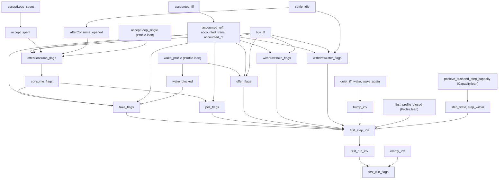

# 2026-10-06 seat QINV design: the Queue model's run invariant on the first profile

Status: a design note (history, not authority). Brief:
`docs/research/2026-10-05-claude-lead/briefs/seat-qinv-brief.md`. Base: `4bd063a2`. A scratch
probe at the base states and proves every statement below, at `[propext, Quot.sound]`. No file
of the slice is in the tree yet, so this note claims no theorem.

## 1. The statements

Codex's definition and its statement elaborate as written, in `namespace Effect4.Queue.Model`
(tested: a scratch probe). The module states the invariant as a structure with the same six
parts, so that a proof names a part. A `Decidable` instance reads it as Codex's conjunction.

```lean
structure FirstRunInv (r : Run) : Prop where
  profile : FirstProfile r.s
  within : within r.s = true
  tidy : tidy r.s = true
  quiet : quiet r.s r.signalled = true
  ok : r.ok = true
  named : r.named = true

@[semantics "reactive-scheduling" (requirement := R12)]
theorem first_step_inv (r : Run) (op : Op) (h : FirstRunInv r)
    (first : firstOp op = true) (requested : Requested r.s op) :
    FirstRunInv (step .none r op)

def FirstOps (r : Run) : List Op → Prop
  | [] => True
  | op :: ops => firstOp op = true ∧ Requested r.s op ∧ FirstOps (step .none r op) ops

@[semantics "reactive-scheduling" (requirement := R12)]
theorem first_run_inv (r : Run) (ops : List Op) (h : FirstRunInv r) (first : FirstOps r ops) :
    FirstRunInv (ops.foldl (step .none) r)

theorem empty_inv (c : Nat) : FirstRunInv { s := { capacity := some (c + 1) } }

@[semantics "reactive-scheduling" (requirement := R12)]
theorem first_run_flags (c : Nat) (ops : List Op)
    (first : FirstOps { s := { capacity := some (c + 1) } } ops) :
    (ops.foldl (step .none) { s := { capacity := some (c + 1) } }).ok = true ∧
      (ops.foldl (step .none) { s := { capacity := some (c + 1) } }).named = true
```

`first_step_inv` is the step law, with Codex's name, binders and premises. `first_run_inv` is
the run law. `FirstOps` asks both premises of each operation at the run that the operations
before it leave. `first_run_flags` is the brief's goal: from the empty queue of a positive
capacity, both flags hold after every such list. `FirstOps` and `Requested` each take a
`Decidable` instance, so a guard reads the theorem's own premises.

## 2. The first operations and their arms

`firstOp` (`src/Effect4/Laws/Modules/Queue/Profile.lean`) takes five operations: `take` at the
bounds one and one, `offer`, `poll`, `dropTake` and `dropOffer`. `Requested` asks that a take
names no pending offer, and that an offer names no waiting taker. On a state of the profile
the five operations have eleven arms. Ten end in `bump`, and `step` passes one.

| Operation | Arm | Next state | Signals | Own request |
| --- | --- | --- | --- | --- |
| `take id 1 1` | served: a message is buffered, and no other taker is earlier | `removeTaker`, `pull`, then `afterConsume` | each offer that entered, then the wake | `id` |
| `take id 1 1` | it waits, and it is enrolled | the same state | none | `id` |
| `take id 1 1` | it waits, and it enrols | the taker appended | none | `id` |
| `poll` | idle: no message is buffered, or a taker waits | the same state | none | none |
| `poll` | served | `pull`, then `afterConsume` | each offer that entered, then the wake | none |
| `offer id a` | the identity is pending: `step` passes it | the run itself | no `bump` | no `bump` |
| `offer id a` | behind a pending offer | the offer appended | none | none |
| `offer id a` | room is left | the message appended | the wake | none |
| `offer id a` | no room is left | the offer appended | the wake | none |
| `dropTake id` | one arm | `removeTaker` | the wake | `id` |
| `dropOffer id` | one arm | the offers of `id` removed | the wake | `id` |

"The wake" is `wake` of the arm's next state. On the profile `wake_profile` gives it: the
earliest taker, where a message is buffered. Nothing settles in an opened queue, so
`afterConsume` is the accept pass and the wake.

## 3. The invariant

**The two flags alone are not inductive.** `ok` and `named` record a run's history, and
`FirstProfile` leaves the buffer free. So `within`, `tidy` and `quiet` of the current state are
premises too. Codex's five witnesses show it, one for each part (tested: the Lean model, in the
scratch probe). Each first row below holds every part of the invariant but the named one.

| Part | Run, with defaults elsewhere | Step | The next run's `(ok, named)` |
| --- | --- | --- | --- |
| `within` | capacity 1, messages `[7, 8]` | `dropTake 99` | `(false, true)` |
| `tidy` | capacity 2, one pending offer of one message | `dropTake 99` | `(false, true)` |
| `quiet` | capacity 1, message `[7]`, taker 5, nobody signalled | `poll` | `(false, true)` |
| `ok` | the empty queue of capacity 1, `ok := false` | `dropTake 99` | `(false, true)` |
| `named` | the same, `named := false` | `dropTake 99` | `(true, false)` |

**Codex's six parts are inductive, and no other part is needed.** The scratch probe proves
`first_step_inv` as written. A finite probe agrees on a universe of 10240 runs. The universe
takes capacities 1 and 2, four buffers and sixteen signal histories. It takes every order of
the takers 1 to 3 and of the offers 4 and 5. Its steps are the 25 first operations over the
identities 1 to 6. The universe holds runs that no list of operations reaches.

| Premise of the step | Steps | Steps that leave the invariant | Steps that lose a flag |
| --- | --- | --- | --- |
| the invariant, `firstOp` and `Requested` | 44608 | 0 | 0 |
| the same, without `within` | not counted | not counted | 40016 |
| the same, without `tidy` | not counted | not counted | 49616 |
| the same, without `quiet` | not counted | not counted | 8688 |
| the profile and the two flags alone | not counted | not counted | 142624 |
| the invariant and `firstOp`, with `Requested` false | 5592 | 4080 | 0 |

## 4. The proof

The diagram shows the proof's order: which statement uses which. It leaves out the short
helpers, and it claims no theorem: the tree holds none of them yet.



**The run's projection.** `step_state`: `(step fault r op).s = (step fault { s := r.s } op).s`.
It carries `first_profile_closed` and `positive_suspend_step_capacity` to any run, as the brief
says. `step_within` reads the capacity statement as `within`.

**One contract for a step.** `Flags before own after signals` holds what the two flags ask of
one step, beside the bound. It has three fields:

- `tidy`: the next state is tidy;
- `quiet`: a signal of the step names each request of the next wake. Otherwise the old wake
  named the request, and it is not the step's own;
- `named`: `accounted before after own signals = true`.

`bump_inv` joins a step of this contract to a run of the invariant. It needs no profile.

**One lemma for each predicate.**

| Predicate | Lemma | Reach |
| --- | --- | --- |
| `quiet` | `quiet_iff_wake`: a state is quiet exactly when each request that its wake names is signalled | every state |
| `quiet` | `wake_again`: each signal of a wake has the note `again` | every state |
| `accounted` | `accounted_iff`, with `accounted_refl` and `accounted_trans`; signals append | every state |
| `accounted` | `accounted_of`: takers and offers that stay, are the own request, or are named | a profile state before |
| `tidy` | `tidy_iff`: no offer is pending, or the room is zero | an opened state |
| `tidy` | `acceptLoop_spent`, `accept_spent`: after the accept pass no offer is pending, or the room is spent | a finite room; no premise on the offers |

**One lemma for each model operation.** `take_flags`, `offer_flags`, `poll_flags`,
`withdrawTake_flags` and `withdrawOffer_flags` each state `Flags` for the operation's result.
Each takes its cases from the operation's own definition (`fun_cases`). The two served arms
share `consume_flags`, over `afterConsume_flags`. `acceptLoop_single` names the offers that
entered, and `accept_spent` gives the tidy state.

**The one arm with content.** `wake_blocked` is the model's half of `wait-registration-no-gap`.
Where a take is not served, the wake does not name the take's own request. Its enrolment
changes no wake. So the step may drop the request from `signalled`, as `bump` does.

## 5. The controls

The battery `Test/Program/QueueInvariant.lean` holds them, each red control with its positive
control.

| Premise | Red control | What fails |
| --- | --- | --- |
| each of the five parts of section 3 | Codex's witness, as a guard | a flag of the next run |
| `FirstProfile` | capacity 0 with a pending offer that holds no message; `take 1 1 1` | `named` |
| `FirstProfile` | a peeker 5 beside a signalled taker; `take 5 1 1` | `ok` |
| `firstOp` | a stored taker 1 of the bounds one and one; `take 1 2 3` | `ok` |
| `Requested` | a full buffer and a waiting taker 1; `offer 1 5` | the profile alone |
| `FirstOps` | `take 1 1 1`, `offer 100 1`, `offer 1 5`: each premise holds at the empty queue | the profile, after the third step |

The two mutations of the broader model stay red there, each with `Fault.none` as its positive
control. `firstOp` refuses `close` and `shutdown`, and no other arm of `step` reads the fault.
The battery states it as a checked equation: `step fault r op = step .none r op` for a first
operation. So the mutations are no falsifiers of the step law.

## 6. Findings

- **F1.** Codex's statement elaborates as written, and it is true as written (tested, then
  proved in the scratch probe). The invariant needs no further part.
- **F2.** `quiet` is `wake` read back, on every state. The step's quiet part then needs no
  closed form of an operation.
- **F3.** `Requested` guards the profile alone, on the universe of section 3: no step without
  it loses a flag (a finite probe).
- **F4.** `firstOp` guards a flag. A stored taker of the bounds one and one runs again as
  `take 1 2 3`, and the run loses `ok`. Its stored record is ready, and its retry is not. This
  is the contract's premise of immutable bounds within a request.
- **F5.** `FirstProfile` guards a flag. At capacity zero `pull` drops a pending offer that holds
  no message, with no signal. No arm of the model stores such an offer (reading).
- **F6.** The model's closed forms on the profile sit in
  `src/Effect4/Laws/Modules/Queue/Steps.lean`, above the term encoding. The new module is of the
  model alone: it imports `Profile.lean` and `Capacity.lean`, and no closed form. `settle_idle`
  is new here and is more general than `settle_opened` there. The receipt proposes their move.

## 7. What this does not establish

- Nothing about a program, a typed cell or the machine: the statements are of the model's
  `step`.
- No delivery. `signalled` records that a step named a request, not that the request ran again.
- No liveness and no fairness. An invariant is not progress.
- Nothing outside the first operations: `close`, `shutdown`, `peek`, `await` and a batch are
  outside `firstOp`.
- Nothing without `Requested` at each step. The wrapper owes that premise: fresh identities.
