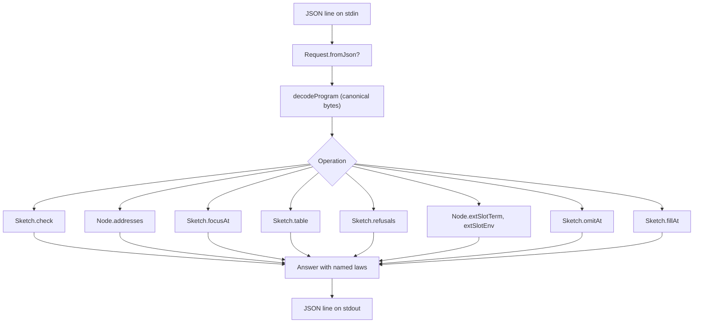

# 2026-10-06 Seat QUERY — Design Note

Status: a research note (history, not authority). It designs Step A of chunk 2 (QUERY).
Plan reference: `docs/research/2026-10-06-next-slices-plan.md` §5.3.
Brief reference: `docs/research/2026-10-06-chunk-2-brief.md` §4.

## 1. Goal and architecture

The query tool provides an interactive interface for external tools.
It reads one JSON request per line from standard input.
It evaluates the requested library operation on the decoded program.
It writes one JSON answer per line to standard output.
The pure logic lives in `tools/Tools/Query.lean`.
The driver executable lives in `tools/Drivers/Query.lean`.
Neither file requires additions to `lakefile.toml` because `Tools` globs both paths.

## 2. Operations and named laws

Each operation wraps one existing library function.
Each answer names the law on which the operation relies:

| Operation | Library function | Named law |
| --- | --- | --- |
| check | `Sketch.check` | `holes_conservative` |
| addresses | `Node.addresses` | `mem_addresses_iff` |
| focus | `Sketch.focusAt` | `focusAt_typed` |
| table | `Sketch.table` | `refusals_nil_iff` |
| refusals | `Sketch.refusals` | `refusals_head`, `refusals_nil_iff` |
| slots | `Node.extSlotTerm`, `Node.extSlotEnv` | `hasTy_extSlotEnv` |
| omit | `Sketch.omitAt` | `Sketch.check_omit_focusAt` |
| fill | `Sketch.fillAt` | `Sketch.check_fill_focusAt` (at focus type) or `holes_conservative` |

## 3. Program input and hole tables

A program crosses the boundary as canonical bytes encoded in hexadecimal.
The decoder uses `Effect4.Store.bytesOfHex` and `Effect4.Program.Wire.decodeProgram`.
The current slice operates over the empty application typing signature.
A sketch currently lacks a dedicated canonical wire codec.
We land the query operations on a program first.
We propose a canonical wire codec for `RowTable` and `Sketch` for subsequent slices.

## 4. Acceptance and test battery

The driver acceptance relies on two components:
1. `Test/fixtures/query/transcript.jsonl` contains recorded request and answer pairs.
2. `Test/Program/QueryControls.lean` verifies that `Tools.Query.answer` reproduces the answers.
The battery compares outputs against values guarded in `Test.Program.FocusControls` and `Test.Program.TableControls`.
Rendered text checks remain inside `#guard` expressions to avoid `Classical.choice` in definitions.
