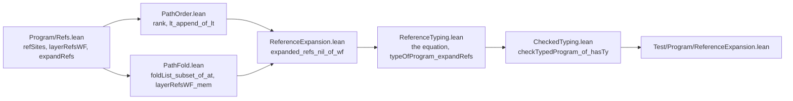

# 2026-10-06 seat REFS receipt: a well-formed program expands to a program with no reference, and two theorems lose a premise

Status: receipt (history, not authority). Brief:
`docs/research/2026-10-05-claude-lead/briefs/seat-refs-brief.md`, with the dispatch message.
Design note: `docs/research/2026-10-06-seat-REFS-design.md`. The coordinator sent no message
after the dispatch.

**The one thing to know before merging:** one file outside the brief's list changed.
`Test/fixtures/proof-style/baseline.tsv` loses the line of the old `simp` of
`typeOfProgram_expandRefs`, because the proof-style gate refuses a stale entry.

Six more facts stand beside it.

- **The goal is a theorem.** `expanded_refs_nil_of_wf` is proved in place, with the brief's
  statement and placement. The goal gate counts 24 planned goals again, after 25 at step 1.
- **Both consumers hold without their premise**, and the checker's equation is a theorem.
  Neither consumer has a caller in the tree.
- **The imports of `ReferenceTyping.lean` must stay free of the `batteries` package.** That
  file now imports the new module. With the package imported, its linter refuses one old
  line of `action_expandRound_eq_self` there (item 7, finding F1).
- **`generated/semantics.md` is stale until `make gen-semantics` runs.** R5 gains two placed
  nodes: `expanded_refs_nil_of_wf` and `typeOfProgram_expandRefs`.
- **`tools/Tools/SemanticsRegistry.lean` and `docs/core/semantics.md` are untouched.** Item 7
  holds the proposed claim, its role and title, and the module's default concept.
- **`make check-cases` refuses nothing.** The slice adds no case site on a policy family.

The sections below carry the brief's item numbers. Item 1 is the bold line above.

## 2. Base, head and commits

| Item | Value |
| --- | --- |
| Branch | `seat/refs`, in the worktree `/Users/pooks/Dev/lean4-effect4-qtypes` |
| Base | `b199c15f` |
| Main-line heads taken in | none |
| Head | the commit that adds this receipt; its parent is `ca41bd6a` |

Nothing is pushed.

| Commit | Step | Content |
| --- | --- | --- |
| `98e8236d` | 0 | the design note |
| `450ad9a6` | 1 | the new module with the planned goal, placed; the import in the Laws root |
| `00a37ffc` | 2 | the goal proved in place; the rank in `PathOrder.lean`; two facts in `PathFold.lean` |
| `525c78b3` | 3 | the two consumers and the checker's equation; the baseline's line; the comments of `Refs.lean`; two adjustments of step 2 (choice C8) |
| `8a5352dc` | 4 | the battery and its import |
| `8aaf5460` | 4 | the battery pins the four statements' plan status in one command |
| `ca41bd6a` | 5 | the row of `docs/ARCHITECTURE.md`, the role, and the design note's addendum |

## 3. Changed files

`git diff --stat b199c15f..ca41bd6a` lists 13 files, with 957 insertions and 47 deletions.
This receipt is the fourteenth. The counts of declarations come from `grep` over the lines
that open a declaration.

| Group | File | What changed |
| --- | --- | --- |
| The laws | `src/Effect4/Laws/Program/ReferenceExpansion.lean` | new: 17 theorems, 7 of them private; the predicate `RefsWithin`; one private reducible definition, one private abbreviation and one `example` |
| The laws | `src/Effect4/Laws/Program/PathOrder.lean` | `lt_append_of_lt`; the definition `rank` with `rank_lt_length` and `rank_lt_rank`; one private step. The imports are unchanged |
| The laws | `src/Effect4/Laws/Program/PathFold.lean` | `Node.foldList_subset_of_at`, `refSites_subset_of_layerAt` and `layerRefsWF_mem`. `Node.yieldAt_subset_of_at` and `layerRefsWF_at` keep their statements as corollaries |
| The laws | `src/Effect4/Laws/Program/ReferenceTyping.lean` | one import; `typeOfProgram_eq_if_refsWF`, new; `typeOfProgram_expandRefs` without `hempty`, tagged; the `#check` pin at the file's end is gone |
| The laws | `src/Effect4/Laws/Program/CheckedTyping.lean` | one import; `checkTypedProgram_of_hasTy` without `expanded` |
| The laws | `src/Effect4/Laws.lean` | one import, after `import Effect4.Laws.Program.PathFold` |
| The runtime root | `src/Effect4/Program/Refs.lean` | two comments name the theorem: the module text, and the docstring of `Eff.expandRefs`. No definition changed |
| The batteries | `Test/Program/ReferenceExpansion.lean` | new: 32 guards, 8 examples, 3 theorems and 5 pinned outputs |
| The batteries | `Test/All.lean` | one import, after `import Test.Program.LayerRefs` |
| The fixture | `Test/fixtures/proof-style/baseline.tsv` | one line removed, by hand |
| The documents | `docs/ARCHITECTURE.md` | one new row |
| The documents | `tools/Tools/ArchitectureRoles.lean` | one new role |
| The notes | `docs/research/2026-10-06-seat-REFS-design.md`, and this receipt | new |

The files import in one order. An arrow reads "is imported by". The diagram shows imports
only, and it claims no proof.



I edited none of the coordinator's files: `docs/core/decisions.md`, `lakefile.toml`,
`docs/STATE.md`, `generated/semantics.md`, `docs/core/semantics.md` and
`tools/Tools/SemanticsRegistry.lean`. I edited no definition of `src/Effect4/Program/`. I did
not edit `Test/Program/LayerRefs.lean`.

## 4. Commands, results and evidence

Each Lean, Lake or `make` command ran through
`/Users/pooks/Dev/lean4-effect4/scratch/lean-slot.sh`, named `SLOT` below. Each `make` took
the flags `-o build -o ts/eff/node_modules`, named `FLAGS`. The scratch folder is
`/private/tmp/claude-501/-Users-pooks-Dev-lean4-effect4/acf2315e-02ac-4acd-9ef9-b0734bd686a7/scratchpad/refs/`,
named `SCRATCH`. It holds each log.

| Command | Result | Evidence |
| --- | --- | --- |
| `SLOT lake build` of the four law modules of the reading list, on `b199c15f` | `Build completed successfully (240 jobs)` | tested: the worktree was warm |
| `SLOT lake env lean -DwarningAsError=true SCRATCH/probe6.lean` | no error; the three statements at `[propext, Quot.sound]` | tested: the design note's probe, before step 1 |
| `SLOT lake build`, on the tree of each commit that changes Lean, and on `ca41bd6a` | six runs, each `Build completed successfully`; the table below | proved, and tested |
| `SLOT lake build Effect4.Laws.Program.Hoisting Effect4.Laws.Program.Typed.LayerArm`, at step 2 | `Build completed successfully (451 jobs)` | tested: the direct dependents |
| `SLOT lake env lean -DwarningAsError=true SCRATCH/battery-red-all.lean` | exit 1; 19 changed checks give 19 errors, one at each | tested: the battery's red controls |
| `SLOT lake env lean -DwarningAsError=true SCRATCH/f1/Plain.lean`, then `SCRATCH/f1/WithAesop.lean` | exit 0; then exit 1 with one error, at the line of finding F1 | reproduced: finding F1 |
| `SLOT lake env lean -DwarningAsError=true SCRATCH/census.lean` | the axioms and the plan status of item 5 | tested |
| `SLOT make FLAGS check-cases`, on the tree of `8a5352dc` | `conform cases: PASS, exit 0; .lake/conform/cases.json`. The report says `231/231 subjects, 231 pass, 0 refused`. No refusal line | tested |
| `SLOT python3 scripts/check-conform.py cases`, on the tree of `ca41bd6a` | the same two lines. The target's marker was fresh, so I ran its producer by name | tested: a fresh run |
| `SLOT make FLAGS check-docs`, on the tree of `ca41bd6a` | `PASS check-docs: every path, link, citation and make target in 75 documents resolves` | tested |
| the same, with a wrong path in the new row | `FAIL check-docs: 1 stale reference(s) in 1 of 75 documents`, at the new row of `docs/ARCHITECTURE.md`; exit 2. I restored the row, and the check passes again | tested: the red control of the new row |
| `SLOT lake build Tools.ArchitectureRoles` | `Build completed successfully (2 jobs)` | tested |
| `python3 scripts/check-language.py --strict` on the design note and on this receipt | `PASS check-language: no finding`, for each | tested |
| `python3 scripts/check-language.py --show docs/ARCHITECTURE.md` | no finding at the new row; the document's older findings stay | tested |

The default builds, with the gate lines that `Test/All.lean` prints:

| Tree | Jobs | API and Laws-only modules | Modules, declarations | Planned goals, declarations on goals | Proof style: uses, unread, entries |
| --- | --- | --- | --- | --- | --- |
| `450ad9a6` | 983 | 171, 300 | 733, 87230 | 25, 11 | 1923, 59, 1179 |
| `00a37ffc` | 983 | 171, 300 | 733, 87288 | 24, 11 | 1923, 59, 1179 |
| `525c78b3` | 983 | 171, 300 | 733, 87219 | 24, 11 | 1922, 59, 1178 |
| `8a5352dc` | 984 | 171, 300 | 734, 87242 | 24, 11 | 1922, 59, 1178 |
| `8aaf5460`, and `ca41bd6a` again | 984 | 171, 300 | 734, 87242 | 24, 11 | 1922, 59, 1178 |

On each run the library-root gate reports that every library source is reachable, and that
`Effect4` never reaches Laws. The axiom gate reports the semantic and test axioms at
`[propext, Quot.sound]`. The goal gate reports that no other declaration reaches `sorryAx`.
The proof-style gate refuses nothing. I did not run the default build on the base. On the tree
of `ca41bd6a` Lake replays every module. The head commit adds this receipt only, and no build
ran after it.

The first build of step 3 ran on a tree that held the battery too. It took twelve minutes,
and Lake built 482 of its 984 jobs anew (finding F7). Then I moved the battery out and took its
import out, and the build of the exact tree of `525c78b3` passed. The battery and its import
came back for step 4.

### The battery

`Test/Program/ReferenceExpansion.lean` holds nine programs over the native alphabet. They are
the finite cases of Codex's model, as real programs.

| Program | References | The count of the sites, round by round | Result |
| --- | --- | --- | --- |
| `noRef` | none | 0, 0 | well formed; no site after the rounds |
| `oneRef` | one | 1, 0, 0 | well formed; no site |
| `chain` | a chain of three | 3, 2, 1, 0, 0 | well formed; no site; one round for each hop |
| `diamond` | three to a layer with three | 6, 9, 0, then 0 | well formed; no site; the count grows before it falls |
| `nestedTargets` | two targets inside a target | 3, 3, 1, 0, 0 | well formed; no site |
| `insideTarget` | a reference inside its own target | 1, 1, 1 | refused: the target encloses the site. The site stays |
| `forward` | a forward reference | 1, 0, 0 | refused: the target does not precede the site |
| `refTarget` | a target that is a reference | 2, 1, 0, 0 | refused: the second site names a reference |
| `missing` | a target that names no layer | 1, 1, 1 | refused: the lookup answers nothing. The site stays |

- Each red control fails `Eff.layerRefsWF` at its own clause, and at no other. The battery
  computes the three clauses at each site, and a guard ties them to the definition.
- The checker's equation is evaluated on the nine. The five well-formed programs have a type,
  and the four others have none.
- `typeOfProgram_expandRefs` is applied at the diamond, with its one premise.
- `forward_needs_wellFormed` is the red control of that premise (proved, by the kernel's
  evaluation). The checker refuses `forward`, and it types the expansion of `forward`.
- `checkTypedProgram_of_hasTy` is applied at the chain. The derivation comes from
  `effTy_sound` on the expansion's computed type.
- `insideTarget_keeps_reference` is the red control of the top theorem's premise (proved, by
  the kernel's evaluation).
- In the falsified copy every changed check fails, and no other check does.

### The acceptance, item by item

| Item of the brief | Result |
| --- | --- |
| 1. The goal is a theorem at `[propext, Quot.sound]`, with its statement as placed | yes (proved). The battery pins the statement by its type |
| 2. The two consumers hold without their premise, and no caller breaks | yes (proved). Neither has a caller. The default build passes |
| 3. The controls of part 4 pass, with each red control red | yes (tested): nine programs, and 19 of 19 falsified checks fail |
| 4. The default build, `check-cases`, `check-docs` | the tables above. `check-cases` prints no refusal |
| 5. The commands that the coordinator runs | not run: the list below |

### Not run

- `make check-gen`, `make check-slow`, `make check-corpus`, `make check-target`,
  `make check-truth`, the conservativity script and `make gen-semantics`.
- `make check-semantics` and `make gen-architecture`: both need the coordinator's report.
- `make record-proof-style`: I removed the one line by hand.
- `make check`, `make check-full` and `make status`, as targets.
- Every TypeScript lane, every host run and every OCaml run.

### Red or stale for a reason outside the slice

Nothing that I ran is red for such a reason. Two older states showed in the logs, and I left
both:

- the proof-style gate lists 59 unread commands, as the baseline records at the base. Seven
  of them are the old lemmas of `ReferenceTyping.lean` (finding F1);
- `docs/ARCHITECTURE.md` carries older findings of the language checker, away from the new
  row.

### What is proved, and what is only tested

| Claim | Evidence |
| --- | --- |
| A program with well-formed layer references expands to a program with no reference site, at the bound of `Eff.expandRefs` | proved: `expanded_refs_nil_of_wf` |
| As many rounds as the program has reference sites leave no reference, and so does every longer run of rounds | proved: `foldl_expandRound_refSites_nil` |
| The reference sites of a round are, at each site, the sites of what the round puts there | proved: `Eff.refSites_expandRound` |
| A layer's reference sites move with its path, and keep their targets | proved: `LayerTerm.refSites_append`, `LayerTerm.refSites_move` |
| A reference inside a target is an original reference, and it precedes every reference to the target | proved: `target_refs_prior` |
| The checker answers the structural type of the expansion exactly where the references are well formed | proved: `typeOfProgram_eq_if_refsWF` |
| With well-formed references, the checker's answer on the expansion is its answer on the program | proved: `typeOfProgram_expandRefs` |
| Well-formed references and a declarative derivation on the expanded tree give a certificate | proved: `checkTypedProgram_of_hasTy` |
| The premise of the top theorem is needed | proved at one program: `insideTarget_keeps_reference` |
| The premise that `typeOfProgram_expandRefs` keeps is needed | proved at one program: `forward_needs_wellFormed` |
| The premise of the top theorem is not necessary | tested at two programs: `forward` and `refTarget` |
| The count of the sites can grow in a round | tested at one program: the diamond |
| One arm of `Api.explain` is dead on a well-formed program | reading (finding F4) |

No evidence of the slice is host-only, and no host ran. Every guard of the battery is bounded:
one program each. The theorems are not bounded in the operation alphabet, in the typing
signature or in the program.

## 5. Axiom output and plan status

The axiom gate holds every declaration at `[propext, Quot.sound]`. The census
`SCRATCH/census.lean` prints these lines, and the battery pins four of them by `#guard_msgs`.

```text
'Effect4.Program.Path.lt_append_of_lt' depends on axioms: [propext, Quot.sound]
'Effect4.Program.Path.rank_lt_length' depends on axioms: [propext, Quot.sound]
'Effect4.Program.Path.rank_lt_rank' depends on axioms: [propext, Quot.sound]
'Effect4.Program.Node.foldList_subset_of_at' depends on axioms: [propext, Quot.sound]
'Effect4.Program.Node.yieldAt_subset_of_at' depends on axioms: [propext, Quot.sound]
'Effect4.Program.refSites_subset_of_layerAt' depends on axioms: [propext, Quot.sound]
'Effect4.Program.layerRefsWF_mem' depends on axioms: [propext, Quot.sound]
'Effect4.Program.layerRefsWF_at' depends on axioms: [propext, Quot.sound]
'Effect4.Program.Eff.refSites_expandRound' depends on axioms: [propext]
'Effect4.Program.LayerTerm.refSites_append' depends on axioms: [propext]
'Effect4.Program.LayerTerm.refSites_move' depends on axioms: [propext, Quot.sound]
'Effect4.Program.target_refs_prior' depends on axioms: [propext, Quot.sound]
'Effect4.Program.refsWithin_self' depends on axioms: [propext, Quot.sound]
'Effect4.Program.refsWithin_round' depends on axioms: [propext, Quot.sound]
'Effect4.Program.refsWithin_rounds' depends on axioms: [propext, Quot.sound]
'Effect4.Program.refSites_nil_of_refsWithin' depends on axioms: [propext, Quot.sound]
'Effect4.Program.foldl_expandRound_refSites_nil' depends on axioms: [propext, Quot.sound]
'Effect4.Program.expanded_refs_nil_of_wf' depends on axioms: [propext, Quot.sound]
'Effect4.Program.typeOfProgram_eq_if_refsWF' depends on axioms: [propext, Quot.sound]
'Effect4.Program.typeOfProgram_expandRefs' depends on axioms: [propext, Quot.sound]
'Effect4.Program.checkTypedProgram_of_hasTy' depends on axioms: [propext, Quot.sound]
```

No theorem reaches `Classical.choice`. One library lemma does, `List.eq_nil_iff_forall_not_mem`,
and the proof of `refSites_nil_of_refsWithin` avoids it by cases on the list.

The plan status of the four statements, as the battery pins it in one command:

```text
Effect4.Program.expanded_refs_nil_of_wf: proved; nearest []; 0 lemmas, 0 definitions
Effect4.Program.typeOfProgram_eq_if_refsWF: proved; nearest [Effect4.Program.expanded_refs_nil_of_wf]; 0 lemmas, 0 definitions
Effect4.Program.typeOfProgram_expandRefs: proved; nearest [Effect4.Program.typeOfProgram_eq_if_refsWF, Effect4.Program.expanded_refs_nil_of_wf]; 0 lemmas, 0 definitions
Effect4.Program.checkTypedProgram_of_hasTy: proved; nearest [Effect4.Program.typeOfProgram_eq_if_refsWF]; 0 lemmas, 0 definitions
next goals: 0
```

The plan reads the edges from the proof terms. The equation rests on the top theorem, and each
consumer rests on the equation. The counts are of the battery's tree, which holds no step of
a proof.

## 6. Each landed theorem's placement

**`expanded_refs_nil_of_wf`** (`src/Effect4/Laws/Program/ReferenceExpansion.lean`), tagged
`@[semantics "initial-algebras-folds" (requirement := R5)]`:

- Concept: `initial-algebras-folds`; property: the reference expansion leaves no reference
  (proposal P3).
- Question: the proposed registry claim `reference-expansion-complete`; consumers:
  `typeOfProgram_eq_if_refsWF`, and through it `typeOfProgram_expandRefs` and
  `checkTypedProgram_of_hasTy`.
- Reach: every operation alphabet; one premise, `Eff.layerRefsWF`; the bound of
  `Eff.expandRefs`, one more round than the program has reference sites. The case of no
  reference site is the same statement.
- Does not establish: scope, type formation or typing success. It says nothing about a run or
  about the sharing of layers. It gives no `lower_refines_build` and no equal-observation
  claim of R8.
- Unlocks: nothing on the M5 to M7 spine. It serves R5 as one placed node, and it removes a
  premise from the two consumers.

**`typeOfProgram_eq_if_refsWF`** (`src/Effect4/Laws/Program/ReferenceTyping.lean`), untagged:

- Concept: `initial-algebras-folds`; property: the same one, read at the checker.
- Question: a step from `reference-expansion-complete` to its two consumers.
- Reach: every typing signature and every program, with no premise. The checker answers the
  structural type of the expansion exactly where the references are well formed.
- Does not establish: that the answer is a type. It changes no definition: `typeOfProgram`
  keeps its second test.
- Unlocks: the two consumers below, and proposal P4.

**`typeOfProgram_expandRefs`** (the same file), tagged
`@[semantics "initial-algebras-folds" (requirement := R5)]`, as the brief's table places it:

- Concept: `initial-algebras-folds`; property: the checker's answer on the expanded program is
  its answer on the program.
- Question: DI-71's obligation of that name (`docs/DESIGN-ISSUES.md`); consumer: none in the
  tree today.
- Reach: every typing signature; one premise, `Eff.layerRefsWF`. The premise is needed
  (`forward_needs_wellFormed`, `Test/Program/ReferenceExpansion.lean`).
- Does not establish: that either answer is a type; anything about a run.
- Unlocks: nothing on the spine. It serves R5 as one placed node.

**`checkTypedProgram_of_hasTy`** (`src/Effect4/Laws/Program/CheckedTyping.lean`), untagged, as
its module has no placement today:

- Concept: none by tag or by module default. Its file states the checker's agreement with the
  declarative judgment.
- Question: the converse of `TypedProgram.hasTy`; consumer: a caller that holds a declarative
  derivation. No caller is in the tree.
- Reach: every typing signature; two premises, `Eff.layerRefsWF` and a derivation of `HasTy`
  on the expanded tree.
- Does not establish: execution of the expanded tree; the derivation, which is a premise.
- Unlocks: nothing on the spine.

The steps are placed by their docstrings. Each names `expanded_refs_nil_of_wf` as the goal
that it is a step of, and each names its consumer.

| File | Steps |
| --- | --- |
| `PathOrder.lean` | `lt_append_of_lt`; the private `countP_lt_countP`; `rank`, `rank_lt_length`, `rank_lt_rank` |
| `PathFold.lean` | `Node.foldList_subset_of_at`, `refSites_subset_of_layerAt`, `layerRefsWF_mem` |
| `ReferenceExpansion.lean` | the seven private `refSites_onRef_*`; `Eff.refSites_expandRound`, `LayerTerm.refSites_append`, `LayerTerm.refSites_move`; `target_refs_prior`; `RefsWithin` with `refsWithin_self`, `refsWithin_round`, `refsWithin_rounds`, `refSites_nil_of_refsWithin`; `foldl_expandRound_refSites_nil` |

## 7. Choices, findings and proposals

### Choices

- **C1. The rank counts original sites.** `Path.rank xs a` is the count of the paths of `xs`
  before `a`. The budget reads it at the sites of `root.refSites []`. A copy of a reference
  takes the rank of the nested original occurrence, so the budget names a target and no site
  of the copy.
- **C2. One law at the seven sorts, for every substitute and two paths.** The round is its
  instance at `expandAlgebra` and the empty path. The move of a layer's sites is its instance
  at `LayerTerm.ref`. One mutual recursion serves both, and each sort is one `cases` and one
  `simp only` call.
- **C3. A reducible name for the generated algebra.** `refAlgebra f` is `EffAlgebra.onRef f`,
  equal by `rfl`, and an `example` in the module checks it. Under the name, `simp only` reads
  a field at a constructor and leaves a recursive call's algebra as it is. Lean refuses a
  local `reducible` attribute on `EffAlgebra.onRef` itself.
- **C4. No inverse fact from a site to an address.** Codex's review asks for one. The move of
  a layer's sites replaces it: a nested site is the target's path with an extension.
- **C5. The exact bound is stated over any list of rounds** (`foldl_expandRound_refSites_nil`).
  I added no `expandRounds` definition: Codex marks it optional, and `Eff.expandRefs` is the
  fold itself.
- **C6. The equation is the hub.** `typeOfProgram_eq_if_refsWF` follows from the top theorem,
  and both consumers follow from it. The brief's table names the equation as the consumer of
  `typeOfProgram_expandRefs`. The proof runs the other way.
- **C7. The tags.** `typeOfProgram_expandRefs` carries the brief's placement as a tag. The
  equation and `checkTypedProgram_of_hasTy` carry none.
- **C8. Two changes after the design note**, both from finding F1. The lookup fact landed as
  `refSites_subset_of_layerAt`, with the premise that `Eff.layerRefsWF` reads. The two new
  proofs of `PathOrder.lean` use no search. So neither `PathOrder.lean` nor the new module
  imports `aesop`. The note's section 9 records both. Step 2 landed the first forms, and step 3
  replaced them.
- **C9. The comments of `Refs.lean` landed with step 3.** A comment edit there rebuilds the
  modules after it (finding F7), and step 3 rebuilds the typed state's graph already.
- **C10. `Node.yieldAt_subset_of_at` and `layerRefsWF_at` are now corollaries**, with their
  statements unchanged. Each new fact is the general one, and the old proof was its copy.
- **C11. The battery is a new file**, beside `Test/Program/LayerRefs.lean`, which imports the
  typed state. The new battery imports the two consumers' files only.
- **C12. The pin of `typeOfProgram_expandRefs` moved to the battery**, with the pins of the
  other three statements. Each is an `example` at the exact type.
- **C13. The battery's clause instrument has no case on the program family.** It reads a
  target's layer through `LayerTerm.refSite`.
- **C14. The baseline's line is removed by hand.** The brief's file list does not name the
  baseline. Its acceptance asks for a green default build, and the new proof has no bare
  `simp`. I told the coordinator in a message during step 3.

### Findings

- **F1. One old line fails a linter of the `batteries` package.** The line is
  `all_goals congr 1 <;> close_ref_free`, in `action_expandRound_eq_self`
  (`src/Effect4/Laws/Program/ReferenceTyping.lean`). The linter is `unnecessarySeqFocus`. It
  is absent while the file imports no module of that package, and `aesop` requires the
  package. Reproduced: a copy of the file elaborates with exit 0, and the same copy with one
  more line, `import Aesop`, gives one error at that line. I did not touch the old proof. It
  holds `simp_all` and a macro with `first`, so a touch owes a rewrite of seven lemmas.
- **F2. The premise is sufficient and not necessary.** Two refused programs of the battery
  expand to a program with no reference site: the forward reference, and the target that is
  a reference. The proof uses two clauses of `Eff.layerRefsWF` and the lookup's success. It
  does not use the clause that a target is no reference.
- **F3. As many rounds as sites are enough.** `foldl_expandRound_refSites_nil` needs no extra
  round. `Eff.expandRefs` runs one more, and a round changes no program without a reference
  site (`eff_expandRound_eq_self`, `src/Effect4/Laws/Program/ReferenceTyping.lean`).
- **F4. One arm of `Api.explain` is dead on a well-formed program** (reading,
  `src/Effect4/Api.lean`). It answers `layerReference` when the expansion keeps a site, and
  the top theorem says that the expansion keeps none.
- **F5. `typeOfProgram_expandRefs` and `checkTypedProgram_of_hasTy` have no caller** (reading:
  `grep` over `src`, `Test` and `tools`).
- **F6. The budget may serve a subterm too.** `refsWithin_rounds` takes any start term that
  holds the budget. I read the steps so: an addressed subterm holds the budget at zero, and
  then the rounds of `Eff.expandIn` leave it no reference. I did not state or prove it, and
  nothing asks for it today.
- **F7. Two comment lines of `Refs.lean` rebuilt 36 more modules of the runtime root.** Step
  3's build made 482 of 984 jobs anew. They are 235 modules of the laws, 209 batteries, 37
  modules of the runtime root and one tool module. `Refs.lean` is the one file of the runtime
  root that changed. The rebuilt ones start at `src/Effect4/Program/Typed.lean`, which is no `module`
  file (reading of the log). The merge pays the same build once.
- **F8. `make check-cases` decides nine named families**, and `LayerTerm` is none of them
  (reading, `tools/Conform/Effect4/cases-policy.json`). The brief asks for the refusal's
  lines, and no refusal came.

### Proposals (not rulings)

- **P1. The registry claim**, for `tools/Tools/SemanticsRegistry.lean`:

  ```lean
  { id := "reference-expansion-complete", concept := "initial-algebras-folds", role := .substitution
    title := "A program with well-formed layer references expands to a program with no reference site, at the bound of expandRefs"
    pointer := .witness `Effect4.Program.expanded_refs_nil_of_wf },
  ```

  The role `substitution` fits the statement: the expansion substitutes a target's term for
  each reference. `canonicalForms` is the other candidate, if the owner's list reads the
  result's shape first. I propose no literature entry: Codex's review found no source that
  states this theorem.
- **P2. The module's default concept**: add `Effect4.Laws.Program.ReferenceExpansion` to the
  `defaultModules` of `initial-algebras-folds`. `Effect4.Laws.Program.PathFold` states the
  same concept in its header, and it is a second candidate.
- **P3. The required property's text**, for `docs/core/semantics.md`: the design note's
  section 7, unchanged.
- **P4. Remove the checker's second test**, in a later slice. `typeOfProgram` becomes the
  right side of `typeOfProgram_eq_if_refsWF`, and the equation becomes `rfl`. The dead arm of
  `Api.explain` goes with it (F4), since `Api.explain_none_iff` is proved in the runtime root
  by unfolding both. Five more proofs unfold `typeOfProgram` and move with it (reading):
  `typeOfProgram_ext` (`src/Effect4/Laws/Program/Signature.lean`); `TypedProgram.layerRefsWF`,
  `TypedProgram.expanded_refSites` and `TypedProgram.hasTy`
  (`src/Effect4/Laws/Program/CheckedTyping.lean`); `typeOfProgram_looped`
  (`src/Effect4/Laws/Program/TypedRun.lean`).
- **P5. Rewrite the seven `*_expandRound_eq_self` lemmas**, in a later slice (F1). It removes
  seven `simp_all`, one `first` and seven unread commands from the proof-style baseline, and
  it lifts the limit on the file's imports.

## 8. The requirements R1 to R13

The lists read `generated/semantics.md` as committed at the base, and the plan status of
item 5. The report is not regenerated here.

**What the slice advances.**

- R5 gains two placed nodes, both proved: `expanded_refs_nil_of_wf` and
  `typeOfProgram_expandRefs`. R5 stays open, and neither of its two open parts moves.
- The checker's agreement with the declarative judgment asks one premise less, at
  `checkTypedProgram_of_hasTy`. That theorem is a node of no requirement today. Codex's review
  reads it as a typing consumer under R4.
- No requirement closes. One theorem of the reference expansion closes none.

**What the slice's theorems still rest on.**

- No planned goal: each of the four statements has the plan status "proved", with no next
  goal.
- Their premises: well-formed references (`Eff.layerRefsWF`), and for
  `checkTypedProgram_of_hasTy` a derivation of `HasTy` on the expanded tree.
- No bounded evidence and no host: the theorems hold at every operation alphabet, typing
  signature and program.

**The older open parts that the slice leaves untouched.** Every open part and every next goal
of the report stays as it is. The counts come from the report, by one `awk` command over its
lines that open with "- Open:".

| Requirement | Open parts | The slice's relation |
| --- | --- | --- |
| R1 | 4 | none |
| R2 | 5 | none |
| R3 | 6 | none |
| R4 | 5 | none; the converse typing theorem is no node of it |
| R5 | 2 | two new placed nodes. `lower_refines_build` (row 147) stays open. So do the reference keys, Config, minted keys and context validation. The goal `unauthorized_calls_nothing` stays a goal |
| R6 | 7 | none |
| R7 | 4 | none |
| R8 | 6 | none: the theorem is about the expansion that typing reads, and it gives no equal-observation claim |
| R9 | 1 | none |
| R10 | 12 | none |
| R11 | 6 | none |
| R12 | 7 | none |
| R13 | 4 | none |

The report's ten next goals are untouched: `bounded`, `cleans_once`, `committed`, `counted`,
`unauthorized_calls_nothing`, `stale_never_applies`, `cleanup_keeps`, `retries_declared`,
`releases_once` and `infrastructure_escapes`.

## 9. Open obligations

None of the brief's table. No planned goal of the slice is open. The proposals P4 and P5 name
later work, and no one has ruled them.

## 10. Proposed decisions rows (proposals only)

One row, if the coordinator takes proposal P4:

| Topic | Proposal |
| --- | --- |
| The checker's second test | `typeOfProgram` tests the references' formation only, as `typeOfProgram_eq_if_refsWF` shows that it may. The dead arm of `Api.explain` goes in the same slice, with `Api.explain_none_iff` |
