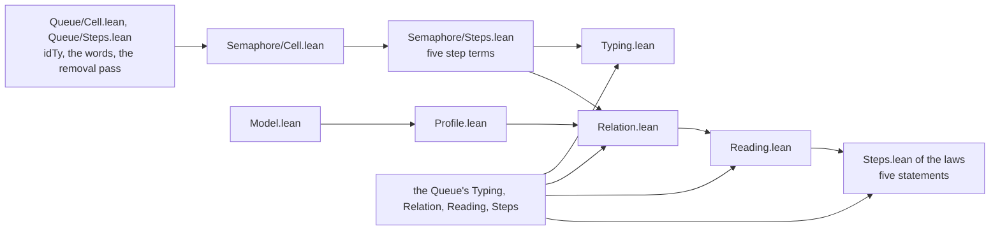

# 2026-10-06 seat SEM receipt: Semaphore's contract, model, cell and five steps, each step typed and proved to agree with the model

Status: receipt (history, not authority). Brief:
`docs/research/2026-10-05-claude-lead/briefs/seat-sem-brief.md`, with the dispatch message.
Design note: `docs/research/2026-10-06-seat-SEM-design.md`. The coordinator sent eight messages
after the brief. Items 2 and 7 name what each one changed.

**The one thing to know before merging:** the engine's fixture holds two programs' bytes as the
wire stands at `85a8e587`. After a merge that changes the wire or a form those programs use,
the first guard of `Test/Program/SemaphoreEngine.lean` fails until `make gen-fixtures` runs.

Seven more facts stand beside it.

- **No planned goal remains.** Every obligation of the brief's table is a theorem. The goal
  gate counts 24 planned goals, as it did before step 6 declared the five.
- **The step statements hold on every model state.** No statement takes the profile as a
  premise. The brief's table asks for the profile's states only.
- **Main moved by one commit**, `f569d4af`, which changes `docs/STATE.md` alone. The branch
  holds `85a8e587`, and it changes no file of that commit.
- **Fourteen statements name no declaration of Semaphore.** They wait in Semaphore's folder
  for the coordinator's move (item 8).
- **`Profile.lean` serves two concepts.** Its default concept is a choice for the semantics
  registry (item 10, row 3).
- **The semantics report prints two pairs of nodes under one short name**: `takeStep_types` in
  R4 and `takeStep_agrees` in R10 (item 10, row 6).
- **The case P9 runs on Lean's machine and not on the generated engine.** The lane's fixture
  holds no tape (item 9).

The sections below carry the brief's item numbers. Item 1 is the bold line above.

## 2. Base, head and commits

| Item | Value |
| --- | --- |
| Branch | `seat/semaphore`, in the worktree `/Users/pooks/Dev/lean4-effect4-qsteps` |
| Base | `05489250` |
| Main-line heads taken in | `1d292a3d` as the merge `991c6b44`; `190e9d95` as `09e89e38`; `c17f0be7` as `4b782193`; `85a8e587` by a fast-forward. No conflict |
| The coordinator's merges of this branch | steps 1 to 3 as `c685aa71`; step 4 as `c17f0be7`; steps 5 to 7 as `85a8e587` |
| Head | the commit that adds this receipt; its parent is `fb6cd17c` |

Nothing is pushed.

| Commit | Step | Content |
| --- | --- | --- |
| `caced658` | 1 | the design note |
| `daecfbc9` | 2 | `Test/Program/SemaphoreScenarios.lean`: six cases on the machine, with three red controls |
| `0c76c9a9` | 3 | the packet, `Model.lean`, `Profile.lean` with the closure and two facts of a visit proved, and the contract battery |
| `991c6b44` | — | the merge of `1d292a3d`: seat MASK's first step, which changes the wire |
| `a864c26d` | 4 | `Cell.lean` and `Steps.lean` of the module, `Typing.lean`, the steps battery; the scenarios now run the library's steps |
| `09e89e38` | — | the merge of `190e9d95` |
| `0583a0eb` | 5 | `Test/Program/SemaphoreAgreement.lean`: each step against the model on a finite universe |
| `4b782193` | — | the merge of `c17f0be7` |
| `88fbaa15` | 6 | `Relation.lean`, the five step goals as planned goals, and the relation battery |
| `6901264c` | 7 | `Reading.lean`, and the five goals proved in place with each statement unchanged |
| `796ee553` | 8 | the engine's lane: the cases P1 and P3 through the wire, on both carriers |
| `303d533a` | 8 | the rows of `docs/ARCHITECTURE.md` and the roles of the role register |
| `fb6cd17c` | 8 | one row of the packet: the engine's two cases |

The coordinator's messages, in order:

1. It accepts the design note's four choices. It asks for a sentence on the take's removal,
   and for one control with the entry present.
2. It accepts part 1. It asks for the trace fact as a named control, and for P9's yield in the
   packet.
3. It names main at `1d292a3d`. It asks for the fixture after that merge, by `make gen-fixtures`.
4. It names main at `190e9d95`. It asks that a visit's term compares no whole record.
5. It keeps the removal by position, and it leaves the three new rules in Semaphore's folder.
6. It names main at `c17f0be7`.
7. It asks for each goal's plan status and axioms, and for the open parts of R10 and R12 by name.
8. It names main at `85a8e587`. It asks for the registry's claims and for the `erase` line.

## 3. Changed files, by group

The counts of declarations come from `grep` over the lines that open a declaration. The
census of item 5 gives the same theorems.

| Group | File | What it holds |
| --- | --- | --- |
| The module | `src/Effect4/Modules/Semaphore/Cell.lean` | new: the two field lists, the two types, and the initial value at a total |
| The module | `src/Effect4/Modules/Semaphore/Steps.lean` | new: seven words and passes, and the five step terms |
| The module | `src/Effect4.lean` | two imports and one comment, after `import Effect4.Modules.Queue.Steps` |
| The laws | `src/Effect4/Laws/Modules/Semaphore/Model.lean` | new: 13 definitions, no theorem |
| The laws | `src/Effect4/Laws/Modules/Semaphore/Profile.lean` | new: the structure `Profile`, 19 theorems, one `Decidable` instance |
| The laws | `src/Effect4/Laws/Modules/Semaphore/Typing.lean` | new: two reply types and 40 theorems |
| The laws | `src/Effect4/Laws/Modules/Semaphore/Relation.lean` | new: six definitions, no theorem |
| The laws | `src/Effect4/Laws/Modules/Semaphore/Reading.lean` | new: 30 theorems |
| The laws | `src/Effect4/Laws/Modules/Semaphore/Steps.lean` | new: the structure `StepsAgree` and 12 theorems |
| The laws | `src/Effect4/Laws.lean` | six imports, after `import Effect4.Laws.Modules.Queue.Checking` |
| The packet | `Test/contracts/semaphore.contract.md` | new |
| The batteries | `Test/Program/SemaphoreScenarios.lean` | new: 30 guards, and the text of the engine's fixture |
| The batteries | `Test/Program/SemaphoreContract.lean` | new: 30 guards and 9 pinned outputs |
| The batteries | `Test/Program/SemaphoreSteps.lean` | new: 34 guards, 5 examples, 4 theorems and 15 pinned outputs |
| The batteries | `Test/Program/SemaphoreAgreement.lean` | new: 37 guards |
| The batteries | `Test/Program/SemaphoreRelation.lean` | new: 16 guards, 2 examples, 3 theorems and 17 pinned outputs |
| The batteries | `Test/Program/SemaphoreEngine.lean` | new: 12 guards over the committed fixture |
| The batteries | `Test/All.lean` | six imports, after `import Test.Program.QueueTyping` |
| The engine's lane | `ocaml/engine/test/semaphore/write.lean` | new: the fixture's writer |
| The engine's lane | `ocaml/engine/test/semaphore/semaphore.txt` | new, generated by `make gen-fixtures` |
| The engine's lane | `ocaml/engine/test/semaphore/test_semaphore.ml`, and `dune` beside it | new: the properties S1 to S4, 19 checks |
| The documents | `docs/ARCHITECTURE.md` | one line of the layer sketch, and two new rows |
| The documents | `tools/Tools/ArchitectureRoles.lean` | two new roles, and the text of the two parents |
| The notes | `docs/research/2026-10-06-seat-SEM-design.md`, and this receipt | new |

The files import in one order. An arrow reads "is imported by".



I edited no file of the Queue's folders. I edited none of the coordinator's files:
`docs/core/decisions.md`, `lakefile.toml`, `docs/STATE.md`, `generated/semantics.md`,
`tools/Tools/SemanticsRegistry.lean` and `Test/Audit/AxiomGate.lean`.

No file of the slice holds a `match` on `Eff`, on `ActionTerm`, on `Term` or on `Val`. The
scenarios battery matches on a `RunEvent` with a catch-all, on the build's refusal and on an
exit. `make check-cases` refuses none of them.

## 4. Commands, results and evidence

Each Lean, Lake or `make` command ran through
`/Users/pooks/Dev/lean4-effect4/scratch/lean-slot.sh`, named `SLOT` below. Each `make` took
the flags `-o build -o ts/eff/node_modules`, named `FLAGS`. The scratch folder is
`/private/tmp/claude-501/-Users-pooks-Dev-lean4-effect4/acf2315e-02ac-4acd-9ef9-b0734bd686a7/scratchpad/sem/`,
named `SCRATCH`. It holds each log.

| Command | Result | Evidence |
| --- | --- | --- |
| `SLOT lake build`, on `05489250` | `Build completed successfully (956 jobs)` | tested: the baseline |
| `SLOT lake env lean SCRATCH/p1/Probe1.lean`, and two more probes | each case's exit and trace, before the battery | tested: part 1's first runs |
| `SLOT lake build`, after each step that changes Lean, and after the first merge | eight runs, each `Build completed successfully`; the table below | proved, and tested |
| `SLOT lake build`, on the tree of `303d533a` | `Build completed successfully (973 jobs)`; Lake replays every module | proved, and tested |
| `SLOT lake env lean -DwarningAsError=true` on six falsified copies | exit 1 each; 17, 14, 10, 15, 11 and 5 errors; the table of the batteries | tested: the red controls |
| `SLOT make FLAGS gen-fixtures`, before `796ee553` | `PASS generate: requested producers ran in dependency order`; it writes `semaphore.txt` | tested |
| the same, on the tree of `fb6cd17c`, then `git status` | the same line; `git status` lists no path, so each of the four lanes' fixtures is byte-identical | tested: a fresh run of the producer |
| `SLOT make FLAGS corpus` | `kept 408 (readable 385) refused 0`; `generated/corpus-index.tsv` unchanged | tested |
| `opam exec --switch=effect4 -- dune build`, in `ocaml/` | exit 0; one warning 8 in `gen/api_check.ml` | tested |
| `opam exec --switch=effect4 -- dune test --force engine`, in `ocaml/` | exit 0; 1726 `PASS` lines and no `FAIL` line; `test_semaphore: 19 checks, 0 failures` | tested |
| the built `test_semaphore.exe`, under `opam exec`, on three fixtures in `SCRATCH/red6/` | a copy of the committed one: exit 0, 19 `PASS` lines. Two falsified ones: exit 1 each, with two `FAIL` lines, then one | tested: the red controls of the engine's test |
| `SLOT make FLAGS check-cases` | `conform cases: PASS, exit 0; .lake/conform/cases.json`. No refusal line | tested |
| `SLOT make FLAGS check-docs`, on the tree of `fb6cd17c` | `PASS check-docs: every path, link, citation and make target in 75 documents resolves` | tested |
| `python3 scripts/check-language.py --strict` on the design note, the packet and this receipt | `PASS check-language: no finding` | tested |
| `python3 scripts/check-language.py --show docs/ARCHITECTURE.md` | no finding at the three edited places; the older findings stay | tested |
| `SLOT lake build Tools.ArchitectureRoles` | `Build completed successfully (2 jobs)` | tested |
| `SLOT lake env lean SCRATCH/final/Census2.lean` | the counts of items 5 and 8 | tested: a census of the environment |
| `SLOT lake env lean SCRATCH/final/AutoCensus.lean` | plain `aesop` closes 16 of 110 theorem constants from their statements | tested: `#auto_census` |

The default builds, with the gate lines that `Test/All.lean` prints:

| Tree | Jobs | API and Laws-only modules | Modules, declarations | Planned goals, declarations on goals |
| --- | --- | --- | --- | --- |
| `05489250` | 956 | not kept | not kept | not kept |
| `daecfbc9` | 957 | 167, 287 | 707, 86124 | 24, 11 |
| `0c76c9a9` | 960 | 167, 289 | 710, 86328 | 24, 11 |
| `991c6b44` | 963 | 168, 289 | 713, 86667 | 24, 11 |
| `a864c26d` | 967 | 170, 290 | 717, 86732 | 24, 11 |
| `0583a0eb` | 968 | 170, 290 | 718, 86886 | 24, 11 |
| `88fbaa15` | 971 | 170, 292 | 721, 86925 | 29, 15 |
| `6901264c` | 972 | 170, 293 | 722, 86970 | 24, 11 |
| `796ee553`, and `303d533a` again | 973 | 170, 293 | 723, 86984 | 24, 11 |

On each run the library-root gate reports that every library source is reachable, and that
`Effect4` never reaches Laws. The axiom gate reports the semantic and test axioms at
`[propext, Quot.sound]`. The goal gate reports that no other declaration reaches `sorryAx`.
The proof-style gate reports 1923 recorded uses and 60 recorded unread commands in 1180
entries, and it refuses nothing. The builds of `0583a0eb` and of `88fbaa15` cover the two
later merges. The head commit adds this receipt only, and no build ran after it.

### Part 1, case by case

Each run is one schedule on Lean's machine. The pin's answers are the probe's recorded output,
`docs/research/2026-10-05-claude-lead/module-cards/semaphore-probes/semaphore-wake.rc112.out`
(reading: I ran no host probe).

| Case | The machine's answer | The pin's |
| --- | --- | --- |
| P1 | B takes 2 inside the walk. The next visit reads no free permit. C waits with its first stamp | the same |
| P2 | The release answers 1. The walk passes B and resumes C, which takes 1. B keeps its first stamp | the same |
| P3 | B takes 1 and takes 1 again, inside the walk. C waits with its first stamp | the same |
| P4 | B's body reads 2 taken, then C's body reads 1. Nothing stays taken, and nobody waits | the same |
| P7 | Each interrupted waiter's entry leaves, and `taken` stays 1 | the same |
| P9 | B yields at its resume. C takes 1. B then waits again with a new stamp | the same |

- **The settings.** The tape is `[evaluate root, flush]`. The fuel and the compile fuel are
  20000. Each fiber's budget of operations before a yield is the default, 2048.
- **P9 needs no extension of the run's API.** Its tape holds one more decision,
  `yieldVerdict` for fiber 2, played while that fiber is parked.
- **The trace.** On P1 the fibers exit in the order A, B, the helper, C, the root. On P4 both
  protected bodies exit inside the first helper. So a resumed waiter exits before the helper.
- **The three red controls.** The walk that wakes the head alone fails P2. The walk that
  commits for every fitting waiter fails P3. The retry with no second check takes 3 of 2
  permits on P9. Each changed policy builds, so typing does not catch it.

### The batteries

| Battery | What it checks | Falsified copy | Evidence |
| --- | --- | --- | --- |
| `SemaphoreScenarios.lean` | six cases and one take that never waits, on the library's steps; the trace; the settings; three red policies | 15 of 15 changed guards fail | tested |
| `SemaphoreContract.lean` | six traces of the model; the difference P5; one red state for each condition of the profile; three faults; pins | 17 of 17 changed checks fail | tested |
| `SemaphoreSteps.lean` | each step's type by the checker; sizes; a caller's variable under each fold; each typing theorem at a minted name; two joins by `step_keeps_cell`; pins | 11 of 11 | proved instances, and tested |
| `SemaphoreAgreement.lean` | 225 states of the profile with 23 moves each, 5175 comparisons; four states outside the profile; three changed results; three faults as changed steps | 14 of 14 | tested |
| `SemaphoreRelation.lean` | each statement's conclusion on the same universe; a table that is not injective; three joins by `step_updates`; pins | 10 of 10 | proved instances, and tested |
| `SemaphoreEngine.lean` | the committed fixture is the text that Lean computes; its shape; the round trip of the wire on both programs | 5 of 5 | tested |

In each falsified copy every changed check fails, and no other check does. The engine's test
fails its property S2 on both carriers where the fixture holds another exit. It fails its
first check where the fixture holds the two runs in the other order.

### The acceptance, item by item

| Item of the brief | Result |
| --- | --- |
| 1. Part 1 gives the pin's answers on P1 to P4, with each red control red | yes (tested, one schedule each). P7 and P9 run too |
| 2. The batteries of part 7 pass, with each fault red at its own property | yes (tested). The checker types each faulty step as it types the library's |
| 3. The engine replays two cases on both carriers | yes: P1 and P3, 19 checks (tested) |
| 4. The default build, the generator, the corpus and dune, `check-cases`, `check-docs` | the table of commands above. `check-cases` prints no refusal |
| 5. The commands that the coordinator runs | not run: the list below |

### Not run

- `make check-gen`, `make check-slow`, `make check-corpus`, `make check-target`,
  `make check-truth`, the conservativity script and `make gen-truth-ledger`.
- `make gen-semantics` and `make check-semantics`: the report is the coordinator's.
- `make gen-architecture`: it needs `make gen-semantics`, and its map is a report.
- `make check`, `make check-full`, `make check-ocaml` and `make status`, as targets.
- Every TypeScript lane and every host run. No tsgo run and no bun run is in this slice.

### Red or stale for a reason outside the slice

- `gen/api_check.ml` gives one warning 8 in `dune build`: its match names no `Val_negInt` and
  no `Val_float`. The build exits 0.
- The engine's cross face prints `agree=9 differ=2`, for `pAcquire` and `pProvide`. The test
  reports it and does not gate on it. Two receipts of 2026-10-04 name it already.
- The row `fixtures` of `docs/GENERATED.md` names neither the mask's lane nor Semaphore's
  (item 10, row 7).

### What is proved, and what is only tested

| Claim | Evidence |
| --- | --- |
| Each transition of the model keeps the profile, with no premise on its request | proved: `profile_closed` |
| A visit selects the earliest fitting waiter at or after its cursor; it stops exactly when no permit is free or no such waiter fits | proved: `visit_selects_earliest`, `visit_stops_iff` |
| The initial value and each of the five step terms have their stated types at every scope of names | proved: six theorems of `Typing.lean` |
| Each step term reads the model's reply and the model's next state through the table, on every model state | proved: five theorems of `Steps.lean`, and `semaphore_steps_agree` |
| One `Ref.modify` of the release, of the visit or of the take is the model's transition at the store | proved: three instances in `SemaphoreRelation.lean`, at the step's own names |
| A release and a visit keep the cell a member of its type, from the cell's membership before the step | proved: two theorems of `SemaphoreSteps.lean`, at every scope; the membership before the step is a premise |
| A waiter runs inside the task that resolves its hint (row 259's reading) | tested: the exits' order on P1, P3, P4 and P9, one schedule each, on Lean's machine |
| The six cases give the pin's counts | tested on Lean's machine; the pin's side is a reading of the probe's output |
| The generated engine gives Lean's exit on P1 and P3, on both carriers, and the two carriers give one report | tested: two programs, the engine's own drive loop |
| Each step agrees with the model outside the profile too | tested on four states; proved by the five theorems, which take no profile |

No evidence of the slice is host-only, and no host ran. Every guard is bounded: one input, one
schedule or one finite universe. The theorems are not bounded in the state, the table or the
scope of names.

## 5. Axiom output and plan status

The axiom gate holds every declaration at `[propext, Quot.sound]`. The census
`SCRATCH/final/Census2.lean` reads the axioms of each written theorem of the four theorem
files.

| File | Theorems | `[propext, Quot.sound]` | `[propext]` | none |
| --- | --- | --- | --- | --- |
| `Profile.lean` | 19 | 7 | 6 | 6 |
| `Typing.lean` | 40 | 40 | 0 | 0 |
| `Reading.lean` | 30 | 5 | 22 | 3 |
| `Steps.lean` | 12 | 5 | 2 | 5 |
| all four | 101 | 57 | 30 | 14 |

No theorem reaches `Classical.choice`. The batteries pin these lines by `#guard_msgs`.

```text
'Effect4.Semaphore.Model.profile_closed' depends on axioms: [propext, Quot.sound]
'Effect4.Semaphore.Model.visit_selects_earliest' depends on axioms: [propext, Quot.sound]
'Effect4.Semaphore.Model.visit_stops_iff' depends on axioms: [propext, Quot.sound]
'Effect4.Semaphore.Model.visit_reserves_nothing' does not depend on any axioms
'Effect4.Semaphore.Model.step_permits' does not depend on any axioms
'Effect4.Semaphore.Model.initial_profile' does not depend on any axioms
'Effect4.Semaphore.Model.empty_types' depends on axioms: [propext, Quot.sound]
'Effect4.Semaphore.Model.takeStep_types' depends on axioms: [propext, Quot.sound]
'Effect4.Semaphore.Model.takeIfAvailableStep_types' depends on axioms: [propext, Quot.sound]
'Effect4.Semaphore.Model.releaseStep_types' depends on axioms: [propext, Quot.sound]
'Effect4.Semaphore.Model.visitStep_types' depends on axioms: [propext, Quot.sound]
'Effect4.Semaphore.Model.withdrawStep_types' depends on axioms: [propext, Quot.sound]
'Effect4.Semaphore.Model.takeStep_agrees' depends on axioms: [propext, Quot.sound]
'Effect4.Semaphore.Model.takeIfAvailableStep_agrees' depends on axioms: [propext]
'Effect4.Semaphore.Model.releaseStep_agrees' depends on axioms: [propext]
'Effect4.Semaphore.Model.visitStep_agrees' depends on axioms: [propext, Quot.sound]
'Effect4.Semaphore.Model.withdrawStep_agrees' depends on axioms: [propext, Quot.sound]
'Effect4.Semaphore.Model.semaphore_steps_agree' depends on axioms: [propext, Quot.sound]
'Effect4.Semaphore.Model.reads_removeById' depends on axioms: [propext, Quot.sound]
'Test.Program.SemaphoreSteps.visitStep_keeps_cell' depends on axioms: [propext, Quot.sound]
'Test.Program.SemaphoreSteps.releaseStep_keeps_cell' depends on axioms: [propext, Quot.sound]
'Test.Program.SemaphoreRelation.release_updates' depends on axioms: [propext, Quot.sound]
'Test.Program.SemaphoreRelation.visit_updates' depends on axioms: [propext, Quot.sound]
'Test.Program.SemaphoreRelation.take_updates' depends on axioms: [propext, Quot.sound]
```

The plan status of each placed theorem, as pinned:

```text
Effect4.Semaphore.Model.profile_closed: proved; nearest []; 0 lemmas, 0 definitions
Effect4.Semaphore.Model.visit_selects_earliest: proved; nearest []; 0 lemmas, 0 definitions
Effect4.Semaphore.Model.visit_stops_iff: proved; nearest []; 0 lemmas, 0 definitions
Effect4.Semaphore.Model.empty_types: proved; nearest []; 0 lemmas, 0 definitions
Effect4.Semaphore.Model.takeStep_types: proved; nearest []; 0 lemmas, 0 definitions
Effect4.Semaphore.Model.takeIfAvailableStep_types: proved; nearest []; 0 lemmas, 0 definitions
Effect4.Semaphore.Model.releaseStep_types: proved; nearest []; 0 lemmas, 0 definitions
Effect4.Semaphore.Model.visitStep_types: proved; nearest []; 0 lemmas, 0 definitions
Effect4.Semaphore.Model.withdrawStep_types: proved; nearest []; 0 lemmas, 0 definitions
Effect4.Semaphore.Model.takeStep_agrees: proved; nearest []; 0 lemmas, 0 definitions
Effect4.Semaphore.Model.takeIfAvailableStep_agrees: proved; nearest []; 0 lemmas, 0 definitions
Effect4.Semaphore.Model.releaseStep_agrees: proved; nearest []; 0 lemmas, 0 definitions
Effect4.Semaphore.Model.visitStep_agrees: proved; nearest []; 0 lemmas, 0 definitions
Effect4.Semaphore.Model.withdrawStep_agrees: proved; nearest []; 0 lemmas, 0 definitions
Effect4.Semaphore.Model.semaphore_steps_agree: proved; nearest []; 0 lemmas, 0 definitions
next goals: 0
```

The counts are of each battery's tree, which holds no step of a proof.
`generated/semantics.md` at `85a8e587` gives each node's counts in the whole tree.

**When `semaphore_steps_agree` stops being modulo.** On `88fbaa15` it is modulo: it rests on the
five goals. The goal gate counts 29 planned goals there, and 15 declarations on goals. The
four more are this theorem and the battery's three joins. In `6901264c` the five goals are
theorems, and the gate counts 24 and 11 again. Between the two commits the last two goals
were `takeStep_agrees` and `visitStep_agrees`. I saw that standing in the working tree, and I
kept no log of it.

## 6. Placements

No planned goal is in the tree for this slice. Step 6 declared five, and step 7 proved each in
place. So the list of planned goals is empty.

### The profile's closure

`profile_closed` (`src/Effect4/Laws/Modules/Semaphore/Profile.lean`).

- Concept: `store-typing`; property: each transition of the model keeps the first profile's
  states.
- Question: the model's half of the proposed claim `semaphore-accounting-preserved`. Consumer:
  the public law, along a run.
- Reach: the five transitions of `Effect4.Semaphore.Model`, from a state of `Profile`. No
  premise names a request. Decisions rows 259 to 261 and 265.
- Does not establish: anything about a program. It is an invariant, and it gives no progress
  of a waiter.
- Unlocks: R4, as a node.

### The two facts of a visit

`visit_selects_earliest` and `visit_stops_iff`, in the same file.

- Concept: `reactive-scheduling`; property: a visit selects the earliest fitting waiter at or
  after its cursor. It stops exactly when no permit is free or no such waiter fits.
- Question: no claim yet (item 10, row 2). Consumer: the waiting clauses of the proposed claim
  `semaphore-expansion-agrees`.
- Reach: one visit of the model. `visit_selects_earliest` takes the profile, for the rising
  stamps. `visit_stops_iff` takes no premise.
- Does not establish: anything about a whole walk. It is the safety of one visit, and it gives
  no liveness: no statement says that some visit selects a waiter that stays.
- Unlocks: R12, as nodes.

### The six typing statements

`empty_types`, `takeStep_types`, `takeIfAvailableStep_types`, `releaseStep_types`,
`visitStep_types` and `withdrawStep_types`
(`src/Effect4/Laws/Modules/Semaphore/Typing.lean`).

- Concept: `store-typing`; property: a step term of a `Ref.modify` is typed at the pair of its
  reply's type and the cell's type.
- Question: the cell's half of the proposed claim `semaphore-accounting-preserved`. Consumer:
  the public law, through `step_keeps_cell` (`src/Effect4/Laws/Modules/Queue/Steps.lean`).
- Reach: the checker's `argTy`, through `TypesEach`, at every scope of names. The alphabet of
  operations is a parameter, with the premise `sig.atomOf = nativeAtomTy`. A term under a fold
  comes with `CapturedTy`. Decisions rows 255, 257 and 265.
- Does not establish: agreement with the model, a wrapper's typing, a target's typing, program
  admission or progress.
- Unlocks: R4, as nodes.

### The five step statements, and the five as one

`takeStep_agrees`, `takeIfAvailableStep_agrees`, `releaseStep_agrees`, `visitStep_agrees`,
`withdrawStep_agrees` and `semaphore_steps_agree`
(`src/Effect4/Laws/Modules/Semaphore/Steps.lean`).

- Concept: `translation-simulation`; property: a step term reads the tuple of the model's
  reply and the model's next state through the encoding table.
- Question: parts of the proposed claim `semaphore-expansion-agrees`. The proposed registry
  claim is `semaphore-steps-agree` (item 10, row 1). Consumer: the public law, in the slice of
  the operations that wait.
- Reach: every model state. The table is injective where a step tests an identity. The
  observation is the reply and the stored value. A visit's reply is the selected waiter's
  record. The statement holds at every scope, with `Captured` for a term under a fold.
  Decisions rows 255, 259 to 261 and 265.
- Does not establish: an order of the wake across visits, a cancellation law, fairness,
  liveness, a wrapper or the walk. An equal value in the model says nothing of a host.
- Unlocks: R10, as nodes. They close no part of R10.

### The helpers

| Theorems | File | Concept | Reach | Consumer |
| --- | --- | --- | --- | --- |
| `mem_without`, `without_sublist`, `Profile.shrink`, `Profile.enrol`, the five `…_profile` | `Profile.lean` | `store-typing`, helpers | one transition of the model | `profile_closed` |
| `initial_profile`, `step_permits` | `Profile.lean` | `store-typing` | the state as it is made; the fixed total of row 260 | the public law, along a run |
| `visit_none_free`, `visit_none_fits`, `visit_some`, `fits_iff` | `Profile.lean` | `reactive-scheduling`, helpers | one visit of the model | the two facts of a visit; `visit_fromFirst` |
| `visit_reserves_nothing` | `Profile.lean` | `reactive-scheduling` | one visit keeps the total, `taken` and `next` (row 259) | the public law; the fault `visitGrant` of the contract battery |
| the records' types, `nativeAtomTy_add`, `types_unit`, `types_add`, `types_isZero`, and the seven passes from `types_freeT` to `types_visitFrom` | `Typing.lean` | `store-typing`, helpers | the cell's and a waiter's type; every scope | the six typing statements |
| the records' reads, `atom_add`, `reads_add`, `reads_isZero`, `reads_unit`, `not_decide_lt`, `reads_removeById`, `reads_removeWaiter`, the three `…_renew…` lemmas, the three list facts, and the six passes from `reads_freeT` to `reads_visitFrom` | `Reading.lean` | `translation-simulation`, helpers | the cell's value of a model state; every scope | the five step statements |
| `take_fits`, `take_enrols`, `takeIfAvailable_fits`, `takeIfAvailable_stays`, `decide_length_zero`, `visit_fromFirst` | `Steps.lean` | `translation-simulation`, helpers | the model's transition in closed form | the five step statements |

No helper states a run, delivery, cancellation or a host.

## 7. Choices, and each step's size

1. **A visit removes the waiter that it selects.** The pin's observer deletes itself before it
   resumes its fiber. So a waiter that waits again enrols again, with a new stamp (P9).
2. **A take removes its own request's entry first.** On every state that the wrapper reaches
   the removal changes nothing: a visit has already removed a resumed waiter. It is there so
   that no step has a premise on its request. The control `takeKeeping` holds the entry present.
3. **The cursor is the least stamp that the walk has not visited.** A helper starts at zero and
   continues at the selected stamp plus one.
4. **A visit's reply is an option of the selected waiter's record.** A withdrawal answers
   nothing, the unit value.
5. **A release answers the free count after it, and whether a waiter is enrolled.** The
   coordinator kept this reply, as the model has it.
6. **No step statement takes the profile.** The term and the model compute one truncated
   subtraction, one removal by identity and one first fitting waiter. So the closure and the
   agreement are two statements, and the public law uses both.
7. **The visit's term removes by position, and the model by `erase`.** The term compares the
   stamp with the cursor and the count with the free count, and no record. The two removals
   agree with no premise on the identities (`fromFirst_find?`, `visit_fromFirst`).
8. **The take's conclusion names `tb.renew id hint` in both branches.** Where the request
   takes, no entry of its identity stays, so the renewed table gives the same cell
   (`waiters_renew`).
9. **A waiter's identity and its hint have the Queue's `idTy`**, a `Deferred` of nothing.
10. **The typing statements take the alphabet of operations as a parameter.** The Queue's
    general forms stand at `Signature NativeOp`. The battery instantiates mine there for
    `step_keeps_cell`.
11. **The engine's two cases are P1 and P3**, the cases that the brief's part 1 names. The
    fixture's speller is an algebra of the value fold, and it refuses a value with no spelling.
12. **`List.erase_append` of core reaches `Classical.choice`.** So `fromFirst_find?` proves its
    `erase` facts by induction on the list. The next module's seat will meet the same lemma.
13. **`Option.noConfusion` on a hypothesis did not elaborate** in `visit_stops_iff`. The proof
    uses `absurd` with `Option.some_ne_none`, as seat QTYPES did.
14. **The contract battery sets `synthInstance.maxSize 1024`.** A trace's answer is one long
    tuple, and its `DecidableEq` instance passes the default size.
15. **No proof calls `aesop`, and no bank is landed.** Each derivation applies one named rule
    for each node of a step's term, as the Queue's do. Plain `aesop` closes 16 of the 110
    theorem constants from their statements. The 16 take 33 source lines: a record fact or an
    atom's value each. None is a placed theorem.
16. **Step 8 has three commits**: the lane, the documents, and one row of the packet.

### Each step's size

`Test/Program/SemaphoreSteps.lean` measures each size by the Queue battery's two algebras of
the generated term fold.

| Term | Nodes | Folds |
| --- | --- | --- |
| `takeStep` | 72 | 2 |
| `takeIfAvailableStep` | 20 | 0 |
| `releaseStep` | 20 | 0 |
| `visitStep` | 133 | 3 |
| `withdrawStep` | 22 | 1 |
| `fromFirst`, the pass of a visit | 34 | 1 |
| `removeWaiter`, the pass of a take and of a withdrawal | 16 | 1 |

A term has no binder for a shared part. So the take holds the removal's fold in both arms, and
the visit holds its one pass three times.

## 8. The Queue's helpers that the slice uses, and what waits for the move

The census counts each declaration of the Queue's folders, and of `TermIntro.lean`, that a
declaration of Semaphore's eight source files reads. It finds 93.

| Home | Count | Declarations |
| --- | --- | --- |
| `src/Effect4/Modules/Queue/Cell.lean` | 1 | `idTy` |
| `src/Effect4/Modules/Queue/Steps.lean` | 10 | `andT`, `ifT`, `isEmpty`, `len`, `noneOf`, `notT`, `orT`, `snoc`, `same`, `removeTaker` |
| `src/Effect4/Laws/Modules/Queue/Relation.lean` | 9 | `Table` with `handle`, `hint`, `Injective` and `renew`; `Reads`; `Captured` with `atScope` and `underFold` |
| `src/Effect4/Laws/Modules/Queue/Reading.lean` | 33 | `Reads.to`, `Pointwise.nil`, `Pointwise.cons`, `Table.Injective.decides`, `atom_isZero`, `foldl_keep`, `reads_foldWith_model`, `reads_minted_acc`, `reads_minted_item`, and 24 builders and words: `reads_andT`, `reads_app`, `reads_append`, `reads_bool`, `reads_drop`, `reads_field`, `reads_head`, `reads_ifT`, `reads_isEmpty`, `reads_len`, `reads_lit`, `reads_lt`, `reads_nat`, `reads_noneOf`, `reads_notT`, `reads_orT`, `reads_pair`, `reads_record`, `reads_recordSet`, `reads_same`, `reads_snoc`, `reads_sub`, `reads_take`, `reads_tuple2` |
| `src/Effect4/Laws/Modules/Queue/Checking.lean` | 33 | `Types`, `TypesEach`, `CapturedTy` with `atScope` and `underFold`, `atomOf_native`, `types_foldWith_same`, `types_minted_acc`, `types_minted_item`, and 24 builders and words: `types_andT`, `types_app`, `types_append`, `types_bool`, `types_drop`, `types_field`, `types_head`, `types_ifT`, `types_isEmpty`, `types_len`, `types_lit`, `types_lt`, `types_nat`, `types_nilT`, `types_noneOf`, `types_notT`, `types_orT`, `types_pair`, `types_record`, `types_recordSet`, `types_snoc`, `types_sub`, `types_take`, `types_tuple2` |
| `src/Effect4/Laws/Modules/Queue/Typing.lean` | 2 | `types_removeById`, `sub_nil_list` |
| `src/Effect4/Laws/Program/Typing/TermIntro.lean` | 5 | `Record.fieldType_normal`, `Record.setType_same`, `Record.check_declared`, `NativeAtom.monoApply_self`, `nativeAtomTy_isZero` |

The batteries use 14 more, by name.

- `step_updates`, in three joins, and `step_keeps_cell`, in two.
- `captured_var`, `captured_answer`, `capturedTy_var` and `capturedTy_answer`, for the capture
  premises.
- `typeAt`, `typeAt_of_types`, `types_var` and `Types.tree`, for a step's type at a scope.
- `resolve_last` and `written_ne_mint`, at a name that `bindWith` mints.
- The words `nilT` and `noneT`, in the scenarios and in the comparison.

The steps battery also uses `termAt` and `measure` of `Test/Program/QueueSteps.lean`.

Three facts for the move:

- **`cell_read` has no consumer here.** It is the read law of a `Ref.get`, and each of the
  five steps is a `Ref.modify`.
- **I changed no helper, and I copied none.** No helper of the Queue's folders had to change.
- **The shared removal pass is named `removeTaker`.** Its lemmas are already
  `types_removeById` and `reads_removeById`. The move can name the pass `removeById`.

### The statements that wait for the move

The census finds 14 theorems whose statements name no declaration of Semaphore's files.

| Theorem | Now in | It states | Proposed home |
| --- | --- | --- | --- |
| `nativeAtomTy_add` | `Typing.lean` | the type of `add` at two numbers | `TermIntro.lean`, beside `nativeAtomTy_isZero` |
| `types_add`, `types_isZero`, `types_unit` | `Typing.lean` | the words `add`, `isZero` at a number, and the literal of nothing | `Checking.lean`, with the words |
| `atom_add` | `Reading.lean` | the value of `add` | the Queue's `Reading.lean`, with the atoms |
| `reads_add`, `reads_isZero`, `reads_unit` | `Reading.lean` | the same three words, as values | the Queue's `Reading.lean`, with the words |
| `reads_removeById` | `Reading.lean` | the removal pass reads the filter by identity, for every entry encoding whose `id` field reads the table's handle | the Queue's `Reading.lean`; `reads_removeTaker` and `reads_removeOffer` become two instances |
| `not_decide_lt`, `decide_length_zero` | `Reading.lean`, `Steps.lean` | two facts of a test on numbers and on a list's length | beside `foldl_keep` |
| `foldl_fromFirst`, `length_dropWhile_le`, `fromFirst_find?` | `Reading.lean` | three facts of lists: the fold is `dropWhile`; its length; its first entry against `find?` and `erase` | beside `foldl_keep` |

Seven of the 14 name a judgment of the Queue's folder: the three `types_…` and the four
`reads_…`. The other seven name numbers, lists and atoms only.

## 9. Open obligations, and what the public slice needs

1. **The waiting wrapper** over the actual program: the enrolment, the wait, the retry and the
   withdrawal on interruption. The scenarios hold a test form of it.
2. **The walk as a library program**, and its law across visits. One visit reaches the resumed
   caller's work up to its own cut (the card's section 8).
3. **The protected form** and its three clauses. It needs the mask. The scenarios use
   `uninterruptible` and `interruptible`, which is right under an interruptible caller only.
4. **The capture premises of the visit.** The cursor's source and the cell's source stand in
   the fold's body. The public slice owes `Captured` and `CapturedTy` for each. Two lemmas
   give them. For a name that an author wrote, they are `captured_var` and `capturedTy_var`.
   For a minted name, they are `captured_minted` and `capturedTy_minted`. Their forms for the
   name that `bindWith` mints are `captured_answer` and `capturedTy_answer`. The batteries
   show both routes, with `written_ne_mint` and `resolve_last` for the resolution premise.
5. **The membership premise of `step_keeps_cell`.** No statement says that `cellVal tb s` is a
   member of `Semaphore.cellTy`. The handles that the table names must be declared.
6. **A fresh identity is no handle inside the cell**, and the table stays injective. The
   wrapper owes both from `Deferred.make`.
7. **The release's premise** (row 261): the public law takes "a release asks for at most
   `taken`". The step and its statement take no such premise.
8. **The embedded budget** for the work that a visit reaches, or a restriction of the callers
   (row 226). The scenarios do not reach the budget of 2048 operations.
9. **P9 on the generated engine.** The engine has the decision and a replay (`yield_verdict`,
   `load_program` and `replay`, `ocaml/engine/e4_engine.mli`). The lane's fixture needs one
   tape line for each run. `decisionText` of `Test/Dogfood/Scenario/Tape.lean` spells a tape.
10. **The printed module** on the target, and a host run of it.
11. **The five joins to the store are theorems of two batteries.** The public slice moves them
    into the law graph when its law reads them.
12. **The semantics registry and the report** (item 10), and the older open parts (item 11,
    list 3).

The public slice takes five things from this one.

- The step terms, with `Semaphore.cellTy` and `Semaphore.empty`.
- `semaphore_steps_agree`, with `step_updates` for the store. Three joins in
  `Test/Program/SemaphoreRelation.lean` show the route.
- The six typing statements, with `step_keeps_cell`. Two joins in
  `Test/Program/SemaphoreSteps.lean` show the route.
- `profile_closed` along a run, and the two facts of a visit for the waiting clauses.
- The reading lemmas and the builder rules, for its own terms.

## 10. Proposals (proposals only)

| # | Topic | Proposal |
| --- | --- | --- |
| 1 | A registry claim for the five step statements | `semaphore-steps-agree`, concept `translation-simulation`, role `simulation`, witness `Effect4.Semaphore.Model.semaphore_steps_agree`. Title: "Each of Semaphore's five step terms agrees with the abstract model's step on every model state: the reply, the stored value through the encoding table, and the selected waiter's record (a part of semaphore-expansion-agrees; no order of the wake across visits, no cancellation law, no liveness, no wrapper and no host; decisions rows 259 to 261 and 265)" |
| 2 | Registry claims for the model's statements | `semaphore-profile-closed`, concept `store-typing`, role `preservation`, witness `Effect4.Semaphore.Model.profile_closed`. Title: "Each transition of Semaphore's abstract model keeps the first profile, with no premise on its request (the model's half of semaphore-accounting-preserved; nothing about a program, and no progress of a waiter; decisions rows 259 to 261 and 265)". Then `semaphore-visit-selects-earliest` and `semaphore-visit-stops`, concept `reactive-scheduling`, role `inversion`, witnesses `visit_selects_earliest` and `visit_stops_iff`. Titles: "One visit of Semaphore's model selects the earliest fitting waiter at or after its cursor, and that waiter leaves" and "One visit of Semaphore's model selects nobody exactly when no permit is free or no waiter at or after the cursor fits, and then it changes nothing". Each title ends "(a helper of semaphore-expansion-agrees' waiting clauses; one visit, no walk and no liveness; decisions row 259)" |
| 3 | The registry's default modules | `Typing` under `store-typing`. `Relation`, `Reading` and `Steps` under `translation-simulation`. `Model` needs no default: it holds no theorem, as the Queue's. **`Profile` is the one I place otherwise**: the three options follow this table |
| 4 | The open parts of the requirement rows | R10: "semaphore-expansion-agrees (proposed claim; translation-simulation): Semaphore's expansion agrees with the first profile's public observation; it keeps the selected identities and the permit commits, with its premises on the wake's policy, the admitted callers, interruption and the work budget (decisions rows 79, 226, 259 to 261)". R4: "semaphore-accounting-preserved (proposed claim; store-typing): along a run of the public operations the cell stays a member of its type and its state stays in the first profile; the model's half is profile_closed, and the cell's half is the six typing statements with step_keeps_cell (decisions rows 260, 261, 265)". The words follow the card's section 8 |
| 5 | Decisions rows 259 to 261 and 265 | Row 265: record what landed: the packet, the model, the profile's closure, two facts of a visit, the cell, five steps, six typing statements, five step statements, and two cases on the engine. Row 259: its reading of the machine is tested on Lean's machine, one schedule for each of P1, P3, P4 and P9, and on the engine for P1 and P3. Row 260: the model and the five steps hold the fixed total and the natural counts; no public operation exists. Row 261: the step is landed, by `sub`, and `releaseStep_agrees` takes no premise on the count; the public law's premise is open. What is open: item 9's list |
| 6 | The report's short names | `tools/Tools/Semantics.lean` prints a node by `shortName`, the last component of its name. It keys a node by its full name (reading). So R4 prints `takeStep_types` twice, and R10 prints `takeStep_agrees` twice: the Queue's and Semaphore's. Print the last two components where two nodes of one requirement share the last one. I renamed nothing |
| 7 | The row `fixtures` of `docs/GENERATED.md` | Name the four lanes. Inputs: add `Test.Program.MaskContract` for the mask, and `Test.Program.SemaphoreScenarios` for Semaphore. Outputs: add `ocaml/engine/test/mask/mask.txt` and `ocaml/engine/test/semaphore/semaphore.txt`. Bindings: add `Test/Program/MaskEngine.lean` and `Test/Program/SemaphoreEngine.lean`. The file is not in my list, so I did not edit it |
| 8 | The move of the shared helpers | The 14 statements of item 8, to the homes that its table names. Two modules now read `Reads`, `Types`, the builder rules and the connectors, so the brief's condition for the move holds |
| 9 | P9 on the engine | One tape line for each run of the lane's fixture, and `replay` in the test. A choice of scope: the brief asks for two cases |

### Row 3: the default concept of `Profile.lean`

The file holds 19 theorems. Three carry a tag: `profile_closed` under `store-typing`, and the
two facts of a visit under `reactive-scheduling`. Of the 16 untagged theorems, eleven are on
the closure's side and five on the visit's (item 6, the helpers).

| Option | What inherits another node's concept | Cost |
| --- | --- | --- |
| (a) `reactive-scheduling`, where the Queue's `Profile.lean` stands | the eleven theorems of the closure's side, whose node is R4's | none |
| (b) `store-typing`, the concept that the brief's table gives the closure | the five theorems of the visit's side, whose nodes are R12's | none |
| (c) two files, one concept each: the closure in `Profile.lean`, the visit in a new `Visit.lean` | nothing | one new file, one root import, and two document rows |

I recommend (b) now: it follows the brief's table and the card, and fewer theorems inherit
another node's concept. I recommend (c) with the walk's law, whose home is the visit's file. I changed
no source for this choice.

## 11. Requirements R1 to R13: three lists

The source is `generated/semantics.md` at `85a8e587`, with the pinned `#plan_status` lines of
the batteries. The commits after `85a8e587` add no declaration to the law graph. I keep no
other list of statuses.

### List 1: what the slice advances

| Requirement | Node | At `05489250` | At `85a8e587` |
| --- | --- | --- | --- |
| R4 | `profile_closed` | not declared | proved |
| R4 | `empty_types`, `takeStep_types`, `takeIfAvailableStep_types`, `releaseStep_types`, `visitStep_types`, `withdrawStep_types` | not declared | proved |
| R10 | `takeStep_agrees`, `takeIfAvailableStep_agrees`, `releaseStep_agrees`, `visitStep_agrees`, `withdrawStep_agrees` | not declared | proved |
| R10 | `semaphore_steps_agree` | not declared | proved |
| R12 | `visit_selects_earliest`, `visit_stops_iff` | not declared | proved |
| the plan | next goals | 10 | 10 |

The fifteen theorems are nodes. **They close no requirement and no open part.** R4, R10 and R12
stay open in the report. No registry claim changes its status, because the slice's claims are
proposals (item 10). The Queue's nodes of these names are other declarations: the report
prints `takeStep_types` and `takeStep_agrees` twice.

### List 2: what the theorems still rest on

No theorem of the slice rests on a planned goal: each pinned line says `proved`, and each
`next goals` line says 0. The premises below stay with the user of each theorem.

| Theorem | Premises that its user owes |
| --- | --- |
| `profile_closed` | `Profile s` |
| `visit_selects_earliest` | `Profile s`; the visit's answer is `some w` |
| `visit_stops_iff` | none |
| the six typing statements | `sig.atomOf = nativeAtomTy`; each caller's term typed under each literal flag |
| `takeStep_types`, `withdrawStep_types` | also `types.length = env.names.length`, and `CapturedTy` for the identity |
| `visitStep_types` | also the same length premise, and `CapturedTy` for the cursor and for the cell's source |
| the five step statements | each caller's term reads its argument; the cell's source reads `cellVal tb s` |
| `takeStep_agrees`, `withdrawStep_agrees` | also `tb.Injective`, `vals.length = env.names.length`, and `Captured` for the identity |
| `visitStep_agrees` | also the same length premise, and `Captured` for the cursor and for the cell's source |
| a join by `step_updates` | the store's cell holds `cellVal tb s` |
| a join by `step_keeps_cell` | `EnvTyped` for the captured values; the cell's lookup; the cell's membership in `Semaphore.cellTy`; the step's evaluation |

### List 3: the older open parts that the slice leaves untouched

| Requirement | Status in the report | Untouched open parts and nodes |
| --- | --- | --- |
| R4 | open | five open parts: the faces of `Ref<A>` and `Deferred<A, E>`; the target half of `handle-identity-laws`; `atomic-attempt-isolation`; `scoped-body-substitution-boundary`; `saved-mask-image-membership`. The nodes `atomic` (modulo), `bounded`, `committed`, `counted` (goals) |
| R10 | open | eleven open parts. **The module-profile part stays open**: "a composed module's law, Agrees profile module expansion". So do `queue-expansion-agrees`, `posted-wake-profile-agrees`, `mask-printed-form-profile`, `atomic-attempt-agreement` and the parts of DI-89. The nodes `infrastructure_escapes`, `retries_declared` (goals), `routing` (modulo) |
| R12 | open | seven open parts. **The registration and notification parts stay open**: `wait-registration-no-gap`, `posted-task-decision-preserves`, and `posted-wake-debt-progress` with a module's request progress. So do liveness on infinite tapes, stability, divergence, and `driver-continuation-split` |
| R1, R2, R3, R5, R6, R7, R8, R9, R11, R13 | open | every node and every open part: the slice declares nothing at them |

The five step theorems are parts of the proposed claim `semaphore-expansion-agrees`. They
close neither R10's module-profile part nor R12's registration and notification parts. The
two facts of a visit state one visit, and they give no part of R12's liveness.
