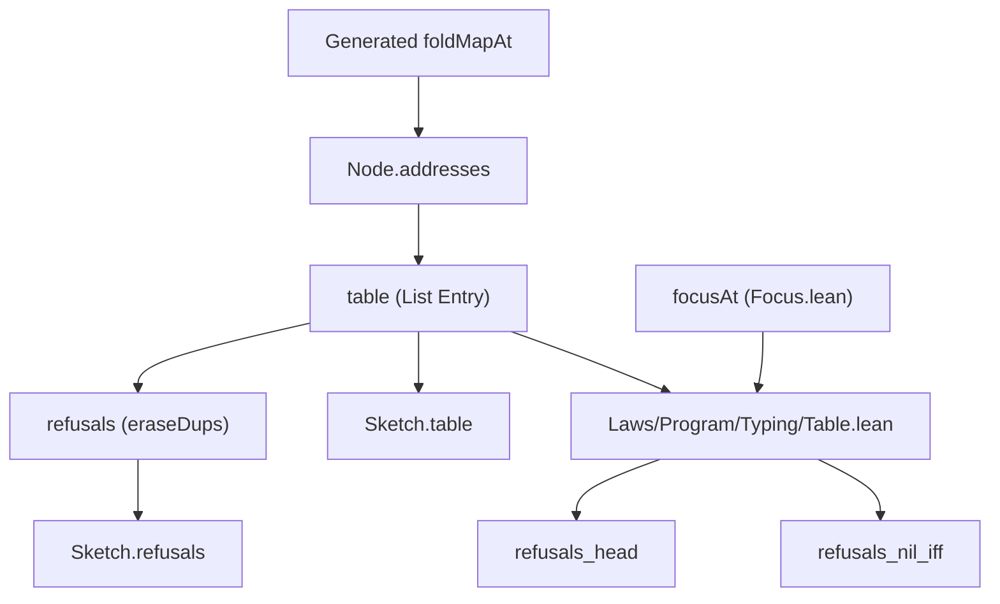

# 2026-10-06 Seat TABLE — Design Note

Status: a research note (history, not authority). It designs Wave 1, Slice 2 (TABLE).
Plan reference: `docs/research/2026-10-06-next-slices-plan.md` §5.2.
Decisions row: proposed row for decisions register.

## 1. Choice for address generation

The plan poses a choice: write `Node.addresses` directly over the generated `foldMapAt_*`
functions, or move `Node.foldList` and `PathYield` from `Effect4.Laws.Program.PathFold` into a
core module.

We choose the direct definition over `foldMapAt_*` (Option A):
- `foldMapAt_*` functions already live in `Effect4.Program.Fold` (`src/Effect4/Program/Fold.lean`),
  which is a core module.
- `Node.addresses` is purely structural node addressing. It requires no general algebra or fold
  abstraction.
- Moving `foldList` into core would complicate the dependency graph between core and laws.
- In `Effect4.Laws.Program.Typing.Table`, `n.addresses = n.foldList addressYield []` holds by
  `cases n <;> rfl`.

## 2. Declarations and types

The module `src/Effect4/Program/Typing/Table.lean` declares:

1. `Node.addresses (n : Node Op) : List (List Nat)`:
   The addresses of a node in generated path fold order.

2. `Table.Entry`:
   A row containing:
   - `path : List Nat`: the node's address.
   - `env : Option NodeEnv`: the typing environment at the address.
   - `result : Option (Except TypeRefusal EffTy)`: the checker's result at program nodes.

3. `table (s : Signature Op) (env0 : TyEnv) (p : Eff Op) : List Entry`:
   The address table of a program.

4. `refusals (s : Signature Op) (env0 : TyEnv) (p : Eff Op) : List TypeRefusal`:
   The distinct located refusals of the program in table order.

5. `Sketch.table (sk : Sketch) (app : SigApp := {}) : List Entry`:
   The address table of a sketch under its hole-extended signature.

6. `Sketch.refusals (sk : Sketch) (app : SigApp := {}) : List TypeRefusal`:
   The distinct refusals of a sketch under its hole-extended signature.

7. `ExtSlot`:
   The five term slots whose typing environment extends their node's environment:
   `catchIfTest`, `iterateTest`, `iterateStep`, `iterateResult`, and `opTerm`.

8. `Node.extSlotEnv (s : Signature Op) (env : TyEnv) (n : Node Op) : ExtSlot → Option TyEnv`:
   Computes the extended environment for each term slot.

## 3. Law declarations

The module `src/Effect4/Laws/Program/Typing/Table.lean` proves:

1. `addresses_eq_foldList`:
   Connects `Node.addresses` to `Node.foldList` via `addressYield`.

2. `mem_addresses_of_at`:
   Proves `(n.at_ a).isSome = true → a ∈ n.addresses`.

3. `table_head`:
   Shows that the root entry of `table s env0 p` is `⟨[], some (.env env0), some (Checker.check s env0 [] p)⟩`.

4. `table_result_refusal_none_of_hasTy`:
   Proves that on a typed program, every entry in `table` has no refusal.

5. `refusals_of_hasTy`:
   Proves that `HasTy s env0 p T → refusals s env0 p = []`.

6. `refusals_head`:
   Proves `(refusals s env0 p).head? = explain s env0 p`.

7. `refusals_nil_iff`:
   Proves `refusals s env0 p = [] ↔ (effTy s env0 p).isSome = true`.

8. `mem_addresses_iff`:
   Placed planned goal: `a ∈ n.addresses ↔ (n.at_ a).isSome = true`.

As instructed by the coordinator in `docs/research/2026-10-06-slice-ORDER-review.md`,
`table_replace_outside` is not stated as an open planned goal. It is proposed for slice PASS.

## 4. Test battery

The battery `Test/Program/TableControls.lean` holds the 15 controls from `address-table-probe`:
- Path ordering on concrete programs.
- Refusals list against `explain`.
- Sibling refusals with `none` environments.
- Edits outside a focus retaining table shapes.
