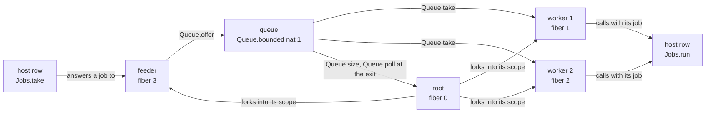

# 2026-10-06 seat WORKQ design: the two-worker crew over the public Queue

Status: a design note (history, not authority). Base: `9018a2aa`. Brief:
`docs/research/2026-10-05-claude-lead/briefs/seat-workq-brief.md`. No file of the slice is
committed yet. The probes ran in the seat's scratch folder, on the base, on the Lean machine.

**The one thing to know first.** Part 1 moves no generated file (reproduced: section 7). The
candidate crew builds, and its program prints as TypeScript and reads back. One script runs it
to the root's exit at the command budget 1000, with no frontier row (tested).

## 1. The program

The first scenario's workers call the host row `Jobs.take`
(`Test/Dogfood/Scenario/Workers.lean`). Here one feeder calls that row, and it offers each job
to a bounded queue. The two workers take from the queue. The job's run stays the host row
`Jobs.run`. So the public Queue stands between the two host rows of p3's consumer
(`Test/Dogfood/P3WorkerQueue.lean`). The host still decides when a job arrives and when it
ends.

The diagram shows the crew's parts and what passes between them. It claims no order of events.



| Part | What it does |
| --- | --- |
| The root | It makes the queue at capacity 1, four cells and the gate. It forks the two workers and the feeder into one scope, with rc.112's `Effect.forkScoped` options, and it awaits the gate. After the scope closes it reads the released connections, the count, the queue's size and one `poll`. |
| A worker | It opens a connection with its identity, and its scope releases it. Then it loops: `Queue.take`, a note of `[job, worker]`, `Jobs.run` under the handler of a `JobFailed` failure, and the count. The job that makes the count `total` completes the gate. |
| The feeder | It opens a connection with the identity 3. Then it loops: `Jobs.take`, and `Queue.offer` of the answered job. |

- **The cells**, in allocation order: the queue's cell, `opened`, `released`, `assigned` and
  `count`.
- **The five public operations stand in one program**: `bounded`, `offer`, `take`, `size` and
  `poll` (`src/Effect4/Modules/Queue/Ops.lean`). No application used them before.
- **The capacity is 1**, so a second fed job makes the feeder's offer wait while a job is
  buffered.
- **The mask is a premise of the program.** Each worker calls `Queue.take` outside every mask,
  and the feeder calls `Queue.offer` outside every mask. A red control takes under
  `uninterruptible`.
- **Each crew member holds a connection.** So the cells `opened` and `released` show which
  members are alive, and the host reads them through its cells reader.

Choices of the seat, each with its reason:

1. **A feeder on the host row, and not a root that offers fixed jobs.** rc.112's p3 offers five
   fixed jobs from its root. Then a script controls only the ends of jobs, and no job arrives
   after a cancellation. With the feeder a script feeds a job at any point.
2. **No stamp on a message.** The host may feed one job number twice. So the clauses compare
   the jobs of the queue and of the workers with the jobs that the host fed, as multisets.
3. **The root polls once at its exit.** A job that is buffered when the pool closes is then in
   the root's answer, and the accounting reads it there.

## 2. One fact of the machine that shapes every script

**A reply application does not drain a posted helper** (tested: the probe's run below). The
Queue delivers each signal by a posted helper (decisions rows 238 and 240). A posted helper is
a detached fork with a deferred start, posted on the signalling fiber's dispatcher. The
session's reply application
runs the fiber that it resumes. It leaves a helper that this fiber posted as posted work.

The exact moves, from the fresh run:

```text
.start                                   the root forks three fibers and parks at the gate
.flush                                   both workers enrol and wait; the feeder calls Jobs.take
.hold feeder
.receive feeder (ok (.nat 1))
.apply feeder                            the offer buffers job 1 and posts worker 1's wake
.flush                                   the helper's task runs: worker 1 takes job 1
```

After `.apply feeder` the machine names work: the runnable fiber 4, the helper, and the armed
owner 3, the feeder. The buffer holds job 1, and both takers are still enrolled. After `.flush`
worker 1 waits on `Jobs.run` with job 1, and one taker is enrolled.

So each scenario script writes a flush after each reply application. A host does the same by
itself: it lets every dispatcher run after each act but the root's start (`performable`,
`harness/truth/session/Keyed.lean`). A script that puts a cancellation between an application
and its flush has no host run. Two named runs do that on purpose (section 6).

## 3. The scripts

Three selectors name the calls: worker 1 and worker 2 by the fibers 1 and 2, and the feeder by
the fiber 3. Four parts build the scripts.

| Part | Moves |
| --- | --- |
| `parked` | `.start`, `.flush`, `.hold feeder` |
| `feed job` | `.receive feeder (ok (.nat job))`, `.apply feeder`, `.flush` |
| `done w` | `.receive w (ok .unit)`, `.apply w`, `.flush` |
| `failed w` | `.receive w (failed "JobFailed" "bad payload")`, `.apply w`, `.flush` |

Two states start most runs. `running`: after `parked`, the host feeds the jobs 1 and 2 and
holds each call. Worker 1 runs job 1, and worker 2 runs job 2: each took its job by a wake.
`blocked`: from `running`, the host feeds the jobs 3 and 4. Job 3 is buffered, and job 4's
offer pends at the full buffer: the feeder waits at no host call.

The record lists each script once, as a named run (section 6). The budgets are the first
scenario's: the command budget 1000 and the compile budget 2000.

## 4. The observation

`Observation`, eleven fields. Every control compares it.

| Field | Content | Source |
| --- | --- | --- |
| `assignment` | each `[job, worker]` of the cell `assigned` | cell 3 |
| `queue` | the queue's cell up to its handles: the capacity, the buffered jobs, each pending offer with its batch flag and its jobs, and the count of waiting takers | cell 0 |
| `fed` | the job of each applied reply on `Jobs.take`, in order | the journal |
| `receipts`, `applications`, `retired` | as in the first scenario, for both host rows | the journal and the session |
| `opened` | the identities of the opened connections | cell 1 |
| `cleanups` | the identities of the released connections | cell 2 |
| `finished` | the count of finished jobs | cell 4 |
| `rootExit` | the root's exit | the machine |
| `workLeft` | runnable fibers, armed owners, live calls, stored replies and timers | the machine and the session |

The queue's cell holds `Deferred` handles: a waiting taker's identity and its hint, and a
pending offer's. The field `queue` leaves out which handle stands where. It has three readings:
the cell is not made yet, the cell has the first profile's shape, or the value is no such cell.

The clauses read five functions of the observation.

| Reading | Meaning |
| --- | --- |
| `held` | the buffered jobs, the jobs of the pending offers, the assigned jobs, and the job that the root's poll took at its exit |
| `live id` | the connection `id` is opened and not released |
| `idle id` | `live id`, and the fiber `id` waits on no host call |
| `funded` | no row of the run's journal stops at a frontier |
| `atRest` | the machine names no runnable fiber and no armed owner |

## 5. The claim and its clauses

`queueWorkers` assembles seven clauses. Three are the driver's laws, proved for every run and
every session (`Test/Dogfood/Scenario.lean`). Four are planned goals of the battery. Each is a
general statement over scripts. Its proof needs the Queue's law of a whole run (decisions row
275, point 2), and this slice does not state that law.

| Clause | Statement | Standing |
| --- | --- | --- |
| `receipt` | `receipt_inert`: a reply receipt moves no machine | proved |
| `selection` | `applied_selects`: a reply application consumes the selected call only | proved |
| `retirement` | `control_retires`: a control retires the held calls whose guard it removed | proved |
| `once` | `held_within_fed`: no job is held more often than the host fed it | planned goal |
| `accounted` | `fed_accounted`: each fed job is held, but for one job of a feeder that is gone | planned goal |
| `settled` | `queue_settled`: at rest the queue's registrations are the crew's waits, and no job is stranded | planned goal |
| `cleanup` | `releases_once`: no connection is released twice | planned goal |

The four planned goals, each with its placement.

**`held_within_fed`.** For every job count, command budget and script: where the run is
`funded`, each job stands in `held` at most as often as in `fed`.

- Concept: `translation-simulation`; property: the Queue's expansion agrees with its clients
  on its commits.
- Question: a consequence of the proposed claim `queue-expansion-agrees` at its first client;
  consumer: the scenario's claim `queueWorkers`.
- Reach: the program `crew`, every script of the driver's alphabet with its raw rows, every
  command budget at the battery's compile budget, under `funded`. Decisions rows 219 to 222,
  226 and 275.
- Does not establish: delivery, the order of deliveries, liveness, fairness, another client. It
  is safety: nothing is duplicated and nothing is invented.
- Unlocks: R10, as the first application of the Queue's expansion.

**`fed_accounted`.** The statement ranges over every job count, command budget and script of
host acts. Where the run is `funded` and `atRest`, the count of `fed` is at most the count of
`held`. It may exceed it by one when the feeder is not `live`.

- Concept: `reactive-scheduling`; property: a commit stays committed, and a withdrawn request
  consumes nothing.
- Question: a consequence of the proposed claim `waiting-request-obligation-preserved` at its
  first client; consumer: `queueWorkers`.
- Reach: the program `crew`, whose callers hold no mask. Scripts of host acts: the root's
  start, a flush, a clock step, a cancellation, a held call, a reply receipt and a reply
  application. Every command budget, under `funded` and `atRest`. Decisions rows 222 and 226.
- Does not establish: that a fed job is ever assigned or finished. With `held_within_fed` it
  gives the exact accounting: `fed` is `held`, but for at most one job of a feeder that is gone.
  That job is the job of a pending offer that an interruption withdrew.
- Unlocks: R12 and R10, as their first application.

**`queue_settled`.** For the same scripts, under `funded` and `atRest`:

1. the queue's cell is unmade, or it has the first profile's shape, at the capacity 1;
2. the count of waiting takers is the count of idle workers;
3. one offer pends when the feeder is idle, and none otherwise;
4. no job is buffered while a taker waits;
5. an offer pends only at a full buffer, and the buffer is within its capacity.

- Concept: `reactive-scheduling`; property: each eligible waiter is retrying or owns a
  notification, and a selected request's notification is discharged.
- Question: a consequence of the proposed claims `wait-registration-no-gap` and
  `waiting-request-obligation-preserved` at their first client; consumer: `queueWorkers`.
- Reach: as `fed_accounted`. Part 1 is the premise of the Queue's attempt laws, read at the
  run's end (`take_attempt`, `src/Effect4/Laws/Modules/Queue/Ops.lean`).
- Does not establish: progress between two states at rest. It is an invariant at rest, and an
  invariant is not progress. It says nothing of fairness or of starvation.
- Unlocks: R12, as the first application of the Queue's run-level law.

**`releases_once`.** For every job count, command budget and script: where the run is
`funded`, the cell `released` holds no identity twice. It is the first scenario's clause on the
new crew: a wait's withdrawal now runs before a scope's release.

- Concept: `scope-lifetime-finalization`; property: at most once for each registration,
  counted by identity.
- Question: R11's whole-run clause on one program; consumer: `queueWorkers`.
- Reach: the program `crew`, every script of the driver's alphabet, under `funded`.
- Does not establish: the order of the releases, that a release runs, the clause for another
  program.
- Unlocks: R11.

A bounded search found no counterexample of the four statements (tested, a finite probe).
It visited every script of 17 host moves up to length 4, from six states. From the fresh run it
visited every script of 18 moves up to length 4, at three job counts. For the two statements
over every script it also visited every script of 28 moves up to length 3, with raw rows. The
battery holds the statements' verdicts on its named runs only. The receipt records the counts.

Associated law: `replays`, with its two controls, as in the first scenario.

**Addendum of the same day: the budget premise, and the search's counts.** The paragraph above
is as the note first stood. Its search judged `funded` by the journal's verdicts: no row with
the verdict frontier. That reading is too weak. A reply application has the verdict `applied` as
soon as its call's guard is gone, whatever fuel its step had left (`applyReply`,
`src/Effect4/Api/HostSession.lean`). So a journal with no frontier verdict can hold a cut. The
coordinator accepted the correction the same day.

- `funded` is now the tape's reading (`Test/Dogfood/Scenario.lean`): the tape of the run's own
  journal, read from its fresh open, leaves no row unread. `funded_replays` ties it to
  `tape_replays` (proved).
- The search ran again with that reading (tested, a finite probe). Its script and its output are
  filed in `docs/research/2026-10-06-seat-workq-evidence/`, and the receipt gives the counts.
  It found no counterexample of the four statements.
- The same search read cut runs, at four small budgets. It found cut runs at rest, and no goal's
  observation fails on one. Where a goal's observation fails on a cut run, the run is not at
  rest. The reason: a fiber that a budget cuts stays runnable with no task.
- **A second correction, with the receipt's sweep.** The last sentence gives one kind of cut
  run. A sweep read the battery's 22 scripts on the crew at each command budget from 1 to 160
  (tested, a finite probe). It finds a second kind. At the command budgets 79 to 81 a budget
  cuts the pool's close after its three releases. No fiber is then runnable, and the root has
  no exit: the run is at rest, and nothing will run it. The battery pins one such run,
  `dropped`. No goal's observation fails on a cut run at rest of either kind.

## 6. The named runs and the controls

Each clause and each law has a green control and at least one red control. A fault is a
variant of the crew: the same program with one changed part. Six faults change the Queue's
part of `take` or of `offer`, through the variants of `Test/Program/QueueTraces.lean` where one
fits.

| Clause | Green control | Red control |
| --- | --- | --- |
| `receipt` | two reply receipts of two jobs' replies store two replies and move no machine | a duplicate reply is refused |
| `selection` | the reply application at worker 2's key advances worker 2 alone | from `blocked`, the two orders of the applications give the jobs 3 and 4 to different workers; an application with no stored reply is refused; a forged reply under another key is refused |
| `retirement` | a worker that is cancelled while it runs its job: its call is retired alone | the root's cancellation retires every held call |
| `once` | the whole run to the root's exit, with a failed job that still counts | a take that leaves its job in the buffer gives one job twice |
| `accounted` | a worker cancelled after its take commits: its job stays assigned. The feeder cancelled before its offer is accepted: one job is dropped, and no other. The feeder cancelled after the acceptance, before the answer: the job stays buffered | a worker that takes under `uninterruptible` and is cancelled while it waits: it takes the next job and exits before its note. A withdrawal that takes a buffered job back |
| `settled` | a worker cancelled before its take commits: its request is withdrawn, and the next job goes to the other worker. A worker cancelled after its selection, before the delivery: the signal passes on | a take with no withdrawal leaves a taker with no worker. A withdrawal that posts nothing strands a job. An offer with no withdrawal leaves an offer with no feeder. A budget that cuts the delivery |
| `cleanup` | each connection is released once when the pool closes, after a cancellation too | a crew that registers each release twice |
| `journal` | the journal alone reaches the whole run again | a journal with one row dropped reaches another run |

Two more controls state the premises and a limit.

- **The budget.** Each named run on the crew is `funded` at the battery's budget. A red control
  cuts a delivery with a small command budget: the measured budget stands in the battery.
- **The handles.** Two runs enrol the two workers in the two orders. Their queue cells differ
  only by which handle stands where, so their `queue` fields are equal. The assignment after
  one fed job tells them apart: the first enrolled worker takes it.

A named run has a host run where a host can perform its script. Three kinds of run have none.
The first holds a forged reply. The second cancels a fiber that made no call. The third puts a
cancellation between an application and its flush.

## 7. Part 1: the two helpers, and what they move

**The note.** `note log x` moves to `Test/Dogfood/Scenario.lean`, written through
`Ref.updateWith`: the name of the cell's value is minted. The collision control is Codex's. An
outer `xs` holds `[7, 8]`, the log holds `[100]`, and the entry is the length of `xs`. The
minted helper answers `[100, 2]`, and the fixed binder answers `[100, 1]` (tested).

**The typed empty cell.** `ascribe` moves to `src/Effect4/Program/Authoring/Ascribe.lean`, with
its record form unchanged. Its laws are in the law graph, each at `[propext, Quot.sound]` or
below (proved):

| Law | File | Statement |
| --- | --- | --- |
| `types_ascribe` | `src/Effect4/Laws/Modules/Ascribe.lean` | the form has its declared type under each literal flag, where its term's type is below it |
| `ascribe_untyped` | the same file | the form has no type where its term's type is not below the declared type |
| `reads_ascribe` | the same file | the form reads what its term reads |
| `ascribe_scoped` | `src/Effect4/Laws/Program/Authoring/Ascribe.lean` | the form is scoped where its term is |

The brief asks for the first and the third. The second states that the form is no cast. The
fourth is the scope lemma that `authoring_scoped` looks for at each builder.

**The generated files that part 1 moves: none** (reproduced). The measure compared two outputs
of Lean before and after the change, with the change in the working tree and not committed.

| Output | How it was compared | Result |
| --- | --- | --- |
| The engine's fixtures `workers.txt`, `routing.txt`, `atomic.txt` and `timeout.txt` | the writer `ocaml/engine/test/scenarios/write.lean`, run into the scratch folder, against the committed files | four files, byte for byte the same |
| The keyed lane's scenario fixtures: the printed module, the table, the calls, the acts and the observation of each of 47 host runs | `harness/truth/session/Keyed.lean scenarios`, before and after | one file, byte for byte the same |

The reason is the scope reader's: a name is read only through its level. So a minted binder and
a fixed binder elaborate one tree where no name collides, and no entry of a battery reads `xs`.

## 8. Part 3: the runs on the OCaml engine and on the printed TypeScript module

- **Faces.** `Test/Dogfood/Scenario/Faces.lean` gains the crew: it prints and reads back.
- **The engine.** `Test/Dogfood/Scenario/Tape.lean` takes named runs of the record into a new
  fixture, `ocaml/engine/test/scenarios/queue-workers.txt`. The engine's test reads every
  fixture of its folder, so no OCaml file changes.
- **The host.** `harness/truth/session/Keyed.lean` gains the scenario's wire, and
  `keyed-observation.ts` its entry. Each field has a host source: the host itself, or the cells
  reader. The plan is that no field waits.
- **A handle's image.** The cells reader reads the queue's cell, which holds `Deferred`
  handles. `valueJson` (`harness/truth/session/keyed-recorder.ts`) gains one case: a `Deferred`
  is `{"handle": "deferred"}`. The Lean face writes the same image for the field `queue`, by a
  writer of its own beside `valJson` in `Keyed.lean`. So the lane compares the queue's cell up
  to its handles. It does not compare which handle stands where.

## 9. What this does not establish

- No law of the Queue's whole run. The four planned goals state what the crew needs from it.
- No fairness, no starvation freedom and no liveness.
- No agreement with rc.112 beyond the named runs that a host performs: each is one finite host
  run.
- Each control is a finite probe: one script on the Lean machine.
