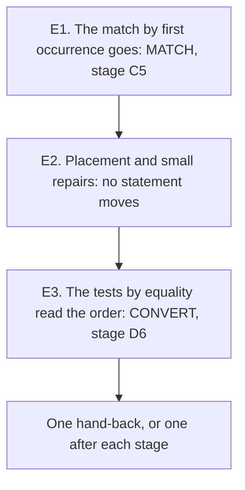

# 2026-10-07 the brief of chunk 3: the close of MATCH and CONVERT

Status: a research note (history, not authority). It rules nothing. The coordinator wrote it for
the second model, at the owner's request: prepare the next slice. Base: the commit that enters
decisions rows 303 to 305.

Chunk 2 is landed (`docs/research/2026-10-07-chunk-2-landing-review.md`). It left three stages
open, and this chunk closes them. It is smaller than chunk 2 by design. The typed print of the
TypeScript printer comes after it, with its own brief.

## 1. The chunk

| Stage | What it is | It rebuilds | It changes what the checker types |
| --- | --- | --- | --- |
| E1 | The old match and its laws go, and each reader moves | the tree, once | no |
| E2 | Placement tags, docstrings and three small repairs | the law graph | no |
| E3 | A probe with tsgo 7, then eleven tests by equality read `Ty.sub` | the tree, once | yes: each test widens |

## 2. Read first

- `AGENTS.md`, in full.
- The three reviews of chunk 2, in this order:
  `docs/research/2026-10-07-chunk-2-review-A-B.md`,
  `docs/research/2026-10-07-chunk-2-review-C-D.md` and
  `docs/research/2026-10-07-chunk-2-landing-review.md`. The landing changed files of every step:
  read each file again from disk.
- Decisions rows 303 to 305 (`docs/core/decisions.md`).
- For E3: `docs/research/2026-10-06-chunk-2-brief.md`, section 7, and decisions row 285.

## 3. The rules of the chunk

**Where you work.** The main checkout, on the branch that the owner names.

- **Commit each stage**: `git add <paths>`, then `git commit -F <file>`. A note under
  `docs/research` needs `git add -f`, in its own call. Never push, and never run `git add -A`.
- **If you cannot commit, stop after each stage** and hand back. Say first that you could not,
  and why. Do not start the next stage on uncommitted work.
- Before each stage, list the newest notes: `ls -lt docs/research | head`. Read each note of
  the coordinator that is newer than your last stage.

**How you build.** As in chunk 2.

- Run every Lean, Lake and `make` command through `scratch/lean-slot.sh`. Run one `lake` at a
  time.
- Write `-o ts/eff/node_modules -o harness/truth/node_modules` on every `make` call.
- Install nothing. Run tsgo by its path under `ts/eff/node_modules/.bin`.
- Stop below 4 GiB of free disk.

**What every stage owes.** The ten rules of the chunk-2 brief, section 3, stand. Seven more
come from its landing.

1. **A receipt is taken from the tree.** A statement is the output of `#check`. A count is
   the output of `wc -l` or `grep -c`. "Removed" means that `grep` finds nothing, and the
   receipt gives the command.
2. **A changed guard of a battery stands first in the hand-back**: the old line, the new line
   and the reason. It holds for every file under `Test/`, and first for a `*Contract.lean`
   battery. Where the line records what tsgo does, run tsgo again.
3. **A widening is listed by program.** For each newly typed program give the program, its
   type, the control that holds it, and tsgo's verdict on its printed form.
4. **A verdict of the compiler is a line that a gate runs**: a line of a file under
   `harness/truth/` that `make check-truth` type-checks. A comment records nothing.
5. **When a guard turns, its text turns with it**: its comment, its section head and the list
   at the head of the file. Write what the line shows now, and no word of what it showed before.
6. **After a change of a checker rule or of the prelude, run `make check-truth` and
   `make check-target`.** Search each `@ts-expect-error` line that names what you changed:
   `grep -rn '@ts-expect-error' tools/target harness/truth ts/eff/test`. Chunk 2 ran neither
   gate, and two red lines of the target lane were green.
7. **`lake build Test` runs the axiom gate, and a narrow build of a battery does not.** The gate
   stops at its first finding. A `match` inside a `#guard` is a declaration of the battery. At a
   type that holds JSON or rendered text the gate refuses it: ask a function of the library.

**Files that are the coordinator's**: as in the chunk-2 brief. Propose each change of the
semantics registry, the decisions register and the authority documents in the receipt.

**Where to stop**: the six stop rules of the chunk-2 brief. Rule 4 is the one that chunk 2
missed. A stage that types a program outside its list stops the chunk.

## 4. Stage E1: the match by first occurrence goes

The checker calls the match by bounds at each of its three sites. The old match stands with
its laws, and nothing but its own laws and five readers name it.

- **What goes.** `Ty.infer`, `Ty.inferFields`, `Ty.inferItems`, `Ty.matchTemplate` and
  `Ty.matchTemplateArgs` (`src/Effect4/Program/Ty.lean`), with every law that names one.
- **Where it is named**, measured at the base. The command is
  `grep -c -E 'matchTemplate|\binfer\b|inferFields|inferItems' <file>`.

  | File under `src/Effect4/Laws/Program/` | Lines |
  | --- | --- |
  | `Template.lean` | 79 |
  | `Bounds.lean` | 19 |
  | `Typing/Closed.lean` | 11 |
  | `TypeAlgebra.lean` | 9 |
  | `Typed.lean` | 6 |
  | `Typed/Membership.lean` | 5 |

- **Six more files name it**: the two contract batteries, the two comments below, the case
  policy (`tools/Conform/Effect4/cases-policy.json`) and the semantics registry. No core module
  outside `Program/Ty.lean` calls it, and no tool does.
- **The two conservative laws go with it**: `matchB_conservative` and
  `matchArgsB_conservative`, with the helpers that only they read (`infer_cands`,
  `matchArgs_cands`). File both statements in the receipt first, as `#check` prints them.
- **Keep what the match by bounds reads.** `Ty.instantiate`, `Ty.Subst`, `Widens` where a law
  of `bindTerm` reads it, `instance_members`, `normalize_instantiate_congr`, and each lemma of
  the anchored section that a proof of `Laws/Program/Bounds.lean` names. The compiler tells
  you: delete, build, and restore only what a kept proof needs.
- **Five readers move, each to a law of the match by bounds.**
  - `Fits.instantiate` (`Laws/Program/Typed.lean`): `Fits.instantiateB` took its place.
  - `FitsAll.instantiate` (`Laws/Program/Typed/Membership.lean`): `FitsAll.instantiateB` did.
  - `closedSubst_infer`, `closedSubst_matchTemplate` and `closedSubst_matchTemplateArgs`
    (`Laws/Program/Typing/Closed.lean`): `closedSubst_matchArgsB` took their place.
- **Two contract batteries name the old match.** `Test/Program/FormationContract.lean` has six
  guards on `Ty.infer`, and `Test/Program/TypeAlgebraContract.lean` has five on
  `Ty.matchTemplate`. State each control again at `Bounds.cands` or `Bounds.matchB`. Some
  answers turn: the match by bounds answers where T4's controls recorded a refusal. Each
  turned line is a finding of rule 2: list it.
- **Two docstrings describe the old match in words**: the section "Templates" of
  `Laws/Program/Typing/TermIntro.lean`, and `rowTy_fits` in
  `Laws/Program/Typed/Denotation.lean`. Read both again after the removal.
- **Two comments name a compiled helper of `Ty.infer`** (`Ty.infer._sparseCasesOn_13`):
  `src/Effect4/Laws/Auto/Traversals.lean` and `Test/Audit/TraversalCensus.lean`. The helper's
  name moves when `Ty.infer` goes. Build first, then write the name that the census prints.
- **The case policy**: the rows of `Ty.infer` and its siblings go. Run the audit with
  `--seed-policy`, and edit the notes as text.
- **Proposals for the receipt**: the removal of the registry claim `template-match-anchored`;
  the bullet of `docs/core/semantics.md`; the row of `Ty.infer` in
  `docs/core/traversal-census.md`.
- **Acceptance.**
  - `grep -rn "matchTemplate\|Ty\.infer\b\|inferFields\|inferItems" src Test tools` finds
    no declaration and no use. Give the command's output.
  - `lake build Test` is green, and the pin of the goal gate stays at 12.
  - `make check-cases` is green.
  - The differential of the two corpora is byte for byte the one of the base. No type moves:
    no rule of the checker changes in this stage.
- **It adds no theorem.** The receipt lists each removed statement.

## 5. Stage E2: placement and three small repairs

No statement of a law changes its meaning in this stage.

1. **The helpers of `Laws/Program/Bounds.lean` carry no placement.** Fourteen theorems have
   their tag. Give each other theorem its tag and one docstring sentence. The sentence names
   the law that it is a step of, and its consumer. A helper with no consumer goes.
2. **Premises with the default proof `by decide`.** Chunk 2 added eleven, on eight laws:
   four of `Laws/Program/Typing/TermIntro.lean`, three of `Laws/Modules/Checking.lean` and one
   of `Laws/Modules/Queue/Typing.lean`. The command is
   `grep -rn -E ':= by decide\)' src/Effect4/Laws`. Keep the default where every caller stands
   at a closed type. State the premise with no default elsewhere, and pass the proof at the
   call.
3. **`lookup_append_left`** (`Laws/Program/Template.lean`) is a fact of lists, with one call.
   The library has `List.lookup_append`, and two proofs of the tree use it. Use it at that
   call, and cut the lemma.
4. **`nativeAtomTy_ite_above`, `nativeAtomTy_ite_self` and `nativeAtomTy_ite_below`** are
   corollaries of `nativeAtomTy_ite`. Keep each that has a reader. Say in its docstring that
   it is a corollary.

## 6. Stage E3: the tests by equality read the order

It is stage D6 of chunk 2 (`docs/research/2026-10-06-chunk-2-brief.md`, section 7). It is the
one stage of this chunk that changes what the checker types.

**The family has eleven tests, and the plan named eight.** The coordinator listed them from the
source on 2026-10-07. Each compares the type of a term with one fixed type, by equality.

| # | The test | Where | The fixed type | In the plan |
| --- | --- | --- | --- | --- |
| 1 | the test of `catchIf` | `Checker.check` | `.bool` | yes |
| 2 | the test of `iterate` | `Checker.check` | `.bool` | yes |
| 3 | the test of the statement `ifElse` | `Checker.check` | `.bool` | yes |
| 4 | `Decision.arms` at a Boolean | `src/Effect4/Program/Decision.lean` | `.bool` | yes |
| 5 | the saved term of `restore` | `Checker.check` | `Ty.maskRestore` | yes |
| 6 | the scope of `forkIn` | `Checker.check` | `Ty.scope` | yes |
| 7 | the scope of `runIn` | `Checker.check` | `Ty.scope` | no |
| 8 | the scope of `closeScope` | `Checker.check` | `Ty.scope` | no |
| 9 | the context of `setContext` | `Checker.check` | `Ty.context` | yes |
| 10 | the interruptor of `interruptAll` | `Checker.check` | `.nat` | yes |
| 11 | the interruptor of the cause term `interrupt` | `causeTy`, `src/Effect4/Program/Typing/Rules.lean` | `.nat` | no |

- `Checker.check` is in `src/Effect4/Program/Checker.lean`. This command lists its tests:
  `grep -n -E 'if .* = (\.|Ty\.)[A-Za-z]+( |$)' src/Effect4/Program/Checker.lean`.
- The line `r.error.normalize = .never` in that output is a test of emptiness. It stays.
- `HasTy` states nine of the tests as a premise `termTy sig env term = some T`
  (`src/Effect4/Laws/Program/Typing/HasTy.lean`): the constructors `catchIf`, `iterate`,
  `restore`, `ifElse`, `forkIn`, `runIn`, `interruptAll_by`, `setContext` and `closeScope`.
- **The stage covers all eleven**: one rule for one kind of test. Tests 7, 8 and 11 are the
  plan's omission, and the coordinator reported them to the owner. Read the newest notes before
  this stage. If the owner says no, a note of the coordinator takes the three out again.
- **Two rules read the order at a fixed type already**: `monoApply`
  (`src/Effect4/Program/NativeAtom.lean`) and the rule of `awaitNewChildren`. The second is the
  form to follow, in the checker and in `HasTy`: a premise `termTy sig env term = some t`, then
  `Ty.sub t.normalize T = true`.

**The probe comes first, and it is handed back as a note** before a rule changes:
`docs/research/<date>-tests-by-order-probe.md`, with an evidence folder.

- **Say first what is below each fixed type**, from the definition of `Ty.sub`. The
  coordinator's reading, which you check: the normal forms below `.bool`, `.nat` and a handle
  type are `never` and the type itself. If that holds, a converted test newly types two kinds
  of term. One is a term at `never`. The other is a term at a raw union whose normal form is
  one of the two.
- Print each of the eleven tests at `never`, and at one union member under a raw union. Run
  tsgo 7 on each form. A row holds the test, the two printed forms, tsgo's verdict and the file.
- Say for each form how a program reaches it. Name a term that has the type `never`, or a raw
  union, at that position. A form that no program reaches is listed as such.
- **A test whose form tsgo refuses is not converted.** Say so first in the receipt.

**Then the code**, one test for each commit where you can commit.

- The checker's line and the premise of `HasTy` change together. Give the statement lists.
- **`hasTy_extSlotEnv` keeps its statement.** It reads the Boolean test of `catchIf` and of
  `iterate`. Repair its proof.
- **The refusal keeps its reason.** A test that fails throws the reason that it throws today
  (`predicateNotBool`, `maskRestoreExpected`, `scopeExpected`, `contextExpected`,
  `natExpected`).
- **Each converted test gets two green controls and one red control.** The green ones are the
  form at `never` and the form at one union member under a raw union. The red one is a type
  that is not below `T`.
- **Each converted test gets its compiler lines** (rule 4): one green line and one red line in
  a file of `harness/truth/` that `make check-truth` type-checks.
- **The differential** of the two corpora runs before and after. A program that was typed and
  is refused is stop rule 2.
- **The list of newly typed programs** is the first part of the hand-back (rule 3). The
  coordinator reports it to the owner.

## 7. The hand-back

One for the chunk where each stage is a commit, or one after each stage. The message holds, in
this order:

1. the one thing that the coordinator must know before the landing;
2. each changed line of a contract battery, and each newly typed program;
3. for each stage: its commit or its files, and its three statement lists from the tree;
4. the exact commands and their results;
5. the open obligations, and the proposals for the coordinator's files.

## 8. After this chunk

| Chunk | Slices | Entry |
| --- | --- | --- |
| 4 | PRINT, steps 2 to 5 | the coordinator's design note of the typed print; the probe's note |
| 5 | UNGUARD; COLUMN | PRINT is landed, and the owner has heard each widening |
| Later | PASS, CLASSES, GAPLEAF | each has its entry condition (the plan, 5.9 to 5.11) |

## 9. What this does not establish

- No theorem of the tree. The stages are a plan of work.
- That each of the eight tests has a printed form that tsgo accepts. The probe of E3 answers it.
- That stage E1 leaves every contract line as it is. Some answers turn, and the receipt lists
  each.
