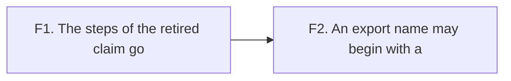

# 2026-10-07 the brief of chunk 3b: what the retired claim left, and the rule on export names

Status: a research note (history, not authority). It is a hand-over for the implementer. It
rules nothing. Chunk 3 is landed at `58ad3dcb` (decisions row 306), and
`docs/research/2026-10-07-chunk-3-landing-review.md` is its review. Read that review first.

## 1. The chunk

Two small stages, each a commit. Neither changes what the checker types. Chunk 4 is the typed
print of the TypeScript printer, and it waits for the coordinator's design note.

**Base**: the branch `refactor/phase1-phase3` at `25728909`. Work on a new branch `chunk-3b`
in the main checkout.

## 2. The rules

The rules of `docs/research/2026-10-07-chunk-3-brief.md`, section 3, stand. Two more come from
the landing of chunk 3.

1. **When a theorem goes, search for its name**: in `tools/Tools/SemanticsRegistry.lean`, under
   `docs/core` and in `docs/STATE.md`. A pointer of the semantics registry is a name literal,
   and the build does not see it. List each hit in the hand-back. The files are the
   coordinator's: do not edit them.
2. **After a change of a checker rule or of the printer, run `make corpus`** and read
   `git diff generated/corpus-index.tsv`. The corpus check compares verdicts, and it does not
   see an address. Chunk 3 moved the address of g85, and its receipt reported no moved row.

If `git add` is refused, stop after the stage and hand back, as in chunk 3.

## 3. Stage F1: the steps of the retired claim go

Stage E1 removed `Ty.matchTemplate_complete_anchored`. The landing retired its registry claim,
`template-match-anchored`. Its steps stand, and some have no caller.

**The measure.** The coordinator listed the callers of each declaration of two modules, from
the environment: `docs/research/2026-10-07-chunk-3b-callers/Callers.lean.txt`, with its output
beside it. Run it again with `scratch/lean-slot.sh lake env lean <file>`. Of 114 declarations,
42 have no caller chain from another module.

**What goes.** A declaration goes when both hold: the measure gives it no caller chain from
another module, and it served the retired claim alone. The coordinator reads the list so:

- in `src/Effect4/Laws/Program/Template.lean`: `anchored`, `anchoredFrom_append`,
  `anchoredFrom_unflagged`, `anchorsArgs_inv`, `childOcc_of_ne_var`, `bottomFree`,
  `bottomFreeAlg`, `bottomFree_record`, `bottomFree_tuple`, `bottomFree_app`,
  `bottomFree_args`, `UnderInstance`, `underInstance_self`, `underInstance_union`,
  `underInstance_args`, `members_of_mem_factors` and `varsOf_of_lookup`;
- the seven guards of that file that read `anchored` or `bottomFree`;
- three guards of `Test/Program/TypeAlgebraContract.lean` that read them. Keep the other half
  of each line where it has one.

Check each name against the measure before you cut it. `anchoredFrom` and
`paramOccurrences` are not in the list of 42: they have a caller, and they stay.

**What stays, with a new sentence.** A step that has a caller keeps its theorem. Its docstring
names `template-match-anchored` today. Write the claim that it serves now, and the caller that
reads it. Fifteen docstrings and one section head of the two files name the retired claim.

**What is not this stage.** The list of 42 holds other declarations with no caller: laws that
are an end of their own (`sub_sound`, `checkRow_request_iff`), and eleven lemmas of
`src/Effect4/Data/Constructive.lean`. List them in the hand-back with one line each. Cut none.

**The stage owes**: the build of `Test`, the measure run again, and `grep -rn
'template-match-anchored' src Test` with no hit.

## 4. Stage F2: an export name may begin with `a`

**The defect.** The module printer refuses every export name whose first byte is `a`
(`exportNameSafe`, `src/Effect4/Codegen/PrintLeaf.lean`). The reason is that a printed binder
is `a0`, `a1` and so on (`Var.name`). So the programs `add` and `all` of the to-do application
have no module under their own name (`Test/Dogfood/Scenario/Todo.lean`).

**The repair.** Refuse the names that a binder can have, and no other: the byte `a` and then
decimal digits alone. `rowNamesSafe` holds the same test of the first byte for a row's
spelling and its trailing names. Give all three one predicate.

**The probe comes first**, as a note `docs/research/<date>-export-name-probe.md`.

- The reader's laws use the first byte at two places of
  `src/Effect4/Laws/Codegen/ReadLeaf.lean`, through `Var.name_ne`. The new premise must give
  the same fact: a safe name is no `Var.name i`.
- That fact is about the digits of `toString i`. Find the law of the pinned Lean that gives
  it, and name it in the note. A predicate that reads the name back as a number may need a
  round trip of `toString` instead: say which form has a law.
- The axiom gate holds each proof to `[propext, Quot.sound]`. A proof that walks a `String`
  can reach `Classical.choice`. Say in the note what `#print axioms` gives for the new lemma.

**Stop rule.** If no form has a proof within the gate, hand back the note and change no rule.
The defect then stays, with its reason in the note.

**The stage owes**:

- one green control for `add` and `all`, and one red control for `a0` and `a12`
  (`Test/Codegen/PrintContract.lean`);
- the guard of `Test/Dogfood/Scenario/Todo.lean` that prints each program under its own name;
- `make corpus`, `make check-truth` and `make check-target`, with the diff of the corpus
  index.

## 5. The hand-back

As in chunk 3, in this order:

1. the one thing to know first;
2. each changed guard of a battery;
3. each stage with its commit and its statements from the tree;
4. the commands with their results;
5. the proposals for the coordinator's files.

## What this does not establish

- That each of the 17 names of stage F1 is dead. The measure reads callers in proofs. It does
  not see a use by an attribute.
- That stage F2 has a proof within the axiom gate. Its probe answers that.
