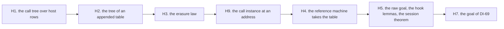

# 2026-10-07 the brief of chunk H: the host meaning, the fast path

Status: a research note (history, not authority). It is a hand-over for the implementer. It
rules nothing. The owner ratified the design on 2026-10-07 (decisions row 310; DI-57 and DI-69
in `docs/DESIGN-ISSUES.md`). The design, the compiled drafts and the slices are in
`docs/research/2026-10-07-packet-host-meaning.md`. Read that packet first, and then
`docs/research/2026-10-07-host-meaning-probe.md`.

## 1. The chunk

Seven stages, each a commit. They are the packet's slices H1, H2, H3, H9, H4, H5 and H7, in
that order. Each stage is a translation: its text compiles in scratch, and the coordinator ran
each scratch file again.

**Base**: the head of the branch that holds chunk S. Work on a new branch `chunk-H`.

**Not in this chunk**: the proofs of the two goals (the packet's slices H6 and H8) and the
address in the registration (H10). The coordinator rehearses the first proof on the branch
`probe/h6`, and it briefs that slice with its scripts.

## 2. The rules

The rules of `docs/research/2026-10-07-chunk-T-brief.md`, section 2, hold. One rule replaces
the lists of gates of the earlier briefs.

**Gates by reach** (decisions row 310, point 10). This chunk adds law modules and batteries,
and one core file. So:

- each stage owes the build of the modules that it adds or edits: `lake build <Module>`;
- stage H4 owes `lake build Effect4.Laws.Program.RuntimeR`. The coordinator measured it: 47
  seconds, and no proof edit;
- stage H9 owes `make check-cases`. Its core file has one match on a program;
- the chunk owes one `lake build Test` at its end, for the axiom gate and the goal gate;
- no stage runs a corpus lane, a lane of the truth harness, a TypeScript compiler or `dune`.
  The chunk reaches none of them.

## 3. What the coordinator settles

- **The fragment admits `catchIf`** (the owner, row 310). Stages H1, H2, H3 and H7 land the
  wider form. Its full texts are the files of
  `docs/research/2026-10-07-packet-host-meaning-drafts/`: `W10_DenoteRows`, `W13_Erasure`,
  `W14_Append`, and the batteries `W16_Sweep` and `W_B4_SessionMeaning`. The packet's appendix K
  holds the same change as diffs of appendices A, B and C.
- **The import lines** stand where the packet proposes them (its section 5, the table of the
  import lines).
- **Each planned goal carries its placement**:
  `@[semantics "translation-simulation" (requirement := R6)] proof_goal …`. They are the first
  planned goals under `src/Effect4/Laws`.
- **The pin of the goal gate** (`restingPin`, `Test/Audit/AxiomGate.lean`) moves from 12 to 13
  in stage H5. Move it at its anchor, and say so in the hand-back.
- **The semantics registry, the decisions register and the authority documents are the
  coordinator's.** The packet lists each edit by slice (its section 5). Propose nothing more.
- **The word PROBE leaves each docstring** of the reference-machine patch (the packet's
  appendix E).

## 4. Where to stop

The packet's stop rules 1, 5, 6 and 7 hold (its section 6.2).

- Stop stage H4 if a file outside its three needs a proof edit.
- Stop a stage whose guard fails. A failed guard is a finding, and it goes first.
- State no goal whose finite test is not in its battery.
- Edit no file under `src/Effect4/Program/` or `src/Effect4/Machine/`. Stage H9 adds one new
  file there.

## 5. The hand-back

One for the chunk, in the order of the chunk-3b brief, section 5. Put first each declaration
that differs from its draft, with the reason.

## What this does not establish

- That either goal is proved. The chunk states two goals, and it proves one theorem from one
  of them.
- That the drafts fit their target files without a change. They compiled as scratch files.
- That `make check-cases` accepts the match of stage H9 with no new row.
