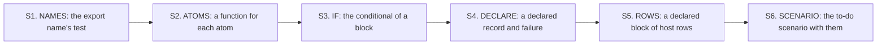

# 2026-10-07 the brief of chunk S: the authoring sugar

Status: a research note (history, not authority). It is a hand-over for the implementer. It
rules nothing. The design, the compiled prototypes and the slices are in
`docs/research/2026-10-07-packet-authoring-sugar.md`. Read that packet first. This brief says
which slices, in which order, and what the coordinator adds. It follows chunk T
(`docs/research/2026-10-07-chunk-T-brief.md`), and the rules of that brief, section 2, hold
here.

## 1. The chunk

Six stages, each a commit. They are the packet's slices 1 to 6. Each program of the to-do
application keeps its tree, so no guard of an existing battery changes.

**Base**: the head of the branch `chunk-T`. Work on a new branch `chunk-S`.

## 2. What the coordinator settles

- **Stage S1 is the open stage F2 of chunk 3b.** Its text is
  `docs/research/2026-10-07-chunk-3b-F2-correction.md`, with the draft beside it. The theorem
  `binderNamed_iff` does not land: it has no consumer.
- **The commands keep the prototype's names**: `eff_record`, `eff_failure` and `eff_rows`.
- **The atoms' functions stand in `Authoring.Atom`**, as the packet's section 3.1 gives it. The
  seven hand functions of `Authoring/Maps.lean` and `Authoring/Tuples.lean` stay.
- **`docs/GENERATED.md` is the coordinator's.** Propose its new row in the hand-back. The
  Makefile's `DERIVED_OUT` and `tools/Effect4Gen/manifest.json` are yours to edit in stage S2.
- **Stage S6 rewrites sections 1 and 2 of `Test/Dogfood/Scenario/Todo.lean`**, as the
  packet's section 3.7 gives them. Chunk T's file `Test/Dogfood/Scenario/TodoPaged.lean` reads
  names of those sections. Rename its references, and change nothing else in it.

## 3. The stages

| Stage | The packet | Owes |
| --- | --- | --- |
| S1 | the correction note; appendix A.6 | its controls in `Test/Codegen/PrintContract.lean`; `make corpus` with the diff of the corpus index; `make check-truth`; `make check-target` |
| S2 | section 4.3, appendix A.1 | `python3 scripts/generate.py --only` for the new group, with its output committed; one reader and one control |
| S3 | section 4.4, appendix A.2 | two lines in `Test/Program/AuthoringContract.lean`; the two guards of `conditionalBranchProg` stay green |
| S4 | section 4.5, appendix A.3 | `Test/Program/AuthoringDeclare.lean` with its import in `Test/All.lean`; the control of a binder named `message` |
| S5 | section 4.6, appendix A.4 | the lines of the declared rows in the same battery |
| S6 | section 4.7, appendix A.5 | the build of `Test`, which runs the axiom gate; `git diff` shows no changed guard in either scenario file |

- **Stage S4 is the one with an open form.** The prototype is a plain scratch file. The landed
  file is a module file, and its macro code stands in a `public meta section`, as in
  `src/Effect4/Program/Authoring/Sugar.lean`. If that form does not compile within the gate,
  stop and hand back what the compiler says.
- **A generated file is never edited by hand.** Stage S2 changes the tool, and the generator
  writes the two files.

## 4. Where to stop

The packet's four stop rules hold (its section 5.2). Stop too if a guard of an existing
battery changes in any stage.

## 5. The hand-back

One for both chunks, in the order of the chunk-3b brief, section 5. Put first each declaration
that differs from the prototype, with the reason.

## What this does not establish

- That tsgo refuses an export named like an atom. The conflict is a reading of the lane's
  import list.
- That the two commands compile as a module file. Stage S4 answers it.
- No theorem of the tree. The chunk adds authoring forms that expand to today's trees.
