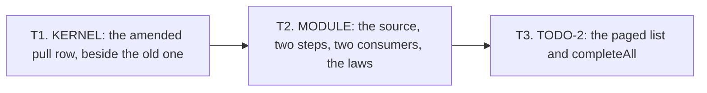

# 2026-10-07 the brief of chunk T: the first profile of streams

Status: a research note (history, not authority). It is a hand-over for the implementer. It
rules nothing. The owner ratified the design on 2026-10-07 (decisions row 309, points 7 and 8).
The design, the compiled drafts and the slices are in
`docs/research/2026-10-07-packet-streams.md`. Read that packet first. This brief says which
slices, in which order, and what the coordinator adds.

## 1. The chunk

Three stages, each a commit. They are the packet's slices 1 to 3. The chunk adds no
constructor, no atom, no decision and no cell. It changes no rule of the checker.

**Base**: the branch `refactor/phase1-phase3`. Work on a new branch `chunk-T` in the main
checkout. Chunk S follows it (`docs/research/2026-10-07-chunk-S-brief.md`).

**Not in this chunk**: the packet's slices 4 to 8. The record and its planned goals wait for
the form of a program's claims, which the owner agrees first.

## 2. The rules

The rules of `docs/research/2026-10-07-chunk-3-brief.md`, section 3, stand, with the two of
`docs/research/2026-10-07-chunk-3b-brief.md`, section 2. Three more hold for this hand-over.

1. **The draft is the text.** Each stage lands the declarations of the packet's appendix A, in
   the file that the appendix names. The coordinator ran the drafts on the landed tree:
   `S1Stream`, `S2StepLaws` and `S4Scoped` compile there. Change a declaration only where the
   target file forces it, and list each change in the hand-back.
2. **A reader in a docstring is a caller in the tree.** A helper names the claim or the law
   that it is a step of, and a declaration that calls it. Chunk 3b named readers that did not
   read (`docs/research/2026-10-07-chunk-3b-F1-review.md`).
3. **If `git add` is refused, do not stop between stages.** End each stage with its narrow
   build green. Write its commit message and the list of its files to
   `scratch/commit_<stage>.txt`. Then start the next stage. Hand back at the end of the second
   chunk, or at a stop rule. Say first that the stages are not commits.

## 3. What the coordinator settles

- **The module's namespace is `Effect4.Stream`**, as the Queue's is `Effect4.Queue`. The
  kernel's is `Effect4.Program.Stream`. The module declares no name that the kernel declares.
  Stop if one collides.
- **The three small builders** (`acquireWith`, `selectTagWith`, `forEachOf`) land in stage T2,
  beside `bindWith` (`src/Effect4/Program/Authoring/Sugar.lean`) and `forRange`
  (`src/Effect4/Program/Authoring/Loops.lean`), each with its scope lemma.
- **The imports** go after the Pool's lines in `src/Effect4.lean` and `src/Effect4/Laws.lean`,
  and after the line of `Test.Dogfood.Scenario.Todo` in `Test/All.lean`.
- **`tools/Tools/ArchitectureRoles.lean`** gains the module's two rows in stage T2, in the form
  of the Queue's rows. Propose the two rows of `docs/ARCHITECTURE.md` in the hand-back: that
  file is the coordinator's.

## 4. The stages

| Stage | The packet | Owes |
| --- | --- | --- |
| T1 | section 4.2, appendix A.1 | the new lines of `Test/Api/KeyedHostContract.lean`; no changed byte under `harness/truth/session/` (`git status`) |
| T2 | section 4.3, appendices A.2 to A.4 | `make check-cases`; the build of `Effect4` and `Effect4.Laws` |
| T3 | section 4.4, appendix A.5, its sections 3 to 5 | the build of `Test`, which runs the axiom gate |

- Stage T3 lands no planned goal, no claim and no record. Sections 6 and 7 of the draft stay
  out.
- The bounded search of appendix A.6 stays out too. It is a candidate for the slow lane, and
  the coordinator places it.
- No stage runs a TypeScript compiler. At the landing the coordinator runs tsgo on the forms
  that the TypeScript printer writes (the packet's section 3.9).

## 5. Where to stop

The packet's stop rules 1 and 2 hold: a changed byte of the keyed lane's cases, and a new site
in `make check-cases`. Stop too if a guard of an existing battery changes, or if a draft needs
a declaration outside `[propext, Quot.sound]`.

## 6. The hand-back

One for both chunks, in the order of the chunk-3b brief, section 5. Put first each declaration
that differs from the draft, with the reason.

## What this does not establish

- No theorem of a whole run. The three statements of the packet's section 3.7 are not stated
  by this chunk.
- That tsgo accepts the printed forms. No compiler ran for the packet.
- That the drafts fit their target files without a change. They compiled as scratch files.
