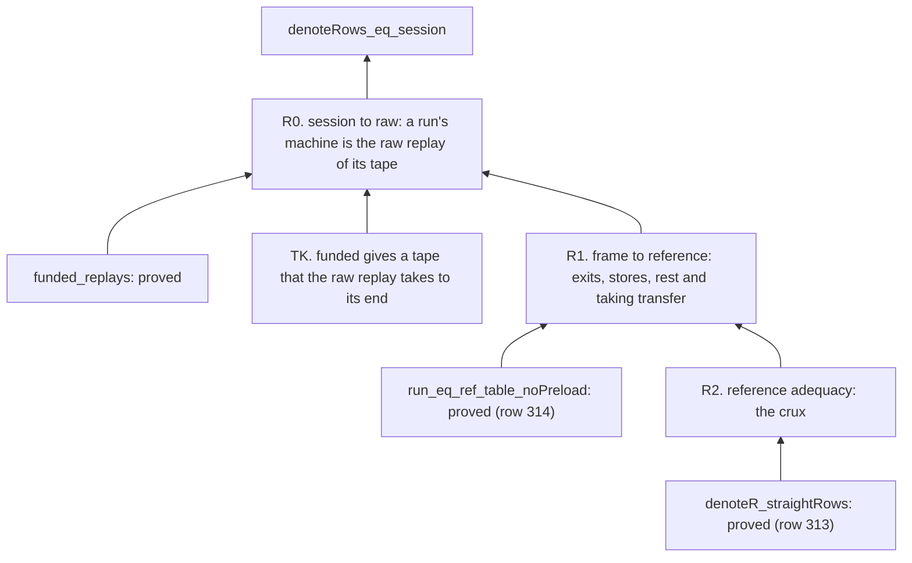

# 2026-10-07 the map of slice H8: the proof of `denoteRows_eq_session`

Status: a research note (history, not authority). It rules nothing. It maps the proof of the
planned goal `denoteRows_eq_session` (`src/Effect4/Laws/Api/SessionMeaning.lean`, decisions rows
310 and 313) on the reference route of `docs/research/2026-10-07-packet-host-meaning.md`,
section 5.2. No step of it is compiled yet. It is written so that the next proof session starts
from a checked decomposition, as the owner asked (map the graph first).

## 1. The one thing to know first

**Two of the three steps reuse proved theorems; the third is the one new proof.** Since slice
H6a (decisions row 314) the frame machine and the reference machine agree at every row table
with no preloaded answer (`run_eq_ref_table_noPreload`). So the goal reduces to a statement
about the reference machine alone, and that statement is an adequacy theorem: the reference
machine's run of a one-fiber term on a host-driven tape is the call tree interpreted under the
tape's replies.

## 2. The decomposition

| Step | Statement | Reuses | Kind |
| --- | --- | --- | --- |
| R0 | for a recorded, funded run, each side of the goal reads the program, the row table, the budgets and the tape alone: `s.machine` is the raw replay's machine (`funded_replays`), `atRest` and `s.exit` read it, and `appliedExits` and `hostDriven` read `tapeOf s` | `funded_replays` | short |
| TK | a funded run's tape is taken to its end by the raw replay: each decision at a live machine with enough command fuel. `Suffices` (`src/Effect4/Laws/Machine/Approximation.lean`) is not that predicate: it answers true at a stuck machine. A predicate that refuses a stuck machine is needed, by induction on `tapeFrom` as `tape_replays` goes | `tapeFrom`, `readsOn` | short, new vocabulary |
| R1 | the frame replay and the reference replay of one tape have the same root exit, the same stores, the same rest and the same taking | `run_eq_ref_table_noPreload` (class and `obs`); `BookMeans` for rest and liveness | short |
| R2 | for a `StraightRows` program, a host-driven tape that the reference replay takes to its end and that ends at rest: the root's exit and the stores are the call tree's meaning under the tape's exits (`meaningRows`), and the tape's exits are all read | `denoteR_straightRows` (the term, erased, is the tree read into the reference signature) | the new proof |

### 2.1 A finding of the map: the raw form needs one more premise

A raw tape may hold an answer that meets no parked call: a wrong fiber, a stale token, or a call
already answered. A session refuses such a reply before it reaches the machine (reply
admission, `src/Effect4/Api/HostSession.lean`), so `tapeOf s` never holds one. The raw replay
of such an answer leaves the machine as it was, while `exitsOf tape` still counts its exit. So
the raw statement of R0 is false as drafted, and it takes a premise: every answer of the tape is
applied to the call that is parked for it. Two ways stand.

- **State the premise** as a predicate over the tape and the replay (each answer decision meets
  a parked call with its token), and prove that `tapeOf s` has it from `applyReply_applied_machine`
  (`src/Effect4/Laws/Run/Tape.lean`): an applied reply read its parked call.
- **Keep R0 at the session level.** Move by `session_eq_ref` (a theorem since row 314) from the
  frame machine to the reference machine on `tapeOf s`, and state R2 over recorded runs. The
  premise then comes from the session itself, and the crux reads one more invariant of it.

The second needs no new predicate over raw tapes. The first gives a statement with no session in
it, which R2's induction on the tape wants. Decide it at the rehearsal of R2's first lemma.

## 3. The crux, R2, and how to attack it

The reference machine runs the root fiber's term, an `RProgram`, a free monad over store
operations, asynchronous external calls and control markers. `denoteR_straightRows` gives the
term with its control markers erased as `Effects.interpret (toRef table) (denoteRows table e env)`.

The statement needs an invariant over the replay, by induction on the tape:

- the machine holds one fiber, the root, with no queued task and no armed owner between host
  decisions (the fragment forks nothing);
- the root's current term, erased, is a residual tree `t` of the call tree, and the stores are
  the meaning's stores so far;
- the exits read so far are a prefix of the tape's exits, and `t` is the continuation that the
  tape handler reaches after them.

Each decision of the alphabet moves it: an evaluation runs the term to its next external park or
to its exit (the store steps are the reference's own `denoteR` arms, as `straight_ref` already
uses on `Straight`); a flush runs nothing at rest; an answer with an exit applies it to the
parked call, which is one step of the tape handler (`tapeHandler`,
`src/Effect4/Laws/Program/DenoteRows.lean`).

**What to try first.** The run-to-park lemma is the analogue of `replay_Mexit` and `drive_localRun`
(`src/Effect4/Laws/Program/Agreement/Machine.lean`) on the reference machine, extended by the
one external arm. Run `#auto_census Effect4.Laws.Program.RuntimeR using aesop` and the census of
the simulation files before writing it by hand (the owner's steer of 2026-10-07).

**The wider fragment.** `catchIf` is in the fragment (row 310). Its arm reads `caughtErrorValue?`
on a failure's cause; on the reference route it costs nothing beyond the erasure law's arm,
which H3 already proves (the packet, section 5.2).

## 4. Size

R0, TK and R1 are a day together: each is a short induction or an application of a proved
theorem, and TK adds one predicate. R2 is the new proof: two to three days on the reference
route, by the packet's estimate and the shape of `straight_ref`. No step needs a change to a
core module.

## 5. The placement, for when the goals are stated

- Concept `translation-simulation`; requirement R6; the claim `rows-denotation-session`.
- R0 to R2 become planned goals only with a finite test each in `Test/Api/SessionMeaning.lean`
  (decisions row 310: no goal without its finite test). R0's test is the battery's own runs,
  read through the raw replay; R2's is the same runs on `replayR`.

## What this does not establish

- Any step: no part of this map is compiled.
- That `TK`'s predicate is the right one: it is read off `tapeFrom` and `readsOn`, not tested.
- The size of R2: it is an estimate, not a measure.

## Addendum (2026-10-07, late evening): the route of R2, read against the tree

**The one thing to know.** No adequacy proof runs on the reference machine today: `straight_ref`
(`src/Effect4/Laws/Program/RuntimeR.lean`) is the frame machine's `replay_Mexit`
(`src/Effect4/Laws/Program/Agreement/Machine.lean`) carried over by `replay_rel`. So the cheaper
route of R2 is the frame machine's, not the reference's that section 3 proposes.

- **What the frame route reuses.** `localRun`, `localStep` and `drive_localRun`
  (`src/Effect4/Laws/Program/Agreement.lean`, `Agreement/Machine.lean`) run one fiber of a
  `Looped` program to its exit, past the op budget through rounds of `flush`.
- **What it adds.** A local run that takes a reply at each external park, and its agreement with
  `meaningRows`; then the drive of a host-driven tape. An evaluation runs the root to its next
  park. An answer resumes the fiber with the prepared code and drives it in the same decision
  (`Cmd.resume`, `stepDecisionState`, `src/Effect4/Machine/Fibers.lean`), to its next park, its
  exit or a yield at the op budget. A flush resumes a yield. `PlainCode` excludes `async` today,
  so the local step gains one arm.
- **The size, by reading.** The local run's agreement with the call tree follows
  `localRun_compile`'s induction with the reply tape threaded through it. The drive follows
  `drive_localRun` with the park and the answer between rounds. Each is a long proof with many
  cases, not an hour's work. This is an estimate, not a measure.
- **The order stands.** R2 comes after the typed print and its removal of the guards.

## What the addendum does not establish

- Any step of the frame route: nothing of it is compiled.
- That the drive after an answer has the shape of `drive_localRun`'s: read, not compiled.
