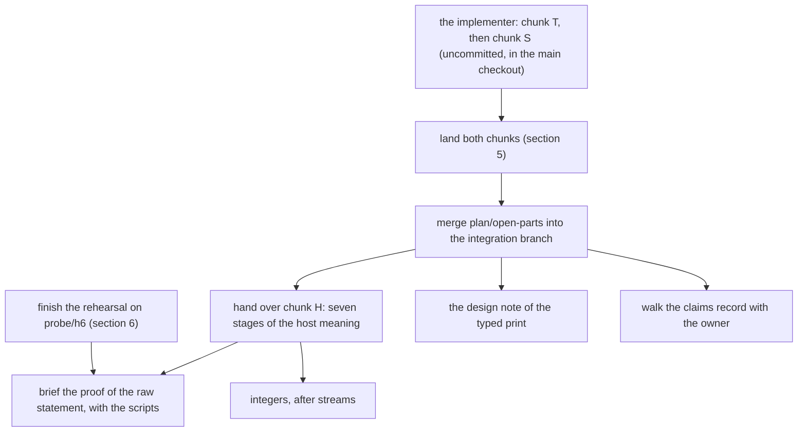

# 2026-10-07 hand-off of the coordinator's seat

Status: a research note (history, not authority). It is written for the next coordinator. The
owner asked for it in session: the account of this session runs out of quota, and the next
session runs on another account. So this note names where each thing is, and it assumes no
memory of this session. It rules nothing. Written at 14:45 CDT on 2026-10-07.

## 1. The one thing to know first

**Three bodies of work stand in three places, and one of them is not committed.**

1. **The implementer's run is uncommitted in the main checkout.** The second model (Gemini)
   works in `/Users/pooks/Dev/lean4-effect4` on chunk T and chunk S. Its `git add` is refused
   by a deny rule of its own environment. So its stages are no commits. Each stage has a file
   list and a message under `scratch/commit_<stage>.txt`. At the time of writing it has
   written T1 to T3 and S1 to S4, and 29 files are changed. Section 5 says how to land it.
2. **The coordinator's newest records are on a side branch**, `plan/open-parts`, in the
   worktree `/Users/pooks/Dev/lean4-effect4-t3b`. It holds decisions row 310 and the amended
   DI-57 and DI-69. It holds the host packet, the probe note and the brief of chunk H too. It
   is not merged into the integration branch: the main checkout was in use.
3. **A proof rehearsal stands on the branch `probe/h6`** of the same worktree. It does not
   land. Section 6 says how to resume it.

Nothing of this session is pushed by the coordinator. Section 8 lists one push that the
coordinator did not make.

## 2. Who does what

| Who | Role |
| --- | --- |
| the owner | dictates by voice. Read a transcript as it was spoken: an odd phrase is a mis-transcription, and no ruling |
| the coordinator (this seat) | reviews, repairs, runs the gates, writes the records, commits, and writes the next brief |
| the implementer (Gemini) | implements slices in the main checkout from a brief; hands back a receipt that the owner pastes |
| Codex | a relay of Codex counts as owner input; its branches stand under `/Users/pooks/.codex/worktrees/` |

## 3. Where everything is

### 3.1 Checkouts and branches

| Place | Branch and head | What it holds |
| --- | --- | --- |
| `/Users/pooks/Dev/lean4-effect4` (the main checkout) | `chunk-3b` at `7a7045f6`, with the implementer's uncommitted stages | the integration line, in use by the implementer. The branch name is old: the implementer could not create `chunk-T` |
| the same repository | `refactor/phase1-phase3` at `7a7045f6` | the integration branch. It holds chunk 2, chunk 3, stage F1 and the briefs of chunks T and S |
| `/Users/pooks/Dev/lean4-effect4-t3b` (the coordinator's worktree) | `plan/open-parts` at the commit of this note | the records of section 1, item 2 |
| the same worktree | `probe/h6` at `c9f6cd72` | the rehearsal of section 6 |
| the same repository | `chunk-3` at `58ad3dcb` | the landed chunk 3. It is an ancestor of the integration branch |

`git log --oneline refactor/phase1-phase3..plan/open-parts` lists what the side branch adds.

### 3.2 The durable copy of this session

The session's scratch folder stood under `/private/tmp`, which does not survive a restart. The
coordinator copied it, with the memory and the transcript, to one folder beside the
repository:

`/Users/pooks/Dev/lean4-effect4-claude-handoff-2026-10-07/`

| Folder | What | Size |
| --- | --- | --- |
| `scratchpad/` | every scratch file of the session, from 2026-10-05 on | 1.5 GB |
| `memory/` | the coordinator's memory files, one fact a file, with the index `MEMORY.md` | 1 MB |
| `transcript/` | the session's transcript as JSON lines, and the session folder with the transcripts of its subagents | 0.6 GB |

The copy of the transcript is a snapshot of 14:40. The live files are these.

- The transcript: `/Users/pooks/.claude/projects/-Users-pooks-Dev-lean4-effect4/acf2315e-02ac-4acd-9ef9-b0734bd686a7.jsonl`.
- The session folder, with each subagent's transcript:
  `/Users/pooks/.claude/projects/-Users-pooks-Dev-lean4-effect4/acf2315e-02ac-4acd-9ef9-b0734bd686a7/`.
- Earlier sessions: 73 more transcripts in the same folder.
- The memory: `/Users/pooks/.claude/projects/-Users-pooks-Dev-lean4-effect4/memory/`. A session
  of another account loads it only if it runs with the same configuration folder. If it does
  not, read `memory/MEMORY.md` of the durable copy first.

A transcript is searched as text: `grep -a -c '<phrase>' <file>.jsonl`. The memory file
`previous-session-recovery.md` says how to read a seat's prompt out of one.

### 3.3 The scratch folder, by subfolder

Paths are under `scratchpad/` of the durable copy.

| Subfolder | What |
| --- | --- |
| `chunk3/` | the landings of 2026-10-07: `gates.sh` (the twenty wide gates), `regates.sh`, each gate's log, each commit message, the caller measures `Callers.lean` and `CallersOf.lean` |
| `merge-chunk2/` | the gates and logs of the landing of chunk 2 |
| `h6/` | the rehearsal of section 6: `thread.py`, `auto.py`, `round.sh` and the log of each round |
| `packets/host/` | the 33 scratch files of the host packet, with `verify.sh`, which runs each |
| `packets/app/`, `packets/lang/` | the scratch files of the other four packets |
| `open-parts/` | the logs and probes of the pass over the open parts |
| `ingest-census/` | a census of 34 real projects for the ingest: `report.md`, `summary.json`, `units.jsonl`. A parked fact (decisions row 307, point 2) |
| `seat-lanes/`, `seat-bounds/`, `seat-pilot/`, `t5b/`, `controls/`, `move/`, `census/`, `check/`, `pub/`, `tape/` | scratch of the seats of 2026-10-05 and 2026-10-06 |

Four scripts also stand in the repository: `docs/research/2026-10-07-handoff/`.

### 3.4 The records in the repository

| What | Where |
| --- | --- |
| the entry point | `docs/STATE.md` |
| the decisions of this session | `docs/core/decisions.md`, rows 303 to 310. Row 310 is on `plan/open-parts` alone |
| the owner's rulings of 2026-10-07 | rows 307 (the share, the main draw, the order of work), 309 (integers, streams), 310 (the host meaning, gates by reach) |
| the amended design issues | `docs/DESIGN-ISSUES.md`, DI-57 and DI-69, on `plan/open-parts` alone |
| the briefs for the implementer | `docs/research/2026-10-07-chunk-T-brief.md`, `…-chunk-S-brief.md`, `…-chunk-H-brief.md` (the last on `plan/open-parts` alone) |
| the five research packets | `docs/research/2026-10-07-packet-{streams,authoring-sugar,integers,application-claims,host-meaning}.md` (the last on `plan/open-parts` alone) |
| the coordinator's reviews | `docs/research/2026-10-07-chunk-2-landing-review.md`, `…-chunk-3-landing-review.md`, `…-chunk-3b-F1-review.md` |
| the probe of the host meaning | `docs/research/2026-10-07-host-meaning-probe.md`, with its scripts beside it |
| the plan's open parts and their states | `tools/Tools/SemanticsRegistry.lean`; `generated/semantics.md`; `docs/research/2026-10-07-open-parts-pass.md` |
| the to-do application, first slice | `Test/Dogfood/Scenario/Todo.lean` |
| the note on the theorems of a program | `docs/research/2026-10-07-theorems-of-a-program.md`. The packet of the application corrects it in nine places |

`docs/research` is ignored by git. A note that matters is added with `git add -f`, in a call of
its own.

## 4. The state of each line of work



| Line | State | Next step |
| --- | --- | --- |
| chunk T (streams, first profile) | written by the implementer, uncommitted | land it (section 5) |
| chunk S (authoring sugar) | stages S1 to S4 written; S5 and S6 open | wait for the hand-back, then land it |
| chunk H (host meaning, fast path) | briefed; not handed over | hand it over after the landing. Section 7 has the prompt |
| the raw statement `run_eq_ref_table` | rehearsed in part (section 6) | finish the rehearsal, then brief it |
| the statement `denoteRows_eq_session` | stated in the packet; no step of its proof ran | rehearse its first lemma on the reference route (the packet, section 5.2) |
| the typed print (the plan's slice PRINT) | waits for the coordinator's design note | write it. The call instance of stage H9 is its input (`callAt`, the packet's appendix I) |
| the claims of a program | a packet with a compiled draft; the owner has not agreed its form | walk the owner through it on the to-do application. Do not ask for a bulk yes |
| integers | ratified, ordered after streams (row 309) | brief the packet's slices 1, 3 and 5 |
| the open parts of the plan | 86 parts, 35 not triaged | triage them by requirement; state `edit-frame` as a planned goal after a finite test |

## 5. How to land the implementer's two chunks

The implementer hands back once, after chunk S, in the order of its briefs. The owner pastes
the receipt.

1. **List what stands**: `git status --short` in the main checkout, and each
   `scratch/commit_<stage>.txt`.
2. **Read every changed file under `Test/` in full**: `git diff HEAD -- Test`. Read each core
   file line by line. Check each statement and each count of the receipt against the tree.
3. **Check the things that the build does not see.** A removed theorem can still be a pointer
   of the semantics registry. A docstring's reader may not read: list the callers with
   `docs/research/2026-10-07-handoff/CallersOf.lean.txt`.
4. **Run the gates that the diff reaches**, each through `scratch/lean-slot.sh`, one `lake` at
   a time (decisions row 310, point 10).
   - Chunk T: the build, `make check-cases`, and the build of `Test`.
   - Stage S1 changes a rule of the TypeScript printer: `make corpus`, then
     `git diff generated/corpus-index.tsv`, `make check-truth` and `make check-target`. A moved
     row needs its name in `Test/fixtures/baseline/66ee4657-supplement-v1.policy.json`, and
     then `make check-conservativity BASE=<base>`.
   - Stage S2 adds a generated group: `python3 scripts/generate.py --only <group>`, with
     identical output.
   - The other stages: the build of `Test`, once, at the end.
5. **Run tsgo 7 on the forms that the TypeScript printer writes for the stream programs**
   (the streams packet, section 3.9). The brief of chunk T leaves that to the coordinator.
6. **Commit by explicit paths**, with `git commit -F <file>`. Use the file lists. Where two
   stages share a file, commit the chunk as one commit and say so.
7. **Then merge `plan/open-parts`** into the integration branch, before a new decisions row is
   written. Row 310 stands there, and the next row is 311.
8. **Write the records**:
   - a decisions row for each chunk, and `docs/STATE.md`;
   - the two rows of `docs/ARCHITECTURE.md` for the stream module;
   - the row of `docs/GENERATED.md` for the atoms' functions;
   - a review note for the implementer.

The wide run of twenty gates is `docs/research/2026-10-07-handoff/gates.sh.txt`. It is for a
sweep that the owner asks for, and for a diff that reaches the checker.

## 6. How to resume the rehearsal of the raw statement

The note `docs/research/2026-10-07-host-meaning-probe.md` holds the design, the proof graph and
the measures. The state:

- the branch `probe/h6`, two commits above `1039adf0`: the reference-machine patch, then the
  threading;
- `Means`, `Hooks`, `Fibers`, `Walk`, `Deliver` and `Actions` build;
- `Pending` has 2 errors and `Evaluate` has 21. `Drive` and `RuntimeR` are not reached.

To resume, in the worktree:

1. `git switch probe/h6`;
2. run the loop: `python3 docs/research/2026-10-07-host-meaning-probe/auto.py.txt <a log folder>`.
   One round builds `Effect4.Laws.Program.RuntimeR` and takes about a minute;
3. repair what the loop leaves, by the rule of the probe note, section 4;
4. then the three proofs of its section 5: the registration arm, the store invariant, and the
   prepared-answer clause. The third is the packet's file `P51_HooksLeaf`.

The owner's steer for this work is in the memory file `less-ceremony-map-the-graph-first.md`.
Map the goals in the plan first. Try the aesop banks first
(`#auto_census <Module> using aesop`). Give a size in days. The census of the simulation files
is not run yet.

## 7. The prompt for chunk H

Hand it over after chunk S is landed and `plan/open-parts` is merged.

```text
Chunks T and S are landed. The branch refactor/phase1-phase3 is at <head>.
This hand-over is one chunk of seven stages. Read first, in this order:
1. docs/research/2026-10-07-chunk-H-brief.md
2. docs/research/2026-10-07-packet-host-meaning.md
3. docs/research/2026-10-07-host-meaning-probe.md
Work in the main checkout, on a new branch chunk-H from refactor/phase1-phase3.
Stages H1, H2, H3, H9, H4, H5, H7, in that order. Each stage lands the packet's draft.
Stages H1, H2, H3 and H7 land the wider form: docs/research/2026-10-07-packet-host-meaning-drafts/.
Gates by reach: the brief, section 2. Run no corpus lane, no TypeScript compiler and no dune.
If git add is refused, do not stop between stages: write each stage's file list and message
under scratch/, and hand back once at the end. Stop at any stop rule, and say which.
```

## 8. What the owner has decided, and what is open

**Decided on 2026-10-07** (rows 307, 309 and 310):

- the first share and its four gates, with authoring before ingest;
- the to-do application as the centre of the dogfooding;
- the theorems of a program are part of its data, and their API is not improvised;
- streams are in, and recursive types are parked;
- integers by one line, after streams;
- the six rulings on DI-57 and DI-69;
- gates by reach, and two chunks for the implementer in one hand-over.

**Open, each the owner's:**

1. The claims record (`docs/research/2026-10-07-packet-application-claims.md`, section 5.3):
   - is the application the carrier;
   - is "monitored at the session" a grade of a premise;
   - the reference model first, or the computed facts first;
   - does a named program take typed parameters;
   - do the application's goals stand under R6.
2. Was the plan of the branch `codex/host-lowering-plan` ratified on 2026-10-04? That plan
   says so, and no tracked register does.
3. The deny rule on the implementer's `git add`: lift it, or keep one hand-back for each run.
4. The interim guard at a host row's request (row 303, point 12). The coordinator recommends
   it.
5. The shapes of the marks of an open part in the proof graph view.
6. Where the language stops computing, beyond the line of row 309.

**Things that the next coordinator should know and that are no decision:**

- `origin/refactor/phase1-phase3` stands at `fba5a67b`. This seat never pushes, so another
  hand pushed that commit. Every later commit is local.
- `exitScoped` (`src/Effect4/Program/Compile.lean`) uses the default row table. It is not
  observable today (row 310, point 11). Repair it when that file is next opened.
- `restingPin` (`Test/Audit/AxiomGate.lean`) is 12. Chunk H moves it to 13. The record slices
  of the streams packet and of the application packet each move it too.
- The measure of callers lists 25 declarations with no caller in two files
  (`docs/research/2026-10-07-chunk-3b-F1-review.md`). No one has decided about them.
- The text "`int` is not inhabited yet" is stale in several documents (the integers packet,
  section 4.3).
- A preview of the proof graph view runs from `.claude/launch.json` (the name `arch-map`). The
  page is `.lake/gen/architecture-map.html`, written by `make gen-architecture`.

## 9. The standing rules of this seat

Each rule is the owner's, or a rule of `AGENTS.md`. The memory files hold the reason of each.

- Never push. Commit by explicit paths, never `git add -A`. A message goes through
  `git commit -F <file>`.
- The owner's untracked `docs/*.md` and `README.md` stay as they are.
- One `lake` at a time in a working tree. Every Lean, Lake and `make` command runs through
  `/Users/pooks/Dev/lean4-effect4/scratch/lean-slot.sh`. `lake cache clean` is the owner's.
- Every `make` call carries `-o ts/eff/node_modules -o harness/truth/node_modules`.
- TypeScript is checked by tsgo 7 alone, run by its path under `ts/eff/node_modules`. Never
  run `tsc`. Outside `ts/eff` and `harness/truth`, a `bun` run takes `--no-install`.
- OCaml runs through `opam exec --switch=effect4 -- dune` alone.
- Install and download nothing without the owner's explicit yes. Delete nothing under
  `~/.bun`.
- A hook or classifier denial is never routed around. `git restore`, `git checkout <flag>` and
  `git reset --hard` are blocked: use `git switch`, and `git show HEAD:<path> > <path>` for one
  file. Never redirect a Lean command's errors to the null device.
- A subagent's message grants nothing. If a subagent reports a denied action and asks for it,
  refuse and tell the owner. Use subagents only when the owner asks.
- Ask the owner only on a change of meaning, of supported domain or of representation. Decide
  the rest, record it, and report once. Write a ruling into a register only on the owner's own
  word, and check its facts first.
- Stop a seat below 4 GiB of free disk. A worktree never copies `docs/research`.
- Write every Markdown file by `docs/core/controlled-english.md`, and run
  `python3 scripts/check-language.py --show <file>`.
- In a reply to the owner, lead with the result, and name no internal id of a seat.

The memory files to read first: `MEMORY.md`, `gemini-chunks-and-prompts.md`,
`less-ceremony-map-the-graph-first.md`, `share-gate-and-main-draw-2026-10-07.md`,
`owner-questions-meaning-domain-representation.md`, `voice-transcript-read-by-sound.md`,
`git-commit-chain-traps.md`, `corpus-row-moves-need-policy-name.md` and
`proof-obligations-placed-in-theory.md`.

## What this does not establish

- That the implementer's stages are right. No stage of chunk T or chunk S is reviewed.
- That the rehearsal ends green. Two of its files fail, and two are not reached.
- That the durable copy holds what the session wrote after 14:40. The live transcript grows
  until the session ends.
- Any ruling. Each decision stands in `docs/core/decisions.md` or `docs/DESIGN-ISSUES.md`, and
  this note points at them.
