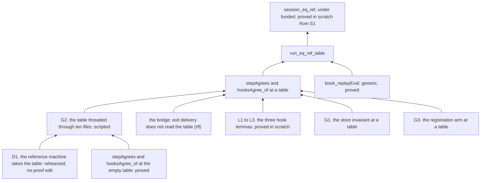

# 2026-10-07 the coordinator's probe of the host meaning: checked facts and a rehearsal

Status: a research note (history, not authority). It rules nothing. The owner asked for it in
session. It probes the design of `docs/research/2026-10-07-packet-host-meaning.md`. It checks
each fact behind the packet's six questions, and it looks for the way to land the work in days.
The rehearsal stands on the branch `probe/h6` of the worktree. That branch does not land.

## 1. The one thing to know first

**The proof of the raw statement is a mechanical edit with three known proofs, and no new
theory.** The packet sized it "M to L". The rehearsal measures it.

- The simulation is one generic theorem, `book_replayEval` (`src/Effect4/Laws/Machine/Book.lean`).
  It takes two interpretations, an invariant and two obligations. `run_eq_ref` is its instance
  at the empty row table (`src/Effect4/Laws/Program/RuntimeR.lean`).
- So the raw statement at a row table is the same instance at two other interpretations. The
  work is the two obligations at a table.
- **The cone rebuilds in 47 seconds.** The reference-machine patch applies at the landed tree,
  and eleven modules build again with no proof edit.
- A script threads the table through ten files. Six of them build after it, with 18 named
  arguments and one bridge lemma that closes by `rfl`.

## 2. The facts behind the six questions, checked

| # | The fact | Check | Result |
| --- | --- | --- | --- |
| 1 | `Straight` excludes `catchIf`, and the routing program has `catchIf` nodes | `src/Effect4/Program/Fragment.lean`; `Test/Dogfood/Scenario/Routing.lean` | holds |
| 1 | the laws of slices H1 to H3 hold on the wider fragment | the packet's files `W13`, `W14`, `W16` and `W_B4`, run again by the coordinator | each compiles, exit 0 |
| 2 | the ruled statement of DI-57 fails at a cut budget | the packet's file `P25_Budget`, run again | compiles with its control |
| 2 | the tree names the cause | the docstring of `funded`, `src/Effect4/Run/Tape.lean` | holds: a law of a whole run takes `funded` |
| 4 | host resources are parked | decisions row 100 | holds: parked by the owner on 2026-09-30 |
| 6 | the preloaded answers are ruled for deletion | DI-23, the amendment of 2026-09-11 | holds |
| — | all 33 scratch files of the packet compile | the packet's `verify.sh`, run by the coordinator | each exit 0, no warning |
| — | the reference-machine patch needs no proof edit downstream | `lake build Effect4.Laws.Program.RuntimeR` on the patched tree | holds at the landed tree: 47 s |

Questions 3 and 5 are choices of representation. Their drafts compile, and no fact of the tree
stands against either.

## 3. The proof graph of the raw statement

The graph is that of the coordinator's note of 2026-10-03, with the rehearsal's results. Each
node is a planned goal or a theorem of the slice that lands it. No node is a new concept.

## 4. The rehearsal

**What ran.** On `probe/h6`: the packet's patch (its appendix E), then the script
`docs/research/2026-10-07-host-meaning-probe/thread.py.txt`, then the loop `auto.py.txt`.

| Step | Measure |
| --- | --- |
| the patch of the reference machine | three files; the cone of eleven modules builds in 47 s; no proof edit |
| the threading script | ten files; 415 uses of an interpretation gain the table |
| the relations of `Means.lean`, and one abbreviation | keep the default table: 28 uses. The fields that they read do not depend on the table |
| the relation `WalkRel` | takes the table as an explicit parameter; 11 uses |
| the loop | names the table at 18 applications with no expected type |
| the bridge lemma `finalizerOr_table` | one, and it closes by `rfl` |
| files that build | `Means`, `Hooks`, `Fibers`, `Walk`, `Deliver`, `Actions`, and the modules of `Intro` that read `Means` |
| files that do not build yet | `Pending` (2 errors), `Evaluate` (21 errors) |
| files not reached yet | `Drive`, `RuntimeR` |

**The rule that the rehearsal found.** A lemma about an interpretation takes the table as an
implicit variable, so a caller at the default table does not move. A relation keeps the
default table where it reads a field that does not depend on the table. Where a relation
cannot keep it, the table is an explicit parameter.

**One finding in the frame machine.** `exitScoped` (`src/Effect4/Program/Compile.lean`) builds
its interpretation at the default table, whatever table the machine runs at. The frame
machine's other paths take the table. The difference is not observable: the delivery of an exit
reads neither field that depends on the table. The bridge lemma states it, and `rfl` proves
it. The rehearsal edits no file under `src/Effect4/Program/`.

## 5. What is left, and which part is not mechanical

| Part | What | Kind |
| --- | --- | --- |
| `Pending.lean`, `Evaluate.lean` | 23 errors of the threading | mechanical, by the loop and by hand |
| G3 | `registerAsync_foreign` says that external registration answers nothing. That is false at a table. The arm becomes the agreement of the two registrations | a short proof: under H6a's premise both sides answer nothing |
| G1 | `StoresOk.externals` says that no external handle is allocated. It becomes conditional on the empty table, and it gains the clause that no preloaded answer stands | six sites, and the check of `#frame_rules StoresOk` |
| L1 to L3 | the prepared-answer clause of `hooksAgree_of`, which reduces by `List.isEmpty_nil` today | proved in scratch (the packet's `P51_HooksLeaf`) |
| `Drive.lean`, `RuntimeR.lean` | not compiled after the threading | unknown until the files before them build |

The coordinator's estimate, which is not a measure: one to two working days to a green cone.
Each round of the loop takes about a minute.

## 6. What the hand-over takes from this

- **Gates by reach.** A slice that adds law modules and batteries owes the build of its
  modules. A chunk owes one `lake build Test` at its end, for the axiom gate. The slices H1 to
  H9 reach no generator, no TypeScript printer and no OCaml engine, so no other lane runs for
  them.
- **The wide edit is rehearsed before it is briefed.** The implementer receives the scripts
  and the list of section 5, and no blank proof.
- **The second proof, `denoteRows_eq_session`, is not rehearsed.** Its reference route reuses
  the erasure law and the raw statement. The coordinator rehearses its first lemma next.

## What this does not establish

- That the raw statement is proved. Two files of the rehearsal do not build, and two are not
  reached.
- That `Drive.lean` holds no surprise. It names an interpretation at 146 places.
- That `#frame_rules StoresOk` accepts a conditional clause. The rehearsal has not changed the
  invariant yet.
- Any size of the second proof. No step of it ran.
