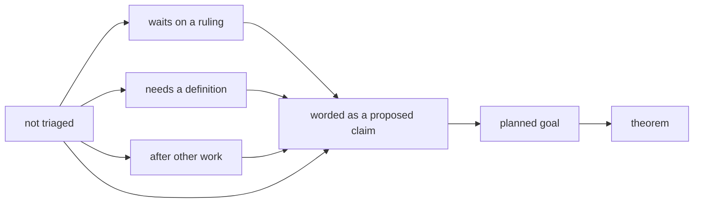

# 2026-10-07 the pass over the open parts: each part gets a state

Status: a research note (history, not authority). It rules nothing. The owner asked for it in
session: put the open work into the proof graph, and show how the work goes. Branch
`plan/open-parts`, from `eebc67b5`. It is for the owner and the coordinator. It gives the
implementer of chunk 3 no instruction.

## 1. Question

The plan lists 84 open parts in words. An open part is a part of a requirement that no planned
goal states yet. The plan held 14 planned goals from the scenario programs. It held no goal for
the host, for the LCNF lowering to OCaml or for the data language. Which open parts can be stated now, and what does each
other part wait on?

## 2. What the pass does

Each open part gets one state. The state is data of the registry
(`PartState`, `tools/Tools/SemanticsRegistry.lean`).

- A part that waits names what it waits on. The register check refuses a part that names
  nothing.
- A part leaves the list when a planned goal states it. The goal is then a node of the plan.
- The report prints each part with its state, and one line of counts
  (`generated/semantics.md`, the plan section).
- The proof graph view draws one outlined mark for each part, in the column of open parts
  (`tools/Tools/ProofGraphView.js`). The mark has no hue. Its shape is its state.

## 3. The first triage

The counts are the report's, on the branch.

| Requirement | Open parts | Not triaged | Ruling | Definition | Other work | Worded |
| --- | --- | --- | --- | --- | --- | --- |
| R1 the language signature | 4 | 3 | 1 | 0 | 0 | 0 |
| R2 extension | 5 | 4 | 0 | 1 | 0 | 0 |
| R3 data | 6 | 3 | 2 | 0 | 1 | 0 |
| R4 state | 6 | 3 | 0 | 0 | 0 | 3 |
| R5 services | 2 | 2 | 0 | 0 | 0 | 0 |
| R6 the host | 7 | 1 | 2 | 3 | 1 | 0 |
| R7 retained behaviour | 4 | 1 | 2 | 0 | 0 | 1 |
| R8 runs and faces | 6 | 3 | 2 | 0 | 1 | 0 |
| R9 never goes wrong | 1 | 0 | 1 | 0 | 0 | 0 |
| R10 library code | 13 | 7 | 1 | 0 | 0 | 5 |
| R11 resources | 8 | 4 | 1 | 0 | 0 | 3 |
| R12 frontiers | 9 | 3 | 1 | 0 | 0 | 5 |
| R13 a run's inputs | 4 | 1 | 0 | 0 | 2 | 1 |
| R14 sketches | 9 | 0 | 0 | 5 | 1 | 3 |
| All | 84 | 35 | 13 | 9 | 6 | 21 |

**How a state was given.** A part is "worded" where its own text names a proposed claim. A
part waits where its own text names the row, the design issue or the work. The pass read the
host parts and the sketch parts against the tree. Every other part without such a name is
"not triaged".

## 4. Findings

1. **The two top statements of the host are ruled and worded, and no goal states them.**
   `docs/DESIGN-ISSUES.md` rules the statement `session_eq_ref` (DI-57) and the statement
   `denoteRows_eq_session` (DI-69). The tree holds neither name. Each waits on a definition:
   the reference machine's keyed reply path, and the meaning of a host row.
2. **The public guarantee for a run with host calls cannot be a goal today.** The live reply
   check accepts a fiber handle of the wrong type (`docs/STATE.md`). A goal with that
   statement would be false.
3. **`checker-monotone` is false until two slices land**: the tests by equality, and the
   removal of the guards.
4. **Two parts of the program-as-data layer stand in no list.** The checker computes the type
   instance at a call site and does not keep it (`checkRow`,
   `src/Effect4/Program/Typing/Rules.lean`). A sketch has no wire format.
5. **Three worded claims have every definition they need**: `edit-frame`, `marking-agrees`
   and `column-graduality`. They are the first candidates for a planned goal.

## 5. Next

1. State `edit-frame` as a planned goal, after a finite test of its statement on the two
   corpora. A false goal is worse than a part in words.
2. Triage the 35 parts that are not triaged, one requirement at a time, against the tree.
3. Add the two parts of finding 4 to R14.
4. Bring the definitions of finding 1 to the owner as the first design of the host layer.

## 6. Checks on the branch

- `make gen-architecture`: exit 0. It runs the build, the report and the view's input check.
- `make check-semantics`: exit 0, with one new register control (a part that waits on nothing).
- `node scripts/check-proofgraph-input.mjs`: 6 broken copies refused, two of them new.
- The view was read in the pane: 84 marks, 35, 13, 9, 6 and 21 by state.

## What this does not establish

- No theorem. A state is a record of why a part has no goal.
- That a "worded" part is true as worded. A statement is tested before it becomes a goal.
- That the 35 parts that are not triaged are hard. Nobody has read them against the tree yet.
