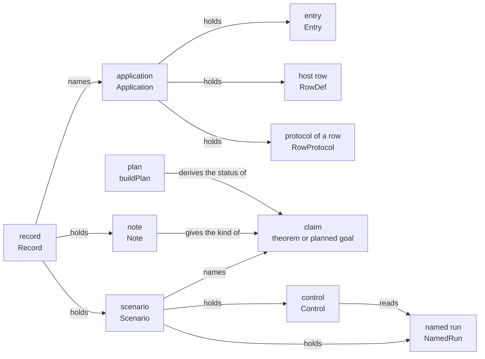

# 2026-10-07 packet: the application record and the claim record

Status: a research note (history, not authority). It rules nothing, and it lands nothing. Base:
`0e9de44f`, branch `plan/open-parts`. It tests the coordinator's examination
(`docs/research/2026-10-07-theorems-of-a-program.md`) against the tree, and it turns it into
slices. A second packet holds the authoring sugar
(`docs/research/2026-10-07-packet-authoring-sugar.md`).

## 1. The one thing to know first

**The record and the first claims of each kind can land now.** They do not wait for the call
tree over host rows (DI-69). A compiled draft holds them: 5 planned goals, 14 controls, 13 named
runs and two gates (appendix B gives the command and its counts).

Three more facts follow from the read of the tree.

- **The tree holds more than the examination lists.** It has the protocol judgment, the
  handler judgment of the stores and the host as a function. Section 2.2 names each.
- **The record adds no second mechanism.** A claim is a theorem or a planned goal with its
  placement. The plan derives its status. The record adds one note for each claim: its kind,
  the programs that it reads and what it assumes.
- **The call tree turns the goals into theorems.** On a stand-in tree, each tree form of a
  to-do claim has a proof of one to fourteen lines (section 3.9).

## 2. What exists, and what is reused

### 2.1 What was read and run

| What | Evidence word |
| --- | --- |
| `AGENTS.md`; `docs/core/controlled-english.md` §2 to §7; decisions rows 120, 203, 206, 207, 254, 281, 282, 284, 301, 302, 305; DI-57 and DI-69 | reading |
| The sources that section 2.3 names, each in full or at the named declaration | reading |
| The review of four papers (`docs/research/2026-09-05-effects-papers-review.md`, read in the main checkout), sections 1.3, 1.4, G4, A2, A3 and A6 | reading |
| The pinned algebra package, `.lake/packages/effects/Effects/`: `Algebra/Signature.lean`, `Algebra/Program.lean`, `Algebra/Handler.lean`, `Algebra/Laws.lean`, `Family.lean` | reading |
| The draft `Draft.lean` and four probes, each run by `lake env lean` in the worktree | tested |
| Plotkin and Power on operations and equations; Plotkin and Pretnar on handlers; interaction trees; Dijkstra monads | recalled, not read: no locator is given |

This packet does not read the texts of the four papers again. It reads the review of them.

### 2.2 Where the examination is corrected

Each row names what the examination says, what the tree holds, and the evidence.

| # | The examination | The tree | Evidence |
| --- | --- | --- | --- |
| C1 | A protocol of a row and "implements": none | `Protocol`, `Typed`, `Protocol.Le` and `Typed.refine` (`src/Effect4/Laws/Effects/Protocol.lean`). `Ψ_S` and `Ψ_F` (`src/Effect4/Laws/Program/Typed/Residual.lean`). `StoreImplements`, `CellImplements` and `storeStep_typed` (`src/Effect4/Laws/Program/Typed/Adequacy.lean`) | reading |
| C2 | A law of an operation and a model: none; the review's G4 is open | `put_get`, `get_get` and `put_put` on allocated cells (`src/Effect4/Laws/Program/StoreComodel.lean`). The handler judgment of C1 is G4's statement, and `NativeOp.syncOpOf_cellImplements` (`src/Effect4/Laws/Program/Progress.lean`) proves its cell half for each native row. No law is data, and no host row has one | reading |
| C3 | A tape is not a handler in code | `Run.Reactor` is a host as a function, and `Run.runWith` runs a built program under one (`src/Effect4/Run.lean`). `HostSpec` is the same thing as a relation (`src/Effect4/Program/Profile.lean`) | reading; tested in the draft |
| C4 | Inherited: an exit fits its checked type, for every admitted program | Proved for the frame machine at the empty row table alone (`m7_proved`, `obs_typed`, `src/Effect4/Laws/Program/Typed/Commands/Clauses/All.lean`). On the reference machine `reachable_typed` takes a tape whose host answers the ghost admission admits. With host rows the session's guarantee is an open part of R6. One reply's success value fits its row's answer on the shape-decided fragment (`preflight_success_prepared_fits`) | reading |
| C5 | The two planned goals of the routing scenario are facts of the call tree | One is. It needs `catchIf` in the tree's fragment, and `Straight` excludes `catchIf`. The other holds under the typing of the configuration's answer: at an answer of another shape its guard is false (probe 4) | tested (probes 1 and 4) |
| C6 | A claim's status: proved, proved modulo goals, a planned goal, a finite check or assumed | The plan has three words: goal, modulo, proved (`Standing`, `tools/ProofGraph/Goal.lean`). A finite check is a control of a claim. "Assumed" is a grade of a premise, or the registry pointer `Pointer.assumed` | reading |
| C7 | The kinds carry the names K1 to K5 | K1 to K5 name the arrow kinds of the system map (`docs/core/controlled-english.md`, §3.9, last rows). The record names the kinds by words | reading |
| C8 | The call tree comes first, then the record | The record, a protocol's reader and a reference model need no call tree. They compile (appendix A) | tested |
| C9 | The session checks a row's protocol where it checks its types | That changes reply admission, one of the seven judgments. A reader of the journal decides the same condition with no change of the session (`conforms`, appendix A.3) | tested |

### 2.3 What is reused

| Need | Declaration and path | Rows |
| --- | --- | --- |
| One program with its declarations | `Module`, `RowDef`, `ServiceDef`, `Package` (`src/Effect4/Program/Authoring.lean`) | DI-22 |
| The application's part of the typing signature | `SigApp`, `SigApp.signature` (`src/Effect4/Program/SigApp.lean`) | 111 to 116 |
| A built program and its run | `Api.Built` (`src/Effect4/Api/Built.lean`); `Api.Author.build` (`src/Effect4/Api/Author.lean`); `Run`, `Run.open` (`src/Effect4/Run.lean`) | 21 |
| A host as a function | `Run.Reactor`, `Run.drive`, `Run.runWith` (`src/Effect4/Run.lean`) | — |
| A scenario's record and its gate | `Scenario`, `Clause`, `NamedRun`, `Control`, `#scenario_gate` (`Test/Dogfood/Scenario.lean`) | 254 |
| The readers of a run's session part | `held`, `rows`, `seenAt`, `refusals` (`Test/Dogfood/Scenario.lean`) | 254 |
| A claim, its role and its pointer | `Claim`, `Pointer` (`tools/Tools/SemanticsRegistry.lean`) | 203 |
| A planned goal and its placement | `proof_goal` (`tools/ProofGraph/Goal.lean`); `@[semantics …]` (`src/Effect4/Laws/Auto/Semantics.lean`) | 203, 207 |
| A status derived from a proof | `standing`, `Standing` (`tools/ProofGraph/Goal.lean`); `buildPlan`, `#plan_status` (`tools/ProofGraph/Plan.lean`) | 203 |
| The protocol judgment on a call tree | `Protocol`, `Typed`, `Protocol.plain`, `Protocol.sum` (`src/Effect4/Laws/Effects/Protocol.lean`) | — |
| The handler judgment | `StoreImplements`, `storeStep_typed` (`src/Effect4/Laws/Program/Typed/Adequacy.lean`) | 136 |
| The typing of a host row's answer | `asyncPre`, `bitEntry`, `fiberPost` (`src/Effect4/Laws/Program/Typed/Residual.lean`); `preflight_success_prepared_fits` (`src/Effect4/Laws/Api/HostSession.lean`) | 97 to 99, 116, 137 |
| The rows that a program performs | `ClassTable.programRows` (`src/Effect4/Codegen/ClassTable.lean`) | 120 |
| A monoid-valued fold of a program | `foldMap_eff` (`src/Effect4/Program/Fold.lean`) | — |
| The query function and its rule | `Tools.Query.answer`, `omitPremises`, `fillPremises` (`tools/Tools/Query.lean`) | 305 |
| A sketch, an omission and a filling | `Sketch`, `Sketch.omitAt`, `Sketch.fillAt` (`src/Effect4/Program/Sketch.lean`) | 282, 288 |
| A monotone view of kept sites | `SliceView`, `SliceView.ofOmitted`, `SliceView.lattice_minimal` (`src/Effect4/Laws/Slice/Lattice.lean`) | 282 |
| The battery rule | a line is a reader, a control or a finite evaluation (`AGENTS.md`, Trust) | 301 |

## 3. The definitions and the statements to add

Appendix A holds each declaration in Lean, by its target file. This section says what each is
for and why it has its shape.

### 3.1 The words of this packet

Each word is new, and each needs a dictionary entry in the slice that lands it.

| Word | Meaning here | Draft |
| --- | --- | --- |
| application | several named programs over one row table, with the protocols of its rows | `Application` (A.2) |
| entry | one named program of an application: its parameters and its body | `Entry` (A.2) |
| protocol of a row | beside the row's types: a condition on the request, and a condition on the request and a successful answer; each is a term of type `bool` | `RowProtocol` (A.1) |
| reference model | a host as a function, written in Lean, that states what the rows of one block do | `repo` (A.5) |
| note | what the record says of one claim: its kind, the programs that it reads, what it assumes | `Note` (A.4) |
| kind | where the truth of a claim comes from; one of five words | `Kind` (A.4) |

The word "model" alone names nothing here. The dictionary has "comodel" for a state machine
that answers operations (`storeHandler`). A reference model is a comodel of a block of host
rows.

### 3.2 The application and its entries

**An application is the declarations of a `Module` and a list of entries.** It adds no
representation of a program. Each entry builds through `Module` and `Api.Author.build`, so
`Module`, `Api.Built` and `Run` do not change.

**An entry has typed parameters.** Today `add` is a Lean function from a source term to a
source program. A claim about it then quantifies over Lean functions, which are no data. An
entry binds each parameter as `bind` binds an answer. So the body reads a parameter as a
variable.

- The open program of an entry is first-order data. The checker types it in the environment of
  its parameters' types (`effTy`). The draft's guards pin the four types.
- An entry at its arguments is a closed program: `bind` over `succeed` binds each argument.
  It builds by the existing call.
- A claim quantifies over values in the environment, once the call tree exists.

**Every entry's module supplies one table** (`Application.moduleOf_table`, proved by `rfl`).

Two things stay out. The application as one stored value, with canonical bytes, is a later
slice. So is one module with several exports: the TypeScript printer exports one constant
with no parameter today.

### 3.3 The claim record

**A claim is a theorem or a planned goal, named by its declaration.** Its placement is its
`@[semantics …]` attribute. Its status is the plan's: goal, modulo or proved. The record holds
no status field.

**The semantics registry keeps its part.** A registry claim may point at an application's
statement, as it points at any theorem (`Pointer.witness`). The record holds no id, no role
and no title: those belong to a registry claim.

**The record is the scenario's record and one note for each of its entries.** The scenario's
program names the application. The scenario gate checks the record's scenario as it checks any
other. A second gate, `#application_gate`, checks the notes.

**A note holds four things**: the claim's kind, the programs that its statement reads, the
protocols and the models that it assumes, and its fragment. Each of the last two is a name of
a declaration. The first claims name no fragment: each is stated for named programs.



The diagram shows what holds what. It claims no proof.

**What the second gate refuses.** Each item is a red control in the draft.

- A clause or a law with no note, or with two.
- A note that names no clause and no law.
- A note that reads a program which the application does not hold.
- A fact under a promise that assumes nothing.
- A fact of the call tree that names an assumption.
- A statement that does not name a declaration which its note says it assumes, or its
  fragment.
- A statement that holds no literal of a program's name which its note says it reads.
- An inherited claim that is a declaration of the record's own battery.

The gate reads a statement through one level of definitions. A claim's proposition is a
definition of its battery, as in `Test/Dogfood/Scenario/Routing.lean`.

**Why a note, and no new field of `Clause`.** A scenario writes a clause as an anonymous
constructor of two fields. A third field with a default breaks each such literal (probe 3:
"Insufficient number of fields").

### 3.4 Five kinds, and three statement forms

The record names a kind by a word. The table gives each kind its statement form.

| Kind | It holds | Statement form, once the call tree exists | Statement form today |
| --- | --- | --- | --- |
| `inherited` | of every admitted program | a library law, with its premises decided at this program | the same |
| `tree` | whatever answers the rows | `Typed` at a protocol that promises nothing; or an equation of the tree | a statement over every script of the driver |
| `protocol` | under a protocol of a row | `Typed` at the row's protocol | a statement over every script whose run conforms (`conforms`) |
| `laws` | under a model of the rows | a fact of `interpret` at a handler that satisfies the laws | a statement over `Run.runWith` at the reference model |
| `run` | of a whole run: fibers, scopes, time | an invariant of the machine along a run | the same; the to-do application has none |

**The kinds `tree` and `protocol` share one judgment.** `Typed o Ψ w Q t` says three things of a
tree `t`. Each call meets the demand of `Ψ`. Each leaf satisfies `Q`. Both hold for every
answer that keeps the promise of `Ψ`. A fact of the call tree is the case where the promise is
true of every answer. The draft proves one fact of each kind in that form (A.6).

This is the weakest precondition of a tree under a specification of each operation. The
literature's name for the construction is a Dijkstra monad (recalled, not read). Hazel's
protocols are the same idea with ownership (read in the review, section 1.3).

**Where a promise's truth comes from is a grade of the premise, and no status of the claim.**
A claim under a promise is a conditional theorem. The claim names its premise. The grade says
who discharges the premise.

| Grade | The premise is discharged by | First instance |
| --- | --- | --- |
| proved | a theorem about a handler in Lean | `CellImplements` for the stores' rows |
| monitored | the session, at each reply receipt | the typing of a reply (`preflight_success_prepared_fits`) |
| validated for one run | a decision on that run's journal | `conforms`, `agrees` (A.3) |
| assumed | nobody; the claim names it | `host-progress` in the semantics registry |

"Monitored" and "validated" share one statement: the condition is a hypothesis of the theorem.
They differ in who decides the condition, and when. The session decides it before the program
reads the answer. The reader decides it after the run.

### 3.5 A protocol of a row as data, and "implements"

**A row's types are its first protocol.** The request fits `Row.request`, and a successful
answer fits `Row.answer`. The proof side has it today: the host-row arm of `Ψ_F` demands
`bitEntry` and promises `ExitOk`. The session side has it at one reply:
`preflight_success_prepared_fits`, on the shape-decided fragment. The four to-do rows are in
that fragment (probe 1).

**A declared protocol refines the types by two terms.** The term `pre` reads the request at
level 0. The term `post` reads the request at level 0 and the answer at level 1. Each has the
type `bool`. Three reasons give it this shape.

1. A term is first-order data. A Lean function from a value to a Boolean is not.
2. The term checker types it at the row's columns (`RowProtocol.formed`).
3. The TypeScript printer prints a term. So a host lane could decide the same condition. No
   lane does so today: this reason is an inference.

It is the review's proposal A2 with terms in place of Lean functions.

**The to-do application's first two protocols** (A.5):

- `insert(title)`: the stored to-do has the title, and it is not done;
- `setDone(id, done)`: an answered to-do has the id and the flag of the request.

One finding stands in the draft. The atom `eq` has no type at two Booleans. The second
protocol compares two flags by `and`, `or` and `not`.

**"Implements" has three forms, by who answers.**

| Who answers | The statement | State |
| --- | --- | --- |
| the machine's stores | `CellImplements root op` | proved for each native row (`NativeOp.syncOpOf_cellImplements`) |
| a reference model | each step of the model keeps the promise at a request that meets the demand | stated in section 3.6; a finite evaluation today |
| a host | the run conforms: `conforms protocols run = true` | decided for each run |

**What stays out of the first slice.**

- The protocol as a `Protocol` over the row table's signature. It needs `RowSig` (DI-69).
- A check at the reply receipt. It changes reply admission, so the owner rules it first.
- A demand on a failure. The error column types a failure today, and no term reads one.
- A protocol of a row with a type variable. The first rows have closed columns.

### 3.6 Laws and models

**The first form of "the laws of a store" is a reference model.** The to-do repository's model
is a state and one step function (`repoStep`, A.5). It is a `Run.Reactor`, so
`Run.runWith` runs a built entry under it with no new driver.

A claim of the kind `laws` names the model that it assumes. Its statement is over
`Run.runWith` at that model. The draft states two:

- after `add`, `list` holds the new to-do (`list_after_add`);
- `complete` twice leaves what `complete` once leaves (`complete_idempotent`).

**The reader `agrees` compares a host with the model, on one run.** The host need be no Lean
function. The reader replays the stored replies of the run through the model. It answers the
model's last state, or nothing at the first reply that differs. So a claim under the model
reaches a real run by a decided premise, as a protocol does.

**The model's own laws are plain theorems, with no machine.** The draft proves one: `all`
after `insert` holds the stored to-do, last (`repo_all_after_insert`).

**Laws as data come second.** In the theory a law is an equation between two terms of the
operations (Plotkin and Power, recalled). Here a law is two `Eff` programs over the row table,
in one typing environment, at one type (`RowLaw`). That form adds no representation.

**A host as a function satisfies a law** when the two trees give one exit and one state under
it, from every state (`Satisfies`). The statement needs the call tree, so it waits. The draft
compiles its shape over the stand-in (A.6), with two laws of the repository as data:

- `setDone` twice is `setDone` once;
- `all` after `insert` is `all` before it, with the stored to-do last.

A finite evaluation holds each law at the reference model, on five states. A red control
breaks each: the host that toggles breaks the first, and the host that forgets breaks the
second.

**A proved model in the machine's own stores is a third step.** It replaces each call of a
host row by a program over cells. The result is a program at the empty row table, which is
the fragment of `m7_proved`. It is the review's handler rule read as a fold over `Eff`. No slice of this
packet builds it.

### 3.7 Facts computed by a fold

**The law of an analysis has one form.** An analysis is a fold over `Eff`. Its law says that
its answer bounds the call tree: `Calls allowed (denoteRows table e env)`, where `allowed` is
read from the fold's answer. `Calls` is `Typed` at a protocol that demands `allowed` and
promises nothing (A.6).

| Order | Analysis | Its fold | Its law | First instances |
| --- | --- | --- | --- | --- |
| 1 | the rows that a program may call | `ClassTable.programRows` (exists) | each call of the tree is a row of the answer | `list` calls `all` alone (probe 3 gives the four answers) |
| 2 | the handlers above an address | a fold along the path, as `Node.envAt` | a typed failure at the address escapes unchanged when each test above it is false on it | `infrastructure_escapes` |
| 3 | the guards of a call | a fold that keeps each `select` test on the way to a `perform` | the tree reaches a call only where each guard on its way has its recorded value | `add_empty_calls_nothing`; `unauthorized_calls_nothing` |

**The first analysis exists, and it is cheap.** Its law is one induction on the program.

**The second analysis is a region view.** It answers what a failure at an address meets on its
way out. Decisions row 281 asks for such views.

**How the two routing goals become instances.**

- `infrastructure_escapes` is a fact of the tree at one path. The configuration's answer is
  fixed, and the repository fails. Its tree form is one equation, as `complete_failure_tree` is
  in the draft. It needs `catchIf` in the fragment of `denoteRows`.
- `unauthorized_calls_nothing` is `Typed` at a protocol with two parts. The promise on
  `AppConfig.get` is the typing of its answer and the goal's premise on the token. The demand
  on `UserRepo.findById` is false. Probe 4 shows why the statement needs the typing.

**A direct proof comes before an analysis.** With the tree's equations each goal is a short
proof. An analysis pays when the query function answers the fact for any program.

### 3.8 The query function

**The function reads a program at the empty application today.** The checker refuses a to-do
program there as `outsideDomain` (the last evaluation of A.5). Three changes follow.

1. **A request carries its row table.** A row table has canonical bytes (probe 3: the to-do
   table has 1797 bytes, and it decodes to itself). The function reads a request with no table
   as today, so no recorded answer moves.
2. **An operation `claims` answers the inherited laws of a program.** A table lists each law
   with a decision of its premises. Each row lands with one theorem whose only premise is that
   decision. So the kernel checks the association, where a reviewer checks `omitPremises`.
3. **The same operation answers an application's own claims.** The caller passes a table of
   rows. A row holds a claim's name, its kind and the names that it assumes. It holds the
   bytes of the programs that the claim reads. The function names a claim where the request's
   program is one of them.

An answer names a claim's statement, its kind and its assumptions. It gives no status: the
plan measures it, and `generated/semantics.md` reports it.

**The claims at an address** are the claims whose kept sites hold the address. That operation
waits for section 3.10.

### 3.9 What the call tree must give

The other seat prepares `denoteRows`. This packet needs eight things of it.

| # | Need | Why |
| --- | --- | --- |
| N1 | An operation of a node is a row's position and a request value | `Calls`, a protocol and a guard read both |
| N2 | The answer of a node holds a failure as well as a success | "a failure of the repository leaves `complete` unchanged" is a fact at a failing answer |
| N3 | `denoteRows` takes an environment of values | an entry's parameter is a value at level 0 |
| N4 | One equation for each constructor: `succeed`, `fail`, `bind`, `select`, a host row's `perform` | each tree form in the draft is `rfl` on those five |
| N5 | `catchIf` in the fragment | the routing program holds two |
| N6 | The fragment as a decided Boolean | the query function decides a law's premise |
| N7 | `denoteRows_eq_session` relates two observations: the root's exit, and the calls that the host held, in order | a to-do claim observes both |
| N8 | The same theorem at a `Run.Reactor` as the handler | a claim under a model has its statement over `Run.runWith` |

The four to-do programs are in the fragment "straight-line plus host rows". The routing program
is not, and it is with `catchIf` (probe 1).

**The stand-in.** The draft holds a tree on five constructors, to compile the statements
(A.6). It is no proposal for `denoteRows`. On it:

- `add` at the empty title is one leaf: `rfl`;
- a failing answer leaves `complete` unchanged, for every id and every cause: `rfl`;
- the first call of `complete` is `setDone` at the id and `true`: `rfl`;
- under the protocol of `setDone`, `complete` answers the requested to-do: `Typed`, fourteen
  lines.

### 3.10 A claim's kept sites

**A claim's kept sites are a type slice in the sense of `Slice`, with a Boolean for the type.**
The view answers whether the claim's decision holds on the sketch that omits the other sites.
`SliceView.ofOmitted` builds it from one fact: omitting more never makes the decision true.

That fact needs the right reading of a hole. A hole stands for every program of its type. So
the decision on a sketch says: the claim holds for every filling. Then a sketch with more
holes has more fillings, and the fact holds.

- For the first analysis a hole may call every row.
- For a claim with no decision procedure the only kept part is the whole program.

An edit outside a claim's minimal slice keeps the claim: it is a filling of an omitted site.
The descent computes one minimal slice (`SliceView.descend`).

This waits on the third analysis, and on a decision of each claim on a sketch. No slice of
this packet's first wave builds it.

One measured fact for that slice. `Bool` carries an order, its decision and a join. It lacks
the two instances that the lattice's statements take: `Std.IsPreorder` and
`Std.LawfulOrderSup` (probe 6). The slice supplies both.

### 3.11 The to-do application's first claims

Appendix A.5 holds each proposition in Lean, under the name of the second column.

| Kind | Claim | It says | State today | Its tree form waits on |
| --- | --- | --- | --- | --- |
| `inherited` | `replays`, as the law "journal" | a script's run replays from its journal | proved; no premise at a built program | nothing |
| `inherited` | `submit_success_prepared_fits`, as the law "admission" | a stored successful reply fits its row's answer | proved; its premise is a shape-decided answer column, which the four rows have | nothing |
| `tree` | `add_empty_calls_nothing` | `add` at the empty title makes no call | a planned goal over every script of the driver | N4 and N7 |
| `tree` | `complete_failure_escapes` | a failure of the repository leaves `complete` unchanged | a planned goal on one script, at every id and every message | N2, N4 and N7 |
| `protocol` | `complete_answers_requested` | under the protocol of `setDone`, `complete` answers the requested to-do, marked done | a planned goal over every script whose run conforms | N1, N7 and slice 8 |
| `laws` | `list_after_add` | after `add`, `list` holds the new to-do | a planned goal at the reference model | N8 |
| `laws` | `complete_idempotent` | `complete` twice leaves what `complete` once leaves | a planned goal at the reference model | N8 |
| `laws` | `repo_all_after_insert` | the model's `all` after `insert` holds the stored to-do, last | proved in the draft, with no machine | nothing |

Each planned goal takes its build as a premise. So a literal that the build refuses breaks no
goal.

**What cannot be stated yet.**

- A tree form in the tree. It waits for `denoteRows`. The stand-in holds four (A.6).
- "For every host that keeps the protocol", as `Typed` at the row table's signature. It waits
  for `RowSig`.
- "Under every handler that satisfies the laws". It waits for laws as data, and for the tree.
- "An exit of a session's run fits the checked type". It is an open part of R6 (decisions
  rows 97 to 99; DI-57). The pass over the open parts found that the statement is false today
  (`docs/research/2026-10-07-open-parts-pass.md`, finding 2).
- A claim over an entry's parameter as a value. It waits for N3. Today a goal quantifies over
  a literal argument.
- A fact of a whole run. The to-do application forks no fiber, opens no scope and reads no
  clock.

## 4. The slices, in commit order

### 4.1 The table

| # | Slice | Size | Depends on | Existing tests that move |
| --- | --- | --- | --- | --- |
| 1 | APP: the application and its entries | S | — | none |
| 2 | RECORD: the notes, the second gate, the first claims | M | 1 | the goal gate's pin moves by one |
| 3 | PROTOCOL: a row's protocol, the reader `conforms`, one claim | M | 2 | none |
| 4 | MODEL: the reference model, the reader `agrees`, two claims | M | 2 | none |
| 5 | QUERY-APP: a request's row table; the operation `claims` | M | 2 | none: the transcript gains lines |
| 6 | TREE: the tree forms, and the goals as theorems | M | DI-69; 2 | the pin moves back |
| 7 | CALLS: the law of the first analysis | S | DI-69 | none |
| 8 | TYPED-ROWS: a row's protocol as a `Protocol`; the bridge from `conforms` | M | DI-69; 3 | none |
| 9 | REGION: the handlers above an address; the routing goals | L | DI-69 with `catchIf` | the pin moves |
| 10 | LAWS: a law as two programs; "satisfies" | M | DI-69; 4 | none |
| 11 | KEPT: a claim's kept sites | L | 9 | none |
| 12 | MONITOR: the protocol at the reply receipt | L | a ruling; 3 | the laws of reply admission |
| 13 | STORED: the application as one stored value | L | the names slice of the sugar packet | none known |

Slices 1 to 5 need no call tree. Slices 3, 4 and 5 are independent of each other.

### 4.2 Slice 1, APP

- **Files.** New: `src/Effect4/Program/Authoring/Application.lean` (A.2, without the field
  `protocols`). Edited: `src/Effect4.lean`, one import at the anchor of the authoring modules.
  Edited: `Test/Dogfood/Scenario/Todo.lean`, the value `app` and two helpers after its
  section 2.
- **Size.** S: the draft's part is 67 lines, with one law by `rfl` and no proof search.
- **The module form.** It opens with `module`, `public import` and `@[expose] public section`
  (decisions row 200). Its imports are module files.
- **New battery lines.** Five finite evaluations in `Todo.lean`: each entry builds at an
  argument, and each open program has the type of today's guard at its parameters' types.
- **Narrow build.** `lake build Effect4.Program.Authoring.Application`, then
  `lake env lean Test/Dogfood/Scenario/Todo.lean`.

### 4.3 Slice 2, RECORD

- **Files.** New: `Test/Dogfood/Application.lean` (A.4). Edited: `Test/All.lean`, one import.
  Edited: `Test/Dogfood/Scenario/Todo.lean`: the two tree claims, the observation, the runs,
  the controls, the record and the two gates. New: one battery of the second gate's red
  controls, beside `Test/Dogfood/Scenario/Gate.lean`.
- **Size.** M: the draft's record and gate are 127 lines. The to-do part is the larger
  share of 354 lines. It holds no proof.
- **The pin.** The claim `serves` rests on planned goals. So `restingPin`
  (`Test/Audit/AxiomGate.lean`) moves by one: the gate counts each audited declaration that
  reaches a goal. It is a review event, and the receipt names it first. Slices 3 and 4 add a
  conjunct to the same claim, so they do not move it again. This count is a reading of the
  gate: no gate ran.
- **The semantics registry.** The coordinator adds `Test.Dogfood.Scenario.Todo` to the
  registry's roots, as for the five scenario modules (decisions row 254). The report then
  lists the goals under R6. The slice does not edit the semantics registry.
- **New battery lines.** One control pair for each clause and each law. One evaluation that
  the notes are right as data. Eight red controls of the second gate: five on the notes as
  data, and three that `#guard_msgs` pins.
- **Order inside the slice.** The two claims under a protocol or a model join in slices 3
  and 4. So slice 2 lands the claim `serves` over the two tree goals. Each later slice adds a
  conjunct.

### 4.4 Slice 3, PROTOCOL

- **Files.** New: `src/Effect4/Program/RowProtocol.lean` (A.1). Edited:
  `src/Effect4/Program/Authoring/Application.lean`: the field `protocols` with the default
  `[]`, and `protocolsFormed`. Edited: `Test/Dogfood/Scenario.lean`, section 3: the readers
  `answered` and `conforms`. Edited: `Todo.lean`: the two protocols, the goal
  `complete_answers_requested`, its control pair.
- **Size.** M.
- **New battery lines.** The protocols are formed, with two red controls. Six evaluations of
  `keeps`, three green and three red. One control pair of the claim.
- **A dictionary entry.** "protocol of a row", with its anchor. The entry "protocol typing"
  stays as it is.

### 4.5 Slice 4, MODEL

- **Files.** Edited: `Test/Dogfood/Scenario.lean`, the reader `agrees`. Edited: `Todo.lean`:
  the model, `serveOn`, the two goals, the model's law, two control pairs.
- **Size.** M.
- **New battery lines.** Two control pairs. Each red control is a host that breaks the model:
  one forgets what it stores, and one toggles the flag.

### 4.6 Slice 5, QUERY-APP

- **Files.** Edited: `tools/Tools/Query.lean`: the field `table` of a request, the operation
  `claims`, the table of inherited laws. New: one theorem for each row of that table, in the
  law module of its law. Edited: `Test/Program/QueryControls.lean` and the transcript under
  `Test/fixtures/query/`.
- **Size.** M. The first table has three rows: `journal_replays`, `read_print` and
  `preflight_success_prepared_fits`.
- **New battery lines.** One control for each row, and one red control where a premise fails:
  a program outside the readable domain names no `read_print`.

### 4.7 Slices 6 to 13

Each waits on other work. Section 3 gives its content. The table gives the reason of each
size.

| Slice | Size | Why |
| --- | --- | --- |
| 6, TREE | M | each tree form is short on the stand-in; the session forms need N7 |
| 7, CALLS | S | one induction on the program, with the tree's equations |
| 8, TYPED-ROWS | M | one definition, and one bridge from the journal's reader to the judgment |
| 9, REGION | L | a new fold along the path, a law of nested `catchIf`, and two goals |
| 10, LAWS | M | two definitions over the tree, and two proofs about the model's step |
| 11, KEPT | L | a decision of each claim on a sketch, and its monotone fact |
| 12, MONITOR | L | it changes reply admission, and each law that reads it |
| 13, STORED | L | a codec, one module with several exports, and a reader of that module |

Three notes:

- **Slice 6** restates each tree goal over `denoteRows`, proves it, and derives the session
  form by `denoteRows_eq_session`. The planned goal becomes a theorem in place.
- **Slice 12** needs a ruling first (section 5.3, question 2).
- **Slice 13** needs an export name that a program's name may take (the sugar packet,
  slice NAMES).

## 5. Risks, stop rules and open questions

### 5.1 Risks

| Risk | What limits it |
| --- | --- |
| A planned goal is false | Two bounded searches found no counterexample (appendix B). Each goal keeps its build as a premise |
| The second gate reads a statement too shallowly | It reads one level of definitions. A claim's proposition must name its model and its protocols itself. The gate refuses one that does not |
| A reference model drifts from the host | `agrees` decides each run. A lane that runs the printed module can call it |
| A budget cuts a run under a model | `Run.runWith` has default budgets and 64 rounds. A statement over every title holds only if the budget does not depend on the title |
| The record names kinds that the owner words otherwise | The kinds are five constructors of one type in a `Test` module. A rename is local |

### 5.2 Stop rules

1. Stop slice 2 if the scenario gate refuses the record's scenario. The draft passes it.
2. Stop slice 2 if a goal's bounded search finds a run that breaks its statement.
3. Stop slice 3 if a protocol's term needs an atom that the checker does not type. Report the
   atom.
4. Stop slice 5 if a recorded answer of the transcript changes.
5. Stop slice 6 if `denoteRows` lacks one of N1 to N4. Hand the list back.

### 5.3 Open questions

**Answered from the tree.**

| Question | Answer | Evidence |
| --- | --- | --- |
| Does the record need a new status vocabulary? | No. The plan's three words serve | `#plan_status serves` prints "modulo" and five goals |
| Does the record need a second gate mechanism? | No. The scenario gate takes the record's scenario unchanged | the draft |
| Can a to-do claim be stated before the call tree? | Yes, one of each kind but `run` | five planned goals compile |
| Is "exits fit the checked type" inherited by the to-do application? | No. It is an open part of R6 | C4 |
| Does a statement over runs need a budget premise? | The name is `funded` (decisions row 284). The first goals fix the scripts, and they take the build as a premise | reading |

**For the owner.** The first three are the examination's.

1. **Is the application the carrier?** Recommendation: yes, with three limits.
   - It holds entries with typed parameters. So a claim quantifies over values.
   - It builds on `Module`, `Api.Built` and `Run`, which do not change.
   - Its claims are a scenario's record and one note for each claim.

   Evidence: a claim under a model reads two programs (`list_after_add`), and no single
   program can carry it. A premise is about a row, and the rows belong to the application.
2. **Is "monitored at the session" a grade that a claim may rest on?** Recommendation: yes, as
   a grade of a named premise. The claim stays a conditional theorem, and its condition is a
   hypothesis. Land the reader of the journal first: it changes no judgment. Rule the check at
   the reply receipt apart, because it changes reply admission.

   Evidence: the typing of a reply has this grade today. A typed answer for another to-do
   reaches the root, and the reader tells the run apart (the red control "requested").
3. **After the call tree: the computed facts first, or the laws of a store first?**
   Recommendation: the reference model lands before the call tree, since it needs none. After
   the call tree, land the direct proofs of the goals first, then the law of the first
   analysis. Laws as data come after both.

   Evidence: the tree forms are one to fourteen lines on the stand-in. `programRows` exists.
   A law as data needs the tree and a second consumer.
4. **Does a named program take typed parameters?** It is this packet's addition to question 1.
   The other reading keeps a program closed, and a request's data arrives by a host row.
5. **Where do the to-do goals stand in the plan?** Their placement is R6, in the concept
   `host-session-protocol`. A requirement with a placed goal is proved only when that goal is
   (decisions row 254). The owner may keep application goals out of the requirement rows.

### 5.4 The placement of the five goals

One block serves the five, since they share four fields.

- Concept: `host-session-protocol`; property: the meaning of the row table agrees with the
  session (DI-69's `denoteRows_eq_session`), which each goal consumes.
- Question: the planned goals `add_empty_calls_nothing`, `complete_failure_escapes`,
  `complete_answers_requested`, `list_after_add` and `complete_idempotent`; consumer: the
  to-do application's claim `serves`.
- Reach: the frame machine under the session, at the default budgets, with the observation
  `observe`. Each goal reads the entries at the arguments that its proposition names. The
  first and the third hold over every script of the driver's alphabet. The second holds on one
  script. The last two hold at the reference model `repo`. Decisions rows 254 and 284.
- Does not establish: that a host conforms or agrees; a run on the generated OCaml engine or on
  rc.112; liveness; anything outside the entries named. Each goal is a planned goal: none is
  proved.
- Unlocks: R6, the public guarantee for a program that uses host rows (decisions row 99).

## What this does not establish

- No theorem of the tree. Each draft compiles in a scratch file, outside the axiom gate.
- That a planned goal is true. On 2026-10-07 a bounded search covered two of them, and a
  finite evaluation on five states covered two.
- That the stand-in tree is `denoteRows`. It holds five constructors and no store.
- That the reference model satisfies its two laws. A finite evaluation on five states holds
  them, and no proof does.
- That the second gate's reading of a statement is enough for a proposition nested two
  definitions deep.
- Anything that the named bodies of literature say. This packet recalls them.

## Appendix A. The compiled draft, by target file

The draft is one scratch file, `Draft.lean`. Each block below is a part of it, unchanged. The
scratch directory is temporary, so the text stands here.

### A.1 `src/Effect4/Program/RowProtocol.lean` (new)

```lean
/-! ## Part A1. A row's protocol as data (proposed: `src/Effect4/Program/RowProtocol.lean`) -/

namespace Effect4.Program

open Effect4.Machine

/-- A protocol of a host row, beside the row's types: a condition on the request, and a condition
on the request and a successful answer. Each is a term of the language, of type `bool`. The first
reads the request at level 0. The second reads the request at level 0 and the answer at level 1. -/
structure RowProtocol where
  pre : Term := .lit (.bool true)
  post : Term := .lit (.bool true)
deriving DecidableEq

namespace RowProtocol

/-- The protocol's two terms are typed at the row's columns. -/
def formed (sig : Signature NativeOp) (row : Row) (p : RowProtocol) : Bool :=
  termTy sig [row.request] p.pre == some .bool &&
    termTy sig [row.request, row.answer] p.post == some .bool

/-- The request meets the protocol's demand. -/
def admits (p : RowProtocol) (request : Val) : Bool :=
  evalTerm [request] p.pre == some (.bool true)

/-- A successful answer keeps the protocol's promise. -/
def keeps (p : RowProtocol) (request answer : Val) : Bool :=
  evalTerm [request, answer] p.post == some (.bool true)

end RowProtocol

end Effect4.Program
```

### A.2 `src/Effect4/Program/Authoring/Application.lean` (new)

```lean
/-! ## Part A2. An application and its named programs (proposed: `src/Effect4/Program/Authoring/Application.lean`) -/

namespace Effect4.Program.Authoring

open Effect4.Program

/-- One named program of an application: its parameters, each a name and a type, and its body.
The body reads a parameter through `var`. -/
structure Entry (Op : Type) where
  name : String
  params : List (String × Ty) := []
  body : Src Op

/-- The entry's body with each parameter bound to an argument, in order: a closed program. The
binder of a parameter is `bind`'s, so the body reads the argument as it reads any answer. -/
def Entry.applied {Op : Type} (e : Entry Op) (args : List TermSrc) : Src Op :=
  (e.params.zip args).foldr (fun pa rest => bind pa.1.1 (succeed pa.2) rest) e.body

/-- An application: the declarations of a `Module`, and several named programs over them. -/
structure Application (Op : Type) where
  name : String
  rows : List RowDef := []
  services : List ServiceDef := []
  layers : List (String × LayerSrc Op) := []
  /-- The protocols of the application's rows, by the row's spelling. A row with none has the
  protocol of its types alone. -/
  protocols : List (String × RowProtocol) := []
  entries : List (Entry Op)

namespace Application

variable {Op : Type}

/-- The entry of a name. -/
def entry? (app : Application Op) (name : String) : Option (Entry Op) :=
  app.entries.find? (·.name == name)

/-- The module of one entry at its arguments: the application's declarations, and the applied
body as its main program. `Api.Author.build` builds it as it builds any module. -/
def moduleOf (app : Application Op) (e : Entry Op) (args : List TermSrc) : Module Op :=
  { rows := app.rows, services := app.services, layers := app.layers, main := e.applied args }

/-- The application's row table: every module of the application supplies this one table. -/
def table (app : Application Op) : RowTable :=
  RowDef.table (app.rows ++ app.services.flatMap (·.ops))

/-- Every entry is checked against one table. -/
theorem moduleOf_table (app : Application Op) (e : Entry Op) (args : List TermSrc) :
    (app.moduleOf e args).table = app.table := rfl

/-- The entry's own program, open in its parameters: the body elaborated under the parameters'
names, over the application's rows. It is first-order data. The draft reads no shared layer. -/
def openProgram (app : Application Op) (e : Entry Op) : Except Refusal (Eff Op) := do
  let rows ← rowNamesOf (app.rows ++ app.services.flatMap (·.ops))
  e.body { names := e.params.map (·.1), rows := rows } []

/-- Every protocol names a row of the application, and its two terms are typed at that row's
columns. -/
def protocolsFormed (app : Application NativeOp) : Bool :=
  app.protocols.all fun entry =>
    match app.table.find? (·.spelling == entry.1) with
    | some row => entry.2.formed (nativeSignature app.table) row
    | none => false

end Application

end Effect4.Program.Authoring
```

### A.3 `Test/Dogfood/Scenario.lean` (additions to its section 3)

```lean
/-! ## Part A3. The readers of a run that a protocol and a model need (proposed: beside the readers of `Test/Dogfood/Scenario.lean`, section 3) -/

namespace Test.Dogfood.Scenario

open Effect4 Effect4.Machine Effect4.Program
open Effect4.Api.Runner (Command)

/-- The stored replies of a run, in order: each call that the host held, with the completion
that the session stored for it. -/
def answered (s : Run) : List (Seen × Api.HostSession.Answer) :=
  (rows s).filterMap fun
    | (.submit reply, .preflight) => (seenAt s reply.key).map fun seen => (seen, reply.completion)
    | _ => none

/-- **A run conforms to the protocols of its rows.** Each held call's request meets its row's
demand, and each stored successful answer keeps its row's promise. A row with no protocol asks
nothing. It is decided on the journal, and it changes no step of the session. -/
def conforms (protocols : List (String × RowProtocol)) (s : Run) : Bool :=
  (held s).all (fun call =>
    match protocols.lookup call.row with
    | some p => p.admits call.request
    | none => true) &&
  (answered s).all fun entry =>
    match protocols.lookup entry.1.row, entry.2 with
    | some p, .ofExit (.success value) => p.keeps entry.1.request value
    | _, _ => true

/-- **A run agrees with a model of its rows.** The model is a host as a function
(`Run.Reactor`). Each stored reply is the completion that the model gives the same request, from
the state that the earlier replies left. The answer is the model's last state, or `none` at the
first reply that differs. -/
def agrees {σ : Type} (model : Run.Reactor σ) (s : Run) (start : σ) : Option σ :=
  (answered s).foldlM (init := start) fun state entry =>
    match (s.built.table.find? (·.spelling == entry.1.row)).bind
        (fun row => model row entry.1.request state) with
    | some (completion, next) => if completion == entry.2 then some next else none
    | none => none

end Test.Dogfood.Scenario
```

### A.4 `Test/Dogfood/Application.lean` (new)

```lean
/-! ## Part D. The record of an application's claims (proposed: `Test/Dogfood/Application.lean`) -/

namespace Test.Dogfood.Application

open Test.Dogfood.Scenario (Scenario Clause Control NamedRun)

/-- Where the truth of a claim of an application comes from. -/
inductive Kind
  /-- A law of every admitted program, read at this application's programs. -/
  | inherited
  /-- A fact of a program's call tree: it holds whatever answers the rows. -/
  | tree
  /-- A fact under a protocol of a row. -/
  | protocol
  /-- A fact under the laws of the rows: today, under a reference model of them. -/
  | laws
  /-- A fact of a whole run: fibers, scopes, time. -/
  | run
deriving DecidableEq, Repr

/-- What the record says of one clause or one law of its scenario: its kind, the programs that
its statement reads, and what its statement assumes of whoever answers the rows. -/
structure Note where
  /-- The clause's or the law's name in the scenario's record. -/
  entry : String
  kind : Kind
  /-- The application's programs that the statement reads, by name. -/
  reads : List String := []
  /-- The protocols and the models that the statement assumes, as declarations. -/
  assumes : List Lean.Name := []
  /-- The fragment on which the statement holds, as a declaration: a decided predicate on a
  program. A claim that is stated for named programs alone has none. -/
  fragment : Option Lean.Name := none

/-- The record of an application: the scenario's record, whose program is the application, and
one note for each of its clauses and laws. A status is no field: the plan derives it. -/
structure Record where
  /-- The application, as a declaration. -/
  application : Lean.Name
  /-- The names of the application's programs. -/
  programs : List String
  /-- The claim, the clauses, the laws, the named runs and the controls. -/
  scenario : Scenario
  notes : List Note

/-- The clauses and the laws of a record. -/
def Record.entries (r : Record) : List Clause := r.scenario.clauses ++ r.scenario.laws

/-- What is wrong with a record's notes as data, each finding in a sentence. -/
def Record.problems (r : Record) : List String :=
  (r.entries.filterMap fun entry =>
    match (r.notes.filter (·.entry == entry.name)).length with
    | 1 => none
    | 0 => some (r.scenario.name ++ ": the entry \"" ++ entry.name ++ "\" has no note")
    | _ => some (r.scenario.name ++ ": the entry \"" ++ entry.name ++ "\" has two notes")) ++
  r.notes.filterMap fun note =>
    if !r.entries.any (·.name == note.entry) then
      some (r.scenario.name ++ ": the note \"" ++ note.entry ++ "\" names no clause and no law")
    else
      match note.reads.find? (fun program => !r.programs.contains program) with
      | some program =>
        some (r.scenario.name ++ ": the note \"" ++ note.entry ++ "\" reads the program \"" ++
          program ++ "\", which the application does not hold")
      | none =>
        match note.kind, note.assumes with
        | .protocol, [] | .laws, [] =>
          some (r.scenario.name ++ ": the note \"" ++ note.entry ++
            "\" is a fact under a promise, and it assumes nothing")
        | .tree, _ :: _ | .inherited, _ :: _ =>
          some (r.scenario.name ++ ": the note \"" ++ note.entry ++
            "\" holds whatever answers, and it names an assumption")
        | _, _ => none

/-- `#application_gate R₁ … Rₙ`, at the foot of a battery, beside `#scenario_gate` on each
record's scenario. It checks each record's notes against the environment. It fails, naming
every finding, when:

* the application does not resolve to a declaration;
* an assumed protocol or model does not resolve;
* a statement does not name a declaration that its note says it assumes, or its fragment. The
  statement is read through one level of definitions: a claim's proposition is a definition of
  its battery;
* a statement holds no literal of a program's name that its note says it reads;
* an inherited claim is a declaration of the record's own battery;
* a note is wrong as data (`Record.problems`). -/
syntax (name := applicationGate) "#application_gate " ident+ : command

open Lean in
@[macro applicationGate] def expandApplicationGate : Macro := fun stx => do
  let records : Array (TSyntax `term) := stx[1].getArgs.map (⟨·⟩)
  `(run_cmd Lean.Elab.Command.liftTermElabM do
      let env ← Lean.getEnv
      let records : List Test.Dogfood.Application.Record := [$records,*]
      let mut findings : Array String := #[]
      for record in records do
        let name := record.scenario.name
        unless env.contains record.application do
          findings := findings.push s!"{name}: {record.application} does not resolve to a declaration"
        for note in record.notes do
          let some entry := record.entries.find? (·.name == note.entry) | continue
          let some info := env.find? entry.claim | continue
          -- the statement, and the bodies of the definitions that it names
          let bodies := info.type.getUsedConstants.filterMap fun c =>
            match env.find? c with
            | some (.defnInfo d) => some d.value
            | _ => none
          let statement := #[info.type] ++ bodies
          let named := statement.foldl (fun acc e => acc ++ e.getUsedConstants) #[]
          for assumed in note.assumes ++ note.fragment.toList do
            unless env.contains assumed do
              findings := findings.push s!"{name}: the assumption {assumed} does not resolve"
            unless named.contains assumed do
              findings := findings.push
                s!"{name}: the statement of \"{note.entry}\" ({entry.claim}) does not name {assumed}"
          for program in note.reads do
            unless statement.any (fun e => (e.find? (· == .lit (.strVal program))).isSome) do
              findings := findings.push
                s!"{name}: the statement of \"{note.entry}\" ({entry.claim}) names no program \"{program}\""
          if note.kind == .inherited then
            if (env.getModuleIdxFor? entry.claim).isNone then
              findings := findings.push
                s!"{name}: the inherited claim \"{note.entry}\" ({entry.claim}) is a declaration of this battery"
        findings := findings ++ record.problems.toArray
      unless findings.isEmpty do
        throwError (String.intercalate "\n" findings.toList))

end Test.Dogfood.Application
```

### A.5 `Test/Dogfood/Scenario/Todo.lean` (additions)

The application, the protocols and the reference model:

```lean
/-! ## Part B. The to-do application as one value -/

namespace Test.Dogfood.Scenario.Todo

open Effect4 Effect4.Machine Effect4.Program Effect4.Program.Authoring
open Test.Dogfood.P2HandlerLayers (recordVal built?)

/-! ### The protocols of the repository's rows -/

/-- `insert(title)`: the stored to-do has the title, and it is not done. -/
def insertProtocol : RowProtocol :=
  { post := .app "and"
      (termsOfList [.app "eq" (termsOfList [.field .required (.var 1) "title", .var 0]),
        .app "not" (termsOfList [.field .required (.var 1) "done"])]) }

/-- A to-do that stands for "none" where a term needs one. -/
def noTodo : Term :=
  .record todoFields ["id", "title", "done"]
    (termsOfList [.lit (.nat 0), .lit (.str ""), .lit (.bool false)])

/-- Two Booleans are the same. The atom `eq` is not typed at two Booleans (measured in this
file), so the term is written with `and`, `or` and `not`. -/
def same (a b : Term) : Term :=
  .app "or" (termsOfList [.app "and" (termsOfList [a, b]),
    .app "and" (termsOfList [.app "not" (termsOfList [a]), .app "not" (termsOfList [b])])])

/-- `setDone(id, done)`: an answered to-do has the id and the flag of the request. -/
def setDoneProtocol : RowProtocol :=
  { post := .app "or"
      (termsOfList [.app "not" (termsOfList [.app "isSome" (termsOfList [.var 1])]),
        .app "and"
          (termsOfList
            [.app "eq" (termsOfList
              [.field .required (.app "getOrElse" (termsOfList [.var 1, noTodo])) "id",
               .app "fst" (termsOfList [.var 0])]),
             same (.field .required (.app "getOrElse" (termsOfList [.var 1, noTodo])) "done")
               (.app "snd" (termsOfList [.var 0]))])]) }

/-- The protocols of the application's rows, by spelling. -/
def protocols : List (String × RowProtocol) :=
  [("TodoRepo.insert", insertProtocol), ("TodoRepo.setDone", setDoneProtocol)]

/-- The to-do application: the four rows of the repository, and the four programs of the API.
Each body is the existing program of this file, at its parameter. -/
def app : Application NativeOp :=
  { name := "todo"
    rows := [insert, all, setDone, delete]
    protocols := protocols
    entries :=
      [ { name := "add", params := [("title", .string)], body := add (var "title") }
      , { name := "list", body := list }
      , { name := "complete", params := [("id", .nat)], body := complete (var "id") }
      , { name := "remove", params := [("id", .nat)], body := remove (var "id") } ] }

/-- One entry at its arguments, built. -/
def builtAt (name : String) (args : List TermSrc) : Option Api.Built :=
  (app.entry? name).bind fun e => built? (app.moduleOf e args)

/-- The answer and the error of an entry's open program, at its parameters' types. -/
def openTy (name : String) : Option (Ty × Ty) :=
  (app.entry? name).bind fun e =>
    (app.openProgram e).toOption.bind fun program =>
      (effTy (nativeSignature app.table) (e.params.map (·.2)) program).map fun t =>
        (t.answer, t.error)

/-! ### The reference model of the repository -/

/-- The repository's state in the model: the next id, and the stored to-dos in order. -/
structure Repo where
  next : Nat := 1
  todos : List (Nat × String × Bool) := []
deriving DecidableEq, Repr

/-- A stored to-do as a value. -/
def Repo.val (t : Nat × String × Bool) : Val := todo t.1 t.2.1 t.2.2

/-- The model's step: the completion of one row at one request, and the next state. -/
def repoStep (row : Row) (request : Val) (s : Repo) : Option (Api.HostSession.Answer × Repo) :=
  match row.spelling, request with
  | "TodoRepo.insert", .str title =>
    some (ok (todo s.next title false),
      { next := s.next + 1, todos := s.todos ++ [(s.next, title, false)] })
  | "TodoRepo.all", .unit => some (ok (.list (s.todos.map Repo.val)), s)
  | "TodoRepo.setDone", .list [.nat id, .bool done] =>
    match s.todos.find? (·.1 == id) with
    | some t =>
      some (ok (.some (todo id t.2.1 done)),
        { s with todos := s.todos.map fun u => if u.1 == id then (u.1, u.2.1, done) else u })
    | none => some (ok .none, s)
  | "TodoRepo.delete", .nat id =>
    some (ok (.bool (s.todos.any (·.1 == id))), { s with todos := s.todos.filter (·.1 != id) })
  | _, _ => none

/-- The reference model of the repository, as a host of a run. -/
def repo : Run.Reactor Repo := repoStep

/-- One built request of the API served by a model of the rows: the root's exit, and the
model's next state. -/
def serveOn {σ : Type} (model : Run.Reactor σ) (b : Api.Built) (s : σ) : Option ExitV × σ :=
  let after := Run.runWith b model s "todo"
  (after.1.exit, after.2)

/-- One request of the API served by a model, by the entry's name and its arguments. -/
def serve {σ : Type} (model : Run.Reactor σ) (name : String) (args : List TermSrc) (s : σ) :
    Option (Option ExitV × σ) :=
  (builtAt name args).map fun b => serveOn model b s

end Test.Dogfood.Scenario.Todo
```

The finite evaluations. A battery keeps the ones that section 4 names, and drops the rest:

```lean
/-! ## Part C. Finite evaluations -/

namespace Test.Dogfood.Scenario.Todo

open Effect4 Effect4.Machine Effect4.Program Effect4.Program.Authoring
open Test.Dogfood.P2HandlerLayers (recordVal built?)

-- each entry builds at an argument, through the application
#guard (builtAt "add" [str "milk"]).isSome && (builtAt "list" []).isSome &&
  (builtAt "complete" [nat 1]).isSome && (builtAt "remove" [nat 1]).isSome

-- each entry's open program has the type of the existing guards, at its parameters' types
#guard openTy "add" = some (todoTy.normalize, (Ty.union emptyTitleTy sqlErrTy).normalize)
#guard openTy "list" = some ((Ty.list todoTy).normalize, sqlErrTy)
#guard openTy "complete" = some (todoTy.normalize, (Ty.union notFoundTy sqlErrTy).normalize)
#guard openTy "remove" = some (.unit, (Ty.union notFoundTy sqlErrTy).normalize)

-- measured: the atom `eq` has no type at two Booleans, and it has one at two strings
#guard termTy (nativeSignature app.table) [.bool, .bool] (.app "eq" (termsOfList [.var 0, .var 1])) = none
#guard termTy (nativeSignature app.table) [.string, .string] (.app "eq" (termsOfList [.var 0, .var 1])) = some .bool

-- the application's protocols are formed: each names a row, and its terms are typed there
#guard app.protocolsFormed
-- red: a protocol of a row that the application does not hold, and a term that is no Boolean
#guard !({ app with protocols := [("TodoRepo.find", {})] } : Application NativeOp).protocolsFormed
#guard !({ app with protocols := [("TodoRepo.insert", { post := .var 0 })] } :
  Application NativeOp).protocolsFormed

-- green: the model's answers keep the protocols
#guard insertProtocol.keeps (.str "milk") (todo 1 "milk" false)
#guard setDoneProtocol.keeps (.list [.nat 1, .bool true]) (.some (todo 1 "milk" true))
#guard setDoneProtocol.keeps (.list [.nat 1, .bool true]) .none
-- red: an answer for another id, and an answer that is not done
#guard !setDoneProtocol.keeps (.list [.nat 1, .bool true]) (.some (todo 2 "milk" true))
#guard !setDoneProtocol.keeps (.list [.nat 1, .bool true]) (.some (todo 1 "milk" false))
#guard !insertProtocol.keeps (.str "milk") (todo 1 "tea" false)

/-- A played run of an entry on a script. -/
def playedAt (name : String) (args : List TermSrc) (moves : List Move) : Option Run :=
  (builtAt name args).map fun b => Scenario.play (Run.open b "todo") moves

-- green: a run whose host answers the requested to-do conforms
#guard (playedAt "complete" [nat 1]
    (script [[.start], answer (.row "TodoRepo.setDone") (ok (.some (todo 1 "milk" true)))])).map
      (conforms protocols) = some true
-- red: a host that answers another to-do is typed, and it does not conform
#guard (playedAt "complete" [nat 1]
    (script [[.start], answer (.row "TodoRepo.setDone") (ok (.some (todo 2 "tea" true)))])).map
      (fun s => (s.exit == some (.success (todo 2 "tea" true)), conforms protocols s)) =
  some (true, false)

-- the model serves the API: after `add`, `list` holds the new to-do
#guard (serve repo "add" [str "milk"] {}).bind (fun first =>
    (serve repo "list" [] first.2).map fun second => (first.1, second.1)) =
  some (some (.success (todo 1 "milk" false)), some (.success (.list [todo 1 "milk" false])))

-- the model serves the API: `complete` twice leaves what `complete` once leaves
#guard (serve repo "add" [str "milk"] {}).bind (fun added =>
    (serve repo "complete" [nat 1] added.2).bind fun once =>
      (serve repo "complete" [nat 1] once.2).map fun twice =>
        (once.1 == twice.1, decide (once.2 = twice.2))) = some (true, true)

-- a run under the model agrees with the model, and a run under another host does not
#guard ((builtAt "add" [str "milk"]).map fun b =>
    let after := Run.runWith b repo {} "todo"
    agrees repo after.1 {} == some after.2) = some true
#guard ((playedAt "add" [str "milk"]
    (script [[.start], answer (.row "TodoRepo.insert") (ok (todo 9 "milk" false))])).map fun s =>
      (agrees repo s {}).isSome) = some false

-- the query function reads a program at the empty application: a to-do program is refused there
#eval (builtAt "list" []).map fun b =>
  (Tools.Query.answer (Tools.Query.ask "check" b.program)).toJson.compress

end Test.Dogfood.Scenario.Todo
```

The claims, the runs, the controls, the record and the gates:

```lean
/-! ## Part E. The to-do application's claims -/

namespace Test.Dogfood.Scenario.Todo

open Effect4 Effect4.Machine Effect4.Program Effect4.Program.Authoring
open Test.Dogfood.P2HandlerLayers (recordVal built?)
open Test.Dogfood.Application (Kind Note Record)

/-- A built entry, opened under the application's name. -/
def opened (b : Api.Built) : Run := Run.open b "todo"

/-! ### A fact of the call tree, twice -/

/-- The proposition of `add_empty_calls_nothing`. -/
def AddEmptyCallsNothing : Prop :=
  ∀ (b : Api.Built) (moves : List Move),
    builtAt "add" [str ""] = some b → held (Scenario.play (opened b) moves) = []

/-- **`add` with an empty title makes no call.** Under every script the host holds no call.
Reach: the entry `add` at the empty title, every script of the driver's alphabet, the default
budgets. It does not establish what `add` calls at another title. Kind: a fact of the call tree.
Its statement over the tree waits for the meaning of a host row (DI-69). Consumer: the to-do
application's record. -/
@[semantics "host-session-protocol" (requirement := R6)]
proof_goal add_empty_calls_nothing : AddEmptyCallsNothing

/-- The script that fails the one call of `complete` with the repository's tag. -/
def failing (message : String) : List Move :=
  script [[.start], answer (.row "TodoRepo.setDone") (failed "SqlError" message)]

/-- The proposition of `complete_failure_escapes`. -/
def CompleteFailureEscapes : Prop :=
  ∀ (id : Nat) (message : String) (b : Api.Built),
    builtAt "complete" [nat id] = some b →
    (Scenario.play (opened b) (failing message)).exit =
      some (.failure (Cause.fail (.tagged "SqlError" message)))

/-- **A failure of the repository leaves `complete` unchanged.** Reach: the entry `complete`,
every id, the script `failing`, every message, the tag of the row's error column, the default
budgets. It does not establish the same for another script, and a failure under another tag is
refused at the reply receipt (a red control). Kind: a fact of the call tree. -/
@[semantics "host-session-protocol" (requirement := R6)]
proof_goal complete_failure_escapes : CompleteFailureEscapes

/-! ### A fact under a protocol of a row -/

/-- The proposition of `complete_answers_requested`. -/
def CompleteAnswersRequested : Prop :=
  ∀ (id : Nat) (b : Api.Built) (moves : List Move) (answer : Val),
    builtAt "complete" [nat id] = some b →
    conforms protocols (Scenario.play (opened b) moves) = true →
    (Scenario.play (opened b) moves).exit = some (.success answer) →
    setDoneProtocol.keeps (.list [.nat id, .bool true]) (.some answer) = true

/-- **Under the protocol of `setDone`, `complete` answers the requested to-do, marked done.**
Reach: the entry `complete`, every id, every script whose run conforms to the protocols of the
rows (`conforms`, decided on the journal), the default budgets. It does not establish that a
host conforms: a typed answer for another to-do reaches the root (a red control). Kind: a fact
under a protocol. -/
@[semantics "host-session-protocol" (requirement := R6)]
proof_goal complete_answers_requested : CompleteAnswersRequested

/-! ### Two facts under a model of the rows -/

/-- The proposition of `list_after_add`, for a model of the rows. -/
def ListAfterAdd {σ : Type} (model : Run.Reactor σ) : Prop :=
  ∀ (title : String) (s : σ) (adding listing : Api.Built), title ≠ "" →
    builtAt "add" [str title] = some adding → builtAt "list" [] = some listing →
    ∃ (added : Val) (todos : List Val),
      (serveOn model adding s).1 = some (.success added) ∧
      (serveOn model listing (serveOn model adding s).2).1 = some (.success (.list todos)) ∧
      added ∈ todos

/-- **After `add`, `list` holds the new to-do**, under the reference model of the repository.
Reach: the entries `add` and `list`, every title but the empty one, every state of the model,
the default budgets and rounds of `Run.runWith`. It does not establish the same for a host that
is no run of the model: `agrees` decides that for one run. Kind: a fact under a model. -/
@[semantics "host-session-protocol" (requirement := R6)]
proof_goal list_after_add : ListAfterAdd repo

/-- The proposition of `complete_idempotent`, for a model of the rows. -/
def CompleteIdempotent {σ : Type} (model : Run.Reactor σ) : Prop :=
  ∀ (id : Nat) (s : σ) (b : Api.Built), builtAt "complete" [nat id] = some b →
    serveOn model b (serveOn model b s).2 = serveOn model b s

/-- **`complete` twice leaves what `complete` once leaves**, under the reference model. Reach:
the entry `complete`, every id, every state of the model. Kind: a fact under a model. -/
@[semantics "host-session-protocol" (requirement := R6)]
proof_goal complete_idempotent : CompleteIdempotent repo

/-! ### The model's own laws: proved, with no machine -/

/-- **The model's law of `all` after `insert`**: the stored to-do stands last. -/
theorem repo_all_after_insert (title : String) (s : Repo) :
    ∃ s', repoStep insert.row (.str title) s = some (ok (todo s.next title false), s') ∧
      repoStep all.row .unit s' =
        some (ok (.list (s.todos.map Repo.val ++ [todo s.next title false])), s') := by
  refine ⟨{ next := s.next + 1, todos := s.todos ++ [(s.next, title, false)] }, rfl, ?_⟩
  simp only [repoStep, all, Row.host, List.map_append, List.map_cons, List.map_nil, Repo.val]

/-! ### The claim -/

/-- **The to-do application's claim.** It assembles five clauses, each a planned goal, so it is
proved modulo them. Two laws stand beside it with controls only: a script's run replays from
its journal, and a stored successful reply fits its row. -/
@[semantics "host-session-protocol" (requirement := R6)]
theorem serves :
    AddEmptyCallsNothing ∧ CompleteFailureEscapes ∧ CompleteAnswersRequested ∧
      ListAfterAdd repo ∧ CompleteIdempotent repo :=
  ⟨add_empty_calls_nothing, complete_failure_escapes, complete_answers_requested,
    list_after_add, complete_idempotent⟩

/-! ### The observation, the named runs and the controls -/

/-- The application's one observation of a run: the root's exit, the calls that the host held,
the refused rows, and whether the run conforms to the protocols of its rows. -/
structure Observation where
  outcome : Option ExitV
  calls : List (String × Val)
  refusals : List (String × Api.HostSession.Refusal)
  conforming : Bool
deriving DecidableEq

/-- The observation of a run. -/
def observe (s : Run) : Observation :=
  { outcome := s.exit, calls := (held s).map fun call => (call.row, call.request)
    refusals := refusals s, conforming := conforms protocols s }

/-- A run under a host as a function, as a named run: the host's rows are in the journal, so the
run is replayed with no host. -/
def modelRun {σ : Type} (name : String) (b : Api.Built) (model : Run.Reactor σ) (s : σ) :
    NamedRun :=
  ⟨name, opened b, (Run.runWith b model s "todo").1.journal.map .row⟩

/-- A model that forgets what it stores: the red control of "after add". -/
def forgetful : Run.Reactor Repo := fun row request s =>
  (repoStep row request s).map fun step => (step.1, s)

/-- A model whose `setDone` answers the stored flag's negation: the red control of
"idempotent". -/
def toggling : Run.Reactor Repo := fun row request s =>
  match row.spelling, request with
  | "TodoRepo.setDone", .list [.nat id, .bool _] =>
    match s.todos.find? (·.1 == id) with
    | some t =>
      some (ok (.some (todo id t.2.1 !t.2.2)),
        { s with todos := s.todos.map fun u => if u.1 == id then (u.1, u.2.1, !u.2.2) else u })
    | none => some (ok .none, s)
  | _, _ => repoStep row request s

/-- The state of the model after one `add`. -/
def afterAdd {σ : Type} (model : Run.Reactor σ) (s : σ) : σ :=
  ((serve model "add" [str "milk"] s).map (·.2)).getD s

/-- The named runs: each script once, from one build of each entry at its argument. -/
def runsOf (empty milk done list : Api.Built) : List NamedRun :=
  [ ⟨"empty", opened empty,
      script [[.start], answer (.row "TodoRepo.insert") (ok (todo 1 "" false))]⟩
  , ⟨"milk", opened milk,
      script [[.start], answer (.row "TodoRepo.insert") (ok (todo 1 "milk" false))]⟩
  , ⟨"locked", opened done, failing "locked"⟩
  , ⟨"other-tag", opened done,
      script [[.start], answer (.row "TodoRepo.setDone") (failed "Timeout" "slow")]⟩
  , ⟨"done", opened done,
      script [[.start], answer (.row "TodoRepo.setDone") (ok (.some (todo 1 "milk" true)))]⟩
  , ⟨"other-todo", opened done,
      script [[.start], answer (.row "TodoRepo.setDone") (ok (.some (todo 2 "tea" true)))]⟩
  , ⟨"wide", opened done,
      script [[.start], answer (.row "TodoRepo.setDone")
        (ok (.some (recordVal ["id", "title", "done", "at"]
          [.nat 1, .str "milk", .bool true, .nat 0])))]⟩
  , modelRun "model-list" list repo (afterAdd repo {})
  , modelRun "forgetful-list" list forgetful (afterAdd forgetful {})
  , modelRun "model-once" done repo (afterAdd repo {})
  , modelRun "model-twice" done repo
      (((serve repo "complete" [nat 1] (afterAdd repo {})).map (·.2)).getD {})
  , modelRun "toggling-once" done toggling (afterAdd repo {})
  , modelRun "toggling-twice" done toggling
      (((serve toggling "complete" [nat 1] (afterAdd repo {})).map (·.2)).getD {}) ]

/-- The failure of an empty title, at the root. -/
def emptyTitle : Option ExitV :=
  some (.failure (Cause.fail (.tagged "EmptyTitle" "a title is required")))

/-- The controls: for each clause and each law a green control and at least one red control. -/
def controlsOf : List Control :=
  [ -- `add` with an empty title makes no call
    green "no call" "an empty title fails, and the host holds no call, though offered an answer"
      ["empty"] fun
      | [empty] => observe empty == ⟨emptyTitle, [], [], true⟩
      | _ => false
  , red "no call" "at another title the host holds the call of `insert`" ["milk"] fun
      | [milk] => (observe milk).calls == [("TodoRepo.insert", .str "milk")]
      | _ => false
    -- a failure of the repository leaves `complete` unchanged
  , green "escape" "the repository's failure reaches the root unchanged" ["locked"] fun
      | [locked] => (observe locked).outcome ==
          some (.failure (Cause.fail (.tagged "SqlError" "locked")))
      | _ => false
  , red "escape" "a failure under a tag that the error column does not hold is refused"
      ["other-tag"] fun
      | [other] => (observe other).outcome == none &&
          (observe other).refusals == [("submit", .envelope), ("apply", .noCall)]
      | _ => false
    -- under the protocol of `setDone`, `complete` answers the requested to-do, marked done
  , green "requested" "a conforming run answers the requested to-do, marked done" ["done"] fun
      | [done] => observe done ==
          ⟨some (.success (todo 1 "milk" true)), [("TodoRepo.setDone", .list [.nat 1, .bool true])],
            [], true⟩
      | _ => false
  , red "requested" "a typed answer for another to-do reaches the root, and the run does not conform"
      ["other-todo"] fun
      | [other] => (observe other).outcome == some (.success (todo 2 "tea" true)) &&
          (observe other).refusals == [] && !(observe other).conforming
      | _ => false
    -- after `add`, `list` holds the new to-do
  , green "after add" "under the model, `list` after `add` holds the to-do" ["model-list"] fun
      | [listed] => (observe listed).outcome == some (.success (.list [todo 1 "milk" false])) &&
          (agrees repo listed (afterAdd repo {})).isSome
      | _ => false
  , red "after add" "under a host that forgets, `list` holds nothing, and the run is no run of the model"
      ["forgetful-list"] fun
      | [listed] => (observe listed).outcome == some (.success (.list [])) &&
          (agrees repo listed (afterAdd repo {})).isNone
      | _ => false
    -- `complete` twice leaves what `complete` once leaves
  , green "idempotent" "under the model the second `complete` answers what the first answered"
      ["model-once", "model-twice"] fun
      | [once, twice] => (observe once).outcome == (observe twice).outcome &&
          (observe once).outcome == some (.success (todo 1 "milk" true))
      | _ => false
  , red "idempotent" "under a host whose `setDone` toggles, the second answer differs"
      ["toggling-once", "toggling-twice"] fun
      | [once, twice] => (observe once).outcome != (observe twice).outcome
      | _ => false
    -- a script's run replays from its journal
  , green "journal" "the journal alone reaches the scripted run again, verdict for verdict"
      ["done"] fun
      | [done] => observe ((openedOf done).play done.journal) == observe done &&
          ((openedOf done).play done.journal).phases == done.phases
      | _ => false
  , red "journal" "a journal that drops the reply application reaches another run" ["done"] fun
      | [done] => observe ((openedOf done).play (done.journal.eraseIdx 3)) != observe done
      | _ => false
    -- a stored successful reply fits its row
  , green "admission" "the exact record is stored and applied: no row is refused" ["done"] fun
      | [done] => (observe done).refusals == []
      | _ => false
  , red "admission" "a wider record is refused at the reply receipt, and the root does not move"
      ["wide"] fun
      | [wide] => (observe wide).outcome == none &&
          (observe wide).refusals == [("submit", .envelope), ("apply", .noCall)]
      | _ => false ]

/-- The runs and the controls, from one build of each entry at its argument. -/
def runsAndControls : List NamedRun × List Control :=
  match builtAt "add" [str ""], builtAt "add" [str "milk"], builtAt "complete" [nat 1],
    builtAt "list" [] with
  | some empty, some milk, some done, some list => (runsOf empty milk done list, controlsOf)
  | _, _, _, _ => ([], [green "no call" "the entries build" [] fun _ => false])

/-! ### The record -/

/-- The to-do application's record. The scenario's program is the application. -/
def claimRecord : Record :=
  { application := ``app
    programs := app.entries.map (·.name)
    scenario :=
      { name := "todo"
        program := ``app
        observation := ``observe
        claim := ``serves
        clauses :=
          [ ⟨"no call", ``add_empty_calls_nothing⟩
          , ⟨"escape", ``complete_failure_escapes⟩
          , ⟨"requested", ``complete_answers_requested⟩
          , ⟨"after add", ``list_after_add⟩
          , ⟨"idempotent", ``complete_idempotent⟩ ]
        laws :=
          [ ⟨"journal", ``replays⟩
          , ⟨"admission", ``Effect4.Api.HostSession.submit_success_prepared_fits⟩ ]
        runs := runsAndControls.1
        controls := runsAndControls.2 }
    notes :=
      [ { entry := "no call", kind := .tree, reads := ["add"] }
      , { entry := "escape", kind := .tree, reads := ["complete"] }
      , { entry := "requested", kind := .protocol, reads := ["complete"],
          assumes := [``protocols, ``setDoneProtocol] }
      , { entry := "after add", kind := .laws, reads := ["add", "list"], assumes := [``repo] }
      , { entry := "idempotent", kind := .laws, reads := ["complete"], assumes := [``repo] }
      , { entry := "journal", kind := .inherited }
      , { entry := "admission", kind := .inherited } ] }

/-- The record's scenario, under a name that the scenario gate takes. -/
def scenario : Scenario := claimRecord.scenario

-- the record's notes are right as data
#guard claimRecord.problems = []
-- every control of the record holds, and each entry has its green and its red control
#guard claimRecord.scenario.problems = []

#scenario_gate scenario
#application_gate claimRecord

-- the standing of the claim, as the plan derives it
#plan_status serves

/-! ### Red controls of the application gate -/

/-- Red: a fact of the call tree that names an assumption. -/
def wrongKind : Record :=
  { claimRecord with notes := claimRecord.notes.map fun note =>
      if note.entry == "no call" then { note with assumes := [``repo] } else note }
#guard wrongKind.problems.length = 1

-- Red: an entry with no note
#guard ({ claimRecord with notes := claimRecord.notes.drop 1 } : Record).problems.length = 1
-- Red: an entry with two notes
#guard ({ claimRecord with
    notes := claimRecord.notes ++ [{ entry := "journal", kind := .inherited }] } : Record).problems.length = 1
-- Red: a note that names no clause and no law
#guard ({ claimRecord with
    notes := claimRecord.notes ++ [{ entry := "nowhere", kind := .run }] } : Record).problems.length = 1
-- Red: a note that reads a program which the application does not hold
#guard ({ claimRecord with notes := claimRecord.notes.map fun note =>
    if note.entry == "escape" then { note with reads := ["purge"] } else note } : Record).problems.length = 1
-- Red: a fact under a promise that assumes nothing
#guard ({ claimRecord with notes := claimRecord.notes.map fun note =>
    if note.entry == "requested" then { note with assumes := [] } else note } : Record).problems.length = 1

/-- Red: a note says that a statement assumes a model which the statement does not name. -/
def wrongAssumption : Record :=
  { claimRecord with notes := claimRecord.notes.map fun note =>
      if note.entry == "requested" then { note with assumes := [``repo] } else note }

/-- Red: a note says that a statement reads a program which the statement does not name. -/
def wrongProgram : Record :=
  { claimRecord with notes := claimRecord.notes.map fun note =>
      if note.entry == "escape" then { note with reads := ["remove"] } else note }

/-- Red: an inherited claim that is a declaration of this file. -/
def wrongInherited : Record :=
  { claimRecord with notes := claimRecord.notes.map fun note =>
      if note.entry == "no call" then { note with kind := .inherited } else note }

/--
error: todo: the statement of "requested" (Test.Dogfood.Scenario.Todo.complete_answers_requested) does not name Test.Dogfood.Scenario.Todo.repo
todo: the statement of "escape" (Test.Dogfood.Scenario.Todo.complete_failure_escapes) names no program "remove"
todo: the inherited claim "no call" (Test.Dogfood.Scenario.Todo.add_empty_calls_nothing) is a declaration of this battery
-/
#guard_msgs in
#application_gate wrongAssumption wrongProgram wrongInherited

end Test.Dogfood.Scenario.Todo
```

### A.6 The stand-in tree and the tree forms (not to land)

```lean
/-! ## Part H. A stand-in for the call tree over host rows

**This is no proposal for `denoteRows`.** Another seat prepares that definition (DI-69). The
stand-in exists to compile the statements that the packet asks of it: a tree whose node is a
row's position and a request, whose answer is the host's exit, with one equation for each
constructor that the to-do programs use.
-/

namespace Standin

open Effect4 Effect4.Machine Effect4.Program
open Effect4.Laws.Effects (Protocol Typed WorldOrder)

/-- The stand-in's signature of host rows: an operation is a row's position and a request, and
its answer is the host's exit. -/
abbrev RowSig : Effects.Signature.{0, 0} := ⟨Nat × Val, fun _ => ExitV⟩

/-- The exit of a term that has no value. -/
def badShape : ExitV := Exit.failure (Cause.die Defect.badName)

/-- The exit of a constructor outside the stand-in. -/
def outside : ExitV := Exit.failure (Cause.die Defect.notImplemented)

/-- A failure passes the rest of a sequence. -/
def seq (k : Val → Effects.Program RowSig ExitV) : ExitV → Effects.Program RowSig ExitV
  | Exit.success v => k v
  | Exit.failure c => pure (Exit.failure c)

/-- The stand-in's tree, on five constructors. -/
def tree : NativeEff → List Val → Effects.Program RowSig ExitV
  | .succeed v, env =>
    pure (match evalTerm env v with | some x => Exit.success x | none => badShape)
  | .fail e, env =>
    pure (match evalTerm env e with
      | some x => Exit.failure (Cause.fail (errOf x)) | none => badShape)
  | .perform (.external i) r, env =>
    match evalTerm env r with
    | some x => Effects.Program.vis (signature := RowSig) (i, x) pure
    | none => pure badShape
  | .bind a b, env => Effects.Program.bind (tree a env) (seq fun v => tree b (env ++ [v]))
  | .select t d a b, env =>
    match (evalTerm env t).bind d.decide with
    | some (true, bound) => tree a (env ++ bound.toList)
    | some (false, bound) => tree b (env ++ bound.toList)
    | none => pure badShape
  | _, _ => pure outside

/-- The root of a tree, as decidable data: a leaf's exit, or the first call. -/
def head : Effects.Program RowSig ExitV → ExitV ⊕ (Nat × Val)
  | .pure exit => .inl exit
  | .vis op _ => .inr op

/-- The tree after one answer of its first call. A leaf stays. -/
def after (answer : ExitV) : Effects.Program RowSig ExitV → Effects.Program RowSig ExitV
  | .pure exit => .pure exit
  | .vis _ k => k answer

/-- The order of the one world: a statement that reads no store needs no more. -/
def oneWorld : WorldOrder Unit := ⟨fun _ _ => True, fun _ => trivial, fun _ _ => trivial⟩

/-- A protocol of the rows from a promise on each call: no demand, and `promise` of each
successful answer. -/
def promised (promise : Nat → Val → Val → Prop) : Protocol Unit RowSig :=
  Protocol.plain (W := Unit) (S := RowSig) (fun _ _ => True) fun _ op answer =>
    ∀ value, answer = Exit.success value → promise op.1 op.2 value

/-- **Every call of a tree satisfies `allowed`**, whatever answers: the judgment `Typed` at the
protocol that demands `allowed` and promises nothing. A fact of the call tree is this judgment,
or a fact of `head` and `after`. -/
def Calls (allowed : Nat → Val → Prop) (t : Effects.Program RowSig ExitV) : Prop :=
  Typed oneWorld
    (Protocol.plain (W := Unit) (S := RowSig) (fun _ op => allowed op.1 op.2) fun _ _ _ => True) ()
    (fun _ _ => True) t

end Standin

namespace Test.Dogfood.Scenario.Todo

open Effect4 Effect4.Machine Effect4.Program Effect4.Program.Authoring
open Effect4.Laws.Effects (Protocol Typed WorldOrder)
open Standin

/-- The open program of `add`: one parameter, the title, at level 0. -/
def addOpen : NativeEff :=
  .select (.app "eq" (termsOfList [.var 0, .lit (.str "")])) .bool
    (.fail (.app "pair" (termsOfList [.lit (.str "EmptyTitle"), .lit (.str "a title is required")])))
    (.perform (.external 0) (.var 0))

/-- The open program of `complete`: one parameter, the id, at level 0. -/
def completeOpen : NativeEff :=
  .bind (.perform (.external 2) (.app "pair" (termsOfList [.var 0, .lit (.bool true)])))
    (.select (.var 1) .option
      (.fail (.record notFoundFields ["_tag", "id"]
        (termsOfList [.lit (.str "NotFound"), .var 0])))
      (.succeed (.var 2)))

-- the two terms are the application's own open programs
#guard (app.entry? "add").map app.openProgram = some (.ok addOpen)
#guard (app.entry? "complete").map app.openProgram = some (.ok completeOpen)

-- finite evaluations on the tree: the empty title is a leaf, and another title is one call
#guard head (tree addOpen [.str ""]) = .inl (Exit.failure (Cause.fail (.tagged "EmptyTitle" "a title is required")))
#guard head (tree addOpen [.str "milk"]) = .inr (0, .str "milk")
#guard head (after (Exit.success (todo 1 "milk" false)) (tree addOpen [.str "milk"])) =
  .inl (Exit.success (todo 1 "milk" false))

/-- **`add` with an empty title makes no call, on the tree**: the tree is one leaf. -/
theorem add_empty_tree :
    tree addOpen [.str ""] =
      pure (Exit.failure (Cause.fail (.tagged "EmptyTitle" "a title is required"))) := rfl

/-- **A fact of the call tree, as the judgment**: at the empty title no call is allowed, and the
tree is typed. -/
theorem add_empty_calls : Calls (fun _ _ => False) (tree addOpen [.str ""]) :=
  Typed.pure trivial

/-- **A failure of the repository leaves `complete` unchanged, on the tree**: after a failing
answer of its first call, the tree is the leaf of that failure. Every id and every cause. -/
theorem complete_failure_tree (id : Nat) (cause : CauseV) :
    after (Exit.failure cause) (tree completeOpen [.nat id]) = pure (Exit.failure cause) := rfl

/-- **The first call of `complete`**: the row `setDone`, at the id and `true`. Every id. -/
theorem complete_head (id : Nat) :
    head (tree completeOpen [.nat id]) = .inr (2, .list [.nat id, .bool true]) := rfl

/-- **Under the protocol of `setDone`, `complete` answers the requested to-do, marked done, on
the tree.** It is the judgment `Typed` at the protocol that `setDoneProtocol` gives the row
`setDone`. Every id, and every host that keeps the promise. -/
theorem complete_typed (id : Nat) :
    Typed oneWorld
      (promised fun row request value => row = 2 → setDoneProtocol.keeps request value = true) ()
      (fun _ exit => ∀ answer, exit = Exit.success answer →
        setDoneProtocol.keeps (.list [.nat id, .bool true]) (.some answer) = true)
      (tree completeOpen [.nat id]) := by
  refine Typed.vis PUnit.unit trivial ?_
  intro _ _ answer kept
  cases answer with
  | failure cause => exact Typed.pure (fun _ h => nomatch h)
  | success value =>
    have promise := kept value rfl rfl
    cases value with
    | none => exact Typed.pure (fun _ h => nomatch h)
    | some found =>
      refine Typed.pure ?_
      intro answer h
      cases h
      exact promise
    | _ => exact Typed.pure (fun _ h => nomatch h)

/-! ### Laws as data, on the stand-in

The shape of a law and of "satisfies". It lands after the meaning of a host row, over
`denoteRows`. Here it is compiled over the stand-in, with the reference model as the handler. -/

/-- A law of the rows of one table: two programs in one typing environment. -/
structure RowLaw where
  name : String
  env : List Ty
  lhs : NativeEff
  rhs : NativeEff

/-- A host as a function, as a handler of the stand-in's signature: the row at a position
answers its request from the host's state. -/
def reactorHandler {σ : Type} (table : RowTable) (model : Run.Reactor σ) :
    Effects.Handler RowSig (StateT σ Option) where
  handle op := fun s =>
    (table[op.1]?).bind fun row =>
      (model row op.2 s).bind fun step =>
        match step.1 with
        | .ofExit exit => some (exit, step.2)
        | _ => none

/-- A tree run under a host as a function: the exit and the host's last state. -/
def runTree {σ : Type} (table : RowTable) (model : Run.Reactor σ)
    (t : Effects.Program RowSig ExitV) (s : σ) : Option (ExitV × σ) :=
  (Effects.interpret (reactorHandler table model) t).run s

/-- **A host as a function satisfies a law**: from every state, at every environment, the two
sides give one exit and one state. The landed form takes an environment that fits the law's. -/
def Satisfies {σ : Type} (table : RowTable) (model : Run.Reactor σ) (law : RowLaw) : Prop :=
  ∀ (env : List Val) (s : σ),
    runTree table model (tree law.lhs env) s = runTree table model (tree law.rhs env) s

/-- The repository's first law: `setDone` twice is `setDone` once. Its environment is the id
and the flag. -/
def setDoneTwice : RowLaw :=
  { name := "setDone twice is setDone once"
    env := [.nat, .bool]
    lhs := .bind (.perform (.external 2) (.app "pair" (termsOfList [.var 0, .var 1])))
      (.perform (.external 2) (.app "pair" (termsOfList [.var 0, .var 1])))
    rhs := .perform (.external 2) (.app "pair" (termsOfList [.var 0, .var 1])) }

/-- The repository's second law: `all` after `insert` is `all` before it, with the stored to-do
last. Its environment is the title. Each side answers the pair of the stored to-do and the
list. -/
def allAfterInsert : RowLaw :=
  { name := "all after insert holds the stored to-do, last"
    env := [.string]
    lhs := .bind (.perform (.external 0) (.var 0))
      (.bind (.perform (.external 1) (.lit .unit))
        (.succeed (.app "pair" (termsOfList [.var 1, .var 2]))))
    rhs := .bind (.perform (.external 1) (.lit .unit))
      (.bind (.perform (.external 0) (.var 0))
        (.succeed (.app "pair" (termsOfList [.var 2,
          .app "append" (termsOfList [.var 1,
            .app "cons" (termsOfList [.var 2, .app "nil" (termsOfList [])])])])))) }

/-- One side of a law, run at a model from a state. -/
def sideAt {σ : Type} (model : Run.Reactor σ) (side : NativeEff) (env : List Val) (s : σ) :
    Option (ExitV × σ) :=
  runTree app.table model (tree side env) s

-- finite evaluation: the reference model satisfies the first law at 5 states, 4 ids and 2 flags
#guard states.all fun s => [0, 1, 3, 8].all fun id => [true, false].all fun done =>
  sideAt repo setDoneTwice.lhs [.nat id, .bool done] s ==
    sideAt repo setDoneTwice.rhs [.nat id, .bool done] s
-- finite evaluation: the reference model satisfies the second law at 5 states and 2 titles,
-- and each side answers
#guard states.all fun s => ["milk", "tea"].all fun title =>
  sideAt repo allAfterInsert.lhs [.str title] s == sideAt repo allAfterInsert.rhs [.str title] s &&
    (sideAt repo allAfterInsert.lhs [.str title] s).isSome
-- red: the toggling host breaks the first law at a stored to-do
#guard !(states.all fun s => [0, 1, 3, 8].all fun id => [true, false].all fun done =>
  sideAt toggling setDoneTwice.lhs [.nat id, .bool done] s ==
    sideAt toggling setDoneTwice.rhs [.nat id, .bool done] s)
-- red: the forgetful host breaks the second law
#guard !(states.all fun s => ["milk", "tea"].all fun title =>
  sideAt forgetful allAfterInsert.lhs [.str title] s ==
    sideAt forgetful allAfterInsert.rhs [.str title] s)

/-- The statement that the reference model satisfies the repository's two laws. It is a
proposition of the stand-in: no goal is declared for it. -/
def RepoSatisfies : Prop :=
  Satisfies app.table repo setDoneTwice ∧ Satisfies app.table repo allAfterInsert

end Test.Dogfood.Scenario.Todo
```

## Appendix B. Commands and results

Each command ran in the worktree, through the slot script, as
`lake env lean <file>`. Each file stands in the scratch directory of the session.

| File | Lines | Result |
| --- | --- | --- |
| `Draft.lean` | 1128 | exit 0; no error and no warning; `#scenario_gate` and `#application_gate` pass; `#plan_status serves` prints "modulo" with 5 goals; the record holds 14 controls, 13 named runs, 5 clauses, 2 laws and 7 notes |
| `Probe1.lean` | 87 | the four to-do programs are in the fragment with host rows; the routing program is not, and it is with `catchIf`; the four rows' columns are shape-decided |
| `Probe2.lean` | 391 | 16105 scripts of 11 moves up to length 4: `add` at the empty title holds no call in each. The same search at another title finds 58 runs of 1464 that hold a call. 111111 scripts of 10 moves up to length 5 on `complete`: 1809 succeed, 603 of them conform, and 0 of those break the claim |
| `Probe3.lean` | 44 | a row table has canonical bytes (1797 for the to-do table); the checker admits a to-do program at its table and refuses it at the empty one; `programRows` answers one row for each entry; an anonymous constructor does not fill a default |
| `Probe6.lean` | 10 | `Bool` has `LE`, `DecidableLE` and `Max`; it has no `Std.IsPreorder` and no `Std.LawfulOrderSup` |
| `Probe4.lean` | 29 | an answer with the request's token and a page size that is no number: the session refuses it at the reply receipt, and the program's guard is false at it |

The scratch file prints the axioms of the drafted declarations. Each is within
`[propext, Quot.sound]`. The claim `serves` reaches `sorryAx` through its five planned goals
alone. No battery prints an axiom line.
