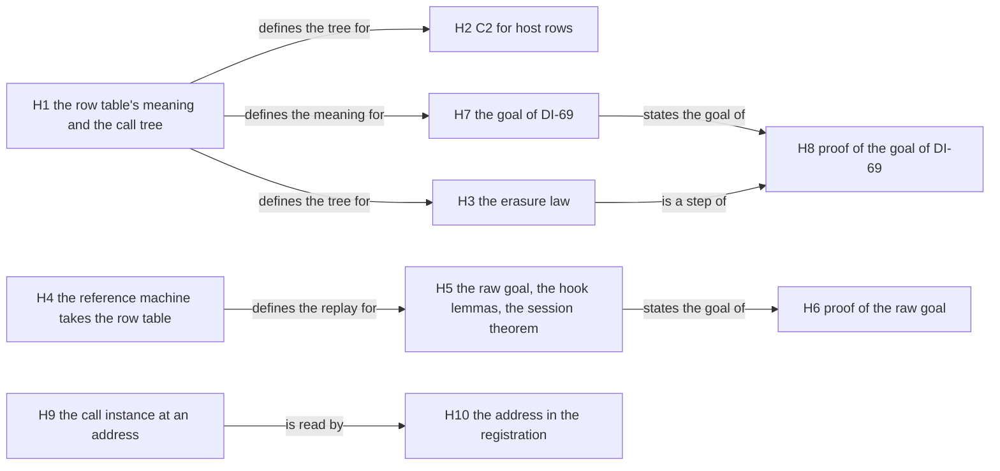

# 2026-10-07 packet: the host meaning (DI-69, DI-57 and the call instance)

Status: a research note (history, not authority). It rules nothing, and it lands nothing. Base:
`0e9de44f`, branch `plan/open-parts`, in the worktree `/Users/pooks/Dev/lean4-effect4-t3b`. The
branch head is `3291bf10`: two commits after the base add four research notes and no source.
The seat changed no tracked file.

The packet prepares three items for an implementer.

- **DI-69**: the call tree of a program over its host rows, and the statement
  `denoteRows_eq_session`.
- **DI-57**: the reference machine at a row table, and the statement `session_eq_ref`.
- **The call instance**: the checker computes the type instance at a host call and keeps no
  record of it.

The words of this packet:

| Word | Meaning here |
| --- | --- |
| call tree | a program's meaning before anything answers its operations: a value of `Effects.Program`. The word is that of `docs/research/2026-10-07-theorems-of-a-program.md` |
| reply tape | the exits that the applied replies of a run give its calls, in call order: `ReplyTape` in the drafts. A tape, alone, is the decision tape |
| draft | Lean text that this packet proposes. Each draft is compiled in a scratch file |
| proved in scratch | the kernel accepted the theorem in a scratch file, with the axiom line `[propext, Quot.sound]`. No draft is landed, and the axiom gate has read none |
| wider fragment | `StraightRows` with `catchIf` admitted: the subject of owner question 1 |

Every Lean text stands in an appendix, as the scratch file holds it. Section 8 gives each
command and its result.

## 1. The one thing the coordinator must know first

**DI-57's ruled statement needs one more premise: the run is funded.** No finite test refutes a
drafted statement of this packet.

The ruled text is `session_eq_ref (p) (table) (t : Tape) (h : t.WellFormed p table)`. Its one
premise is the envelope of each key (`docs/DESIGN-ISSUES.md`, DI-57). Read `replayR p table t`
as the reference machine's replay of the run's tape. The envelope alone then does not carry the
statement.

- **The control (tested).** A program makes three host calls in sequence. A session answers
  each call, at a command budget of 5 and a compile budget of 1000.
- The journal has ten rows: one `progressed`, then `bound`, `preflight` and `applied`, three
  times.
- No row is refused, and no row reports a frontier. Each reply passes the envelope.
- The session's root fiber has its exit, and the session reads `finished`.
- The run's tape holds one decision. The raw replay of that tape stops at a frontier.
- So the two classes differ, and the two observations differ.

The tree names the cause already. A reply application has the verdict `applied` when its guard
is gone, whatever fuel its step had left. The docstring of `funded`
(`src/Effect4/Run/Tape.lean`) says so, under decisions row 226. The tape laws of a run carry
`funded` for that reason. DI-57's row does not carry it. The plan of 2026-10-04 lists the case
as its candidates A15 and A17 (§2.7), and this control checks them at exact budgets. Its slice
P4 asks that a raw corollary state its budget restriction, and no register holds that yet.

The two forms that hold:

| Form | Premise | State |
| --- | --- | --- |
| `session_eq_ref`: the session's reading against the reference machine's replay of the run's tape | the run is recorded and `funded` | proved in scratch from the raw statement `run_eq_ref_table`, which is a planned goal |
| the session's reading against the reference machine that takes each handed decision in turn | the run is recorded | tested on every run, the two runs that are not funded included; worded in appendix L, with no goal yet |

Six more facts change the plan.

1. **The ruled fragment excludes the routing scenario.** `StraightRows` is `Straight` with host
   rows, and `Straight` excludes `catchIf` (`src/Effect4/Program/Fragment.lean`). The routing
   program has two `catchIf` nodes. On the wider fragment the drafted statement holds on each
   tested run, and the laws of slices H1 to H3 are proved in scratch too. This is owner
   question 1 (§6.3).
2. **The fast path is compiled.** The drafts hold 26 theorems proved in scratch, two planned
   goals and one theorem modulo a goal. Seven slices are small, and each compiles as it stands.
3. **The two ruled statements do not wait on the call instance.** Both compare observations,
   and neither reads a type. The call instance serves the typed session (decisions row 99) and
   reply admission at a template row.
4. **The row table matters to the reference machine at two places alone** (tested). They are
   the allocation at a row that answers a handle, and the preloaded answers. On a data row
   today's reference machine agrees with the frame machine already.
5. **One gate number moves.** Slice H5 lands a theorem that rests on a planned goal. The goal
   gate's pin `restingPin` (`Test/Audit/AxiomGate.lean`) then moves from 12 to 13. The packet
   expects no other move of an existing test.
6. **The preloaded answers are ruled to be deleted** (DI-23, the amendment of 2026-09-11). The
   contract's statement of the raw agreement still quantifies over them. This is owner
   question 6.

## 2. What already exists

Evidence word of this section: reading, of the worktree at `0e9de44f`. Section 8 holds the
check that each named declaration stands in its file.

Three reuses save the most work.

1. **The probe of 2026-10-03** gives slice H4 as a patch, and three lemmas of slice H5 (§2.7).
2. **The reference machine has a host call as one node already.** `denoteForeign` writes it,
   `CodeMeans.asyncForeign` relates it to the frame machine's code, and `denoteR_straight` is
   the law that slice H3 extends by one arm (§2.2).
3. **The tape laws of a run** give `session_eq_ref` from the raw statement in 113 lines:
   `tape_replays`, `funded_replays`, `journal_replays` and `replay_eq` (§2.3).

### 2.1 The pinned algebra package (`.lake/packages/effects`, revision `a4ee7a14`)

| Declaration | File under `Effects/` | Use in this packet |
| --- | --- | --- |
| `Alphabet`, `Alphabet.toFamily`, `Family`, `Family.toSignature` | `Family.lean` | the row table as an alphabet, a family and a `Signature` |
| `Family.Service`, `Service.toHandler`, `Service.ofHandler` | `Family.lean` | a host as a record of methods; no slice uses it yet |
| `Signature`, `Signature.sum` | `Algebra/Signature.lean` | the coproduct of the stores and the rows |
| `Program`, `Program.bind`, `Program.inl` | `Algebra/Program.lean` | the call tree |
| `Handler`, `interpret`, `Handler.ext` | `Algebra/Handler.lean` | a host and a reply tape as handlers |
| `interpret_bind`, `Program.bind_assoc` | `Algebra/Laws.lean` | the bind steps of each proof |
| `Handler.sum`, `interpret_inl`, `Program.inl_bind` | `Algebra/Sum.lean` | the connector to `denote` |
| `Handler.through`, `interpret_through` | `Algebra/Handler/Composition.lean` | C2 along an appended table |

The package holds no `Alphabet.ofTable`. `Alphabet.toFamily` takes the denotation of the codes
as an argument, and the ruled text leaves that argument out.

### 2.2 The denotation, the reference machine and the simulation

| Declaration | File under `src/Effect4/` | Use |
| --- | --- | --- |
| `Straight` | `Program/Fragment.lean` | the fragment that `StraightRows` extends |
| `StoreSig`, `denote`, `storeHandler`, `meaning`, `seqExit`, `badShapeExit`, `outsideExit`, `finVoid`, `Straight.bind` and its siblings | `Laws/Program/Denote.lean` | `denoteRows` copies each arm of `denote` |
| the command `fold_of` | `Program/FoldOf.lean` | it converts `denote` in `Laws/Program/Folds/Denote.lean`, and it converts `denoteRows` too (tested) |
| `RSig`, `FiberSig`, `FiberOp.async`, `RProgram`, `meaning_via_rsig` | `Laws/Program/Sched.lean` | the reference machine's `RSig` is a coproduct already; a host call is `FiberOp.async`, and it answers an exit |
| `denoteR`, `denoteForeign`, `denoteAsyncRoute`, `eraseControl`, `denoteR_straight`, `denote_of_inlineYield`, `denoteR_perform`, `denoteR_perform_sync`, `inlineYield_perform_sync`, `denoteR_catchIf` | `Laws/Program/DenoteR.lean` | slice H3 extends `denoteR_straight` by one arm |
| `interpR`, `interpRAt`, `denoteCompletion`, `RSaved` | `Laws/Program/InterpR.lean` | slice H4 adds the row table |
| `evaluateR`, `termEvaluatorFor` | `Laws/Program/EvaluateR.lean` | slice H4 adds the row table |
| `loadR`, `replayR`, `obsR`, `classify`, `run_eq_ref`, `replay_rel`, `load_rel`, `replay_externals`, `straight_ref` | `Laws/Program/RuntimeR.lean` | `run_eq_ref` becomes the instance at the empty row table |
| `CodeMeans.asyncForeign`, `Means` | `Laws/Program/Means.lean` | related codes wait on the same host row |
| `BookMeans`, `StepAgrees`, `HooksAgree`, `book_stepDecisionState`, `book_replayEval`, `book_fiber?_cases` | `Laws/Machine/Book.lean` | the generic simulation: slice H6 discharges its two premises at a row table |
| `stepAgrees`, `hooksAgree_of` | `Laws/Program/Simulation/Drive.lean` | the two premises, at the empty row table today |
| `StoresOk`, `answerCode_means` | `Laws/Program/Simulation/Hooks.lean` | the store invariant, with its clause `allocated = []` |
| `registerAsync_foreign` | `Laws/Program/Simulation/Evaluate.lean` | an external call registers nothing, at the empty row table |
| `drive_localRun`, `Owes`, `PlainCode`, `run_eq_meaning` | `Laws/Program/Agreement/Machine.lean` | the frame machine's proof on `Straight`: one route of slice H8 |
| `Agreement.depth`, `Agreement.depth_pos` | `Laws/Program/Agreement.lean` | the compile budget's measure; it answers 1 at `catchIf` |
| `sum_is_coproduct`, `interpret_inl_restrict` | `Laws/Effects/Sum.lean` | the coproduct law |
| `Protocol`, `Typed`, `Protocol.sum`, `Typed.inl_iff`, `Typed.inr_iff` | `Laws/Effects/Protocol.lean` | a protocol of a row exists as a generic judgment; no slice of this packet uses it |
| `asyncRoute`, `externalRow`, `externalValue`, `prepareExternalAnswer`, `externalAdmits`, `interpOf`, `caughtErrorValue?` | `Program/Compile.lean` | the frame machine reads the row table in two hooks alone |

### 2.3 The session and the run

| Declaration | File under `src/Effect4/` | Use |
| --- | --- | --- |
| `Session`, `start`, `bindCall`, `preflight`, `submit`, `applyReply`, `advance`, `inspect` | `Api/HostSession.lean` | the session side of both statements |
| `Command`, `Runner` | `Api/Runner.lean` | a journal is a list of run commands |
| `load`, `replay`, `Tape.Complete` | `Api.lean` | the frame machine's replay; it takes the row table and the preloaded answers |
| `Run`, `Run.open`, `Run.play`, `Reactor`, `driveFrom`, `runWith` | `Run.lean` | a recorded run; a host as a function |
| `tapeFrom`, `tapeOf`, `funded`, `atRest`, `replayFrom`, `enoughFor`, `replyDecision`, `openedOf` | `Run/Tape.lean` | the tape of a run, and the two premises `funded` and `atRest` |
| `Reached`, `journal_replays`, `open_machine`, `replay_eq`, `replay_machine`, `runOf`, `replayFrom_cons`, `Reactor.Envelops`, `drive_envelope`, `drive_eq_play` | `Laws/Run.lean` | steps of `session_eq_ref` |
| `tape_replays`, `funded_replays`, `tapeFrom_frontier`, `tapeFrom_skip`, `tapeFrom_take`, `tapeFrom_stop`, `step_keeps_machine`, `step_takes_decision` | `Laws/Run/Tape.lean` | steps of `session_eq_ref`. The note of 2026-10-03 asked for them as its statement S2 |
| `applied_selects`, `control_retires` | `Laws/Run/Rows.lean` | nodes of R6 that stand |
| `preflight_envelope`, `applied_guard_absent`, `preflight_success_prepared_fits`, `preflight_failure_noShapeDefect`, `reply_commute` | `Laws/Api/HostSession.lean` | the typed half of a reply, which this packet does not touch |
| `admit`, `admitAnswer`, `requestOf`, `awaits`, `Envelope`, `acceptReply`, `steppedBy` | `Program/Admit.lean` | reply admission |
| `HostSpec`, `LawfulHostSpec`, `DeterministicHostSpec`, `Profile.Scalar`, `Profile.Resource` | `Program/Profile.lean` | a host as a relation; no slice of this packet relates it to a handler |

The semantics registry holds four claims on these laws: `run-controls-replay`,
`run-tape-replay`, `funded-run-replay` and `journal-position-replay`
(`tools/Tools/SemanticsRegistry.lean`). `session_eq_ref` extends `funded-run-replay` from the
frame machine's replay to the reference machine's.

### 2.4 The checker at an address

| Declaration | File under `src/Effect4/` | Use |
| --- | --- | --- |
| `checkRow`, `rowTy`, `bindTerm` | `Program/Typing/Rules.lean` | the row check computes the instance and answers the two instantiated columns |
| `rowTy_closed` | `Laws/Program/Template.lean` | at a closed row the instance is the row's own columns |
| `Focus`, `focusAt`, `envAt` | `Program/Typing/Focus.lean` | the focus at a call's address holds the instantiated columns |
| `focusAt_eq_some`, `focusAt_typed` | `Laws/Program/Typing/Focus.lean` | steps of `callAt_rowTy` |
| `effTy_sound` | `Laws/Program/Typing/Sound.lean` | a step of `callAt_rowTy` |
| `table`, `Table.Entry`, `Node.addresses`, `Node.extSlotEnv` | `Program/Typing/Table.lean` | the address table; its slot for an operation's own term computes the request's match again |
| `bitEntry`, `asyncPre` | `Laws/Program/Typed/Residual.lean` | the proof side reads the row's template columns (decisions row 183) |

### 2.5 Tooling

| Declaration | File | Use |
| --- | --- | --- |
| `proof_goal` | `tools/ProofGraph/Goal.lean` | a planned goal |
| `#plan_status` | `tools/ProofGraph/Plan.lean` | the standing of a node |
| the attribute `semantics` | `src/Effect4/Laws/Auto/Semantics.lean` | a placement tag |
| `restingPin`, `slowLane` | `Test/Audit/AxiomGate.lean` | the goal gate's pin; the list of the slow lane |
| `Scenario`, `NamedRun`, `play`, `answer`, `ok`, `failed` | `Test/Dogfood/Scenario.lean` | the test drivers of §4 |
| `built?` | `Test/Dogfood/P2HandlerLayers.lean` | a built program from a module, in a battery |

### 2.6 Contracts and registers

| Text | Place | State |
| --- | --- | --- |
| "Row table meaning", "One run route" | `Test/contracts/foundation-wave2.contract.md`, the amendment of 2026-09-11 | the ruled words of DI-69 and DI-57 |
| `RunEqRefTableStatement`, "Table-aware agreement" | `Test/contracts/machine-scheduler-core.contract.md` | its replay has a `choices` argument that `Api.replay` no longer takes, and no compile budget |
| "`Eff.catchIf` stays outside `Denote.Straight`" | `Test/contracts/program-denotation.contract.md`; DI-07 | the reason that the routing program is outside the ruled fragment |
| DI-07, DI-23, DI-57, DI-58, DI-65, DI-68, DI-69 | `docs/DESIGN-ISSUES.md` | ruled; no row holds the amendments that §6.3 proposes |
| rows 95, 97 to 100, 138, 183, 226 | `docs/core/decisions.md` | row 99 is open; row 100 is parked; row 226 rules the budget premise |
| the open parts of R2, R6 and R9 | `tools/Tools/SemanticsRegistry.lean` | §7 maps each to a slice. The DI-57 part says "parked by the owner, 2026-09-30" |
| the open parts of the host, and the call instance | `docs/research/2026-10-07-open-parts-pass.md`, findings 1 and 4 | finding 1 asks for these definitions as the first design of the host layer |

### 2.7 Research notes and probes

| Note | What it gives | State at this tree |
| --- | --- | --- |
| `2026-10-03-di57-slice.md`, with `2026-10-03-di57-slice/probe/` | the plan of DI-57 in five commits; a patch that gives the reference machine the row table; three hook lemmas; a measurement of zero proof edits; the rules that keep each commit to one rebuild | untracked, in the main checkout alone (`/Users/pooks/Dev/lean4-effect4/docs/research/`). The patch still applies. The three lemmas compile at this tree. The zero proof edits are measured at `82d34358` alone |
| `2026-10-04-host-lowering-foundation/` (plan, proof map, acceptance, scout review, dispatch, receipt) | the plan of the typed host session in slices P0 to P7, with claims F1 to F11 and acceptance controls A01 to A34 | on the branch `codex/host-lowering-plan` alone (`1b81d1d9`). Its plan says "The owner ratifies this direction on 2026-10-04". No tracked file of this branch records that |
| `docs/research/2026-10-03-data-language/host-instance-follow-on.md` | the call instance: two options, with the metadata by source origin recommended | tracked. It predates the address table (`de7b4044`) |
| `docs/research/2026-09-30-external-runtime-contract.md`, section 5 | the named theorems of the lane: machine agreement, holder agreement, row denotation | tracked; history |
| `docs/research/2026-09-11-eff-formal-foundations-implementation.md`, sections 5 and 6 | the ruled packet of DI-57 and DI-69, with the two statement sketches | tracked; history |
| `docs/research/2026-10-07-theorems-of-a-program.md` | the five kinds of a program's theorem, K1 to K5; the two facts of the to-do application that §4.1 evaluates | tracked |

The plan of 2026-10-04 has a larger scope: the typed session and the OCaml target. This
packet meets it at six places.

| Its claim | Its words | This packet |
| --- | --- | --- |
| F2 `checked-call-origin` | the lookup identifies the addressed call and the exact `checkRow` result | `callAt_rowTy` is its static half (slice H9) |
| F6 `run-eq-ref-table` | related loads and command steps keep the simulation relation; equal `obs` is a corollary | `run_eq_ref_table` is that corollary, as a planned goal (slice H5) |
| F7 `session-command-correspondence` | each command accounts for the machine's change, the phase and the sufficiency | appendix L words its equal-observation form |
| A15, A17 | an applied reply with too little fuel; a published exit against a raw frontier | the control of §1 |
| its slices P1, P3 and P4 | checked origins and instances; the machine agreement at a row table; the correspondence of session commands | slices H9 and H10; slices H4 to H6; `session_eq_ref` and appendix L |
| its choice 1 | checked call metadata beside `TypedProgram`, by the exact program and the full signature | `calls` computes that metadata from the program and the typing signature (owner question 5) |

### 2.8 Other branches

Measured with `git merge-base --is-ancestor <branch> HEAD` in the worktree.

| Branch | Result | Content that this packet reuses |
| --- | --- | --- |
| `codex/park-handshake`, `codex/run-replay-api`, `pc-host-rows-1-2` | each is an ancestor of the worktree's head | none beyond the tree |
| `codex/session-work` | four commits are not ancestors | none: the tree holds its declarations by another route |
| `codex/host-lowering-plan` | one commit is not an ancestor (`1b81d1d9`) | the plan of §2.7, documents alone |

### 2.9 What does not exist

No Lean file under `src`, `tools` or `Test` declares `RowFamily`, `RowSig`, `StraightRows`,
`denoteRows`, `denoteRows_eq_session`, `session_eq_ref`, `Alphabet.ofTable`,
`HostSession.replay` or `Tape.WellFormed`. `replayR` takes no row table. The session's replay
is `Run.play`, and a run's tape is `tapeOf`.

## 3. The definitions and the statements to add

Each draft is compiled with `lake env lean` in the worktree. A placement block follows each
statement (`docs/core/controlled-english.md` §6.5). Each claim id is a proposal for the
semantics registry.

**The name map.** Slice H4 puts the row table on the reference machine's own definitions. A
scratch file changes no tracked file, so the scratch drafts use second names.

| Scratch name | Landing name |
| --- | --- |
| `interpRT root table` | `interpR root table`, with `table` defaulted to `[]` |
| `interpRAtT root completed table` | `interpRAt root completed table` |
| `termEvaluatorForT root table` | `termEvaluatorFor root table` |
| `loadRT program compileFuel answers` | `loadR program fuel compileFuel answers` |
| `replayRT e table fuel tape compileFuel answers` | `replayR e fuel tape compileFuel table answers` |

### 3.1 The row table's meaning and the call tree (slice H1)

File: `src/Effect4/Laws/Program/DenoteRows.lean`, new. Text: appendix A.

```lean
inductive Column | request (ty : Ty) | reply (answer error : Ty)
abbrev Column.carrier : Column → Type            -- a request is a `Val`, a reply is an `ExitV`
def Alphabet.ofTable (table : RowTable) : Effects.Alphabet Column   -- `Op := Fin table.length`
abbrev RowFamily (table : RowTable) : Effects.Family := (Alphabet.ofTable table).toFamily Column.carrier
abbrev RowSig (table : RowTable) : Effects.Signature := (RowFamily table).toSignature
abbrev RowsSig (table : RowTable) : Effects.Signature := Effects.Signature.sum StoreSig (RowSig table)
def dataRow (table : RowTable) (i : Nat) : Bool
def StraightRows (table : RowTable) : NativeEff → Bool
def denoteRows (table : RowTable) : NativeEff → List Val → Effects.Program (RowsSig table) ExitV
def rowsHandler (host : Effects.Handler (RowSig table) (StateT σ Option)) :
    Effects.Handler (RowsSig table) (StateT Stores (StateT σ Option))
def meaningUnder (host : Effects.Handler (RowSig table) (StateT σ Option)) (e : NativeEff)
    (env : List Val) (s : Stores) (state : σ) : Option ((ExitV × Stores) × σ)
abbrev ReplyTape := List ExitV
def tapeHandler (table : RowTable) : Effects.Handler (RowSig table) (StateT ReplyTape Option)
def meaningRows (table : RowTable) (e : NativeEff) (env : List Val) (s : Stores)
    (tape : ReplyTape) : Option ((ExitV × Stores) × ReplyTape)

theorem straightRows_of_straight (table : RowTable) :
    ∀ (e : NativeEff), Straight e = true → StraightRows table e = true
theorem denoteRows_straight (table : RowTable) : ∀ (e : NativeEff) (env : List Val),
    Straight e = true →
    denoteRows table e env = Effects.Program.inl (T := RowSig table) (denote e env)
theorem meaningUnder_straight (host : Effects.Handler (RowSig table) (StateT σ Option))
    (e : NativeEff) (env : List Val) (s : Stores) (state : σ) (hs : Straight e = true) :
    meaningUnder host e env s state = some (meaning e env s, state)
theorem meaningUnder_call (host : Effects.Handler (RowSig table) (StateT σ Option)) (i : Nat)
    (r : Term) (env : List Val) (s : Stores) (state : σ) {v : Val}
    (hv : evalTerm env r = some v) (hi : i < table.length) :
    meaningUnder host (.perform (.external i) r) env s state =
      ((host.handle ⟨⟨i, hi⟩, v⟩).run state).map fun answer => ((answer.1, s), answer.2)
```

Five choices of the draft, each with its reason from the tree:

- **A reply is an exit.** The reference machine's `FiberOp.async` answers an exit. A host answer
  can fail. The ruled monad `StateT Tape Option` has no place for a failure.
- **A name is a position of the table**, a value of `Fin table.length`. The checker refuses a
  position outside the table (tested), so the fragment loses no admitted program.
- **A host is a handler over its own state**, and a reply tape is one host. `meaningRows` is
  `meaningUnder` at `tapeHandler`. `Run.Reactor` has the same shape (appendix J.4).
- **The reply tape is a list of exits, with its own name.** The ruled text says `Tape`. In the
  tree a tape is the decision tape, and `Api.Tape` is its namespace. A call of this fragment
  reads the exits of the tape's answer decisions and nothing else.
- **`denoteRows` has an arm for `catchIf`.** The arm stands outside the ruled fragment. With
  it §4 tests the routing scenario, and owner question 1 changes one line of `StraightRows`.

`dataRow` excludes one kind of row: a row whose answer column is a handle type. Preparation
allocates there alone (`externalValue`, `src/Effect4/Program/Compile.lean`).

Placement of the four theorems (each proved in scratch):

- Concept: `translation-simulation`; property: proposed, "the row denotation extends `denote`"
  (claim `rows-denotation-straight`, role compatibility, pointer `denoteRows_straight`).
- Question: `denoteRows_straight` is the connector of the two denotations. The three others are
  steps of it and of `denoteRows_eq_session`. Consumers: slices H2, H3 and H7.
- Reach: every row table and every environment; `Straight` for the first three; any host handler.
- Does not establish: anything about a run. The meaning under a host is no session. A host
  handler is a function, so it is no relational `HostSpec`.
- Unlocks: R6's part of DI-69 has its definitions. R2's part C2 has its statement (slice H2).

### 3.2 C2 for host rows (slice H2)

File: `src/Effect4/Laws/Program/DenoteRowsAppend.lean`, new. Text: appendix B.

```lean
def embedRow (table ext : RowTable) (op : (RowSig table).Op) : (RowSig (table ++ ext)).Op
def appendRows (table ext : RowTable) :
    Effects.Handler (RowsSig table) (Effects.Program (RowsSig (table ++ ext)))
def restrictRows (table ext : RowTable)
    (host : Effects.Handler (RowSig (table ++ ext)) (StateT σ Option)) :
    Effects.Handler (RowSig table) (StateT σ Option)

theorem denoteRows_append (table ext : RowTable) : ∀ (e : NativeEff) (env : List Val),
    StraightRows table e = true →
    denoteRows (table ++ ext) e env =
      Effects.interpret (appendRows table ext) (denoteRows table e env)
theorem meaningUnder_append (table ext : RowTable)
    (host : Effects.Handler (RowSig (table ++ ext)) (StateT σ Option)) (e : NativeEff)
    (env : List Val) (s : Stores) (state : σ) (hs : StraightRows table e = true) :
    meaningUnder host e env s state =
      meaningUnder (restrictRows table ext host) e env s state
```

Placement (both proved in scratch, on the ruled fragment and on the wider one):

- Concept: `translation-simulation`; property: C2 of DB-01 for host rows (claim
  `rows-denotation-append`, role compatibility, pointer `meaningUnder_append`).
- Question: is an old program's meaning under an appended table its meaning under its own
  table? Consumer: R2's row; an application that gains a host row.
- Reach: `StraightRows table e`; every appended table; every host handler of the appended table.
- Does not establish: C2 outside the fragment, where it stays operational. It says nothing of
  the checker (C3) or of protocol typing (C4).
- Unlocks: R2's open part "C2 for host rows" closes on the fragment.

### 3.3 The reference machine's term, erased (slice H3)

File: `src/Effect4/Laws/Program/DenoteRowsR.lean`, new. Text: appendix C.

```lean
def toRef (table : RowTable) : Effects.Handler (RowsSig table) (Effects.Program RSig)

theorem denoteRows_of_inlineYield (table : RowTable) :
    ∀ (b : NativeEff) (q : Point) {exit : ExitV},
    StraightRows table b = true → inlineYield b q = some exit →
    denoteRows table b q.env = Effects.Program.pure exit
theorem denoteR_straightRows (root : NativeEff) (table : RowTable) :
    ∀ (e : NativeEff) (p : Point),
    StraightRows table e = true → Agreement.depth e ≤ p.fuel →
    eraseControl (denoteR root e p) = Effects.interpret (toRef table) (denoteRows table e p.env)
```

Placement (both proved in scratch):

- Concept: `translation-simulation`; property: proposed, "the row denotation is the reference
  machine's term, erased" (claim `rows-denotation-reference`, role compatibility).
- Question: is `denoteRows` the tree that the reference machine runs? Consumers: the reference
  route of slice H8, and a later `straight_ref` with host rows.
- Reach: `StraightRows`; a compile budget that covers the program's depth; every root.
- Does not establish: a run. Erasure runs a guard's continuation on every exit, as the docstring
  of `denoteR_straight` says of its own statement.
- Unlocks: a check on every program of the fragment that `denoteRows` is the meaning that the
  tree has. No finite test gives that.

On the wider fragment the law needs one more definition. `Agreement.depth` answers 1 at
`catchIf`, so its premise does not cover the children of a `catchIf`. The variant states the law
with a measure that counts them (`depthRows`, appendix K).

### 3.4 The reference machine at a row table (slice H4)

Files: `InterpR.lean`, `EvaluateR.lean` and `RuntimeR.lean` under `src/Effect4/Laws/Program/`,
edited. Text: appendix E, the patch of 2026-10-03 and the two edited definitions of
`RuntimeR.lean`. Appendix D holds the same content under the scratch names.

```lean
def externalIndexR : Option RProgram → Option Nat
def prepareAtR (table : RowTable) (index : Option Nat)
    (answer : Completion Val Err Defect FiberId Ann) (state : Stores) : Stores × RProgram
def registerExternalR (table : RowTable) (i : Nat) (state : Stores) : Stores × Option RProgram
def interpR (root : NativeEff) (table : RowTable := []) : RInterp
def interpRAt (root : NativeEff) (completed : List (FiberId × ExitV)) (table : RowTable := []) : RInterp
def loadR (program : NativeEff) (fuel : Nat) (compileFuel : Nat := fuel)
    (answers : List (Completion Val Err Defect FiberId Ann) := []) : RState
def replayR (program : NativeEff) (fuel : Nat) (tape : List Api.Decision)
    (compileFuel : Nat := fuel) (table : RowTable := [])
    (answers : List (Completion Val Err Defect FiberId Ann) := []) : RReplay
```

The slice adds definitions and no theorem. `run_eq_ref` keeps its statement: its `replayR`
elaborates at the two defaults. `termEvaluatorFor` takes the same defaulted parameter.

The patch edits two files, and the note measured those two. The edit of `RuntimeR.lean` is not
in the patch: appendix E.2 drafts it. The landing form of all three compiles in one scratch
file, on copies (appendix E.3). There the raw statement holds at the landing names, on the same
tapes. Not compiled: the proofs that stand downstream of the three files.

### 3.5 The raw statement and the session statement (slice H5)

Three new files. Text: appendix D (sections B and C), appendix F and appendix H.

| File | Holds | Imports |
| --- | --- | --- |
| `src/Effect4/Laws/Program/Table/Hooks.lean` | `frameIndex` and the three hook lemmas | `Effect4.Laws.Program.Simulation.Fibers` alone, so it stands above the simulation's drive, where slice H6 uses it |
| `src/Effect4/Laws/Program/Table/Agreement.lean` | `RunEqRefTable` and the goal `run_eq_ref_table` | `Effect4.Laws.Program.RuntimeR` and `Effect4.Laws.Auto.Semantics` |
| `src/Effect4/Laws/Api/SessionRef.lean` | `SessionEqRef`, the session lemmas and `session_eq_ref` | the file above and `Effect4.Laws.Run.Tape` |

```lean
def RunEqRefTable : Prop :=
  ∀ (e : NativeEff) (table : RowTable) (fuel : Nat) (tape : List Api.Decision)
    (answers : List (Completion Val Err Defect FiberId Ann)) (compileFuel : Nat),
    (Api.replay e fuel tape answers table compileFuel).outcome =
        classify (replayR e fuel tape compileFuel table answers) ∧
      obs (Api.replay e fuel tape answers table compileFuel).machine =
        obsR (replayR e fuel tape compileFuel table answers).machine

@[semantics "translation-simulation" (requirement := R6)]
proof_goal run_eq_ref_table : RunEqRefTable

theorem index_agree (root : NativeEff) {c₁ : NCode} {c₂ : RProgram} (h : CodeMeans root c₁ c₂) :
    frameIndex (some c₁) = externalIndexR (some c₂)
theorem prepare_agree (root : NativeEff) (table : RowTable) (cur : Option NCode)
    (answer : Completion Val Err Defect FiberId Ann) (state : Stores) :
    (prepareExternalAnswer table cur answer state).1 =
        (prepareAtR table (frameIndex cur) answer state).1 ∧
      CodeMeans root (prepareExternalAnswer table cur answer state).2
        (prepareAtR table (frameIndex cur) answer state).2
theorem prepareAsync_agree (root : NativeEff) (table : RowTable) (a : FMachine) (b : RState)
    (h : BookMeans (CodeMeans root) (Means root) a b) (id : FiberId) (token : Nat)
    (answer : Completion Val Err Defect FiberId Ann) :
    (prepareAsyncAnswer (interpOf root table) a id token answer).1 =
        (prepareAsyncAnswer (interpR root table) b id token answer).1 ∧
      CodeMeans root (prepareAsyncAnswer (interpOf root table) a id token answer).2
        (prepareAsyncAnswer (interpR root table) b id token answer).2

def SessionEqRef : Prop :=
  ∀ (s : Run), Run.Reached s → Run.funded s = true →
    s.inspect.outcome =
        classify (replayR s.built.program s.budget.fuel (Run.tapeOf s) s.budget.compileFuel
          s.built.table) ∧
      obs s.machine =
        obsR (replayR s.built.program s.budget.fuel (Run.tapeOf s) s.budget.compileFuel
          s.built.table).machine

theorem tape_replays_result (s : Run) (rows : List Command) (h : (tapeFrom s rows).2 = []) :
    Run.replayFrom s.built.program s.built.table s.budget.fuel
        ((tapeFrom s rows).1.map (·.decision)) s.machine =
      Run.replayFrom s.built.program s.built.table s.budget.fuel [] (s.play rows).machine
theorem inspect_outcome (s : Run) :
    s.inspect.outcome =
      classify (Run.replayFrom s.built.program s.built.table s.budget.fuel [] s.machine)
theorem session_eq_ref_of_raw
    (reference : NativeEff → RowTable → Nat → List Api.Decision → Nat → RReplay)
    (raw : ∀ e table fuel tape compileFuel,
      (Api.replay e fuel tape [] table compileFuel).outcome =
          classify (reference e table fuel tape compileFuel) ∧
        obs (Api.replay e fuel tape [] table compileFuel).machine =
          obsR (reference e table fuel tape compileFuel).machine)
    (s : Run) (recorded : Run.Reached s) (h : funded s = true) :
    s.inspect.outcome =
        classify (reference s.built.program s.built.table s.budget.fuel (tapeOf s)
          s.budget.compileFuel) ∧
      obs s.machine =
        obsR (reference s.built.program s.built.table s.budget.fuel (tapeOf s)
          s.budget.compileFuel).machine

@[semantics "translation-simulation" (requirement := R6)]
theorem session_eq_ref : SessionEqRef
```

`session_eq_ref_of_raw` reads the raw statement at no preloaded answer. A session loads none.

Placement of `run_eq_ref_table` (a planned goal):

- Concept: `translation-simulation`; property: proposed, "the reference machine simulates the
  frame machine at a row table" (claim `run-eq-ref-table`, role simulation).
- Question: do the frame machine and the reference machine agree at every row table? Consumer:
  `session_eq_ref`. The three hook lemmas are steps of it, and their consumer is `hooksAgree_of`
  at a row table (slice H6).
- Reach: every program, row table, tape, list of preloaded answers and pair of budgets. The
  observation is `obs`: each fiber's exit and the whole stores. It takes no premise on the tape.
- Does not establish: reply admission, the typing of a reply, a host's conformance, the
  session's ledger. Rows 95 and 138 keep M6 and M7 at the empty row table.
- Unlocks: `session_eq_ref`; R6's part of DI-57; a later statement of M7 at a row table (§7).

Placement of `session_eq_ref` (proved in scratch modulo `run_eq_ref_table`):

- Concept: `translation-simulation`, with `host-session-protocol`; property: proposed, "a
  session's reading is the reference machine's replay of its tape" (claim `session-eq-ref`, role
  simulation).
- Question: DI-57's statement. Consumer: the typed session (decisions row 99); the meaning of a
  run's certificate.
- Reach: any built program and any journal; the run is recorded (`Run.Reached`) and `funded`.
- Does not establish: that a run is funded (the proposed claim `embedded-budget-sufficient`);
  the session's ledger; reply admission. A run with a stopped row is outside it.
- Unlocks: R6's part of DI-57 becomes a theorem modulo one goal.

### 3.6 The statement of DI-69 (slice H7)

File: `src/Effect4/Laws/Api/SessionMeaning.lean`, new. Text: appendix G and appendix H.

```lean
def hostDecision : Api.Decision → Bool      -- the root's evaluation, a flush, an answer with an exit
def exitsOf (tape : List Api.Decision) : ReplyTape
def appliedExits (s : Run) : ReplyTape := exitsOf (tapeOf s)
def hostDriven (s : Run) : Bool := (tapeOf s).all hostDecision
def DenoteRowsEqSession (frag : RowTable → NativeEff → Bool) : Prop :=
  ∀ (s : Run), Run.Reached s → funded s = true → atRest s = true → hostDriven s = true →
    frag s.built.table s.built.program = true →
    meaningRows s.built.table s.built.program [] Stores.empty (appliedExits s) =
      s.exit.map fun ex => ((ex, s.machine.state), [])

@[semantics "translation-simulation" (requirement := R6)]
proof_goal denoteRows_eq_session : DenoteRowsEqSession StraightRows
```

Each premise reads the run's tape or the run's machine, as both sides of the equation do. A row
that the session refuses hands the machine nothing, so no premise reads it.

Placement (a planned goal):

- Concept: `translation-simulation`; property: proposed, "the row denotation under a run's
  reply tape is the run's observation" (claim `rows-denotation-session`, role simulation).
- Question: DI-69's statement. Consumer: a fact of a program's call tree, read on a run. The
  routing scenario's two planned goals are the first, if owner question 1 is answered yes.
- Reach: `StraightRows`, one fiber. The run is recorded, `funded`, `atRest` and `hostDriven`.
  The observation is the root's exit with the stores, or the frontier.
- Does not establish: the same for a run with an interruption, a clock step, a delayed cell
  read or a handle row. Each has a red control. It says nothing of a fiber, a scope or a loop.
- Unlocks: R6's part of DI-69 leaves the list of open parts, as a planned goal.

### 3.7 The call instance (slice H9)

Files: `src/Effect4/Program/Typing/Call.lean` and `src/Effect4/Laws/Program/Typing/Call.lean`,
both new. Text: appendix I.

```lean
structure CallInstance (Op : Type) where
  op : Op
  request : Ty
  answer : Ty
  error : Ty
def callAt (s : Signature Op) (env0 : TyEnv) (p : Eff Op) (path : List Nat) :
    Option (CallInstance Op)
def calls (s : Signature Op) (env0 : TyEnv) (p : Eff Op) : List (List Nat × CallInstance Op)

theorem callAt_rowTy {c : CallInstance Op} (h : callAt s env0 p path = some c) :
    ∃ (request : Term) (env : TyEnv) (t : EffTy),
      (Node.eff p).at_ path = some (.eff (.perform c.op request)) ∧
      (Node.eff p).envAt s (.env env0) path = some (.env env) ∧
      termTy s env request = some c.request ∧
      rowTy (s.rowOf c.op) c.request (s.termUse env c.op) = some t ∧
      t.answer = c.answer ∧ t.error = c.error
```

**Where the instance is kept.** It is derived data at the call's address. `focusAt` already
answers the instantiated columns there, as the focus's type. `callAt` projects them, and it adds
the request's type. Nothing is stored in `Eff`, and no certificate gains a field.

**What reads it.** No declaration reads it today. Five readers are named, in this order of need.

| Reader | Declaration | What it reads today |
| --- | --- | --- |
| reply admission and preparation | `admitAnswer` (`src/Effect4/Program/Admit.lean`); `externalAdmits`, `prepareExternalAnswer` (`src/Effect4/Program/Compile.lean`) | the row's template columns |
| the proof side of a host call | `bitEntry` (`src/Effect4/Laws/Program/Typed/Residual.lean`) | the row's template columns |
| a protocol of a row, on the call tree | `Protocol` (`src/Effect4/Laws/Effects/Protocol.lean`) | nothing yet |
| the printed call's type arguments | the field `typeArgs` of `Row` (`src/Effect4/Program/Eff.lean`) | text that the row's author writes |
| the query function | `tools/Tools/Query.lean` | nothing yet |

The first reader runs when a reply arrives. It then needs the call's address, and the
registration does not hold it. `asyncRoute` (`src/Effect4/Program/Compile.lean`) builds the
name `EffName.external op v` from the operation and the request's value alone. Keeping the
address in that name changes an alphabet of the machine's code. That is slice H10, and it waits
on owner question 5 (§6.3).

Placement of `callAt_rowTy` (proved in scratch):

- Concept: `initial-algebras-folds`, beside the claim `address-table`; property: proposed, "the
  call instance at an address is the row check's answer" (claim `call-instance-address`, role
  inversion).
- Question: which instance did the checker choose at this call? Consumers: slice H10, and a
  repair of `bitEntry`.
- Reach: every typing signature, program and address. The program around the call needs no type.
- Does not establish: that a run's call stands at that address. No registration records it.
- Unlocks: R14's missing part of finding 4 of `docs/research/2026-10-07-open-parts-pass.md`:
  the checker computes the type instance and does not keep it.

## 4. The truth tests

Evidence word of this section: tested. Each line is a finite evaluation by `#guard` in a scratch
file. Section 8 names the file of each.

### 4.1 DI-69: the tree, and `denoteRows_eq_session`

| Input | What is evaluated | Result |
| --- | --- | --- |
| `add` at an empty title | the tree | a leaf with the `EmptyTitle` failure: no call |
| `add` at a title | the tree | one call of row 0 with the title |
| `complete` | the tree's continuation at a repository failure | a leaf with that failure |
| the routing program | the tree's continuation at a configuration with another token | a leaf with the handler's response: no call of the repository |
| the routing program | the tree after the request's token, at a repository failure with an infrastructure tag | a leaf with that failure: no handler takes it |
| the four to-do programs, 11 runs | every premise, and the two sides | all hold; a reply outside the answer column leaves both sides waiting |
| the routing scenario, its 11 named runs | the same | `StraightRows` is false, and the two sides agree on all 11 |
| the routing program under 6 failing causes on its repository row | the same | the two sides agree; two causes mix a typed failure with an interruption, and one holds two typed failures |
| 8 raw programs, one or more for each constructor of the fragment, 17 runs | the same | all hold |
| 6 constructs under 4 failing causes: a defect, an interruption, an empty cause, a mixed cause | the same | all 24 hold |
| 2,117 programs of depth at most three, 15 reply patterns each | the count of disagreements under the premises | 31,755 runs, 0 disagreements |
| 290 programs inside a cell's life, written by a finalizer and by a handler | the same | 4,350 runs, 0 disagreements |
| the wider fragment: 3,480 `catchIf` programs, 15 reply patterns each | the same | 52,200 runs, 0 disagreements |
| an in-memory repository as a host function, 8 drives | `Run.runWith` against `meaningUnder` at that host | they agree, with the repository's state |
| the same repository: `add`, then `list` | the exit of `list` | it holds the new to-do: a fact under one model of the repository |

The first five lines are facts of kind K2 of the note on a program's theorems. The fourth and
the fifth are the routing scenario's two planned goals, read on one tree at one answer.

The controls: for each premise one run where it fails and the two sides disagree.

| Premise | Control | Sides |
| --- | --- | --- |
| `hostDriven` | an interruption of the root while it waits | disagree |
| `hostDriven` | a clock step before a clock read | disagree |
| `hostDriven` | a delayed cell read as the applied reply | disagree |
| `funded` | three calls at a command budget of 5; the run is at rest | disagree; 6 is the least funded command budget, and 3 the least compile budget |
| `atRest` | a program with no call, not started | disagree |
| `dataRow` | a row that answers a handle; the reply allocates | disagree |
| the table's domain | a position outside the table | the checker refuses the program |

One probe is no guard. With the reply tape read from every handed decision, the two sides agree
at each command budget from 0 to 11 on the three calls. So `funded` may be more than the
statement needs. The packet does not claim it.

### 4.2 DI-57: `run_eq_ref_table` and `session_eq_ref`

| Input | What is evaluated | Result |
| --- | --- | --- |
| 10 to-do runs; the 11 routing runs | both statements, at the run's own tape | all hold |
| 85 named runs of five scenarios, 74 with at least two fibers | the raw statement | 85 hold |
| the same 85 | the session statement | it holds on the 83 funded runs |
| the same 85 | the session against each handed decision, with no budget premise | 85 hold |
| 4 programs, every tape of at most 3 decisions from an alphabet of 28 | the raw statement | 91,060 pairs of a tape and a program, 0 disagreements |
| 5 lists of preloaded answers: one refused by its column, one too short, two at handle rows | the raw statement | all hold |
| the contract's counterexample: request 7, reply 9, fuel 40 | the raw statement | holds; today's reference machine stays at a frontier |
| the three calls at each command budget from 0 to 40; two handles from 0 to 29 | the session against each handed decision | all hold; 6 of the 41 budgets are not funded |
| every tape of at most 2 decisions, at the empty row table | the table-aware reference machine against today's | equal class and equal observation on 813 tapes |

The alphabet of 28 decisions holds answers that no session admits. It holds a text at a number
row, a token that no call holds, a fiber that does not wait and a missing cell. One of the four
programs has two fibers, and one has handle rows.

The controls:

| What | Control | Result |
| --- | --- | --- |
| `funded` in `session_eq_ref` | the three calls at a command budget of 5 | the session statement fails, and the raw statement holds |
| `funded` in `session_eq_ref` | the runs `starved` and `dropped` of the queue-workers scenario | the same |
| the row table on the reference machine | three runs at a handle row | today's reference machine disagrees, and the table-aware one agrees |
| the row table on the reference machine | the two-handle program, tapes of at most 3 decisions | today's reference machine disagrees on 1,993 of 22,765 tapes |

### 4.3 The call instance

| Input | What is evaluated | Result |
| --- | --- | --- |
| the four to-do programs | `calls`: address, position, request type and both columns | the instance is the row's own columns: each row is closed |
| a template row from `List<A>` to `Option<A>`, one program text | `callAt` at two typing environments | two instances: `Option<nat>` and `Option<string>` |
| the same row | `externalAdmits` at `some 1` and at `none` | it refuses the first and admits the second |

The last line is the finding of decisions row 183, at the check that runs when a reply
arrives. By reading: 23 lines of the Lean files under `src`, `Test`, `tools` and `harness` name
`Row.host`, and none names a type variable.

## 5. The slices, in commit order

The diagram shows what each slice needs. It claims no schedule.



Sizes: S is under a day, and its text compiles in scratch. M is days of mechanical edits. L is
a week or more of new proof.

| Slice | Files | Size, with its reason | Needs | Existing tests and gates that move |
| --- | --- | --- | --- | --- |
| H1 | new: `src/Effect4/Laws/Program/DenoteRows.lean`, `src/Effect4/Laws/Program/Folds/DenoteRows.lean`, `Test/Program/DenoteRowsContract.lean`; import lines in `src/Effect4/Laws.lean` and `Test/All.lean` | S: appendix A compiles as it stands, 403 lines and two fold commands | nothing | none |
| H2 | new: `src/Effect4/Laws/Program/DenoteRowsAppend.lean`; three lines in H1's battery | S: appendix B compiles, 136 lines | H1 | none |
| H3 | new: `src/Effect4/Laws/Program/DenoteRowsR.lean`; one line in H1's battery | S: appendix C compiles, 289 lines | H1 | none |
| H9 | new: `src/Effect4/Program/Typing/Call.lean` (a `module` file), `src/Effect4/Laws/Program/Typing/Call.lean`, `Test/Program/CallInstance.lean`; an import line in `src/Effect4.lean` too | S: appendix I compiles | nothing | none expected. The case policy may ask for a row (§6.1) |
| H4 | edited: `InterpR.lean`, `EvaluateR.lean`, `RuntimeR.lean` under `src/Effect4/Laws/Program/` | S, with one rebuild of the cone of `InterpR.lean`: the patch applies, and the definitions of the three files compile in the landing form (appendix E.3); zero proof edits downstream are measured at `82d34358` alone | nothing | none expected: each new parameter has a default |
| H5 | new: `src/Effect4/Laws/Program/Table/Hooks.lean`, `src/Effect4/Laws/Program/Table/Agreement.lean`, `src/Effect4/Laws/Api/SessionRef.lean`, `Test/Program/TableReference.lean` | S: appendices D, F and H compile | H4 | `restingPin` moves from 12 to 13 |
| H7 | new: `src/Effect4/Laws/Api/SessionMeaning.lean`, `Test/Api/SessionMeaning.lean` | S: appendices G and H compile | H1 | none; the count of planned goals grows by one, and the gate logs it |
| H6 | edited: seven of the eight files of `src/Effect4/Laws/Program/Simulation/`, and `RuntimeR.lean` | M to L: the table threaded through the simulation's statements, the clause `StoresOk.externals` made conditional, one registration arm. The eight files and `RuntimeR.lean` name the interpreter with no table at 147 places | H5 | `restingPin` moves back to 12. Two battery files apply `replay_rel` and `load_rel` by position; none moves if the table is an implicit argument |
| H8 | new: files beside `src/Effect4/Laws/Program/Agreement/Machine.lean` | L: a local run with calls, and the command loop across a park and an answer decision | H7; H3 on the reference route | none |
| H10 | edited: `src/Effect4/Program/Compile.lean`, `src/Effect4/Program/Admit.lean` and the generated alphabets | M to L: a name of the machine's code gains a field, and the cone is the largest of the tree | H9; owner question 5 | the compatibility fixtures; not measured |

Slices H1, H2, H3, H9, H4, H5 and H7 are the fast path. Each is S. Slices H6, H8 and H10 are
proof work and representation work, and no slice of the fast path waits on them.

**The coordinator's edits, by slice.**

| Slice | Semantics registry and documents |
| --- | --- |
| H1 | a claim `rows-denotation-straight`; `docs/core/semantics.md` §2.10 gains the property; R6's part of DI-69 changes its text; a row of `docs/ARCHITECTURE.md` for each new file |
| H2 | a claim `rows-denotation-append`; R2's top gains `meaningUnder_append`; R2's part C2 is worded again for what stays operational |
| H3 | a claim `rows-denotation-reference` |
| H5 | claims `run-eq-ref-table` and `session-eq-ref`; R6's part of DI-57 leaves the list; `restingPin`; DI-57's row and the two contracts take the statement's form (owner question 2); the docstring of `run_eq_ref` |
| H7 | a claim `rows-denotation-session`; R6's part of DI-69 leaves the list; DI-69's row takes the fragment and the premises (owner questions 1 and 4) |
| H9 | a claim `call-instance-address`; R14 gains the part of finding 4; `docs/STATE.md` names the instance's home |

**The import lines, by slice.** `AGENTS.md` gives the anchor of a root import to the brief, so
each anchor below is a proposal.

| Slice | Root | Lines | Proposed anchor: after |
| --- | --- | --- | --- |
| H1 | `src/Effect4/Laws.lean` | `import Effect4.Laws.Program.DenoteRows`; `import Effect4.Laws.Program.Folds.DenoteRows` | `import Effect4.Laws.Program.Folds.Denote` |
| H1 | `Test/All.lean` | `import Test.Program.DenoteRowsContract` | `import Test.Program.SimulationContract` |
| H2 | `src/Effect4/Laws.lean` | `import Effect4.Laws.Program.DenoteRowsAppend` | H1's lines |
| H3 | `src/Effect4/Laws.lean` | `import Effect4.Laws.Program.DenoteRowsR` | `import Effect4.Laws.Program.DenoteR` |
| H9 | `src/Effect4.lean` | `import Effect4.Program.Typing.Call` | `import Effect4.Program.Typing.Table` |
| H9 | `src/Effect4/Laws.lean` | `import Effect4.Laws.Program.Typing.Call` | `import Effect4.Laws.Program.Typing.Table` |
| H9 | `Test/All.lean` | `import Test.Program.CallInstance` | `import Test.Program.TableControls` |
| H5 | `src/Effect4/Laws.lean` | `import Effect4.Laws.Program.Table.Hooks`; `import Effect4.Laws.Program.Table.Agreement`; `import Effect4.Laws.Api.SessionRef` | `import Effect4.Laws.Program.RuntimeR` |
| H5 | `Test/All.lean` | `import Test.Program.TableReference` | H1's line |
| H7 | `src/Effect4/Laws.lean` | `import Effect4.Laws.Api.SessionMeaning` | H5's lines |
| H7 | `Test/All.lean` | `import Test.Api.SessionMeaning` | `import Test.Api.RunnerContract` |

### 5.1 The minimal battery lines

Each line is a reader, a control or a finite evaluation (decisions row 301). No line restates a
theorem, and none prints axioms. Appendix J holds the text of each battery. Each compiles in
scratch.

| Battery | Lines | Kinds | Time in scratch |
| --- | --- | --- | --- |
| `Test/Program/DenoteRowsContract.lean` (H1, H2, H3) | 14 | 5 finite evaluations of a tree; 3 readers (`meaningUnder_straight`, `meaningUnder_append`, `denoteR_straightRows`); 6 controls | 3 s, the drafts included |
| `Test/Program/CallInstance.lean` (H9) | 7 | 2 finite evaluations; 5 controls | 2 s |
| `Test/Program/TableReference.lean` (H5) | 11 | 11 finite evaluations of the two statements; 5 of them hold a control | 7 s |
| `Test/Api/SessionMeaning.lean` (H7) | 15 | 9 finite evaluations of the statement; 6 controls | 3 s |

The batteries of H5 and H7 hold the finite evidence of a planned goal. They shrink in the slice
that proves the goal, as row 301 says of the finite controls of a claim.

Two more files are candidates for the slow lane, and no slice lands them (appendix J.5). One
holds the tapes of three decisions, and its run took 41 seconds. The other holds the sweep of
2,117 programs, and its run took 60 seconds. A run's time moves with the machine's load. The
coordinator decides the two files: each needs a line in `slowLane` and in `Test/Slow.lean`.

### 5.2 The proof slices

**Slice H6, in two parts.** The rules are those of the note of 2026-10-03 (§2.7). The third
step is this packet's proposal. The packet rehearsed no step of H6.

1. H6a: prove the raw statement at no preloaded answer. Thread the row table through the
   simulation as an implicit argument.
2. Make the clause `StoresOk.externals` conditional: `allocated = []` at the empty row table.
   `replay_externals` and the exit connector keep their statements.
3. Add one clause to the store invariant: the list of preloaded answers stays empty. The
   registration arm then answers `none` on both machines.
4. Point `session_eq_ref` at the instance of H6a. It then rests on no goal, and `restingPin`
   moves back to 12.
5. H6b: prove the registration arm's answered case. `run_eq_ref_table` is then a theorem.

H6b has no consumer on the spine: a session loads no preloaded answer, and DI-23 deletes the
list. The coordinator decides H6b after owner question 6.

**Slice H8, two routes.** The packet rehearsed neither.

| Route | First step | Reuses | Cost of `catchIf` |
| --- | --- | --- | --- |
| the frame machine | a local run of compiled code that stops at a host call and resumes at an answer decision | `drive_localRun`, `Owes`, `PlainCode` of `run_eq_meaning` | two to three days more, by DI-07's estimate |
| the reference machine | a run of the reference machine on the erased term, then `denoteR_straightRows` and slice H6a | `denoteR_straightRows` (H3); `run_eq_ref_table` | none beyond the variant of appendix K |

Both routes start with the same reduction. `funded_replays` gives the run's machine as the raw
replay of its tape. Both sides of the statement then read the program, the row table, the
budgets and the tape alone. So the first lemma of H8 is a statement about the frame machine's
replay, with no session in it.

## 6. Risks, stop rules and open questions

### 6.1 Risks

| Risk | Evidence | What the implementer does |
| --- | --- | --- |
| H4's zero proof edits do not hold at this tree | measured at `82d34358`; 876 commits since; two of the three files gained 11 lines; the patch applies with offsets | the first stop rule |
| H4's edit of `RuntimeR.lean` breaks a proof of that file | the edit is not in the measured patch. The edited definitions compile with two of the file's statements, each by `rfl` (appendix E.3). `load_rel` closes its store clause by `rfl` at `Api.load`, which has the same form | repair inside the file, and report it |
| H4's registration arm splits on the operation before the table | the note of 2026-10-03: `externalAsyncParks` then loses a reduction | the arm tests `table.isEmpty` first, as the patch writes it |
| H5 moves the goal gate's pin | `restingPin` counts each declaration that rests on a goal; `session_eq_ref` is one more | the coordinator moves the pin with the merge, at the anchor |
| H5 and H7 land the first planned goals of the law graph | the 28 planned goals of the tree stand in `Test` files (§8). The goal gate reads a law-graph goal's placement, and that branch has met no goal of the tree | each goal carries `@[semantics "translation-simulation" (requirement := R6)]`, which compiles; the coordinator runs the gate at the merge |
| H9's match on `Eff` meets the case policy | `callAt` has one match on a program with a catch-all, in a core file. The family `Effect4.Program.Eff` refuses a site that the policy does not list. `Node.extSlotEnv` has such matches and no row, so the audit may not see them. Not run | run `make check-cases` after H9; add the row if it refuses |
| H6 moves a statement that M5 to M7 read | `StoresOk.externals` feeds `replay_externals` and the exit connector | keep `allocated = []` at the empty row table as a conditional clause |
| a goal is false | 103 guards in the wide tests and 44 in the batteries, with no refutation; each premise has a control | keep each control as a line of its battery |
| a battery's equality does not elaborate | instance search fails at default limits on the equality of a nested option of products, and at a request's column carrier | compare component by component, and name `Val`, as appendix J does |
| a draft breaks the proof-style ratchet | a search of the drafts finds no `simp_all`, no `first` and no `try`; each `simp` names its lemmas | none |

### 6.2 Stop rules

1. Stop slice H4 if any file outside its three needs a proof edit. Report the first error.
2. Stop slice H6 if `run_eq_ref`, `replay_externals` or a statement under
   `src/Effect4/Laws/Program/Typed/` must change.
3. Stop slice H6 after H6a. Report, and wait for the word on H6b.
4. Stop slice H8 if the local run with calls does not close for `onExit` in three days. State
   the fragment without `onExit`, with its control.
5. Stop any slice whose guard fails. A failed guard of §4 is a finding, and it goes first in the
   receipt.
6. Do not state a goal whose finite test is not in its battery.
7. Do not edit a file under `src/Effect4/Program/` or `src/Effect4/Machine/` in slices H1 to H8.
   Slice H9 adds one new file there.

### 6.3 Open questions

**Answered from the tree.**

| Question | Answer | Evidence |
| --- | --- | --- |
| Can a program call a position outside its table? | No. The checker refuses it as `outsideDomain`. | tested (§4.1) |
| Does the raw agreement need the envelope? | No. Both machines share preparation, its fallback included. | tested on 91,060 pairs, with answers that no session admits |
| Does the session statement need the preloaded answers? | No. `session_eq_ref_of_raw` reads the raw statement at none. | proved in scratch |
| What are `HostSession.replay` and `Tape`? | `Run.play` on a journal, and `tapeOf` of the run. | reading (§2.9) |
| Which decisions may a host-driven tape hold? | The root's evaluation, a flush, and an answer with an exit. | tested: an interruption, a clock step and a delayed cell read each break the statement |
| Does the premise read the journal or the tape? | The tape. A refused row and a reply that is never applied hand the machine nothing. | tested on four runs (§8) |
| Does `fold_of` convert `denoteRows`? | Yes, with the table as a parameter. | tested: `denoteRows.eq_cata` is generated |
| When does a reply's preparation allocate? | At a top-level handle type of the answer column alone. | reading of `externalValue` |
| Is the answer of a host call an exit or a value? | An exit. `FiberOp.async` answers one, and the ruled monad holds no failure. | reading; owner question 3 asks for the confirmation |
| Does the core file of H9 compile as a `module` file? | Yes. | tested (`P41_CallModule.lean`) |

**For the owner.** Each is a question of meaning, of supported domain or of representation.

1. **Supported domain.** Does the fragment of DI-69 admit `catchIf`? The ruled text says
   straight-line plus host rows, and DI-07 keeps `catchIf` outside `Straight`. Recommended:
   yes. The routing scenario's two planned goals need it. The statement holds on 52,200 tested
   runs and on the routing runs. The laws of H1 to H3 are proved in scratch on the wider
   fragment. The cost is one arm in each of three proofs, and one depth measure. For slice H8
   the cost depends on the route (§5.2).
2. **Meaning.** Which statement is DI-57's `session_eq_ref`? Recommended: the form under
   `funded`, over `Run` and `tapeOf`, with no envelope premise. The form with no budget premise
   becomes a planned goal with slice H6. The ruled text names `HostSession.replay` and
   `WellFormed`, and the tree has neither.
3. **Representation.** Is a reply's carrier in the call tree an exit, through a code type of two
   constructors (`Column`)? The other option keeps `Ty` as the code and a reified exit value as
   the carrier. Recommended: the exit. It needs no decoding arm, and it is the reference
   machine's own answer type.
4. **Supported domain.** Does the first statement of DI-69 exclude a handle row and a delayed
   cell read? Recommended: yes. Decisions row 100 parks host resources. Slice H4 covers both on
   the reference machine.
5. **Representation.** Is the call instance kept as derived data at the address now, with the
   address in the registration later? Recommended: yes. Each host row of the tree is closed
   today, so no run of the tree needs the second part. The plan of 2026-10-04 keeps the metadata
   beside the certificate, and `calls` is a function that computes it.
6. **Supported domain.** Does DI-57's raw agreement cover the preloaded answers? DI-23 rules
   their deletion, and the contract's statement quantifies over them. Recommended: state the
   goal in the contract's form, prove its instance at no preloaded answer (H6a), and leave the
   rest to the deletion.

## 7. The open parts of the plan

The parts are those of `tools/Tools/SemanticsRegistry.lean` at `0e9de44f`. A part leaves the
list when a goal states it.

| Requirement and part | State today | Slice | State after |
| --- | --- | --- | --- |
| R6: "DI-57's table-aware reference relation" | needs a definition; "parked by the owner, 2026-09-30" | H4 gives the definition; H5 states it | `session_eq_ref` is a theorem modulo the planned goal `run_eq_ref_table`; H6a frees it; H6b proves the goal |
| R6: "DI-69: the row table's meaning in code" | needs a definition | H1 gives the definitions; H7 states it | the planned goal `denoteRows_eq_session`; H8 proves it |
| R6: "H related to the machine" | needs a definition | none | unchanged. H1 gives a host as a handler, and no slice relates `HostSpec.RowStep` to one |
| R6: "admit_sound's value half" | waits on row 97 | none | unchanged |
| R6: "receipt and application on the keyed lifecycle" | waits on rows 98 to 100 | none | unchanged |
| R6: "a world extension meeting C5, a retirement edge, per-row cancellation, one root" | not triaged | none | unchanged |
| R6: "the public typed guarantee" | waits on other work | none | unchanged; H6 is one of the two works that its text names |
| R2: "C2 for host rows" | needs a definition | H2 | closed on `StraightRows` by `meaningUnder_append`; operational outside the fragment |
| R9: "part two: a saved frame transports missingService" | waits on row 117 | none | unchanged. The fragment has no `service` node and no `scoped` node, so no slice meets the part |
| R14: the call instance (finding 4 of the open-parts note; in no list yet) | — | H9 | `callAt_rowTy` states its static half |

R9's row is stated at the empty row table (decisions row 138). A later statement of M7 at a row
table needs slice H6 first. That statement is no open part today.

The open-parts note warns of one goal that would be false: the public guarantee for a run with
host calls (its finding 2). No statement of this packet reads a type, so none meets that
warning.

## 8. Commands and results

Every Lean command ran in the worktree, one at a time, as
`/Users/pooks/Dev/lean4-effect4/scratch/lean-slot.sh lake env lean <file>`. The script
`verify.sh` of the scratch directory assembles each file and runs each command (appendix N).

| Scratch file | Holds | Exit | Errors | Warnings | Guards of its own | Seconds |
| --- | --- | --- | --- | --- | --- | --- |
| `P00_shapes.lean` | the constructors of the to-do programs and of the routing program (M.1) | 0 | 0 | 0 | 0 | 4 |
| `P10_DenoteRows.lean` | appendix A, with the folds | 0 | 0 | 0 | 0 | 2 |
| `A1_DenoteRows.lean` | appendix A.1 as it lands, without the folds | 0 | 0 | 0 | 0 | 2 |
| `P11_Meaning.lean` | appendices A and G; the wide tests of DI-69 (M.2) | 0 | 0 | 0 | 47 | 3 |
| `P13_Erasure.lean` | appendices A and C | 0 | 0 | 0 | 0 | 2 |
| `P14_Append.lean` | appendices A and B | 0 | 0 | 0 | 0 | 3 |
| `P16_Sweep.lean` | the sweep of 2,117 programs and of 290 programs in a cell's life | 0 | 0 | 0 | 5 | 63 |
| `P17_Handed.lean` | the probe of the handed reply tape (M.3) | 0 | 0 | 0 | 0 | 2 |
| `P18_TapePremise.lean` | the four runs on the premise (M.4) | 0 | 0 | 0 | 0 | 3 |
| `P20_ReferenceTable.lean` | appendix D | 0 | 0 | 0 | 0 | 2 |
| `P21_SessionOfRaw.lean` | appendix F | 0 | 0 | 0 | 0 | 1 |
| `P22_RefTests.lean` | the wide tests of DI-57 (M.5) | 0 | 0 | 0 | 21 | 5 |
| `P23_ScenarioRefTests.lean` | the five scenarios, both statements (M.6) | 0 | 0 | 0 | 6 | 12 |
| `P24_RefDeep.lean` | tapes of at most 3 decisions, four programs (M.7) | 0 | 0 | 0 | 6 | 79 |
| `P25_Budget.lean` | the budget control in detail (M.8) | 0 | 0 | 0 | 0 | 4 |
| `P26_PlaysRef.lean` | appendix L, and its tests (M.9) | 0 | 0 | 0 | 4 | 5 |
| `P27_ScenarioPlaysRef.lean` | appendix L on the five scenarios (M.10) | 0 | 0 | 0 | 5 | 5 |
| `P30_Goals.lean` | appendix H, with `#plan_status` | 0 | 0 | 0 | 0 | 3 |
| `P40_CallInstance.lean` | appendix I in one file, with its wide tests (M.11) | 0 | 0 | 0 | 9 | 2 |
| `P41_CallModule.lean` | appendix I.1 as a `module` file | 0 | 0 | 0 | 0 | 0 |
| `P50_LandingReference.lean` | appendix E: the patched copies, the edited definitions, the raw statement on tapes | 0 | 0 | 0 | 5 | 6 |
| `P51_HooksLeaf.lean` | the hook lemmas of appendix D under the one import of their leaf | 0 | 0 | 0 | 0 | 3 |
| `P52_GoalImports.lean` | appendix D, then the raw goal under the one tooling import of its leaf | 0 | 0 | 0 | 0 | 2 |
| `B1_DenoteRowsContract.lean` | battery J.1, with appendices A, B and C | 0 | 0 | 0 | 11 | 3 |
| `B2_CallInstance.lean` | battery J.2, with appendix I | 0 | 0 | 0 | 7 | 2 |
| `B3_TableReference.lean` | battery J.3, with appendix D | 0 | 0 | 0 | 11 | 7 |
| `B3_Deep.lean` | battery J.3 and the slow-lane file of J.5 | 0 | 0 | 0 | 4 | 41 |
| `B4_SessionMeaning.lean` | battery J.4, with appendices A and G | 0 | 0 | 0 | 15 | 3 |
| `B4_Sweep.lean` | the slow-lane sweep of J.5 | 0 | 0 | 0 | 5 | 60 |
| `W13_Erasure.lean` | appendix K: the erasure law on the wider fragment | 0 | 0 | 0 | 0 | 3 |
| `W14_Append.lean` | appendix K: C2 on the wider fragment | 0 | 0 | 0 | 0 | 2 |
| `W_B4_SessionMeaning.lean` | battery J.4 on the wider fragment | 0 | 0 | 0 | 15 | 3 |
| `W16_Sweep.lean` | appendix K: the sweep of 3,480 `catchIf` programs | 0 | 0 | 0 | 2 | 58 |

The scratch directory is
`/private/tmp/claude-501/-Users-pooks-Dev-lean4-effect4/acf2315e-02ac-4acd-9ef9-b0734bd686a7/scratchpad/packets/host/`.
It may not outlive the session, so the appendices hold each text.

`#plan_status` of the three statements, as `P30_Goals.lean` prints it:

```text
Effect4.Program.Sched.run_eq_ref_table: goal; nearest []; 0 lemmas, 9 definitions
Effect4.Run.session_eq_ref: modulo [Effect4.Program.Sched.run_eq_ref_table]; nearest [Effect4.Program.Sched.run_eq_ref_table]; 4 lemmas, 8 definitions
Effect4.Run.denoteRows_eq_session: goal; nearest []; 0 lemmas, 21 definitions
```

The axiom lines, as the scratch files print them:

```text
'Effect4.Program.Denote.denoteRows_append' depends on axioms: [propext, Quot.sound]
'Effect4.Program.Denote.denoteRows_straight' depends on axioms: [propext, Quot.sound]
'Effect4.Program.Denote.meaningUnder_append' depends on axioms: [propext, Quot.sound]
'Effect4.Program.Denote.meaningUnder_call' depends on axioms: [propext, Quot.sound]
'Effect4.Program.Denote.meaningUnder_straight' depends on axioms: [propext, Quot.sound]
'Effect4.Program.Denote.straightRows_of_straight' depends on axioms: [propext, Quot.sound]
'Effect4.Program.Sched.denoteR_straightRows' depends on axioms: [propext, Quot.sound]
'Effect4.Program.Sched.denoteRows_of_inlineYield' depends on axioms: [propext, Quot.sound]
'Effect4.Program.Sched.index_agree' depends on axioms: [propext, Quot.sound]
'Effect4.Program.Sched.prepareAsync_agree' depends on axioms: [propext, Quot.sound]
'Effect4.Program.Sched.prepare_agree' depends on axioms: [propext, Quot.sound]
'Effect4.Program.callAt_rowTy' depends on axioms: [propext, Quot.sound]
'Effect4.Run.inspect_outcome' depends on axioms: [propext, Quot.sound]
'Effect4.Run.session_eq_ref' depends on axioms: [propext, sorryAx, Quot.sound]
'Effect4.Run.session_eq_ref_of_raw' depends on axioms: [propext, Quot.sound]
'Effect4.Run.tape_replays_result' depends on axioms: [propext, Quot.sound]
```

The drafts hold 26 theorems (`grep -c "^theorem "` over the seven draft files). The scratch
files print the axiom line of 15. Each of the other 11 is a step of a printed one.
`session_eq_ref` adds `sorryAx`, through its goal.

Other commands and their results:

| Command | Result |
| --- | --- |
| `git apply --check` of `p1-reference-table.patch`, in the worktree | exit 0; offsets of 10 lines and of 1 line |
| `git rev-list --count 82d34358..0e9de44f` | 876 |
| `git diff --stat 82d34358 0e9de44f` on the three files of H4 | `EvaluateR.lean` 10 lines more, `InterpR.lean` 1 line more |
| `git diff --stat 0e9de44f 3291bf10` | four research notes, no source |
| `check_names.py` of appendix N: each declaration of the tables of §2.1 to §2.5, searched in its file | 188 names; each stands in its file |
| `grep -o` for `interpOf root`, `interpR root`, `interpOf e` and `interpR e`, over the simulation's files and `RuntimeR.lean` | 147 places |
| `grep` for a line that declares a `proof_goal`, over the Lean files of `src`, `Test` and `tools`, by file | 28 goals in 10 files under `Test`; the two other matching lines are docstrings |
| `grep -rn "Row\.host"` over the Lean files of `src`, `Test`, `tools` and `harness` | 23 lines; none holds `.var` |
| `grep` for `simp_all`, `first \|`, `try` and a `simp` without `only`, over the eight draft files | 0 of each |
| `git status --short` in the worktree, after the work | no line |
| `df -g /` | 21 GiB free |
| `python3 scripts/check-language.py --show` on this file | no finding, in strict mode |

The four runs of the question on the premise of §6.3, as `P18_TapePremise.lean` prints them:

| Run | `hostDriven` on the tape | The first draft's premise on the journal | Sides |
| --- | --- | --- | --- |
| an interruption of a fiber that does not exist, then three answers | false | false | agree |
| a delayed cell read received and never applied | true | false | agree |
| a clock step of zero, then three answers | false | false | agree |
| a second evaluation of the waiting root, then three answers | true | true | agree |

## 9. What this does not establish

- No theorem of the tree. Each draft is proved in scratch or tested, and none is landed.
- That slice H4 needs no proof edit at this tree. The measurement is of `82d34358`.
- That either planned goal is true. Each survives its finite tests, and a finite test is no
  proof.
- The size of slices H6, H8 and H10. Each size is the seat's reading of the proofs that stand,
  and no rehearsal measured it.
- That one route of slice H8 costs less than the other. The seat read both and rehearsed
  neither.
- That `make check-cases` passes after slice H9. The seat ran no `make` target.
- Anything about a host. A host handler of this packet is a Lean function.
- The typing of a reply. Both ruled statements compare observations and read no type.
- That the owner ratified the plan of 2026-10-04. A note on an unmerged branch says so, and no
  tracked file of this branch does.
- That the law file of slice H9 compiles as a second file. Its text compiles in one scratch
  file with the definitions, and the definitions compile alone as a `module` file.

## Appendix A. Slice H1: the row table's meaning and the call tree

### A.1 `src/Effect4/Laws/Program/DenoteRows.lean`

The text is the scratch file `P10_DenoteRows.lean` without its last block, the folds. It
compiles in this form (`A1_DenoteRows.lean`).

```lean
import Effect4.Laws.Program.Denote
import Effects.Family
import Effects.Algebra.Sum

/-!
# Program.DenoteRows — the call tree of a program over the stores and its host rows (DI-69)

Draft of `src/Effect4/Laws/Program/DenoteRows.lean`, slice H1 of
`docs/research/2026-10-07-packet-host-meaning.md`.

The row table means the algebra package's `Family` through `Alphabet.toFamily`, and its
signature through `toSignature` (`Test/contracts/foundation-wave2.contract.md`, "Row table
meaning"). `denoteRows` extends `denote` (`Laws/Program/Denote.lean`) from `Straight` to
straight-line programs with host rows on one fiber. A host is a handler of the row signature,
and a reply tape is one host.
-/

set_option autoImplicit false

namespace Effect4.Program.Denote

open Effect4 Effect4.Machine Effect4.Program

/-! ## The row table as an alphabet, a family and a signature -/

/-- The two column sorts of a host row, as codes: what a call sends and what a reply holds. -/
inductive Column
  /-- The request column, with its type. -/
  | request (ty : Ty)
  /-- The reply columns: the answer type and the error type. -/
  | reply (answer error : Ty)
deriving DecidableEq

/-- The carrier of a column code. A request is a value. A reply is an exit: a success at the
answer column, or a failure whose typed reasons are at the error column. The carrier forgets
the types: membership is a protocol's (`Laws/Effects/Protocol.lean`), not the carrier's. -/
abbrev Column.carrier : Column → Type
  | .request _ => Val
  | .reply _ _ => ExitV

/-- The row table as a first-order alphabet: a name is a position of the table, and its two
codes are the linked row's columns (`Row.normalizeTypes`). -/
def Alphabet.ofTable (table : RowTable) : Effects.Alphabet Column where
  Op := Fin table.length
  requestTy i := .request (table[i]).normalizeTypes.request
  answerTy i := .reply (table[i]).normalizeTypes.answer (table[i]).normalizeTypes.error

/-- **The meaning of a row table** (DI-69): the algebra package's family of its alphabet. -/
abbrev RowFamily (table : RowTable) : Effects.Family.{0, 0, 0} :=
  (Alphabet.ofTable table).toFamily Column.carrier

/-- The signature of a row table: an operation is a row's position applied to a request. -/
abbrev RowSig (table : RowTable) : Effects.Signature.{0, 0} := (RowFamily table).toSignature

/-- The signature of a program over the stores and its host rows: the coproduct. -/
abbrev RowsSig (table : RowTable) : Effects.Signature.{0, 0} :=
  Effects.Signature.sum StoreSig (RowSig table)

example (table : RowTable) : (RowSig table).Op = ((_ : Fin table.length) × Val) := rfl
example (table : RowTable) (op : (RowSig table).Op) : (RowSig table).Answer op = ExitV := rfl
example (table : RowTable) (op : (RowSig table).Op) :
    (RowsSig table).Answer (.inr op) = ExitV := rfl
example (table : RowTable) (o : SyncOp) : (RowsSig table).Answer (.inl o) = Val := rfl

/-! ## The fragment -/

/-- A host row that this fragment calls: the position names a row that the runner registers
(`externalRow`), and its answer column is no handle type, so a reply allocates nothing
(`externalValue`, `Program/Compile.lean`). -/
def dataRow (table : RowTable) (i : Nat) : Bool :=
  match externalRow table i with
  | some row => match row.answer with
    | .handle _ => false
    | _ => true
  | none => false

/-- **Straight-line plus host rows on one fiber** (DI-69): `Straight`, with one more admitted
leaf, a `perform` of a host row of the table. Every constructor is named (decisions row 35). -/
def StraightRows (table : RowTable) : NativeEff → Bool
  | .succeed _ => true
  | .fail _ => true
  | .failCause _ => true
  | .sync _ => true
  | .suspend b => StraightRows table b
  | .perform op _ =>
    match op with
    | .external i => dataRow table i
    | _ => match op.kind with
      | .sync => true
      | _ => false
  | .bind a b => StraightRows table a && StraightRows table b
  | .select _ _ a b => StraightRows table a && StraightRows table b
  | .exit b => StraightRows table b
  | .catchCause b h => StraightRows table b && StraightRows table h
  | .matchCause b v c => StraightRows table b && StraightRows table v && StraightRows table c
  | .onExit b f => StraightRows table b && StraightRows table f
  | .gen _ => false
  | .uninterruptible _ => false
  | .interruptible _ => false
  | .yieldNow _ => false
  | .awaitFiber _ _ => false
  | .withFiber _ => false
  | .scoped _ => false
  | .acquireRelease _ _ => false
  | .provideLayer _ _ _ => false
  | .service _ => false
  | .provideService _ _ _ => false
  | .catchIf _ _ _ => false
  | .iterate _ _ _ _ _ _ => false
  | .restore _ _ => false

/-! ## The denotation -/

/-- Short-circuit on failure, at any signature (`seqExit` is the store signature's). -/
def seqRows {S : Effects.Signature.{0, 0}} (k : Val → Effects.Program S ExitV) :
    ExitV → Effects.Program S ExitV
  | Exit.success v => k v
  | Exit.failure c => pure (Exit.failure c)

/-- One host call as a node of the tree: the row's position and the evaluated request. The
answer is the exit that the call's reply gives the continuation. -/
def rowCall (table : RowTable) (i : Fin table.length) (request : Val) :
    Effects.Program (RowsSig table) ExitV :=
  Effects.Program.vis (.inr ⟨i, request⟩) Effects.Program.pure

/-- **The call tree of a program over the stores and its host rows.** Each arm is `denote`'s
arm. The one new arm of the fragment is the `perform` of a host row. It mirrors `asyncRoute`'s
external case (`Program/Compile.lean`): the request is evaluated first, and the call is one
node. A position outside the table has no operation: `outsideExit`, never reached under
`StraightRows`. `catchIf` has its arm (`contEOf`'s `caughtError`), outside the fragment. -/
def denoteRows (table : RowTable) : NativeEff → List Val → Effects.Program (RowsSig table) ExitV
  | .succeed v, env =>
    pure (match evalTerm env v with | some x => Exit.success x | none => badShapeExit)
  | .fail e, env =>
    pure (match evalTerm env e with
      | some x => Exit.failure (Cause.fail (errOf x)) | none => badShapeExit)
  | .failCause c, env =>
    pure (match causeOf env c with | some cause => Exit.failure cause | none => badShapeExit)
  | .sync t, env => pure (Exit.success ((evalTerm env t).getD Val.unit))
  | .suspend b, env => denoteRows table b env
  | .perform op r, env =>
    match op with
    | .external i =>
      match evalTerm env r with
      | some v => if h : i < table.length then rowCall table ⟨i, h⟩ v else pure outsideExit
      | none => pure badShapeExit
    | _ =>
      match (NativeOp.row op).kind with
      | .sync =>
        match (evalTerm env r).bind (NativeOp.syncOpOf op env) with
        | some o => Effects.Program.vis (.inl o) fun v => pure (Exit.success v)
        | none => pure badShapeExit
      | _ => pure outsideExit
  | .bind a b, env =>
    Effects.Program.bind (denoteRows table a env) (seqRows fun v => denoteRows table b (env ++ [v]))
  | .select t d a b, env =>
    match (evalTerm env t).bind d.decide with
    | some (true, bound) => denoteRows table a (env ++ bound.toList)
    | some (false, bound) => denoteRows table b (env ++ bound.toList)
    | none => pure badShapeExit
  | .exit b, env =>
    Effects.Program.bind (denoteRows table b env) fun ex => pure (Exit.success (reifyExitVal ex))
  | .catchCause b h, env => Effects.Program.bind (denoteRows table b env) fun
    | Exit.success v => pure (Exit.success v)
    | Exit.failure c => denoteRows table h (env ++ [Val.exitErr c])
  | .catchIf test b h, env => Effects.Program.bind (denoteRows table b env) fun
    | Exit.success v => pure (Exit.success v)
    | Exit.failure cause =>
      match caughtErrorValue? env test cause with
      | some value => denoteRows table h (env ++ [value])
      | none => pure (Exit.failure cause)
  | .matchCause b v c, env => Effects.Program.bind (denoteRows table b env) fun
    | Exit.success x => denoteRows table v (env ++ [x])
    | Exit.failure cause => denoteRows table c (env ++ [Val.exitErr cause])
  | .onExit b f, env => Effects.Program.bind (denoteRows table b env) fun ex =>
    Effects.Program.bind (denoteRows table f (env ++ [reifyExitVal ex])) fun fex =>
      pure (Exit.restoreAfterFinalizer ex (finVoid fex))
  | _, _ => pure outsideExit

/-! ## A host as a handler, a reply tape as one host, and the meaning under a host -/

/-- The store handler in a monad that holds the stores and a host's state. -/
def storeLift {σ : Type} : Effects.Handler StoreSig (StateT Stores (StateT σ Option)) where
  handle o := fun s => pure (storeHandler.handle o s)

/-- The stores and a host answer the coproduct: the store handler on the left, the host on the
right. A host is a partial handler of the row signature over its own state. Its `none` is the
frontier: the call waits on the host. -/
def rowsHandler {σ : Type} {table : RowTable}
    (host : Effects.Handler (RowSig table) (StateT σ Option)) :
    Effects.Handler (RowsSig table) (StateT Stores (StateT σ Option)) :=
  Effects.Handler.sum storeLift ⟨fun op => StateT.lift (host.handle op)⟩

/-- **The meaning of a program under a host**: the exit, the stores that it leaves and the
host's state. `none`: a call got no answer, the frontier. -/
def meaningUnder {σ : Type} {table : RowTable}
    (host : Effects.Handler (RowSig table) (StateT σ Option)) (e : NativeEff) (env : List Val)
    (s : Stores) (state : σ) : Option ((ExitV × Stores) × σ) :=
  ((Effects.interpret (rowsHandler host) (denoteRows table e env)).run s).run state

/-- **A reply tape**: the exits that the applied replies of a one-fiber run give its calls, in
call order. It is what a call reads of the run's decision tape on this fragment
(`Run.appliedExits`, `Laws/Api/SessionMeaning.lean`). -/
abbrev ReplyTape := List ExitV

/-- **A reply tape as a partial handler of the row signature** (DI-69). Each call takes the next
exit of the reply tape. `none` is the frontier: the call waits on the host. -/
def tapeHandler (table : RowTable) : Effects.Handler (RowSig table) (StateT ReplyTape Option) where
  handle _ := fun tape =>
    match tape with
    | [] => none
    | ex :: rest => some (ex, rest)

/-- **The meaning of a program under a reply tape**: the exit, the stores that it leaves and
the unread reply tape. `none`: a call found the reply tape empty. -/
def meaningRows (table : RowTable) (e : NativeEff) (env : List Val) (s : Stores)
    (tape : ReplyTape) : Option ((ExitV × Stores) × ReplyTape) :=
  meaningUnder (tapeHandler table) e env s tape

/-! ## The laws of the first slice -/

/-- The fragment extends `Straight`: a straight-line program calls no host row. A step of
`denoteRows_straight`'s use: a consumer that holds `Straight` gets `StraightRows`. -/
theorem straightRows_of_straight (table : RowTable) :
    ∀ (e : NativeEff), Straight e = true → StraightRows table e = true
  | .succeed _, _ => rfl
  | .fail _, _ => rfl
  | .failCause _, _ => rfl
  | .sync _, _ => rfl
  | .suspend b, h => straightRows_of_straight table b h
  | .perform op _, h => by
    cases op with
    | external _ => cases h
    | _ => exact h
  | .bind a b, h => by
    have hab := Straight.bind h
    simp only [StraightRows, straightRows_of_straight table a hab.1,
      straightRows_of_straight table b hab.2, Bool.and_self]
  | .select _ _ a b, h => by
    have hab := Straight.select h
    simp only [StraightRows, straightRows_of_straight table a hab.1,
      straightRows_of_straight table b hab.2, Bool.and_self]
  | .exit b, h => straightRows_of_straight table b h
  | .catchCause b hd, h => by
    have hab := Straight.catchCause h
    simp only [StraightRows, straightRows_of_straight table b hab.1,
      straightRows_of_straight table hd hab.2, Bool.and_self]
  | .matchCause b v c, h => by
    have hab := Straight.matchCause h
    simp only [StraightRows, straightRows_of_straight table b hab.1,
      straightRows_of_straight table v hab.2.1, straightRows_of_straight table c hab.2.2,
      Bool.and_self]
  | .onExit b f, h => by
    have hab := Straight.onExit h
    simp only [StraightRows, straightRows_of_straight table b hab.1,
      straightRows_of_straight table f hab.2, Bool.and_self]
  | .gen _, h | .uninterruptible _, h | .interruptible _, h | .yieldNow _, h
  | .awaitFiber _ _, h | .withFiber _, h | .scoped _, h | .acquireRelease _ _, h
  | .provideLayer _ _ _, h | .service _, h | .provideService _ _ _, h | .catchIf _ _ _, h
  | .iterate _ _ _ _ _ _, h | .restore _ _, h => by cases h

/-- A host row called inside the fragment is a position of the table. A step of
`denoteR_straightRows` and of `denoteRows_append`. -/
theorem lt_of_dataRow {table : RowTable} {i : Nat} (h : dataRow table i = true) :
    i < table.length := by
  rcases Nat.lt_or_ge i table.length with hlt | hge
  · exact hlt
  · have hnone : externalRow table i = none := by
      simp only [externalRow, List.getElem?_eq_none hge, Option.bind_eq_bind, Option.bind_none]
    simp only [dataRow, hnone] at h
    cases h

/-- A `perform` of the fragment that is no host call is a `sync` row, as in `Straight`. A step
of `denoteR_straightRows` and of `denoteRows_append`. -/
theorem StraightRows.perform_sync {table : RowTable} {op : NativeOp} {r : Term}
    (h : StraightRows table (.perform op r) = true) (hop : ∀ i, op ≠ .external i) :
    (NativeOp.row op).kind = .sync := by
  rw [NativeOp.row_kind]
  cases op with
  | external i => exact absurd rfl (hop i)
  | sleep => contradiction
  | deferredAwait => contradiction
  | scopeMake strategy => cases strategy <;> rfl
  | _ => rfl

/-- A `sync` row keeps `denote`'s arm under the external-first routing (DI-61). A step of
`denoteRows_straight`. -/
theorem denoteRows_perform_sync (table : RowTable) (op : NativeOp) (r : Term) (env : List Val)
    (hk : (NativeOp.row op).kind = .sync) :
    denoteRows table (.perform op r) env =
      (match (evalTerm env r).bind (NativeOp.syncOpOf op env) with
       | some o => Effects.Program.vis (.inl o) fun v => pure (Exit.success v)
       | none => pure badShapeExit) := by
  cases op with
  | external _ => cases hk
  | _ => simp only [denoteRows, hk]

/-- `seqExit` under the left injection is `seqRows`. A step of `denoteRows_straight`. -/
theorem inl_seqExit (table : RowTable) (k : Val → Effects.Program StoreSig ExitV) (ex : ExitV) :
    Effects.Program.inl (T := RowSig table) (seqExit k ex) =
      seqRows (fun v => Effects.Program.inl (T := RowSig table) (k v)) ex := by
  cases ex <;> rfl

/-- **On `Straight` the tree is `denote`'s tree, injected on the left.** The connector of the
two denotations: `denote` is `denoteRows` at no host call. -/
theorem denoteRows_straight (table : RowTable) : ∀ (e : NativeEff) (env : List Val),
    Straight e = true →
    denoteRows table e env = Effects.Program.inl (T := RowSig table) (denote e env)
  | .succeed _, _, _ => by rw [denoteRows, denote]; rfl
  | .fail _, _, _ => by rw [denoteRows, denote]; rfl
  | .failCause _, _, _ => by rw [denoteRows, denote]; rfl
  | .sync _, _, _ => by rw [denoteRows, denote]; rfl
  | .suspend b, env, hs => by
    rw [denoteRows, denote]
    exact denoteRows_straight table b env hs
  | .perform op r, env, hs => by
    have hk := Straight.perform_sync hs
    rw [denoteRows_perform_sync table op r env hk]
    simp only [denote, hk]
    cases (evalTerm env r).bind (NativeOp.syncOpOf op env) <;> rfl
  | .bind a b, env, hs => by
    have hab := Straight.bind hs
    rw [denoteRows, denote, Effects.Program.inl_bind, denoteRows_straight table a env hab.1]
    congr 1
    funext ex
    rw [inl_seqExit]
    cases ex with
    | success v => exact denoteRows_straight table b (env ++ [v]) hab.2
    | failure c => rfl
  | .select t d a b, env, hs => by
    have hab := Straight.select hs
    rw [denoteRows, denote]
    rcases hd : (evalTerm env t).bind d.decide with _ | ⟨first, bound⟩
    · rfl
    · cases first with
      | true => exact denoteRows_straight table a _ hab.1
      | false => exact denoteRows_straight table b _ hab.2
  | .exit b, env, hs => by
    rw [denoteRows, denote, Effects.Program.inl_bind, denoteRows_straight table b env hs]
    rfl
  | .catchCause b h, env, hs => by
    have hab := Straight.catchCause hs
    rw [denoteRows, denote, Effects.Program.inl_bind, denoteRows_straight table b env hab.1]
    congr 1
    funext ex
    cases ex with
    | success v => rfl
    | failure c => exact denoteRows_straight table h _ hab.2
  | .matchCause b v c, env, hs => by
    have hab := Straight.matchCause hs
    rw [denoteRows, denote, Effects.Program.inl_bind, denoteRows_straight table b env hab.1]
    congr 1
    funext ex
    cases ex with
    | success x => exact denoteRows_straight table v _ hab.2.1
    | failure cause => exact denoteRows_straight table c _ hab.2.2
  | .onExit b f, env, hs => by
    have hab := Straight.onExit hs
    rw [denoteRows, denote, Effects.Program.inl_bind, denoteRows_straight table b env hab.1]
    congr 1
    funext ex
    rw [Effects.Program.inl_bind, denoteRows_straight table f _ hab.2]
    rfl
  | .gen _, _, hs | .uninterruptible _, _, hs | .interruptible _, _, hs | .yieldNow _, _, hs
  | .awaitFiber _ _, _, hs | .withFiber _, _, hs | .scoped _, _, hs | .acquireRelease _ _, _, hs
  | .provideLayer _ _ _, _, hs | .service _, _, hs | .provideService _ _ _, _, hs
  | .catchIf _ _ _, _, hs | .iterate _ _ _ _ _ _, _, hs | .restore _ _, _, hs => by cases hs

/-- The lifted store handler runs as the store handler and keeps the host's state. A step of
`meaningUnder_straight`. -/
theorem interpret_storeLift {σ A : Type} (p : Effects.Program StoreSig A) (s : Stores)
    (state : σ) :
    ((Effects.interpret (storeLift (σ := σ)) p).run s).run state =
      some ((Effects.interpret storeHandler p).run s, state) := by
  induction p generalizing s with
  | pure a => rfl
  | vis o k ih => exact ih _ _

/-- **On `Straight` the meaning under any host is `meaning`, and the host is not asked.** -/
theorem meaningUnder_straight {σ : Type} {table : RowTable}
    (host : Effects.Handler (RowSig table) (StateT σ Option)) (e : NativeEff) (env : List Val)
    (s : Stores) (state : σ) (hs : Straight e = true) :
    meaningUnder host e env s state = some (meaning e env s, state) := by
  unfold meaningUnder rowsHandler
  rw [denoteRows_straight table e env hs, Effects.interpret_inl]
  exact interpret_storeLift (denote e env) s state

/-- A host call asks the host once, and leaves the stores as they were. -/
theorem meaningUnder_call {σ : Type} {table : RowTable}
    (host : Effects.Handler (RowSig table) (StateT σ Option)) (i : Nat) (r : Term)
    (env : List Val) (s : Stores) (state : σ) {v : Val} (hv : evalTerm env r = some v)
    (hi : i < table.length) :
    meaningUnder host (.perform (.external i) r) env s state =
      ((host.handle ⟨⟨i, hi⟩, v⟩).run state).map fun answer => ((answer.1, s), answer.2) := by
  unfold meaningUnder
  simp only [denoteRows, hv, hi, dite_true]
  show ((StateT.lift (host.handle ⟨⟨i, hi⟩, v⟩) >>= fun answer =>
    (pure answer : StateT Stores (StateT σ Option) ExitV)).run s).run state = _
  simp only [StateT.run_bind, StateT.run_lift, bind_assoc, pure_bind]
  show (host.handle ⟨⟨i, hi⟩, v⟩).run state >>= _ = _
  cases (host.handle ⟨⟨i, hi⟩, v⟩).run state <;> rfl

end Effect4.Program.Denote
```

### A.2 `src/Effect4/Laws/Program/Folds/DenoteRows.lean`

The scratch file holds these lines after the laws, and they compile there. The landing file
imports `Effect4.Program.FoldOf` and the file of A.1. Each line generates an algebra and its
connector to the fold (`StraightRows.eq_cata`, `denoteRows.eq_cata`).

```lean
namespace Effect4.Program
fold_of Effect4.Program.Denote.StraightRows (family := Effect4.Program.Eff)
fold_of Effect4.Program.Denote.denoteRows (family := Effect4.Program.Eff)
end Effect4.Program
```

## Appendix B. Slice H2: `src/Effect4/Laws/Program/DenoteRowsAppend.lean`

The landing file imports the file of A.1 and `Effects.Algebra.Handler.Composition`. The text
is the scratch part `P14_append.part`.

```lean
/-! ## Conservativity along an appended table (C2 for host rows) -/

namespace Effect4.Program.Denote

open Effect4 Effect4.Machine Effect4.Program

/-- The rows of a table inside an appended table: the same position, the same request. -/
def embedRow (table ext : RowTable) (op : (RowSig table).Op) : (RowSig (table ++ ext)).Op :=
  ⟨⟨op.1.val, by rw [List.length_append]; exact Nat.lt_add_right _ op.1.isLt⟩, op.2⟩

/-- A tree over a table, read as a tree over an appended table. -/
def appendRows (table ext : RowTable) :
    Effects.Handler (RowsSig table) (Effects.Program (RowsSig (table ++ ext))) where
  handle
    | .inl o => Effects.Program.vis (.inl o) Effects.Program.pure
    | .inr op => Effects.Program.vis (.inr (embedRow table ext op)) Effects.Program.pure

/-- Reading over an appended table commutes with sequencing. -/
theorem appendRows_bind (table ext : RowTable) {A B : Type}
    (p : Effects.Program (RowsSig table) A) (k : A → Effects.Program (RowsSig table) B) :
    Effects.interpret (appendRows table ext) (p.bind k) =
      (Effects.interpret (appendRows table ext) p).bind fun a =>
        Effects.interpret (appendRows table ext) (k a) :=
  Effects.interpret_bind (appendRows table ext) p k

/-- **The tree of an old program against an appended table is its tree against its own table**,
read along the embedding of the rows (C2 of DB-01, for host rows, on the fragment). -/
theorem denoteRows_append (table ext : RowTable) : ∀ (e : NativeEff) (env : List Val),
    StraightRows table e = true →
    denoteRows (table ++ ext) e env =
      Effects.interpret (appendRows table ext) (denoteRows table e env)
  | .succeed _, _, _ => by rw [denoteRows, denoteRows]; rfl
  | .fail _, _, _ => by rw [denoteRows, denoteRows]; rfl
  | .failCause _, _, _ => by rw [denoteRows, denoteRows]; rfl
  | .sync _, _, _ => by rw [denoteRows, denoteRows]; rfl
  | .suspend b, env, hs => by
    rw [denoteRows, denoteRows]
    exact denoteRows_append table ext b env hs
  | .perform op r, env, hs => by
    cases op with
    | external i =>
      have hi : i < table.length := lt_of_dataRow hs
      have hi' : i < (table ++ ext).length := by
        rw [List.length_append]; exact Nat.lt_add_right _ hi
      simp only [denoteRows, hi, hi', dite_true]
      cases evalTerm env r <;> rfl
    | _ =>
      have hk := StraightRows.perform_sync hs (fun i hc => by cases hc)
      rw [denoteRows_perform_sync (table ++ ext) _ r env hk, denoteRows_perform_sync table _ r env hk]
      cases (evalTerm env r).bind (NativeOp.syncOpOf _ env) <;> rfl
  | .bind a b, env, hs => by
    have hab : StraightRows table a = true ∧ StraightRows table b = true := by
      simpa only [StraightRows, Bool.and_eq_true] using hs
    rw [denoteRows, denoteRows, appendRows_bind, denoteRows_append table ext a env hab.1]
    congr 1
    funext ex
    cases ex with
    | success v => exact denoteRows_append table ext b (env ++ [v]) hab.2
    | failure c => rfl
  | .select t d a b, env, hs => by
    have hab : StraightRows table a = true ∧ StraightRows table b = true := by
      simpa only [StraightRows, Bool.and_eq_true] using hs
    rw [denoteRows, denoteRows]
    rcases hd : (evalTerm env t).bind d.decide with _ | ⟨first, bound⟩
    · rfl
    · cases first with
      | true => exact denoteRows_append table ext a _ hab.1
      | false => exact denoteRows_append table ext b _ hab.2
  | .exit b, env, hs => by
    rw [denoteRows, denoteRows, appendRows_bind, denoteRows_append table ext b env hs]
    rfl
  | .catchCause b h, env, hs => by
    have hab : StraightRows table b = true ∧ StraightRows table h = true := by
      simpa only [StraightRows, Bool.and_eq_true] using hs
    rw [denoteRows, denoteRows, appendRows_bind, denoteRows_append table ext b env hab.1]
    congr 1
    funext ex
    cases ex with
    | success v => rfl
    | failure c => exact denoteRows_append table ext h _ hab.2
  | .matchCause b v c, env, hs => by
    have hab : StraightRows table b = true ∧ StraightRows table v = true ∧
        StraightRows table c = true := by
      simpa only [StraightRows, Bool.and_eq_true, and_assoc] using hs
    rw [denoteRows, denoteRows, appendRows_bind, denoteRows_append table ext b env hab.1]
    congr 1
    funext ex
    cases ex with
    | success x => exact denoteRows_append table ext v _ hab.2.1
    | failure cause => exact denoteRows_append table ext c _ hab.2.2
  | .onExit b f, env, hs => by
    have hab : StraightRows table b = true ∧ StraightRows table f = true := by
      simpa only [StraightRows, Bool.and_eq_true] using hs
    rw [denoteRows, denoteRows, appendRows_bind, denoteRows_append table ext b env hab.1]
    congr 1
    funext ex
    rw [appendRows_bind, denoteRows_append table ext f _ hab.2]
    rfl
  | .gen _, _, hs | .uninterruptible _, _, hs | .interruptible _, _, hs | .yieldNow _, _, hs
  | .awaitFiber _ _, _, hs | .withFiber _, _, hs | .scoped _, _, hs | .acquireRelease _ _, _, hs
  | .provideLayer _ _ _, _, hs | .service _, _, hs | .provideService _ _ _, _, hs
  | .catchIf _ _ _, _, hs | .iterate _ _ _ _ _ _, _, hs | .restore _ _, _, hs => by cases hs

/-- A host of an appended table, restricted to the old table's rows. -/
def restrictRows {σ : Type} (table ext : RowTable)
    (host : Effects.Handler (RowSig (table ++ ext)) (StateT σ Option)) :
    Effects.Handler (RowSig table) (StateT σ Option) where
  handle op := host.handle (embedRow table ext op)

/-- Reading over an appended table, then answering with a host of it, is answering with the
host's restriction. -/
theorem appendRows_through {σ : Type} (table ext : RowTable)
    (host : Effects.Handler (RowSig (table ++ ext)) (StateT σ Option)) :
    (appendRows table ext).through (rowsHandler host) =
      rowsHandler (restrictRows table ext host) := by
  apply Effects.Handler.ext
  intro op
  cases op with
  | inl o => exact bind_pure _
  | inr op => exact bind_pure _

/-- **C2 for host rows, on the fragment**: the meaning of an old program under a host of an
appended table is its meaning under that host's restriction to its own table. -/
theorem meaningUnder_append {σ : Type} (table ext : RowTable)
    (host : Effects.Handler (RowSig (table ++ ext)) (StateT σ Option)) (e : NativeEff)
    (env : List Val) (s : Stores) (state : σ) (hs : StraightRows table e = true) :
    meaningUnder host e env s state =
      meaningUnder (restrictRows table ext host) e env s state := by
  unfold meaningUnder
  rw [denoteRows_append table ext e env hs, Effects.interpret_through, appendRows_through]

end Effect4.Program.Denote
```

## Appendix C. Slice H3: `src/Effect4/Laws/Program/DenoteRowsR.lean`

The landing file imports the file of A.1 and `Effect4.Laws.Program.DenoteR`. The text is the
scratch part `P13_erasure.part`.

```lean
/-! ## The reference's term, erased, is the tree over the stores and the rows -/

namespace Effect4.Program.Sched

open Effect4 Effect4.Machine Effect4.Program Effect4.Program.Denote

/-- The tree over the stores and the rows, read as a term of the reference machine: a store
operation is itself, and a host call is the external registration with its request
(`denoteForeign`, `Laws/Program/DenoteR.lean`). -/
def toRef (table : RowTable) : Effects.Handler (RowsSig table) (Effects.Program RSig) where
  handle
    | .inl o => Effects.Program.vis (.inl o) Effects.Program.pure
    | .inr op =>
      Effects.Program.vis (.inr (.async (.external (.external op.1.val) op.2) op.2))
        Effects.Program.pure

/-- Reading as a reference term commutes with sequencing. -/
theorem toRef_bind (table : RowTable) {A B : Type} (p : Effects.Program (RowsSig table) A)
    (k : A → Effects.Program (RowsSig table) B) :
    Effects.interpret (toRef table) (p.bind k) =
      (Effects.interpret (toRef table) p).bind fun a => Effects.interpret (toRef table) (k a) :=
  Effects.interpret_bind (toRef table) p k

/-- A form of the fragment that `inlineYield` classifies as an immediate exit denotes to exactly
that exit. It extends `denote_of_inlineYield` by the one arm of a host call: a host call is an
immediate exit only when its request does not evaluate. A step of `denoteR_straightRows`. -/
theorem denoteRows_of_inlineYield (table : RowTable) : ∀ (b : NativeEff) (q : Point) {exit : ExitV},
    StraightRows table b = true → inlineYield b q = some exit →
    denoteRows table b q.env = Effects.Program.pure exit
  | .succeed t, q, exit, _, h => by
    simp only [inlineYield] at h
    split at h
    · cases h
    · simp only [Option.some.injEq] at h
      subst h
      rfl
  | .fail t, q, exit, _, h => by
    simp only [inlineYield] at h
    split at h
    · cases h
    · simp only [Option.some.injEq] at h
      subst h
      rfl
  | .failCause c, q, exit, _, h => by
    simp only [inlineYield] at h
    split at h
    · cases h
    · simp only [Option.some.injEq] at h
      subst h
      rfl
  | .perform op r, q, exit, hs, h => by
    cases op with
    | external i =>
      simp only [inlineYield, inlineAsyncYield] at h
      split at h
      · cases h
      · rcases hx : evalTerm q.env r with _ | x
        · simp only [hx, Option.some.injEq] at h
          subst h
          simp only [denoteRows, hx]
          rfl
        · simp only [hx, reduceCtorEq] at h
    | _ =>
      have hk := StraightRows.perform_sync hs (fun i hc => by cases hc)
      rw [inlineYield_perform_sync _ r q hk] at h
      rw [denoteRows_perform_sync table _ r q.env hk]
      split at h
      · cases h
      · rcases hx : (evalTerm q.env r).bind (NativeOp.syncOpOf _ q.env) with _ | o
        · simp only [hx, Option.some.injEq] at h
          subst h
          rfl
        · simp only [hx, reduceCtorEq] at h
  | .exit b, q, exit, hs, h => by
    simp only [inlineYield] at h
    split at h
    · cases h
    · rcases hy : inlineYield b (q.child 0) with _ | inner
      · simp only [hy, Option.map_none, reduceCtorEq] at h
      · simp only [hy, Option.map, Option.some.injEq] at h
        subst h
        have hd : denoteRows table b q.env = Effects.Program.pure inner :=
          denoteRows_of_inlineYield table b (q.child 0) hs hy
        rw [denoteRows, hd]
        rfl
  | .sync _, q, exit, _, h | .suspend _, q, exit, _, h | .bind _ _, q, exit, _, h
  | .select _ _ _ _, q, exit, _, h | .catchCause _ _, q, exit, _, h
  | .matchCause _ _ _, q, exit, _, h | .onExit _ _, q, exit, _, h => by
    simp only [inlineYield] at h
    split at h <;> cases h
  | .gen _, _, _, hs, _ | .uninterruptible _, _, _, hs, _ | .interruptible _, _, _, hs, _
  | .iterate _ _ _ _ _ _, _, _, hs, _ | .yieldNow _, _, _, hs, _
  | .awaitFiber _ _, _, _, hs, _ | .withFiber _, _, _, hs, _ | .«scoped» _, _, _, hs, _
  | .acquireRelease _ _, _, _, hs, _
  | .provideLayer _ _ _, _, _, hs, _ | .service _, _, _, hs, _
  | .provideService _ _ _, _, _, hs, _
  | .catchIf _ _ _, _, _, hs, _ | .restore _ _, _, _, hs, _ => by
    simp only [StraightRows, Bool.false_eq_true] at hs

/-- **The reference's term of a program of the fragment, with its control markers erased, is
the program's tree over the stores and the rows**, when the compile budget covers its depth.
It extends `denoteR_straight` by the one arm of a host call. -/
theorem denoteR_straightRows (root : NativeEff) (table : RowTable) :
    ∀ (e : NativeEff) (p : Point),
    StraightRows table e = true → Agreement.depth e ≤ p.fuel →
    eraseControl (denoteR root e p) = Effects.interpret (toRef table) (denoteRows table e p.env)
  | .succeed t, p, _, hp => by
    cases hf : p.fuel with
    | zero => exact (fuel_ne_zero_of_depth hp hf).elim
    | succ f => simp only [denoteR, hf, denoteRWith, denoteEffBody]; rw [denoteRows]; rfl
  | .fail t, p, _, hp => by
    cases hf : p.fuel with
    | zero => exact (fuel_ne_zero_of_depth hp hf).elim
    | succ f => simp only [denoteR, hf, denoteRWith, denoteEffBody]; rw [denoteRows]; rfl
  | .failCause t, p, _, hp => by
    cases hf : p.fuel with
    | zero => exact (fuel_ne_zero_of_depth hp hf).elim
    | succ f => simp only [denoteR, hf, denoteRWith, denoteEffBody]; rw [denoteRows]; rfl
  | .sync t, p, _, hp => by
    cases hf : p.fuel with
    | zero => exact (fuel_ne_zero_of_depth hp hf).elim
    | succ f => simp only [denoteR, hf, denoteRWith, denoteEffBody]; rw [denoteRows]; rfl
  | .suspend b, p, hs, hp => by
    cases hf : p.fuel with
    | zero => exact (fuel_ne_zero_of_depth hp hf).elim
    | succ f =>
      have ih := denoteR_straightRows root table b
        ({ p with fuel := f + 1, completed := [] }.child 0) hs
        (by simp only [Agreement.depth] at hp; simp only [Point.child]; omega)
      simp only [denoteR, Point.child_fuel, Nat.add_sub_cancel] at ih
      simp only [denoteR, hf, denoteRWith, denoteEffBody]
      rw [eraseControl_suspendR, eraseControl_constructR, denoteRows]
      exact ih
  | .perform op request, p, hs, hp => by
    cases hf : p.fuel with
    | zero => exact (fuel_ne_zero_of_depth hp hf).elim
    | succ f =>
      have hpos : p.fuel ≠ 0 := by rw [hf]; exact Nat.succ_ne_zero f
      cases op with
      | external i =>
        have hi : i < table.length := lt_of_dataRow hs
        rw [denoteR_perform root (.external i) request hpos]
        simp only [denoteAsyncRoute, denoteForeign, denoteRows, hi, dite_true]
        cases evalTerm p.env request <;> rfl
      | _ =>
        have hk := StraightRows.perform_sync hs (fun i hc => by cases hc)
        rw [denoteR_perform_sync root _ request hpos hk, denoteRows_perform_sync table _ request p.env hk]
        cases (evalTerm p.env request).bind (NativeOp.syncOpOf _ p.env) <;> rfl
  | .bind a b, p, hs, hp => by
    have hpos : p.fuel ≠ 0 := by have := Agreement.depth_pos (.bind a b); omega
    have hab : StraightRows table a = true ∧ StraightRows table b = true := by
      simpa only [StraightRows, Bool.and_eq_true] using hs
    have ha := denoteR_straightRows root table a (p.child 0) hab.1
      (by simp only [Agreement.depth] at hp; simp only [Point.child]; omega)
    rw [denoteR_bind root a b p hpos, eraseControl_bind, eraseControl_guardR,
      ha, denoteRows, toRef_bind]
    congr 1
    funext ex
    cases ex with
    | failure c => rfl
    | success v =>
      exact denoteR_straightRows root table b ({ p with completed := [] }.childWith 1 v) hab.2
        (by simp only [Agreement.depth] at hp; simp only [Point.childWith]; omega)
  | .select s d a0 a1, p, hs, hp => by
    have hpos : p.fuel ≠ 0 := by have := Agreement.depth_pos (.select s d a0 a1); omega
    have hab : StraightRows table a0 = true ∧ StraightRows table a1 = true := by
      simpa only [StraightRows, Bool.and_eq_true] using hs
    rw [denoteR_select root s d a0 a1 p hpos, eraseControl_suspendR, eraseControl_constructR,
      denoteRows]
    rcases hd : (evalTerm p.env s).bind d.decide with _ | ⟨first, bound⟩
    · rfl
    · cases first with
      | true =>
        cases bound with
        | none =>
          simp only [Point.childBind, Option.toList, List.append_nil]
          exact denoteR_straightRows root table a0 ({ p with completed := [] }.child 0) hab.1
            (by simp only [Agreement.depth] at hp; simp only [Point.child]; omega)
        | some v =>
          simp only [Point.childBind, Option.toList]
          exact denoteR_straightRows root table a0 ({ p with completed := [] }.childWith 0 v) hab.1
            (by simp only [Agreement.depth] at hp; simp only [Point.childWith]; omega)
      | false =>
        cases bound with
        | none =>
          simp only [Point.childBind, Option.toList, List.append_nil]
          exact denoteR_straightRows root table a1 ({ p with completed := [] }.child 1) hab.2
            (by simp only [Agreement.depth] at hp; simp only [Point.child]; omega)
        | some v =>
          simp only [Point.childBind, Option.toList]
          exact denoteR_straightRows root table a1 ({ p with completed := [] }.childWith 1 v) hab.2
            (by simp only [Agreement.depth] at hp; simp only [Point.childWith]; omega)
  | .gen _, _, hs, _ | .uninterruptible _, _, hs, _ | .interruptible _, _, hs, _
  | .iterate _ _ _ _ _ _, _, hs, _ | .yieldNow _, _, hs, _
  | .awaitFiber _ _, _, hs, _ | .withFiber _, _, hs, _ | .«scoped» _, _, hs, _
  | .acquireRelease _ _, _, hs, _
  | .provideLayer _ _ _, _, hs, _ | .service _, _, hs, _
  | .provideService _ _ _, _, hs, _
  | .catchIf _ _ _, _, hs, _ | .restore _ _, _, hs, _ => by
    simp only [StraightRows, Bool.false_eq_true] at hs
  | .exit b, p, hs, hp => by
    have hpos : p.fuel ≠ 0 := by have := Agreement.depth_pos (.exit b); omega
    have hb := denoteR_straightRows root table b (p.child 0) hs
      (by simp only [Agreement.depth] at hp; simp only [Point.child]; omega)
    rw [denoteR_exit root b p hpos]
    cases hy : inlineYield b (p.child 0) with
    | none =>
      dsimp only
      rw [eraseControl_bind, eraseControl_guardR, hb, denoteRows, toRef_bind]
      rfl
    | some ex =>
      dsimp only
      have hd : denoteRows table b p.env = Effects.Program.pure ex :=
        denoteRows_of_inlineYield table b (p.child 0) hs hy
      rw [eraseControl_pure, denoteRows, hd]
      rfl
  | .catchCause b h, p, hs, hp => by
    cases hf : p.fuel with
    | zero => exact (fuel_ne_zero_of_depth hp hf).elim
    | succ f =>
      have hbh : StraightRows table b = true ∧ StraightRows table h = true := by
        simpa only [StraightRows, Bool.and_eq_true] using hs
      have hb := denoteR_straightRows root table b (p.child 0) hbh.1
        (by simp only [Agreement.depth] at hp; simp only [Point.child]; omega)
      simp only [denoteR, Point.child_fuel, hf, Nat.add_sub_cancel] at hb
      simp only [denoteR, hf, denoteRWith, denoteEffBody]
      rw [eraseControl_bind, eraseControl_guardR, hb, denoteRows, toRef_bind]
      congr 1
      funext ex
      cases ex with
      | success v => rfl
      | failure c =>
        have ih := denoteR_straightRows root table h
          ({ p with fuel := f + 1, completed := [] }.childWith 1 (.exitErr c)) hbh.2
          (by simp only [Agreement.depth] at hp; simp only [Point.childWith]; omega)
        simp only [denoteR, Point.childWith_fuel, Nat.add_sub_cancel] at ih
        exact ih
  | .matchCause b v c, p, hs, hp => by
    cases hf : p.fuel with
    | zero => exact (fuel_ne_zero_of_depth hp hf).elim
    | succ f =>
      have hparts : StraightRows table b = true ∧ StraightRows table v = true ∧
          StraightRows table c = true := by
        simpa only [StraightRows, Bool.and_eq_true, and_assoc] using hs
      have hb := denoteR_straightRows root table b (p.child 0) hparts.1
        (by simp only [Agreement.depth] at hp; simp only [Point.child]; omega)
      simp only [denoteR, Point.child_fuel, hf, Nat.add_sub_cancel] at hb
      simp only [denoteR, hf, denoteRWith, denoteEffBody]
      rw [eraseControl_bind, eraseControl_guardR, hb, denoteRows, toRef_bind]
      congr 1
      funext ex
      cases ex with
      | success value =>
        have ih := denoteR_straightRows root table v
          ({ p with fuel := f + 1, completed := [] }.childWith 1 value) hparts.2.1
          (by simp only [Agreement.depth] at hp; simp only [Point.childWith]; omega)
        simp only [denoteR, Point.childWith_fuel, Nat.add_sub_cancel] at ih
        exact ih
      | failure cause =>
        have ih := denoteR_straightRows root table c
          ({ p with fuel := f + 1, completed := [] }.childWith 2 (.exitErr cause)) hparts.2.2
          (by simp only [Agreement.depth] at hp; simp only [Point.childWith]; omega)
        simp only [denoteR, Point.childWith_fuel, Nat.add_sub_cancel] at ih
        exact ih
  | .onExit b fin, p, hs, hp => by
    cases hf : p.fuel with
    | zero => exact (fuel_ne_zero_of_depth hp hf).elim
    | succ f =>
      have hparts : StraightRows table b = true ∧ StraightRows table fin = true := by
        simpa only [StraightRows, Bool.and_eq_true] using hs
      have hb := denoteR_straightRows root table b (p.child 0) hparts.1
        (by simp only [Agreement.depth] at hp; simp only [Point.child]; omega)
      simp only [denoteR, Point.child_fuel, hf, Nat.add_sub_cancel] at hb
      simp only [denoteR, hf, denoteRWith, denoteEffBody]
      rw [eraseControl_onExitR, hb, denoteRows, toRef_bind]
      congr 1
      funext ex
      have hfin := denoteR_straightRows root table fin
        ({ p with completed := [] }.childWith 1 (reifyExitVal ex)) hparts.2
        (by simp only [Agreement.depth] at hp; simp only [Point.childWith]; omega)
      simp only [denoteR, Point.childWith_fuel, hf, Nat.add_sub_cancel] at hfin
      rw [eraseControl_constructR, hfin, toRef_bind]
      rfl

end Effect4.Program.Sched
```

## Appendix D. Slices H4 and H5, under the scratch names

The text is the scratch file `P20_ReferenceTable.lean`. Its section A is slice H4 under second
names: appendix E holds the landing form. Its section B is the two propositions. The first
lands in `src/Effect4/Laws/Program/Table/Agreement.lean`. The second lands in the session
file of slice H5 (appendix F), before its lemmas. Section C of the text is the file
`src/Effect4/Laws/Program/Table/Hooks.lean`, whose one import is
`Effect4.Laws.Program.Simulation.Fibers`. The name map of §3 gives each landing name.

```lean
import Effect4.Laws.Program.RuntimeR
import Effect4.Laws.Program.Simulation.Drive
import Effect4.Laws.Run.Tape

/-!
# The reference machine at a row table (DI-57)

Scratch draft of slices H4 and H5 of `docs/research/2026-10-07-packet-host-meaning.md`. No
tracked file.

Section A is the keyed reply path of the reference machine. Section B holds the two drafted
statements. Section C holds the three hook lemmas of the probe of 2026-10-03
(`docs/research/2026-10-03-di57-slice/probe/p2-prepare-agree.lean`), proved again at this tree.

The landing puts a defaulted `table` parameter on `interpR`, `interpRAt` and `termEvaluatorFor`
(`p1-reference-table.patch` of the same probe). A scratch file changes no tracked file, so the
table-aware interpreter is a second definition here, `interpRT`, with the same two fields.
-/

set_option autoImplicit false

namespace Effect4.Program.Sched

open Effect4 Effect4.Machine Effect4.Program Effect4.Program.Denote

/-! ## A. The keyed reply path of the reference machine -/

/-- The external row that the reference's current code waits on (`CodeMeans.asyncForeign`). -/
def externalIndexR : Option RProgram → Option Nat
  | some (.vis (.inr (.async (.external (.external i) _) _)) _) => some i
  | _ => none

/-- The reference's prepared answer at an external row: the frame's `prepareExternalAnswer`
(`Program/Compile.lean`) with the row given as an index, the same `externalRow` and
`externalValue`, and the term's own exit code. -/
def prepareAtR (table : RowTable) (index : Option Nat)
    (answer : Completion Val Err Defect FiberId Ann) (state : Stores) : Stores × RProgram :=
  let fallback := (state, denoteCompletion answer)
  if table.isEmpty then fallback else
  match index, answer with
  | some i, .ofExit (.success value) =>
    match externalRow table i with
    | none => fallback
    | some row =>
      match externalValue row.answer state.externals.allocated value with
      | none => fallback
      | some (allocated, value) =>
        ({ state with externals := { state.externals with allocated } }, .pure (.success value))
  | _, _ => fallback

/-- The frame's external registration (`interpOf`'s `registerAsync`), with the reference's
prepared answer: the legacy preloaded answers, kept until DI-23's migration deletes them. -/
def registerExternalR (table : RowTable) (i : Nat) (state : Stores) : Stores × Option RProgram :=
  if (externalRow table i).isNone then (state, none)
  else match state.externals.answers with
  | [] => (state, none)
  | answer :: rest =>
    if externalAdmits table i answer state.externals.allocated then
      let (next, code) := prepareAtR table (some i) answer state
      ({ next with externals := { next.externals with answers := rest } }, some code)
    else
      let rejected := state.externals.rejected.orElse
        (fun _ => some (i, answer, state.externals.answers.length))
      ({ state with externals := { state.externals with rejected } }, none)

/-- The reference interpreter at a row table: `interpR` with the two table-reading hooks. -/
def interpRT (root : NativeEff) (table : RowTable) : RInterp :=
  { interpR root with
    registerAsync := fun name fiber token state =>
      match name with
      | .external op _ =>
        if table.isEmpty then (state, none) else
        match op with
        | .external i => registerExternalR table i state
        | _ => (state, none)
      | _ => (interpR root).registerAsync name fiber token state
    prepareAnswer := fun current answer state =>
      prepareAtR table (externalIndexR current) answer state }

/-- `interpRAt` at a row table: the construction view's four hooks over `interpRT`. -/
def interpRAtT (root : NativeEff) (completed : List (FiberId × ExitV)) (table : RowTable) :
    RInterp :=
  { interpRT root table with
    iterNext := (interpRAt root completed).iterNext
    loopEnter := (interpRAt root completed).loopEnter
    loopResume := (interpRAt root completed).loopResume
    finalizerProgram := (interpRAt root completed).finalizerProgram }

/-- The term evaluator at a row table. -/
@[reducible] def termEvaluatorForT (root : NativeEff) (table : RowTable) :
    FiberEvaluator EffName EffThunk Val Err Defect FiberId Ann Ctx Stores RProgram RSaved Unit where
  evaluate := fun _ m f yielding => evaluateR (interpRAtT root m.completedExits table) m f yielding

/-- `Api.load` with the structural term, and the same preloaded answers. -/
def loadRT (program : NativeEff) (compileFuel : Nat)
    (answers : List (Completion Val Err Defect FiberId Ann) := []) : RState :=
  { (RunMachine.empty { Stores.empty with externals := ExternalStore.ofAnswers answers } : RState) with
    fibers := [RunFiber.make Api.root (denoteR program program (rootPoint compileFuel)) true
      (stores.budgetOf emptyCtx) emptyCtx]
    nextId := 1 }

/-- **The reference's replay at a row table**: the keyed reply path. -/
def replayRT (program : NativeEff) (table : RowTable) (fuel : Nat) (tape : List Api.Decision)
    (compileFuel : Nat := fuel) (answers : List (Completion Val Err Defect FiberId Ann) := []) :
    RReplay :=
  letI := termEvaluatorForT program table
  replayEval (interpRT program table) fuel tape (loadRT program compileFuel answers)

/-! ## B. The statements -/

/-- The proposition of `run_eq_ref_table` (the 2026-10-03 note's S1): the frame machine and the
reference agree at every row table, on every decision tape, the preloaded answers included. -/
def RunEqRefTable : Prop :=
  ∀ (e : NativeEff) (table : RowTable) (fuel : Nat) (tape : List Api.Decision)
    (answers : List (Completion Val Err Defect FiberId Ann)) (compileFuel : Nat),
    (Api.replay e fuel tape answers table compileFuel).outcome =
        classify (replayRT e table fuel tape compileFuel answers) ∧
      obs (Api.replay e fuel tape answers table compileFuel).machine =
        obsR (replayRT e table fuel tape compileFuel answers).machine

/-- The proposition of `session_eq_ref` (DI-57), over a recorded run: the session's reading and
the reference's replay of the run's own tape. -/
def SessionEqRef : Prop :=
  ∀ (s : Run), Run.Reached s → Run.funded s = true →
    s.inspect.outcome =
        classify (replayRT s.built.program s.built.table s.budget.fuel (Run.tapeOf s)
          s.budget.compileFuel) ∧
      obs s.machine =
        obsR (replayRT s.built.program s.built.table s.budget.fuel (Run.tapeOf s)
          s.budget.compileFuel).machine

/-! ## C. The hook lemmas of the 2026-10-03 probe, at this tree -/

/-- The frame's external row, read off its current code as `prepareExternalAnswer` reads it. -/
def frameIndex : Option NCode → Option Nat
  | some (.async (.external (.external i) _) _ _) => some i
  | _ => none

/-- Related current codes wait on the same external row (`CodeMeans.asyncForeign`). -/
theorem index_agree (root : NativeEff) {c₁ : NCode} {c₂ : RProgram} (h : CodeMeans root c₁ c₂) :
    frameIndex (some c₁) = externalIndexR (some c₂) := by
  cases h with
  | asyncForeign op request k hk => cases op <;> rfl
  | _ => rfl

/-- The frame's prepared answer is `prepareAtR`'s at the frame's row, up to the code each
machine writes for a completion. -/
theorem prepare_agree (root : NativeEff) (table : RowTable) (cur : Option NCode)
    (answer : Completion Val Err Defect FiberId Ann) (state : Stores) :
    (prepareExternalAnswer table cur answer state).1 =
        (prepareAtR table (frameIndex cur) answer state).1 ∧
      CodeMeans root (prepareExternalAnswer table cur answer state).2
        (prepareAtR table (frameIndex cur) answer state).2 := by
  unfold prepareExternalAnswer prepareAtR
  by_cases ht : table.isEmpty = true
  · rw [if_pos ht, if_pos ht]
    exact ⟨rfl, answerCode_means root answer⟩
  · rw [if_neg ht, if_neg ht]
    split
    · rename_i i _ _ _ value
      simp only [frameIndex]
      cases hr : externalRow table i with
      | none => dsimp only; exact ⟨rfl, CodeMeans.success value⟩
      | some row =>
        dsimp only
        cases hv : externalValue row.answer state.externals.allocated value with
        | none => dsimp only; exact ⟨rfl, CodeMeans.success value⟩
        | some p => dsimp only; exact ⟨rfl, CodeMeans.success _⟩
    · rename_i hnot
      split
      · rename_i i value hidx
        exfalso
        unfold frameIndex at hidx
        split at hidx
        · rename_i j request withSignal cancel
          exact hnot j request withSignal cancel value rfl rfl
        · cases hidx
      · exact ⟨rfl, answerCode_means root _⟩

theorem frame_prepareAnswer (root : NativeEff) (table : RowTable) :
    (interpOf root table).prepareAnswer = prepareExternalAnswer table := rfl

theorem term_prepareAnswer (root : NativeEff) (table : RowTable) :
    (interpRT root table).prepareAnswer = fun current answer state =>
      prepareAtR table (externalIndexR current) answer state := rfl

/-- **The prepared-answer clause of `HooksAgree`, at any row table** (less its `StoresOk`
half): related machines prepare the same store and related code. -/
theorem prepareAsync_agree (root : NativeEff) (table : RowTable) (a : FMachine) (b : RState)
    (h : BookMeans (CodeMeans root) (Means root) a b) (id : FiberId) (token : Nat)
    (answer : Completion Val Err Defect FiberId Ann) :
    (prepareAsyncAnswer (interpOf root table) a id token answer).1 =
        (prepareAsyncAnswer (interpRT root table) b id token answer).1 ∧
      CodeMeans root (prepareAsyncAnswer (interpOf root table) a id token answer).2
        (prepareAsyncAnswer (interpRT root table) b id token answer).2 := by
  unfold prepareAsyncAnswer
  by_cases hs : b.stuck.isSome = true
  · have hs' : a.stuck.isSome = true := by rw [h.stuck]; exact hs
    rw [if_pos hs, if_pos hs']
    exact ⟨h.state, answerCode_means root answer⟩
  · have hs' : ¬ a.stuck.isSome = true := by rw [h.stuck]; exact hs
    rw [if_neg hs, if_neg hs', frame_prepareAnswer, term_prepareAnswer, h.state]
    rcases book_fiber?_cases h id with ⟨h₁, h₂⟩ | ⟨f₁, f₂, h₁, h₂, hf⟩
    · rw [h₁, h₂]
      exact prepare_agree root table none answer b.state
    · rw [h₁, h₂]
      have hc := hf.1
      unfold controlOf at hc
      injection hc with _ hpark
      have hcode : CodeMeans root f₁.frame.current f₂.frame.current :=
        hf.2.2.2.2.2.2.2.2.2.2.2.2.2.2.2.1
      dsimp only
      rw [hpark]
      split
      · have := prepare_agree root table (some f₁.frame.current) answer b.state
        rw [index_agree root hcode] at this
        exact this
      · exact prepare_agree root table none answer b.state

end Effect4.Program.Sched
```

## Appendix E. Slice H4 in its landing form

### E.1 The patch of 2026-10-03, for `InterpR.lean` and `EvaluateR.lean`

The text is `p1-reference-table.patch` of the note's probe, unchanged. Each new docstring
opens with the word PROBE, which the landing drops.

```diff
diff --git a/src/Effect4/Laws/Program/EvaluateR.lean b/src/Effect4/Laws/Program/EvaluateR.lean
index af48ff26..a8d4ab25 100644
--- a/src/Effect4/Laws/Program/EvaluateR.lean
+++ b/src/Effect4/Laws/Program/EvaluateR.lean
@@ -343,8 +343,8 @@ def evaluateR (interp : RInterp) (m : RState) (f : RFiber) (yielding : Bool) : R
   evaluate := evaluateR
 
 /-- The native term evaluator shares the frame evaluator's construction view. -/
-@[reducible] def termEvaluatorFor (root : NativeEff) :
+@[reducible] def termEvaluatorFor (root : NativeEff) (table : RowTable := []) :
     FiberEvaluator EffName EffThunk Val Err Defect FiberId Ann Ctx Stores RProgram RSaved Unit where
-  evaluate := fun _ m f yielding => evaluateR (interpRAt root m.completedExits) m f yielding
+  evaluate := fun _ m f yielding => evaluateR (interpRAt root m.completedExits table) m f yielding
 
 end Effect4.Program.Sched
diff --git a/src/Effect4/Laws/Program/InterpR.lean b/src/Effect4/Laws/Program/InterpR.lean
index 3d70b1f7..12dcb601 100644
--- a/src/Effect4/Laws/Program/InterpR.lean
+++ b/src/Effect4/Laws/Program/InterpR.lean
@@ -295,9 +295,48 @@ def loopResumeRAt (root : NativeEff) (p : Point) (cursor answer : Val) : LoopNex
     | none => .finish (.pure badShapeExit)
   | none => .finish (.pure badShapeExit)
 
+/-- PROBE (DI-57): the external row the reference's current code waits on, read off the term
+the denotation leaves at an external park (`CodeMeans.asyncForeign`). -/
+def externalIndexR : Option RProgram → Option Nat
+  | some (.vis (.inr (.async (.external (.external i) _) _)) _) => some i
+  | _ => none
+
+/-- PROBE (DI-57): the reference's prepared answer at an external row: the frame's
+`prepareExternalAnswer` (`Program/Compile.lean`) with the row given as an index, the same
+`externalRow` and `externalValue`, and the term's own exit code. -/
+def prepareAtR (table : RowTable) (index : Option Nat)
+    (answer : Completion Val Err Defect FiberId Ann) (state : Stores) : Stores × RProgram :=
+  let fallback := (state, denoteCompletion answer)
+  if table.isEmpty then fallback else
+  match index, answer with
+  | some i, .ofExit (.success value) =>
+    match externalRow table i with
+    | none => fallback
+    | some row =>
+      match externalValue row.answer state.externals.allocated value with
+      | none => fallback
+      | some (allocated, value) =>
+        ({ state with externals := { state.externals with allocated } }, .pure (.success value))
+  | _, _ => fallback
+
+/-- PROBE (DI-57): the frame's external registration (`interpOf`'s `registerAsync`), with the
+reference's prepared answer. -/
+def registerExternalR (table : RowTable) (i : Nat) (state : Stores) : Stores × Option RProgram :=
+  if (externalRow table i).isNone then (state, none)
+  else match state.externals.answers with
+  | [] => (state, none)
+  | answer :: rest =>
+    if externalAdmits table i answer state.externals.allocated then
+      let (next, code) := prepareAtR table (some i) answer state
+      ({ next with externals := { next.externals with answers := rest } }, some code)
+    else
+      let rejected := state.externals.rejected.orElse
+        (fun _ => some (i, answer, state.externals.answers.length))
+      ({ state with externals := { state.externals with rejected } }, none)
+
 /-- The actual loop and generator hooks, with the same non-code fields as `interpOf`.
 Frame-only hooks have explicit refusal bodies and are not read by `evaluateR`. -/
-def interpR (root : NativeEff) : RInterp where
+def interpR (root : NativeEff) (table : RowTable := []) : RInterp where
   contA := fun _ _ => .pure outsideExit
   contE := fun _ _ => .pure outsideExit
   syncValue := (interpOf root).syncValue
@@ -347,8 +386,16 @@ def interpR (root : NativeEff) : RInterp where
       ({ state with deferreds }, immediate.map denoteCompletion)
     | .store (.registerSleep millis) =>
       ({ state with timers := state.timers.sleep fiber token millis }, none)
+    -- the table is tested before the row, so at the default empty table this arm is the old
+    -- identity for every operation, whatever its constructor
+    | .external op _ =>
+      if table.isEmpty then (state, none) else
+      match op with
+      | .external i => registerExternalR table i state
+      | _ => (state, none)
     | _ => (state, none)
   answerCode := denoteCompletion
+  prepareAnswer := fun current answer state => prepareAtR table (externalIndexR current) answer state
   dueResumes := fun state =>
     let (due, deferreds) := state.deferreds.drainDue
     (due.map (Owed.mapCode denoteCompletion), { state with deferreds })
@@ -395,8 +442,9 @@ def interpR (root : NativeEff) : RInterp where
 
 /-- Generator/loop callbacks see the current construction view before their
 inline-exit test. Addressed eager bodies still use their captured point. -/
-def interpRAt (root : NativeEff) (completed : List (FiberId × ExitV)) : RInterp :=
-  { interpR root with
+def interpRAt (root : NativeEff) (completed : List (FiberId × ExitV)) (table : RowTable := []) :
+    RInterp :=
+  { interpR root table with
     iterNext := fun name value => match name with
       | .gen p pc bind => walkR root { p with completed } p.fuel pc
           (if bind then p.env ++ [value] else p.env) []
@@ -411,6 +459,6 @@ def interpRAt (root : NativeEff) (completed : List (FiberId × ExitV)) : RInterp
       | _ => .finish (.pure (.success Val.unit))
     finalizerProgram := fun name ex => match name with
       | .fin p => some (denoteAt root ({ p with completed }.childWith 1 (reifyExitVal ex)))
-      | _ => (interpR root).finalizerProgram name ex }
+      | _ => (interpR root table).finalizerProgram name ex }
 
 end Effect4.Program.Sched
```

### E.2 The two edited definitions of `RuntimeR.lean`

`loadR` gains the preloaded answers, as `Api.load` has them. `replayR` gains the row table and
the preloaded answers. Each new parameter is last and has a default.

```lean
abbrev RReplay := ReplayResult EffName EffThunk Val Err Defect FiberId Ann Ctx Stores RProgram RSaved Unit

/-- `Api.load` with the structural term in place of compiled frame code, and the same preloaded
answers. -/
def loadR (program : NativeEff) (fuel : Nat)
    (compileFuel : Nat := fuel)
    (answers : List (Completion Val Err Defect FiberId Ann) := []) : RState :=
  { (RunMachine.empty { Stores.empty with externals := ExternalStore.ofAnswers answers } : RState) with
    fibers := [RunFiber.make Api.root (denoteR program program (rootPoint compileFuel)) true
      (stores.budgetOf emptyCtx) emptyCtx]
    nextId := 1 }

def obsR (m : RState) : Obs := obs m

/-- The same Completion data and decision alphabet as `Api.replay`, at the same row table and
with the same preloaded answers. -/
def replayR (program : NativeEff) (fuel : Nat) (tape : List Api.Decision)
    (compileFuel : Nat := fuel) (table : RowTable := [])
    (answers : List (Completion Val Err Defect FiberId Ann) := []) : RReplay :=
  letI := termEvaluatorFor program table
  replayEval (interpR program table) fuel tape (loadR program fuel compileFuel answers)
```

### E.3 The landing form, compiled

One scratch file holds three things: copies of the two files with the patch applied, the
definitions of E.2, and this part. The file is `P50_LandingReference.lean`, and the script
`landing.sh` of appendix N builds it. The first two statements of this part stand in
`RuntimeR.lean` today, and each still closes by `rfl`. The rest is the raw statement at the
landing names. Not compiled: the proofs downstream of the three files.

```lean
/-- Two statements of `RuntimeR.lean` that name the load at its defaults: each still closes by
`rfl` after the edit. -/
theorem loadR_current (e : NativeEff) (fuel : Nat) :
    (loadR e fuel).fibers.map (fun f => f.frame.current) =
      [denoteR e e (rootPoint fuel)] := rfl

theorem obsR_load (e : NativeEff) (fuel : Nat) :
    obsR (loadR e fuel) = ⟨[(Api.root, none)], Stores.empty⟩ := rfl

abbrev FReplay := ReplayResult EffName EffThunk Val Err Defect FiberId Ann Ctx Stores

/-- How a replay ended, read off either instance. -/
def classify {κ φ η : Type} :
    ReplayResult EffName EffThunk Val Err Defect FiberId Ann Ctx Stores κ φ η → Api.Outcome
  | .finished _ => .finished
  | .frontier _ _ => .frontier
  | .stuck why _ => .stuck why

end Effect4.Program.Sched

-- ==== the raw statement at the landing names, on decision tapes ====

namespace LandingReference

open Effect4 Effect4.Machine Effect4.Program Effect4.Program.Authoring Effect4.Program.Sched

abbrev Answer := Completion Val Err Defect FiberId Ann

/-- The conclusion of `run_eq_ref_table`, at the landing form of `replayR`. -/
def agreeRaw (e : NativeEff) (table : RowTable) (fuel : Nat) (tape : List Api.Decision)
    (answers : List Answer := []) (compileFuel : Nat := fuel) : Bool :=
  let frame := Api.replay e fuel tape answers table compileFuel
  let r := replayR e fuel tape compileFuel table answers
  decide (frame.outcome = classify r) && decide (obs frame.machine = obsR r.machine)

/-- The same with the reference machine at its defaults: the empty row table. -/
def agreeEmpty (e : NativeEff) (table : RowTable) (fuel : Nat) (tape : List Api.Decision) : Bool :=
  let frame := Api.replay e fuel tape [] table
  let r := replayR e fuel tape
  decide (frame.outcome = classify r) && decide (obs frame.machine = obsR r.machine)

def wait : Row := (Row.host "H.wait" .nat .nat (.prod .string .string) "scratch").row
def kvMake : Row := (Row.host "K.make" .unit NativeOp.kvTy (.prod .string .string) "scratch").row
def kvUse : Row := (Row.host "K.use" NativeOp.kvTy .nat (.prod .string .string) "scratch").row

def call (n : Term) : NativeEff := .perform (.external 0) n
def num (n : Nat) : Term := .lit (.nat n)
def chain : NativeEff := .bind (call (num 1)) (.bind (call (.var 0)) (call (.var 1)))
def handled2 : NativeEff :=
  .bind (.perform (.external 0) (.lit .unit))
    (.bind (.perform (.external 0) (.lit .unit)) (.perform (.external 1) (.var 1)))

def answersPool : List Answer :=
  [ .ofExit (.success (.nat 5)), .ofExit (.success (.str "x")), .ofExit (.success (.nat 0)),
    .ofExit (.failure (Cause.fail (.tagged "E" "m"))), .ofExit (.failure (Cause.die (Defect.user 3))),
    .ofExit (.failure (Cause.interrupt none)), .ofRefGet ⟨0⟩, .ofRefGet ⟨9⟩ ]

def decisions : List Api.Decision :=
  [Api.flush, Api.evaluate, .advance (ClockMillis.ofNat 5), .interruptFrom none .empty Api.root] ++
    (answersPool.flatMap fun a =>
      [RunDecision.answerAsync Api.root 0 a, .answerAsync Api.root 1 a, .answerAsync ⟨1⟩ 0 a])

def tapes : Nat → List (List Api.Decision)
  | 0 => [[]]
  | n + 1 => [] :: (decisions.flatMap fun d => (tapes n).map fun rest => d :: rest)

def disagreements (e : NativeEff) (table : RowTable) (n : Nat) (fuel : Nat := 200) : Nat × Nat × Nat :=
  let all := (tapes n).map fun tape => Api.evaluate :: tape
  ((all.filter fun tape => !agreeRaw e table fuel tape).length,
   (all.filter fun tape => !agreeEmpty e table fuel tape).length, all.length)

-- finite evaluation: the raw statement at the landing form, on 813 tapes for each program
#guard disagreements chain [wait] 2 = (0, 0, 813)
#guard disagreements handled2 [kvMake, kvUse] 2 = (0, 52, 813)
-- preloaded answers, and the contract's counterexample
#guard [ agreeRaw chain [wait] 200 [Api.evaluate, Api.flush]
           [.ofExit (.success (.nat 5)), .ofExit (.success (.nat 6)), .ofExit (.success (.nat 7))]
       , agreeRaw chain [wait] 200 [Api.evaluate, Api.flush]
           [.ofExit (.success (.nat 5)), .ofExit (.success (.str "x"))]
       , agreeRaw handled2 [kvMake, kvUse] 200 [Api.evaluate, Api.flush]
           [.ofExit (.success (.nat 0)), .ofExit (.success (.nat 1)), .ofExit (.success (.nat 9))] ].all id
#guard agreeRaw (call (num 7)) [wait] 40 [Api.evaluate, Api.flush] [.ofExit (.success (.nat 9))]
#guard classify (replayR (call (num 7)) 40 [Api.evaluate, Api.flush]) = .frontier
-- the statement of `run_eq_ref` keeps its text: `replayR e fuel tape` elaborates at the defaults
example (e : NativeEff) (fuel : Nat) (tape : List Api.Decision) :
    replayR e fuel tape = replayR e fuel tape fuel [] [] := rfl

-- the counts, printed: the frame machine against the reference machine at the row table, the
-- same at the empty row table, and the count of tapes
#eval disagreements handled2 [kvMake, kvUse] 2

end LandingReference
```

## Appendix F. Slice H5: `src/Effect4/Laws/Api/SessionRef.lean`

The text is the scratch file `P21_SessionOfRaw.lean`. The landing file imports
`Effect4.Laws.Program.Table.Agreement` and `Effect4.Laws.Run.Tape`. It holds the proposition
`SessionEqRef` of appendix D first, and it ends with `session_eq_ref` (appendix H).

```lean
import Effect4.Laws.Program.RuntimeR
import Effect4.Laws.Run.Tape

/-! Probe 21 (DI-57): the session statement follows from the raw statement. `session_eq_ref`
is proved here from any table-aware agreement of the frame machine with a reference, by the
laws of the tape that the tree has. The reference is a parameter, as in the filed
`RunEqRefTableStatement` (`Test/contracts/machine-scheduler-core.contract.md`). Scratch draft of
`src/Effect4/Laws/Api/SessionRef.lean`; no tracked file. -/

set_option autoImplicit false

namespace Effect4.Run

open Effect4 Effect4.Machine Effect4.Program Effect4.Program.Sched
open Effect4.Api.HostSession (Phase)
open Effect4.Api.Runner (Command)

/-- Step of `session_eq_ref`: the raw replay of a journal's tape, from the run's machine, is the
raw replay of the empty tape from the machine that the journal leaves. It is `tape_replays` with
the whole replay result in place of its machine: the tape reads every row, so the raw replay
takes every decision. -/
theorem tape_replays_result (s : Run) (rows : List Command) (h : (tapeFrom s rows).2 = []) :
    Run.replayFrom s.built.program s.built.table s.budget.fuel
        ((tapeFrom s rows).1.map (·.decision)) s.machine =
      Run.replayFrom s.built.program s.built.table s.budget.fuel [] (s.play rows).machine := by
  induction rows generalizing s with
  | nil => rfl
  | cons c rest ih =>
    rw [Run.play_cons]
    cases hfront : ((Api.Runner.result s.runner c).phase == Phase.frontier) with
    | true =>
      rw [tapeFrom_frontier s c rest hfront] at h
      cases h
    | false =>
      cases hdec : decisionOf s c (Api.Runner.result s.runner c).phase with
      | none =>
        rw [tapeFrom_skip s c rest hfront hdec] at h ⊢
        have step := ih (s.step c) h
        rw [Run.step_built, Run.step_budget, step_keeps_machine s c hfront hdec] at step
        exact step
      | some decision =>
        cases hreads : readsOn s decision with
        | false =>
          rw [tapeFrom_stop s c rest decision hfront hdec hreads] at h
          cases h
        | true =>
          rw [tapeFrom_take s c rest decision hfront hdec hreads] at h ⊢
          have live : s.machine.stuck.isNone = true ∧
              Run.enoughFor s.built.program s.built.table s.budget.fuel s.machine decision =
                true :=
            Bool.and_eq_true_iff.mp hreads
          have step := ih (s.step c) h
          rw [Run.step_built, Run.step_budget, step_takes_decision s c decision hdec] at step
          rw [List.map_cons,
            Run.replayFrom_cons _ _ _ _ _ _ (Option.isNone_iff_eq_none.mp live.1) live.2]
          exact step

/-- Step of `session_eq_ref`: the session's reading of a machine is the class of the raw replay
of the empty tape from it. -/
theorem inspect_outcome (s : Run) :
    s.inspect.outcome =
      classify (Run.replayFrom s.built.program s.built.table s.budget.fuel [] s.machine) := by
  unfold Run.inspect Api.HostSession.inspect Run.replayFrom Run.machine
  simp only [replayEval]
  generalize s.session.machine = m
  cases hstuck : m.stuck with
  | some why => rfl
  | none =>
    cases hfinished : m.finished with
    | true => simp only [if_true]; rfl
    | false => simp only [Bool.false_eq_true, if_false]; rfl

/-- Step of `session_eq_ref`: the raw replay entry point reports the class of its replay. -/
theorem runOf_outcome (r : NativeReplay) : (Run.runOf r).outcome = classify r := by
  cases r <;> rfl

/-- **The session statement follows from the raw statement** (DI-57). Let a reference agree
with the frame machine at every row table, on every decision tape, at every budget. Then for a
recorded, funded run the session's reading and the reference's replay of the run's own tape
have the same class and the same observation. -/
theorem session_eq_ref_of_raw
    (reference : NativeEff → RowTable → Nat → List Api.Decision → Nat → RReplay)
    (raw : ∀ e table fuel tape compileFuel,
      (Api.replay e fuel tape [] table compileFuel).outcome =
          classify (reference e table fuel tape compileFuel) ∧
        obs (Api.replay e fuel tape [] table compileFuel).machine =
          obsR (reference e table fuel tape compileFuel).machine)
    (s : Run) (recorded : Run.Reached s) (h : funded s = true) :
    s.inspect.outcome =
        classify (reference s.built.program s.built.table s.budget.fuel (tapeOf s)
          s.budget.compileFuel) ∧
      obs s.machine =
        obsR (reference s.built.program s.built.table s.budget.fuel (tapeOf s)
          s.budget.compileFuel).machine := by
  obtain ⟨outcome, observation⟩ :=
    raw s.built.program s.built.table s.budget.fuel (tapeOf s) s.budget.compileFuel
  have read : (tapeFrom (openedOf s) s.journal).2 = [] := List.isEmpty_iff.mp h
  have result := tape_replays_result (openedOf s) s.journal read
  rw [show (openedOf s).play s.journal = s from Run.journal_replays s recorded,
    show (openedOf s).machine = Api.load s.built.program s.budget.compileFuel from
      Run.open_machine s.built s.id s.budget s.profile] at result
  have machine := funded_replays s recorded h
  constructor
  · rw [← outcome, Run.replay_eq, runOf_outcome]
    rw [inspect_outcome]
    exact (congrArg classify result).symm
  · rw [← observation, Run.replay_machine, ← machine]

end Effect4.Run
```

## Appendix G. Slice H7: the definitions of `src/Effect4/Laws/Api/SessionMeaning.lean`

The landing file imports the file of A.1 and `Effect4.Laws.Run.Tape`. The text is the scratch
part `P15_session.part`. The file ends with the goal `denoteRows_eq_session` (appendix H).

```lean

/-! ## The session's side, and the drafted statement (draft of `Laws/Api/SessionMeaning.lean`) -/

namespace Effect4.Run

open Effect4 Effect4.Machine Effect4.Program Effect4.Program.Denote

/-- A decision that a host hands a one-fiber run: the root's evaluation, a flush, or an answer
that holds an exit. An interruption, a clock step and a delayed cell read are not. -/
def hostDecision : Api.Decision → Bool
  | .answerAsync _ _ (.ofExit _) => true
  | decision => decision == Api.evaluate || decision == Api.flush

/-- The reply tape of a decision tape: the exits of its answer decisions, in order. -/
def exitsOf (tape : List Api.Decision) : ReplyTape :=
  tape.filterMap fun
    | .answerAsync _ _ (.ofExit ex) => some ex
    | _ => none

/-- The reply tape of a run: the exits of the replies that the session applied, in order. -/
def appliedExits (s : Run) : ReplyTape := exitsOf (tapeOf s)

/-- A run that a host drives: each decision of its tape is a host's (`hostDecision`). The
premise reads the tape, as both sides of the statement do: a row that the session refuses, and
a reply that it never applies, hand the machine nothing. -/
def hostDriven (s : Run) : Bool := (tapeOf s).all hostDecision

/-- The proposition of `denoteRows_eq_session`, on the fragment `frag`. -/
def DenoteRowsEqSession (frag : RowTable → NativeEff → Bool) : Prop :=
  ∀ (s : Run), Run.Reached s → funded s = true → atRest s = true → hostDriven s = true →
    frag s.built.table s.built.program = true →
    meaningRows s.built.table s.built.program [] Stores.empty (appliedExits s) =
      s.exit.map fun ex => ((ex, s.machine.state), [])

end Effect4.Run
```

## Appendix H. The statements as they land: two planned goals and one theorem modulo a goal

The text is the scratch part `P30_goals.part`. The goal `run_eq_ref_table` lands in
`src/Effect4/Laws/Program/Table/Agreement.lean`. The theorem `session_eq_ref` ends the file of
appendix F, after `session_eq_ref_of_raw`. The goal `denoteRows_eq_session` ends the file of
appendix G, after its definitions. At the landing the proof of `session_eq_ref` names
`replayR e fuel tape compileFuel table`. The scratch text names
`replayRT e table fuel tape compileFuel` there.

```lean
/-! ## The statements as they land: two planned goals and one theorem modulo a goal -/

namespace Effect4.Program.Sched

open Effect4 Effect4.Machine Effect4.Program

/-- **The frame machine and the reference machine agree at every row table.** On every
program, row table, decision tape, list of preloaded answers and pair of budgets, the two
replays end in the same class, and they have the same observation `obs`: every fiber's exit and
the whole stores, the external allocations included. Reach: no premise on the tape, so an answer
that no session admits is in reach. It does not establish reply admission, the typing of a
reply, a host's conformance or the session's ledger. `run_eq_ref` is its instance at the empty
row table with no preloaded answer. Concept `translation-simulation`, claim `run-eq-ref-table`,
role simulation; requirement R6. Consumer: `session_eq_ref`. -/
@[semantics "translation-simulation" (requirement := R6)]
proof_goal run_eq_ref_table : RunEqRefTable

end Effect4.Program.Sched

namespace Effect4.Run

open Effect4 Effect4.Machine Effect4.Program Effect4.Program.Sched Effect4.Program.Denote

/-- **A session's reading is the reference machine's replay of the run's tape** (DI-57). For a
recorded run that is funded, the session's class and observation are the class and observation
of the reference machine's replay of the run's own tape, at the run's row table and budgets.
Reach: any built program and any journal, under `funded`: no row of the journal is a stopped
row. It does not establish that a run is funded, the session's ledger, reply admission or a
host's conformance. A run with a stopped row is outside it: the control is three calls at a
command budget of 5. It is proved modulo `run_eq_ref_table`, by `session_eq_ref_of_raw`. Concept
`translation-simulation`, claim `session-eq-ref`, role simulation; requirement R6. Consumer: the
typed session (decisions row 99), and the meaning of a run's certificate. -/
@[semantics "translation-simulation" (requirement := R6)]
theorem session_eq_ref : SessionEqRef := fun s recorded h =>
  session_eq_ref_of_raw (fun e table fuel tape compileFuel => replayRT e table fuel tape compileFuel)
    (fun e table fuel tape compileFuel => run_eq_ref_table e table fuel tape [] compileFuel)
    s recorded h

/-- **The meaning under a run's reply tape is the run's observation** (DI-69). For a recorded
run of a program of the fragment, the meaning of the program under the run's reply tape is the
root's exit with the stores, and the reply tape is read to its end. Where the root has no exit,
the meaning is the frontier. Reach: `StraightRows`, one fiber; a run that is funded, at rest and
driven by a host: its controls evaluate the root or flush, and each reply holds an exit. It
does not establish the same for a run with an interruption, a clock step, a delayed cell read
or a handle row: each has a red control. It says nothing of a fiber, a scope or a loop. Concept
`translation-simulation`, claim `rows-denotation-session`, role simulation; requirement R6.
Consumer: a fact of a program's call tree, read on a run. -/
@[semantics "translation-simulation" (requirement := R6)]
proof_goal denoteRows_eq_session : DenoteRowsEqSession StraightRows

end Effect4.Run
```

## Appendix I. Slice H9: the call instance at an address

### I.1 `src/Effect4/Program/Typing/Call.lean`

The text is the scratch file `P41_CallModule.lean`. It compiles alone in the `module` form of
decisions row 200.

```lean
module

public import Effect4.Program.Typing.Table

/-!
# Program.Typing.Call — the checked instance of a host call, at the call's address

Scratch draft of `src/Effect4/Program/Typing/Call.lean`, slice H9 of
`docs/research/2026-10-07-packet-host-meaning.md`, in the module form of decisions row 200. No
tracked file.

**The question.** The checker computes the type instance at a call (`checkRow`,
`Program/Typing/Rules.lean`) and answers the two instantiated columns as the node's type.
`focusAt` keeps that type at the call's address. `callAt` projects it, with the request's type.
The law is `callAt_rowTy` (`Laws/Program/Typing/Call.lean`).
-/

set_option autoImplicit false

@[expose] public section

namespace Effect4.Program

variable {Op : Type}

/-- **The checked instance of a call**: the operation, the type of its request at the call, and
the row's answer and error columns at that request. -/
structure CallInstance (Op : Type) where
  /-- the operation that the call performs -/
  op : Op
  /-- the type of the request at the call -/
  request : Ty
  /-- the row's answer column, instantiated at the request and normalized -/
  answer : Ty
  /-- the row's error column, instantiated at the request and normalized -/
  error : Ty
deriving DecidableEq

/-- **The checked instance of the call at an address.** The focus at the address is a `perform`:
its type holds the instantiated columns (`focusAt`), and the request's type is the term's type
in the focus's environment. `none` where the address holds no `perform`, or where the checker
refuses on the way or at the call. -/
def callAt (s : Signature Op) (env0 : TyEnv) (p : Eff Op) (path : List Nat) :
    Option (CallInstance Op) :=
  (focusAt s env0 p path).bind fun focus =>
    match focus.program with
    | .perform op request =>
      (termTy s focus.env request).map fun requestTy =>
        ⟨op, requestTy, focus.ty.answer, focus.ty.error⟩
    | _ => none

/-- **Every call of a program with its checked instance**, in the order of the address table. -/
def calls (s : Signature Op) (env0 : TyEnv) (p : Eff Op) : List (List Nat × CallInstance Op) :=
  (Node.addresses (.eff p)).filterMap fun a => (callAt s env0 p a).map fun c => (a, c)

end Effect4.Program
```

### I.2 `src/Effect4/Laws/Program/Typing/Call.lean`

The landing file imports the file of I.1, `Effect4.Laws.Program.Typing.Focus` and
`Effect4.Laws.Program.Typing.Sound`. The text is the law of the scratch file
`P40_CallInstance.lean`, where it compiles in one file with the definitions.

```lean
/-! ## The law of the call instance (draft of a Laws module beside the focus laws) -/

namespace Effect4.Program

open Conform.Effect4.Typing

variable {Op : Type}

/-- **The call instance is the row check's answer at the request's type.** Where `callAt`
answers, the node at the address is a `perform` of the instance's operation. The request has
the instance's request type in the environment at the address. The row check at that type
answers the instance's two columns. -/
theorem callAt_rowTy {s : Signature Op} {env0 : TyEnv} {p : Eff Op} {path : List Nat}
    {c : CallInstance Op} (h : callAt s env0 p path = some c) :
    ∃ (request : Term) (env : TyEnv) (t : EffTy),
      (Node.eff p).at_ path = some (.eff (.perform c.op request)) ∧
      (Node.eff p).envAt s (.env env0) path = some (.env env) ∧
      termTy s env request = some c.request ∧
      rowTy (s.rowOf c.op) c.request (s.termUse env c.op) = some t ∧
      t.answer = c.answer ∧ t.error = c.error := by
  unfold callAt at h
  obtain ⟨focus, hfocus, hrest⟩ := Option.bind_eq_some_iff.mp h
  obtain ⟨hat, henv, hty⟩ := focusAt_eq_some.mp hfocus
  split at hrest
  · rename_i op request hprogram
    obtain ⟨requestTy, hrequest, hc⟩ := Option.map_eq_some_iff.mp hrest
    cases hc
    rw [hprogram] at hat hty
    have typed := effTy_sound s (.perform op request) focus.env focus.ty hty
    cases typed with
    | perform hdom hterm hrow =>
      have same := Option.some.inj (hterm.symm.trans hrequest)
      subst same
      exact ⟨request, focus.env, focus.ty, hat, henv, hrequest, hrow, rfl, rfl⟩
  · cases hrest

end Effect4.Program
```

## Appendix J. The batteries

Each text is a scratch part, and each compiles after the drafts that it reads. The head of
each names the imports at the landing.

### J.1 `Test/Program/DenoteRowsContract.lean` (slices H1, H2 and H3)

```lean

/-!
# The call tree over the host rows: the battery of slices H1, H2 and H3

Draft of `Test/Program/DenoteRowsContract.lean`. At the landing its imports are
`Effect4.Laws.Program.DenoteRows`, `Effect4.Laws.Program.DenoteRowsAppend`,
`Effect4.Laws.Program.DenoteRowsR`, `Test.Dogfood.Scenario.Todo` and
`Test.Dogfood.Scenario.Routing`. Each line is a finite evaluation, a reader or a control.
-/

namespace Test.Program.DenoteRowsContract

open Effect4 Effect4.Machine Effect4.Program Effect4.Program.Authoring Effect4.Program.Denote
open Effect4.Program.Sched
open Test.Dogfood.Scenario.Todo
open Test.Dogfood.P2HandlerLayers (built?)

/-- One host row: a number in, a number out, a tagged failure. -/
def wait : Row := (Row.host "H.wait" .nat .nat (.prod .string .string) "battery").row
/-- One host row that answers an external handle. -/
def kvMake : Row := (Row.host "K.make" .unit NativeOp.kvTy (.prod .string .string) "battery").row
def call (i : Nat) (n : Term) : NativeEff := .perform (.external i) n
def num (n : Nat) : Term := .lit (.nat n)
/-- Three calls in sequence: each request is the reply before it. -/
def chain : NativeEff := .bind (call 0 (num 1)) (.bind (call 0 (.var 0)) (call 0 (.var 1)))
/-- A cell made and read: a program with no host call. -/
def cell : NativeEff := .bind (.perform .refMake (num 7)) (.perform .refGet (.var 0))
/-- Whether a request is this text. The request's type is a column's carrier, so the comparison
names `Val`. -/
def isStr (v : Val) (text : String) : Bool := decide (v = .str text)

/-! ## Slice H1: the tree of a real program -/

-- finite evaluation: the tree of `add` at an empty title is a leaf, so it holds no call
#guard (built? (request (add (str "")))).map (fun b =>
    match denoteRows b.table b.program [] with
    | .pure ex => decide (ex = .failure (Cause.fail (.tagged "EmptyTitle" "a title is required")))
    | .vis _ _ => false) = some true
-- finite evaluation: the tree of `add` at a title is one call of row 0 with the title
#guard (built? (request (add (str "milk")))).map (fun b =>
    match denoteRows b.table b.program [] with
    | .vis (.inr ⟨i, sent⟩) _ => decide (i.val = 0) && isStr sent "milk"
    | _ => false) = some true
-- finite evaluation: a failure of the repository is the exit of `complete`, whatever it is
#guard (built? (request (complete (nat 1)))).map (fun b =>
    match denoteRows b.table b.program [] with
    | .vis (.inr ⟨i, _⟩) k =>
      decide (i.val = 2) &&
        (match k (.failure (Cause.fail (.tagged "SqlError" "locked"))) with
         | .pure ex => decide (ex = .failure (Cause.fail (.tagged "SqlError" "locked")))
         | .vis _ _ => false)
    | _ => false) = some true

-- finite evaluation (the routing scenario, outside the fragment): the first node is the call of
-- the configuration. At an answer with another token the tree is a leaf with the handler's
-- response: it holds no call of the repository
#guard (built? (Test.Dogfood.Scenario.Routing.request "secret" 2 "2")).map (fun b =>
    match denoteRows b.table b.program [] with
    | .vis (.inr ⟨i, _⟩) k =>
      decide (i.val = 0) &&
        (match k (.success (Test.Dogfood.Scenario.Routing.configOf "other" 20)) with
         | .pure (.success _) => true
         | _ => false)
    | _ => false) = some true
-- finite evaluation: with the request's token the next node is the call of the repository, and
-- its failure with an infrastructure tag is the tree's exit: no handler takes it
#guard (built? (Test.Dogfood.Scenario.Routing.request "secret" 2 "2")).map (fun b =>
    match denoteRows b.table b.program [] with
    | .vis (.inr ⟨_, _⟩) k =>
      (match k (.success (Test.Dogfood.Scenario.Routing.configOf "secret" 20)) with
       | .vis (.inr ⟨j, _⟩) next =>
         decide (j.val = 1) &&
           (match next (.failure (Cause.fail (.tagged "SqlError" "locked"))) with
            | .pure ex => decide (ex = .failure (Cause.fail (.tagged "SqlError" "locked")))
            | .vis _ _ => false)
       | _ => false)
    | _ => false) = some true

-- reader (`meaningUnder_straight`): a program with no call reads no reply, under any reply tape
example (tape : ReplyTape) :
    meaningRows [wait] cell [] Stores.empty tape = some (meaning cell [] Stores.empty, tape) :=
  meaningUnder_straight (tapeHandler [wait]) cell [] Stores.empty tape rfl
-- control: the law stops at a call. With no reply the meaning is the frontier
#guard (meaningRows [wait] chain [] Stores.empty []).isNone

-- control (the fragment): a row that answers a handle is outside it, and so is `catchIf`
#guard StraightRows [kvMake] (call 0 (.lit .unit)) = false
#guard (built? (Test.Dogfood.Scenario.Routing.request "secret" 2 "2")).map
    (fun b => StraightRows b.table b.program) = some false
-- control (the table's domain): the checker refuses a position outside the table
#guard ((Effect4.Api.Author.Internal.finishBuild (call 3 (num 1)) [wait] []).toOption).isNone

/-! ## Slice H2: an appended table -/

-- reader (`meaningUnder_append`): three calls keep their meaning under a host of a longer table
example {σ : Type} (host : Effects.Handler (RowSig ([wait] ++ [kvMake])) (StateT σ Option))
    (s : Stores) (state : σ) :
    meaningUnder host chain [] s state =
      meaningUnder (restrictRows [wait] [kvMake] host) chain [] s state :=
  meaningUnder_append [wait] [kvMake] host chain [] s state rfl
-- control (the premise): a call of the appended row is outside the old table's fragment. A host
-- of the longer table answers it, and the restricted host is not asked
#guard StraightRows [wait] (call 1 (num 1)) = false
#guard (meaningRows ([wait] ++ [wait]) (call 1 (num 1)) [] Stores.empty [.success (.nat 5)]).map (·.1.1)
    = some (.success (.nat 5)) &&
  (meaningUnder (restrictRows [wait] [wait] (tapeHandler ([wait] ++ [wait]))) (call 1 (num 1)) []
      Stores.empty [.success (.nat 5)]).map (·.1.1) = some outsideExit

/-! ## Slice H3: the reference machine's term -/

-- reader (`denoteR_straightRows`): the reference machine's term of three calls, erased, is their
-- tree read into the reference machine's signature
example (p : Point) (h : Agreement.depth chain ≤ p.fuel) :
    eraseControl (denoteR chain chain p) =
      Effects.interpret (toRef [wait]) (denoteRows [wait] chain p.env) :=
  denoteR_straightRows chain [wait] chain p rfl h

end Test.Program.DenoteRowsContract
```

### J.2 `Test/Program/CallInstance.lean` (slice H9)

```lean

/-!
# The call instance at an address: the battery of slice H9

Draft of `Test/Program/CallInstance.lean`. At the landing its imports are
`Effect4.Laws.Program.Typing.Call` and `Test.Dogfood.Scenario.Todo`. Each line is a finite
evaluation or a control.
-/

namespace Test.Program.CallInstance

open Effect4 Effect4.Machine Effect4.Program Effect4.Program.Authoring
open Test.Dogfood.P2HandlerLayers (built?)
open Test.Dogfood.Scenario.Todo

/-- The calls of a built program: address, position, request type, answer and error. -/
def callsOf (m : Module NativeOp) : Option (List (List Nat × Option Nat × Ty × Ty × Ty)) :=
  (built? m).map fun b =>
    (calls (nativeSignature b.table) [] b.program).map fun entry =>
      (entry.1, (match entry.2.op with | .external i => some i | _ => none),
        entry.2.request, entry.2.answer, entry.2.error)

-- finite evaluation: at a closed row the instance is the row's own columns, at the call's address
#guard callsOf (request (add (str "milk"))) =
  some [([1], some 0, .string, todoTy.normalize, sqlErrTy.normalize)]
#guard callsOf (request (complete (nat 1))) =
  some [([0], some 2, .prod .nat .bool, (Ty.option todoTy).normalize, sqlErrTy.normalize)]

/-- A template row, the witness of decisions row 183: `List<A>` to `Option<A>`. -/
def first : Row :=
  { name := "first", spelling := "L.first", kind := .async, registration := .external,
    request := .list (.var 0), answer := .option (.var 0), cite := "battery" }

/-- One program text: the call of the template row on the variable in scope. -/
def callFirst : NativeEff := .perform (.external 0) (.var 0)

-- control: one program text has two instances. The request's static type decides, so no function
-- of the request value (the empty list is a member of both) recovers the instance
#guard (callAt (nativeSignature [first]) [.list .nat] callFirst []).map (fun c => (c.request, c.answer)) =
    some (.list .nat, .option .nat) &&
  (callAt (nativeSignature [first]) [.list .string] callFirst []).map (fun c => (c.request, c.answer)) =
    some (.list .string, .option .string)
-- control: the reply check reads the row's template column. It refuses a member of the instance,
-- and it admits the one value that is a member of every instance
#guard externalAdmits [first] 0 (.ofExit (.success (.some (.nat 1)))) = false
#guard externalAdmits [first] 0 (.ofExit (.success .none)) = true
-- control: no instance where the address holds no call, and none where the checker refuses the
-- request
#guard (callAt (nativeSignature [first]) [.list .nat] (.succeed (.var 0)) []).isNone
#guard (callAt (nativeSignature [first]) [.nat] callFirst []).isNone

end Test.Program.CallInstance
```

### J.3 `Test/Program/TableReference.lean` (slice H5)

```lean

/-!
# The reference machine at a row table: the battery of slice H5

Draft of `Test/Program/TableReference.lean`. At the landing its imports are
`Effect4.Laws.Api.SessionRef`, `Test.Dogfood.Scenario.Todo`, `Test.Dogfood.Scenario.Routing` and
`Test.Dogfood.Scenario.QueueWorkers`. Each line is a finite evaluation of an open statement, or a
control. `run_eq_ref_table` is a planned goal: these lines are its finite evidence, and they
shrink in the slice that proves it.
-/

namespace Test.Program.TableReference

open Effect4 Effect4.Machine Effect4.Program Effect4.Program.Authoring Effect4.Program.Sched
open Test.Dogfood.Scenario
open Test.Dogfood.P2HandlerLayers (built?)

abbrev Answer := Completion Val Err Defect FiberId Ann

/-- The reference machine's replay at a row table. This line alone names the scratch form: at
the landing its body is `replayR e fuel tape compileFuel table answers`. -/
def ref (e : NativeEff) (table : RowTable) (fuel : Nat) (tape : List Api.Decision)
    (compileFuel : Nat) (answers : List Answer := []) : RReplay :=
  replayRT e table fuel tape compileFuel answers

/-- The conclusion of `run_eq_ref_table` at one program, table, budget, tape and preloaded
answers. -/
def agreeRaw (e : NativeEff) (table : RowTable) (fuel : Nat) (tape : List Api.Decision)
    (answers : List Answer := []) (compileFuel : Nat := fuel) : Bool :=
  let frame := Api.replay e fuel tape answers table compileFuel
  let r := ref e table fuel tape compileFuel answers
  decide (frame.outcome = classify r) && decide (obs frame.machine = obsR r.machine)

/-- The same with the reference machine at the empty row table: the control. -/
def agreeEmpty (e : NativeEff) (table : RowTable) (fuel : Nat) (tape : List Api.Decision)
    (compileFuel : Nat := fuel) : Bool :=
  let frame := Api.replay e fuel tape [] table compileFuel
  let r := ref e [] fuel tape compileFuel
  decide (frame.outcome = classify r) && decide (obs frame.machine = obsR r.machine)

/-- A run: whether it is funded, the conclusion of `session_eq_ref` on it, the conclusion of
`run_eq_ref_table` at its own tape, and the latter with the reference machine at the empty row
table. -/
def sides (s : Run) : Bool × Bool × Bool × Bool :=
  let r := ref s.built.program s.built.table s.budget.fuel (Run.tapeOf s) s.budget.compileFuel
  (Run.funded s,
    decide (s.inspect.outcome = classify r) && decide (obs s.machine = obsR r.machine),
    agreeRaw s.built.program s.built.table s.budget.fuel (Run.tapeOf s) [] s.budget.compileFuel,
    agreeEmpty s.built.program s.built.table s.budget.fuel (Run.tapeOf s) s.budget.compileFuel)

/-- Funded, both statements hold, and the reference machine at the empty row table agrees too. -/
def green : Bool × Bool × Bool × Bool := (true, true, true, true)

/-! ## Real programs -/

section todo
open Test.Dogfood.Scenario.Todo

def onTodo (main : Src NativeOp) (moves : List Move) : Option (Bool × Bool × Bool × Bool) :=
  (built? (request main)).map fun b => sides (play (Run.open b "todo") moves)

-- finite evaluation: the four to-do programs, answered, failed, and waiting
#guard [ onTodo (add (str "milk"))
           (script [[.start], answer (.row "TodoRepo.insert") (ok (todo 1 "milk" false))])
       , onTodo (add (str ""))
           (script [[.start], answer (.row "TodoRepo.insert") (ok (todo 1 "" false))])
       , onTodo (complete (nat 1))
           (script [[.start], answer (.row "TodoRepo.setDone") (failed "SqlError" "locked")])
       , onTodo (remove (nat 7)) (script [[.start], answer (.row "TodoRepo.delete") (ok (.bool false))])
       , onTodo list
           (script [[.start], answer (.row "TodoRepo.all") (ok (.list [todo 1 "milk" true, todo 2 "tea" false]))])
       , onTodo list [.start] ].all (· = some green)

end todo

-- finite evaluation: each named run of the routing scenario
#guard Routing.runsAndControls.1.all fun run => sides run.played = green
-- finite evaluation: programs with fibers, a queue and timers. Each run that is funded meets both
-- statements. Control (`funded`): the two runs that a budget cuts fail the session statement, and
-- the raw statement holds on them
#guard QueueWorkers.runsAndControls.1.length = 31
#guard (QueueWorkers.runsAndControls.1.filterMap fun run =>
    if sides run.played = green then none else some (run.name, sides run.played)) =
  [("starved", (false, false, true, true)), ("dropped", (false, false, true, true))]

/-! ## Raw programs -/

def wait : Row := (Row.host "H.wait" .nat .nat (.prod .string .string) "battery").row
def kvMake : Row := (Row.host "K.make" .unit NativeOp.kvTy (.prod .string .string) "battery").row
def kvUse : Row := (Row.host "K.use" NativeOp.kvTy .nat (.prod .string .string) "battery").row

def call (n : Term) : NativeEff := .perform (.external 0) n
def num (n : Nat) : Term := .lit (.nat n)
def reply (v : Nat) : List Move := answer (.row "H.wait") (ok (.nat v))

def raw (program : NativeEff) (table : RowTable) (moves : List Move)
    (budget : Effect4.Api.Budget := {}) : Option (Bool × Bool × Bool × Bool) :=
  ((Effect4.Api.Author.Internal.finishBuild program table []).toOption).map fun b =>
    sides (play (Run.open b "raw" budget) moves)

/-- Three calls in sequence: each request is the reply before it. -/
def chain : NativeEff := .bind (call (num 1)) (.bind (call (.var 0)) (call (.var 1)))
/-- A call, then a clock read. -/
def clocked : NativeEff := .bind (call (num 1)) (.perform .clockNow (.lit .unit))
/-- A cell, then a call. -/
def cellThenCall : NativeEff := .bind (.perform .refMake (num 7)) (call (num 1))
/-- Two handles acquired, then the second used. -/
def handled2 : NativeEff :=
  .bind (.perform (.external 0) (.lit .unit))
    (.bind (.perform (.external 0) (.lit .unit)) (.perform (.external 1) (.var 1)))

-- finite evaluation: an interruption of the waiting root, a clock step and a delayed cell read
-- are in reach of both statements
#guard [ raw chain [wait] (script [[.start], [.cancel ⟨0⟩], [.flush]])
       , raw clocked [wait] (script [[.start], [.tick 5], reply 5])
       , raw cellThenCall [wait] (script [[.start], answer (.row "H.wait") (.ofRefGet ⟨0⟩)]) ].all
  (· = some green)
-- control (`funded` in `session_eq_ref`): a command budget of 5 cuts the last step of three
-- calls. No row is refused, the session statement fails, and the raw statement holds
#guard raw chain [wait] (script [[.start], reply 5, reply 6, reply 7]) { fuel := 5, compileFuel := 1000 } =
  some (false, false, true, true)
-- finite evaluation: a handle row. Control (the row table): the reference machine at the empty
-- row table does not allocate, and it disagrees
#guard raw handled2 [kvMake, kvUse]
    (script [[.start], answer (.row "K.make") (ok (.nat 0)), answer (.row "K.make") (ok (.nat 1)),
      answer (.row "K.use") (ok (.nat 9))]) = some (true, true, true, false)

/-! ## Raw decision tapes: answers that no session admits -/

/-- Eight answers: three values, three failures, two delayed cell reads. -/
def answersPool : List Answer :=
  [ .ofExit (.success (.nat 5)), .ofExit (.success (.str "x")), .ofExit (.success (.nat 0)),
    .ofExit (.failure (Cause.fail (.tagged "E" "m"))), .ofExit (.failure (Cause.die (Defect.user 3))),
    .ofExit (.failure (Cause.interrupt none)), .ofRefGet ⟨0⟩, .ofRefGet ⟨9⟩ ]

/-- A decision alphabet: flush, evaluate, a clock step, an interruption, and each answer of the
pool at two tokens and two fibers. -/
def decisions : List Api.Decision :=
  [Api.flush, Api.evaluate, .advance (ClockMillis.ofNat 5), .interruptFrom none .empty Api.root] ++
    (answersPool.flatMap fun a =>
      [RunDecision.answerAsync Api.root 0 a, .answerAsync Api.root 1 a, .answerAsync ⟨1⟩ 0 a])

/-- Every tape of at most `n` decisions. -/
def tapes : Nat → List (List Api.Decision)
  | 0 => [[]]
  | n + 1 => [] :: (decisions.flatMap fun d => (tapes n).map fun rest => d :: rest)

/-- After the root's evaluation, for every tape of at most `n` decisions: the count where the
frame machine and the reference machine disagree, the same count with the reference machine at
the empty row table, and the count of tapes. -/
def disagreements (e : NativeEff) (table : RowTable) (n : Nat) (fuel : Nat := 200) : Nat × Nat × Nat :=
  let all := (tapes n).map fun tape => Api.evaluate :: tape
  ((all.filter fun tape => !agreeRaw e table fuel tape).length,
   (all.filter fun tape => !agreeEmpty e table fuel tape).length, all.length)

-- finite evaluation: 813 tapes over an alphabet of 28 decisions, on data rows and on handle rows.
-- Control (the row table): at handle rows the reference machine at the empty row table disagrees
#guard disagreements chain [wait] 2 = (0, 0, 813)
#guard disagreements handled2 [kvMake, kvUse] 2 = (0, 52, 813)

/-! ## Preloaded answers -/

-- finite evaluation: preloaded answers, taken at registration: answered, refused by its column,
-- too few, and at a handle row
#guard [ agreeRaw chain [wait] 200 [Api.evaluate, Api.flush]
           [.ofExit (.success (.nat 5)), .ofExit (.success (.nat 6)), .ofExit (.success (.nat 7))]
       , agreeRaw chain [wait] 200 [Api.evaluate, Api.flush]
           [.ofExit (.success (.nat 5)), .ofExit (.success (.str "x"))]
       , agreeRaw chain [wait] 200 [Api.evaluate, Api.flush] [.ofExit (.success (.nat 5))]
       , agreeRaw handled2 [kvMake, kvUse] 200 [Api.evaluate, Api.flush]
           [.ofExit (.success (.nat 0)), .ofExit (.success (.nat 1)), .ofExit (.success (.nat 9))] ].all id
-- control (`Test/contracts/machine-scheduler-core.contract.md`, "Table-aware agreement"): request
-- 7, reply 9, fuel 40. The frame machine finishes. The reference machine with no row table and no
-- preloaded answer stays at a frontier, and at the row table with the answer it agrees
#guard (Api.replay (call (num 7)) 40 [Api.evaluate, Api.flush] [.ofExit (.success (.nat 9))] [wait]).outcome
    = .finished &&
  classify (ref (call (num 7)) [] 40 [Api.evaluate, Api.flush] 40) = .frontier &&
  agreeRaw (call (num 7)) [wait] 40 [Api.evaluate, Api.flush] [.ofExit (.success (.nat 9))]

end Test.Program.TableReference
```

### J.4 `Test/Api/SessionMeaning.lean` (slice H7)

```lean

/-!
# The meaning under a run's tape: the battery of slice H7

Draft of `Test/Api/SessionMeaning.lean`. At the landing its imports are
`Effect4.Laws.Api.SessionMeaning`, `Test.Dogfood.Scenario.Todo` and
`Test.Dogfood.Scenario.Routing`. Each line is a finite evaluation of an open statement, or a
control. `denoteRows_eq_session` is a planned goal: these lines are its finite evidence, and
they shrink in the slice that proves it.
-/

namespace Test.Api.SessionMeaning

open Effect4 Effect4.Machine Effect4.Program Effect4.Program.Authoring Effect4.Program.Denote
open Effect4.Run (appliedExits hostDriven funded atRest)
open Test.Dogfood.Scenario
open Test.Dogfood.P2HandlerLayers (built?)

/-- One run: the fragment, the three premises of `denoteRows_eq_session` on the run, and whether
its two sides are equal. -/
def sides (s : Run) : Bool × Bool × Bool × Bool × Bool :=
  (StraightRows s.built.table s.built.program, funded s, atRest s, hostDriven s,
    decide (meaningRows s.built.table s.built.program [] Stores.empty (appliedExits s) =
      s.exit.map fun ex => ((ex, s.machine.state), [])))

/-- Every premise holds, and the two sides are equal. -/
def green : Bool × Bool × Bool × Bool × Bool := (true, true, true, true, true)

/-! ## Real programs -/

section todo
open Test.Dogfood.Scenario.Todo

def onTodo (main : Src NativeOp) (moves : List Move) : Option (Bool × Bool × Bool × Bool × Bool) :=
  (built? (request main)).map fun b => sides (play (Run.open b "todo") moves)

-- finite evaluation: the four to-do programs. The last three runs end at the frontier: no
-- reply, a reply that is not applied, and a reply outside the answer column, which the session
-- refuses
#guard [ onTodo (add (str "milk"))
           (script [[.start], answer (.row "TodoRepo.insert") (ok (todo 1 "milk" false))])
       , onTodo (add (str ""))
           (script [[.start], answer (.row "TodoRepo.insert") (ok (todo 1 "" false))])
       , onTodo (complete (nat 1))
           (script [[.start], answer (.row "TodoRepo.setDone") (ok (.some (todo 1 "milk" true)))])
       , onTodo (complete (nat 1))
           (script [[.start], answer (.row "TodoRepo.setDone") (failed "SqlError" "locked")])
       , onTodo (complete (nat 7)) (script [[.start], answer (.row "TodoRepo.setDone") (ok .none)])
       , onTodo (remove (nat 7)) (script [[.start], answer (.row "TodoRepo.delete") (ok (.bool false))])
       , onTodo list
           (script [[.start], answer (.row "TodoRepo.all") (ok (.list [todo 1 "milk" true, todo 2 "tea" false]))])
       , onTodo list [.start]
       , onTodo list [.start, .receive (.row "TodoRepo.all") (ok (.list []))]
       , onTodo list (script [[.start], answer (.row "TodoRepo.all") (ok (.nat 3))]) ].all
  (· = some green)

end todo

-- finite evaluation, for the owner's question on `catchIf`: the routing program is outside the
-- ruled fragment, and the two sides are equal on each of its eleven named runs
#guard Routing.runsAndControls.1.length = 11
#guard Routing.runsAndControls.1.all fun run => sides run.played = (false, true, true, true, true)

/-! ## Raw programs: each constructor of the fragment with a call inside -/

/-- One host row: a number in, a number out, a tagged failure. -/
def wait : Row := (Row.host "H.wait" .nat .nat (.prod .string .string) "battery").row
/-- One host row that answers an external handle. -/
def kvMake : Row := (Row.host "K.make" .unit NativeOp.kvTy (.prod .string .string) "battery").row

def call (n : Term) : NativeEff := .perform (.external 0) n
def num (n : Nat) : Term := .lit (.nat n)
def pairT (a b : Term) : Term := .app "pair" (.cons a (.cons b .nil))
def reply (v : Nat) : List Move := answer (.row "H.wait") (ok (.nat v))
def refuse : List Move := answer (.row "H.wait") (failed "E" "m")
def failing (cause : CauseV) : List Move := answer (.row "H.wait") (.ofExit (.failure cause))

def raw (program : NativeEff) (table : RowTable) (moves : List Move)
    (budget : Effect4.Api.Budget := {}) : Option (Bool × Bool × Bool × Bool × Bool) :=
  ((Effect4.Api.Author.Internal.finishBuild program table []).toOption).map fun b =>
    sides (play (Run.open b "raw" budget) moves)

/-- Three calls in sequence: each request is the reply before it. -/
def chain : NativeEff := .bind (call (num 1)) (.bind (call (.var 0)) (call (.var 1)))
def fin : NativeEff := .onExit (call (num 1)) (call (num 2))
def caught : NativeEff := .catchCause (call (num 1)) (call (num 2))
def matched : NativeEff := .matchCause (call (num 1)) (call (.var 0)) (call (num 9))
def exited : NativeEff := .exit (call (num 1))
def suspended : NativeEff := .suspend (.bind (call (num 1)) (.sync (.var 0)))
/-- A cell made, a call, the reply written to the cell, the cell read. -/
def celled : NativeEff :=
  .bind (.perform .refMake (num 0))
    (.bind (call (num 1))
      (.bind (.perform .refSet (pairT (.var 0) (.var 1))) (.perform .refGet (.var 0))))
/-- A call, then a clock read. -/
def clocked : NativeEff := .bind (call (num 1)) (.perform .clockNow (.lit .unit))

-- finite evaluation: a success and a typed failure through each constructor, and a frontier
#guard [ raw chain [wait] (script [[.start], reply 5, reply 6, reply 7])
       , raw chain [wait] (script [[.start], reply 5, refuse, reply 7])
       , raw chain [wait] (script [[.start], reply 5, reply 6])
       , raw fin [wait] (script [[.start], reply 5, refuse])
       , raw fin [wait] (script [[.start], refuse, reply 6])
       , raw caught [wait] (script [[.start], refuse, reply 6])
       , raw matched [wait] (script [[.start], refuse, reply 6])
       , raw exited [wait] (script [[.start], refuse])
       , raw suspended [wait] (script [[.start], reply 5])
       , raw celled [wait] (script [[.start], reply 5])
       , raw clocked [wait] (script [[.start], reply 5]) ].all (· = some green)
-- finite evaluation: a reply that fails with no typed error: a defect, an interruption, an
-- empty cause and a mixed cause, through each constructor that reads a failure
#guard [ Cause.die (Defect.user 3), Cause.interrupt none, Cause.empty,
         Cause.combine (Cause.fail (.tagged "E" "m")) (Cause.interrupt (some ⟨0⟩)) ].all fun cause =>
  [ raw chain [wait] (script [[.start], reply 5, failing cause, reply 7])
  , raw fin [wait] (script [[.start], failing cause, reply 6])
  , raw fin [wait] (script [[.start], reply 5, failing cause])
  , raw caught [wait] (script [[.start], failing cause, reply 6])
  , raw matched [wait] (script [[.start], failing cause, reply 6])
  , raw exited [wait] (script [[.start], failing cause]) ].all (· = some green)

/-! ## Controls: for each premise, a run where it fails and the two sides differ -/

-- control (`hostDriven`): an interruption of the root while it waits
#guard raw chain [wait] (script [[.start], [.cancel ⟨0⟩], [.flush]]) =
  some (true, true, true, false, false)
-- control (`hostDriven`): a clock step before a clock read
#guard raw clocked [wait] (script [[.start], [.tick 5], reply 5]) =
  some (true, true, true, false, false)
-- control (`hostDriven`): a delayed cell read as the reply
#guard raw (.bind (.perform .refMake (num 7)) (call (num 1))) [wait]
    (script [[.start], answer (.row "H.wait") (.ofRefGet ⟨0⟩)]) =
  some (true, true, true, false, false)
-- control (`funded`): a command budget of 5 cuts the last step of three calls. The run is at
-- rest and no row is refused. 6 is the least command budget at which the run is funded
#guard raw chain [wait] (script [[.start], reply 5, reply 6, reply 7]) { fuel := 5, compileFuel := 1000 } =
  some (true, false, true, true, false)
#guard ((List.range 41).find? fun fuel =>
    raw chain [wait] (script [[.start], reply 5, reply 6, reply 7]) { fuel := fuel, compileFuel := 1000 }
      = some green) = some 6
-- control (`atRest`): a run that has not started, on a program with no call
#guard raw (.succeed (num 1)) [wait] [] = some (true, true, false, true, false)
-- control (`dataRow`): a row that answers a handle. The reply allocates, and the tree does not
#guard raw (.bind (.perform (.external 0) (.lit .unit)) (.succeed (num 1))) [kvMake]
    (script [[.start], answer (.row "K.make") (ok (.nat 0))]) =
  some (false, true, true, true, false)

-- finite evaluation (the premise reads the tape): a delayed cell read that the session receives
-- and never applies hands the machine nothing. The run is host-driven, and both sides wait
#guard raw (.bind (.perform .refMake (num 7)) (call (num 1))) [wait]
    [.start, .receive (.row "H.wait") (.ofRefGet ⟨0⟩)] = some green

/-! ## A host as a handler: an in-memory repository -/

section repository
open Test.Dogfood.Scenario.Todo

/-- A host function as a handler of the row signature, with the session's reply check on its
answer: an answer outside the row's columns is no answer. -/
def reactorHandler {σ : Type} (table : RowTable) (r : Run.Reactor σ) :
    Effects.Handler (RowSig table) (StateT σ Option) where
  handle op := fun state =>
    match externalRow table op.1.val with
    | none => none
    | some row =>
      match r row op.2 state with
      | some (.ofExit ex, next) =>
        if externalAdmits table op.1.val (.ofExit ex) [] then some (ex, next) else none
      | _ => none

/-- The repository's state: the next id and the to-dos. -/
abbrev Repo := Nat × List (Nat × String × Bool)

def todoOf (entry : Nat × String × Bool) : Val := todo entry.1 entry.2.1 entry.2.2

/-- An in-memory repository as a host function, row by row. -/
def repository : Run.Reactor Repo := fun row sent state =>
  if row.spelling == "TodoRepo.insert" then
    match sent with
    | .str title =>
      some (ok (todo state.1 title false), (state.1 + 1, state.2 ++ [(state.1, title, false)]))
    | _ => none
  else if row.spelling == "TodoRepo.all" then
    some (ok (.list (state.2.map todoOf)), state)
  else if row.spelling == "TodoRepo.setDone" then
    match sent with
    | .list [.nat id, .bool done] =>
      match state.2.find? (·.1 == id) with
      | some entry =>
        some (ok (.some (todo id entry.2.1 done)),
          (state.1, state.2.map fun e => if e.1 == id then (e.1, e.2.1, done) else e))
      | none => some (ok .none, state)
    | _ => none
  else if row.spelling == "TodoRepo.delete" then
    match sent with
    | .nat id => some (ok (.bool (state.2.any (·.1 == id))), (state.1, state.2.filter (·.1 != id)))
    | _ => none
  else none

/-- Whether two results are one: the exit, the stores and the repository's state. The
comparison is by component: instance search does not reach the whole type at default limits. -/
def same (a b : Option ((ExitV × Stores) × Repo)) : Bool :=
  match a, b with
  | none, none => true
  | some x, some y => decide (x.1.1 = y.1.1) && decide (x.1.2 = y.1.2) && decide (x.2 = y.2)
  | _, _ => false

/-- The drive of a to-do program under the repository, against its meaning under the repository
as a handler: whether they are one, the exit, and the repository's state. -/
def driven (main : Src NativeOp) (state : Repo) : Option (Bool × Option ExitV × Repo) :=
  (built? (request main)).map fun b =>
    let run : Run × Repo := Run.runWith b repository state "todo"
    (same (meaningUnder (reactorHandler b.table repository) b.program [] Stores.empty state)
        (run.1.exit.map fun ex => ((ex, run.1.machine.state), run.2)),
      run.1.exit, run.2)

-- finite evaluation: the drive and the meaning are one on each program, from two states
#guard [driven (add (str "milk")) (1, []), driven (add (str "")) (1, []), driven list (1, []),
    driven list (3, [(1, "milk", false), (2, "tea", true)]),
    driven (complete (nat 1)) (3, [(1, "milk", false), (2, "tea", true)]),
    driven (complete (nat 7)) (3, [(1, "milk", false)]),
    driven (remove (nat 2)) (3, [(1, "milk", false), (2, "tea", true)]),
    driven (remove (nat 7)) (3, [(1, "milk", false)])].all fun r => (r.map (·.1)) = some true
-- finite evaluation of a fact under a host: after `add`, `list` answers the new to-do
#guard ((driven (add (str "milk")) (1, [])).bind fun added =>
    (driven list added.2.2).map fun listed => listed.2.1) =
  some (some (.success (.list [todo 1 "milk" false])))

end repository

end Test.Api.SessionMeaning
```

### J.5 Two candidates for the slow lane

No slice lands these two files. The coordinator decides them.

```lean

/-!
# The reference machine at a row table: tapes of three decisions (the slow lane)

Draft of `Test/Program/TableReferenceDeep.lean`, a file of the slow lane (`slowLane`,
`Test/Audit/AxiomGate.lean`; `Test/Slow.lean`). It imports `Test.Program.TableReference`.
-/

namespace Test.Program.TableReferenceDeep

open Effect4 Effect4.Machine Effect4.Program Effect4.Program.Sched Test.Program.TableReference

/-- Two fibers and a host call in each: the root forks a child that calls the host, then calls
the host itself. -/
def forked : NativeEff :=
  .bind (.withFiber (.fork (call (num 1)) ⟨false, false, Supervision.MaskMode.inherit⟩))
    (call (num 2))

-- finite evaluation: 22,765 tapes of at most three decisions for each of three programs. Control
-- (the row table): at handle rows the reference machine at the empty row table disagrees
#guard (tapes 3).length = 22765
#guard disagreements chain [wait] 3 = (0, 0, 22765)
#guard disagreements forked [wait] 3 = (0, 0, 22765)
#guard disagreements handled2 [kvMake, kvUse] 3 = (0, 1993, 22765)

end Test.Program.TableReferenceDeep
```

```lean

/-!
# The meaning under a run's tape, on every small program of the fragment (the slow lane)

Draft of `Test/Api/SessionMeaningSweep.lean`, a file of the slow lane (`slowLane`,
`Test/Audit/AxiomGate.lean`; `Test/Slow.lean`). Its imports are those of
`Test/Api/SessionMeaning.lean`.
-/

namespace Test.Api.SessionMeaningSweep

open Effect4 Effect4.Machine Effect4.Program Effect4.Program.Authoring Effect4.Program.Denote
open Effect4.Run (appliedExits hostDriven funded atRest)
open Test.Dogfood.Scenario

def wait : Row := (Row.host "H.wait" .nat .nat (.prod .string .string) "battery").row

def builtOf (program : NativeEff) : Option Effect4.Api.Built :=
  (Effect4.Api.Author.Internal.finishBuild program [wait] []).toOption

def num (n : Nat) : Term := .lit (.nat n)

/-- The leaves: a host call, a success, a typed failure, a pure thunk, a clock read. -/
def leaves : List NativeEff :=
  [.perform (.external 0) (num 1), .succeed (num 2), .fail (num 3), .sync (num 4),
   .perform .clockNow (.lit .unit)]

/-- One more level of the fragment's constructors over two lists of programs. -/
def grow (small large : List NativeEff) : List NativeEff :=
  (large.flatMap fun a => [.suspend a, .exit a]) ++
    (small.flatMap fun a => large.flatMap fun b =>
      [.bind a b, .bind b a, .catchCause a b, .catchCause b a, .onExit a b, .onExit b a]) ++
    (small.flatMap fun a => small.flatMap fun b => small.flatMap fun c => [.matchCause a b c])

/-- The programs of depth at most two over the five leaves, and of depth three over three. -/
def programs : List NativeEff :=
  let one := leaves ++ grow leaves leaves
  let three := leaves.take 3
  one ++ grow three (three ++ grow three three)

/-- The reply patterns: every sequence of at most three successes and failures, then three
successes. -/
def patterns : List (List Bool) :=
  let step (xs : List (List Bool)) : List (List Bool) := xs.flatMap fun x => [true :: x, false :: x]
  let one := step [[]]
  let two := step one
  let three := step two
  ([[]] ++ one ++ two ++ three).map (· ++ [true, true, true])

def moves (pattern : List Bool) : List Move :=
  .start :: (pattern.flatMap fun good =>
    answer (.row "H.wait") (if good then ok (.nat 5) else failed "E" "m")) ++ [.flush]

/-- For one program: whether it builds and is in the fragment, the count of runs whose premises
hold, and the count of those on which the two sides disagree. -/
def sweepOne (program : NativeEff) : Bool × Nat × Nat :=
  match builtOf program with
  | none => (false, 0, 0)
  | some b =>
    if !StraightRows b.table b.program then (false, 0, 0) else
    let runs := patterns.map fun pattern => play (Run.open b "sweep") (moves pattern)
    let good := runs.filter fun s => funded s && atRest s && hostDriven s
    (true, good.length,
      (good.filter fun s =>
        !decide (meaningRows s.built.table s.built.program [] Stores.empty (appliedExits s) =
          s.exit.map fun ex => ((ex, s.machine.state), []))).length)

/-- The totals: programs, programs built in the fragment, runs under the premises, and
disagreements. -/
def sweep (ps : List NativeEff) : Nat × Nat × Nat × Nat :=
  ps.foldl (fun acc p =>
    let r := sweepOne p
    (acc.1 + 1, acc.2.1 + (if r.1 then 1 else 0), acc.2.2.1 + r.2.1, acc.2.2.2 + r.2.2)) (0, 0, 0, 0)

#guard programs.length = 2117
#guard patterns.length = 15
-- finite evaluation: programs, programs built in the fragment, runs under the premises, and
-- disagreements between the meaning under the run's tape and the run's observation
#guard sweep (leaves ++ grow leaves leaves) = (290, 290, 4350, 0)
#guard sweep programs = (2117, 2117, 31755, 0)

/-- A program inside a cell's life: the cell is made first, a finalizer writes it after the
program, and it is read last. The stores hold the write whatever the program's exit is. -/
def withCell (program : NativeEff) : NativeEff :=
  .bind (.perform .refMake (num 0))
    (.catchCause
      (.bind (.onExit program
          (.perform .refSet (.app "pair" (.cons (.var 0) (.cons (num 7) .nil)))))
        (.perform .refGet (.var 0)))
      (.perform .refGetAndSet (.app "pair" (.cons (.var 0) (.cons (num 9) .nil)))))

-- finite evaluation: the same, with a cell written by a finalizer and by a handler
#guard sweep ((leaves ++ grow leaves leaves).map withCell) = (290, 290, 4350, 0)

end Test.Api.SessionMeaningSweep
```

## Appendix K. The wider fragment: `StraightRows` with `catchIf` (owner question 1)

The variant is the drafts of appendices A, B and C with the edits below, and nothing else. The
script `widen.py` of the scratch directory writes them, and each diff is that of the two
scratch texts. Each variant compiles, and each law has the axiom line `[propext, Quot.sound]`.

### K.1 `StraightRows` admits `catchIf`

```diff
--- P10_DenoteRows.lean
+++ W10_DenoteRows.lean
@@ -94,4 +94,5 @@
   | .exit b => StraightRows table b
   | .catchCause b h => StraightRows table b && StraightRows table h
+  | .catchIf _ b h => StraightRows table b && StraightRows table h
   | .matchCause b v c => StraightRows table b && StraightRows table v && StraightRows table c
   | .onExit b f => StraightRows table b && StraightRows table f
@@ -107,5 +108,4 @@
   | .service _ => false
   | .provideService _ _ _ => false
-  | .catchIf _ _ _ => false
   | .iterate _ _ _ _ _ _ => false
   | .restore _ _ => false
```

### K.2 `denoteRows_append` gains its arm

```diff
--- P14_append.part
+++ W14_append.part
@@ -80,4 +80,17 @@
     | success v => rfl
     | failure c => exact denoteRows_append table ext h _ hab.2
+  | .catchIf test b h, env, hs => by
+    have hab : StraightRows table b = true ∧ StraightRows table h = true := by
+      simpa only [StraightRows, Bool.and_eq_true] using hs
+    rw [denoteRows, denoteRows, appendRows_bind, denoteRows_append table ext b env hab.1]
+    congr 1
+    funext ex
+    cases ex with
+    | success v => rfl
+    | failure cause =>
+      dsimp only
+      cases caughtErrorValue? env test cause with
+      | some value => exact denoteRows_append table ext h _ hab.2
+      | none => rfl
   | .matchCause b v c, env, hs => by
     have hab : StraightRows table b = true ∧ StraightRows table v = true ∧
@@ -101,5 +114,5 @@
   | .awaitFiber _ _, _, hs | .withFiber _, _, hs | .scoped _, _, hs | .acquireRelease _ _, _, hs
   | .provideLayer _ _ _, _, hs | .service _, _, hs | .provideService _ _ _, _, hs
-  | .catchIf _ _ _, _, hs | .iterate _ _ _ _ _ _, _, hs | .restore _ _, _, hs => by cases hs
+  | .iterate _ _ _ _ _ _, _, hs | .restore _ _, _, hs => by cases hs
 
 /-- A host of an appended table, restricted to the old table's rows. -/
```

### K.3 The erasure law gains a depth measure and its arms

At the landing the new arm of the measure can go into `Agreement.depth` itself. On `Straight`
the two measures are one, since `Straight` admits no `catchIf`. The packet did not compile
that edit of a tracked definition.

```diff
--- P13_erasure.part
+++ W13_erasure.part
@@ -22,4 +22,25 @@
       (Effects.interpret (toRef table) p).bind fun a => Effects.interpret (toRef table) (k a) :=
   Effects.interpret_bind (toRef table) p k
+
+/-- The depth that the compile budget must cover on the wider fragment: `Agreement.depth`, with
+the children of `catchIf` counted. -/
+def depthRows : NativeEff → Nat
+  | .suspend b => depthRows b + 1
+  | .bind a b => max (depthRows a) (depthRows b) + 1
+  | .select _ _ a b => max (depthRows a) (depthRows b) + 1
+  | .exit b => depthRows b + 1
+  | .catchCause b h => max (depthRows b) (depthRows h) + 1
+  | .catchIf _ b h => max (depthRows b) (depthRows h) + 1
+  | .matchCause b v c => max (depthRows b) (max (depthRows v) (depthRows c)) + 1
+  | .onExit b f => max (depthRows b) (depthRows f) + 1
+  | _ => 1
+
+theorem depthRows_pos (e : NativeEff) : 1 ≤ depthRows e := by
+  cases e <;> simp only [depthRows, Nat.le_add_left, Nat.le_refl]
+
+theorem fuel_ne_zero_of_depthRows {e : NativeEff} {p : Point} (hp : depthRows e ≤ p.fuel) :
+    p.fuel ≠ 0 := by
+  have := depthRows_pos e
+  omega
 
 /-- A form of the fragment that `inlineYield` classifies as an immediate exit denotes to exactly
@@ -87,4 +108,5 @@
   | .sync _, q, exit, _, h | .suspend _, q, exit, _, h | .bind _ _, q, exit, _, h
   | .select _ _ _ _, q, exit, _, h | .catchCause _ _, q, exit, _, h
+  | .catchIf _ _ _, q, exit, _, h
   | .matchCause _ _ _, q, exit, _, h | .onExit _ _, q, exit, _, h => by
     simp only [inlineYield] at h
@@ -96,5 +118,5 @@
   | .provideLayer _ _ _, _, _, hs, _ | .service _, _, _, hs, _
   | .provideService _ _ _, _, _, hs, _
-  | .catchIf _ _ _, _, _, hs, _ | .restore _ _, _, _, hs, _ => by
+  | .restore _ _, _, _, hs, _ => by
     simp only [StraightRows, Bool.false_eq_true] at hs
 
@@ -104,29 +126,29 @@
 theorem denoteR_straightRows (root : NativeEff) (table : RowTable) :
     ∀ (e : NativeEff) (p : Point),
-    StraightRows table e = true → Agreement.depth e ≤ p.fuel →
+    StraightRows table e = true → depthRows e ≤ p.fuel →
     eraseControl (denoteR root e p) = Effects.interpret (toRef table) (denoteRows table e p.env)
   | .succeed t, p, _, hp => by
     cases hf : p.fuel with
-    | zero => exact (fuel_ne_zero_of_depth hp hf).elim
+    | zero => exact (fuel_ne_zero_of_depthRows hp hf).elim
     | succ f => simp only [denoteR, hf, denoteRWith, denoteEffBody]; rw [denoteRows]; rfl
   | .fail t, p, _, hp => by
     cases hf : p.fuel with
-    | zero => exact (fuel_ne_zero_of_depth hp hf).elim
+    | zero => exact (fuel_ne_zero_of_depthRows hp hf).elim
     | succ f => simp only [denoteR, hf, denoteRWith, denoteEffBody]; rw [denoteRows]; rfl
   | .failCause t, p, _, hp => by
     cases hf : p.fuel with
-    | zero => exact (fuel_ne_zero_of_depth hp hf).elim
+    | zero => exact (fuel_ne_zero_of_depthRows hp hf).elim
     | succ f => simp only [denoteR, hf, denoteRWith, denoteEffBody]; rw [denoteRows]; rfl
   | .sync t, p, _, hp => by
     cases hf : p.fuel with
-    | zero => exact (fuel_ne_zero_of_depth hp hf).elim
+    | zero => exact (fuel_ne_zero_of_depthRows hp hf).elim
     | succ f => simp only [denoteR, hf, denoteRWith, denoteEffBody]; rw [denoteRows]; rfl
   | .suspend b, p, hs, hp => by
     cases hf : p.fuel with
-    | zero => exact (fuel_ne_zero_of_depth hp hf).elim
+    | zero => exact (fuel_ne_zero_of_depthRows hp hf).elim
     | succ f =>
       have ih := denoteR_straightRows root table b
         ({ p with fuel := f + 1, completed := [] }.child 0) hs
-        (by simp only [Agreement.depth] at hp; simp only [Point.child]; omega)
+        (by simp only [depthRows] at hp; simp only [Point.child]; omega)
       simp only [denoteR, Point.child_fuel, Nat.add_sub_cancel] at ih
       simp only [denoteR, hf, denoteRWith, denoteEffBody]
@@ -135,5 +157,5 @@
   | .perform op request, p, hs, hp => by
     cases hf : p.fuel with
-    | zero => exact (fuel_ne_zero_of_depth hp hf).elim
+    | zero => exact (fuel_ne_zero_of_depthRows hp hf).elim
     | succ f =>
       have hpos : p.fuel ≠ 0 := by rw [hf]; exact Nat.succ_ne_zero f
@@ -149,9 +171,9 @@
         cases (evalTerm p.env request).bind (NativeOp.syncOpOf _ p.env) <;> rfl
   | .bind a b, p, hs, hp => by
-    have hpos : p.fuel ≠ 0 := by have := Agreement.depth_pos (.bind a b); omega
+    have hpos : p.fuel ≠ 0 := by have := depthRows_pos (.bind a b); omega
     have hab : StraightRows table a = true ∧ StraightRows table b = true := by
       simpa only [StraightRows, Bool.and_eq_true] using hs
     have ha := denoteR_straightRows root table a (p.child 0) hab.1
-      (by simp only [Agreement.depth] at hp; simp only [Point.child]; omega)
+      (by simp only [depthRows] at hp; simp only [Point.child]; omega)
     rw [denoteR_bind root a b p hpos, eraseControl_bind, eraseControl_guardR,
       ha, denoteRows, toRef_bind]
@@ -162,7 +184,7 @@
     | success v =>
       exact denoteR_straightRows root table b ({ p with completed := [] }.childWith 1 v) hab.2
-        (by simp only [Agreement.depth] at hp; simp only [Point.childWith]; omega)
+        (by simp only [depthRows] at hp; simp only [Point.childWith]; omega)
   | .select s d a0 a1, p, hs, hp => by
-    have hpos : p.fuel ≠ 0 := by have := Agreement.depth_pos (.select s d a0 a1); omega
+    have hpos : p.fuel ≠ 0 := by have := depthRows_pos (.select s d a0 a1); omega
     have hab : StraightRows table a0 = true ∧ StraightRows table a1 = true := by
       simpa only [StraightRows, Bool.and_eq_true] using hs
@@ -177,9 +199,9 @@
           simp only [Point.childBind, Option.toList, List.append_nil]
           exact denoteR_straightRows root table a0 ({ p with completed := [] }.child 0) hab.1
-            (by simp only [Agreement.depth] at hp; simp only [Point.child]; omega)
+            (by simp only [depthRows] at hp; simp only [Point.child]; omega)
         | some v =>
           simp only [Point.childBind, Option.toList]
           exact denoteR_straightRows root table a0 ({ p with completed := [] }.childWith 0 v) hab.1
-            (by simp only [Agreement.depth] at hp; simp only [Point.childWith]; omega)
+            (by simp only [depthRows] at hp; simp only [Point.childWith]; omega)
       | false =>
         cases bound with
@@ -187,9 +209,9 @@
           simp only [Point.childBind, Option.toList, List.append_nil]
           exact denoteR_straightRows root table a1 ({ p with completed := [] }.child 1) hab.2
-            (by simp only [Agreement.depth] at hp; simp only [Point.child]; omega)
+            (by simp only [depthRows] at hp; simp only [Point.child]; omega)
         | some v =>
           simp only [Point.childBind, Option.toList]
           exact denoteR_straightRows root table a1 ({ p with completed := [] }.childWith 1 v) hab.2
-            (by simp only [Agreement.depth] at hp; simp only [Point.childWith]; omega)
+            (by simp only [depthRows] at hp; simp only [Point.childWith]; omega)
   | .gen _, _, hs, _ | .uninterruptible _, _, hs, _ | .interruptible _, _, hs, _
   | .iterate _ _ _ _ _ _, _, hs, _ | .yieldNow _, _, hs, _
@@ -198,10 +220,10 @@
   | .provideLayer _ _ _, _, hs, _ | .service _, _, hs, _
   | .provideService _ _ _, _, hs, _
-  | .catchIf _ _ _, _, hs, _ | .restore _ _, _, hs, _ => by
+  | .restore _ _, _, hs, _ => by
     simp only [StraightRows, Bool.false_eq_true] at hs
   | .exit b, p, hs, hp => by
-    have hpos : p.fuel ≠ 0 := by have := Agreement.depth_pos (.exit b); omega
+    have hpos : p.fuel ≠ 0 := by have := depthRows_pos (.exit b); omega
     have hb := denoteR_straightRows root table b (p.child 0) hs
-      (by simp only [Agreement.depth] at hp; simp only [Point.child]; omega)
+      (by simp only [depthRows] at hp; simp only [Point.child]; omega)
     rw [denoteR_exit root b p hpos]
     cases hy : inlineYield b (p.child 0) with
@@ -218,10 +240,10 @@
   | .catchCause b h, p, hs, hp => by
     cases hf : p.fuel with
-    | zero => exact (fuel_ne_zero_of_depth hp hf).elim
+    | zero => exact (fuel_ne_zero_of_depthRows hp hf).elim
     | succ f =>
       have hbh : StraightRows table b = true ∧ StraightRows table h = true := by
         simpa only [StraightRows, Bool.and_eq_true] using hs
       have hb := denoteR_straightRows root table b (p.child 0) hbh.1
-        (by simp only [Agreement.depth] at hp; simp only [Point.child]; omega)
+        (by simp only [depthRows] at hp; simp only [Point.child]; omega)
       simp only [denoteR, Point.child_fuel, hf, Nat.add_sub_cancel] at hb
       simp only [denoteR, hf, denoteRWith, denoteEffBody]
@@ -234,10 +256,36 @@
         have ih := denoteR_straightRows root table h
           ({ p with fuel := f + 1, completed := [] }.childWith 1 (.exitErr c)) hbh.2
-          (by simp only [Agreement.depth] at hp; simp only [Point.childWith]; omega)
+          (by simp only [depthRows] at hp; simp only [Point.childWith]; omega)
         simp only [denoteR, Point.childWith_fuel, Nat.add_sub_cancel] at ih
         exact ih
+  | .catchIf test b h, p, hs, hp => by
+    cases hf : p.fuel with
+    | zero => exact (fuel_ne_zero_of_depthRows hp hf).elim
+    | succ f =>
+      have hbh : StraightRows table b = true ∧ StraightRows table h = true := by
+        simpa only [StraightRows, Bool.and_eq_true] using hs
+      have hb := denoteR_straightRows root table b (p.child 0) hbh.1
+        (by simp only [depthRows] at hp; simp only [Point.child]; omega)
+      simp only [denoteR, Point.child_fuel, hf, Nat.add_sub_cancel] at hb
+      simp only [denoteR, hf, denoteRWith, denoteEffBody]
+      rw [eraseControl_bind, eraseControl_guardR, hb, denoteRows, toRef_bind]
+      congr 1
+      funext ex
+      cases ex with
+      | success v => rfl
+      | failure cause =>
+        dsimp only
+        rw [eraseControl_constructR]
+        cases hc : caughtErrorValue? p.env test cause with
+        | none => rfl
+        | some value =>
+          have ih := denoteR_straightRows root table h
+            ({ p with fuel := f + 1, completed := [] }.childWith 1 value) hbh.2
+            (by simp only [depthRows] at hp; simp only [Point.childWith]; omega)
+          simp only [denoteR, Point.childWith_fuel, Nat.add_sub_cancel] at ih
+          exact ih
   | .matchCause b v c, p, hs, hp => by
     cases hf : p.fuel with
-    | zero => exact (fuel_ne_zero_of_depth hp hf).elim
+    | zero => exact (fuel_ne_zero_of_depthRows hp hf).elim
     | succ f =>
       have hparts : StraightRows table b = true ∧ StraightRows table v = true ∧
@@ -245,5 +293,5 @@
         simpa only [StraightRows, Bool.and_eq_true, and_assoc] using hs
       have hb := denoteR_straightRows root table b (p.child 0) hparts.1
-        (by simp only [Agreement.depth] at hp; simp only [Point.child]; omega)
+        (by simp only [depthRows] at hp; simp only [Point.child]; omega)
       simp only [denoteR, Point.child_fuel, hf, Nat.add_sub_cancel] at hb
       simp only [denoteR, hf, denoteRWith, denoteEffBody]
@@ -255,5 +303,5 @@
         have ih := denoteR_straightRows root table v
           ({ p with fuel := f + 1, completed := [] }.childWith 1 value) hparts.2.1
-          (by simp only [Agreement.depth] at hp; simp only [Point.childWith]; omega)
+          (by simp only [depthRows] at hp; simp only [Point.childWith]; omega)
         simp only [denoteR, Point.childWith_fuel, Nat.add_sub_cancel] at ih
         exact ih
@@ -261,15 +309,15 @@
         have ih := denoteR_straightRows root table c
           ({ p with fuel := f + 1, completed := [] }.childWith 2 (.exitErr cause)) hparts.2.2
-          (by simp only [Agreement.depth] at hp; simp only [Point.childWith]; omega)
+          (by simp only [depthRows] at hp; simp only [Point.childWith]; omega)
         simp only [denoteR, Point.childWith_fuel, Nat.add_sub_cancel] at ih
         exact ih
   | .onExit b fin, p, hs, hp => by
     cases hf : p.fuel with
-    | zero => exact (fuel_ne_zero_of_depth hp hf).elim
+    | zero => exact (fuel_ne_zero_of_depthRows hp hf).elim
     | succ f =>
       have hparts : StraightRows table b = true ∧ StraightRows table fin = true := by
         simpa only [StraightRows, Bool.and_eq_true] using hs
       have hb := denoteR_straightRows root table b (p.child 0) hparts.1
-        (by simp only [Agreement.depth] at hp; simp only [Point.child]; omega)
+        (by simp only [depthRows] at hp; simp only [Point.child]; omega)
       simp only [denoteR, Point.child_fuel, hf, Nat.add_sub_cancel] at hb
       simp only [denoteR, hf, denoteRWith, denoteEffBody]
@@ -279,5 +327,5 @@
       have hfin := denoteR_straightRows root table fin
         ({ p with completed := [] }.childWith 1 (reifyExitVal ex)) hparts.2
-        (by simp only [Agreement.depth] at hp; simp only [Point.childWith]; omega)
+        (by simp only [depthRows] at hp; simp only [Point.childWith]; omega)
       simp only [denoteR, Point.childWith_fuel, hf, Nat.add_sub_cancel] at hfin
       rw [eraseControl_constructR, hfin, toRef_bind]
```

### K.4 The sweep of `catchIf` programs

The file is the sweep of J.5 up to its guards, then these lines, over the variant of K.1.

```lean
/-- `catchIf` over the programs of depth at most two and three leaves, in both orders, under a
test that takes every typed failure and under a test that takes none. -/
def catching : List NativeEff :=
  let one := leaves ++ grow leaves leaves
  [Term.lit (.bool true), Term.lit (.bool false)].flatMap fun test =>
    one.flatMap fun a => (leaves.take 3).flatMap fun b => [.catchIf test a b, .catchIf test b a]

#guard catching.length = 3480
-- finite evaluation, under the wider fragment: programs, programs built in the fragment, runs
-- under the premises, and disagreements
#guard sweep catching = (3480, 3480, 52200, 0)

end WiderSweep
```

## Appendix L. The session statement with no budget premise

The text is the first block of the scratch part `P26_tests.part`, under the scratch names. No
goal states it yet: its proof needs the relation of one decision that slice H6 gives
(`book_stepDecisionState` at a row table). It holds on each tested run (§4.2).

```lean
namespace Effect4.Run

open Effect4 Effect4.Machine Effect4.Program Effect4.Program.Sched
open Effect4.Api.HostSession (Phase)
open Effect4.Api.Runner (Command)

/-- The decision that a row hands the machine, read on the run before the row: a control that
the session did not refuse, or a reply application that stepped the machine. A row that ends at
a frontier hands its decision too. `none` for a receipt row and for a refused row. -/
def handedOf (s : Run) (c : Command) (phase : Phase) : Option Api.Decision :=
  match c, phase with
  | .control decision, .progressed => some decision
  | .control decision, .frontier => some decision
  | .apply key, .applied => (Api.HostSession.readReply s.session.pending key).map replyDecision
  | .apply key, .frontier => (Api.HostSession.readReply s.session.pending key).map replyDecision
  | _, _ => none

/-- The decisions that the rows of a journal hand the machine, in order, from a run. -/
def handedFrom (s : Run) : List Command → List Api.Decision
  | [] => []
  | c :: rest =>
    (handedOf s c (Api.Runner.result s.runner c).phase).toList ++ handedFrom (s.step c) rest

/-- The decisions that a run's own journal handed the machine. -/
def handed (s : Run) : List Api.Decision := handedFrom (openedOf s) s.journal

/-- The reference machine after it takes each decision in turn, each at the command budget. It
does not stop at a step that the budget cuts, as the session does not. -/
def playR (program : NativeEff) (table : RowTable) (fuel : Nat) (decisions : List Api.Decision)
    (compileFuel : Nat) : RState :=
  letI := termEvaluatorForT program table
  decisions.foldl (fun m d => (stepDecisionState (interpRT program table) fuel m d).1)
    (loadRT program compileFuel)

/-- The class of a reference machine, as the session's inspection reads a machine. -/
def classR (program : NativeEff) (table : RowTable) (m : RState) : Api.Outcome :=
  letI := termEvaluatorForT program table
  classify (replayEval (interpRT program table) 0 [] m)

/-- The proposition of the session statement with no budget premise. -/
def SessionPlaysRef : Prop :=
  ∀ (s : Run), Run.Reached s →
    s.inspect.outcome =
        classR s.built.program s.built.table
          (playR s.built.program s.built.table s.budget.fuel (handed s) s.budget.compileFuel) ∧
      obs s.machine =
        obsR (playR s.built.program s.built.table s.budget.fuel (handed s) s.budget.compileFuel)

end Effect4.Run
```

## Appendix M. The wide finite tests, as run

Each text is a scratch part. Section 8 names the file that compiles it and the drafts before
it. The batteries of appendix J are selections of these parts.

### M.1 The constructors of the programs (`P00_shapes.lean`)

```lean
import Test.Dogfood.Scenario.Todo
import Test.Dogfood.Scenario.Routing
import Effect4.Laws.Program.Denote

/-! Probe 00: which `Eff` constructors the to-do programs and the routing program elaborate to,
and whether each is in `Straight`. Scratch; no tracked file. -/

set_option autoImplicit false
set_option maxRecDepth 8192

open Effect4 Effect4.Machine Effect4.Program Effect4.Program.Authoring
open Effect4.Program.Denote (Straight)
open Test.Dogfood.P2HandlerLayers (built?)

namespace Probe00

/-- The constructor skeleton of a program, as text. -/
def shape : NativeEff → String
  | .succeed _ => "succeed"
  | .fail _ => "fail"
  | .failCause _ => "failCause"
  | .sync _ => "sync"
  | .suspend b => "suspend(" ++ shape b ++ ")"
  | .perform op _ =>
    match op with
    | .external i => "perform(external " ++ toString i ++ ")"
    | _ => "perform(native)"
  | .bind a b => "bind(" ++ shape a ++ ", " ++ shape b ++ ")"
  | .select _ _ a b => "select(" ++ shape a ++ ", " ++ shape b ++ ")"
  | .exit b => "exit(" ++ shape b ++ ")"
  | .catchCause b h => "catchCause(" ++ shape b ++ ", " ++ shape h ++ ")"
  | .catchIf _ b h => "catchIf(" ++ shape b ++ ", " ++ shape h ++ ")"
  | .matchCause b v c => "matchCause(" ++ shape b ++ ", " ++ shape v ++ ", " ++ shape c ++ ")"
  | .onExit b f => "onExit(" ++ shape b ++ ", " ++ shape f ++ ")"
  | .gen _ => "gen"
  | .uninterruptible b => "uninterruptible(" ++ shape b ++ ")"
  | .interruptible b => "interruptible(" ++ shape b ++ ")"
  | .yieldNow _ => "yieldNow"
  | .awaitFiber _ _ => "awaitFiber"
  | .withFiber _ => "withFiber"
  | .scoped b => "scoped(" ++ shape b ++ ")"
  | .acquireRelease a r => "acquireRelease(" ++ shape a ++ ", " ++ shape r ++ ")"
  | .provideLayer _ _ b => "provideLayer(" ++ shape b ++ ")"
  | .service _ => "service"
  | .provideService _ _ b => "provideService(" ++ shape b ++ ")"
  | .iterate _ _ _ _ _ b => "iterate(" ++ shape b ++ ")"
  | .restore _ b => "restore(" ++ shape b ++ ")"

def info (m : Module NativeOp) : Option (String × Bool × Nat) :=
  (built? m).map fun b => (shape b.program, Straight b.program, b.table.length)

open Test.Dogfood.Scenario.Todo in
#eval info (request (add (str "milk")))
open Test.Dogfood.Scenario.Todo in
#eval info (request (add (str "")))
open Test.Dogfood.Scenario.Todo in
#eval info (request list)
open Test.Dogfood.Scenario.Todo in
#eval info (request (complete (nat 1)))
open Test.Dogfood.Scenario.Todo in
#eval info (request (remove (nat 1)))
#eval info (Test.Dogfood.Scenario.Routing.request "secret" 2 "2")

end Probe00
```

### M.2 DI-69: the tree and the statement (`P11_tests.part`)

```lean

namespace Effect4.Program.Denote

open Effect4 Effect4.Machine Effect4.Program

/-- The wider fragment of the owner's question: `StraightRows` with `catchIf`. -/
def CaughtRows (table : RowTable) : NativeEff → Bool
  | .succeed _ => true
  | .fail _ => true
  | .failCause _ => true
  | .sync _ => true
  | .suspend b => CaughtRows table b
  | .perform op _ =>
    match op with
    | .external i => dataRow table i
    | _ => match op.kind with
      | .sync => true
      | _ => false
  | .bind a b => CaughtRows table a && CaughtRows table b
  | .select _ _ a b => CaughtRows table a && CaughtRows table b
  | .exit b => CaughtRows table b
  | .catchCause b h => CaughtRows table b && CaughtRows table h
  | .catchIf _ b h => CaughtRows table b && CaughtRows table h
  | .matchCause b v c => CaughtRows table b && CaughtRows table v && CaughtRows table c
  | .onExit b f => CaughtRows table b && CaughtRows table f
  | .gen _ => false
  | .uninterruptible _ => false
  | .interruptible _ => false
  | .yieldNow _ => false
  | .awaitFiber _ _ => false
  | .withFiber _ => false
  | .scoped _ => false
  | .acquireRelease _ _ => false
  | .provideLayer _ _ _ => false
  | .service _ => false
  | .provideService _ _ _ => false
  | .iterate _ _ _ _ _ _ => false
  | .restore _ _ => false

/-- A host function (`Run.Reactor`) as a handler of the row signature, with the session's reply
check on its answer: an answer outside the row's columns is no answer. -/
def reactorHandler {σ : Type} (table : RowTable) (r : Run.Reactor σ) :
    Effects.Handler (RowSig table) (StateT σ Option) where
  handle op := fun state =>
    match externalRow table op.1.val with
    | none => none
    | some row =>
      match r row op.2 state with
      | some (.ofExit ex, next) =>
        if externalAdmits table op.1.val (.ofExit ex) [] then some (ex, next) else none
      | _ => none

end Effect4.Program.Denote

/-! ## The finite tests -/

namespace HostMeaningTest

open Effect4 Effect4.Machine Effect4.Program Effect4.Program.Authoring Effect4.Program.Denote
open Effect4.Run (appliedExits hostDriven funded atRest)
open Test.Dogfood.Scenario
open Test.Dogfood.P2HandlerLayers (built?)

/-- The two sides of `denoteRows_eq_session` on one run, with each premise. -/
structure Sides where
  straightRows : Bool
  caughtRows : Bool
  funded : Bool
  atRest : Bool
  hostDriven : Bool
  agree : Bool
deriving Repr, DecidableEq

def sides (s : Run) : Sides :=
  { straightRows := StraightRows s.built.table s.built.program
    caughtRows := CaughtRows s.built.table s.built.program
    funded := funded s
    atRest := atRest s
    hostDriven := hostDriven s
    agree := decide (meaningRows s.built.table s.built.program [] Stores.empty (appliedExits s) =
      s.exit.map fun ex => ((ex, s.machine.state), [])) }

/-- Every premise holds on the ruled fragment, and the two sides agree. -/
def green : Sides := ⟨true, true, true, true, true, true⟩
/-- Every premise holds on the wider fragment alone, and the two sides agree. -/
def greenCaught : Sides := ⟨false, true, true, true, true, true⟩

/-! ### The four to-do programs -/

section todo
open Test.Dogfood.Scenario.Todo

def onTodo (main : Src NativeOp) (moves : List Move) : Option Sides :=
  (built? (request main)).map fun b => sides (play (Run.open b "todo") moves)

/-- Whether a value is this text. -/
def isStr (v : Val) (text : String) : Bool := decide (v = .str text)

-- finite evaluation: the tree of `add` at an empty title is a leaf, so it holds no call
#guard (built? (request (add (str "")))).map (fun b =>
    match denoteRows b.table b.program [] with
    | .pure ex => decide (ex = .failure (Cause.fail (.tagged "EmptyTitle" "a title is required")))
    | .vis _ _ => false) = some true
-- finite evaluation: the tree of `add` at a title is one call of row 0 with the title
#guard (built? (request (add (str "milk")))).map (fun b =>
    match denoteRows b.table b.program [] with
    | .vis (.inr ⟨i, request⟩) _ => decide (i.val = 0) && isStr request "milk"
    | _ => false) = some true
-- finite evaluation: a failure of the repository is the exit of `complete`, whatever it is
#guard (built? (request (complete (nat 1)))).map (fun b =>
    match denoteRows b.table b.program [] with
    | .vis (.inr ⟨i, _⟩) k =>
      decide (i.val = 2) &&
        (match k (.failure (Cause.fail (.tagged "SqlError" "locked"))) with
         | .pure ex => decide (ex = .failure (Cause.fail (.tagged "SqlError" "locked")))
         | .vis _ _ => false)
    | _ => false) = some true

-- finite evaluations of the drafted statement: each run of `Test/Dogfood/Scenario/Todo.lean`
#guard onTodo (add (str "milk"))
  (script [[.start], answer (.row "TodoRepo.insert") (ok (todo 1 "milk" false))]) = some green
#guard onTodo (add (str ""))
  (script [[.start], answer (.row "TodoRepo.insert") (ok (todo 1 "" false))]) = some green
#guard onTodo (complete (nat 1))
  (script [[.start], answer (.row "TodoRepo.setDone") (ok (.some (todo 1 "milk" true)))]) = some green
#guard onTodo (complete (nat 1))
  (script [[.start], answer (.row "TodoRepo.setDone") (failed "SqlError" "locked")]) = some green
#guard onTodo (complete (nat 7))
  (script [[.start], answer (.row "TodoRepo.setDone") (ok .none)]) = some green
#guard onTodo (remove (nat 7))
  (script [[.start], answer (.row "TodoRepo.delete") (ok (.bool true))]) = some green
#guard onTodo (remove (nat 7))
  (script [[.start], answer (.row "TodoRepo.delete") (ok (.bool false))]) = some green
#guard onTodo list
  (script [[.start], answer (.row "TodoRepo.all") (ok (.list [todo 1 "milk" true, todo 2 "tea" false]))])
  = some green
-- the frontier: the root waits on the host, with no reply or with a reply not applied
#guard onTodo list [.start] = some green
#guard onTodo list [.start, .receive (.row "TodoRepo.all") (ok (.list []))] = some green
-- a reply outside the answer column: the session refuses it, and both sides wait
#guard onTodo list (script [[.start], answer (.row "TodoRepo.all") (ok (.nat 3))]) = some green

end todo

/-! ### The routing scenario: every named run of its record -/

-- finite evaluation: the routing program is outside the ruled fragment (`catchIf`), inside the
-- wider one, and the two sides agree on each of its eleven named runs
#guard Test.Dogfood.Scenario.Routing.runsAndControls.1.length = 11
#guard Test.Dogfood.Scenario.Routing.runsAndControls.1.all fun run => sides run.played = greenCaught

/-! ### Each constructor of the fragment with a host call inside, on raw programs -/

/-- One host row: a number in, a number out, a tagged failure. -/
def wait : Row := (Row.host "H.wait" .nat .nat (.prod .string .string) "scratch").row
/-- One host row that answers an external handle. -/
def kvMake : Row := (Row.host "K.make" .unit NativeOp.kvTy (.prod .string .string) "scratch").row

def builtOf (program : NativeEff) (table : RowTable) : Option Effect4.Api.Built :=
  (Effect4.Api.Author.Internal.finishBuild program table []).toOption

def call (n : Term) : NativeEff := .perform (.external 0) n
def num (n : Nat) : Term := .lit (.nat n)
def pairT (a b : Term) : Term := .app "pair" (.cons a (.cons b .nil))

def reply (v : Nat) : List Move := answer (.row "H.wait") (ok (.nat v))
def refuse : List Move := answer (.row "H.wait") (failed "E" "m")

def raw (program : NativeEff) (table : RowTable) (moves : List Move)
    (budget : Effect4.Api.Budget := {}) : Option Sides :=
  (builtOf program table).map fun b => sides (play (Run.open b "raw" budget) moves)

def chain : NativeEff := .bind (call (num 1)) (.bind (call (.var 0)) (call (.var 1)))
def fin : NativeEff := .onExit (call (num 1)) (call (num 2))
def caught : NativeEff := .catchCause (call (num 1)) (call (num 2))
def matched : NativeEff := .matchCause (call (num 1)) (call (.var 0)) (call (num 9))
def exited : NativeEff := .exit (call (num 1))
def suspended : NativeEff := .suspend (.bind (call (num 1)) (.sync (.var 0)))
def celled : NativeEff :=
  .bind (.perform .refMake (num 0))
    (.bind (call (num 1))
      (.bind (.perform .refSet (pairT (.var 0) (.var 1))) (.perform .refGet (.var 0))))
def clocked : NativeEff := .bind (call (num 1)) (.perform .clockNow (.lit .unit))

#guard raw chain [wait] (script [[.start], reply 5, reply 6, reply 7]) = some green
#guard raw chain [wait] (script [[.start], reply 5, reply 6]) = some green
#guard raw chain [wait] (script [[.start], reply 5, refuse, reply 7]) = some green
#guard raw fin [wait] (script [[.start], reply 5, reply 6]) = some green
#guard raw fin [wait] (script [[.start], refuse, reply 6]) = some green
#guard raw fin [wait] (script [[.start], reply 5, refuse]) = some green
#guard raw fin [wait] (script [[.start], reply 5]) = some green
#guard raw caught [wait] (script [[.start], refuse, reply 6]) = some green
#guard raw caught [wait] (script [[.start], reply 5, reply 6]) = some green
#guard raw matched [wait] (script [[.start], reply 5, reply 6]) = some green
#guard raw matched [wait] (script [[.start], refuse, reply 6]) = some green
#guard raw exited [wait] (script [[.start], reply 5]) = some green
#guard raw exited [wait] (script [[.start], refuse]) = some green
#guard raw suspended [wait] (script [[.start], reply 5]) = some green
#guard raw celled [wait] (script [[.start], reply 5]) = some green
#guard raw celled [wait] [.start] = some green
#guard raw clocked [wait] (script [[.start], reply 5]) = some green

/-! ### Replies that fail with no typed error: a defect, an interruption, an empty cause -/

def failing (cause : CauseV) : List Move := answer (.row "H.wait") (.ofExit (.failure cause))

def causes : List CauseV :=
  [ Cause.die (Defect.user 3), Cause.interrupt none, Cause.empty,
    Cause.combine (Cause.fail (.tagged "E" "m")) (Cause.interrupt (some ⟨0⟩)) ]

#guard causes.all fun cause =>
  [ raw chain [wait] (script [[.start], reply 5, failing cause, reply 7])
  , raw fin [wait] (script [[.start], failing cause, reply 6])
  , raw fin [wait] (script [[.start], reply 5, failing cause])
  , raw caught [wait] (script [[.start], failing cause, reply 6])
  , raw matched [wait] (script [[.start], failing cause, reply 6])
  , raw exited [wait] (script [[.start], failing cause]) ].all (· = some green)

-- the routing program under six causes on its repository row, two with two typed failures
#guard [ Cause.die (Defect.user 3), Cause.interrupt none, Cause.empty,
    Cause.combine (Cause.fail (.tagged "NotFound" "m")) (Cause.interrupt (some ⟨0⟩)),
    Cause.combine (Cause.interrupt none) (Cause.fail (.tagged "NotFound" "m")),
    Cause.combine (Cause.fail (.tagged "SqlError" "m")) (Cause.fail (.tagged "NotFound" "m")) ].all
  fun cause =>
    (built? (Test.Dogfood.Scenario.Routing.request "secret" 2 "2")).map (fun b =>
      sides (play (Run.open b "routing")
        (script [[.start], answer Test.Dogfood.Scenario.Routing.cfg
            (ok (Test.Dogfood.Scenario.Routing.configOf "secret" 20)),
          answer Test.Dogfood.Scenario.Routing.repo (.ofExit (.failure cause))]))) = some greenCaught

/-! ### Controls: for each premise, a run where it fails and the two sides disagree -/

-- control (`hostDriven`): an interruption of the root while it waits
#guard raw chain [wait] (script [[.start], [.cancel ⟨0⟩], [.flush]]) =
  some ⟨true, true, true, true, false, false⟩
-- control (`hostDriven`): a clock step before a clock read
#guard raw clocked [wait] (script [[.start], [.tick 5], reply 5]) =
  some ⟨true, true, true, true, false, false⟩
-- control (`hostDriven`): a delayed cell read as the reply
#guard raw (.bind (.perform .refMake (num 7)) (call (num 1))) [wait]
    (script [[.start], answer (.row "H.wait") (.ofRefGet ⟨0⟩)]) =
  some ⟨true, true, true, true, false, false⟩
-- control (`funded`): a command budget of 5 cuts the last step; the run is at rest
#guard raw chain [wait] (script [[.start], reply 5, reply 6, reply 7]) { fuel := 5, compileFuel := 1000 } =
  some ⟨true, true, false, true, true, false⟩
-- the least command budget and the least compile budget at which that run is funded
#guard ((List.range 41).find? fun fuel =>
    raw chain [wait] (script [[.start], reply 5, reply 6, reply 7]) { fuel := fuel, compileFuel := 1000 }
      = some green) = some 6
#guard ((List.range 9).find? fun fuel =>
    raw chain [wait] (script [[.start], reply 5, reply 6, reply 7]) { fuel := 1000, compileFuel := fuel }
      = some green) = some 3
-- control (`atRest`): a run that has not started, on a program with no call
#guard raw (.succeed (num 1)) [wait] [] = some ⟨true, true, true, false, true, false⟩
#guard raw (.succeed (num 1)) [wait] [.start] = some green
-- control (`dataRow`): a row that answers an external handle; the reply allocates
#guard raw (.bind (.perform (.external 0) (.lit .unit)) (.succeed (num 1))) [kvMake]
    (script [[.start], answer (.row "K.make") (ok (.nat 0))]) =
  some ⟨false, false, true, true, true, false⟩
-- a position outside the table: the checker refuses the program, so no run exists
#guard (builtOf (.perform (.external 3) (num 1)) [wait]).isNone

/-! ### A host as a handler: an in-memory repository, the drive against the meaning -/

section repository
open Test.Dogfood.Scenario.Todo

/-- The repository's state: the next id and the to-dos. -/
abbrev Repo := Nat × List (Nat × String × Bool)

def todoOf (entry : Nat × String × Bool) : Val := todo entry.1 entry.2.1 entry.2.2

/-- An in-memory repository as a host function, row by row. -/
def repository : Run.Reactor Repo := fun row request state =>
  if row.spelling == "TodoRepo.insert" then
    match request with
    | .str title =>
      some (ok (todo state.1 title false), (state.1 + 1, state.2 ++ [(state.1, title, false)]))
    | _ => none
  else if row.spelling == "TodoRepo.all" then
    some (ok (.list (state.2.map todoOf)), state)
  else if row.spelling == "TodoRepo.setDone" then
    match request with
    | .list [.nat id, .bool done] =>
      match state.2.find? (·.1 == id) with
      | some entry =>
        some (ok (.some (todo id entry.2.1 done)),
          (state.1, state.2.map fun e => if e.1 == id then (e.1, e.2.1, done) else e))
      | none => some (ok .none, state)
    | _ => none
  else if row.spelling == "TodoRepo.delete" then
    match request with
    | .nat id => some (ok (.bool (state.2.any (·.1 == id))), (state.1, state.2.filter (·.1 != id)))
    | _ => none
  else none

/-- Whether two results are one: the exit, the stores and the repository's state. -/
def same (a b : Option ((ExitV × Stores) × Repo)) : Bool :=
  match a, b with
  | none, none => true
  | some x, some y => decide (x.1.1 = y.1.1) && decide (x.1.2 = y.1.2) && decide (x.2 = y.2)
  | _, _ => false

/-- The drive of a to-do program under the repository against its meaning under the repository
as a handler: the exit, the stores and the repository's state. -/
def driven (main : Src NativeOp) (state : Repo) : Option (Bool × Option ExitV × Repo) :=
  (built? (request main)).map fun b =>
    let run : Run × Repo := Run.runWith b repository state "todo"
    let meaning : Option ((ExitV × Stores) × Repo) :=
      meaningUnder (reactorHandler b.table repository) b.program [] Stores.empty state
    let session : Option ((ExitV × Stores) × Repo) :=
      run.1.exit.map fun ex => ((ex, run.1.machine.state), run.2)
    (same meaning session, run.1.exit, run.2)

-- finite evaluation: the drive and the meaning agree on each program, from two states
#guard [driven (add (str "milk")) (1, []), driven (add (str "")) (1, []), driven list (1, []),
    driven list (3, [(1, "milk", false), (2, "tea", true)]),
    driven (complete (nat 1)) (3, [(1, "milk", false), (2, "tea", true)]),
    driven (complete (nat 7)) (3, [(1, "milk", false)]),
    driven (remove (nat 2)) (3, [(1, "milk", false), (2, "tea", true)]),
    driven (remove (nat 7)) (3, [(1, "milk", false)])].all fun r => (r.map (·.1)) = some true

-- finite evaluation of a fact of the third kind: after `add`, `list` holds the new to-do
#guard ((driven (add (str "milk")) (1, [])).bind fun added =>
    (driven list added.2.2).map fun listed => listed.2.1) =
  some (some (.success (.list [todo 1 "milk" false])))

end repository

end HostMeaningTest
```

### M.3 The handed reply tape (`P17_tests.part`)

```lean

/-! ## Is the budget premise needed when the tape is read from every handed decision? -/

namespace Effect4.Run
open Effect4 Effect4.Machine Effect4.Program
open Effect4.Api.HostSession (Phase)
open Effect4.Api.Runner (Command)

/-- The decision that a row hands the machine, read on the run before the row: a control that
the session did not refuse, or a reply application that stepped the machine. A row that ends at
a frontier hands its decision too. `none` for a receipt row and for a refused row. -/
def handedOf (s : Run) (c : Command) (phase : Phase) : Option Api.Decision :=
  match c, phase with
  | .control decision, .progressed => some decision
  | .control decision, .frontier => some decision
  | .apply key, .applied => (Api.HostSession.readReply s.session.pending key).map replyDecision
  | .apply key, .frontier => (Api.HostSession.readReply s.session.pending key).map replyDecision
  | _, _ => none

/-- The decisions that the rows of a journal hand the machine, in order, from a run. -/
def handedFrom (s : Run) : List Command → List Api.Decision
  | [] => []
  | c :: rest =>
    (handedOf s c (Api.Runner.result s.runner c).phase).toList ++ handedFrom (s.step c) rest

/-- The decisions that a run's own journal handed the machine. -/
def handed (s : Run) : List Api.Decision := handedFrom (openedOf s) s.journal

end Effect4.Run

namespace HandedTest
open Effect4 Effect4.Machine Effect4.Program Effect4.Program.Authoring Effect4.Program.Denote
open Effect4.Run (appliedExits hostDriven funded atRest handed)
open Test.Dogfood.Scenario

def wait : Row := (Row.host "H.wait" .nat .nat (.prod .string .string) "scratch").row
def builtOf (program : NativeEff) : Option Effect4.Api.Built :=
  (Effect4.Api.Author.Internal.finishBuild program [wait] []).toOption
def call (n : Term) : NativeEff := .perform (.external 0) n
def num (n : Nat) : Term := .lit (.nat n)
def chain : NativeEff := .bind (call (num 1)) (.bind (call (.var 0)) (call (.var 1)))
def reply (v : Nat) : List Move := answer (.row "H.wait") (ok (.nat v))

/-- The exits of every reply application that the session handed the machine. -/
def handedExits (s : Run) : ReplyTape :=
  (handed s).filterMap fun
    | .answerAsync _ _ (.ofExit ex) => some ex
    | _ => none

/-- At one command budget: funded, at rest, and whether the meaning under the handed exits is
the run's observation. -/
def at_ (fuel : Nat) : Option (Nat × Bool × Bool × Bool) :=
  (builtOf chain).map fun b =>
    let s := play (Run.open b "raw" { fuel := fuel, compileFuel := 1000 }) (script [[.start], reply 5, reply 6, reply 7, [.flush]])
    (fuel, funded s, atRest s,
      decide (meaningRows s.built.table s.built.program [] Stores.empty (handedExits s) =
        s.exit.map fun ex => ((ex, s.machine.state), [])))

#eval (List.range 12).filterMap at_

end HandedTest
```

### M.4 The premise on the tape (`P18_tests.part`, after M.2)

```lean

/-! ## Runs where the journal holds a row that hands the machine nothing -/

namespace TapePremise
open Effect4 Effect4.Machine Effect4.Program Effect4.Program.Authoring Effect4.Program.Denote
open Effect4.Run (appliedExits hostDriven funded atRest)
open Test.Dogfood.Scenario
open HostMeaningTest

/-- The journal-level form of the premise, as the first draft had it. -/
def journalDriven (s : Run) : Bool :=
  s.journal.all fun
    | .control d => d == Api.evaluate || d == Api.flush
    | .submit reply => match reply.completion with
      | .ofExit _ => true
      | .ofRefGet _ => false
    | _ => true

def both (program : NativeEff) (table : RowTable) (moves : List Move) :
    Option (Sides × Bool × Nat × Nat) :=
  (builtOf program table).map fun b =>
    let s := play (Run.open b "raw") moves
    (sides s, journalDriven s, s.journal.length, (Run.tapeOf s).length)

-- an interruption of a fiber that does not exist, then three answers
#eval both chain [wait] (script [[.start], [.cancel ⟨5⟩], reply 5, reply 6, reply 7])
-- a delayed cell read received and never applied
#eval both (.bind (.perform .refMake (num 7)) (call (num 1))) [wait]
  [.start, .receive (.row "H.wait") (.ofRefGet ⟨0⟩)]
-- a clock step of zero before the first answer
#eval both chain [wait] (script [[.start], [.tick 0], reply 5, reply 6, reply 7])
-- a second evaluation of the waiting root, then three answers
#eval both chain [wait] (script [[.start], [.start], reply 5, reply 6, reply 7])

end TapePremise
```

### M.5 DI-57: both statements (`P22_tests.part`)

```lean

/-! ## Finite tests of `RunEqRefTable` and `SessionEqRef` -/

namespace RefTableTest

open Effect4 Effect4.Machine Effect4.Program Effect4.Program.Authoring Effect4.Program.Sched
open Test.Dogfood.Scenario
open Test.Dogfood.P2HandlerLayers (built?)

abbrev Answer := Completion Val Err Defect FiberId Ann

/-- `RunEqRefTable` at one program, table, budget, tape and preloaded answers. -/
def agreeRaw (e : NativeEff) (table : RowTable) (fuel : Nat) (tape : List Api.Decision)
    (answers : List Answer := []) (compileFuel : Nat := fuel) : Bool :=
  let frame := Api.replay e fuel tape answers table compileFuel
  let ref := replayRT e table fuel tape compileFuel answers
  decide (frame.outcome = classify ref) && decide (obs frame.machine = obsR ref.machine)

/-- The same at today's reference, which reads no table: the control. -/
def agreeOld (e : NativeEff) (table : RowTable) (fuel : Nat) (tape : List Api.Decision)
    (compileFuel : Nat := fuel) : Bool :=
  let frame := Api.replay e fuel tape [] table compileFuel
  let ref := replayR e fuel tape compileFuel
  decide (frame.outcome = classify ref) && decide (obs frame.machine = obsR ref.machine)

/-- `SessionEqRef` at one run, with its premise; `RunEqRefTable` at the run's own tape; and the
latter at today's reference. -/
structure Sides where
  funded : Bool
  session : Bool
  raw : Bool
  old : Bool
deriving Repr, DecidableEq

def sides (s : Run) : Sides :=
  let ref := replayRT s.built.program s.built.table s.budget.fuel (Run.tapeOf s) s.budget.compileFuel
  { funded := Run.funded s
    session := decide (s.inspect.outcome = classify ref) && decide (obs s.machine = obsR ref.machine)
    raw := agreeRaw s.built.program s.built.table s.budget.fuel (Run.tapeOf s) [] s.budget.compileFuel
    old := agreeOld s.built.program s.built.table s.budget.fuel (Run.tapeOf s) s.budget.compileFuel }

/-- Funded, and every statement holds, today's reference included. -/
def green : Sides := ⟨true, true, true, true⟩
/-- Funded, and both statements hold; today's reference disagrees. -/
def greenNew : Sides := ⟨true, true, true, false⟩

/-! ### The four to-do programs and the routing scenario -/

section todo
open Test.Dogfood.Scenario.Todo

def onTodo (main : Src NativeOp) (moves : List Move) : Option Sides :=
  (built? (request main)).map fun b => sides (play (Run.open b "todo") moves)

#guard [ onTodo (add (str "milk"))
           (script [[.start], answer (.row "TodoRepo.insert") (ok (todo 1 "milk" false))])
       , onTodo (add (str ""))
           (script [[.start], answer (.row "TodoRepo.insert") (ok (todo 1 "" false))])
       , onTodo (complete (nat 1))
           (script [[.start], answer (.row "TodoRepo.setDone") (ok (.some (todo 1 "milk" true)))])
       , onTodo (complete (nat 1))
           (script [[.start], answer (.row "TodoRepo.setDone") (failed "SqlError" "locked")])
       , onTodo (complete (nat 7)) (script [[.start], answer (.row "TodoRepo.setDone") (ok .none)])
       , onTodo (remove (nat 7)) (script [[.start], answer (.row "TodoRepo.delete") (ok (.bool true))])
       , onTodo (remove (nat 7)) (script [[.start], answer (.row "TodoRepo.delete") (ok (.bool false))])
       , onTodo list
           (script [[.start], answer (.row "TodoRepo.all") (ok (.list [todo 1 "milk" true, todo 2 "tea" false]))])
       , onTodo list [.start]
       , onTodo list [] ].all (· = some green)

end todo

#guard Test.Dogfood.Scenario.Routing.runsAndControls.1.all fun run => sides run.played = green

/-! ### Raw programs: constructs, a cancel, a clock step, a delayed cell read, handle rows -/

def wait : Row := (Row.host "H.wait" .nat .nat (.prod .string .string) "scratch").row
def kvMake : Row := (Row.host "K.make" .unit NativeOp.kvTy (.prod .string .string) "scratch").row
def kvUse : Row := (Row.host "K.use" NativeOp.kvTy .nat (.prod .string .string) "scratch").row

def builtOf (program : NativeEff) (table : RowTable) : Option Effect4.Api.Built :=
  (Effect4.Api.Author.Internal.finishBuild program table []).toOption

def call (n : Term) : NativeEff := .perform (.external 0) n
def num (n : Nat) : Term := .lit (.nat n)
def pairT (a b : Term) : Term := .app "pair" (.cons a (.cons b .nil))
def reply (v : Nat) : List Move := answer (.row "H.wait") (ok (.nat v))
def refuse : List Move := answer (.row "H.wait") (failed "E" "m")

def raw (program : NativeEff) (table : RowTable) (moves : List Move)
    (budget : Effect4.Api.Budget := {}) : Option Sides :=
  (builtOf program table).map fun b => sides (play (Run.open b "raw" budget) moves)

def chain : NativeEff := .bind (call (num 1)) (.bind (call (.var 0)) (call (.var 1)))
def fin : NativeEff := .onExit (call (num 1)) (call (num 2))
def caught : NativeEff := .catchCause (call (num 1)) (call (num 2))
def celled : NativeEff :=
  .bind (.perform .refMake (num 0))
    (.bind (call (num 1))
      (.bind (.perform .refSet (pairT (.var 0) (.var 1))) (.perform .refGet (.var 0))))
def clocked : NativeEff := .bind (call (num 1)) (.perform .clockNow (.lit .unit))
def cellThenCall : NativeEff := .bind (.perform .refMake (num 7)) (call (num 1))
/-- Acquire a handle, then use it in a second host call. -/
def handled : NativeEff := .bind (.perform (.external 0) (.lit .unit)) (.perform (.external 1) (.var 0))
/-- Acquire two handles, then use the second. -/
def handled2 : NativeEff :=
  .bind (.perform (.external 0) (.lit .unit))
    (.bind (.perform (.external 0) (.lit .unit)) (.perform (.external 1) (.var 1)))

-- data rows: both statements hold, and today's reference agrees too
#guard [ raw chain [wait] (script [[.start], reply 5, reply 6, reply 7])
       , raw chain [wait] (script [[.start], reply 5, refuse, reply 7])
       , raw fin [wait] (script [[.start], reply 5, refuse])
       , raw caught [wait] (script [[.start], refuse, reply 6])
       , raw celled [wait] (script [[.start], reply 5])
       , raw chain [wait] (script [[.start], [.cancel ⟨0⟩], [.flush]])
       , raw clocked [wait] (script [[.start], [.tick 5], reply 5])
       , raw cellThenCall [wait] (script [[.start], answer (.row "H.wait") (.ofRefGet ⟨0⟩)]) ].all
  (· = some green)

-- control (`funded`): a command budget of 5 cuts a step. The session statement fails, and the
-- raw statement holds
#guard raw chain [wait] (script [[.start], reply 5, reply 6, reply 7]) { fuel := 5, compileFuel := 1000 } =
  some ⟨false, false, true, true⟩

-- handle rows: the reference must allocate as the frame machine does. Today's reference does
-- not: the control that the keyed reply path is needed
#guard [ raw handled [kvMake, kvUse] (script [[.start], answer (.row "K.make") (ok (.nat 0))])
       , raw handled [kvMake, kvUse]
           (script [[.start], answer (.row "K.make") (ok (.nat 0)), answer (.row "K.use") (ok (.nat 9))])
       , raw handled2 [kvMake, kvUse]
           (script [[.start], answer (.row "K.make") (ok (.nat 0)), answer (.row "K.make") (ok (.nat 1)),
             answer (.row "K.use") (ok (.nat 9))]) ].all (· = some greenNew)
-- a wrong allocation index is refused by the session, so nothing is allocated
#guard raw handled [kvMake, kvUse] (script [[.start], answer (.row "K.make") (ok (.nat 4))]) = some green

/-! ### `RunEqRefTable` on raw decision tapes: answers that no session admits -/

def answersPool : List Answer :=
  [ .ofExit (.success (.nat 5)), .ofExit (.success (.str "x")), .ofExit (.success (.nat 0)),
    .ofExit (.failure (Cause.fail (.tagged "E" "m"))), .ofExit (.failure (Cause.die (Defect.user 3))),
    .ofExit (.failure (Cause.interrupt none)), .ofRefGet ⟨0⟩, .ofRefGet ⟨9⟩ ]

/-- A decision alphabet: flush, evaluate, a clock step, an interruption, and each answer of the
pool at two tokens and two fibers. -/
def decisions : List Api.Decision :=
  [Api.flush, Api.evaluate, .advance (ClockMillis.ofNat 5), .interruptFrom none .empty Api.root] ++
    (answersPool.flatMap fun a =>
      [RunDecision.answerAsync Api.root 0 a, .answerAsync Api.root 1 a, .answerAsync ⟨1⟩ 0 a])

/-- Every tape of at most `n` decisions after the root's evaluation. -/
def tapes : Nat → List (List Api.Decision)
  | 0 => [[]]
  | n + 1 => [] :: (decisions.flatMap fun d => (tapes n).map fun rest => d :: rest)

/-- The count of tapes on which the frame machine and the table-aware reference disagree, the
count for today's reference, and the count of tapes. -/
def disagreements (e : NativeEff) (table : RowTable) (n : Nat) (fuel : Nat := 200)
    (compileFuel : Nat := fuel) : Nat × Nat × Nat :=
  let all := (tapes n).map fun tape => Api.evaluate :: tape
  ((all.filter fun tape => !agreeRaw e table fuel tape [] compileFuel).length,
   (all.filter fun tape => !agreeOld e table fuel tape compileFuel).length, all.length)

#guard decisions.length = 28
#guard (tapes 2).length = 813
-- data rows: no disagreement, with either reference
#guard disagreements chain [wait] 2 = (0, 0, 813)
#guard disagreements celled [wait] 2 = (0, 0, 813)
#guard disagreements fin [wait] 2 = (0, 0, 813)
-- handle rows: no disagreement with the table-aware reference; today's reference disagrees
#guard disagreements handled [kvMake, kvUse] 2 = (0, 48, 813)
#guard disagreements handled2 [kvMake, kvUse] 2 = (0, 52, 813)
-- a compile budget apart from the command budget, and a small command budget
#guard disagreements handled2 [kvMake, kvUse] 2 200 3 = (0, 52, 813)
#guard (disagreements handled2 [kvMake, kvUse] 2 7).1 = 0
#guard (disagreements chain [wait] 2 7 2).1 = 0

/-! ### Preloaded answers: the legacy route, taken at registration -/

#guard [ agreeRaw chain [wait] 200 [Api.evaluate, Api.flush]
           [.ofExit (.success (.nat 5)), .ofExit (.success (.nat 6)), .ofExit (.success (.nat 7))]
       , agreeRaw chain [wait] 200 [Api.evaluate, Api.flush]
           [.ofExit (.success (.nat 5)), .ofExit (.success (.str "x"))]
       , agreeRaw chain [wait] 200 [Api.evaluate, Api.flush] [.ofExit (.success (.nat 5))]
       , agreeRaw handled2 [kvMake, kvUse] 200 [Api.evaluate, Api.flush]
           [.ofExit (.success (.nat 0)), .ofExit (.success (.nat 1)), .ofExit (.success (.nat 9))]
       , agreeRaw handled2 [kvMake, kvUse] 200 [Api.evaluate, Api.flush]
           [.ofExit (.success (.nat 0)), .ofExit (.success (.nat 7))] ].all id
-- scout B's counterexample (`Test/contracts/machine-scheduler-core.contract.md`): request 7,
-- reply 9, fuel 40. The frame machine finishes, today's reference stays at a frontier, and the
-- table-aware reference agrees with the frame machine
#guard agreeRaw (call (num 7)) [wait] 40 [Api.evaluate, Api.flush] [.ofExit (.success (.nat 9))]
#guard (Api.replay (call (num 7)) 40 [Api.evaluate, Api.flush] [.ofExit (.success (.nat 9))] [wait]).outcome
  = .finished
#guard classify (replayR (call (num 7)) 40 [Api.evaluate, Api.flush]) = .frontier

/-! ### The empty table: the table-aware reference is today's reference -/

-- finite evaluation of the corollary's two sides on every tape of the alphabet
#guard ((tapes 2).map fun tape => Api.evaluate :: tape).all fun tape =>
  decide (classify (replayRT chain [] 200 tape) = classify (replayR chain 200 tape)) &&
    decide (obsR (replayRT chain [] 200 tape).machine = obsR (replayR chain 200 tape).machine)

end RefTableTest
```

### M.6 The five scenarios (`P23_tests.part`)

```lean

namespace ScenarioRefTest

open Effect4 Effect4.Machine Effect4.Program Effect4.Program.Sched
open Test.Dogfood.Scenario

/-- `RunEqRefTable` at one program, table, budget and tape. -/
def agreeRaw (e : NativeEff) (table : RowTable) (fuel : Nat) (tape : List Api.Decision)
    (compileFuel : Nat := fuel) : Bool :=
  let frame := Api.replay e fuel tape [] table compileFuel
  let ref := replayRT e table fuel tape compileFuel
  decide (frame.outcome = classify ref) && decide (obs frame.machine = obsR ref.machine)

/-- The same at today's reference, which reads no table. -/
def agreeOld (e : NativeEff) (table : RowTable) (fuel : Nat) (tape : List Api.Decision)
    (compileFuel : Nat := fuel) : Bool :=
  let frame := Api.replay e fuel tape [] table compileFuel
  let ref := replayR e fuel tape compileFuel
  decide (frame.outcome = classify ref) && decide (obs frame.machine = obsR ref.machine)

structure Sides where
  funded : Bool
  session : Bool
  raw : Bool
  old : Bool
deriving Repr, DecidableEq

def sides (s : Run) : Sides :=
  let ref := replayRT s.built.program s.built.table s.budget.fuel (Run.tapeOf s) s.budget.compileFuel
  { funded := Run.funded s
    session := decide (s.inspect.outcome = classify ref) && decide (obs s.machine = obsR ref.machine)
    raw := agreeRaw s.built.program s.built.table s.budget.fuel (Run.tapeOf s) s.budget.compileFuel
    old := agreeOld s.built.program s.built.table s.budget.fuel (Run.tapeOf s) s.budget.compileFuel }

/-- The counts of a scenario's runs: all, funded, with the session statement, with the raw
statement, with the raw statement at today's reference, and with at least two fibers. -/
def tally (runs : List NamedRun) : Nat × Nat × Nat × Nat × Nat × Nat :=
  let all := runs.map fun run => (sides run.played, run.played.machine.fibers.length)
  (all.length, (all.filter (·.1.funded)).length,
    (all.filter fun r => r.1.funded && r.1.session).length, (all.filter (·.1.raw)).length,
    (all.filter (·.1.old)).length, (all.filter fun r => decide (2 ≤ r.2)).length)

-- finite evaluation, for each scenario: runs, funded runs, funded runs with the session
-- statement, runs with the raw statement, runs with the raw statement at today's reference,
-- and runs with at least two fibers
#guard tally Routing.runsAndControls.1 = (11, 11, 11, 11, 11, 0)
#guard tally Workers.runsAndControls.1 = (18, 18, 18, 18, 18, 18)
#guard tally Timeout.runsAndControls.1 = (16, 16, 16, 16, 16, 16)
#guard tally Atomic.runsAndControls.1 = (9, 9, 9, 9, 9, 9)
#guard tally QueueWorkers.runsAndControls.1 = (31, 29, 29, 31, 31, 31)
-- control (`funded`): the two runs that a budget cuts. The session statement fails on each,
-- and the raw statement holds
#guard ((Workers.runsAndControls.1 ++ Timeout.runsAndControls.1 ++ Atomic.runsAndControls.1 ++
    QueueWorkers.runsAndControls.1).filterMap fun run =>
  let s := sides run.played
  if s.funded then none else some (run.name, s)) =
  [("starved", ⟨false, false, true, true⟩), ("dropped", ⟨false, false, true, true⟩)]

end ScenarioRefTest
```

### M.7 Tapes of three decisions (`P24_tests.part`, after M.5)

```lean

/-! ## `RunEqRefTable` on every tape of at most three decisions of the alphabet -/

namespace RefTableDeep
open Effect4 Effect4.Machine Effect4.Program Effect4.Program.Sched RefTableTest

/-- Two fibers and a host call in each: the root forks a child that calls the host, then calls
the host itself. -/
def forked : NativeEff :=
  .bind (.withFiber (.fork (call (num 1)) ⟨false, false, Supervision.MaskMode.inherit⟩))
    (call (num 2))

#guard (tapes 3).length = 22765
#guard (builtOf forked [wait]).isSome
-- finite evaluation: no disagreement on 22,765 tapes for each of four programs
#guard (disagreements handled2 [kvMake, kvUse] 3).1 = 0
#guard (disagreements chain [wait] 3).1 = 0
#guard (disagreements celled [wait] 3).1 = 0
#guard (disagreements forked [wait] 3).1 = 0
-- today's reference on the same tapes
#eval ((disagreements handled2 [kvMake, kvUse] 3).2.1, (disagreements forked [wait] 3).2.1,
  (disagreements chain [wait] 3).2.1)

end RefTableDeep
```

### M.8 The budget control in detail (`P25_tests.part`, after M.5)

```lean

/-! ## The budget control of the session statement, in detail -/

namespace BudgetControl
open Effect4 Effect4.Machine Effect4.Program Effect4.Program.Sched RefTableTest
open Test.Dogfood.Scenario

/-- The run: three calls in sequence, each answered, at a command budget of 5. -/
def cutRun : Option Run :=
  (builtOf chain [wait]).map fun b =>
    play (Run.open b "raw" { fuel := 5, compileFuel := 1000 }) (script [[.start], reply 5, reply 6, reply 7])

instance : Repr Effect4.Api.HostSession.Phase where
  reprPrec p _ := match p with
    | .bound => "bound" | .preflight => "preflight" | .applied => "applied"
    | .progressed => "progressed" | .frontier => "frontier" | .refused _ => "refused"

instance : Repr Effect4.Api.Outcome where
  reprPrec o _ := match o with
    | .finished => "finished" | .frontier => "frontier" | .stuck _ => "stuck"

#eval cutRun.map fun s => s.phases
#eval cutRun.map fun s =>
  let ref := replayRT s.built.program s.built.table s.budget.fuel (Run.tapeOf s) s.budget.compileFuel
  (s.inspect.outcome, classify ref, (Run.tapeOf s).length, s.journal.length,
    decide (obs s.machine = obsR ref.machine), s.exit.isSome,
    ((ref.machine.fiber? Api.root).bind RunFiber.exit).isSome, Run.funded s, Run.atRest s)
-- the same run at a command budget of 6: funded, and the statement holds
#eval (builtOf chain [wait]).map fun b =>
  sides (play (Run.open b "raw" { fuel := 6, compileFuel := 1000 }) (script [[.start], reply 5, reply 6, reply 7]))

end BudgetControl
```

### M.9 The statement of appendix L, tested (`P26_tests.part`, after M.5 and appendix L)

```lean
namespace PlaysRefTest
open Effect4 Effect4.Machine Effect4.Program Effect4.Program.Sched RefTableTest
open Test.Dogfood.Scenario

/-- `SessionPlaysRef` at one run, with whether the run is funded. -/
def plays (s : Run) : Bool × Bool :=
  let m := Run.playR s.built.program s.built.table s.budget.fuel (Run.handed s) s.budget.compileFuel
  (Run.funded s,
    decide (s.inspect.outcome = Run.classR s.built.program s.built.table m) &&
      decide (obs s.machine = obsR m))

def rawPlays (program : NativeEff) (table : RowTable) (moves : List Move)
    (budget : Effect4.Api.Budget := {}) : Option (Bool × Bool) :=
  (builtOf program table).map fun b => plays (play (Run.open b "raw" budget) moves)

-- the budget control of `SessionEqRef`: not funded, and the statement with no premise holds
#guard rawPlays chain [wait] (script [[.start], reply 5, reply 6, reply 7]) { fuel := 5, compileFuel := 1000 }
  = some (false, true)
-- every command budget from 0 to 40 and every compile budget from 0 to 8, on three calls
#guard (List.range 41).all fun fuel =>
  (rawPlays chain [wait] (script [[.start], reply 5, reply 6, reply 7]) { fuel := fuel, compileFuel := 1000 }).map (·.2)
    = some true
#guard (List.range 9).all fun fuel =>
  (rawPlays chain [wait] (script [[.start], reply 5, reply 6, reply 7]) { fuel := 1000, compileFuel := fuel }).map (·.2)
    = some true
-- handle rows at small budgets
#guard (List.range 30).all fun fuel =>
  (rawPlays handled2 [kvMake, kvUse]
    (script [[.start], answer (.row "K.make") (ok (.nat 0)), answer (.row "K.make") (ok (.nat 1)),
      answer (.row "K.use") (ok (.nat 9))]) { fuel := fuel, compileFuel := 1000 }).map (·.2) = some true
-- the count of budgets at which the three-call run is not funded
#eval ((List.range 41).filter fun fuel =>
  (rawPlays chain [wait] (script [[.start], reply 5, reply 6, reply 7]) { fuel := fuel, compileFuel := 1000 }).map (·.1)
    == some false).length

end PlaysRefTest
```

### M.10 The same on the five scenarios (`P27_tests.part`, after appendix L)

```lean
namespace ScenarioPlaysRef
open Effect4 Effect4.Machine Effect4.Program Effect4.Program.Sched
open Test.Dogfood.Scenario

/-- For a list of named runs: the count, the count that is not funded, and the count on which
`SessionPlaysRef` holds. -/
def tally (runs : List NamedRun) : Nat × Nat × Nat :=
  let all := runs.map fun run =>
    let s := run.played
    let m := Run.playR s.built.program s.built.table s.budget.fuel (Run.handed s) s.budget.compileFuel
    (Run.funded s,
      decide (s.inspect.outcome = Run.classR s.built.program s.built.table m) &&
        decide (obs s.machine = obsR m))
  (all.length, (all.filter fun r => !r.1).length, (all.filter (·.2)).length)

#guard tally Routing.runsAndControls.1 = (11, 0, 11)
#guard tally Workers.runsAndControls.1 = (18, 0, 18)
#guard tally Timeout.runsAndControls.1 = (16, 0, 16)
#guard tally Atomic.runsAndControls.1 = (9, 0, 9)
#guard tally QueueWorkers.runsAndControls.1 = (31, 2, 31)

end ScenarioPlaysRef
```

### M.11 The call instance (`P40_CallInstance.lean`, after appendix I)

```lean
namespace CallInstanceTest

open Effect4 Effect4.Machine Effect4.Program Effect4.Program.Authoring
open Test.Dogfood.P2HandlerLayers (built?)
open Test.Dogfood.Scenario.Todo

/-- The calls of a built program, as position, request type, answer and error. -/
def callsOf (m : Module NativeOp) : Option (List (List Nat × Option Nat × Ty × Ty × Ty)) :=
  (built? m).map fun b =>
    (calls (nativeSignature b.table) [] b.program).map fun entry =>
      (entry.1, (match entry.2.op with | .external i => some i | _ => none),
        entry.2.request, entry.2.answer, entry.2.error)

-- finite evaluation: on the to-do programs (closed rows) the instance is the row's own columns
#guard callsOf (request (add (str "milk"))) =
  some [([1], some 0, .string, todoTy.normalize, sqlErrTy.normalize)]
#guard callsOf (request list) =
  some [([], some 1, .unit, (Ty.list todoTy).normalize, sqlErrTy.normalize)]
#guard callsOf (request (complete (nat 1))) =
  some [([0], some 2, .prod .nat .bool, (Ty.option todoTy).normalize, sqlErrTy.normalize)]
#guard callsOf (request (remove (nat 1))) =
  some [([0], some 3, .nat, .bool, sqlErrTy.normalize)]

/-- A template row, decisions row 183's witness: `List<A>` to `Option<A>`. -/
def first : Row :=
  { name := "first", spelling := "L.first", kind := .async, registration := .external,
    request := .list (.var 0), answer := .option (.var 0), cite := "scratch" }

/-- One program text: the call of the template row on the variable in scope. -/
def callFirst : NativeEff := .perform (.external 0) (.var 0)

-- control: one program text and one runtime request (the empty list) have two instances. The
-- request's static type decides, so no function of the request value recovers the instance
#guard (callAt (nativeSignature [first]) [.list .nat] callFirst []).map (fun c => (c.request, c.answer)) =
  some (.list .nat, .option .nat)
#guard (callAt (nativeSignature [first]) [.list .string] callFirst []).map (fun c => (c.request, c.answer)) =
  some (.list .string, .option .string)
-- control: the row's own answer column holds the parameter, and no value is a member of it
#guard ((nativeSignature [first]).rowOf (.external 0)).answer = .option (.var 0)
-- control: the reply check reads that template column, so it refuses the instance's member
#guard externalAdmits [first] 0 (.ofExit (.success (.some (.nat 1)))) = false
#guard externalAdmits [first] 0 (.ofExit (.success .none)) = true

end CallInstanceTest
```

## Appendix N. The scripts

### N.1 `assemble.py`

A scratch file cannot import another scratch file. So a test file holds a copy of each draft
that it reads, and this script makes the copy.

```python
#!/usr/bin/env python3
"""Assemble a scratch test file: a header of imports, the bodies of draft files, and a tests part.

A scratch file cannot import another scratch file (`lake env lean <file>` compiles one file
against the worktree's modules). So a test file holds a copy of each draft it tests. This
script makes that copy, so the drafts stay the one source.

usage: assemble.py OUT HEADER BODY... -- TESTS
A body keeps everything but its `import` lines, its `#print axioms` lines and its trailing
`fold_of` block.
"""
import re
import sys
from pathlib import Path


def body(path: Path) -> str:
    text = path.read_text()
    lines = [
        line
        for line in text.splitlines()
        if not line.startswith("import ") and not line.startswith("#print axioms")
    ]
    text = "\n".join(lines) + "\n"
    text = re.sub(
        r"namespace Effect4\.Program\nfold_of[^\n]*\n(fold_of[^\n]*\n)*end Effect4\.Program\n",
        "",
        text,
    )
    return f"\n-- ==== from {path.name} ====\n" + text


def main() -> None:
    args = sys.argv[1:]
    out, header = Path(args[0]), Path(args[1])
    split = args.index("--")
    bodies = [Path(a) for a in args[2:split]]
    tests = Path(args[split + 1])
    parts = [header.read_text()] + [body(b) for b in bodies]
    parts.append(f"\n-- ==== from {tests.name} ====\n" + tests.read_text())
    out.write_text("".join(parts))


if __name__ == "__main__":
    main()
```

### N.2 `verify.sh`

It assembles each file and compiles each, one at a time, through the slot script.

```bash
#!/bin/bash
# Assemble every scratch file of the host-meaning packet and compile each, one at a time, in the
# worktree, through the Lean slot script. Print one result line a file, then the axiom lines.
# usage: verify.sh            (run from anywhere)
set -u
HERE="$(cd "$(dirname "$0")" && pwd)"
TREE=/Users/pooks/Dev/lean4-effect4-t3b
SLOT=/Users/pooks/Dev/lean4-effect4/scratch/lean-slot.sh
cd "$HERE" || exit 1

python3 assemble.py P11_Meaning.lean P11_header.part P10_DenoteRows.lean P15_session.part -- P11_tests.part
python3 assemble.py P13_Erasure.lean P13_header.part P10_DenoteRows.lean -- P13_erasure.part
python3 assemble.py P14_Append.lean P14_header.part P10_DenoteRows.lean -- P14_append.part
python3 assemble.py P16_Sweep.lean P11_header.part P10_DenoteRows.lean P15_session.part -- P16_tests.part
python3 assemble.py P17_Handed.lean P11_header.part P10_DenoteRows.lean P15_session.part -- P17_tests.part
python3 assemble.py P22_RefTests.lean P22_header.part P20_ReferenceTable.lean -- P22_tests.part
python3 assemble.py P23_ScenarioRefTests.lean P23_header.part P20_ReferenceTable.lean -- P23_tests.part
cat P22_tests.part P24_tests.part > P24_all.part
python3 assemble.py P24_RefDeep.lean P22_header.part P20_ReferenceTable.lean -- P24_all.part
cat P22_tests.part P25_tests.part > P25_all.part
python3 assemble.py P25_Budget.lean P22_header.part P20_ReferenceTable.lean -- P25_all.part
cat P22_tests.part P26_tests.part > P26_all.part
python3 assemble.py P26_PlaysRef.lean P22_header.part P20_ReferenceTable.lean -- P26_all.part
python3 assemble.py P27_ScenarioPlaysRef.lean P23_header.part P20_ReferenceTable.lean -- P27_tests.part
python3 assemble.py P30_Goals.lean P30_header.part P10_DenoteRows.lean P15_session.part \
  P20_ReferenceTable.lean P21_SessionOfRaw.lean -- P30_goals.part

# the landing form of the first draft (appendix A.1)
python3 split_a1.py

# the draft batteries (appendix J), and their slow-lane files
python3 - <<'PY'
from pathlib import Path
t = Path('P40_CallInstance.lean').read_text()
Path('P40_draft.lean').write_text(t[:t.index('#print axioms Effect4.Program.callAt_rowTy')])
PY
python3 assemble.py B1_DenoteRowsContract.lean B1_header.part P10_DenoteRows.lean P14_append.part \
  P13_erasure.part -- B1_tests.part
python3 assemble.py B2_CallInstance.lean B2_header.part P40_draft.lean -- B2_tests.part
python3 assemble.py B3_TableReference.lean B3_header.part P20_ReferenceTable.lean -- B3_tests.part
cat B3_tests.part B3_slow.part > B3_all.part
python3 assemble.py B3_Deep.lean B3_header.part P20_ReferenceTable.lean -- B3_all.part
python3 assemble.py B4_SessionMeaning.lean B4_header.part P10_DenoteRows.lean P15_session.part -- B4_tests.part
python3 assemble.py B4_Sweep.lean B4_header.part P10_DenoteRows.lean P15_session.part -- B4_slow.part

# the landing form of slice H4 (appendix E)
./landing.sh

# the two leaves of slice H5: the hook lemmas above the simulation's drive, and the goal's import
python3 hooks_leaf.py
python3 assemble.py P52_GoalImports.lean P52_header.part P20_ReferenceTable.lean -- P52_goal.part

# the runs where a journal row hands the machine nothing
cat P11_tests.part P18_tests.part > P18_all.part
python3 assemble.py P18_TapePremise.lean P11_header.part P10_DenoteRows.lean P15_session.part -- P18_all.part

# the variant in which the fragment admits `catchIf` (appendix K)
python3 widen.py > /dev/null
python3 assemble.py W14_Append.lean P14_header.part W10_DenoteRows.lean -- W14_append.part
python3 assemble.py W13_Erasure.lean P13_header.part W10_DenoteRows.lean -- W13_erasure.part
python3 assemble.py W_B4_SessionMeaning.lean B4_header.part W10_DenoteRows.lean P15_session.part -- W_B4_tests.part
python3 assemble.py W16_Sweep.lean B4_header.part W10_DenoteRows.lean P15_session.part -- W16_tests.part

FILES="${*:-P00_shapes P10_DenoteRows A1_DenoteRows P11_Meaning P13_Erasure P14_Append P16_Sweep P17_Handed \
P20_ReferenceTable P21_SessionOfRaw P22_RefTests P23_ScenarioRefTests P24_RefDeep P25_Budget \
P26_PlaysRef P27_ScenarioPlaysRef P30_Goals P40_CallInstance \
B1_DenoteRowsContract B2_CallInstance B3_TableReference B3_Deep B4_SessionMeaning B4_Sweep \
W13_Erasure W14_Append W_B4_SessionMeaning W16_Sweep P18_TapePremise P41_CallModule \
P50_LandingReference P51_HooksLeaf P52_GoalImports}"

cd "$TREE" || exit 1
for f in $FILES; do
  out="$HERE/out/$f.out"
  mkdir -p "$HERE/out"
  start=$(date +%s)
  "$SLOT" lake env lean "$HERE/$f.lean" > "$out" 2>&1
  code=$?
  end=$(date +%s)
  errors=$(grep -c "error" "$out")
  warnings=$(grep -c "warning" "$out")
  guards=$(grep -c "^#guard" "$HERE/$f.lean")
  examples=$(grep -c "^example" "$HERE/$f.lean")
  printf "%-24s exit %d  errors %d  warnings %d  guards %3d  examples %2d  %3ds\n" "$f" "$code" "$errors" "$warnings" "$guards" "$examples" "$((end - start))"
done
echo "--- axioms"
grep -h "depends on axioms" "$HERE"/out/*.out | sort -u
echo "--- plan status"
grep -h "goal\|modulo" "$HERE/out/P30_Goals.out"
```

### N.3 `landing.sh`

```bash
#!/bin/bash
# Build P50_LandingReference.lean: the landing form of slice H4, compiled without an edit of a
# tracked file. It copies the two files that the patch of 2026-10-03 edits, applies the patch to
# the copies, and joins them with the two edited definitions of RuntimeR.lean and a test part.
set -eu
HERE="$(cd "$(dirname "$0")" && pwd)"
TREE=/Users/pooks/Dev/lean4-effect4-t3b
PATCH=/Users/pooks/Dev/lean4-effect4/docs/research/2026-10-03-di57-slice/probe/p1-reference-table.patch
cd "$HERE"
rm -rf patched
mkdir -p patched/src/Effect4/Laws/Program
cp "$TREE/src/Effect4/Laws/Program/InterpR.lean" "$TREE/src/Effect4/Laws/Program/EvaluateR.lean" \
  patched/src/Effect4/Laws/Program/
(cd patched && patch -s -p1 < "$PATCH")
python3 - <<'PY'
from pathlib import Path
def body(p):
    lines = [l for l in Path(p).read_text().splitlines() if not l.startswith('import ')]
    return '\n'.join(lines) + '\n'
header = '''import Effect4.Laws.Program.DenoteR
import Effect4.Laws.Machine.Behaviour
import Effect4.Api
import Effect4.Program.Authoring

/-! Probe 50 (slice H4, the landing form): the two files that the patch of 2026-10-03 edits, as
patched copies, then the two edited definitions of `RuntimeR.lean`, then the raw statement at
the landing names on decision tapes. Scratch; no tracked file. -/

set_option maxRecDepth 8192
'''
runtime_open = '''
-- ==== the definitions of RuntimeR.lean, with the edit of slice H4 ====
namespace Effect4.Program.Sched

open Effect4 Effect4.Machine Effect4.Program Effect4.Program.Denote

'''
out = (header + '\n-- ==== InterpR.lean, patched ====\n' + body('patched/src/Effect4/Laws/Program/InterpR.lean')
       + '\n-- ==== EvaluateR.lean, patched ====\n' + body('patched/src/Effect4/Laws/Program/EvaluateR.lean')
       + runtime_open + Path('E_runtime_edit.lean.part').read_text() + Path('E_runtime_rest.lean.part').read_text()
       + Path('P50_tests.part').read_text())
Path('P50_LandingReference.lean').write_text(out)
PY
```

### N.4 `check_names.py`

```python
#!/usr/bin/env python3
"""Check section 2 of the packet against the tree: each declaration that a table of §2.1 to §2.5
names must stand in the file that the same row names.

usage: check_names.py PACKET TREE
It prints one line for each name that it does not find, and the counts.
"""
import re
import sys
from pathlib import Path

packet, tree = Path(sys.argv[1]), Path(sys.argv[2])
text = packet.read_text()
start = text.index("### 2.1 ")
end = text.index("### 2.6 ")
prefix = ""
checked = missing = 0
for line in text[start:end].splitlines():
    if line.startswith("### 2.1"):
        prefix = ".lake/packages/effects/Effects/"
    elif line.startswith("### 2.2") or line.startswith("### 2.3") or line.startswith("### 2.4"):
        prefix = "src/Effect4/"
    elif line.startswith("### 2.5"):
        prefix = ""
    if not line.startswith("| ") or line.startswith("| ---") or line.startswith("| Declaration"):
        continue
    cells = [c.strip() for c in line.strip().strip("|").split("|")]
    names = re.findall(r"`([^`]+)`", cells[0])
    files = [f for f in re.findall(r"`([^`]+\.lean)`", cells[1])]
    if not files:
        continue
    sources = ""
    for f in files:
        path = tree / (prefix + f)
        if not path.exists():
            print(f"MISSING FILE {prefix + f}")
            missing += 1
            continue
        sources += path.read_text() + "\n"
    for name in names:
        last = name.lstrip("#").split(".")[-1]
        checked += 1
        declared = re.search(
            r"(?m)^\s*(?:@\[[^\]]*\]\s*)?(?:private |protected |public |noncomputable |scoped )*"
            r"(?:def|theorem|abbrev|structure|inductive|class|instance|syntax|elab|macro|opaque|"
            r"namespace|initialize|register_\w+)\b[^\n]*?(?<![\w.])(?:[\w.]*\.)?" + re.escape(last) + r"(?![\w?!'])",
            sources,
        ) or re.search(r"(?m)^\s*\|\s*" + re.escape(last) + r"\b", sources) \
          or re.search(r"(?m)^\s*" + re.escape(last) + r"\s*[:(]", sources) \
          or re.search(r'"' + re.escape(last) + r'"', sources)
        if not declared:
            print(f"NOT FOUND {name} in {', '.join(files)}")
            missing += 1
print(f"checked {checked} names; {missing} not found")
```
