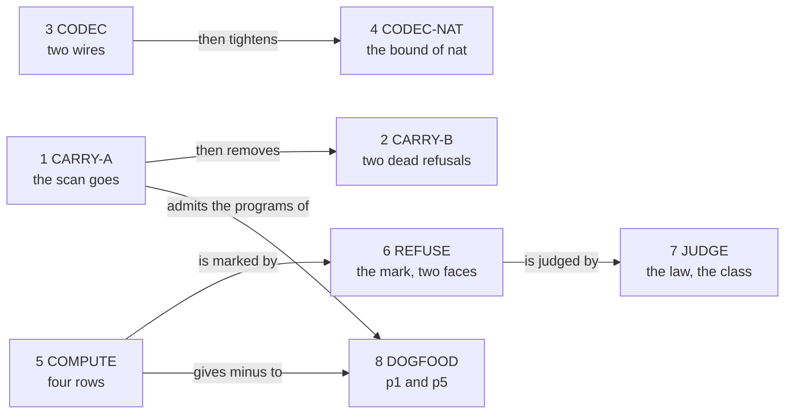

# 2026-10-07 packet: integers by one line

Status: a research note (history, not authority). It rules nothing, and it lands nothing. Base:
`0e9de44f`, branch `plan/open-parts`. The branch's head, `04801903`, adds two research packets
and no source. It prepares decisions rows 108 and 121 as slices, under the coordinator's line.
A second packet holds the streams (`docs/research/2026-10-07-packet-streams.md`).

The line: **the language carries every value exactly, and computes only what control flow
needs.**

## 1. The one thing to know first

**Write no refusal into the atom table.** `NativeAtom.Sound`
(`src/Effect4/Laws/Program/Typed.lean`) states that typed arguments evaluate to a member of the
answer type. A row that refuses at the bound makes that statement false. A term that does not
evaluate becomes a defect inside the program's result, where a handler can hide it
(`badShape`, `src/Effect4/Program/Compile.lean`). Row 108's side audit forbids that.

So the reference stays exact and total, as DI-56 rules. The bound is a refusal of the target
profile on the two target faces. One marked addition holds it. The drafts of this design
compile (appendix B gives each command and its result).

Four more facts follow from the read of the tree.

- **Carry is a deletion.** The integer scan is the one check that refuses an `int` column.
  Formation, the checker and the column check pass an `int` row today (tested, probe I3).
- **Compute needs no integer of the compiler.** An integer's image is a sign and a natural
  magnitude. The four rows use only the natural rows of the builtin table. Row 121 names LCNF
  `Int` builtins, and the design needs none.
- **The OCaml refusal exists.** Three library leaves of the exact clock give the checked
  addition. The engine already answers `Outside_profile` for their exception. The form passes
  the builtin table's own check (tested, probe I6; no OCaml ran).
- **The TypeScript spelling collides.** `nat`, `int` and `number` have one printed type,
  `number`, and it reads as `nat`. A payload class with an `int` field is refused by name. A
  stated cursor type at `int` is printed and does not read back (tested, probe I7).

## 2. What exists, and what is reused

### 2.1 What was read and run

| What | Evidence word |
| --- | --- |
| `AGENTS.md`; `docs/core/controlled-english.md` §2, §3.8, §5 to §7; `docs/GENERATED.md` | reading |
| Decisions rows 108, 109, 121, 126, 149, 160, 161, 256, 301 and 303; DI-56, DI-67 and DI-92 | reading |
| `docs/research/2026-09-30-pass/numbers/note.md`; the notes P and S of `docs/research/2026-10-01-type-language-probe/` in full, and the notes Q and T at the passages on numbers | reading |
| `docs/core/lcnf-route.md` §8 and §9; `src/OCaml5/Lcnf/Builtins.lean` in full; `ocaml/clock/e4_clock.ml`; `ocaml/engine/e4_engine.mli` | reading |
| The sources that section 2.3 names, each in full or at the named declaration | reading |
| `vendor/effect-4.0.0-rc.112/src/Schema.ts` at `isInt`, `Int`, `Number` and `Finite` | reading |
| Nine scratch files, each run by `lake env lean` in the worktree (appendix B) | tested |
| No TypeScript compiler, no `bun` and no `dune` ran. Each statement about a target face is a reading, or it is marked as assumed | reading |

### 2.2 The coordinator's facts, checked

| # | The fact | Verdict | Evidence |
| --- | --- | --- | --- |
| F1 | `Ty` has the constructors `nat`, `int`, `number` and `bytes` | holds | reading (`src/Effect4/Program/TyCore.lean`) |
| F2 | Values and membership exist, with `nat` inside `int` inside `number` | holds | tested (probe I0, twelve guards) |
| F3 | The ten numeric atoms exist over `nat` only | holds for nine. `eq` has a second signature at two strings | tested (probe I0); reading (`NativeAtom.spec`) |
| F4 | `payloadFieldTy` refuses `int`, with a stale comment | holds. The stale text stands in more places (section 4.3) | tested; reading |
| F5 | The integer scan of program admission still refuses `int` | holds, at the table, the tree and the type | tested (probes I0 and I3) |
| F6 | The Schema and JSON images of `app`, `null`, `undefined`, `number` and `bytes` are unlowered or refused by name | holds. `int` differs: its Schema image exists (`isIntCheck`), and its JSON image alone is refused | tested (probe I0); reading (`src/Effect4/Schema/Bridge.lean`) |
| F7 | Row 108 is open, row 109 is parked, row 121 is ruled | holds | reading |
| F8 | Carry: "integers and floats pass … untouched" | does not hold for a float on the OCaml face (section 3.5) | reading (`src/OCaml5/Lcnf/Builtins.lean`, the rows of `UInt64`) |
| F9 | p1 and p5 are refused for numbers | holds, by the scan. Without the scan p5's class meets the spelling collision | tested (probes I3 and I7) |

### 2.3 What is reused

| Need | Declaration and path | Rows |
| --- | --- | --- |
| The value images of an integer and of a binary64 number | `Val.nat`, `Val.negInt`, `Val.float`, `floatFrame` (`src/Effect4/Store/Carrier/Val.lean`) | 121 |
| Membership at the three number types | `intImage`, `numberImage`, `Val.hasTy` (`src/Effect4/Program/Typed.lean`) | 121 |
| The order `nat ⊑ int ⊑ number` | `leafEdges`, `Ty.sub`, `Ty.sub_of_leafRule` (`src/Effect4/Program/Ty.lean` and its laws) | 121 |
| The atom table and its own check | `NativeAtom`, `AtomRow`, `NativeAtom.eval` (`src/Effect4/Machine/Term.lean`); `Scheme`, `spec`, `specWellFormed`, `atom_table_wf` (`src/Effect4/Program/NativeAtom.lean`) | DI-40 |
| Subsumption at a fixed signature | `monoApply`, `Scheme.apply` (`src/Effect4/Program/NativeAtom.lean`) | 303 |
| One soundness lemma for each scheme | `sound_of_mono`, `sound_of_alts`, `sound_of_shape` (`src/Effect4/Laws/Program/Typed.lean`); `atomFits_of_shape` (`src/Effect4/Laws/Program/Typed/Membership.lean`); `progress_of_shape` (`src/Effect4/Laws/Program/Typed/Denotation.lean`) | — |
| An integer image holds no handle | `intImage_handles` (`src/Effect4/Laws/Program/Typed/Membership.lean`) | 121 |
| The profile's bound as data | `ProfileData.natBound`, `rc112` (`src/Effect4/Program/Profile.lean`) | DI-56 |
| An exact carrier whose egress a target checks | `ClockMillis`, `ClockMillis.toNat_add` (`src/Effect4/Data/ClockMillis.lean`) | DI-56 |
| The checked egress on OCaml, and its outcome | the rows `Effect4.ClockMillis.ofNat`, `.add` and `.toNat` (`src/OCaml5/Lcnf/Builtins.lean`); `E4_clock.to_profile_nat` (`ocaml/clock/e4_clock.ml`); `Outside_profile` (`ocaml/engine/e4_engine.mli`) | 108 |
| The refusal class on the TypeScript face | `ProfileRefusal` (`harness/truth/session/clock.ts`); `ProtocolRefusal` (`harness/truth/session/protocol.ts`) | DB-15, DI-56 |
| One shared helper in the generated prelude | `wide`, `render` (`tools/Effect4Gen/PreludeAtoms.lean`) | 256 |
| The JSON codec's fold and its two raw laws | `wireAlgebra`, `Wire`, `nat?` (`src/Effect4/Schema/Codec.lean`); `decodeRaw_normJ`, `decodeRaw_exact`, `nat?_exact` (`src/Effect4/Laws/Schema/Codec.lean`) | 128 |
| A record's exact type in its printed form | `Metadata.writeTy` (`src/Effect4/Codegen/Metadata.lean`); `writeRecord`, `readRecord` (`src/Effect4/Codegen/Record.lean`) | 120 |
| The readable types of the TypeScript reader | `ReadableTy`, `readNamed` (`src/Effect4/Codegen/Classes.lean`); `checkedDecl` (`src/Effect4/Codegen/ClassTable.lean`) | 120 |
| The battery rule | a line is a reader, a control or a finite evaluation (`AGENTS.md`, Trust) | 301 |

The three most valuable reuses are the exact clock's leaves, `sound_of_shape` and its two
sisters, and the public codec's own read-back check (`encode_eq_some`,
`src/Effect4/Laws/Schema/Codec.lean`). The third leaves the raw wire one law to owe: exactness.

## 3. The definitions and the statements to add

Appendix A holds each declaration in Lean, by its target file. This section says what each is
for and why it has its shape.

### 3.1 The line, made precise

| Part | What the language does | What it does not do |
| --- | --- | --- |
| Carry | A value of `int` or `number` passes through a record, a host row, an error payload record and the JSON codec, with its exact image | No arithmetic reads a float. No check reads the profile at a reply |
| Compute | Equality and order on two integers. Addition and subtraction on two integers, exact in the reference | No multiplication, division or remainder on integers. No operation on a float |
| Refuse | A target refuses a sum whose magnitude leaves ±(2^53 − 1). The refusal stands outside the program's result | The reference refuses nothing. No value is wrapped, rounded or saturated by the marked addition |

A number with a fraction is a member of `number` alone. It is carried, and a host row reads
it.

### 3.2 Carry: the declarations that change

The integer scan is three functions over one fold, three fields of the certificate and three
entries of the row check. The table lists every declaration that changes.

| File | Declaration | Change |
| --- | --- | --- |
| `src/Effect4/Program/Columns.lean` | `findInt`, `findIntFields`, `findIntItems` | deleted |
| `src/Effect4/Program/Admission.lean` | `findIntInTable`, `findIntInEffTy`, `findIntInProgram` | deleted |
| the same | `AdmittedProgram` | loses `intFreeTable`, `intFreeProgram` and `intFreeType` |
| the same | `admitProgram` | loses three matches (appendix A.9) |
| the same | `admitProgram_table_int`, `admitProgram_program_int`, `admitProgram_type_int` | deleted |
| the same | `admitProgram_signature` | loses the premise `hTable` |
| the same | `AdmitRefusal.uninhabited` | deleted, in the second commit |
| `src/Effect4/Program/SigApp.lean` | `rowChecks` | loses its three integer entries |
| the same | `RowReason.intType` | deleted, in the second commit |
| `src/Effect4/Program/Eff.lean` | `payloadFieldTy` | `int` joins its leaves |
| `src/Effect4/Api.lean` | the export list of admission | loses seven names |

Three things stay as they are, by name.

- **A service's carrier.** `flatCarrierAlg` (`src/Effect4/Program/SigApp.lean`) answers false at
  `int`. A service whose value is an integer waits for a program that needs one.
- **A bare integer as a failure.** `rawSupportedErrTy` (`src/Effect4/Program/Eff.lean`) answers
  false at `int`. A failure is a tagged pair or a tagged record (DB-15, row 120).
- **Membership.** `Val.hasTy`, `intImage` and `numberImage` do not change.

`LawfulSig.registered` and `LawfulSig.tableLawful`
(`src/Effect4/Laws/Program/Signature.lean`) read the first four entries of `rowChecks` by
position. The integer entries are the fifth to the seventh. So no position that a law reads
moves.

### 3.3 The codec: the wires of `int` and `number`

**The integer wire** writes a natural inside the bound as `Arch.Json.ofNat` writes it. It
writes a negative integer as the datum of its magnitude with the sign bit set. It reads an
exact integral binary64 inside the bound. It refuses negative zero, a fraction, an infinity, a
NaN and every integer outside the bound. The bound is `rc112.natBound`. rc.112's `isInt` is
`Number.isSafeInteger` (`vendor/effect-4.0.0-rc.112/src/Schema.ts`, `isInt`).

**The number wire** writes an integer image whose datum is exact, and a finite float frame as
its own bits. It reads a finite datum as the float frame where the frame holds it, and as the
integer image elsewhere. So one datum has one value. A NaN and the two infinities are refused
by name in this slice: rc.112 writes them as strings, and row 121 allows either.

**Each wire owes one law.** The public `encode` keeps a datum only where `decode` reads the
value back (`encode_eq_some`). So the retraction holds by construction. The raw wire owes
exactness: a datum that reads as a value is that value's image. Both are proved in scratch
(`int?_exact`, `number?_exact`, appendix A.10). Each gives its arm of `decodeRaw_exact` with
the datum itself as the witness.

**`nat` keeps its bound in this slice.** Today `decode .nat` reads 2^53 (tested, probes I0 and
I4).
Row 121's text sets the safe bound for `nat` too. That is a second slice, because two
guards of `Test/Codegen/SchemaGenerationContract.lean` pin today's answers above the bound.

### 3.4 Compute: the rows of the atom table

Two rows widen and two rows are new. Every other row keeps its text.

| Atom | Constructor | Scheme | Evaluation | TypeScript body |
| --- | --- | --- | --- | --- |
| `lt` | `lt` (widened) | `.mono [.int, .int] .bool` | the integers' order, on the four sign cases | unchanged: `a < b` |
| `eq` | `eq` (widened) | `.alts [([.int, .int], .bool), ([.string, .string], .bool)]` | one value has one image, so the test compares frames | unchanged: `a === b` |
| `plus` | `intAdd` (new) | `.mono [.int, .int] .int` | the exact sum | `a + b`; slice 6 wraps it in `inProfile` |
| `minus` | `intSub` (new) | `.mono [.int, .int] .int` | the sum of `x` and the negation of `y` | `a - b`; slice 6 wraps it in `inProfile` |

**Why `minus` is a row of its own.** `sub` on two naturals stops at zero, and a value does not
carry its type. `sub(10, 25)` answers `0` at `nat`, and it would answer `-15` at `int`. One
row cannot answer both (the red control of appendix A.4).

**Why `plus` is a row of its own.** `add` could widen by a second signature. Its row of
`generated/row-citations.tsv` would then fall from `agree` to `refused`, as `eq`'s is today.
The citation lane compares no `alts` scheme. Two `mono` rows keep that check for both.

**The widening is conservative.** On two naturals each widened row answers what it answers
today, and `plus` answers what `add` answers. `minus` answers what `sub` answers where the
second argument is not above the first. Each is proved in scratch against the tree's
`NativeAtom.eval` (`intLt_nat`, `intEq_nat`, `intAdd_nat`, `intSub_nat_of_le`).

**The rows append.** The four evaluation rows stand after the row of `sameHandle`. Two laws
name their cases by position (`nativeAtom_handles`, `nativeAtom_keys`). A rehearsal on a copy
of the table keeps the names `h_12` to `h_46` and adds `h_47` to `h_50` (tested, probe I5).
The same rehearsal proves that every answer of today's table is kept.

**The model.** `toInt?` reads an integer image as an `Int`, and `ofInt` writes one. They are an
exact embedding of `Int` into `Val`: `toInt?_ofInt` is the retraction and `ofInt_of_toInt?`
is exactness, with the identity as normaliser. Each row has one statement against the model:
`intAdd_spec`, `intSub_spec`, `intLt_spec`, `intEq_spec`.

### 3.5 The bound: where the one refusal is written

**The mark.** Two magnitudes of one sign are the only sum that grows. `intAdd` calls
`Profile.grow` there, and nowhere else. `add` and `succ` on naturals call the same mark, in
the refusal slice. In the reference the mark is plain addition.

| Face | At the bound `2^53 − 1` | Where the refusal is written | Evidence |
| --- | --- | --- | --- |
| Lean reference | adds exactly; no bound | nowhere: `Profile.grow a b = a + b` | proved in scratch by `rfl` (probe I6) |
| Lean judgment | `intAddIn` answers `none` | `growIn`, with the bound as an argument | proved in scratch (`intAddIn_eq_some_iff`, probe I2) |
| OCaml | raises `E4_clock.Profile_refusal`; the engine answers `Outside_profile` and keeps the input machine | one row of the builtin table at `Profile.grow` | tested as a table row (probe I6); no OCaml ran |
| TypeScript | throws `ProfileRefusal`; a run-level record keeps it outside the result | `inProfile`, one helper of the generated prelude | not compiled; assumed |

**The OCaml form** is `E4_clock.to_profile_nat (E4_clock.add (E4_clock.of_nat a)
(E4_clock.of_nat b))`. The sum is a Zarith sum, so no 63-bit addition wraps before the test.
The table's own check accepts the row, and the form evaluates each parameter once
(appendix A.8). It needs no new OCaml code.

**A second form needs no row.** `Profile.grow` may be written through `ClockMillis` itself.
The three rows of that carrier then give the same OCaml. A fact by `rfl` on two variables then
fails, and `ClockMillis.toNat_add` proves it instead (probe I6). The recommended form keeps
every `rfl`.

**The TypeScript form** tests the result: `Number.isSafeInteger`. On two arguments inside the
bound a double holds the exact sum up to 2^53, and rounding is monotone. So the test after the
sum is exact there (reading of the numbers note, finding F7; no run here). The helper records
the refusal and throws. The recorder reads the record after the run, as `ScalarRecorder` does
(`harness/truth/session/record.ts`).

**The judgment's law.** With both arguments inside the bound, the checked row answers exactly
when the reference row answers inside the bound (`intAddIn_eq_some_iff`). This is row 108's
"proved judgment", for the one operation that grows.

**A float on the OCaml face is not carried.** The engine holds a float frame's bits in a
63-bit `int`. The builtin table says so at its rows of `UInt64`: "Open, not supported, until
an exact 64-bit carrier exists". Only a pattern below 2^62 fits, which is a positive double
below two. This packet leaves that row open, by name.

### 3.6 A negative literal

**Recommended: no new literal.** An author writes `int (-404)`. The authoring word answers a
natural literal for a natural, and `minus(0, n)` for a negative integer. The term is printed as
`minus(0, 404)` and reads back as itself. It evaluates to `Val.negInt 403` by `intSub_spec`.
No wire tag, no canonical byte and no entry of the case policy moves. The reader keeps its
refusal of a negative TypeScript literal (`negative`, `src/Effect4/Codegen/Read.lean`). The
authoring word is not drafted: it needs the atom `minus`.

**The alternative: `Lit.negInt`.** Row 121's text names a signed literal. A fifth constructor
of `Lit` takes wire tag 4. It moves the derived codecs, `printLit`, three sites of the reader,
`Lit.ty`, `Lit.toVal` and the `Lit` family of the case policy. It prints `-404`. It is an L
slice for one printed form. Section 5.4 puts the choice to the owner.

### 3.7 What row 108 shrinks to

Under the line, row 108 is five items.

1. The mark `Profile.grow`, read by `add`, `succ`, `plus` and `minus`.
2. Its OCaml row and its TypeScript helper.
3. The judgment `intAddIn` and its law.
4. The comparator's class "outside the profile" on the truth lane.
5. The JSON image's bound (row 121, probe S).

Row 108 leaves these out, each by name.

- `mul`. Its OCaml form saturates (`lcnf_nat_mul`) and its TypeScript form rounds. DI-56
  forbids both. It needs a second mark and one new leaf, when a program multiplies.
- A literal above the bound.
- A profile check at reply admission. A scripted host can answer 2^60 at an `int` row today.
- Float arithmetic (row 109) and a float on the OCaml face.
- Exact native naturals above 2^62.
- A reference machine that refuses (the numbers note's option L1).
- Store functions that compute (`incr`, `double`, `takeAndBump` of the side audit). They call
  the atoms, so they inherit the mark where they add.

### 3.8 What tsgo must say

No TypeScript compiler ran. The coordinator checks these lines with the pinned tsgo 7. Each
expectation is assumed.

```ts
// 1. the generated prelude: one helper and two exports; expect no diagnostic
export const plus = (a: number, b: number): number => inProfile(a + b)
export const minus = (a: number, b: number): number => inProfile(a - b)
// 2. the widened rows keep their text; expect no change of any diagnostic
export const lt = (a: number, b: number): boolean => a < b
export const eq = (a: number | string, b: number | string): boolean => a === b
// 3. a negative integer as a term; expect `number`
Effect.succeed(minus(0, 404))
// 4. a record with signed fields (probe I7's printed form); expect no diagnostic
Effect.succeed(recordValue<{ readonly available: number; readonly needed: number }>([10, [20], [[4, [[5, [3, "needed"], [5, [1, false], [10, [3], []]]], [5, [3, "available"], [5, [1, false], [10, [3], []]]]]]]], { needed: 25, available: 10 }))
// 5. a stated cursor at `int` (probe I7's printed form); expect no diagnostic
let a0: number = 0
// 6. a negative number in an immediate slot of `pair`; expect `readonly [number, "x"]`
pair(minus(0, 1), "x")
```

Three gates read these files: `make check-target`, `make check-truth` and the corpus lane.
`make gen-row-citations` promotes `generated/row-citations.tsv`. The rows `Atom/plus` and
`Atom/minus` are expected at `mono`, `agree`. No `@ts-expect-error` line names a numeric
atom (a search of `tools/target/` and `harness/truth/`, appendix B). So none is expected to
flip.

### 3.9 The proofs that move

| Theorem | File | How it moves |
| --- | --- | --- |
| `admitProgram_eq_ok` | `src/Effect4/Laws/Program/CheckedTyping.lean` | three `split`s fewer (compiled, A.9) |
| `admitted_unique` | `src/Effect4/Laws/Run.lean` | its two patterns lose three places |
| `admitProgram_certificate` | the same | its `aesop` call loses three names |
| `hasTy_payloadFieldTy_allocation` | `src/Effect4/Laws/Program/Admit.lean` | one more leaf name (compiled, A.9) |
| `handles_of_payloadFieldTy` | the same | one more leaf name; the leaf block closes `int` unchanged (compiled) |
| `fold_of Effect4.Program.findInt` | `src/Effect4/Laws/Program/Folds/Ty.lean` | the line goes |
| `decodeRaw_normJ`, `decodeRaw_exact` | `src/Effect4/Laws/Schema/Codec.lean` | two arms each, from A.10 |
| `NativeAtom.sound` | `src/Effect4/Laws/Program/Typed.lean` | the arms `lt` and `eq` change; two arms are new |
| `sound_of_shape` | the same | two shapes are new: `int2` and `intRel` |
| `atomFits`, `atomFits_of_shape` | `src/Effect4/Laws/Program/Typed/Membership.lean` | the same four arms and two shapes |
| `atom_progress`, `progress_of_shape` | `src/Effect4/Laws/Program/Typed/Denotation.lean` | the same |
| `nativeAtomTy_lt`, `nativeAtomTy_eq` | `src/Effect4/Laws/Program/Typing/TermIntro.lean` | the statements stay; `monoApply_self` no longer proves them (compiled as `lt_at_nat`, `eq_at_nat`) |
| `nativeAtom_handles` | `src/Effect4/Laws/Machine/TermHandles.lean` | four cases are new (compiled on the copy, A.6) |
| `nativeAtom_keys` | `src/Effect4/Laws/Program/Handles/Term.lean` | four cases are new, of the same form |
| `atom_table_wf`, `ofName?_name`, `ofName?_sound`, `spec_answersClosed` | `src/Effect4/Program/NativeAtom.lean`; `src/Effect4/Machine/Term.lean`; `src/Effect4/Laws/Program/Typing/Closed.lean` | no text changes: each is a finite check or a case list over the alphabet, and it checks two more cases |

`types_lt`, `types_eq`, `atom_lt`, `atom_sub` and `atom_add` keep their statements and their
proofs (`src/Effect4/Laws/Modules/Checking.lean`, `src/Effect4/Laws/Modules/Reading.lean`). So
no law of the Queue, of Semaphore or of Pool moves.

The arms of `sound`, `atomFits` and `atom_progress` are not compiled: they need the edited
table. Their content is compiled as `plus_sound`, `minus_sound`, `lt_sound` and `eq_sound`.
On the copy of the table it is compiled as `lt_holds` and `eq_holds` (probe I5).

### 3.10 The placement of each obligation

**The four row statements and the handle facts** (`intAdd_spec` and its sisters).

- Concept: `store-typing`; property: an atom at typed arguments answers a member of its answer
  type.
- Question: a step of the semantics registry claim `term-typed-maps` (role
  `fundamentalProperty`). Its witness `termMaps_of_typed` reads `atomFits` and `atom_progress`.
  Consumer: those two and `NativeAtom.sound`, at the four rows.
- Reach: every pair of integer images; no hypothesis. Rows 108 and 121.
- Does not establish: any behaviour of a target face, or any bound.
- Unlocks: R3, the numbers of the type language; R4 through `term-typed-maps`; the stages of
  p1 and p5.

**The wires' exactness** (`int?_exact`, `number?_exact`).

- Concept: `exact-codecs`; property: `decode_iff` at every type.
- Question: the arms `int` and `number` of `decodeRaw_exact`, a step of the semantics registry
  claim `decode-iff` (role `decidability`); consumer: `decode_iff`.
- Reach: every JSON datum; no hypothesis. Row 121, probe S; row 128.
- Does not establish: the retraction of the raw wire, which the public `encode` checks at each
  value. It says nothing of rc.112's own codec.
- Unlocks: R3, where `decode_iff` is a top node: the JSON image of `int` and `number`.

**The judgment's law** (`intAddIn_eq_some_iff`).

- Concept: `translation-simulation`; property: a face equals the reference inside its profile
  and refuses outside it (DI-56).
- Question: a proposed claim of the semantics registry, `profile-plus-exact`, with the theorem
  as its pointer; consumer: the comparator's class "outside the profile".
- Reach: one addition; both arguments inside the bound; the bound as an argument.
- Does not establish: that the OCaml row or the TypeScript helper is this judgment. Each is a
  trusted row, read against its source and run by a control. It says nothing of `mul`.
- Unlocks: R8, whose text bounds a face by its profile, for the one operation that grows; row
  108's third item.

## 4. The slices, in commit order

### 4.1 The table

The diagram shows the order of the slices. It shows dependencies, and no dates.



| # | Slice | Size | Depends on | Existing tests that move |
| --- | --- | --- | --- | --- |
| 1 | CARRY-A: the integer scan goes; `int` in a payload field | M | — | eleven batteries; the case policy loses one row |
| 2 | CARRY-B: the two dead refusal constructors go | S | 1; a contract amendment | two guard files of the generator; two derived files |
| 3 | CODEC: the wires of `int` and `number` | M | — | one guard |
| 4 | CODEC-NAT: `nat`'s JSON bound | S | 3 | two guards |
| 5 | COMPUTE: `lt` and `eq` at `int`; `plus` and `minus` | L | — | one guard; the generated groups of an atom |
| 6 | REFUSE: the mark and its two target forms | M | 5 | four prelude bodies; one pinned count |
| 7 | JUDGE: the judgment, its law, the comparator's class | M | 6 | none known |
| 8 | DOGFOOD: p1 and p5 move forward | S | 1, 5 | their own stages |

Slices 1, 3 and 5 are independent of each other. Two optional slices follow the table:
SPELL and FACE (section 4.10).

### 4.2 What an appended atom moves

Slice 5 appends two atoms. This list holds for it, and for no other slice.

- **Canonical bytes: none.** An atom is spelled by name on the wire. No tag of
  `tools/Effect4Gen/wire-tags.json` moves.
- **The case policy: none expected.** `NativeAtom` is no family of
  `tools/Conform/Effect4/cases-policy.json`. The new functions match on `Val`, which is no
  family. Run `make check-cases` to confirm it.
- **The generated groups.** `src/Effect4/Program/AtomInventory.lean`;
  `harness/truth/prelude-atoms.gen.ts`; `ts/eff/profile.gen.ts`; `ocaml/eff/eff_native.ml`;
  `ocaml/gen/api_gen.ml` and `ocaml/engine/api_engine.ml` (the group `lcnf`);
  `generated/row-types.tsv` (two more lines); `generated/row-citations.tsv` (two more lines,
  promoted by `make gen-row-citations`).
- **The truth group.** Each of the 73 modules of `harness/truth/generated/` imports the whole
  atom list, and `harness/truth/corpus.json` holds it. The group regenerates on a host.
- **Hand files.** `Test/Program/NativeAtomContract.lean` pins the list of names.
  `harness/truth/prelude.ts` needs a case of `selfTestCases` for each new atom, or
  `run-truth.ts` refuses the profile.
- **The compatibility policy.** `Test/fixtures/baseline/66ee4657-supplement-v1.policy.json`
  names the appended atoms in a comment. Add the two names there.
- **Reserved export names.** A printed module imports each atom by name. So `plus` and `minus`
  stop being export names of a program (the sugar packet, section 3.6).

### 4.3 Slice 1, CARRY-A

- **Files.** Edited: `src/Effect4/Program/Columns.lean`, `Admission.lean`, `SigApp.lean`,
  `Eff.lean`; `src/Effect4/Api.lean`; the four law files of section 3.9's first six lines.
  `AdmitRefusal.uninhabited` and `RowReason.intType` stay, unused, for one commit.
- **Size.** M: the change is a deletion in four core modules that most of the tree imports,
  and eleven batteries move. The changed proofs are compiled in scratch.
- **Tests that move.** `Test/Api/ApiContract.lean`, `Test/Run/RunContract.lean`,
  `Test/Api/KeyedHostContract.lean`, `Test/Api/HostSessionContract.lean`,
  `Test/Program/FormationContract.lean`, `Test/Program/RecordTerms.lean`,
  `Test/Program/AdmissionColumns.lean`, `Test/Program/AuthorContract.lean`,
  `Test/Codegen/TermRows.lean`, `Test/Dogfood/P1HttpCache.lean` and
  `Test/Dogfood/P5LedgerService.lean`. Three of them build a certificate by hand and lose three
  fields. The others pin the refusal or call the scan.
- **Generated files that move.** `tools/Conform/Effect4/cases-policy.json` loses the row of
  `Effect4.Program.findInt`. Edit it as text. No generated family holds the scan.
- **Stale text.** `docs/core/host-boundary.md` §4.4; DI-67 and DI-92;
  `docs/core/traversal-census.md`; `docs/DESIGN-BASIS.md` at DB-15's two sentences;
  `docs/STATE.md`; `Test/Schema/DialectContract.lean`'s header; `Test/Dogfood/README.md`; the
  docstring of `payloadFieldTy`. The semantics registry's ruling line of R3 names the scan too
  (`tools/Tools/SemanticsRegistry.lean`).
- **New battery lines.** A control: an `int` row builds, and a scripted host's `negInt` answer
  is the root's exit. A red control: a string answer at that row is refused at the reply. A
  red control: a payload field at a handle type stays refused.

### 4.4 Slice 2, CARRY-B

- **Files.** `AdmitRefusal.uninhabited` and `RowReason.intType` go. The derived files
  regenerate: `src/Effect4/Api/RefusalsDerived.lean` and `src/Effect4/Api/RunnerDerived.lean`.
  The hand guards `tools/Effect4Gen/guards/refusals.lean` and `runner.lean` lose their sample
  values.
- **Size.** S: two constructors and four mechanical edits.
- **Why a commit of its own.** A deleted constructor shifts the ordinals of the later ones in
  the derived image. This commit holds that shift alone.
- **A frozen contract.** `Test/contracts/foundation-wave2.contract.md` names
  `AdmitRefusal.uninhabited` in its paragraph "Inhabitation". Row 121 superseded that
  paragraph. The coordinator amends it with this commit.

### 4.5 Slice 3, CODEC

- **Files.** `src/Effect4/Schema/Codec.lean`: `ty_int` and `ty_number` of `wireAlgebra`, and the
  definitions of A.10. `src/Effect4/Laws/Schema/Codec.lean`: the lemmas of A.10, and two arms
  in each of two laws.
- **Size.** M: nine definitions and seven lemmas, all compiled (probe I4, appendix B). Each of
  the four new arms is one line.
- **Tests that move.** `Test/Codegen/SchemaGenerationContract.lean`: the guard
  `Ty.encode .int (.nat 1) = none`. Its two guards at a union with `int` are expected to stay
  (inferred from the wire's reading of an object; not run).
- **New battery lines.** The finite evaluations of A.10, as readers of `decode_iff` at `int`
  and `number`: both signs, the bound, and each refusal.

### 4.6 Slice 4, CODEC-NAT

- **Files.** `nat?` or `ty_nat` of `src/Effect4/Schema/Codec.lean`; `nat?_exact`.
- **Size.** S: one test and one proof arm.
- **Tests that move.** Two guards of `Test/Codegen/SchemaGenerationContract.lean`, at 2^53 and
  at 2^53 + 2. A third, at 2^53 + 1, stays.
- **Why.** rc.112's `isInt` refuses 2^53, and the Lean codec reads it today (probe S).

### 4.7 Slice 5, COMPUTE

- **Files.** New: `src/Effect4/Machine/Integers.lean` (A.1) and
  `src/Effect4/Laws/Machine/Integers.lean` (A.4). Edited: `src/Effect4/Machine/Term.lean`,
  `src/Effect4/Program/NativeAtom.lean`, and the files of section 3.9 from `NativeAtom.sound`
  down. `src/Effect4/Laws.lean` gains one import at the anchor of the machine laws.
- **The edit of the table.** `NativeAtom` gains two constructors. `NativeAtom.row` gains two
  rows, `ofName?` two names, and `NativeAtom.eval` four rows. `NativeAtom.spec` gains two rows
  and changes two.
- **Size.** L: two constructors of the atom alphabet reach three law families, two handle laws
  and every generated group of an atom. The definitions and their laws are compiled. The arms
  in the tree are not.
- **Tests and generated files that move.** Section 4.2.
- **New battery lines.** Readers of `intSub_spec` at p5's and p1's numbers. A red control:
  `minus(10, 25)` differs from `sub(10, 25)`. A red control: `plus` at a string is not typed.
  A finite evaluation: `lt` and `eq` at the four sign cases.

### 4.8 Slices 6 and 7, REFUSE and JUDGE

- **Files of 6.** `Profile.grow` in `src/Effect4/Machine/Integers.lean`, read by the rows of
  `add`, `succ`, `plus` and `minus`. One row of `src/OCaml5/Lcnf/Builtins.lean` (A.8), with its
  control in `tools/Conform/Effect4/CompilerControls.lean`. `inProfile` in
  `tools/Effect4Gen/PreludeAtoms.lean`, and four prelude bodies of `NativeAtom.row`.
- **Size of 6.** M: the Lean part is small and compiled. The two target parts run on a host,
  and no part of them ran here.
- **Tests and generated files that move in 6.** The guard `builtins.length == 106` of the
  builtin table. Four bodies and one helper in `harness/truth/prelude-atoms.gen.ts`. The group
  `lcnf` regenerates `ocaml/gen/api_gen.ml` and `ocaml/engine/api_engine.ml`. The hand table
  `selfTestCases` of `harness/truth/prelude.ts` gains its cases at the bound.
- **Files of 7.** `Within`, `growIn`, `intAddIn` and the law (A.7), in a new law module. The
  truth runner's recorder and the comparator's class.
- **New battery lines.** The six guards at the bound of A.7. One engine control and one
  truth-lane control: a sum at the bound answers `Outside_profile`, and one below it does not.

### 4.9 Slice 8, DOGFOOD

p5's `balanceAfter` uses `minus` and answers `-15`, as rc.112 does. p1's failure holds a status
that a program negates. Each battery's `stage` and its `waitsOn` list move with it. p5's class
`InsufficientFunds` keeps natural fields until SPELL lands.

### 4.10 Two optional slices

- **SPELL: two target names.** `int` and `number` get a name each in the generated prelude,
  as aliases of `number`. `readNamed` reads each name. `nat` keeps `number`, so no golden of
  today moves. Size M. It is needed where a program states `int` in a printed type: a payload
  class, a cursor, a type argument.
- **FACE: the Schema image of `number`.** `ty_number` of `schemaAlg`
  (`src/Effect4/Schema/Bridge.lean`) is `unlowered` today. Its image is rc.112's `Number` or
  `Finite`. Size M, with the bridge's two laws. It is not drafted here.

## 5. Risks, stop rules and open questions

### 5.1 Risks

- **Position names.** `nativeAtom_handles` and `nativeAtom_keys` each name 21 cases by
  position. A row placed before the row of `sameHandle` renames every case after it. Append.
- **`omega` and an `Int` iff.** `omega` proved an iff of two `Int` orders through
  `Classical.choice`. Prove each direction apart (`intLt_spec`).
- **A large power under `omega` or the unifier.** `omega` at a hypothesis with `2 ^ 63` as a
  divisor reaches the recursion limit. So does a unifier that unfolds `Arch.binary64OfNat`.
  State injectivity in two typed steps (`negJson_of_nat?`).
- **`decide` on the type order.** The kernel does not evaluate `Ty.sub` or `Scheme.apply` by
  `decide`. Use `Ty.sub_of_leafRule` and `monoApply_pair`.
- **A second signature for `eq`.** The first alternative wins. `eq` at a literal and a natural
  stays refused, as `Test/Program/NativeAtomContract.lean` pins.
- **The spelling collision.** After slice 1 a program with a signed payload class builds and
  runs, and its module is refused at printing. Say so in the receipt of slice 1.

### 5.2 Stop rules

1. Stop if any guard of an existing atom's answer moves in slice 5. The rehearsal proves that
   none can.
2. Stop if `make check-cases` reports a new site in slice 5.
3. Stop if the engine's lane shows a changed answer below the bound in slice 6.
4. Stop if a `@ts-expect-error` line flips, and read which signature moved.
5. Stop before slice 2 if any committed fixture holds an encoded `AdmitRefusal`.

### 5.3 Open questions, answered from the tree

| Question | Answer | Evidence |
| --- | --- | --- |
| Do `add` and `succ` on naturals refuse too? | Yes. DI-56 bounds every arithmetic result | reading (DI-56; `docs/DESIGN-BASIS.md`, DB-09's scalar rule) |
| Does `sub`, `pred`, `div` or `mod` need the mark? | No. None of them grows | reading (`NativeAtom.eval`) |
| Does `encode_sub` gain an obligation? | No. It takes equal layouts as a premise, and the three layouts differ | reading (`encode_sub`) |
| Does the widened `lt` change a printed type? | No. `int` renders as `number` | tested (probe I2) |
| Does the engine carry a negative integer? | Yes: `Val_negInt` | reading (`ocaml/engine/e4_engine.mli`) |
| Does a record with signed fields read back? | Yes: its printed form holds the exact type | tested (probe I7) |
| May a helper land with no consumer? | No. `intImage_handles` exists in the tree; the draft's copy does not land | reading |

### 5.4 Questions for the owner

1. **The names.** Two rows for addition, `add` on naturals and `plus` on integers, or one row
   `add` with two signatures? Recommended: two rows. The second form costs the citation check
   of `add`.
2. **A negative literal.** A derived spelling, `minus(0, n)`, or a constructor of `Lit` as row
   121's text names it? Recommended: the derived spelling now, and the constructor when a
   program must show `-n`.
3. **The TypeScript names of `int` and `number`.** Aliases of `number` with their own names, or
   the collision kept? Recommended: aliases, in slice SPELL, when p5's class needs them. The
   names are the owner's: `Int` and `Num` are candidates.
4. **A float on the OCaml face.** Is a float in the supported domain of the generated engine
   now? Recommended: no. The builtin table keeps its row open, and the line needs no float
   arithmetic there.
5. **`nat`'s JSON bound.** Does `nat` refuse 2^53 at the codec, as row 121's text says?
   Recommended: yes, as slice 4.
6. **A NaN and an infinity at the codec.** Refused by name, or written as rc.112's strings?
   Recommended: refused, until a program carries one.

## What this does not establish

- No statement about a target face is run. The OCaml row passes the table's own check, and no
  OCaml compiled it. No TypeScript line met a compiler.
- The arms of `NativeAtom.sound`, `atomFits`, `atom_progress` and `nativeAtom_keys` are not
  compiled against the edited table.
- The rehearsal is a copy. It shows the position names and the kept answers of one table text.
- `intAddIn_eq_some_iff` relates two Lean functions. It relates no face to the reference.
- The judgment covers addition alone. `mul` keeps its known difference on both target faces.
- A value that the host answers outside the bound is not refused. The comparison of two faces
  holds inside the profile only.
- The wires' laws say nothing of rc.112's codec. No theorem joins the Lean datum to a host's
  parse.

## Appendix A. The compiled drafts, by target file

Each block is the text of a scratch file that compiled (appendix B). The drafts stand in the
namespace `PacketInt`, beside the tree. A slice moves each to its target file and its target
namespace. A new core module opens with `module`, `public import` and
`@[expose] public section` (decisions row 200). The blocks A.2 and A.5's last one are written
by hand and are not compiled: each needs the edited table.

The draft's `intImage_handles` repeats a theorem of the tree
(`src/Effect4/Laws/Program/Typed/Membership.lean`). It does not land.

### A.1 `src/Effect4/Machine/Integers.lean` (new): the rows' evaluation

```lean
/-! ## 1. The rows' evaluation -/

/-- **The one addition of two magnitudes that can leave the profile.** In the reference it is
plain addition. A target lowers it to its refusal outside the bound (DI-56, decisions row 108). -/
@[noinline] def Profile.grow (a b : Nat) : Nat := a + b

/-- `-x` on an integer image. Zero has one image, so `-0` is `nat 0`. -/
def intNeg : Val → Option Val
  | .nat 0 => some (.nat 0)
  | .nat (n + 1) => some (.negInt n)
  | .negInt n => some (.nat (n + 1))
  | _ => none

/-- `x + y` on two integer images. Two magnitudes of one sign grow; two of different signs do
not. -/
def intAdd : Val → Val → Option Val
  | .nat a, .nat b => some (.nat (Profile.grow a b))
  | .nat a, .negInt b => some (if b < a then .nat (a - (b + 1)) else .negInt (b - a))
  | .negInt a, .nat b => some (if a < b then .nat (b - (a + 1)) else .negInt (a - b))
  | .negInt a, .negInt b => some (.negInt (Profile.grow (a + 1) (b + 1) - 1))
  | _, _ => none

/-- `x - y`: the sum of `x` and `-y`. Exact, where `sub` on naturals stops at zero. -/
def intSub (x y : Val) : Option Val := (intNeg y).bind (intAdd x)

/-- `x < y` on two integer images. -/
def intLt : Val → Val → Option Val
  | .nat a, .nat b => some (.bool (decide (a < b)))
  | .nat _, .negInt _ => some (.bool false)
  | .negInt _, .nat _ => some (.bool true)
  | .negInt a, .negInt b => some (.bool (decide (b < a)))
  | _, _ => none

/-- `x = y` on two integer images: one value has one image, so the test compares frames. -/
def intEq : Val → Val → Option Val
  | .nat a, .nat b => some (.bool (decide (a = b)))
  | .negInt a, .negInt b => some (.bool (decide (a = b)))
  | .nat _, .negInt _ => some (.bool false)
  | .negInt _, .nat _ => some (.bool false)
  | _, _ => none

-- finite evaluations: p5's `available - needed`, p1's `-status`, and the signs
#guard intSub (.nat 10) (.nat 25) = some (.negInt 14)
#guard intSub (.nat 25) (.nat 10) = some (.nat 15)
#guard intSub (.nat 0) (.nat 404) = some (.negInt 403)
#guard intSub (.negInt 0) (.negInt 0) = some (.nat 0)
#guard intAdd (.negInt 4) (.nat 5) = some (.nat 0)
#guard intAdd (.negInt 4) (.nat 4) = some (.negInt 0)
#guard intAdd (.negInt 0) (.negInt 0) = some (.negInt 1)
#guard intLt (.negInt 1) (.negInt 0) = some (.bool true)
#guard intLt (.nat 0) (.negInt 0) = some (.bool false)
#guard intEq (.nat 0) (.negInt 0) = some (.bool false)
-- red: a string is no integer
#guard intAdd (.str "1") (.nat 1) = none
#guard intSub (.nat 1) (.float 0x3FE0000000000000) = none
```

### A.2 `src/Effect4/Machine/Term.lean` (edited): the alphabet and the table

Not compiled as an edit. Probe I5 compiles the same rows on a copy of the table.

```lean
-- `NativeAtom`, after `sameHandle`:
  /-- Exact addition and subtraction on two integer images (decisions rows 108 and 121).
  Atoms are spelled by name on the wire, so appending them moves no ordinal and no byte. -/
  | intAdd | intSub

-- `NativeAtom.row`, two rows. Slice 6 wraps each body in `inProfile( … )`.
  | .intAdd => { name := "plus", arity := some 2, constGeneric := false,
                 prelude := "(a: number, b: number): number => a + b" }
  | .intSub => { name := "minus", arity := some 2, constGeneric := false,
                 prelude := "(a: number, b: number): number => a - b" }

-- `ofName?`, two names:
  | "plus" => some .intAdd
  | "minus" => some .intSub

-- `NativeAtom.eval`, four rows after the row of `sameHandle`:
  | .lt, [x, y] => intLt x y
  | .eq, [x, y] => intEq x y
  | .intAdd, [x, y] => intAdd x y
  | .intSub, [x, y] => intSub x y
-- and the closing alternative gains `| .intAdd, _ | .intSub, _`.
```

### A.3 `src/Effect4/Program/NativeAtom.lean` (edited): the four typing rows

The two new rows show their bodies as slice 6 leaves them, with `inProfile`.

```lean
/-! ## 4. The typing rows -/

/-- `plus`: the row of the new constructor `intAdd`. -/
def plusRow : NativeAtom.AtomRow :=
  { name := "plus", arity := some 2, constGeneric := false,
    prelude := "(a: number, b: number): number => inProfile(a + b)" }

def plusSpec : NativeAtom.Spec :=
  { scheme := .mono [.int, .int] .int,
    cite := "`\"plus\", [x, y] => x + y` on two integers, exact (decisions rows 108 and 121).\n\
             The reference adds without a bound. A target refuses a result outside\n\
             ±(2^53 - 1) (DI-56): this body throws `ProfileRefusal`." }

/-- `minus`: the row of the new constructor `intSub`. -/
def minusRow : NativeAtom.AtomRow :=
  { name := "minus", arity := some 2, constGeneric := false,
    prelude := "(a: number, b: number): number => inProfile(a - b)" }

def minusSpec : NativeAtom.Spec :=
  { scheme := .mono [.int, .int] .int,
    cite := "`\"minus\", [x, y] => x - y` on two integers, exact: `sub` stops at zero.\n\
             A target refuses a result outside ±(2^53 - 1) (DI-56)." }

/-- `lt`, widened: the same row, at `int`. -/
def ltSpec : NativeAtom.Spec :=
  { scheme := .mono [.int, .int] .bool,
    cite := "`\"lt\", [x, y] => bool (x < y)` on two integers (decisions row 121)." }

/-- `eq`, widened: the number signature at `int`, then the string signature. -/
def eqSpec : NativeAtom.Spec :=
  { scheme := .alts [([.int, .int], .bool), ([.string, .string], .bool)],
    cite := "NativeAtom.eq on two integers or two strings (DI-09, decisions row 121)." }

def namesAfter : List String := NativeAtom.names ++ ["plus", "minus"]

-- the table's own check accepts each new row and each widened row
#guard NativeAtom.specWellFormed namesAfter plusRow plusSpec
#guard NativeAtom.specWellFormed namesAfter minusRow minusSpec
#guard NativeAtom.specWellFormed namesAfter (NativeAtom.row .lt) ltSpec
#guard NativeAtom.specWellFormed namesAfter (NativeAtom.row .eq) eqSpec
-- red control: a repeated name is refused
#guard !NativeAtom.specWellFormed (namesAfter ++ ["plus"]) plusRow plusSpec

-- what each scheme answers
#guard plusSpec.scheme.apply [.int, .int] = some .int
#guard plusSpec.scheme.apply [.nat, .nat] = some .int
#guard plusSpec.scheme.apply [.nat, .int] = some .int
#guard plusSpec.scheme.apply [.number, .int] = none
#guard plusSpec.scheme.apply [.string, .int] = none
#guard ltSpec.scheme.apply [.nat, .nat] = some .bool
#guard ltSpec.scheme.apply [.int, .nat] = some .bool
#guard ltSpec.scheme.apply [.number, .nat] = none
#guard eqSpec.scheme.apply [.nat, .nat] = some .bool
#guard eqSpec.scheme.apply [.int, .nat] = some .bool
#guard eqSpec.scheme.apply [.string, .string] = some .bool
#guard eqSpec.scheme.apply [.string, .nat] = none
#guard eqSpec.scheme.apply [.number, .number] = none
-- the rendered row of the promoted table does not move for `lt`: `int` renders as `number`
#guard (Ty.int).render = (Ty.nat).render
```

### A.4 `src/Effect4/Laws/Machine/Integers.lean` (new): the model and the rows' laws

```lean
/-! ## 2. The integer model -/

/-- An integer image as an `Int`. -/
def toInt? : Val → Option Int
  | .nat n => some (Int.ofNat n)
  | .negInt n => some (Int.negSucc n)
  | _ => none

/-- An `Int` as its image: one image for each integer. -/
def ofInt : Int → Val
  | .ofNat n => .nat n
  | .negSucc n => .negInt n

/-- Retraction: the image reads back. -/
theorem toInt?_ofInt (i : Int) : toInt? (ofInt i) = some i := by
  cases i <;> rfl

/-- Exactness: a value that reads as an integer is that integer's image. -/
theorem ofInt_of_toInt? {v : Val} {i : Int} (h : toInt? v = some i) : v = ofInt i := by
  cases v with
  | nat n => cases h; rfl
  | negInt n => cases h; rfl
  | _ => exact nomatch h

/-- The membership of `int` is the domain of the reader. -/
theorem intImage_iff (v : Val) : intImage v = true ↔ ∃ i, toInt? v = some i := by
  cases v with
  | nat n => exact ⟨fun _ => ⟨_, rfl⟩, fun _ => rfl⟩
  | negInt n => exact ⟨fun _ => ⟨_, rfl⟩, fun _ => rfl⟩
  | _ => exact ⟨fun h => (nomatch h), fun ⟨_, h⟩ => (nomatch h)⟩

theorem intNeg_spec {x : Val} {a : Int} (hx : toInt? x = some a) :
    intNeg x = some (ofInt (-a)) := by
  cases x with
  | nat n =>
    cases hx
    cases n with
    | zero => rfl
    | succ k => rfl
  | negInt n => cases hx; rfl
  | _ => exact nomatch hx

/-- **Addition is exact**: the row answers the image of the integer sum. -/
theorem intAdd_spec {x y : Val} {a b : Int} (hx : toInt? x = some a) (hy : toInt? y = some b) :
    intAdd x y = some (ofInt (a + b)) := by
  cases x with
  | nat m =>
    cases hx
    cases y with
    | nat n => cases hy; rfl
    | negInt n =>
      cases hy
      show some (if n < m then Val.nat (m - (n + 1)) else Store.Val.negInt (n - m)) =
        some (ofInt (Int.subNatNat m (n + 1)))
      by_cases h : n < m
      · rw [if_pos h, Int.subNatNat_of_le (by omega)]
        rfl
      · rw [if_neg h]
        have hlt : m < n + 1 := by omega
        rw [Int.subNatNat_of_lt hlt]
        have hk : n + 1 - m - 1 = n - m := by omega
        show some (Store.Val.negInt (n - m)) = some (ofInt (Int.negSucc (n + 1 - m - 1)))
        rw [hk]
        rfl
    | _ => exact nomatch hy
  | negInt m =>
    cases hx
    cases y with
    | nat n =>
      cases hy
      show some (if m < n then Val.nat (n - (m + 1)) else Store.Val.negInt (m - n)) =
        some (ofInt (Int.subNatNat n (m + 1)))
      by_cases h : m < n
      · rw [if_pos h, Int.subNatNat_of_le (by omega)]
        rfl
      · rw [if_neg h]
        have hlt : n < m + 1 := by omega
        rw [Int.subNatNat_of_lt hlt]
        have hk : m + 1 - n - 1 = m - n := by omega
        show some (Store.Val.negInt (m - n)) = some (ofInt (Int.negSucc (m + 1 - n - 1)))
        rw [hk]
        rfl
    | negInt n =>
      cases hy
      show some (Store.Val.negInt (m + 1 + (n + 1) - 1)) = some (ofInt (Int.negSucc (m + n + 1)))
      have hk : m + 1 + (n + 1) - 1 = m + n + 1 := by omega
      rw [hk]
      rfl
    | _ => exact nomatch hy
  | _ => exact nomatch hx

/-- **Subtraction is exact.** -/
theorem intSub_spec {x y : Val} {a b : Int} (hx : toInt? x = some a) (hy : toInt? y = some b) :
    intSub x y = some (ofInt (a - b)) := by
  unfold intSub
  rw [intNeg_spec hy]
  show intAdd x (ofInt (-b)) = some (ofInt (a - b))
  rw [intAdd_spec hx (toInt?_ofInt (-b)), Int.sub_eq_add_neg]

/-- **The order is the integers' order.** -/
theorem intLt_spec {x y : Val} {a b : Int} (hx : toInt? x = some a) (hy : toInt? y = some b) :
    intLt x y = some (.bool (decide (a < b))) := by
  cases x with
  | nat m =>
    cases hx
    cases y with
    | nat n =>
      cases hy
      show some (Val.bool (decide (m < n))) = some (Val.bool (decide (Int.ofNat m < Int.ofNat n)))
      rw [show decide (Int.ofNat m < Int.ofNat n) = decide (m < n) from
        decide_eq_decide.mpr Int.ofNat_lt]
    | negInt n =>
      cases hy
      show some (Val.bool false) = some (Val.bool (decide (Int.ofNat m < Int.negSucc n)))
      rw [show decide (Int.ofNat m < Int.negSucc n) = false from
        decide_eq_false (by
          have h1 := Int.negSucc_lt_zero n
          have h2 : (0 : Int) ≤ Int.ofNat m := Int.natCast_nonneg m
          omega)]
    | _ => exact nomatch hy
  | negInt m =>
    cases hx
    cases y with
    | nat n =>
      cases hy
      show some (Val.bool true) = some (Val.bool (decide (Int.negSucc m < Int.ofNat n)))
      rw [show decide (Int.negSucc m < Int.ofNat n) = true from
        decide_eq_true (by
          have h1 := Int.negSucc_lt_zero m
          have h2 : (0 : Int) ≤ Int.ofNat n := Int.natCast_nonneg n
          omega)]
    | negInt n =>
      cases hy
      show some (Val.bool (decide (n < m))) =
        some (Val.bool (decide (Int.negSucc m < Int.negSucc n)))
      rw [show decide (Int.negSucc m < Int.negSucc n) = decide (n < m) from
        decide_eq_decide.mpr
          ⟨fun h => by rw [Int.negSucc_eq, Int.negSucc_eq] at h; omega,
           fun h => by rw [Int.negSucc_eq, Int.negSucc_eq]; omega⟩]
    | _ => exact nomatch hy
  | _ => exact nomatch hx

/-- **Equality is the integers' equality.** -/
theorem intEq_spec {x y : Val} {a b : Int} (hx : toInt? x = some a) (hy : toInt? y = some b) :
    intEq x y = some (.bool (decide (a = b))) := by
  cases x with
  | nat m =>
    cases hx
    cases y with
    | nat n =>
      cases hy
      show some (Val.bool (decide (m = n))) = some (Val.bool (decide (Int.ofNat m = Int.ofNat n)))
      rw [show decide (Int.ofNat m = Int.ofNat n) = decide (m = n) from
        decide_eq_decide.mpr Int.ofNat_inj]
    | negInt n =>
      cases hy
      show some (Val.bool false) = some (Val.bool (decide (Int.ofNat m = Int.negSucc n)))
      rw [show decide (Int.ofNat m = Int.negSucc n) = false from
        decide_eq_false (fun h => nomatch h)]
    | _ => exact nomatch hy
  | negInt m =>
    cases hx
    cases y with
    | nat n =>
      cases hy
      show some (Val.bool false) = some (Val.bool (decide (Int.negSucc m = Int.ofNat n)))
      rw [show decide (Int.negSucc m = Int.ofNat n) = false from
        decide_eq_false (fun h => nomatch h)]
    | negInt n =>
      cases hy
      show some (Val.bool (decide (m = n))) =
        some (Val.bool (decide (Int.negSucc m = Int.negSucc n)))
      rw [show decide (Int.negSucc m = Int.negSucc n) = decide (m = n) from
        decide_eq_decide.mpr ⟨fun h => Int.negSucc.inj h, fun h => congrArg Int.negSucc h⟩]
    | _ => exact nomatch hy
  | _ => exact nomatch hx

/-! ## 3. What the rows keep -/

/-- An integer image holds no handle. The handle laws' new cases read it. -/
theorem intImage_handles {v : Val} (h : intImage v = true) : Store.Val.handles v = [] := by
  cases v with
  | nat n => rfl
  | negInt n => rfl
  | _ => exact nomatch h

theorem ofInt_intImage (i : Int) : intImage (ofInt i) = true := by cases i <;> rfl

/-- The sum of two integer images is an integer image, so the row is closed on `int`. -/
theorem intAdd_closed {x y : Val} (hx : intImage x = true) (hy : intImage y = true) :
    ∃ v, intAdd x y = some v ∧ intImage v = true := by
  obtain ⟨a, ha⟩ := (intImage_iff x).mp hx
  obtain ⟨b, hb⟩ := (intImage_iff y).mp hy
  exact ⟨_, intAdd_spec ha hb, ofInt_intImage _⟩

theorem intSub_closed {x y : Val} (hx : intImage x = true) (hy : intImage y = true) :
    ∃ v, intSub x y = some v ∧ intImage v = true := by
  obtain ⟨a, ha⟩ := (intImage_iff x).mp hx
  obtain ⟨b, hb⟩ := (intImage_iff y).mp hy
  exact ⟨_, intSub_spec ha hb, ofInt_intImage _⟩

/-- A row that answers, answers a value with no handle: the one fact `nativeAtom_handles`
(`src/Effect4/Laws/Machine/TermHandles.lean`) needs at each appended row. -/
theorem intAdd_handles {x y v : Val} (h : intAdd x y = some v) : Store.Val.handles v = [] := by
  unfold intAdd at h
  split at h
  · cases h; rfl
  · cases h; split <;> rfl
  · cases h; split <;> rfl
  · cases h; rfl
  · exact nomatch h

theorem intNeg_intImage {y v : Val} (h : intNeg y = some v) : intImage v = true := by
  unfold intNeg at h
  split at h
  · cases h; rfl
  · cases h; rfl
  · cases h; rfl
  · exact nomatch h

theorem intSub_handles {x y v : Val} (h : intSub x y = some v) : Store.Val.handles v = [] := by
  unfold intSub at h
  obtain ⟨n, _, hadd⟩ := Option.bind_eq_some_iff.mp h
  exact intAdd_handles hadd

theorem intLt_handles {x y v : Val} (h : intLt x y = some v) : Store.Val.handles v = [] := by
  unfold intLt at h
  split at h
  · cases h; rfl
  · cases h; rfl
  · cases h; rfl
  · cases h; rfl
  · exact nomatch h

theorem intEq_handles {x y v : Val} (h : intEq x y = some v) : Store.Val.handles v = [] := by
  unfold intEq at h
  split at h
  · cases h; rfl
  · cases h; rfl
  · cases h; rfl
  · cases h; rfl
  · exact nomatch h

/-- **The widening is conservative**: on two natural images each row answers what the natural
row of the tree answers today (`NativeAtom.eval`, rows `lt` and `eq`; `add` for `plus`). -/
theorem intLt_nat (a b : Nat) : intLt (.nat a) (.nat b) = NativeAtom.eval .lt [.nat a, .nat b] := rfl
theorem intEq_nat (a b : Nat) : intEq (.nat a) (.nat b) = NativeAtom.eval .eq [.nat a, .nat b] := rfl
theorem intAdd_nat (a b : Nat) : intAdd (.nat a) (.nat b) = NativeAtom.eval .add [.nat a, .nat b] := rfl

/-- Subtraction agrees with the natural row exactly where that row does not stop at zero. -/
theorem intSub_nat_of_le {a b : Nat} (h : b ≤ a) :
    intSub (.nat a) (.nat b) = NativeAtom.eval .natSub [.nat a, .nat b] := by
  have ha : toInt? (.nat a) = some (Int.ofNat a) := rfl
  have hb : toInt? (.nat b) = some (Int.ofNat b) := rfl
  rw [intSub_spec ha hb]
  show some (ofInt (Int.ofNat a - Int.ofNat b)) = some (Val.nat (a - b))
  have hsub : Int.ofNat a - Int.ofNat b = Int.ofNat (a - b) := by
    show (a : Int) - (b : Int) = ((a - b : Nat) : Int)
    omega
  rw [hsub]
  rfl

-- red control: below zero the two rows differ, which is why `minus` is a row of its own
#guard intSub (.nat 10) (.nat 25) ≠ NativeAtom.eval .natSub [.nat 10, .nat 25]
```

### A.5 The arms of `NativeAtom.sound`: their content, and the two shapes

The first block compiles. Each statement is the hypothesis that `sound_of_mono` or
`sound_of_alts` asks of its row.

```lean
/-! ## 5. The soundness arm of each row -/

/-- A member of `int` is one of the two frames. The three per-atom families need it. -/
theorem Val.hasTy_int_inv {v : Val} (h : Val.hasTy v .int = true) :
    (∃ n, v = Val.nat n) ∨ (∃ n, v = Store.Val.negInt n) := by
  have him : intImage v = true := h
  cases v with
  | nat n => exact .inl ⟨n, rfl⟩
  | negInt n => exact .inr ⟨n, rfl⟩
  | _ => exact nomatch him

theorem Val.hasTy_int_iff (v : Val) : Val.hasTy v .int = intImage v := rfl

/-- The hypothesis `NativeAtom.sound_of_mono` asks of `plus`: on two members of `int` the row
answers a member of `int`. -/
theorem plus_sound (vs : List Val) (hfit : Fits vs [.int, .int]) :
    ∃ x y, vs = [x, y] ∧ ∃ v, intAdd x y = some v ∧ Val.hasTy v .int = true := by
  obtain ⟨x, y, rfl, hx, hy⟩ := hfit.pair_inv
  exact ⟨x, y, rfl, intAdd_closed hx hy⟩

theorem minus_sound (vs : List Val) (hfit : Fits vs [.int, .int]) :
    ∃ x y, vs = [x, y] ∧ ∃ v, intSub x y = some v ∧ Val.hasTy v .int = true := by
  obtain ⟨x, y, rfl, hx, hy⟩ := hfit.pair_inv
  exact ⟨x, y, rfl, intSub_closed hx hy⟩

theorem lt_sound (vs : List Val) (hfit : Fits vs [.int, .int]) :
    ∃ x y, vs = [x, y] ∧ ∃ b, intLt x y = some (.bool b) := by
  obtain ⟨x, y, rfl, hx, hy⟩ := hfit.pair_inv
  obtain ⟨a, ha⟩ := (intImage_iff x).mp hx
  obtain ⟨b, hb⟩ := (intImage_iff y).mp hy
  exact ⟨x, y, rfl, _, intLt_spec ha hb⟩

theorem eq_sound (vs : List Val) (hfit : Fits vs [.int, .int]) :
    ∃ x y, vs = [x, y] ∧ ∃ b, intEq x y = some (.bool b) := by
  obtain ⟨x, y, rfl, hx, hy⟩ := hfit.pair_inv
  obtain ⟨a, ha⟩ := (intImage_iff x).mp hx
  obtain ⟨b, hb⟩ := (intImage_iff y).mp hy
  exact ⟨x, y, rfl, _, intEq_spec ha hb⟩

/-- The introduction rule of `lt` keeps its statement after the widening: two naturals are two
integers. Its proof is no longer `monoApply_self`. -/
theorem nat_sub_int : Ty.sub .nat .int = true := Ty.sub_of_leafRule (by decide)

/-- A fixed signature at arguments below its parameters, one by one. -/
theorem monoApply_pair {p q a b answer : Ty} (ha : a.sub p = true) (hb : b.sub q = true) :
    NativeAtom.monoApply [p, q] answer [a, b] = some answer := by
  unfold NativeAtom.monoApply
  refine if_pos ⟨rfl, ?_⟩
  simp only [List.zip_cons_cons, List.zip_nil_right, List.all_cons, List.all_nil, ha, hb,
    Bool.and_self]

theorem lt_at_nat : ltSpec.scheme.apply [.nat, .nat] = some .bool :=
  monoApply_pair nat_sub_int nat_sub_int

theorem eq_at_nat : eqSpec.scheme.apply [.nat, .nat] = some .bool := by
  show ([([Ty.int, Ty.int], Ty.bool), ([Ty.string, Ty.string], Ty.bool)].findSome? fun c =>
    NativeAtom.monoApply c.1 c.2 [.nat, .nat]) = some .bool
  rw [List.findSome?_cons, monoApply_pair nat_sub_int nat_sub_int]
```

The second block is not compiled. It is the edit of `NativeAtom.Shape`
(`src/Effect4/Laws/Program/Typed.lean`), which three theorems case on.

```lean
-- `Shape`, two shapes more:
  | int2 | intRel

-- `Shape.params`:
  | .int2 | .intRel => [.int, .int]
-- `Shape.answer`:
  | .int2 => .int
  | .intRel => .bool
-- `Shape.holds`:
  | .int2 => ∀ x y : Val, intImage x = true → intImage y = true →
      ∃ v : Val, eval a [x, y] = some v ∧ intImage v = true
  | .intRel => ∀ x y : Val, intImage x = true → intImage y = true →
      ∃ b : Bool, eval a [x, y] = some (Val.bool b)

-- `sound`, the arms. Probe I5 compiles the content of the first on the copy (`lt_holds`).
  | lt =>
    refine sound_of_shape .intRel rfl fun x y hx hy => ?_
    obtain ⟨m, rfl⟩ | ⟨m, rfl⟩ := Val.hasTy_int_inv hx <;>
      obtain ⟨k, rfl⟩ | ⟨k, rfl⟩ := Val.hasTy_int_inv hy <;> exact ⟨_, rfl⟩
  | intAdd => exact sound_of_shape .int2 rfl (fun _ _ hx hy => intAdd_closed hx hy)
  | intSub => exact sound_of_shape .int2 rfl (fun _ _ hx hy => intSub_closed hx hy)
-- `eq` keeps `sound_of_alts`. Its first alternative reads `Val.hasTy_int_inv` twice, and each
-- of the four frame pairs answers by `rfl` (`eq_holds`, probe I5).
```

### A.6 `src/Effect4/Laws/Machine/TermHandles.lean` (edited): four cases, and the rehearsal

The four cases stand before the closing `all_goals` of `nativeAtom_handles`. Probe I5 compiles
them inside the tree's whole proof text, on the copy.

```lean
  -- the four added cases: an integer row answers a value that holds no handle
  case h_47 => rw [intLt_handles h]; exact List.nil_subset _
  case h_48 => rw [intEq_handles h]; exact List.nil_subset _
  case h_49 => rw [intAdd_handles h]; exact List.nil_subset _
  case h_50 => rw [intSub_handles h]; exact List.nil_subset _
```

The rehearsal's other parts: the appended rows by `rfl`, the content of the shape `intRel` at
the two widened rows, and the kept answers. `lift` maps today's alphabet into the copy. The
last theorem is a rehearsal and does not land.

```lean
/-! ## 3. The appended rows answer by `rfl` on the frames -/

example (a b : Nat) : eval' .lt [.nat a, .nat b] = some (.bool (decide (a < b))) := rfl
example (a b : Nat) : eval' .lt [.nat a, .negInt b] = some (.bool false) := rfl
example (a b : Nat) : eval' .lt [.negInt a, .nat b] = some (.bool true) := rfl
example (a b : Nat) : eval' .lt [.negInt a, .negInt b] = some (.bool (decide (b < a))) := rfl
example (a b : Nat) : eval' .eq [.nat a, .nat b] = some (.bool (a = b)) := rfl
example (a b : Nat) : eval' .eq [.negInt a, .negInt b] = some (.bool (decide (a = b))) := rfl
example (a b : Nat) : eval' .eq [.nat a, .negInt b] = some (.bool false) := rfl
example (a b : String) : eval' .eq [.str a, .str b] = some (.bool (a == b)) := rfl
example (x y : Val) : eval' .intAdd [x, y] = intAdd x y := rfl
example (x y : Val) : eval' .intSub [x, y] = intSub x y := rfl
#guard eval' .intSub [.nat 10, .nat 25] = some (.negInt 14)
#guard eval' .lt [.negInt 3, .nat 0] = some (.bool true)
-- red: a string beside an integer has no row, and a float has none
#guard eval' .eq [.str "1", .nat 1] = none
#guard eval' .lt [.float 0x3FE0000000000000, .nat 1] = none
#guard eval' .intAdd [.nat 1] = none

/-- A member of `int` is one of the two frames. -/
theorem intImage_inv {v : Val} (h : intImage v = true) :
    (∃ n, v = Val.nat n) ∨ (∃ n, v = Store.Val.negInt n) := by
  cases v with
  | nat n => exact .inl ⟨n, rfl⟩
  | negInt n => exact .inr ⟨n, rfl⟩
  | _ => exact nomatch h

/-- The content of the shape `intRel` at the widened `lt`: on two integer images the table
answers a Boolean. Two rows of the table serve it: the old one on two naturals, and the
appended one on the three other pairs of frames. -/
theorem lt_holds (x y : Val) (hx : intImage x = true) (hy : intImage y = true) :
    ∃ b : Bool, eval' .lt [x, y] = some (Val.bool b) := by
  obtain ⟨m, rfl⟩ | ⟨m, rfl⟩ := intImage_inv hx <;>
    obtain ⟨k, rfl⟩ | ⟨k, rfl⟩ := intImage_inv hy <;> exact ⟨_, rfl⟩

/-- The same at the widened `eq`. -/
theorem eq_holds (x y : Val) (hx : intImage x = true) (hy : intImage y = true) :
    ∃ b : Bool, eval' .eq [x, y] = some (Val.bool b) := by
  obtain ⟨m, rfl⟩ | ⟨m, rfl⟩ := intImage_inv hx <;>
    obtain ⟨k, rfl⟩ | ⟨k, rfl⟩ := intImage_inv hy <;> exact ⟨_, rfl⟩

/-! ## 2. Every answer of today's table is kept -/

/-- **The edit is conservative**: where today's table answers, the edited table answers the same
value. So no `rfl` fact and no `#guard` on an atom's answer moves. -/
theorem eval'_conservative (a : NativeAtom) (vs : List Val) (v : Val)
    (h : NativeAtom.eval a vs = some v) : eval' (lift a) vs = some v := by
  unfold NativeAtom.eval at h
  split at h
  all_goals first
    | exact h
    | exact nomatch h
```

### A.7 The profile judgment (a new law module)

```lean
/-! ## 6. The profile judgment -/

/-- A value inside the profile: an integer image within `±bound`. Every other value is inside. -/
def Within (bound : Nat) : Val → Bool
  | .nat n => decide (n ≤ bound)
  | .negInt n => decide (n + 1 ≤ bound)
  | _ => true

/-- The checked addition of magnitudes: the test comes before the sum, so its own lowering to a
63-bit integer never wraps. -/
def growIn (bound a b : Nat) : Option Nat :=
  if b ≤ bound ∧ a ≤ bound - b then some (a + b) else none

theorem growIn_eq_some_iff (bound a b n : Nat) :
    growIn bound a b = some n ↔ Profile.grow a b = n ∧ n ≤ bound := by
  unfold growIn Profile.grow
  constructor
  · intro h
    split at h
    · next hg => cases h; exact ⟨rfl, by omega⟩
    · exact nomatch h
  · rintro ⟨rfl, hle⟩
    rw [if_pos ⟨by omega, by omega⟩]

/-- The checked `plus`: the reference row with the checked growth. `none` is the refusal. -/
def intAddIn (bound : Nat) : Val → Val → Option Val
  | .nat a, .nat b => (growIn bound a b).map Val.nat
  | .nat a, .negInt b => some (if b < a then .nat (a - (b + 1)) else .negInt (b - a))
  | .negInt a, .nat b => some (if a < b then .nat (b - (a + 1)) else .negInt (a - b))
  | .negInt a, .negInt b => (growIn bound (a + 1) (b + 1)).map fun m => .negInt (m - 1)
  | _, _ => none

/-- **The checked row answers exactly when the reference row answers inside the profile.**
Premise: both arguments are inside it. -/
theorem intAddIn_eq_some_iff (bound : Nat) (x y v : Val)
    (hx : Within bound x = true) (hy : Within bound y = true) :
    intAddIn bound x y = some v ↔ intAdd x y = some v ∧ Within bound v = true := by
  cases x with
  | nat a =>
    cases y with
    | nat b =>
      show (growIn bound a b).map Val.nat = some v ↔
        some (Val.nat (Profile.grow a b)) = some v ∧ Within bound v = true
      constructor
      · intro h
        obtain ⟨n, hn, rfl⟩ := Option.map_eq_some_iff.mp h
        obtain ⟨hg, hle⟩ := (growIn_eq_some_iff bound a b n).mp hn
        exact ⟨by rw [hg], decide_eq_true hle⟩
      · rintro ⟨h, hw⟩
        cases h
        rw [(growIn_eq_some_iff bound a b _).mpr ⟨rfl, of_decide_eq_true hw⟩]
        rfl
    | negInt b =>
      have ha : a ≤ bound := of_decide_eq_true hx
      have hb : b + 1 ≤ bound := of_decide_eq_true hy
      show some _ = some v ↔ some _ = some v ∧ Within bound v = true
      constructor
      · intro h
        refine ⟨h, ?_⟩
        cases h
        split
        · exact decide_eq_true (by omega)
        · exact decide_eq_true (by omega)
      · exact fun h => h.1
    | _ => exact ⟨fun h => (nomatch h), fun h => (nomatch h.1)⟩
  | negInt a =>
    cases y with
    | nat b =>
      have ha : a + 1 ≤ bound := of_decide_eq_true hx
      have hb : b ≤ bound := of_decide_eq_true hy
      show some _ = some v ↔ some _ = some v ∧ Within bound v = true
      constructor
      · intro h
        refine ⟨h, ?_⟩
        cases h
        split
        · exact decide_eq_true (by omega)
        · exact decide_eq_true (by omega)
      · exact fun h => h.1
    | negInt b =>
      show (growIn bound (a + 1) (b + 1)).map (fun m => Store.Val.negInt (m - 1)) = some v ↔
        some (Store.Val.negInt (Profile.grow (a + 1) (b + 1) - 1)) = some v ∧ Within bound v = true
      constructor
      · intro h
        obtain ⟨n, hn, rfl⟩ := Option.map_eq_some_iff.mp h
        obtain ⟨hg, hle⟩ := (growIn_eq_some_iff bound (a + 1) (b + 1) n).mp hn
        refine ⟨by rw [hg], decide_eq_true ?_⟩
        unfold Profile.grow at hg
        omega
      · rintro ⟨h, hw⟩
        cases h
        have hle : Profile.grow (a + 1) (b + 1) ≤ bound := by
          have := of_decide_eq_true hw
          unfold Profile.grow at this ⊢
          omega
        rw [(growIn_eq_some_iff bound (a + 1) (b + 1) _).mpr ⟨rfl, hle⟩]
        rfl
    | _ => exact ⟨fun h => (nomatch h), fun h => (nomatch h.1)⟩
  | _ => exact ⟨fun h => (nomatch h), fun h => (nomatch h.1)⟩

/-- The profile of rc.112 is the tree's own datum. -/
def bound : Nat := rc112.natBound

#guard bound = 2 ^ 53 - 1
-- at the bound: the reference adds, and the checked row refuses
#guard intAdd (.nat bound) (.nat 1) = some (.nat (2 ^ 53))
#guard intAddIn bound (.nat bound) (.nat 1) = none
#guard intAddIn bound (.nat (bound - 1)) (.nat 1) = some (.nat bound)
#guard intAddIn bound (.negInt (bound - 1)) (.negInt 0) = none
#guard intAddIn bound (.negInt (bound - 2)) (.negInt 0) = some (.negInt (bound - 1))
-- a sum of two signs never leaves the profile
#guard intAddIn bound (.nat bound) (.negInt (bound - 1)) = some (.nat 0)
```

### A.8 `src/OCaml5/Lcnf/Builtins.lean` (edited): the row of the mark, in two forms

```lean
/-! ## Form A: plain addition and one row -/

@[noinline] def Profile.grow (a b : Nat) : Nat := a + b

/-- The row's OCaml form: exact addition on the clock's carrier, then the profile's check. The
check raises `E4_clock.Profile_refusal` (`ocaml/clock/e4_clock.ml`), which the engine answers as
`Outside_profile` with the input machine retained (`ocaml/engine/e4_engine.mli`). -/
def growForm : Form :=
  .inline ["a", "b"]
    (Ml.Expr.call "E4_clock.to_profile_nat"
      [Ml.Expr.call "E4_clock.add"
        [Ml.Expr.call "E4_clock.of_nat" [.var "a"], Ml.Expr.call "E4_clock.of_nat" [.var "b"]]])

def growRow : Builtin :=
  { lean := ``PacketInt.I6.Profile.grow
    form := growForm
    fidelity := .domain
    domain := "a + b ≤ 2^53 - 1, and each of a and b fits `int`"
    controls := ["profile-grow"]
    note := "Exact addition on `E4_clock.t`, then `E4_clock.to_profile_nat`, which raises \
      `Profile_refusal` outside the domain: a refusal outside the program's result, never a \
      wrapped value (DI-56, decisions row 108)."
    cost := "two conversions and one Zarith addition for one machine addition" }

-- the table's own check accepts the table with the row
#guard (problemsOf (growRow :: builtins) support libraries).isEmpty
-- the form evaluates each parameter exactly once, so an expression may stand in its place
#guard growRow.form.strict
#guard growRow.arity == 2
-- the form as the route spells a call
#guard Ml.renderExpr 0 (growRow.apply [.var "x", .var "y"]) ==
  "E4_clock.to_profile_nat (E4_clock.add (E4_clock.of_nat x) (E4_clock.of_nat y))"
-- red control: a form that names an undeclared leaf is refused by name
#guard (problemsOf
    ({ growRow with form := .inline ["a", "b"] (Ml.Expr.call "E4_clock.grow" [.var "a", .var "b"]) }
      :: builtins) support libraries).any
  fun p => (p.splitOn "`E4_clock.grow` is not declared").length > 1
-- the row count that the table pins moves by one
#guard (growRow :: builtins).length == 107

/-! ## Form B: the mark through the exact carrier, no row -/

/-- The marked addition, written through the carrier whose egress the targets check. -/
def Profile.growB (a b : Nat) : Nat := (ClockMillis.ofNat a + ClockMillis.ofNat b).toNat

/-- In the reference it is plain addition. -/
theorem Profile.growB_eq (a b : Nat) : Profile.growB a b = a + b := by
  unfold Profile.growB
  rw [ClockMillis.toNat_add, ClockMillis.toNat_ofNat, ClockMillis.toNat_ofNat]

#guard Profile.growB 2 3 = 5
#guard Profile.growB (2 ^ 53 - 1) 1 = 2 ^ 53
-- each of the three constants has a row today, so the route needs no new row
#guard [``ClockMillis.ofNat, ``ClockMillis.add, ``ClockMillis.toNat].all fun n => (builtin? n).isSome
#guard ((builtin? ``ClockMillis.toNat).map (·.form.spelling)) = some "E4_clock.to_profile_nat"
-- a fact by `rfl` on variables holds for form A and not for form B
example (a b : Nat) : Profile.grow a b = a + b := rfl
/--
error: Tactic `rfl` failed: The left-hand side
  Profile.growB a b
is not definitionally equal to the right-hand side
  a + b

a b : Nat
⊢ Profile.growB a b = a + b
-/
#guard_msgs (error, drop info) in
example (a b : Nat) : Profile.growB a b = a + b := by rfl

/-! ## The bound is the profile's datum -/

#guard Effect4.Program.rc112.natBound = 9007199254740991
```

### A.9 Carry: the payload field, and program admission without the scan

```lean
/-! ## 1. The scan is the only refusal of an integer column -/

/-- p5's row that answers a signed number. -/
def intRow : RowDef := Row.host "Ledger.balance" .unit .int
def intModule : Module NativeOp := { rows := [intRow], main := Row.call intRow unit }

def app : SigApp := ⟨intModule.table, []⟩
def tree : Option NativeEff := (elaborateModule intModule).toOption

-- today: refused, by the table's scan
#guard verdict intModule = "admission"
-- the row fails exactly the three integer checks of `rowChecks`, and here only one of them
#guard (intModule.table.flatMap fun r => (rowChecks r).filter (fun c => !c.1)).map (·.2) =
  [.intType "answer"]
-- the other stages pass: the tree elaborates, is formed, types at `int`, and its columns are
-- inhabited
#guard tree.isSome
#guard (tree.map fun p => (Formation.checkInput p app.rows app.services).isNone) = some true
#guard (tree.bind fun p => (checkTypedProgram app.signature p).map fun t =>
  (t.ty.answer, t.ty.error, (findEmptyColumnInEffTy t.ty).isNone)) = some (.int, .never, true)

/-! ## 2. `payloadFieldTy` with `int` -/

mutual
/-- `payloadFieldTy` (`src/Effect4/Program/Eff.lean`) with `int` among the leaves. An integer
image holds no handle, so the carrier's rule stands. -/
def payloadFieldTy' : Ty → Bool
  | .nat | .int | .string | .bool | .unit | .lit _ | .null | .undefined | .number | .bytes => true
  | .option t | .list t => payloadFieldTy' t
  | .prod a b | .except a b | .map a b | .union a b => payloadFieldTy' a && payloadFieldTy' b
  | .tuple ts => payloadItemTys' ts
  | .record fs => payloadFieldTys' fs
  | .never | .handle _ | .refOf _ | .deferredOf _ _ | .fiberOf _ _ | .exitOf _ _
  | .causeOf _ | .app _ _ | .var _ | .unknown => false
def payloadItemTys' : List Ty → Bool
  | [] => true
  | t :: ts => payloadFieldTy' t && payloadItemTys' ts
def payloadFieldTys' : List (String × Bool × Ty) → Bool
  | [] => true
  | (_, _, t) :: fs => payloadFieldTy' t && payloadFieldTys' fs
end

-- p1's and p5's payload types with signed fields
def httpErrorFields : List (String × Bool × Ty) :=
  [("_tag", false, .lit "HttpError"), ("status", false, .int), ("url", false, .string)]
def insufficientFields : List (String × Bool × Ty) :=
  [("_tag", false, .lit "InsufficientFunds"), ("needed", false, .int), ("available", false, .int)]

#guard !payloadFieldTys httpErrorFields && payloadFieldTys' httpErrorFields
#guard !payloadFieldTys insufficientFields && payloadFieldTys' insufficientFields
-- the located refusal that names the field today
#guard excludedField httpErrorFields = some (["status"], .int)
-- red control: a handle stays outside
#guard !payloadFieldTys' [("_tag", false, .lit "E"), ("cell", false, .refOf .nat)]

theorem payloadItemTys'_iff (ts : List Ty) :
    payloadItemTys' ts = true ↔ ∀ t ∈ ts, payloadFieldTy' t = true := by
  induction ts with
  | nil => simp only [payloadItemTys', List.not_mem_nil, false_implies, implies_true]
  | cons t ts ih => rw [payloadItemTys', Bool.and_eq_true, ih, List.forall_mem_cons]

theorem payloadFieldTys'_iff (fs : List (String × Bool × Ty)) :
    payloadFieldTys' fs = true ↔ ∀ q ∈ fs, payloadFieldTy' q.2.2 = true := by
  induction fs with
  | nil => simp only [payloadFieldTys', List.not_mem_nil, false_implies, implies_true]
  | cons q fs ih =>
    obtain ⟨n, o, t⟩ := q
    rw [payloadFieldTys', Bool.and_eq_true, ih, List.forall_mem_cons]

/-- `hasTy_payloadFieldTy_allocation` (`src/Effect4/Laws/Program/Admit.lean`) with `int`: the
leaf list gains one name, and the proof text is the tree's. -/
theorem hasTy_payloadFieldTy'_allocation :
    ∀ t : Ty, payloadFieldTy' t = true →
      ∀ (v : Val) (allocated : List String), Val.hasTy v t allocated = Val.hasTy v t [] := by
  intro t
  induction t with
  | unit | nat | int | string | bool | lit _ | null | undefined | number | bytes =>
    intro _ v allocated
    rfl
  | option a iha =>
    intro hp v allocated
    have ih := fun x => iha hp x allocated
    simp only [Val.hasTy, ih]
  | list a iha =>
    intro hp v allocated
    have ih := fun x => iha hp x allocated
    simp only [Val.hasTy, ih]
  | prod a b iha ihb | except a b iha ihb | map a b iha ihb | union a b iha ihb =>
    intro hp v allocated
    obtain ⟨ha, hb⟩ := Bool.and_eq_true_iff.mp hp
    have ih1 := fun x => iha ha x allocated
    have ih2 := fun x => ihb hb x allocated
    simp only [Val.hasTy, ih1, ih2]
  | tuple ts ih =>
    intro hp v allocated
    have hts := (payloadItemTys'_iff ts).mp hp
    have hcheck : Val.itemCheckers ts allocated = Val.itemCheckers ts [] := by
      rw [Val.itemCheckers_eq_map, Val.itemCheckers_eq_map]
      apply List.map_congr_left
      intro t ht
      exact funext fun x => ih t ht (hts t ht) x allocated
    simp only [Val.hasTy, hcheck]
  | record fs ih =>
    intro hp v allocated
    have hfs := (payloadFieldTys'_iff fs).mp hp
    have hcheck : Val.fieldCheckers fs allocated = Val.fieldCheckers fs [] := by
      rw [Val.fieldCheckers_eq_map, Val.fieldCheckers_eq_map]
      apply List.map_congr_left
      intro q hq
      simp only [Val.checkerOf, funext fun x => ih q hq (hfs q hq) x allocated]
    simp only [Val.hasTy, hcheck]
  | _ =>
    intro hp
    exact nomatch hp

/-- The leaf case of `handles_of_payloadFieldTy` at `int`: the tree's tactic block, unchanged,
closes it. The other cases do not read the leaf list. -/
theorem handles_of_int (v : Val) (hv : Val.hasTy v .int = true) : v.handles = [] := by
  cases v with
  | list xs => exact nomatch hv
  | pair a b => exact nomatch hv
  | some a => exact nomatch hv
  | ctor i args => exact nomatch hv
  | handle k n => exact nomatch hv
  | _ => rfl

/-! ## 3. Admission without the scan -/

/-- `AdmittedProgram` without the three fields of the scan. -/
structure AdmittedProgram' (program : NativeEff) (app : SigApp)
    extends TypedProgram app.signature program where
  signature : admitSig app = .ok ()
  formed : Formation.InputFormed program app.rows app.services
  columnsType : findEmptyColumnInEffTy ty = none

/-- `admitProgram` without the three scans. Its refusals are the signature's, formation's, the
checker's and the column check's. -/
def admitProgram' (program : NativeEff) (app : SigApp := {}) :
    Except AdmitRefusal (AdmittedProgram' program app) :=
  match hsig : admitSig app with
  | .error why => .error (.signature why)
  | .ok () =>
    match hformed : Formation.checkInput program app.rows app.services with
    | some why => .error (.formation why)
    | none =>
      match checkTypedProgram app.signature program with
      | none => .error .illTyped
      | some typing =>
        match hcolType : findEmptyColumnInEffTy typing.ty with
        | some pos => .error (.emptyColumn pos)
        | none => .ok ⟨typing, hsig,
            (Formation.checkInput_eq_none_iff program app.rows app.services).mp hformed, hcolType⟩

/-- `admitProgram_eq_ok` (`src/Effect4/Laws/Program/CheckedTyping.lean`) for the shorter
certificate: three `split`s fewer. -/
theorem admitProgram'_eq_ok {program : NativeEff} {app : SigApp}
    (admitted : AdmittedProgram' program app) :
    admitProgram' program app = .ok admitted := by
  unfold admitProgram'
  split
  · rename_i why hwhy
    rw [admitted.signature] at hwhy
    contradiction
  · split
    · rename_i why refused
      rw [(Formation.checkInput_eq_none_iff program app.rows app.services).mpr
        admitted.formed] at refused
      cases refused
    · rw [checkTypedProgram_eq_some admitted.toTypedProgram]
      dsimp only
      split
      · rename_i pos hpos
        rw [admitted.columnsType] at hpos
        contradiction
      · cases admitted
        rfl

-- a natural row is admitted as before
def natModule : Module NativeOp :=
  { rows := [Row.host "Ledger.count" .unit .nat], main := Row.call (Row.host "Ledger.count" .unit .nat) unit }
#guard ((elaborateModule natModule).toOption.map fun p =>
  (admitProgram' p ⟨natModule.table, []⟩).isOk) = some true
-- the integer row still stops at the signature, at its row check, until `rowChecks` loses the
-- three integer entries
#guard (tree.map fun p => match admitProgram' p app with
  | .error (.signature (.row 0 (.intType "answer"))) => true
  | _ => false) = some true
```

### A.10 `src/Effect4/Schema/Codec.lean` and its laws: the two wires

```lean
/-- The bound of an integer's JSON image: the profile's. -/
def safeBound : Nat := rc112.natBound

#guard safeBound = 2 ^ 53 - 1

/-- The sign bit of a binary64 datum. -/
def signBit : Nat := 2 ^ 63

/-- The binary64 datum of `-(n + 1)`: the datum of `n + 1` with the sign bit set. -/
def negJson (n : Nat) : Json :=
  .number ⟨UInt64.ofNat ((Arch.binary64OfNat (n + 1)).toNat + signBit)⟩

/-- **An integer's JSON image**: a natural inside the bound as `Arch.Json.ofNat` writes it, a
negative integer inside the bound with the sign bit. Outside the bound it refuses. -/
def intJson : Val → Option Json
  | .nat n => if n ≤ safeBound then some (Arch.Json.ofNat n) else none
  | .negInt n => if n + 1 ≤ safeBound then some (negJson n) else none
  | _ => none

/-- **An integer from its JSON image**: an exact integral binary64 inside the bound. It refuses
negative zero, a fraction, an infinity, a NaN and every integer outside the bound. -/
def int? : Json → Option Val
  | .number f =>
    let bits := f.bits.toNat
    if bits / signBit = 0 then
      (nat? (.number f)).bind fun n => if n ≤ safeBound then some (Val.nat n) else none
    else
      (nat? (.number ⟨UInt64.ofNat (bits - signBit)⟩)).bind fun m =>
        if m = 0 ∨ safeBound < m then none else some (Store.Val.negInt (m - 1))
  | _ => none

-- finite evaluations: the image reads back at both signs and at the bound
#guard [Val.nat 0, .nat 1, .nat 404, .nat safeBound, .negInt 0, .negInt 14, .negInt (safeBound - 1)].all
  fun v => (intJson v).bind int? == some v
-- the JSON text of an image
#guard (intJson (.negInt 14)).map (Effect4.Codegen.JsonText.render 0) = some "-15"
#guard (intJson (.nat 404)).map (Effect4.Codegen.JsonText.render 0) = some "404"
-- controls: outside the bound both directions refuse; today's `nat?` accepts 2^53
#guard intJson (.nat (safeBound + 1)) = none
#guard intJson (.negInt safeBound) = none
#guard int? (Arch.Json.ofNat (2 ^ 53)) = none
#guard nat? (Arch.Json.ofNat (2 ^ 53)) = some (2 ^ 53)
#guard int? (negJson safeBound) = none
-- controls: negative zero, a fraction, an infinity and a NaN are no integers
#guard int? (.number ⟨0x8000000000000000⟩) = none
#guard int? (.number ⟨0x3FE0000000000000⟩) = none
#guard int? (.number ⟨0xBFE0000000000000⟩) = none
#guard int? (.number ⟨0x7FF0000000000000⟩) = none
#guard int? (.number ⟨0x7FF8000000000000⟩) = none
#guard int? (.str "1") = none
-- a string is no integer value
#guard intJson (.str "1") = none

/-- The wire of `int`, in the form of `wireAlgebra`'s fields. -/
def intWire : Wire := ⟨.int, .int, true, intJson, int?⟩

/-! ## `number` -/

/-- **A number's JSON image**: an integer image whose datum is exact, or the frame's own bits
when they are finite. A NaN and the two infinities have no JSON number: refused by name in this
cut (rc.112's `toCodecJson` writes them as strings). -/
def numberJson : Val → Option Json
  | .nat n => if nat? (Arch.Json.ofNat n) = some n then some (Arch.Json.ofNat n) else none
  | .negInt n =>
    if nat? (Arch.Json.ofNat (n + 1)) = some (n + 1) then some (negJson n) else none
  | .float b =>
    if Store.Val.floatFrame b && (⟨b⟩ : Float64).isFinite then some (.number ⟨b⟩) else none
  | _ => none

/-- **A number from its JSON image**: the frame for a finite datum that the frame admits, and
the integer image for every other finite datum. One datum has one value. -/
def number? : Json → Option Val
  | .number f =>
    if !f.isFinite then none
    else if Store.Val.floatFrame f.bits then some (.float f.bits)
    else
      let bits := f.bits.toNat
      if bits / signBit = 0 then (nat? (.number f)).map Val.nat
      else (nat? (.number ⟨UInt64.ofNat (bits - signBit)⟩)).bind fun m =>
        if m = 0 then none else some (Store.Val.negInt (m - 1))
  | _ => none

def numberWire : Wire := ⟨.number, .number, true, numberJson, number?⟩

-- finite evaluations: 0.5, -0.5, negative zero, an integral double above the safe bound
#guard [Store.Val.float 0x3FE0000000000000, .float 0xBFE0000000000000, .float 0x8000000000000000,
    .nat 3, .negInt 2, .nat (2 ^ 60), .negInt (2 ^ 60 - 1)].all
  fun v => Val.hasTy v .number && (numberJson v).bind number? == some v
#guard (numberJson (.float 0xBFE0000000000000)).map (Effect4.Codegen.JsonText.render 0) = some "-0.5"
-- controls: a member of `number` that is no binary64 has no image; a NaN and an infinity are
-- refused; an integral datum is never read as a frame
#guard Val.hasTy (.nat (2 ^ 53 + 1)) .number && numberJson (.nat (2 ^ 53 + 1)) = none
#guard numberJson (.float 0x7FF8000000000000) = none
#guard number? (.number ⟨0x7FF0000000000000⟩) = none
#guard number? (.number ⟨0x4008000000000000⟩) = some (.nat 3)
-- the JSON text loses the sign of zero, as `JSON.stringify(-0)` does
#guard (numberJson (.float 0x8000000000000000)).map (Effect4.Codegen.JsonText.render 0) = some "0"

/-! ## Exactness of the integer wire

`decodeRaw_exact` (`src/Effect4/Laws/Schema/Codec.lean`) needs one statement of the new wire:
a datum that reads as an integer is that integer's image. The natural half is the tree's
`nat?_exact`. -/

theorem int?_exact_nat {j : Json} {n : Nat} (h : int? j = some (Val.nat n)) :
    intJson (Val.nat n) = some j := by
  cases j with
  | number f =>
    simp only [int?] at h
    split at h
    · obtain ⟨m, hm, hle⟩ := Option.bind_eq_some_iff.mp h
      split at hle
      · next hbound =>
        cases hle
        have hj := nat?_exact hm
        simp only [intJson, if_pos hbound, hj]
      · exact nomatch hle
    · obtain ⟨m, _, hneg⟩ := Option.bind_eq_some_iff.mp h
      split at hneg
      · exact nomatch hneg
      · exact nomatch hneg
  | _ => exact nomatch h

/-- A datum whose sign bit is set is at least the sign bit. -/
theorem signBit_le_of_div {b : Nat} (h : ¬ b / signBit = 0) : signBit ≤ b :=
  Nat.le_of_not_lt fun hlt => h (Nat.div_eq_of_lt hlt)

/-- The datum of a negative integer, rebuilt from the datum of its magnitude: the one fact that
the negative halves of both exactness laws read. -/
theorem negJson_of_nat? {f : Float64} {m : Nat}
    (hhigh : ¬ f.bits.toNat / signBit = 0)
    (hm : nat? (.number ⟨UInt64.ofNat (f.bits.toNat - signBit)⟩) = some (m + 1)) :
    negJson m = .number f := by
  have hj := nat?_exact hm
  have hj' : Json.number ⟨UInt64.ofNat (f.bits.toNat - signBit)⟩ =
      Json.number ⟨Arch.binary64OfNat (m + 1)⟩ := hj
  have hf : (⟨UInt64.ofNat (f.bits.toNat - signBit)⟩ : Float64) =
      ⟨Arch.binary64OfNat (m + 1)⟩ := Json.number.inj hj'
  have hbits : UInt64.ofNat (f.bits.toNat - signBit) = Arch.binary64OfNat (m + 1) :=
    Float64.mk.inj hf
  have hge : signBit ≤ f.bits.toNat := signBit_le_of_div hhigh
  have hsmall : f.bits.toNat - signBit < UInt64.size :=
    Nat.lt_of_le_of_lt (Nat.sub_le _ _) f.bits.toNat_lt
  unfold negJson
  rw [← hbits, UInt64.toNat_ofNat_of_lt' hsmall, Nat.sub_add_cancel hge, UInt64.ofNat_toNat]

/-- **Exactness of the integer wire**: a datum that reads as an integer is that integer's image.
`decodeRaw_exact` takes it at the leaf `int`, with the datum itself as the witness. -/
theorem int?_exact {j : Json} {v : Val} (h : int? j = some v) : intJson v = some j := by
  cases j with
  | number f =>
    simp only [int?] at h
    split at h
    · obtain ⟨m, hm, hle⟩ := Option.bind_eq_some_iff.mp h
      split at hle
      · next hbound =>
        cases hle
        have hj := nat?_exact hm
        simp only [intJson, if_pos hbound, hj]
      · exact nomatch hle
    · next hhigh =>
      obtain ⟨m, hm, hneg⟩ := Option.bind_eq_some_iff.mp h
      split at hneg
      · exact nomatch hneg
      · next hok =>
        cases hneg
        have hpos : 0 < m := Nat.pos_of_ne_zero fun h0 => hok (.inl h0)
        have hcancel : m - 1 + 1 = m := Nat.sub_add_cancel hpos
        have hbound : m - 1 + 1 ≤ safeBound := by
          rw [hcancel]
          exact Nat.le_of_not_lt fun hlt => hok (.inr hlt)
        have hm' : nat? (.number ⟨UInt64.ofNat (f.bits.toNat - signBit)⟩) = some (m - 1 + 1) := by
          rw [hm, hcancel]
        simp only [intJson, if_pos hbound, negJson_of_nat? hhigh hm']
  | _ => exact nomatch h

/-- **Exactness of the number wire.** -/
theorem number?_exact {j : Json} {v : Val} (h : number? j = some v) : numberJson v = some j := by
  cases j with
  | number f =>
    simp only [number?] at h
    split at h
    · exact nomatch h
    · next hfinite =>
      have hfin : f.isFinite = true := by
        cases hf : f.isFinite with
        | true => rfl
        | false => exact absurd (by rw [hf]; rfl) hfinite
      split at h
      · next hframe =>
        cases h
        have hsame : (⟨f.bits⟩ : Float64) = f := rfl
        simp only [numberJson, hframe, hsame, hfin, Bool.and_self, if_true]
      · split at h
        · obtain ⟨n, hn, rfl⟩ := Option.map_eq_some_iff.mp h
          have hj := nat?_exact hn
          simp only [numberJson]
          rw [← hj, if_pos hn]
        · next hhigh =>
          obtain ⟨m, hm, hneg⟩ := Option.bind_eq_some_iff.mp h
          split at hneg
          · exact nomatch hneg
          · next hne =>
            cases hneg
            have hcancel : m - 1 + 1 = m := Nat.sub_add_cancel (Nat.pos_of_ne_zero hne)
            have hm' : nat? (.number ⟨UInt64.ofNat (f.bits.toNat - signBit)⟩) =
                some (m - 1 + 1) := by
              rw [hm, hcancel]
            have hj := nat?_exact hm'
            simp only [numberJson]
            rw [← hj, if_pos hm', negJson_of_nat? hhigh hm']
  | _ => exact nomatch h

/-- The integer wire reads what it writes exactly where the public codec's own check passes: the
public `encode` keeps a datum only if it decodes to the value (`encode_eq_some`,
`src/Effect4/Laws/Schema/Codec.lean`), so the raw wire owes exactness alone. -/
theorem int?_normJ (j : Json) : int? (normJ j) = int? j := by
  cases j <;> rfl

theorem number?_normJ (j : Json) : number? (normJ j) = number? j := by
  cases j <;> rfl
```

### A.11 Two probes, as candidates for battery lines

Probe I0 holds the coordinator's facts as finite evaluations. Probe I7 holds the TypeScript
face of a program that holds `int`.

```lean
/-! ## 1. Values and membership exist -/

#guard Val.hasTy (.nat 3) .nat
#guard Val.hasTy (.nat 3) .int
#guard Val.hasTy (.nat 3) .number
#guard Val.hasTy (.negInt 0) .int
#guard Val.hasTy (.negInt 0) .number
#guard !Val.hasTy (.negInt 0) .nat
-- 0.5 as a binary64 bit pattern
#guard Val.hasTy (.float 0x3FE0000000000000) .number
#guard !Val.hasTy (.float 0x3FE0000000000000) .int
-- 3.0 has no float frame: it is the natural 3
#guard !Val.hasTy (.float 0x4008000000000000) .number
-- the order
#guard Ty.sub .nat .int && Ty.sub .int .number && Ty.sub .nat .number
#guard !Ty.sub .int .nat && !Ty.sub .number .int

/-! ## 2. The atoms are over `nat` only -/

#guard nativeAtomTy "add" [.nat, .nat] = some .nat
#guard nativeAtomTy "add" [.int, .int] = none
#guard nativeAtomTy "add" [.nat, .int] = none
#guard nativeAtomTy "sub" [.int, .int] = none
#guard nativeAtomTy "lt" [.int, .int] = none
#guard nativeAtomTy "eq" [.int, .int] = none
#guard nativeAtomTy "isZero" [.int] = none
#guard nativeAtom "add" [.negInt 0, .nat 1] = none
#guard nativeAtom "sub" [.nat 10, .nat 25] = some (.nat 0)

/-! ## 3. Where `int` is refused -/

#guard payloadFieldTy .int = false
#guard payloadFieldTy .number = true
#guard payloadFieldTy .nat = true
#guard rawSupportedErrTy .int = false
#guard findInt ["x"] (.list .int) = some ["x", "inner"]

/-- A host row that answers a signed number. -/
def intRow : RowDef := Row.host "Ledger.balance" .unit .int
def intModule : Module NativeOp := { rows := [intRow], main := Row.call intRow unit }
#guard verdict intModule = "admission"
#guard (match Effect4.Api.Author.build intModule with
  | .error (.admission r) => r == .uninhabited ["table", "0", "answer"]
  | _ => false)

/-- A host row that answers a binary64 number. -/
def numRow : RowDef := Row.host "Meter.read" .unit .number
def numModule : Module NativeOp := { rows := [numRow], main := Row.call numRow unit }
#guard verdict numModule = "built"

/-- A record with a `number` field as an answer. -/
def priceRow : RowDef :=
  Row.host "Quote.get" .string (.record [("price", false, .number), ("symbol", false, .string)])
def priceModule : Module NativeOp := { rows := [priceRow], main := Row.call priceRow (str "EFX") }
#guard verdict priceModule = "built"

/-! ## 4. The codec and the Schema face -/

#guard Effect4.Schema.encode .nat (.nat 3) = some (Arch.Json.ofNat 3)
#guard Effect4.Schema.encode .int (.nat 3) = none
#guard Effect4.Schema.encode .int (.negInt 0) = none
#guard Effect4.Schema.encode .number (.nat 3) = none
#guard Effect4.Schema.encode .number (.float 0x3FE0000000000000) = none
#guard Effect4.Schema.encode .bytes (.bytes [1, 2]) = none
#guard Effect4.Schema.Codec.isSupported .int = false
#guard Effect4.Schema.Codec.isSupported .number = false
-- the codec's natural profile today: 2^53 is accepted, as probe S found
#guard (Effect4.Schema.encode .nat (.nat (2 ^ 53))).isSome
#guard (Effect4.Schema.encode .nat (.nat (2 ^ 53 + 1))).isNone

/-! ## 5. A scripted host answers a `number` row: what admission does with each value -/

open Test.Dogfood.Scenario (script answer ok Move Sel) in
def numSeen (v : Val) : Option (Option ExitV) :=
  (built? numModule).map fun b =>
    (Test.Dogfood.Scenario.play (Run.open b "num")
      (script [[.start], answer (.row "Meter.read") (ok v)])).exit

#guard numSeen (.float 0x3FE0000000000000) = some (some (.success (.float 0x3FE0000000000000)))
#guard numSeen (.nat 3) = some (some (.success (.nat 3)))
#guard numSeen (.negInt 2) = some (some (.success (.negInt 2)))
-- red: a string is no number, and the session refuses the reply
#guard numSeen (.str "x") = some none
```

```lean
/-- The elaborated tree of a module: the printer's input, with no admission. -/
def tree (m : Module NativeOp) : Option NativeEff := (elaborateModule m).toOption

/-- The module printer's answer on a tree. -/
def printVerdict (m : Module NativeOp) : Option String :=
  (tree m).map fun p =>
    match Effect4.Api.emitModule "main" p m.table with
    | .ok _ => "printed"
    | .error (.print (.payloadClass tag why)) => "refused: payloadClass " ++ tag ++ " " ++ classReason why
    | .error (.print (.typeSpelling name)) => "refused: typeSpelling " ++ name
    | .error _ => "refused"

/-- Whether the printed module reads back as the tree. -/
def readsBack (m : Module NativeOp) : Option Bool :=
  (tree m).map fun p =>
    match Effect4.Api.printModule "main" p m.table with
    | some printed => decide (Effect4.Api.readModule printed m.table = .ok p)
    | none => false

/-- The printer's refusal on a tree, as its `Repr`. -/
def refusal (m : Module NativeOp) : Option String :=
  (tree m).bind fun p =>
    match Effect4.Api.emitModule "main" p m.table with
    | .ok _ => none
    | .error (.print why) => some (reprStr why)
    | .error _ => some "another refusal"

/-! ## 1. A record with signed fields: prints and reads back -/

def balances : Module NativeOp :=
  program (succeed (record [("needed", false, .int), ("available", false, .int)]
    [("needed", nat 25), ("available", nat 10)]))

#guard printVerdict balances = some "printed"
#guard readsBack balances = some true

/-! ## 2. A payload class with signed fields: the checker refuses it today, and the class
declaration does not read back -/

def insufficient : Module NativeOp :=
  program (fail (record
    [("_tag", false, .lit "InsufficientFunds"), ("needed", false, .int), ("available", false, .int)]
    [("_tag", str "InsufficientFunds"), ("needed", nat 25), ("available", nat 10)]))

-- today the checker refuses the payload type, so the emitter answers `illTyped`: the integer
-- scan of program admission only came first
#guard (tree insufficient).map (fun p => match Effect4.Api.emitModule "main" p [] with
  | .error .illTyped => true
  | _ => false) = some true

/-- The class's fields, as the module's class table holds them. -/
def signedFields : Codegen.Classes.Fields :=
  [("_tag", false, .lit "InsufficientFunds"), ("needed", false, .int), ("available", false, .int)]
def naturalFields : Codegen.Classes.Fields :=
  [("_tag", false, .lit "InsufficientFunds"), ("needed", false, .nat), ("available", false, .nat)]

-- the class declaration with signed fields is written, and it reads back as natural fields
#guard (Codegen.Classes.classDecl "InsufficientFunds" signedFields).isSome
#guard (Codegen.Classes.classDecl "InsufficientFunds" signedFields).bind Codegen.Classes.readClassDecl =
  some ("InsufficientFunds", naturalFields)
-- so the module refuses the class by name
#guard (match Codegen.ClassTable.checkedDecl ("InsufficientFunds", signedFields) with
  | .error (.payloadClass "InsufficientFunds" .unreadable) => true
  | _ => false)
-- control: the same class with natural fields is declared
#guard (Codegen.ClassTable.checkedDecl ("InsufficientFunds", naturalFields)).isOk

/-! ## 3. A stated cursor type at `int`: prints, and does not read back -/

def counting : Module NativeOp :=
  program (iterateWith (nat 0)
    { cursorTy := some .int
      while_ := fun _ => bool false
      body := fun _ => succeed unit
      step := fun i _ => i })

#guard printVerdict counting = some "printed"
#guard readsBack counting = some false
-- control: the same loop with the cursor stated at `nat` reads back
def countingNat : Module NativeOp :=
  program (iterateWith (nat 0)
    { cursorTy := some .nat
      while_ := fun _ => bool false
      body := fun _ => succeed unit
      step := fun i _ => i })
#guard printVerdict countingNat = some "printed"
#guard readsBack countingNat = some true

/-! ## 4. A host row that answers `int` or `number`: prints and reads back -/

def intRow : RowDef := Row.host "Ledger.balance" .unit .int
def intModule : Module NativeOp := { rows := [intRow], main := Row.call intRow unit }
def numRow : RowDef := Row.host "Meter.read" .unit .number
def numModule : Module NativeOp := { rows := [numRow], main := Row.call numRow unit }

#guard printVerdict intModule = some "printed"
#guard readsBack intModule = some true
#guard printVerdict numModule = some "printed"
#guard readsBack numModule = some true

/-! ## 5. The collision, at the type printer -/

#guard (Codegen.Types.ofTy .int).isSome && !Codegen.Classes.ReadableTy .int
#guard (Codegen.Types.ofTy .number).isSome && !Codegen.Classes.ReadableTy .number
#guard Codegen.Classes.ReadableTy .nat
#guard !Codegen.Classes.ReadableTy (.list .int)
```

## Appendix B. Commands and results

Each Lean file ran in the worktree, through the slot script, as `lake env lean <file>`. The
files stand in the session's scratch folder, under `packets/lang/`. No `lake build`, no `make`,
no TypeScript compiler, no `bun` and no `dune` ran.

| File | Lines | Result |
| --- | --- | --- |
| `I0Facts.lean` | 104 | exit 0; 43 guards: the coordinator's facts |
| `I2Atoms.lean` | 579 | exit 0; 39 guards and 33 theorems: the rows, the model, the typing rows, the judgment |
| `I2AtomsAxioms.lean` | 628 | exit 0; the copy with 24 `#print axioms` lines: each theorem is within `[propext, Quot.sound]` |
| `I3Carry.lean` | 211 | exit 0; 11 guards and 5 theorems: the scan is the one refusal; the payload field; admission without the scan |
| `I4Codec.lean` | 248 | exit 0; 23 guards and 7 theorems: `int?_exact` and `number?_exact` are within `[propext, Quot.sound]` |
| `I5Rehearsal.lean` | 349 | exit 0; `eval'_handles` is within `[propext, Quot.sound]`; `eval'_conservative`, `lt_holds` and `eq_holds` are within `[propext]`; 10 examples by `rfl` |
| `I6GrowRow.lean` | 100 | exit 0; 11 guards: the row passes `problemsOf`; `Profile.growB_eq` uses no axiom |
| `I7Faces.lean` | 129 | exit 0; 19 guards: the TypeScript face of a program that holds `int` |
| `I7Print.lean` | 143 | exit 0; four printed forms, quoted in section 3.8 |

Each count of the first two columns comes from `wc -l` and from a search for `#guard`,
`theorem` and `example` at a line's start.

| Measured fact | Command | Result |
| --- | --- | --- |
| The truth modules that name the whole atom list | `grep -rl sameHandle harness/truth/generated \| wc -l` | 73 |
| The atoms of the citation lane, by scheme and status | `awk` over `generated/row-citations.tsv`, the rows `Atom/…` | 19 `mono agree`, 14 `poly agree`, 1 `variadic agree`, 1 `alts refused`, 8 `custom refused` |
| The rows of the builtin table | the guard `builtins.length == 106` of `src/OCaml5/Lcnf/Builtins.lean` | 106 |
| The batteries that name the scan or its refusals | `grep -rnE "findInt\|intFree\|\.uninhabited" Test` | eleven files (section 4.3) |
| An expected compiler error on a numeric atom | `grep -rn -A1 "@ts-expect-error" tools/target/*.test.ts harness/truth/*.typecheck.ts`, read for `add`, `sub`, `lt`, `eq`, `succ` | none |
| The readers of `rowChecks` by position | `grep -rn rowChecks src/Effect4/Laws` | `LawfulSig.registered` and `LawfulSig.tableLawful`, at the first four entries |
| Free disk at the end | `df -g /` | 22 GiB |

One tool call was denied. A hook refused a search whose command line redirected an error
stream to the null device beside Lean paths. The search ran again with no redirection.
