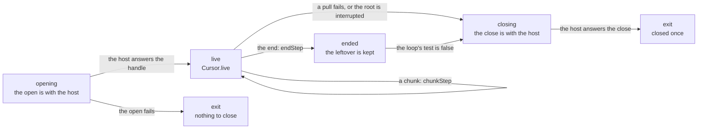
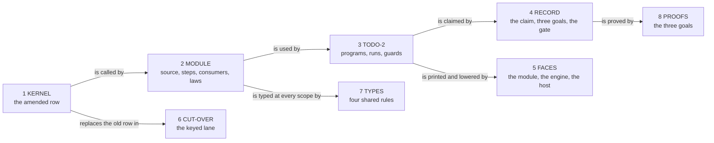

# 2026-10-07 packet: streams

Status: a research note (history, not authority). It rules nothing, and it lands nothing. Base:
`0e9de44f`, branch `plan/open-parts`. The branch's head, `04801903`, adds two research packets
and no source. It prepares decisions row 205 and the streams step of row 204 as slices. Its
driver is the to-do application's second scenario. A first packet holds the integers
(`docs/research/2026-10-07-packet-integers.md`).

## 1. The one thing to know first

**The first profile adds no constructor, no atom, no decision and no cell.** A stream is a
record of three programs: open, pull and close. Its two consumers are programs over `scope`,
`acquireRelease`, `iterate` and the tag decision. The to-do application's second slice builds
and runs in scratch. Its TypeScript module is printed and reads back, and its record passes
the gate (appendix B gives each command).

Four more facts follow from the read of the tree.

- **Put the amended pull row beside the old one.** An edit of `Stream.pullRow` in place moves
  the keyed lane: 49 fixtures, one binding and the pinned digest `CASES_SHA256`.
- **The end is a value, and the checker agrees.** The paged list answers a list of to-dos and
  fails with the repository's error alone. The rejected form, the end as a failure with a
  `unit` leftover, is not typed: `errorNotAdmitted` (tested, probe S3).
- **The model's half is proved, and the machine's half is three planned goals.** A bounded
  search over 57,344 scripts and chunk lists finds no counterexample. It finds each of three
  planted faults.
- **The record moves one pinned number.** The claim theorem rests on three goals. So
  `restingPin` (`Test/Audit/AxiomGate.lean`) moves by one. The sibling packet's record slice
  moves the same pin.

## 2. What exists, and what is reused

### 2.1 What was read and run

| What | Evidence word |
| --- | --- |
| `AGENTS.md`; `docs/core/controlled-english.md` §2, §3.8, §5 to §7 | reading |
| Decisions rows 204, 205, 206, 254, 255, 257 and 301; DI-11 and DI-69 | reading |
| `src/Effect4/Program/Stream.lean` in full; `harness/truth/session/Keyed.lean` and `keyed-bindings.ts` at the stream parts; `scripts/check-host-protocol.py` | reading |
| `src/Effect4/Modules/Words.lean`, `Waiting.lean` and the Queue's three files; the heads and the scope sections of `src/Effect4/Laws/Modules/Waiting.lean` and `src/Effect4/Laws/Modules/Queue/Ops.lean` | reading |
| `Test/Dogfood/Scenario.lean`, `Scenario/Todo.lean`, `Scenario/Routing.lean`, `Scenario/QueueWorkers.lean` at its goals, `Scenario/Faces.lean`, `Scenario/Gate.lean` and `Scenario/Lowered.lean` at their heads | reading |
| `docs/research/2026-10-05-claude-lead/module-factory-plan.md` in full, and `module-cards/pool.md` | reading |
| `docs/research/2026-09-10-stream-and-completion-specification.md`; from the main checkout, the three other stream notes that the brief names | reading |
| `vendor/effect-4.0.0-rc.112/src/Pull.ts`, `Stream.ts`, `Channel.ts` and `Cause.ts`, at the declarations of section 2.4 | reading |
| Eight scratch files, each run by `lake env lean` in the worktree (appendix B) | tested |
| No TypeScript compiler, no `bun` and no `dune` ran. Each statement about a target face is a reading, or it is marked as assumed | reading |

The notes `queues-review.md`, `waiting-design.md` and the folder `queue-contract/` were not read
for this packet. The Queue's landed files stand for them here.

### 2.2 The coordinator's facts, checked

| # | The fact | Verdict | Evidence |
| --- | --- | --- | --- |
| G1 | The kernel is three host rows over a scope, with no stream constructor | holds | reading (`src/Effect4/Program/Stream.lean`) |
| G2 | Row 205 amends the kernel when streams land; row 204 orders queues, then streams | holds | reading |
| G3 | Four research notes on streams | one stands in the worktree. Three stand in the main checkout alone | a listing of both folders |
| G4 | `harness/streams/` | absent from the worktree. The main checkout holds two output files there, and no script under `scripts/` writes them | a listing; a search |
| G5 | The Queue's cell, steps and profile stand under `src/Effect4/Modules/` | the cell and the steps do. The profile stands in `src/Effect4/Laws/Modules/Queue/Profile.lean` | a listing |
| G6 | `Test/Dogfood/Scenario/Todo.lean` holds four programs over four host rows | holds. It holds no claim and no record, and no lane lists it | reading |

### 2.3 What is reused

| Need | Declaration and path | Rows |
| --- | --- | --- |
| The kernel's three rows and its refinement | `openRow`, `pullRow`, `closeRow`, `table`, `chunk?` (`src/Effect4/Program/Stream.lean`) | DI-11 |
| A decision by tag, and what each arm binds | `Decision.tag`, `Decision.decide` (`src/Effect4/Program/Decision.lean`); `selectTag` (`src/Effect4/Program/Authoring/Lifts.lean`) | — |
| A scope and a registered release | `scope`, `acquireRelease` (`src/Effect4/Program/Authoring/Lifts.lean`) | — |
| The one loop, with a stated cursor type | `LoopSpec`, `iterateWith` (`src/Effect4/Program/Authoring/Loops.lean`) | DI-91 |
| Binders as Lean functions over minted names | `minting`, `bindWith`, `andThen`, `selectOptionWith` (`src/Effect4/Program/Authoring/Sugar.lean`) | — |
| The words of a step term | `nilT`, `noneT`, `notT`, `len` (`src/Effect4/Modules/Words.lean`) | 255 |
| An index loop over a list | `postAll` (`src/Effect4/Modules/Waiting.lean`), whose loop `forEachOf` repeats | 238 |
| A handle that the host allocates | `externalValue` (`src/Effect4/Program/Compile.lean`): the host answers the next index | — |
| The reading and the typing of a term | `Reads`, `reads_app`, `reads_some`, `reads_noneT`, `atom_pair` (`src/Effect4/Laws/Modules/Reading.lean`); `TypesEach`, `types_pair`, `types_some`, `types_noneT` (`src/Effect4/Laws/Modules/Checking.lean`) | 257 |
| The scope judgment of each builder | `iterateWith_scoped` (`src/Effect4/Laws/Program/Authoring/Loops.lean`); `scope_scoped`, `acquireRelease_scoped`, `selectTag_scoped` (`src/Effect4/Laws/Program/Authoring/Lifts.lean`); `bindWith_scoped` (`src/Effect4/Laws/Program/Authoring/Sugar.lean`); `Row.call_scoped` (`src/Effect4/Laws/Program/Author.lean`) | — |
| A module's part as a structure of scope facts | `Waiter.Scoped` (`src/Effect4/Laws/Modules/Waiting.lean`) | 255 |
| A scenario's record, its script alphabet and its gate | `Scenario`, `NamedRun`, `Control`, `green`, `red`, `Move`, `Sel`, `answer`, `script`, `play`, `held`, `live`, `requestsOn`, `#scenario_gate` (`Test/Dogfood/Scenario.lean`) | 254 |
| The budget premise of a law of a whole run | `funded` (`src/Effect4/Run/Tape.lean`) | 226 |
| A planned goal and its placement | `proof_goal` (`tools/ProofGraph/Goal.lean`); `@[semantics …]` (`src/Effect4/Laws/Auto/Semantics.lean`) | 203, 207 |
| The to-do application's data and rows | `todoTy`, `sqlErrTy`, `insert`, `all`, `setDone`, `delete`, `todo` (`Test/Dogfood/Scenario/Todo.lean`) | 206 |

The three most valuable reuses are the tag decision, `acquireRelease` in a `scope`, and the
scenario driver with its gate. The first reads the amended answer with no new machine rule.
The second gives the close at every exit. The third gives the scripts, the observation and
the controls their form.

### 2.4 What rc.112 does at each point

Each line cites the pinned source by file and declaration.

| Point | rc.112: file, declaration | What rc.112 does | What the module does |
| --- | --- | --- | --- |
| A pull's type | `Pull.ts`, `Pull` | an effect that fails with `Cause.Done<Done>` at the end | a host row that answers a chunk or the end |
| The end's leftover | `Cause.ts`, `Done` and `done`; `Pull.ts`, `filterDoneLeftover` | the end carries a value | the end's pair carries the leftover |
| The end beside a failure | `Pull.ts`, `filterDone` | a failure wins over the end, and an interruption does not | the end is no failure, so no cause holds both |
| Reading one pull | `Pull.ts`, `matchEffect` | three arms: a value, a failure, the end with its leftover | the tag decision on `End`; a failure is the row's error column |
| Open and close | `Channel.ts`, `runWith` (private to the module) | a fresh scope, closed with the exit at every exit | `scope` around `acquireRelease` of the open and the close |
| Collect | `Stream.ts`, `runCollect`; `Channel.ts`, `runFold` | a loop pulls for ever; the end leaves it; each chunk's members are pushed | `runCollect`: a loop with a test, and `append` at each chunk |
| For each | `Stream.ts`, `runForEach`; `Channel.ts`, `runForEach` | an index loop over each chunk; `f` once for each element | `runForEach`: the same index loop in each round |
| A pull as a value | `Stream.ts`, `toPull`; `Channel.ts`, `toPull` and `toPullScoped` | `toPull` guards the pull with a semaphore of one permit; `toPullScoped` does not | left out: one puller needs no guard |
| A chunk | `Stream.ts`, `toPull`, at its type | a chunk is a non-empty array | the row's type has the empty chunk as a member; the binding refuses one |
| A paged source | `Stream.ts`, `paginate` | the program holds the page state; an empty page is skipped; the end comes on the pull after the last page | left out: it needs a cell for the page state |

The keyed lane's binding reads a pull with `Pull.matchEffect` today
(`harness/truth/session/keyed-bindings.ts`). Its arm for the end answers `Option.none()`, so it
drops the leftover. That is the form (b) that row 205 rejects.

## 3. The definitions and the statements to add

Appendix A holds each declaration in Lean, by its target file. This section follows the
contract card of the module procedure
(`docs/research/2026-10-05-claude-lead/module-factory-plan.md`). The card's first item, the
source, is section 2.4.

### 3.1 The operations and the first profile

The rule is the integers' rule: **orchestration, not computation.** A consumer drives effects
and gathers. It transforms nothing.

| Operation | What it does | rc.112's name |
| --- | --- | --- |
| `Source.host` | a stream from three host rows at one request | the kernel of DI-11 |
| `runCollect` | every element, in the order of the pulls | `Stream.runCollect` |
| `runForEach` | a program once for each element, in the order of the pulls | `Stream.runForEach` |
| `runWith` (not public) | open, fold with an effectful step, close | `runWith` and `runFoldEffect` of `Channel.ts` |

The first profile leaves these out, each by name.

- `map`, `filter`, `mapEffect`, `flatMap`, `zip` and `merge`: a consumer's body does the work.
- `take` and every early stop: the loop ends at the end alone.
- `toPull` and concurrent pulls: one fiber pulls. A shared stream needs a cell and a wait.
- `paginate` and `unfold`: a source that the program steps needs a cell for its state.
- A leftover other than `unit` in a consumer: `Source.done` is a field, and both consumers
  drop the leftover.
- A stream as a value of the type language: `Source` is a Lean record of programs, as a
  `Waiter` is.

### 3.2 The state and its steps, in the Queue's form

**The state is the loop's cursor.** One fiber pulls, so no other fiber reads the state. The
cursor is a pair: what the consumer gathered, and the leftover once the end arrived. It is the
value of `iterate`'s cursor. No `Ref` holds it.

| The Queue's part | The Stream's part | File (new) |
| --- | --- | --- |
| the cell and its type | the cursor's type, `prod A (option D)` | `src/Effect4/Modules/Stream/Steps.lean` |
| six step terms | two step terms, `endStep` and `chunkStep`, and the loop's test | the same |
| the operations | `drain`, `runWith`, `runCollect`, `runForEach` | `src/Effect4/Modules/Stream/Ops.lean` |
| the waiter | the source record, `Source` | `src/Effect4/Modules/Stream/Source.lean` |
| the abstract model | `Cursor`, with `finish`, `gain`, `live`, `step` and `drain` | `src/Effect4/Laws/Modules/Stream/Model.lean` |
| the encoding relation | a function: `Cursor.val` | the same |
| the steps' agreement | `endStep_agrees`, `chunkStep_agrees`, `live_agrees` | `src/Effect4/Laws/Modules/Stream/Steps.lean` |
| the steps' typing | `types_endStep`, `types_chunkStep` | `src/Effect4/Laws/Modules/Stream/Typing.lean` |
| the scope laws | `Source.Scoped`, `runCollect_scoped`, `runForEach_scoped` and eight more | `src/Effect4/Laws/Modules/Stream/Ops.lean` |
| the profile, the capacity, the invariant | none: the profile is every cursor | — |

The diagram shows the states of one consumer's run and what moves it. It shows the design,
and it proves nothing.



**Three small builders are new and name no module.** `acquireWith` and `selectTagWith` are
`acquireRelease` and `selectTag` over minted names, as `bindWith` is `bind`. `forEachOf` is the
index loop of `postAll`. They belong beside `bindWith` and `forRange`
(`src/Effect4/Program/Authoring/Sugar.lean` and `Loops.lean`). The sugar packet's slices can
take them.

### 3.3 Row 205's amendment of the kernel

**A pull answers a union of two tagged pairs.** `pulledTy elem done` is
`union (prod (lit "Chunk") (list elem)) (prod (lit "End") done)`. The end is a member of the
answer column. No error column holds it.

- **Why two tagged pairs.** The tag decision reads them today. `pulled_decides` states it for
  every leftover and every list of items, and its proof is `rfl`.
- **The amended row stands beside the old one.** `pullEndRow` has the kernel's name and
  spelling, and the new answer. `ofOption` maps today's answer to the new one: `none` to the
  end with no leftover, and `some chunk` to the chunk.
- **The binding's refinement stays.** `pulled?` refuses an empty chunk, as `chunk?` does. The
  type has the empty chunk as a member, and `runCollect` gathers nothing from one.
- **The TypeScript binding is one named connection.** `Pull.matchEffect` answers
  `["Chunk", chunk]` at a value and `["End", leftover]` at the end. It is not written here.

The old row goes in a later slice, with the keyed lane's recordings (slice 6).

### 3.4 The mandatory questions

| The card's question | The answer in the first profile | Evidence |
| --- | --- | --- |
| The atomic boundaries | each pull is one host call; the step after its reply is a pure term | reading (`drain`) |
| Where a wait registers | at the pull row's call, in the session; the module holds no waiter | reading |
| The commit point | the loop's step: an element is delivered when the cursor takes the next accumulator | reading |
| An interruption while the open is with the host | the machine keeps the call; it takes the answer, and it closes at once with no pull | tested (probe S5, one script) |
| An interruption while a pull is with the host | the call leaves the machine; the close runs; the root's exit is the interruption | tested (probe S5) |
| An interruption while the close is with the host | the close stays; the root's exit is the interruption, though the loop ended | tested (probe S5) |
| How a notification selects its receiver | none: no fiber waits on the module | reading |
| Ownership | the consumer's scope owns the opened stream | reading (`runWith`) |
| The cleanup after a failure | the close is the scope's finalizer; it runs at the end, at a failure and at an interruption | tested (the scenario's runs) |

### 3.5 The representation, the context and the public observation

- **Handles.** The opened stream is an external handle at a target name. The host allocates
  it: its answer is the next index.
- **Numbers and time.** The module reads no clock. `runForEach` counts by `lt` and `succ` on
  naturals below a chunk's length.
- **The order.** The order of delivery is the order of the pulls, and inside a chunk the
  order of its list.
- **What a client sees.** The consumer's answer, its failure, and the calls on the source's
  three rows. The cursor and the handle stay inside the consumer.

### 3.6 The laws of each step

Every law of this table is proved in scratch within `[propext, Quot.sound]`.

| Law | It says | Probe |
| --- | --- | --- |
| `endStep_agrees` | the end step reads the value of the model's finished cursor | S2 |
| `chunkStep_agrees` | the chunk step reads the value of the cursor that goes on | S2 |
| `live_agrees` | the loop's test reads the model's `live` | S2 |
| `types_endStep` | the end step is typed at `prod A (option D)` | S2 |
| `types_chunkStep` | the chunk step is typed at `prod A (option never)`, below the cursor's type | S2 |
| `Cursor.drain_ended` | after the end the model reads no answer | S2 |
| `Cursor.drain_chunks`, `Cursor.collects` | chunks and then the end give the concatenation and the leftover, whatever follows | S2 |
| `pulled_decides` | the tag decision selects the end's arm with the leftover, and the chunk's arm with the pair | S1 |
| `Source.host_scoped` and nine more | each builder, each step and each operation keeps the authoring scope judgment | S4 |

**Placement of the step laws.**

- Concept: `translation-simulation`; property: a module's expansion agrees with its model on
  its profile (row 79).
- Question: parts of a proposed claim of the semantics registry, `stream-steps-agree`;
  consumer: the loop invariant of `delivered_once`, where the cursor's value is the model's.
- Reach: one step, at every environment that reads the step's arguments. No store and no host.
- Does not establish: any run, any order of two steps, or that a run reaches a step.
- Unlocks: R10, as the Queue's step laws do for its claim.

**Placement of the other laws.**

- The two typing laws: concept `store-typing`, requirement R4, as the Queue's step typing.
  Their consumer is the typing of `drain` at every scope (slice 7).
- The scope laws: concept `initial-algebras-folds`, requirement R4, steps of the claim
  `operation-data-scoped`. Their consumer is `Api.Author.build` of each client. They state no
  behaviour.
- `pulled_decides`: concept `residual-program-typing`, requirement R10, as the routing
  scenario's decision clause. Its consumer is the clause "decides" of the record.

**One family is owed.** The typing of a consumer at every scope needs four shared rules that
the tree lacks. They are the rules of a loop, a tag selection, a scope and a row's call, each
with an error column. `has_bindWith`, `has_andThen` and `has_acquireRelease` exist
(`src/Effect4/Laws/Modules/Waiting.lean`). A concrete program takes its typing from the
checker (row 257), so the scenario does not wait for them.

### 3.7 The planned goals of a whole run

Each statement is over the scenario's program and its scripts. No host row has a meaning in
the reference (DI-69), so no statement quantifies over hosts.

**`delivered_once`: each pulled element is delivered once, in order.**

- Concept: `translation-simulation`; property: the expansion agrees with the model on the
  profile.
- Question: planned goal `delivered_once`, a part of the proposed claim
  `stream-expansion-agrees`; consumer: the scenario's claim `paged`.
- Reach: the program `listPaged`. The script `served`: the open, each chunk, the end, the
  close. Every list of chunks whose members are to-dos. A funded run at the default budgets.
  Rows 204, 205 and 254.
- Does not establish: another interleaving of the same answers, a run with a failure or an
  interruption, or progress. The script supplies every answer.
- Unlocks: R10: the first law of a whole run for a module with no cell.

**`closed_once`: the stream is closed exactly once.**

- Concept: `scope-lifetime-finalization`; property: a registered release runs exactly once at
  its scope's close.
- Question: planned goal `closed_once`; consumer: the scenario's claim `paged`.
- Reach: the program `listPaged`. Every script of the driver's alphabet. A funded run. The
  machine performs at most one call of the close. Where the root has an exit and the host held
  a pull, the host held exactly one close.
- Does not establish: that a run reaches an exit. A frontier keeps the close as a live call.
  It says nothing of the host's own cleanup.
- Unlocks: R11, beside `cleans_once` and the two `releases_once` goals: the first resource
  that a host row opens.

**`end_not_failure`: the end is not a failure.**

- Concept: `translation-simulation`; property: the end is a state of the model, kept apart
  from failures (row 205).
- Question: planned goal `end_not_failure`, a part of `stream-expansion-agrees`; consumer: the
  scenario's claim `paged`.
- Reach: the program `listPaged`. Every script of a funded run whose replies are successes and
  which interrupts no fiber. The root does not fail.
- Does not establish: that the root exits, or anything under a failing reply.
- Unlocks: R10. The typed half is a finite check: the program's error column is the
  repository's alone.

**A bounded search stands behind each statement.** It is a finite check, and it proves
nothing.

| Statement | The searched set | Runs | Holds |
| --- | --- | --- | --- |
| `closed_once` | every script of at most five acts over eight acts of a host and a canceller | 37,449 | all |
| `end_not_failure` | every script of at most six successful acts over five | 19,531 | all |
| `delivered_once` | every list of at most five chunks over three shapes of chunk | 364 | all |
| red: a consumer with no scope | the first set, at most three acts | 585 | 545: forty runs break `closed_once` |
| red: the end as a failure | the second set, at most four acts | 781 | 763: each of the 18 exits breaks `end_not_failure` |
| red: a consumer that keeps the last chunk | the third set, at most three chunks | 40 | 10 |

### 3.8 The to-do application's second slice

**The rows.** The repository gains a cursor: three host rows over the handle target
`TodoRepo.Cursor`.

| Row | Request | Answer | Error |
| --- | --- | --- | --- |
| `TodoRepo.openList` | `unit` | `handle "TodoRepo.Cursor"` | the repository's |
| `TodoRepo.nextPage` | the handle | `pulledTy todoTy unit` | the repository's |
| `TodoRepo.closeList` | the handle | `unit` | `never` |

**The programs.** `listPaged` is `runCollect` of the repository's stream. `completeAll` is
`runForEach` with `setDone` in its body. Both build. `listPaged` answers a list of to-dos and
`completeAll` answers `unit`, each with the repository's error alone (tested).

**The observation** has seven fields.

- The root's exit.
- How often the host held the open, a pull and the close: three counts.
- The requests on `setDone`, in order.
- The rows of the calls that the machine waits on.
- The refused rows.

**The named runs and the controls.**

| Run | Its script | What it shows |
| --- | --- | --- |
| `two-pages` | open, two pages, the end, close | the three to-dos in order; one open, three pulls, one close |
| `empty` | open, the end, close | the empty list; closed once |
| `pull-fails` | open, a page, a failing pull, close | the root fails with the repository's error; closed once |
| `interrupted` | open, a page, a cancellation of the root, close | the exit is an interruption; closed once; no call waits |
| `unclosed` | open, two pages, the end | no exit; the machine waits on the close alone |
| `after-end` | open, the end, a page, close | the page is not taken: the program pulls no more |
| `no-chunk` | open, an answer that is no chunk and no end | the session refuses the reply |
| `leaky` (a fault) | a consumer with no scope | the same list, and no close |
| `forgetful` (a fault) | a consumer that keeps the last chunk | the first page is lost |

Nine controls read these runs. Each of four clauses has a green control and a red one, and
the clause "closed" has a second green one. The gate accepts the record (tested). It refuses
an altered control by name (tested, probe `S1Red`).

**Two more finite facts.** `completeAll` on two pages holds three `setDone` requests in order,
each before the next pull. A failure of the body's row stops the stream, and the stream is
closed once.

### 3.9 The printed forms, for tsgo

No TypeScript compiler ran. Both programs are printed and read back in Lean (tested). The
coordinator checks these lines of the printed `listPaged` with the pinned tsgo 7. Each
expectation is assumed.

```ts
// 1. the release takes the resource and the exit; expect no diagnostic
Effect.acquireRelease(TodoRepo.openList(), (a0, a1) => TodoRepo.closeList(a0))
// 2. the stated cursor type against its initial value; expect no diagnostic
let a1: readonly [ReadonlyArray<{ readonly done: boolean; readonly id: number; readonly title: string }>, Option.Option<void>] = pair(nil(), none())
// 3. the tag decision on the amended answer; the first arm's `a3` is `void`,
//    the second arm's `a3` is `readonly ["Chunk", ReadonlyArray<…>]`
caseTag(a2, "End", (a3) => Effect.succeed(pair(fst(a1), some(a3))), (a3) => Effect.flatMap(Effect.succeed(append(fst(a1), snd(a3))), (a4) => Effect.succeed(pair(a4, none()))))
// 4. the step assigns the union of the two arms' answers to the cursor; expect no diagnostic
step: (a2) => { a1 = a2 }
// 5. `completeAll`: the cursor's first part is `void`, and its initial value is `undefined`
let a1: readonly [void, Option.Option<void>] = pair(undefined, none())
```

The row's answer renders as `readonly ["End", void] | readonly ["Chunk", ReadonlyArray<…>]`.
Line 4 is the one to watch: tsgo forms no union of two inference candidates (row 303). Here
`caseTag` declares the union in its own signature, so none is inferred (reading of
`harness/truth/prelude.ts`).

## 4. The slices, in commit order

### 4.1 The table

The diagram shows the order of the slices. It shows dependencies, and no dates.



| # | Slice | Size | Depends on | Existing tests that move |
| --- | --- | --- | --- | --- |
| 1 | KERNEL: the amended pull row beside the old one | S | — | none |
| 2 | MODULE: the source, two steps, two consumers; the model and the laws | M | 1 | none; two documents gain rows |
| 3 | TODO-2: the paged list and `completeAll`, with their runs | S | 2 | none; `Test/All.lean` gains one import |
| 4 | RECORD: the claim, three planned goals, the record and its gate | S | 3; the claim form of the sibling packet | `restingPin`; the semantics report |
| 5 | FACES: the printed module, the engine's fixture, the host runs | M | 3 | `Faces.lean`, `Tape.lean`, `Lowered.lean`; the keyed lane's list |
| 6 | CUT-OVER: the keyed lane on the amended row; the old row goes | M | 1 | 49 fixtures' recordings; `CASES_SHA256`; three batteries |
| 7 | TYPES: the consumers typed at every scope | L | 2 | none |
| 8 | PROOFS: the three goals become theorems | L | 4; DI-69 for the tree forms | `restingPin` moves back |

Slices 1 to 3 need no ruling and no other packet. Slices 5, 6 and 7 are independent of each
other.

**No slice moves a wire tag, the case policy or the prelude.** The module adds no constructor
and no atom, and its definitions match on no policy family. Check slice 2 with
`make check-cases` all the same. Slice 6 alone moves recorded bytes: the keyed lane's.

### 4.2 Slice 1, KERNEL

- **Files.** `src/Effect4/Program/Stream.lean` gains `pulledTy`, `pullEndRow`, `chunkVal`,
  `endVal`, `pulled?` and `ofOption` (appendix A.1). Its header gains row 205.
- **Size.** S: six definitions beside the old ones. Nothing calls them yet.
- **Tests and generated files that move.** None is expected. The old row keeps its text, and
  nothing calls the new definitions.
- **New battery lines.** They stand in `Test/Api/KeyedHostContract.lean`, beside the old
  row's. The refinement at the end, at a chunk and at an empty chunk. Membership of both
  values. A red control at a leftover of another type. `ofOption` at today's two answers.

### 4.3 Slice 2, MODULE

- **Files.** New: three files under `src/Effect4/Modules/Stream/` and four under
  `src/Effect4/Laws/Modules/Stream/` (section 3.2). Edited: `src/Effect4.lean` and
  `src/Effect4/Laws.lean`, each at its anchor of the composed modules. The authoring files
  gain the three small builders, with their scope lemmas.
- **Size.** M: ten definitions and one record, and 18 laws with one structure of scope facts,
  all compiled in scratch (appendix B). The laws compose the lifts' lemmas and add no proof
  search.
- **Documents that move.** `docs/ARCHITECTURE.md` gains two rows, by hand, and
  `tools/Tools/ArchitectureRoles.lean` gains the same two. `make gen-architecture` reads the
  second.
- **New battery lines.** None is needed: slice 3 holds the readers and the controls. The
  model's two finite evaluations of appendix A.3 may stand in a battery of the module.
- **A name to settle.** The kernel's namespace is `Effect4.Program.Stream`. The Queue's laws
  stand in `Effect4.Queue`. A module namespace `Effect4.Stream` makes `Stream.pullRow`
  ambiguous in a file that opens both. Lean's own `Stream` class is a third reading.

### 4.4 Slice 3, TODO-2

- **Files.** New: `Test/Dogfood/Scenario/TodoPaged.lean`, sections 3 to 5 of the draft
  (appendix A.5). Edited: `Test/All.lean`, one import at the scenarios' anchor;
  `Test/Dogfood/README.md`, one row.
- **Size.** S: three rows, two programs, 16 guards and two faults, in the first slice's form.
- **Tests that move.** None.
- **New battery lines.** The guards of the draft. Each is a finite evaluation or a control.

### 4.5 Slice 4, RECORD

- **Files.** `Test/Dogfood/Scenario/TodoPaged.lean` gains sections 6 and 7 of the draft: one
  proved clause, three planned goals, the claim, the record and `#scenario_gate`.
  `tools/Tools/SemanticsRegistry.lean` gains the module as a root, and two proposed claims.
- **Size.** S in text. It waits for the claim form: the first slice's header defers the record
  to that design.
- **Tests and generated files that move.** `restingPin` of `Test/Audit/AxiomGate.lean`, by
  one: the claim `paged` rests on goals. `generated/semantics.md`, by `make gen-semantics`:
  three goals join the open parts of R10 and R11. Both are expected: no build ran here.
- **A merge note.** The sibling packet's slice RECORD moves the same pin. The coordinator sets
  the number at the merge.

### 4.6 Slices 5 to 8

- **FACES.** Two guards in `Test/Dogfood/Scenario/Faces.lean`. One fixture under
  `ocaml/engine/test/scenarios/`, written by `make gen-fixtures` from `Tape.lean`. One name in
  `SCENARIOS` of `scripts/check-host-protocol.py`. Size M: three lanes, and none ran here.
- **CUT-OVER.** `Stream.pullRow` takes the amended answer and `pullEndRow` goes. `chunk?`
  gives way to `pulled?`. The keyed lane's binding answers the two tagged pairs. Its 49
  fixtures are recorded again, and `CASES_SHA256` moves: a review event. Three batteries read
  the old row: `Test/Api/KeyedHostContract.lean`,
  `Test/Counterexamples/Machine/Runtime/HostHandleForgery.lean` and
  `harness/truth/session/Keyed.lean`. Size M.
- **TYPES.** Four shared rules and the two consumers' typing at every scope. Size L: each rule
  is a proof over the checker's rule for its node, as `has_acquireRelease` is.
- **PROOFS.** `closed_once` needs the scope's finalizer law on a run with host calls.
  `delivered_once` and `end_not_failure` need the loop's invariant over a script. Size L.

## 5. Risks, stop rules and open questions

### 5.1 Risks

- **A stated cursor type outside normal form.** The first draft stated the cursor's type with a
  record in written field order. The program was printed and did not read back. `drain`
  normalizes the stated type.
- **A count of held calls misses a live call.** Before the host answers the close, the close
  is a live call and no held one. The goal counts the calls that the machine performed.
- **An empty chunk.** The type has it as a member. The Lean consumer gathers nothing from it.
  rc.112's pull never gives one, and the binding refuses one.
- **The exit after an interruption during the close.** The root's exit is the interruption,
  though the loop ended with a value (tested, one script). rc.112's behaviour at this point
  is not read here.
- **Two packets, one pin.** Section 4.5.
- **`open … in` before `section`.** It scopes one command. The draft opens inside the section.

### 5.2 Stop rules

1. Stop if slice 1 changes any byte of `cases.json` of the keyed lane. The old row must stay.
2. Stop if `make check-cases` reports a new site in slice 2.
3. Stop slice 4 if the plan shows a fourth goal under `paged`.
4. Stop slice 6 before the digest moves, and show the coordinator the diff of the recordings.
5. Stop a proof of `closed_once` that needs a premise on the host. State the premise first.

### 5.3 Open questions, answered from the tree

| Question | Answer | Evidence |
| --- | --- | --- |
| Does the first profile need a cell? | No. One fiber pulls, and the loop's cursor holds the state | reading; tested (the scenario) |
| Does the amended answer need a new decision? | No. `Decision.tag` reads it | proved in scratch (`pulled_decides`) |
| Can the two rows stand side by side? | Yes. `ofOption` connects their answers | tested (probe S1) |
| Is `funded` the right budget premise? | Yes. A statement over runs takes it by that name | reading (`src/Effect4/Run/Tape.lean`) |
| Does the gate need the semantics registry's root? | No. The gate accepts the record with no edit of it | tested |
| Can rc.112's form be written at all? | Not with a `unit` leftover: a pair of a tag and `unit` is no error type | tested (probe S3) |
| Do the scope laws need new lemmas of the lifts? | No. Each is one composition | proved in scratch (probe S4) |

### 5.4 Questions for the owner

1. **The answer's representation.** Two tagged pairs, `["Chunk", list]` and `["End", leftover]`,
   or another shape? Recommended: the tagged pairs. The existing tag decision reads them, and
   they are printed as a TypeScript union that `caseTag` takes apart.
2. **An empty chunk.** A member of the type that the binding refuses, as today, or a refusal
   by the type? Recommended: as today. The type language has no non-empty list.
3. **The leftover's domain.** `unit` alone in the first profile, as rc.112's `Stream` has
   `void`? Recommended: yes. `Source.done` stays a field for a later channel.
4. **The surface.** Are `runCollect` and `runForEach` the public consumers, with the fold
   `runWith` kept inside? Recommended: yes, until a program folds.

## What this does not establish

- No goal of a whole run is proved. Each is a planned goal, tested on a bounded set of scripts
  at the default budgets.
- The model's laws are laws of a Lean function. No theorem joins the machine's loop to it.
- No statement covers a host. A script is a list of moves, and DI-69 is open.
- No TypeScript line met a compiler, no fixture met the engine, and no run met a host.
- The consumers' typing at every scope is owed. The scenario's programs are typed by the
  checker at their build.
- The bounded search reads one program at one element type. It says nothing of another source
  or of another consumer.
- rc.112 is read, not run. The table of section 2.4 is a reading of the pinned source.

## Appendix A. The compiled drafts, by target file

Each block is the text of a scratch file that compiled (appendix B). The drafts stand in the
namespace `PacketStream`, beside the tree. A slice moves each to its target file and its target
namespace. A new core module opens with `module`, `public import` and
`@[expose] public section` (decisions row 200).

### A.1 `src/Effect4/Program/Stream.lean` (edited): the amended row, beside the old one

```lean
/-! ## 1. The kernel, amended (decisions row 205) -/

/-- **What a pull answers**: a chunk, or the end with its leftover. The end is a value of the
answer column, so it is no failure. Two tagged pairs: `select` on the tag `End` takes them
apart. -/
def pulledTy (elem done : Ty) : Ty :=
  .union (.prod (.lit "Chunk") (.list elem)) (.prod (.lit "End") done)

/-- The amended pull row, beside `Stream.pullRow`. -/
def pullEndRow (target : String) (elem done error : Ty) : Row where
  name := "streamPull"
  spelling := "Host.pull"
  kind := .async
  registration := .external
  request := .handle target
  answer := pulledTy elem done
  error := error
  cite := "vendor/effect-4.0.0-rc.112/src/Pull.ts, Pull and matchEffect; Stream.ts, toPull"

/-- A chunk value and an end value, as a host answers them. -/
def chunkVal (items : List Val) : Val := .list [.str "Chunk", .list items]
def endVal (leftover : Val) : Val := .list [.str "End", leftover]

/-- The binding's refinement of an answer: the end with its leftover, or a chunk with a member.
The row's type admits an empty chunk, and the binding refuses it, as `Stream.chunk?` does. -/
def pulled? : Val → Option (Except Val (List Val))
  | .list [.str "End", leftover] => some (.error leftover)
  | .list [.str "Chunk", .list (head :: tail)] => some (.ok (head :: tail))
  | _ => none

#guard pulled? (endVal .unit) = some (.error .unit)
#guard pulled? (chunkVal [.nat 1]) = some (.ok [.nat 1])
#guard pulled? (chunkVal []) = none
#guard Val.hasTy (chunkVal [.nat 1, .nat 2]) (pulledTy .nat .unit)
#guard Val.hasTy (endVal .unit) (pulledTy .nat .unit)
#guard !Val.hasTy (endVal (.nat 1)) (pulledTy .nat .unit)
-- the connector to today's row: `none` is the end with no leftover, `some chunk` is the chunk
def ofOption : Val → Option Val
  | .none => some (endVal .unit)
  | .some (.list items) => some (chunkVal items)
  | _ => none
#guard ofOption .none = some (endVal .unit)
#guard ofOption (.some (.list [.nat 1])) = some (chunkVal [.nat 1])
```

### A.2 `src/Effect4/Modules/Stream/` (new): the source, the steps and the consumers

`Source` and `Source.host` go to `Source.lean`, the two steps to `Steps.lean`, and `drain`,
`runWith`, `runCollect` and `runForEach` to `Ops.lean`. `acquireWith`, `selectTagWith` and
`forEachOf` name no module: they go to the authoring files.

```lean
/-! ## 2. The module: a source, two steps, two consumers -/

/-- **What a stream's source supplies**: how to open it, how to pull it once, and how to close
it. The three are given where the program is written, so the module stores no code. -/
structure Source where
  /-- The element type. -/
  elem : Ty
  /-- The leftover's type: `unit` for a stream. -/
  done : Ty
  /-- Open the stream. It answers the opened handle. -/
  opened : Src NativeOp
  /-- One pull of the opened stream: it answers `pulledTy elem done`. -/
  pull : TermSrc → Src NativeOp
  /-- Close the opened stream. The consumer registers it as its scope's finalizer. -/
  close : TermSrc → Src NativeOp

/-- A host stream: the kernel's three rows at one request. -/
def Source.host (elem done : Ty) (openRow pullRow closeRow : RowDef) (request : TermSrc) : Source :=
  { elem, done
    opened := Row.call openRow request
    pull := fun h => Row.call pullRow h
    close := fun h => Row.call closeRow h }

/-- `acquireRelease` of two minted names, with the resource read by the release. -/
def acquireWith (acquire : Src NativeOp) (release : TermSrc → Src NativeOp) : Src NativeOp :=
  minting "resource" fun r => minting "exit" fun x =>
    acquireRelease r x acquire (release (minted r))

/-- `select` on a tag of two minted names: the hit reads the payload, the miss reads the rest. -/
def selectTagWith (scrutinee : TermSrc) (tag : String) (hit miss : TermSrc → Src NativeOp) :
    Src NativeOp :=
  minting "payload" fun p => minting "rest" fun r =>
    selectTag p r scrutinee tag (hit (minted p)) (miss (minted r))

/-- **The step at the end**: the cursor keeps its accumulator and takes the leftover. -/
def endStep (acc leftover : TermSrc) : TermSrc := app "pair" [acc, app "some" [leftover]]

/-- **The step at a chunk**: the cursor takes the next accumulator and stays open. -/
def chunkStep (next : TermSrc) : TermSrc := app "pair" [next, noneT]

/-- **The loop of one opened stream**: pull until the end. `gain acc chunk` is the program that
answers the next accumulator. The loop's cursor is the pair of the accumulator and the leftover
once the end arrived. It answers the pair at the end. -/
def drain (src : Source) (accTy : Ty) (zero : TermSrc) (h : TermSrc)
    (gain : TermSrc → TermSrc → Src NativeOp) : Src NativeOp :=
  iterateWith (app "pair" [zero, noneT])
    { cursorTy := some (Ty.prod accTy (.option src.done)).normalize
      while_ := fun c => notT (app "isSome" [app "snd" [c]])
      body := fun c =>
        bindWith (src.pull h) fun answer =>
          selectTagWith answer "End"
            (fun leftover => succeed (endStep (app "fst" [c]) leftover))
            (fun chunk =>
              bindWith (gain (app "fst" [c]) (app "snd" [chunk])) fun next =>
                succeed (chunkStep next))
      step := fun _ next => next }

/-- **Open, drain, close**: the stream is opened inside a scope of its own, and its close is the
scope's finalizer. So the close runs at every exit of the loop. -/
def runWith (src : Source) (accTy : Ty) (zero : TermSrc)
    (gain : TermSrc → TermSrc → Src NativeOp) : Src NativeOp :=
  scope (bindWith (acquireWith src.opened src.close) fun h => drain src accTy zero h gain)

/-- **`Stream.runCollect`**: every element, in the order of the pulls
(`vendor/effect-4.0.0-rc.112/src/Stream.ts`, `runCollect`). -/
def runCollect (src : Source) : Src NativeOp :=
  bindWith (runWith src (.list src.elem) nilT fun acc chunk => succeed (app "append" [acc, chunk]))
    fun last => succeed (app "fst" [last])

/-- `body` once for each member of a list, in order. -/
def forEachOf (items : TermSrc) (body : TermSrc → Src NativeOp) : Src NativeOp :=
  iterateWith (nat 0)
    { while_ := fun i => app "lt" [i, len items]
      body := fun i => selectOptionWith (app "get" [items, i]) (succeed unit) fun item =>
        andThen (body item) (succeed unit)
      step := fun i _ => app "succ" [i] }

/-- **`Stream.runForEach`**: `body` once for each element, in the order of the pulls
(`vendor/effect-4.0.0-rc.112/src/Stream.ts`, `runForEach`). It answers nothing. -/
def runForEach (src : Source) (body : TermSrc → Src NativeOp) : Src NativeOp :=
  andThen
    (runWith src .unit unit fun _ chunk => andThen (forEachOf chunk body) (succeed unit))
    (succeed unit)
```

### A.3 `src/Effect4/Laws/Modules/Stream/` (new): the model, the steps' agreement and typing

The model and its three laws go to `Model.lean`, the agreement laws to `Steps.lean`, and the
two typing laws to `Typing.lean`.

```lean
/-! ## The model of the loop's cursor -/

/-- The cursor of one opened stream: what was gathered, and the leftover once the end arrived. -/
structure Cursor where
  acc : Val
  ended : Option Val

/-- The cursor's value: the pair that the loop carries. -/
def Cursor.val (c : Cursor) : Val :=
  .list [c.acc, match c.ended with | none => Store.Val.none | some l => Store.Val.some l]

/-- The model's step at the end. -/
def Cursor.finish (c : Cursor) (leftover : Val) : Cursor := { c with ended := some leftover }

/-- The model's step at a chunk, with the next accumulator. -/
def Cursor.gain (next : Val) : Cursor := { acc := next, ended := none }

/-- Whether the loop goes on: the test of the loop reads this. -/
def Cursor.live (c : Cursor) : Bool := c.ended.isNone

section Steps

variable {env : Env} {path : List Nat} {vals : List Val}

/-- **The end step agrees with the model**: it reads the value of the finished cursor. -/
theorem endStep_agrees {acc leftover : TermSrc} (c : Cursor) (l : Val)
    (hacc : Reads acc env path vals c.acc) (hl : Reads leftover env path vals l) :
    Reads (endStep acc leftover) env path vals (c.finish l).val :=
  reads_app (.cons hacc (.cons (reads_some hl) .nil)) (atom_pair c.acc (Store.Val.some l))

/-- **The chunk step agrees with the model**: it reads the value of the cursor that goes on. -/
theorem chunkStep_agrees {next : TermSrc} (n : Val) (hn : Reads next env path vals n) :
    Reads (chunkStep next) env path vals (Cursor.gain n).val :=
  reads_app (.cons hn (.cons reads_noneT .nil)) (atom_pair n Store.Val.none)

/-- **The test of the loop reads the model's `live`.** -/
theorem live_agrees {cursor : TermSrc} (c : Cursor)
    (hc : Reads cursor env path vals c.val) :
    Reads (notT (app "isSome" [app "snd" [cursor]])) env path vals (Val.bool c.live) := by
  have hsnd : Reads (app "snd" [cursor]) env path vals
      (match c.ended with | none => Store.Val.none | some l => Store.Val.some l) :=
    reads_app (.cons hc .nil) rfl
  cases hended : c.ended with
  | none =>
    rw [hended] at hsnd
    have h := reads_notT (reads_app (.cons hsnd .nil)
      (show nativeAtom "isSome" [Store.Val.none] = some (Val.bool false) from rfl))
    simpa only [Cursor.live, hended, Option.isNone_none, Bool.not_false] using h
  | some l =>
    rw [hended] at hsnd
    have h := reads_notT (reads_app (.cons hsnd .nil)
      (show nativeAtom "isSome" [Store.Val.some l] = some (Val.bool true) from rfl))
    simpa only [Cursor.live, hended, Option.isNone_some, Bool.not_true] using h

end Steps

section Typing

variable {Op : Type} {sig : Signature Op} {env : Env} {path : List Nat} {types : List Ty}
variable (atoms : sig.atomOf = nativeAtomTy)
include atoms

/-- **The end step types at the cursor's type**, for an accumulator at `A` and a leftover at `D`. -/
theorem types_endStep {acc leftover : TermSrc} {A D : Ty}
    (hacc : TypesEach sig acc env path types A) (hl : TypesEach sig leftover env path types D) :
    TypesEach sig (endStep acc leftover) env path types (.prod A (.option D)) :=
  types_pair atoms hacc (types_some atoms hl)

/-- **The chunk step types below the cursor's type**: the option of nothing is below every
option, so the loop's stated cursor type takes it by subsumption. -/
theorem types_chunkStep {next : TermSrc} {A : Ty}
    (hn : TypesEach sig next env path types A) :
    TypesEach sig (chunkStep next) env path types (.prod A (.option .never)) :=
  types_pair atoms hn (types_noneT atoms)

end Typing

/-! ## The model of a whole loop

The model reads a list of pull answers, as the binding refines them: the end with its leftover,
or a chunk. It takes one step for each answer while the cursor is live. Three facts of the model
are the model's half of the three run statements. The machine's half is the planned goals. -/

/-- One pull's answer, as the binding refines it (`pulled?`, probe S1). -/
abbrev Pulled := Except Val (List Val)

/-- The model's step at one answer. -/
def Cursor.step (gain : Val → List Val → Val) (c : Cursor) : Pulled → Cursor
  | .error leftover => c.finish leftover
  | .ok chunk => Cursor.gain (gain c.acc chunk)

/-- **The model of the loop**: one step for each answer while the cursor is live. -/
def Cursor.drain (gain : Val → List Val → Val) : Cursor → List Pulled → Cursor
  | c, [] => c
  | c, a :: rest => if c.live then Cursor.drain gain (c.step gain a) rest else c

/-- The gain of `runCollect`: the chunk joins the gathered list at its end. -/
def collectGain (acc : Val) (chunk : List Val) : Val :=
  match acc with
  | .list xs => .list (xs ++ chunk)
  | other => other

/-- **After the end the model reads no answer.** -/
theorem Cursor.drain_ended (gain : Val → List Val → Val) (c : Cursor) (h : c.live = false)
    (answers : List Pulled) : Cursor.drain gain c answers = c := by
  cases answers with
  | nil => rfl
  | cons a rest => rw [Cursor.drain, if_neg (by rw [h]; exact Bool.false_ne_true)]

/-- Chunks gather in the order of the pulls. -/
theorem Cursor.drain_chunks (xs : List Val) (chunks : List (List Val)) (rest : List Pulled) :
    Cursor.drain collectGain ⟨.list xs, none⟩ (chunks.map Except.ok ++ rest) =
      Cursor.drain collectGain ⟨.list (xs ++ chunks.flatten), none⟩ rest := by
  induction chunks generalizing xs with
  | nil => rw [List.map_nil, List.nil_append, List.flatten_nil, List.append_nil]
  | cons chunk chunks ih =>
    rw [List.map_cons, List.cons_append, Cursor.drain,
      if_pos (show (⟨.list xs, none⟩ : Cursor).live = true from rfl)]
    show Cursor.drain collectGain ⟨.list (xs ++ chunk), none⟩ (chunks.map Except.ok ++ rest) = _
    rw [ih, List.flatten_cons, List.append_assoc]

/-- **The model delivers each element once, in order, and the end is a state.** Chunks and then
the end give the concatenation with the leftover, whatever the host answers later. -/
theorem Cursor.collects (chunks : List (List Val)) (leftover : Val) (later : List Pulled) :
    Cursor.drain collectGain ⟨.list [], none⟩
        (chunks.map Except.ok ++ Except.error leftover :: later) =
      ⟨.list chunks.flatten, some leftover⟩ := by
  rw [Cursor.drain_chunks, List.nil_append, Cursor.drain,
    if_pos (show (⟨.list chunks.flatten, none⟩ : Cursor).live = true from rfl)]
  exact Cursor.drain_ended _ _ rfl _

-- finite evaluations of the model, and a red control: a gain that keeps the last chunk alone
#guard (Cursor.drain collectGain ⟨.list [], none⟩
    [.ok [.nat 1, .nat 2], .ok [.nat 3], .error .unit, .ok [.nat 9]]).val =
  .list [.list [.nat 1, .nat 2, .nat 3], Store.Val.some .unit]
#guard (Cursor.drain (fun _ chunk => .list chunk) ⟨.list [], none⟩
    [.ok [.nat 1, .nat 2], .ok [.nat 3], .error .unit]).val =
  .list [.list [.nat 3], Store.Val.some .unit]
```

### A.4 `src/Effect4/Laws/Modules/Stream/Ops.lean` (new): the scope laws

The three builders' lemmas go with their builders, to the authoring laws.

```lean
/-! ## Scope -/

/-- **A source keeps scope**: its open is scoped, and its pull and its close are scoped at every
scoped handle. The form of `Waiter.Scoped`. -/
structure Source.Scoped (src : Source) : Prop where
  opened : src.opened.Scoped
  pull : ∀ h : TermSrc, h.Scoped → (src.pull h).Scoped
  close : ∀ h : TermSrc, h.Scoped → (src.close h).Scoped

/-- A host stream keeps scope, at every scoped request. -/
theorem Source.host_scoped (elem done : Ty) (openRow pullRow closeRow : RowDef) {request : TermSrc}
    (h : request.Scoped) : (Source.host elem done openRow pullRow closeRow request).Scoped :=
  ⟨Row.call_scoped openRow h, fun _ hh => Row.call_scoped pullRow hh,
    fun _ hh => Row.call_scoped closeRow hh⟩

theorem acquireWith_scoped {acquire : Src NativeOp} {release : TermSrc → Src NativeOp}
    (h0 : acquire.Scoped) (h1 : ∀ r : TermSrc, r.Scoped → (release r).Scoped) :
    (acquireWith acquire release).Scoped :=
  minting_scoped _ fun r => minting_scoped _ fun x =>
    acquireRelease_scoped r x h0 (h1 _ (minted_scoped r))

theorem selectTagWith_scoped {scrutinee : TermSrc} (tag : String)
    {hit miss : TermSrc → Src NativeOp} (h0 : scrutinee.Scoped)
    (h1 : ∀ p : TermSrc, p.Scoped → (hit p).Scoped)
    (h2 : ∀ r : TermSrc, r.Scoped → (miss r).Scoped) :
    (selectTagWith scrutinee tag hit miss).Scoped :=
  minting_scoped _ fun p => minting_scoped _ fun r =>
    selectTag_scoped p r tag h0 (h1 _ (minted_scoped p)) (h2 _ (minted_scoped r))

theorem endStep_scoped {acc leftover : TermSrc} (ha : acc.Scoped) (hl : leftover.Scoped) :
    (endStep acc leftover).Scoped :=
  app_scoped "pair" (TermSrc.Scoped_cons ha (TermSrc.Scoped_cons
    (app_scoped "some" (TermSrc.Scoped_cons hl TermSrc.Scoped_nil)) TermSrc.Scoped_nil))

theorem chunkStep_scoped {next : TermSrc} (hn : next.Scoped) : (chunkStep next).Scoped :=
  app_scoped "pair" (TermSrc.Scoped_cons hn (TermSrc.Scoped_cons
    (app_scoped "none" TermSrc.Scoped_nil) TermSrc.Scoped_nil))

/-- The loop of one opened stream keeps scope, where the source and the step do. -/
theorem drain_scoped {src : Source} (hs : src.Scoped) (accTy : Ty) {zero h : TermSrc}
    {gain : TermSrc → TermSrc → Src NativeOp} (hz : zero.Scoped) (hh : h.Scoped)
    (hg : ∀ a c : TermSrc, a.Scoped → c.Scoped → (gain a c).Scoped) :
    (drain src accTy zero h gain).Scoped :=
  iterateWith_scoped
    (app_scoped "pair" (TermSrc.Scoped_cons hz (TermSrc.Scoped_cons
      (app_scoped "none" TermSrc.Scoped_nil) TermSrc.Scoped_nil)))
    (fun _ hc => app_scoped "not" (TermSrc.Scoped_cons
      (app_scoped "isSome" (TermSrc.Scoped_cons
        (app_scoped "snd" (TermSrc.Scoped_cons hc TermSrc.Scoped_nil)) TermSrc.Scoped_nil))
      TermSrc.Scoped_nil))
    (fun _ hc => bindWith_scoped (hs.pull _ hh) fun _ hanswer =>
      selectTagWith_scoped "End" hanswer
        (fun _ hl => succeed_scoped
          (endStep_scoped (app_scoped "fst" (TermSrc.Scoped_cons hc TermSrc.Scoped_nil)) hl))
        (fun _ hchunk => bindWith_scoped
          (hg _ _ (app_scoped "fst" (TermSrc.Scoped_cons hc TermSrc.Scoped_nil))
            (app_scoped "snd" (TermSrc.Scoped_cons hchunk TermSrc.Scoped_nil)))
          fun _ hnext => succeed_scoped (chunkStep_scoped hnext)))
    (fun _ _ _ hnext => hnext)
    (fun _ hc => hc)

/-- Open, drain and close keep scope. -/
theorem runWith_scoped {src : Source} (hs : src.Scoped) (accTy : Ty) {zero : TermSrc}
    {gain : TermSrc → TermSrc → Src NativeOp} (hz : zero.Scoped)
    (hg : ∀ a c : TermSrc, a.Scoped → c.Scoped → (gain a c).Scoped) :
    (runWith src accTy zero gain).Scoped :=
  scope_scoped (bindWith_scoped (acquireWith_scoped hs.opened hs.close) fun _ hh =>
    drain_scoped hs accTy hz hh hg)

/-- **`runCollect` keeps scope**, where its source does. -/
theorem runCollect_scoped {src : Source} (hs : src.Scoped) : (runCollect src).Scoped :=
  bindWith_scoped
    (runWith_scoped hs _ (app_scoped "nil" TermSrc.Scoped_nil) fun _ _ ha hc =>
      succeed_scoped (app_scoped "append" (TermSrc.Scoped_cons ha
        (TermSrc.Scoped_cons hc TermSrc.Scoped_nil))))
    fun _ hlast => succeed_scoped (app_scoped "fst" (TermSrc.Scoped_cons hlast TermSrc.Scoped_nil))

theorem forEachOf_scoped {items : TermSrc} {body : TermSrc → Src NativeOp} (h0 : items.Scoped)
    (h1 : ∀ item : TermSrc, item.Scoped → (body item).Scoped) : (forEachOf items body).Scoped :=
  iterateWith_scoped (nat_scoped 0)
    (fun _ hi => app_scoped "lt" (TermSrc.Scoped_cons hi
      (TermSrc.Scoped_cons (app_scoped "length" (TermSrc.Scoped_cons h0 TermSrc.Scoped_nil))
        TermSrc.Scoped_nil)))
    (fun _ hi => selectOptionWith_scoped
      (app_scoped "get" (TermSrc.Scoped_cons h0 (TermSrc.Scoped_cons hi TermSrc.Scoped_nil)))
      (succeed_scoped unit_scoped)
      fun _ hitem => andThen_scoped (h1 _ hitem) (succeed_scoped unit_scoped))
    (fun _ _ hi _ => app_scoped "succ" (TermSrc.Scoped_cons hi TermSrc.Scoped_nil))
    (fun _ hi => hi)

/-- **`runForEach` keeps scope**, where its source and its body do. -/
theorem runForEach_scoped {src : Source} (hs : src.Scoped) {body : TermSrc → Src NativeOp}
    (hb : ∀ item : TermSrc, item.Scoped → (body item).Scoped) : (runForEach src body).Scoped :=
  andThen_scoped
    (runWith_scoped hs .unit unit_scoped fun _ _ _ hc =>
      andThen_scoped (forEachOf_scoped hc hb) (succeed_scoped unit_scoped))
    (succeed_scoped unit_scoped)
```

### A.5 `Test/Dogfood/Scenario/TodoPaged.lean` (new): the second slice

Slice 3 takes sections 3 to 5. Slice 4 takes sections 6 and 7 and the gate.

```lean
/-! ## 3. The to-do application, second slice: `list` as a paged stream -/

namespace Todo2

open Test.Dogfood.Scenario.Todo (todoTy sqlErrTy insert all setDone delete todo)
open Test.Dogfood.P2HandlerLayers (recordVal built?)
open Test.Dogfood (verdict)
open Test.Dogfood.Scenario (script answer ok failed Move Sel requestsOn refusals live)

/-- The repository's cursor over its to-dos: an external handle. -/
def cursorTarget : String := "TodoRepo.Cursor"

/-- `SELECT … ` as a stream: the cursor's handle. -/
def openList : RowDef :=
  Row.host "TodoRepo.openList" .unit (.handle cursorTarget) sqlErrTy "the to-do scenario"
/-- The next page of the cursor, or its end. -/
def nextPage : RowDef :=
  Row.host "TodoRepo.nextPage" (.handle cursorTarget) (pulledTy todoTy .unit) sqlErrTy
    "the to-do scenario"
/-- The cursor's release. -/
def closeList : RowDef :=
  Row.host "TodoRepo.closeList" (.handle cursorTarget) .unit .never "the to-do scenario"

/-- The repository's to-dos as a stream. -/
def todos : Source := Source.host todoTy .unit openList nextPage closeList unit

/-- `list()`, paged: every to-do, in the repository's order. -/
def listPaged : Src NativeOp := runCollect todos

/-- `completeAll()`: each to-do of the stream marked done, in order. -/
def completeAll : Src NativeOp :=
  runForEach todos fun t => Row.call setDone (app "pair" [field t "id", bool true])

/-- One request of the API as a module, over the repository's seven rows. -/
def request (main : Src NativeOp) : Module NativeOp :=
  { rows := [insert, all, setDone, delete, openList, nextPage, closeList], main }

#guard verdict (request listPaged) = "built"
#guard verdict (request completeAll) = "built"

def typeOf? (main : Src NativeOp) : Option (Ty × Ty) :=
  (built? (request main)).map fun b => (b.ty.answer, b.ty.error)

-- tested: the paged `list` answers the to-dos, and only the repository fails: the end of the
-- stream is no member of the error column
#guard typeOf? listPaged = some ((Ty.list todoTy).normalize, sqlErrTy)
#guard typeOf? completeAll = some (.unit, sqlErrTy)

/-! ## 4. Finite runs under a scripted host -/

def opens : Sel := .row "TodoRepo.openList"
def pulls : Sel := .row "TodoRepo.nextPage"
def closes : Sel := .row "TodoRepo.closeList"

/-- The host opens the cursor: the next allocation index. -/
def opening : List Move := answer opens (ok (.nat 0))
def page (items : List Val) : List Move := answer pulls (ok (chunkVal items))
def ending : List Move := answer pulls (ok (endVal .unit))
def closing : List Move := answer closes (ok .unit)

def played (main : Src NativeOp) (moves : List Move) : Option Run :=
  (built? (request main)).map fun b => Test.Dogfood.Scenario.play (Run.open b "todo-paged") moves

/-- The observation of the second slice. -/
structure Observation where
  /-- The root's exit. -/
  outcome : Option ExitV
  /-- How many times the host held each of the cursor's three rows. -/
  opened : Nat
  pulled : Nat
  closed : Nat
  /-- The requests that the host held on `TodoRepo.setDone`, in order. -/
  completed : List Val
  /-- The rows of the calls that the machine waits on. -/
  waiting : List String
  /-- The refused rows. -/
  refusals : List (String × Api.HostSession.Refusal)
deriving DecidableEq

def observe (s : Run) : Observation :=
  { outcome := s.exit
    opened := (requestsOn s "TodoRepo.openList").length
    pulled := (requestsOn s "TodoRepo.nextPage").length
    closed := (requestsOn s "TodoRepo.closeList").length
    completed := requestsOn s "TodoRepo.setDone"
    waiting := (live s).map (·.row)
    refusals := refusals s }

def shows (main : Src NativeOp) (moves : List Move) (expected : Observation) : Bool :=
  (played main moves).map observe == some expected

def t1 : Val := todo 1 "milk" false
def t2 : Val := todo 2 "tea" false
def t3 : Val := todo 3 "rye" true

/-- Two pages, the end, and the close. -/
def twoPages : List Move :=
  script [[.start], opening, page [t1, t2], page [t3], ending, closing]

-- green: every element is delivered once, in order; the stream is closed once; the end is a
-- success
#guard shows listPaged twoPages
  ⟨some (.success (.list [t1, t2, t3])), 1, 3, 1, [], [], []⟩
-- green: an empty stream is the empty list, and it is closed once
#guard shows listPaged (script [[.start], opening, ending, closing])
  ⟨some (.success (.list [])), 1, 1, 1, [], [], []⟩
-- green: a failure of a pull is a failure of the root, and the stream is still closed once
#guard shows listPaged
    (script [[.start], opening, page [t1], answer pulls (failed "SqlError" "locked"), closing])
  ⟨some (.failure (Cause.fail (.tagged "SqlError" "locked"))), 1, 2, 1, [], [], []⟩
-- green: a failure of the open is a failure of the root, and nothing is closed
#guard shows listPaged (script [[.start], answer opens (failed "SqlError" "down")])
  ⟨some (.failure (Cause.fail (.tagged "SqlError" "down"))), 1, 0, 0, [], [], []⟩
-- control: before the host answers the close, the root has no exit, and the machine waits on
-- the close alone: the close is part of the run
#guard shows listPaged (script [[.start], opening, page [t1, t2], page [t3], ending])
  ⟨none, 1, 3, 0, [], ["TodoRepo.closeList"], []⟩
-- control: after the end the program pulls no more: an offered page is not taken
#guard shows listPaged (script [[.start], opening, ending, page [t1], closing])
  ⟨some (.success (.list [])), 1, 1, 1, [], [], [("submit", .noCall), ("apply", .noCall)]⟩
-- control: the session refuses an answer that is no chunk and no end
#guard shows listPaged (script [[.start], opening, answer pulls (ok (.list [.str "Done", .unit]))])
  ⟨none, 1, 1, 0, [], ["TodoRepo.nextPage"], [("submit", .envelope), ("apply", .noCall)]⟩

/-- `completeAll` on two pages: each to-do is completed once, in order, before the next pull. -/
def completing : List Move :=
  script [[.start], opening, page [t1, t2],
    answer (.row "TodoRepo.setDone") (ok (.some (todo 1 "milk" true))),
    answer (.row "TodoRepo.setDone") (ok (.some (todo 2 "tea" true))),
    page [t3],
    answer (.row "TodoRepo.setDone") (ok (.some (todo 3 "rye" true))),
    ending, closing]

#guard shows completeAll completing
  ⟨some (.success .unit), 1, 3, 1,
    [.list [.nat 1, .bool true], .list [.nat 2, .bool true], .list [.nat 3, .bool true]], [], []⟩
-- control: a failure of the body's row stops the stream, and the stream is closed once
#guard shows completeAll
    (script [[.start], opening, page [t1, t2],
      answer (.row "TodoRepo.setDone") (failed "SqlError" "locked"), closing])
  ⟨some (.failure (Cause.fail (.tagged "SqlError" "locked"))), 1, 1, 1,
    [.list [.nat 1, .bool true]], [], []⟩

/-! ### Red controls: each fault fails its own property -/

/-- A consumer that opens with no scope: nothing registers the close. -/
def leaky (src : Source) : Src NativeOp :=
  bindWith src.opened fun h =>
    bindWith (drain src (.list src.elem) nilT h fun acc chunk => succeed (app "append" [acc, chunk]))
      fun last => succeed (app "fst" [last])

-- red (closed once): the leaky consumer answers the same list and never closes
#guard shows (leaky todos) (script [[.start], opening, page [t1, t2], page [t3], ending])
  ⟨some (.success (.list [t1, t2, t3])), 1, 3, 0, [], [], []⟩

/-- A consumer whose step keeps the last chunk alone. -/
def forgetful (src : Source) : Src NativeOp :=
  bindWith (runWith src (.list src.elem) nilT fun _ chunk => succeed chunk)
    fun last => succeed (app "fst" [last])

-- red (delivered once): the forgetful consumer loses the first page
#guard shows (forgetful todos) twoPages
  ⟨some (.success (.list [t3])), 1, 3, 1, [], [], []⟩

/-! ## 5. The faces -/

open Test.Dogfood (printedOf) in
#guard [listPaged, completeAll].map (fun main => (built? (request main)).map printedOf) =
  [some (true, true), some (true, true)]

/-! ## 6. The claim: one proved clause and three planned goals -/

section Claims
open Test.Dogfood.Scenario (funded NamedRun Control green red Scenario Clause)
open Effect4.Api.Runner (Command)

/-- A built request opened under the scenario's name, at the default budgets. -/
def opened (b : Api.Built) : Run := Run.open b "todo-paged"

/-- Whether an exit is an interruption. -/
def interrupted : Option ExitV → Bool
  | some (.failure c) => c.reasons.any fun
    | .interrupt _ _ => true
    | _ => false
  | _ => false

/-- The script of a host that opens the cursor, serves the chunks and the end, and closes. -/
def served (chunks : List (List Val)) : List Move :=
  script ([[.start], opening] ++ chunks.map page ++ [ending, closing])

/-- **The tag decision takes a pull's answer apart exactly.** On the end it selects the first
arm and binds the leftover. On a chunk it selects the second arm and binds the whole pair.
Reach: every leftover and every list of items. It does not establish what the loop does with
either: the finite runs show that. Consumer: the paged to-do scenario's clause "decides". -/
@[semantics "residual-program-typing" (requirement := R10)]
theorem pulled_decides (leftover : Val) (items : List Val) :
    Decision.decide (.tag "End") (endVal leftover) = some (true, some leftover) ∧
      Decision.decide (.tag "End") (chunkVal items) = some (false, some (chunkVal items)) :=
  ⟨rfl, rfl⟩

/-- The proposition of `delivered_once`. -/
def DeliveredOnce : Prop :=
  ∀ (chunks : List (List Val)) (b : Api.Built),
    Effect4.Api.Author.build (request listPaged) = .ok b →
    (∀ c ∈ chunks, ∀ v ∈ c, Val.hasTy v todoTy = true) →
    funded (Test.Dogfood.Scenario.play (opened b) (served chunks)) = true →
    (observe (Test.Dogfood.Scenario.play (opened b) (served chunks))).outcome =
      some (.success (.list chunks.flatten))

/-- **Each pulled element is delivered once, in order.** When the host serves chunks and then
the end, the paged `list` answers their concatenation. Reach: the program `listPaged`, the
script `served`, every list of chunks of to-dos, a funded run. It does not establish the same
under an interruption or a failure, or for another script of the same answers. Concept
`translation-simulation`: the statement is `runCollect`'s behaviour on one program, a part of
the proposed claim `stream-expansion-agrees` (R10). Consumer: the paged to-do scenario. -/
@[semantics "translation-simulation" (requirement := R10)]
proof_goal delivered_once : DeliveredOnce

/-- How many calls of a row the machine performed: the calls that the host holds or held, and
the calls that the machine waits on, each key once. -/
def performed (s : Run) (row : String) : Nat :=
  (((Test.Dogfood.Scenario.held s ++ live s).filter (·.row == row)).map (·.key)).eraseDups.length

/-- The proposition of `closed_once`. -/
def ClosedOnce : Prop :=
  ∀ (b : Api.Built) (moves : List Move),
    Effect4.Api.Author.build (request listPaged) = .ok b →
    funded (Test.Dogfood.Scenario.play (opened b) moves) = true →
    performed (Test.Dogfood.Scenario.play (opened b) moves) "TodoRepo.closeList" ≤ 1 ∧
      ((Test.Dogfood.Scenario.play (opened b) moves).exit.isSome = true →
        1 ≤ (observe (Test.Dogfood.Scenario.play (opened b) moves)).pulled →
        (observe (Test.Dogfood.Scenario.play (opened b) moves)).closed = 1)

/-- **The stream is closed exactly once.** Under every script of a funded run the machine
performs at most one call of the cursor's close. Where the root has an exit and the host held a
pull, the host held exactly one close. Reach: the program `listPaged`, every script of the
driver's alphabet, the default budgets, under `funded`. It does not establish that a run reaches
an exit: a frontier keeps the close as a call that the machine waits on. Concept
`scope-lifetime-finalization`: the close is the finalizer of the consumer's scope (R11).
Consumer: the paged to-do scenario. -/
@[semantics "scope-lifetime-finalization" (requirement := R11)]
proof_goal closed_once : ClosedOnce

/-- The proposition of `end_not_failure`. -/
def EndNotFailure : Prop :=
  ∀ (b : Api.Built) (moves : List Move),
    Effect4.Api.Author.build (request listPaged) = .ok b →
    funded (Test.Dogfood.Scenario.play (opened b) moves) = true →
    (∀ reply, Command.submit reply ∈ (Test.Dogfood.Scenario.play (opened b) moves).journal →
      ∃ v, reply.completion = ok v) →
    (∀ who ann fiber, Command.control (.interruptFrom who ann fiber) ∉
      (Test.Dogfood.Scenario.play (opened b) moves).journal) →
    ∀ cause, (Test.Dogfood.Scenario.play (opened b) moves).exit ≠ some (.failure cause)

/-- **The end is not a failure.** Under every script of a funded run whose replies are
successes and which interrupts no fiber, the root does not fail. So the end of the stream, which
is a successful reply, fails nothing. Reach: the program `listPaged`, every such script, the
default budgets, under `funded`. It does not establish that the root exits. Concept
`translation-simulation`: the model's end is a state of the cursor, and the expansion keeps it
apart from failures (decisions row 205), a part of the proposed claim `stream-expansion-agrees`
(R10). The typed half is a finite check: the program's error column is the repository's alone.
Consumer: the paged to-do scenario. -/
@[semantics "translation-simulation" (requirement := R10)]
proof_goal end_not_failure : EndNotFailure

/-- **The paged to-do scenario's claim.** The tag decision is exact on a pull's answer: proved.
Each pulled element is delivered once, the stream is closed exactly once, and the end is not a
failure: three planned goals. So this theorem is proved modulo them. It does not establish a
law of every source or of every consumer: it is one program on one row table. -/
@[semantics "translation-simulation" (requirement := R10)]
theorem paged :
    (∀ (leftover : Val) (items : List Val),
      Decision.decide (.tag "End") (endVal leftover) = some (true, some leftover) ∧
        Decision.decide (.tag "End") (chunkVal items) = some (false, some (chunkVal items))) ∧
    DeliveredOnce ∧ ClosedOnce ∧ EndNotFailure :=
  ⟨pulled_decides, delivered_once, closed_once, end_not_failure⟩

/-! ## 7. The record -/

def showsRun (s : Run) (expected : Observation) : Bool := observe s == expected

def runsOf (paged leaking forgetting : Api.Built) : List NamedRun :=
  [ ⟨"two-pages", opened paged, twoPages⟩
  , ⟨"empty", opened paged, script [[.start], opening, ending, closing]⟩
  , ⟨"pull-fails", opened paged,
      script [[.start], opening, page [t1], answer pulls (failed "SqlError" "locked"), closing]⟩
  , ⟨"interrupted", opened paged,
      script [[.start], opening, page [t1], [Move.cancel ⟨0⟩], closing]⟩
  , ⟨"unclosed", opened paged, script [[.start], opening, page [t1, t2], page [t3], ending]⟩
  , ⟨"after-end", opened paged, script [[.start], opening, ending, page [t1], closing]⟩
  , ⟨"no-chunk", opened paged,
      script [[.start], opening, answer pulls (ok (.list [.str "Done", .unit]))]⟩
  , ⟨"leaky", opened leaking, script [[.start], opening, page [t1, t2], page [t3], ending]⟩
  , ⟨"forgetful", opened forgetting, twoPages⟩ ]

def controlsOf : List Control :=
  [ green "decides" "the end and a chunk are two members of the pull row's answer type" [] fun _ =>
      Val.hasTy (endVal .unit) (pulledTy todoTy .unit) &&
        Val.hasTy (chunkVal [t1]) (pulledTy todoTy .unit)
  , red "decides" "the session refuses an answer that is no chunk and no end" ["no-chunk"] fun
      | [refused] => showsRun refused
          ⟨none, 1, 1, 0, [], ["TodoRepo.nextPage"], [("submit", .envelope), ("apply", .noCall)]⟩
      | _ => false
  , green "delivered" "two pages and the end give the three to-dos, in order" ["two-pages", "empty"] fun
      | [two, empty] =>
        showsRun two ⟨some (.success (.list [t1, t2, t3])), 1, 3, 1, [], [], []⟩ &&
          showsRun empty ⟨some (.success (.list [])), 1, 1, 1, [], [], []⟩
      | _ => false
  , red "delivered" "a consumer whose step keeps the last chunk alone loses the first page"
      ["forgetful"] fun
      | [lost] => showsRun lost ⟨some (.success (.list [t3])), 1, 3, 1, [], [], []⟩
      | _ => false
  , green "closed" "the stream is closed once at the end, at a failure and at an interruption"
      ["two-pages", "pull-fails", "interrupted"] fun
      | [two, failing, cancelled] =>
        (observe two).closed == 1 &&
          showsRun failing
            ⟨some (.failure (Cause.fail (.tagged "SqlError" "locked"))), 1, 2, 1, [], [], []⟩ &&
          interrupted (observe cancelled).outcome && (observe cancelled).closed == 1 &&
          (observe cancelled).waiting == []
      | _ => false
  , green "closed" "before the host answers the close the root has no exit" ["unclosed"] fun
      | [waiting] => showsRun waiting ⟨none, 1, 3, 0, [], ["TodoRepo.closeList"], []⟩
      | _ => false
  , red "closed" "a consumer that opens with no scope answers the list and never closes"
      ["leaky"] fun
      | [leaked] => showsRun leaked ⟨some (.success (.list [t1, t2, t3])), 1, 3, 0, [], [], []⟩
      | _ => false
  , green "end" "after the end the root succeeds, and it pulls no more" ["after-end"] fun
      | [ended] => showsRun ended
          ⟨some (.success (.list [])), 1, 1, 1, [], [], [("submit", .noCall), ("apply", .noCall)]⟩
      | _ => false
  , red "end" "a failed pull is a failure of the root: the end and a failure stay apart"
      ["pull-fails"] fun
      | [failing] => (observe failing).outcome ==
          some (.failure (Cause.fail (.tagged "SqlError" "locked")))
      | _ => false ]

def runsAndControls : List NamedRun × List Control :=
  let build := fun (m : Module NativeOp) => (Effect4.Api.Author.build m).toOption
  match build (request listPaged), build (request (leaky todos)), build (request (forgetful todos)) with
  | some paged, some leaking, some forgetting => (runsOf paged leaking forgetting, controlsOf)
  | _, _, _ => ([], [green "decides" "the program and its variants build" [] fun _ => false])

/-- The paged to-do scenario. -/
def scenario : Scenario :=
  { name := "todo-paged"
    program := ``listPaged
    observation := ``observe
    claim := ``paged
    clauses :=
      [ ⟨"decides", ``pulled_decides⟩
      , ⟨"delivered", ``delivered_once⟩
      , ⟨"closed", ``closed_once⟩
      , ⟨"end", ``end_not_failure⟩ ]
    runs := runsAndControls.1
    controls := runsAndControls.2 }

end Claims

#scenario_gate scenario
```

### A.6 The bounded search (scratch; a candidate for the slow lane)

The search and its counts. The definitions above it are those of A.5.

```lean
/-! ## A bounded search of the three run statements

Each statement is checked on every script of a bounded set, at the default budgets. A finite
search: it finds a counterexample or it finds none. It proves nothing. -/

section Search
open Test.Dogfood.Scenario (funded)

def opened (b : Api.Built) : Run := Run.open b "todo-paged"

/-- Every list of exactly `n` members of an alphabet. -/
def exactly {α : Type} (alphabet : List α) : Nat → List (List α)
  | 0 => [[]]
  | n + 1 => (exactly alphabet n).flatMap fun s => alphabet.map fun g => g :: s

/-- Every list of at most `n` members of an alphabet. -/
def upTo {α : Type} (alphabet : List α) (n : Nat) : List (List α) :=
  (List.range (n + 1)).flatMap (exactly alphabet)

#guard (upTo [0, 1] 2).length = 7

/-- The acts of a host and of a canceller: eight groups of moves. -/
def acts : List (List Move) :=
  [ opening, page [t1], page [], ending, closing
  , answer pulls (failed "SqlError" "locked")
  , answer opens (failed "SqlError" "down")
  , [Move.cancel ⟨0⟩] ]

/-- The acts that are successful replies: five groups. -/
def kind : List (List Move) := [opening, page [t1], page [], ending, closing]

def runOf (b : Api.Built) (groups : List (List Move)) : Run :=
  Test.Dogfood.Scenario.play (opened b) (script ([.start] :: groups))

/-- How many calls of a row the machine performed: the calls that the host holds or held, and
the calls that the machine waits on, each key once. -/
def performed (s : Run) (row : String) : Nat :=
  (((Test.Dogfood.Scenario.held s ++ live s).filter (·.row == row)).map (·.key)).eraseDups.length

/-- `ClosedOnce` at one run. -/
def closedOk (r : Run) : Bool :=
  let o := observe r
  !funded r ||
    (decide (performed r "TodoRepo.closeList" ≤ 1) &&
      (!(r.exit.isSome && decide (1 ≤ o.pulled)) || o.closed == 1))

/-- `EndNotFailure` at one run of successful replies and no interruption. -/
def endOk (r : Run) : Bool :=
  !funded r || match r.exit with
    | some (.failure _) => false
    | _ => true

/-- `DeliveredOnce` at one list of chunks. -/
def deliveredOk (b : Api.Built) (chunks : List (List Val)) : Bool :=
  let r := Test.Dogfood.Scenario.play (opened b)
    (script ([[.start], opening] ++ chunks.map page ++ [ending, closing]))
  !funded r || (observe r).outcome == some (.success (.list chunks.flatten))

/-- The counts of one search: the runs, the funded ones, the ones with an exit, the ones that
hold. -/
def census (runs : List Run) (holds : Run → Bool) : Nat × Nat × Nat × Nat :=
  (runs.length, (runs.filter funded).length, (runs.filter (·.exit.isSome)).length,
    (runs.filter holds).length)

def paged? : Option Api.Built := built? (request listPaged)

end Search

def search : IO Unit := do
  let some b := paged? | IO.println "no build"
  let m0 ← IO.monoMsNow
  let runs := (upTo acts 5).map (runOf b)
  IO.println s!"closed, acts, at most 5: {census runs closedOk}"
  IO.println s!"  of them, runs that performed a close: {(runs.filter fun r => performed r "TodoRepo.closeList" == 1).length}"
  let m1 ← IO.monoMsNow
  IO.println s!"ms: {m1 - m0}"
  let runs := (upTo kind 6).map (runOf b)
  IO.println s!"end, kind, at most 6: {census runs endOk}"
  let m2 ← IO.monoMsNow
  IO.println s!"ms: {m2 - m1}"
  let lists := upTo [[], [t1], [t2, t3]] 5
  IO.println s!"delivered, chunk lists at most 5: {(lists.length, (lists.filter (deliveredOk b)).length)}"
  let m3 ← IO.monoMsNow
  IO.println s!"ms: {m3 - m2}"

#eval search
```

Its output:

```text
closed, acts, at most 5: (37449, (37449, (15771, 37449)))
  of them, runs that performed a close: 10348
ms: 100752
end, kind, at most 6: (19531, (19531, (1744, 19531)))
ms: 109381
delivered, chunk lists at most 5: (364, 364)
ms: 6001
```

The red controls of the search, with their output:

```lean
/-! ### Red controls of the search: each fault is found -/

/-- A consumer that opens with no scope: nothing registers the close. -/
def leaky (src : Source) : Src NativeOp :=
  bindWith src.opened fun h =>
    bindWith (drain src (.list src.elem) nilT h fun acc chunk => succeed (app "append" [acc, chunk]))
      fun last => succeed (app "fst" [last])

/-- A consumer whose step keeps the last chunk alone. -/
def forgetful (src : Source) : Src NativeOp :=
  bindWith (runWith src (.list src.elem) nilT fun _ chunk => succeed chunk)
    fun last => succeed (app "fst" [last])

/-- A consumer that puts the end in the error column, as rc.112 encodes it: the alternative that
decisions row 205 rejects. -/
def endFails (src : Source) : Src NativeOp :=
  scope (bindWith (acquireWith src.opened src.close) fun h =>
    iterateWith nilT
      { cursorTy := some (Ty.list src.elem).normalize
        while_ := fun _ => bool true
        body := fun acc =>
          bindWith (src.pull h) fun answer =>
            selectTagWith answer "End"
              (fun _ => fail (app "pair" [str "Done", str "end"]))
              (fun chunk => succeed (app "append" [acc, app "snd" [chunk]]))
        step := fun _ next => next })

#guard verdict (request (leaky todos)) = "built"
#guard verdict (request (forgetful todos)) = "built"
#guard verdict (request (endFails todos)) = "built"
-- the end is then a member of the error column
#guard typeOf? (endFails todos) =
  some ((Ty.list todoTy).normalize, (Ty.union sqlErrTy (.prod (.lit "Done") (.lit "end"))).normalize)

/-- The same with the leftover as the failure's payload. The checker refuses it: a pair of a tag
and `unit` is no admitted error type. So rc.112's `Cause.Done<void>` has no spelling in the error
column today. -/
def endFailsUnit (src : Source) : Src NativeOp :=
  scope (bindWith (acquireWith src.opened src.close) fun h =>
    iterateWith nilT
      { cursorTy := some (Ty.list src.elem).normalize
        while_ := fun _ => bool true
        body := fun acc =>
          bindWith (src.pull h) fun answer =>
            selectTagWith answer "End"
              (fun leftover => fail (app "pair" [str "Done", leftover]))
              (fun chunk => succeed (app "append" [acc, app "snd" [chunk]]))
        step := fun _ next => next })
#guard verdict (request (endFailsUnit todos)) = "typing: errorNotAdmitted"

def searchRed : IO Unit := do
  let some leaking := built? (request (leaky todos)) | IO.println "no build"
  let some forgetting := built? (request (forgetful todos)) | IO.println "no build"
  let some failing := built? (request (endFails todos)) | IO.println "no build"
  let runs := (upTo acts 3).map (runOf leaking)
  IO.println s!"leaky, closed, acts, at most 3: {census runs closedOk}"
  let runs := (upTo kind 4).map (runOf failing)
  IO.println s!"endFails, end, kind, at most 4: {census runs endOk}"
  let lists := upTo [[], [t1], [t2, t3]] 3
  IO.println s!"forgetful, delivered, chunk lists at most 3: {(lists.length, (lists.filter (deliveredOk forgetting)).length)}"

#eval searchRed
```

```text
leaky, closed, acts, at most 3: (585, (585, (343, 545)))
endFails, end, kind, at most 4: (781, (781, (18, 763)))
forgetful, delivered, chunk lists at most 3: (40, 10)
```

### A.7 The windows of cancellation (scratch)

Each output line is: an exit, an interruption, the three counts, the rows that the machine
waits on, the refusals.

```lean
/-! ## The windows of cancellation: finite evaluations

Each line is one script with a cancellation of the root at one point. -/

def interrupted : Option ExitV → Bool
  | some (.failure c) => c.reasons.any fun
    | .interrupt _ _ => true
    | _ => false
  | _ => false

/-- What one script shows: whether the root has an exit, whether that exit is an interruption,
the three counts, the rows that the machine waits on, and the refusals. -/
def window (moves : List Move) : Option (Bool × Bool × Nat × Nat × Nat × List String × List String) :=
  (played listPaged moves).map fun r =>
    let o := observe r
    (r.exit.isSome, interrupted r.exit, o.opened, o.pulled, o.closed, o.waiting,
      o.refusals.map (·.1))

def cancel : List Move := [Move.cancel ⟨0⟩]

-- W1: cancelled while the open is with the host. The machine still waits on the open.
#eval window (script [[.start], cancel])
-- W1 then the open's answer: what the machine does with the opened stream
#eval window (script [[.start], cancel, opening])
#eval window (script [[.start], cancel, opening, closing])
-- W2: cancelled while a pull is with the host
#eval window (script [[.start], opening, cancel])
#eval window (script [[.start], opening, cancel, closing])
-- W2 with a late page: the pull's answer after the cancellation
#eval window (script [[.start], opening, cancel, page [t1], closing])
-- W3: cancelled while the close is with the host
#eval window (script [[.start], opening, ending, cancel])
#eval window (script [[.start], opening, ending, cancel, closing])
-- W4: cancelled after the exit
#eval window (script [[.start], opening, ending, closing, cancel])
```

```text
some (false, false, 0, 0, 0, ["TodoRepo.openList"], [])
some (false, false, 1, 0, 0, ["TodoRepo.closeList"], [])
some (true, true, 1, 0, 1, [], [])
some (false, false, 1, 0, 0, ["TodoRepo.closeList"], [])
some (true, true, 1, 0, 1, [], [])
some (true, true, 1, 0, 1, [], [])
some (false, false, 1, 1, 0, ["TodoRepo.closeList"], [])
some (true, true, 1, 1, 1, [], [])
some (true, false, 1, 1, 1, [], [])
```

### A.8 The printed forms of the two programs

The text that the program printer writes for `listPaged` and for `completeAll`. The last
value holds the rendered types of the answer, of the error and of each row.

```text
-- listPaged
Effect.flatMap(Effect.scoped(Effect.flatMap(Effect.acquireRelease(TodoRepo.openList(), (a0, a1) => TodoRepo.closeList(a0)), (a0) => Effect.suspend(() => {
  let a1: readonly [ReadonlyArray<{ readonly done: boolean; readonly id: number; readonly title: string }>, Option.Option<void>] = pair(nil(), none())
  return Effect.map(Effect.whileLoop({
    while: () => not(isSome(snd(a1))),
    body: () => Effect.flatMap(TodoRepo.nextPage(a0), (a2) => caseTag(a2, "End", (a3) => Effect.succeed(pair(fst(a1), some(a3))), (a3) => Effect.flatMap(Effect.succeed(append(fst(a1), snd(a3))), (a4) => Effect.succeed(pair(a4, none()))))),
    step: (a2) => {
      a1 = a2
    },
  }), () => a1)
}))), (a0) => Effect.succeed(fst(a0)))

-- completeAll
Effect.flatMap(Effect.scoped(Effect.flatMap(Effect.acquireRelease(TodoRepo.openList(), (a0, a1) => TodoRepo.closeList(a0)), (a0) => Effect.suspend(() => {
  let a1: readonly [void, Option.Option<void>] = pair(undefined, none())
  return Effect.map(Effect.whileLoop({
    while: () => not(isSome(snd(a1))),
    body: () => Effect.flatMap(TodoRepo.nextPage(a0), (a2) => caseTag(a2, "End", (a3) => Effect.succeed(pair(fst(a1), some(a3))), (a3) => Effect.flatMap(Effect.flatMap(Effect.suspend(() => {
      let a4 = 0
      return Effect.map(Effect.whileLoop({
        while: () => lt(a4, length(snd(a3))),
        body: () => optionCase(get(snd(a3), a4), () => Effect.succeed(undefined), (a5) => Effect.flatMap(TodoRepo.setDone(pair(recordRequired<"id">("id")(a5), true)), (a6) => Effect.succeed(undefined))),
        step: (a5) => {
          a4 = succ(a4)
        },
      }), () => a4)
    }), (a4) => Effect.succeed(undefined)), (a4) => Effect.succeed(pair(a4, none()))))),
    step: (a2) => {
      a1 = a2
    },
  }), () => a1)
}))), (a0) => Effect.succeed(undefined))

some
  ("ReadonlyArray<{ readonly done: boolean; readonly id: number; readonly title: string }>",
    "readonly [\"SqlError\", string]",
    [("TodoRepo.insert", "string", "{ readonly done: boolean; readonly id: number; readonly title: string }",
        "readonly [\"SqlError\", string]"),
      ("TodoRepo.all", "void", "ReadonlyArray<{ readonly done: boolean; readonly id: number; readonly title: string }>",
        "readonly [\"SqlError\", string]"),
      ("TodoRepo.setDone", "readonly [number, boolean]",
        "Option.Option<{ readonly done: boolean; readonly id: number; readonly title: string }>",
        "readonly [\"SqlError\", string]"),
      ("TodoRepo.delete", "number", "boolean", "readonly [\"SqlError\", string]"),
      ("TodoRepo.openList", "void", "TodoRepo.Cursor", "readonly [\"SqlError\", string]"),
      ("TodoRepo.nextPage", "TodoRepo.Cursor",
        "readonly [\"End\", void] | readonly [\"Chunk\", ReadonlyArray<{ readonly done: boolean; readonly id: number; readonly title: string }>]",
        "readonly [\"SqlError\", string]"),
      ("TodoRepo.closeList", "TodoRepo.Cursor", "void", "never")])
```

## Appendix B. Commands and results

Each Lean file ran in the worktree, through the slot script, as `lake env lean <file>`. The
files stand in the session's scratch folder, under `packets/lang/`. No `lake build`, no `make`,
no TypeScript compiler, no `bun` and no `dune` ran.

| File | Lines | Result |
| --- | --- | --- |
| `S1Stream.lean` | 517 | exit 0; 24 guards; one proved clause, three planned goals and the claim; `#scenario_gate` accepts the record |
| `S1Red.lean` | 508 | exit 1, as intended: a copy with one control altered, and the gate names that control |
| `S1Print.lean` | 516 | exit 0; the printed forms of A.8 |
| `S2StepLaws.lean` | 170 | exit 0; 8 theorems, each within `[propext, Quot.sound]`; 2 guards of the model |
| `S3Search.lean` | 338 | exit 0; the three counts of section 3.7 |
| `S3SearchRed.lean` | 382 | exit 0; each of three planted faults is found; the end as a failure with a `unit` leftover is `typing: errorNotAdmitted` |
| `S4Scoped.lean` | 206 | exit 0; 10 theorems, each within `[propext, Quot.sound]` |
| `S5Windows.lean` | 287 | exit 0; nine scripts with one cancellation each |

Each count of the first two columns comes from `wc -l` and from a search for `#guard`,
`theorem` and `proof_goal` at a line's start.

| Measured fact | Command or source | Result |
| --- | --- | --- |
| The scripts of the search for `closed_once` | the output of `S3Search.lean` | 37,449 runs, all funded, 15,771 with an exit, 10,348 with a close performed; all hold |
| The scripts of the search for `end_not_failure` | the same | 19,531 runs, 1,744 with an exit; all hold |
| The chunk lists of the search for `delivered_once` | the same | 364; all hold |
| The search's time | the same | 101 s, 109 s and 6 s |
| The keyed lane's stream fixtures | `fixture` of `harness/truth/session/Keyed.lean`: `stream-0` to `stream-47`, and `concurrentStreams` | 49 |
| The pinned count of declarations that rest on a goal | `restingPin` of `Test/Audit/AxiomGate.lean` | 12 |
| The files that name the kernel's rows | `grep -rnE "Stream\.(pullRow\|table\|chunk\?\|scopedPulls)"` over the tree | `Test/Api/KeyedHostContract.lean`, `Test/Counterexamples/Machine/Runtime/HostHandleForgery.lean`, `harness/truth/session/Keyed.lean` |
| The rc.112 declarations of section 2.4 | `grep -nE "^export (const\|interface)"` over the four vendored files | each name is found; `runWith` is a private `const` of `Channel.ts` |
| Free disk at the end | `df -g /` | 22 GiB |
