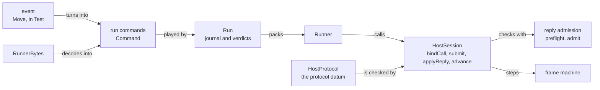
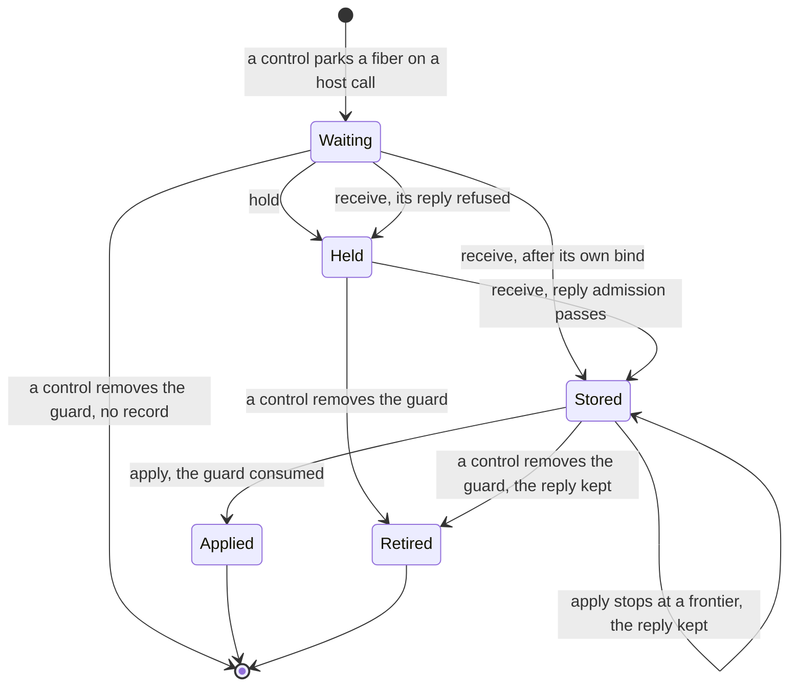
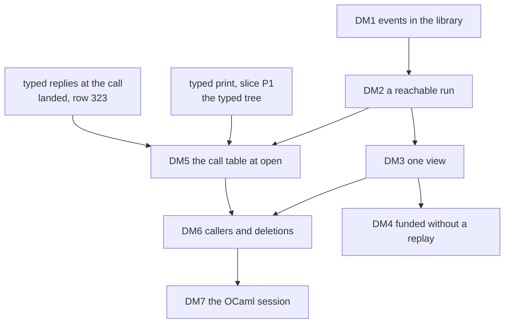

# 2026-10-07 the session API as a deep module: a design for review

Status: a research note (history, not authority). It rules nothing. Base: `4d4a67ce` on
`refactor/phase1-phase3`. The census of §2 read the build at 18:40, while three source files of
the checkout held the coordinator's work in progress. That work, the typed replies, landed as
`374a32f0` (decisions row 323) while this note was written, and `018101e1` followed it. The
session code of `374a32f0` is the code that §3.6 reads.

Words of this note. A deep module is an interface much smaller than the implementation it hides.
An event is one thing a caller hands a host session. The view is the session's first-order
reading. A verdict is the phase that one run command ends in. The claims of a call are the
fields that a bind restates: version, session, row table, call id, fiber, row and request. The
wire is what a host writes across a process boundary, in the protocol's record shapes. A holder
keeps a run on some host, as a value or as bytes. A driver is a loop that chooses events for a
host (`Run.driveFrom`).

## 1. The one thing to know first

**Most of the deep module exists already, split between `Run` and a test driver.** `Run`
(`src/Effect4/Run.lean`) opens a built program, plays run commands and reads a first-order
observation. The scenario driver's `Move` (`Test/Dogfood/Scenario.lean`) is the proposed event
alphabet: control, hold, receive and apply, with claims built from the machine. Nine scenario
modules and the keyed host lane use it, and two laws of it are proved (`replays`,
`receipt_inert`). So the work is a promotion and a merge, sized in hours (§5). Two corrections to
the proposal follow from the tree. First, one feed cannot hide reply application or a control:
the owner's rule keeps both as caller choices (`docs/core/api-surface.md` §1.1). Of the ordering
rules, only call correlation, reply admission, the protocol check and retirement go inside.
Second, `session_eq_ref` holds only for a `funded` run, and today only a replay of the whole
journal decides `funded`. The view must report it, or the contract rests on a premise that no
caller reads.

## 2. What exists

### 2.1 The layers

The diagram shows which module calls which on the session's path. It claims no law.



The session API is six modules: `src/Effect4/Api/HostSession.lean`,
`src/Effect4/Api/HostProtocol.lean`, `src/Effect4/Api/Runner.lean`,
`src/Effect4/Api/RunnerBytes.lean`, `src/Effect4/Run.lean` and `src/Effect4/Run/Tape.lean`. At the
base they hold 1146 lines, and their laws hold 2642 lines in eight law modules.

### 2.2 The entry points and their callers

The table lists the 122 written declarations of the six modules, grouped by module and verdict.
It omits `instanceAt`, which `374a32f0` adds after the base. Each entry carries four counts of
the modules, outside its own module, that use it. A use of a field or a constructor counts for
its type.

- `src` is `c+l`: core modules plus law modules. Every core caller is a module of the session
  API or the generated codec `src/Effect4/Api/RunnerDerived.lean`.
- `src`, `Test` and `tools` come from the build's `.ilean` files, checked against the base's
  text (§7). `tools` adds `tools/Effect4Gen/guards/runner.lean`, which has no `.ilean` file.
- `harness` counts `harness/truth/session/Keyed.lean`, `harness/truth/session/Session.lean` and
  `harness/truth/Truth.lean` at the base, by reading. Two of them have `.ilean` files, from
  2026-09-20, and the third has none.
- No file under `ocaml/` calls a session declaration, so the table has no `ocaml` count.

Prefixes: `HS.` is `Effect4.Api.HostSession.`, `HP.` is `Effect4.Api.HostProtocol.`, `Runner.`
is `Effect4.Api.Runner.` (both runner modules), and `Run.` and `Rows.` are under `Effect4`. The
parenthesis after an entry gives its fate, or its name in the deep module.

| Module | Verdict | Entry points, each with `src`/`Test`/`tools`/`harness` and its fate |
| --- | --- | --- |
| `HostSession.lean` | keep (8) | `HS.Answer` 1+3/6/0/2 (what `receive` carries); `HS.Call` 4+6/4/1/2 (the claims of a `wire` event); `HS.Header` 4+2/3/1/2 (the refusing `start` and the wire); `HS.Key` 4+6/7/0/1 (selects a call); `HS.Phase` 5+7/16/1/2 (the verdict); `HS.Refusal` 2+4/13/1/1 (the verdict's reason); `HS.Reply` 4+5/9/1/2 (the claims of a `wire` event); `HS.version` 1+1/6/0/2 (the wire) |
| `HostSession.lean` | hide (16) | `HS.BoundCall` 2+4/3/0/2; `HS.BoundCall.key` 1+4/2/0/2; `HS.BoundCall.record` 0+2/0/0/0; `HS.ReplySlot` 1+2/0/0/0; `HS.Result` 2+7/5/0/2; `HS.RetiredCall` 1+1/2/0/1 (the view lists retired keys); `HS.Session` 3+7/10/0/2 (behind `Live`); `HS.advance` 1+6/3/0/2 (`feed` of `control`); `HS.applyReply` 1+6/2/0/1 (`feed` of `apply`); `HS.bindCall` 1+4/3/0/2 (`feed` of `hold`); `HS.inspect` 2+3/2/0/2 (Lean tools read `Live.run`); `HS.preflight` 0+4/2/0/0 (reply admission inside `feed`); `HS.readReply` 1+4/1/0/1; `HS.retire` 0+2/0/0/0; `HS.storeReply` 0+2/0/0/0; `HS.submit` 1+5/4/0/2 (`feed` of `receive`) |
| `HostSession.lean` | replace (3) | `HS.outstanding` 2+0/2/0/2 (`View.awaiting`); `HS.pendingReplies` 1+0/1/0/2 (`View.pending`); `HS.start` 1+2/2/0/2 (`Live.start`) |
| `HostSession.lean` | delete (1) | `HS.applyPending` 0+2/2/0/1 (its five callers move to `apply`) |
| `HostProtocol.lean` | keep (7) | `HP.Edge` 0+0/0/1/0 (the protocol datum); `HP.FieldType` 0+0/0/1/1 (the protocol datum); `HP.Protocol` 1+1/0/1/1 (the protocol datum); `HP.RecordShape` 0+0/0/1/1 (the protocol datum); `HP.State` 4+3/4/1/1 (`View.state`); `HP.Tag` 0+1/0/1/0 (the protocol datum); `HP.hostProtocol` 1+1/0/1/1 (the protocol datum) |
| `HostProtocol.lean` | hide (6) | `HP.Label` 1+2/0/0/0; `HP.Label.tag` 0+0/0/0/0; `HP.allows` 1+2/0/0/0; `HP.controlLabel` 1+1/0/0/0; `HP.observe` 3+4/2/0/2 (the view computes it); `HP.states` 0+0/0/0/0 |
| `Runner.lean` | keep (1) | `Runner.Command` 4+7/12/1/1 (the journal and the `wire` event) |
| `Runner.lean` | hide (4) | `Runner.Runner` 2+4/3/0/0 (`Live` is what a holder keeps); `Runner.replay` 0+3/1/0/0 (the monoid action's laws); `Runner.result` 1+4/1/0/1; `Runner.step` 2+3/0/0/0 |
| `Runner.lean` | replace (3) | `Runner.load` 0+1/1/0/0 (`Live.start`); `Runner.observe` 1+0/1/0/0 (`View.state`); `Runner.outstanding` 1+0/1/0/0 (`View.awaiting`) |
| `Runner.lean` | delete (1) | `Runner.inspect` 0+0/1/0/0 |
| `RunnerBytes.lean` | keep (7) | `Runner.commandBytes` 0+1/2/0/0 (the codec of a `wire` event); `Runner.commandOf` 0+1/2/0/0 (the codec of a `wire` event); `Runner.schemaBytes` 0+0/1/0/0 (with `Event` and `View` added); `Runner.schemaOf` 0+0/1/0/0 (with `Event` and `View` added); `Runner.schemas` 0+0/1/0/0 (with `Event` and `View` added); `Runner.verdictBytes` 0+0/0/0/0 (the codec of a verdict); `Runner.verdictOf` 0+0/1/0/0 (the codec of a verdict) |
| `RunnerBytes.lean` | replace (6) | `Runner.observeBytes` 0+0/1/0/0 (`Live.viewBytes`); `Runner.outstandingBytes` 0+0/1/0/0 (`Live.viewBytes`); `Runner.replayBytes` 0+1/2/0/0 (`Live.feedBytes`, folded); `Runner.replayRows` 0+2/1/0/0 (`Live.feedBytes`, folded); `Runner.stepBytes` 0+1/0/0/0 (`Live.feedBytes`); `Runner.stepRow` 0+2/0/0/0 (`Live.feedBytes`) |
| `Run.lean` | keep (11) | `Run` 1+6/26/0/1 (`Live.run`, for Lean tools); `Run.Reactor` 0+2/4/0/0 (the driver, outside the interface); `Run.controlOnce` 0+1/1/0/0 (the opt-in planner); `Run.drive` 0+1/1/0/0 (the driver, outside the interface); `Run.id` 1+4/2/0/1 (`View` and the header); `Run.nextControl` 0+1/1/0/0 (the opt-in planner); `Run.open` 1+2/22/0/0 (`Live.open`); `Run.profile` 1+4/2/0/0 (renamed, question 5); `Run.runClock` 0+1/1/0/0 (events over `Live`); `Run.runPure` 0+1/3/0/0 (events over `Live`); `Run.runWith` 0+0/3/0/0 (the driver, outside the interface) |
| `Run.lean` | hide (12) | `HS.Call.at` 0+1/4/0/0 (claims built inside); `HS.Call.claim` 0+1/0/0/0 (claims built inside); `Rows.receive` 0+2/1/0/0 (inside `Event.commands`); `Rows.reply` 0+1/2/0/0 (inside `Event.commands`); `Run.driveFrom` 0+2/0/0/0 (the driver's loop); `Run.freshCall` 0+1/1/0/0 (the driver's choice); `Run.inspect` 0+2/5/0/0 (holds the machine); `Run.machine` 1+6/14/0/1 (Lean tools read `Live.run`); `Run.play` 0+5/13/0/1 (`feed` plays run commands); `Run.rowOf` 0+1/1/0/0; `Run.runner` 1+4/2/0/0; `Run.step` 1+5/0/0/1 |
| `Run.lean` | replace (14) | `Rows.answer` 0+1/1/0/0 (`receive`, then `apply`); `Rows.clock` 0+0/1/0/0 (`Event.tick`); `Rows.flush` 0+1/1/0/0 (`Event.flush`); `Rows.start` 0+0/6/0/0 (`Event.start`); `Rows.tape` 0+1/5/0/0 (`tape.map .control`); `Run.Observation` 1+1/1/0/0 (`View`); `Run.Work` 1+1/4/0/0 (`View`); `Run.answer` 0+1/2/0/0 (two events); `Run.control` 0+1/8/0/0 (`feed (.control d)`); `Run.exit` 0+1/19/0/0 (`View.exit`); `Run.observe` 0+1/1/0/0 (`view`); `Run.outstanding` 0+1/5/0/1 (`View.awaiting`); `Run.receive` 0+0/1/0/0 (`feed (.receive k a)`); `Run.work` 1+1/4/0/1 (`view`) |
| `Run.lean` | delete (6) | `Rows.answerAll` 0+0/0/0/0; `Rows.control` 0+0/0/0/0; `Run.Observation.daemons` 0+0/0/0/0; `Run.Observation.daemonsQuiet` 0+0/0/0/0; `Run.program` 0+0/0/0/0; `Run.table` 0+0/0/0/0 |
| `Run/Tape.lean` | keep (11) | `Run.MachineView` 0+0/3/0/0 (the engine lane's clause); `Run.Position` 0+2/2/0/0 (a reading of the contract); `Run.atRest` 0+1/3/0/0 (`View.atRest`); `Run.funded` 0+3/4/0/1 (`View.funded`); `Run.machineOf` 0+2/3/0/0 (a reading of the contract); `Run.machineView` 0+0/4/0/0 (the engine lane's clause); `Run.machineViewOf` 0+0/3/0/0 (the engine lane's clause); `Run.openedOf` 0+2/3/0/0 (a reading of the contract); `Run.replayFrom` 0+3/3/0/0 (a reading of the contract); `Run.tapeFrom` 0+2/3/0/0 (a reading of the contract); `Run.tapeOf` 0+3/3/0/0 (a reading of the contract) |
| `Run/Tape.lean` | hide (5) | `Run.decisionOf` 0+2/0/0/0; `Run.enoughFor` 0+3/0/0/0; `Run.readsOn` 0+2/0/0/0; `Run.receiptRow` 0+1/0/0/0; `Run.replyDecision` 0+1/0/0/0 |

The verdicts: 45 keep, 43 hide, 26 replace and 8 delete. Outside the API, the callers are 11
law modules, 35 `Test` modules, 2 `tools` files and 3 harness Lean files. No core module
outside the API calls it. Nine entry points have no caller outside their own module. Eighteen
have callers outside the API in law modules only.

### 2.3 What each form calls today, and what is proved about it

| Form | What it calls | The session's ledger | Evidence |
| --- | --- | --- | --- |
| Lean | `Run`, the scenario driver, and `HostSession` in the contract batteries | held, checked and recorded | proved: the laws of §4 |
| OCaml | the generated `Api.replay` (`ocaml/gen/api_gen.ml`, `ocaml/engine/api_engine.ml`) on Lean's machine tape; `ocaml/gen/roots.json` holds no session root | none: the engine holds no session | tested: the machine's view at each position (`ocaml/engine/test/scenarios/test_scenarios.ml`); no theorem relates the generated engine to the Lean machine (`docs/core/lcnf-route.md`) |
| TypeScript | rc.112 runs the printed module; a hand-written recorder (`harness/truth/session/keyed-recorder.ts`) writes records of the protocol's shapes; Lean replays them with `Run.play` (`Keyed.lean`) | Lean's replay; the recorder predicts two refusals | tested: one finite host run for each script that a host can perform |

The probe of 2026-10-03 (`docs/research/2026-10-03-session-from-lean.md`, untracked) lowered
`Runner`, `Run` and the byte encoders through LCNF to OCaml with four translator changes. Native
OCaml and js_of_ocaml under node gave Lean's journals byte for byte on two fixtures (tested).
None of it is landed.

### 2.4 Findings of the reading

1. **Four alphabets name one thing.** `Command` (four constructors) is the journal, and the
   protocol's `records` (ten shapes, `hostProtocol`) are the wire. `Move` (five constructors)
   writes scripts, and `performable` (`Keyed.lean`) names a host's seven acts. Each wire shape is
   one `Command` (`command`, `Keyed.lean`).
2. **Three readings overlap.** `Observation`, `Work` and `MachineView` all hold the awaited
   calls. `Work` and `MachineView` both hold the runnable fibers, the armed owners and the
   timers. Laws equate the copies (`work_waits`, `timerReasons_eq_work`,
   `src/Effect4/Laws/Run.lean`).
3. **A run is not reachable by construction.** `Session` and `Run` take any machine, and a
   battery builds a `Session` literal (`Test/Api/HostSessionContract.lean`). So each contract
   theorem takes `Run.Reached`, which lives in the law graph (`src/Effect4/Laws/Run.lean`).
4. **The certificate erases in LCNF.** `Run.open` cannot refuse because it takes a `Built`. An
   OCaml or JavaScript holder can forge one, so it needs the refusing `HostSession.start` (the
   probe's finding F2).
5. **One refusal is never produced.** No transition returns `Refusal.pendingControl`. Only the
   derived codec, one guard and the keyed tool name it.
6. **A harness tool reaches into the ledger.** `planRun` (`Keyed.lean`) reads `active` and
   `nextCall` and writes claims by hand. `receipt`, in the same file, reads `consumed` and
   `retired`.

## 3. The proposal

### 3.1 The interface

The sketch is unchecked: no line of it is compiled, and every name is a working name. `Session`
would match the dictionary's anchor of host session, at the cost of renaming
`HostSession.Session`.

```lean
-- UNCHECKED SKETCH, namespace Effect4.Run. The journal stays List Api.Runner.Command.
inductive Sel                                  -- how an event names a call
  | key (k : Api.HostSession.Key)              -- exact
  | fiber (id : FiberId)                       -- the one call this fiber is parked on
  | row (spelling : String)                    -- the one live call on this row

inductive Event                                -- one thing a caller hands a session
  | control (d : Api.Decision)                 -- start, flush, tick, cancel, any scheduling
  | hold (call : Sel)                          -- the host takes the call: a bind, claims built here
  | receive (call : Sel) (a : Api.HostSession.Answer)  -- reply receipt; binds first if not held
  | apply (call : Sel)                         -- reply application, when the caller chooses
  | wire (c : Api.Runner.Command)              -- a remote host's run command, with its claims

def Event.commands (s : Run) : Event → Except Sel (List Api.Runner.Command)  -- was Move.rows

structure Live where                           -- a run reached from an open by events
  run : Run
  reached : Reached run                        -- Run.Reached, moved into the core (DM2)
  calls : List (List Nat × CallInstance NativeOp)  -- the checked call table, at open (DM5)

def Live.open (b : Api.Built) (id : String) (budget : Api.Budget := {}) (binding := "") : Live
def Live.start (program : Api.Program) (table : RowTable) (binding : String)
    (header : Api.HostSession.Header) (budget : Api.Budget) :
    Except Api.HostSession.Refusal Live        -- reruns program admission

inductive Verdict
  | played (phases : List Api.HostSession.Phase)   -- one per run command played
  | unresolved (call : Sel)                         -- no call, or two: nothing played

def Live.feed (l : Live) (e : Event) : Live × Verdict
def Live.view (l : Live) : View
def Live.at (l : Live) (steps : Nat) : View   -- after the first `steps` run commands
def Live.feedBytes (l : Live) (event : Store.Bytes) : Live × Store.Bytes
def Live.viewBytes (l : Live) : Store.Bytes
```

`Live.nextControl`, `Live.controlOnce` and the driver (`Reactor`, `drive`) stay beside the
interface as opt-in policies. A driver cannot make the session take an unchecked reply: a
refused run command changes nothing (`step_refused`, proved; the probe, §5.2).

### 3.2 The events

| Event | Run commands it plays | Who chooses it | Today |
| --- | --- | --- | --- |
| `control d` | `[.control d]`; `start`, `flush`, `tick` and `cancel` name four | the caller, or the opt-in planner `nextControl` | `Move.control`, `Rows.*` |
| `hold c` | `[.bind claim token]`, the claim from `Call.at` | the host, when it takes the call | `Move.hold` |
| `receive c a` | `[.submit reply]`, or a bind first when the call is not held | the host gives the answer; the caller gives the time | `Move.receive`, `Rows.receive` |
| `apply c` | `[.apply key]` | the caller | `Move.apply` |
| `wire cmd` | `[cmd]`, its claims checked by call correlation | a remote host | `Move.row`, `command` (`Keyed.lean`) |

The four named controls, `hold`, `receive` and `apply` are the seven acts of `performable`.
`hold` stays an event of its own. A host records it before its work starts, so recovery never
repeats host work (`docs/core/host-boundary.md` §4.2; the probe's issue and settle, §5.1).

### 3.3 The view

The view is one first-order record with a generated codec and a schema (Decision 12). It
replaces `Observation` and `Work`, and `MachineView` becomes its projection for the engine lane.

| Field | Source today |
| --- | --- |
| `state`, `outcome`, `exit`, `reasons` | `HostProtocol.observe`, `HostSession.inspect` |
| `awaiting`, with each call's checked instance | `awaits`; the instance after DM5 |
| `held`, `pending`, `retired`, `applied` | the session's ledger |
| `runnable`, `queued`, `timers`, `cells`, `fibers` | `Run.work`, `machineViewOf`, `fiberStatuses` |
| `steps`, `funded`, `atRest` | the journal's length; `Run.funded`, `Run.atRest` |

The checked instance in `awaiting` tells a host the type that its reply must meet. A host
adapter then picks its decoder from it (§3.6, finding 5). `Live.at` and `nextControl` serve a
run that is stepped and drawn: the view after each run command, and one scheduler step at a
time. An agent's tools (`docs/core/api-surface.md` §2, D-F) can offer every event but `wire`,
whose claims an agent could forge.

### 3.4 The refusals

The verdict keeps `Phase` and `Refusal`. Claims built inside remove four refusals from local
events.

| Refusal | Local events | Only a `wire` event or `start` |
| --- | --- | --- |
| `noCall`, `pendingReply`, `envelope`, `duplicateCall`, `stuck`, `directAnswer`, `protocol` | can meet them | — |
| `version`, `session`, `table`, `callOrder` | cannot: the module writes the claims | can meet them |
| `staleCall` | not at `hold`: the claim is `Call.at`'s (`bindCall_at`) | can meet it |
| `profile`, `program` | — | `Live.start` |
| `selectionRequired` | produced by `applyPending` alone | deleted with it |
| `pendingControl` | produced by no transition | delete |

### 3.5 The lifecycle of one call

The state diagram follows one call through events. It claims no law beyond those of §4.



### 3.6 What goes inside, and the typed replies

Inside go the claims, the envelope, reply admission, `retire`, the protocol check, the ledger
and the call table. Lean gives these files no library-private visibility, since none of the six is
a `module` file. `src/Effect4/Run/Tape.lean` ties that to decisions row 202. So "hide" means:
not exported by the API's face, and named internal in its docstring.

The typed replies (row 323) keep a call's address in its registration. `preflight` then admits a
reply at the call's checked instance where the row's own columns refuse it. Six findings bear on
it. Row 323 lists findings 4 and 6 as open parts of R6, and `018101e1` narrows finding 6.

1. **Reply admission becomes a union.** `preflight` tries the row's columns, then the instance,
   and `preflight_success_prepared_fits` now ends in `PreparedSuccess ∨ InstanceSuccess`.
   `Val.hasTy` refuses every value at a type variable (`src/Effect4/Program/Typed.lean`), so the
   first check likely implies the second on data rows. No law states it, normal forms included.
2. **The checker runs inside `feed`.** Where the row's columns refuse a reply, `preflight` runs
   `callAt` on `program.expandRefs`, at receipt and again at application. A lowered session
   cannot yet translate the checker's algebras (the probe's finding F3). A table made once at
   open (DM5) keeps the checker out of `feed`.
3. **The change reached the generated OCaml.** `EffName_external` gained its field in
   `ocaml/gen/api_gen.ml` and `ocaml/engine/api_engine.ml`. Row 323 records `dune build`,
   `make check-compiler` and `make check-ocaml` for it.
4. **Two checked entries disagree.** `Api.replayChecked` admits at the row's columns (`admit`,
   `src/Effect4/Program/Admit.lean`). Row 323 names this open part `replay-at-call-instance`, with
   the OCaml engine beside it. The deep module should own the one reply admission.
5. **Route A now reads false at a template row.** `docs/core/host-boundary.md` §7 says that each
   reply the session accepts is a member at the row's answer type. `Test/Api/TypedReplies.lean`
   accepts `some 1` at a row whose answer column `Option<A>` refuses it. §7 also has the host
   adapter decode with the row's schema, which holds type parameters there.
6. **The origin's address is proved in the program as compiled, not in its expansion.**
   `Run.origin_addresses_call` (`src/Effect4/Laws/Api/SessionRef.lean`, `018101e1`) gives a call
   of its operation at a funded run's origin. The session reads `program.expandRefs`, and the
   open part `expansion-keeps-call` remains. A layer reference hops to its target's path
   (`resolveLayerWith`, `src/Effect4/Program/Compile.lean`), so the step looks short.

## 4. The contract

The interface is stated against these theorems. "Proved" means the kernel accepted the theorem
within the trust ceiling, and it rests on no planned goal.

| Theorem | Status | Fragment and premises | What it does not establish |
| --- | --- | --- | --- |
| `journal_replays` (`src/Effect4/Laws/Run.lean`) | proved | a run reached by an open and steps (`Run.Reached`) | another host's choice of commands; a lowered run |
| `replays`, `receipt_inert` (`Test/Dogfood/Scenario.lean`) | proved | the driver's scripts from an open | that two hosts choose the same commands |
| `step_refused`, `replay_skip_refused` (`src/Effect4/Laws/Api/Runner.lean`) | proved | any runner and run command | which commands are refused |
| `reply_commute` (`src/Effect4/Laws/Api/HostSession.lean`) | proved | two accepted receipts at distinct keys | that two applications commute |
| `applied_selects`, `control_retires` (`src/Effect4/Laws/Run/Rows.lean`) | proved | any session, key and budget; a control the session accepts | reply admission at application; which guards a decision removes |
| `answer_accepted`, `drive_envelope` (`src/Effect4/Laws/Run.lean`) | proved | a host inside the envelope (`Reactor.Envelops`) | host progress |
| `preflight_success_prepared_fits`, `preflight_failure_noShapeDefect` (`src/Effect4/Laws/Api/HostSession.lean`) | proved | a machine that is not stuck; a success at a shape-decided answer column (at `374a32f0`, or a member at the instance); a failure | the token's declaration; `AnswerOk`; a handle row |
| `open_total` (`src/Effect4/Laws/Run.lean`) | proved | a `Built` and a nonempty name | an open on a lowered holder |
| `tape_replays`, `funded_replays`, `tapeFrom_cut_replays`, `tapeFrom_position_replays` (`src/Effect4/Laws/Run/Tape.lean`); `play_controls_eq_replay` (`src/Effect4/Laws/Run.lean`) | proved | the machine alone; a tape that reads to its end, or its completed prefix | the ledger; the machine after a stopped row |
| `session_eq_ref` (`src/Effect4/Laws/Api/SessionRef.lean`) | proved | any built program and row table; a recorded, funded run; the outcome's class and `obs` | that a run is funded; the ledger; reply admission; a host's conformance |
| `denoteRows_eq_session` (`src/Effect4/Laws/Api/SessionMeaning.lean`) | planned goal | `StraightRows`, one fiber; funded, at rest, host driven | interruption, clock steps, delayed cell reads, handle rows; its raw form needs one more premise (`docs/research/2026-10-07-h8-map.md` §2.1) |
| `acceptAtInstance_sound`, `instance_prepared_success`, `instance_failure_reservedFree` (`src/Effect4/Laws/Program/Admit.lean`, at `374a32f0`) | landed after the base; row 323 records the build at the trust ceiling | a row whose answer column allocates nothing; a success with no handle; a failure | that the expansion keeps the call at its origin (`expansion-keeps-call`); the proof side, where `bitEntry` still reads the template |
| every run command and verdict (the 2026-10-04 plan's F7) | not stated | every reached session | — |
| typed session prefixes, `typed-replay-session` (F8) | not stated | an opened session at a nonempty row table | host progress; resources; a target's execution |
| the session against the reference with no budget premise (the host meaning packet, appendix L) | not stated; tested | every recorded run | — |
| host progress (`host-progress`) | assumed | — | — |

The module owes three proofs beyond connectors that hold by `rfl`. Each is placed here, and
none is worked yet.

| Obligation | Concept and property | Question and consumer | Reach | Does not establish | Unlocks |
| --- | --- | --- | --- | --- | --- |
| `view_funded` (DM4) | `translation-simulation`; the contract's premise is readable | proposed claim `view-funded`; consumer: `session_eq_ref` stated at `Live` | every `Live`; the view's flag against `Run.funded` | that a run is funded (`embedded-budget-sufficient`) | R6 |
| `calls_lookup` (DM5) | `initial-algebras-folds`; `call-instance-address` | a step of the claim `reply-at-call-instance` (row 323); consumer: `preflight` | every program and typing signature; the addresses of `Node.addresses` | that the expansion keeps the call at its origin | R6, R14 |
| `admitAnswer_instance` (§3.6, finding 1) | `host-session-protocol`; reply admission | a step of `reply-at-call-instance`; consumer: the contract's typed clause | rows whose answer column allocates nothing; success and failure | handle rows; delayed cell reads (row 100) | R6 |

With `Live`, the theorems above that take `Run.Reached` lose that premise. The 2026-10-04 plan asks for
that start: its P5 begins from an opened session (acceptance A22). Its P4 and P5 can state F7
and F8 over `feed`.

## 5. How it lands

The project's rule applies: build beside, slot in, then delete. The journal and the four checked
transitions stay, and each slice adds a module or moves declarations.



| Slice | What | Size | What makes it longer | Gates it reaches |
| --- | --- | --- | --- | --- |
| DM1 | `Sel`, `Event`, `Event.commands` and `feed` move from `Test/Dogfood/Scenario.lean` into `src/Effect4/Run/Event.lean`; `replays` and `receipt_inert` move into a law module with their placement; the scenario module exports `Move` as `Event` | 2–3 h | the moved laws' names in the registry and in the scenario records' clauses | a narrow `lake build` of the two new modules and the nine scenario modules |
| DM2 | `Run.Reached` moves into `src/Effect4/Run.lean`; `Live`, `Live.open`, `Live.start`; `session_eq_ref` and `journal_replays` restated at `Live` | 2–4 h | a law that names `Reached` by its module | a narrow build of `Effect4.Run`, `Effect4.Laws.Run` and `Effect4.Laws.Api.SessionRef` |
| DM3 | `View`, `view` and `at`; `funded` read by a replay at first; the derived codec and the schema list | 3–4 h | the derived codec moves ordinals | `python3 scripts/generate.py --only derived`; the guard `tools/Effect4Gen/guards/runner.lean`; a narrow build |
| DM4 | the session keeps whether an application's step had enough fuel; `view_funded` | 3–5 h | `applyReply`'s new body breaks the laws that unfold it, about seven | a narrow build of the session's law modules and `Test/Api/SessionMeaning.lean` |
| DM5 | the checked call table at open; `preflight` looks it up; `calls_lookup` | 2–3 h | `Node.addresses` must hold every call's address, a law owed | a narrow build of `HostSession` and its laws; `Test/Api/TypedReplies.lean` |
| DM6 | `planRun` and the replay of `Keyed.lean` move to `feed`; the eight deletions; `pendingControl` and `selectionRequired` go | 2–4 h | a scenario that relies on a row selector picking the first of two calls | `make check-host-protocol`; `python3 scripts/generate.py --only derived` |
| DM7 | the OCaml session: roots `Live.start`, `Live.feedBytes` and `Live.viewBytes`; the probe's translator rules F1, F3, F4, F5 and F6 | a day or more | a translator rule moves the bytes of every generated artifact | `make gen-lcnf`; `dune build` through `opam exec --switch=effect4`; `make check-compiler`; `make check-ocaml`; `make check-gen` |

DM1 to DM6 come to 14–23 hours. No slice reaches the TypeScript printer, so the truth lane and
`make check-target` run only if the harness's TypeScript changes. Row 323 records the owner's
order: the typed tree, this note, the typed replies, the typed print's P2, P3 and UNGUARD, then
H8. The DM slices fit after this note, beside the typed print.

## 6. Questions for the owner

1. **Representation: what does a run store?** Recommended: the journal stays `List Command`, and
   events only turn into run commands. The system map (§4) names `List Command` as the run's
   free object. An event's commands depend on the run's state, so stored events would be a
   second representation with no exact embedding.
2. **Representation: does DI-85's face change?** DI-85 names `Session.start`, `submit`, `advance`
   and `inspect` as the one host route. Recommended: amend it to `open`, `start`, `feed` and
   `view`. One route and the certificate-first open stay.
3. **Meaning: what does a row selector mean when two calls of the row are live?** Today the
   driver takes the first in the machine's order (`Sel.key`, `Test/Dogfood/Scenario.lean`).
   Recommended: the library reports it as unresolved. The owner's rule makes no order an
   implicit scheduler (`docs/core/api-surface.md` §1.1).
4. **Representation: does an application's verdict say that the budget cut its step?** Today
   `applied` follows from the guard alone (`Run.funded`'s docstring). The options are a new
   `Phase` constructor (a wire change), a bit that the view reads, or a replay for each view.
   Recommended: the bit (DM4), after the replay as a first cut (DM3).
5. **Meaning: what is the session's `profile`?** The header's `profile` string is matched by
   equality (`keyed-v3`, `serial-root-scalar-v1`): it names a host binding. The dictionary's
   profile is target data (`ProfileData`). Recommended: rename the field `binding`, a wire
   change. The Lean session runs the exact reference, and each lowered face refuses outside its
   profile (rows 321 and 322).
6. **Supported domain: which lowered session comes first?** Recommended: OCaml (DM7), entered by
   the refusing `start`. TypeScript keeps rc.112 with the recorder, since it asks whether Effect
   does what Lean says. A js_of_ocaml session answers another question (the probe, §4).
7. **Meaning: what is reply admission at a template row?** Recommended: membership at the call's
   checked instance alone, with the row's columns a fast path proved inside it
   (`admitAnswer_instance`). Handle rows and delayed cell reads stay at the row's columns until
   row 100. The dictionary's reply admission asks about one waiting continuation.

## What this does not establish

- No line of the sketch is compiled, and every name in it is a working name.
- The census reads one build's `.ilean` files. A caller added after that build is not counted,
  and a census is not a proof that a list is whole.
- The harness counts and one `tools` file are read by text, not by elaboration.
- The sizes are estimates, not measures.
- The reading of the typed replies is their diff before `374a32f0`, checked against that commit's
  session code and its row 323 only.
- No statement here is proved. The contract table collects the tree's statuses, and
  `generated/semantics.md` owns them.
- That local events never meet `protocol`, or `staleCall` after a bind, is not shown.
- The OCaml and TypeScript evidence stays finite.

## 7. Commands

Each count of this note comes from one of these commands, run on 2026-10-07.

1. `git status --short` at 18:40:43 gave three modified sources: `HostSession.lean`, `Admit.lean`
   and `Compile.lean`.
2. `find . -name '*.ilean' | cpio -pdm <scratch>/ilean` in `.lake/build/lib/lean` copied 1367
   files.
3. The census below gave 122 entry points, 401 files whose source is gone, and §2.2's counts.
4. A check against `git show 4d4a67ce:<file>` found each of the 703 counted pairs named in its
   caller's text.
5. `git grep -l -E 'HostSession|Api\.Runner|HostProtocol|Run\.open|Run\.play' 4d4a67ce` found 18
   files not counted: comments, imports, `HostProtocol.Key`, or files with no `.ilean`.
6. `git ls-files '*.lean'` against the snapshot found no `.ilean` for 10 `Test`, 25 `tools` and 6
   harness files.
7. `git show 4d4a67ce:harness/truth/session/Keyed.lean | grep -n -E '\b(start|bindCall|submit)\b'`,
   with more names and the two other harness files, gave the harness counts.
8. `git grep -l -E '\bMove\b|Scenario\.play' 4d4a67ce -- Test/Dogfood` found nine scenario modules.
9. `git grep -n pendingControl 4d4a67ce` found the declaration, the derived codec, one guard and
   the keyed tool.
10. `git show <rev>:ocaml/gen/api_gen.ml | grep -n 'EffName_external of'`, and the same for
    `ocaml/engine/api_engine.ml`: `native_op * val_` at `4d4a67ce`, `native_op * val_ * int list` at
    `374a32f0`.
11. `git show 4d4a67ce:<file> | wc -l` over the six modules and the eight law modules gave 1146
    and 2642.
12. `git diff`, then `git show 374a32f0` and `git show 018101e1`, showed the typed replies and
    the origin law, read and not built.
13. `python3 scripts/check-language.py --strict` on this note: see §8.

```python
# census.py <snapshot> <repo>: the modules outside each entry point's module that use it
import json, os, sys, collections
snap, repo = sys.argv[1], sys.argv[2]
API = ['Effect4.Api.HostSession', 'Effect4.Api.HostProtocol', 'Effect4.Api.Runner',
       'Effect4.Api.RunnerBytes', 'Effect4.Run', 'Effect4.Run.Tape']
il = {}
for d, _, fs in os.walk(snap):
    for f in (f for f in fs if f.endswith('.ilean')):
        j = json.load(open(os.path.join(d, f))); il[j['module']] = j
def has_source(m):
    r = m.replace('.', '/') + '.lean'
    return any(os.path.exists(os.path.join(repo, p, r)) for p in ('src', 'tools', '.'))
own = {n: m for m in API for n in il[m]['decls'] if not n.endswith('.instanceAt')}
written = {n for j in il.values() for n in j['decls']}
use = collections.defaultdict(set)
for m, j in il.items():
    if not has_source(m) or m.startswith('harness.'):
        continue                                    # a gone source, or a stale harness file
    for k, v in j['references'].items():
        n = json.loads(k).get('c', {}).get('n')
        if n in written and n not in own:
            continue                                # another written declaration
        while n and n not in own:
            n = n.rpartition('.')[0]                # a field or a constructor: its type
        if n and v['usages'] and own[n] != m:
            use[n].add(m)
```

## 8. The language check

`python3 scripts/check-language.py docs/research/2026-10-07-session-api-design.md` stops with a
usage error: the script takes a file only after `--strict`, `--show` or `--fix`. Its default
report skips this note, since it reads only tracked documents that are not history. The strict
mode reports no finding in this note:
`python3 scripts/check-language.py --strict docs/research/2026-10-07-session-api-design.md`.
