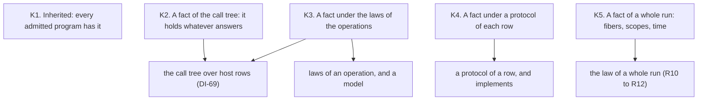

# 2026-10-07 the theorems of a program: what they are, and how a program carries them

Status: a research note (history, not authority). It rules nothing, and it adds no code. The
owner asked for it in session: a theoretical examination first, then suggestions for the APIs,
and a look at the authoring sugar. Every proposal below waits for the owner. Branch
`plan/open-parts`.

## 1. Question

The to-do application builds, runs and prints (`Test/Dogfood/Scenario/Todo.lean`). The owner
asked two things about it.

1. What are the theorems of the to-do application?
2. How does a program carry its theorems, as part of the data that a program is?

The owner's constraint: no API is improvised. The answer rests on the theory of algebraic
effects and handlers, and on the proof infrastructure that the tree has.

## 2. The words of this note

| Word | Meaning here | In the tree |
| --- | --- | --- |
| operation | one call that a program makes and something else answers | a row, `Row` (`src/Effect4/Program/Eff.lean`) |
| operation signature | the operations with the type of each request and answer | the store signature `StoreSig`; a row table |
| call tree | a program's meaning before anything answers its operations: a tree whose nodes are calls | `Effects.Program` (the pinned algebra package) |
| handler | one way to answer every operation of a signature | `storeHandler` (`src/Effect4/Laws/Program/Denote.lean`) |
| law of an operation | an equation between two call trees that every intended handler satisfies | none yet |
| protocol of a row | a condition on the request and a condition on the answer | none yet |
| claim | a statement with a role and a pointer to its evidence | `Claim` (`tools/Tools/SemanticsRegistry.lean`) |

A handler that satisfies every law of a set is a model of that set. The note says "model" in
that sense alone.

## 3. What was read

- **The meaning in the tree.** `denote` sends the straight-line fragment to a call tree over
  the store signature. `storeHandler` answers that signature in the stores.
  `run_eq_meaning` relates the machine to that meaning on the fragment
  (`src/Effect4/Laws/Program/Denote.lean`, `AGENTS.md`).
- **The two ruled statements of the host** (`docs/DESIGN-ISSUES.md`). DI-69 rules a call tree
  over the store signature and the row table together, with a tape as a partial handler. DI-57
  rules the statement that relates a session to a reference with the keyed reply path. The tree
  has neither definition.
- **The coordinator's review of four papers** of 2026-09-05
  (`docs/research/2026-09-05-effects-papers-review.md`), sections 1.3, G4, A2, A3 and A6. It
  reads de Vilhena's thesis on proofs of programs with effect handlers and Jacobs's draft on
  coalgebra against the tree.
- **The scenario form** (`Test/Dogfood/Scenario.lean`, `Test/Dogfood/Scenario/Routing.lean`,
  decisions row 254): a program, its scripts, one observation, a claim, controls and lowered
  runs.
- **The query function** (`tools/Tools/Query.lean`): an answer names a law only where the
  function decided the law's premises.

Not read today: the texts of the four papers, which stand under
`docs/research/2026-09-05-effects-papers/text`. This note reads the review of them. Three bodies
of work are named below and are not vendored. They are Plotkin and Power on operations and
equations, Plotkin and Pretnar on handlers, and interaction trees. The note gives no locator
for them.

## 4. The examination

### 4.1 The theory's objects, and where each stands in the tree

| The theory | In the tree | State |
| --- | --- | --- |
| an operation signature | `StoreSig`, and a row table | the row table has no signature in code (DI-69) |
| the call tree of a program | `denote`, on the straight-line fragment, over the stores alone | no call tree over host rows |
| a handler | `storeHandler`; a tape; a host | a tape is not a handler in code (DI-69) |
| "the machine does what the meaning says" | `run_eq_meaning`, `run_eq_ref` | at the empty row table alone (DI-57) |
| a law of an operation, a model | none | the stores are not shown to be a model of stated laws (the review's G4) |
| a protocol of a row, "implements" | none | the review's A2 proposes both; the tree has neither |

The theory separates two proofs. One proof is about the program, against what its operations
promise. The other is about a handler: it keeps those promises. de Vilhena's handler judgment
is that separation, as the review's G4 records it.

### 4.2 Five kinds of theorem

**K1. Inherited.** Every admitted program has these. Its exits fit its checked type. Its run
replays from its journal. Its printed form reads back. For the to-do application: `complete`
answers a to-do, or fails with `NotFound` or the repository's failure. The evidence is computed
at the build, and it travels with the built program today.

**K2. A fact of the call tree.** It holds whatever answers the operations. Two examples from
the to-do application:

- `add` with an empty title makes no call of the repository;
- a failure of the repository leaves `complete` unchanged.

The routing scenario states two facts of this kind as planned goals. Each quantifies over
every script, because the tree has no call tree over host rows to state it on. With DI-69's
definition such a fact is a statement about one tree.

**K3. A fact under the laws of the operations.** Two examples:

- after `add`, `list` holds the new to-do;
- `complete` twice leaves what `complete` once leaves.

Neither follows from the programs. Each needs laws of the repository: what `all` answers after
`insert`, and that `setDone` twice is `setDone` once. The fact then holds under every model of
those laws. This is the home of the owner's lowering: a verified store is a proved model.

**K4. A fact under a protocol.** A protocol puts a condition on a row's request and a condition
on its answer. A program is proved under the protocols of its rows, and a handler is proved to
implement them. The typing guarantee is the first instance: an exit fits its checked type. Its
protocol is "the request and the answer inhabit the row's types". The reply check of the session enforces that instance on
every reply (`preflight_success_prepared_fits`, `src/Effect4/Laws/Api/HostSession.lean`).

**K5. A fact of a whole run.** With fibers, scopes and time a fact is an invariant of the
machine along a run. It is the open theory of the composed modules, and this note leaves it.

### 4.3 Where the truth of a host's promise comes from

A fact of kind K3 or K4 rests on a promise of the handler. For the machine's own stores the
promise can be proved. For SQL it cannot be proved in Lean. The README says each host
connection is "held by a named grade of evidence". Four grades are in reach:

1. **Proved.** The handler is a Lean definition, and it is proved a model. The machine's
   stores can have this grade.
2. **Monitored.** The promise is a decidable condition, and the session checks it on every
   reply. A reply that breaks it is a located refusal. The fact then holds for every host.
   The reply check gives the typing of a host's answer this grade today.
3. **Validated for one run.** The journal of a run is replayed against the Lean model of the
   store, and the two observations are compared. It is a finite check of that run.
4. **Assumed.** The promise is named as assumed. The registry has that status today, at
   `host-progress`.

## 5. Suggestions for the APIs (proposals, not rulings)

1. **One carrier: an application.** An application holds several named programs over one row
   table, the protocols and laws of its rows, its claims, its controls and its runs. A module
   holds one program today (`Module`, `src/Effect4/Program/Authoring.lean`), so the to-do
   application is four modules. The scenario record is the nearest form, and the application
   generalises it.
2. **A claim is a record, with no second mechanism.** It holds a statement by its Lean name, a
   kind (K1 to K5), its premises, a status and its evidence. The premises say which protocol,
   which laws and which fragment it assumes. The status is derived as the plan derives it:
   proved, proved modulo goals, a planned goal, a finite check or assumed.
3. **The query function answers the claims of a program**, and the claims at an address. It
   keeps its rule: it names a claim with the premises that it decided and the ones it assumes.
4. **Compute the facts of kind K2.** A small set of analyses over `Eff`, each a fold with one
   law against the call tree. Examples: the calls of a row on a path, and the failures that
   escape. The two planned goals of the routing scenario become instances.
5. **Protocols as data on a row**, decidable, with "implements" for a handler. The session
   checks a row's protocol where it checks its types today. The typing guarantee is the
   first instance and no special case.
6. **Laws as data**, with "is a model". The to-do repository is the first set of laws. A
   Lean store in the machine is its first proved model. SQL is a model at grade 2 or 3.
7. **A claim has a slice**: the part of the program that it reads. An edit outside the slice
   keeps the claim. The instrument exists for types (`SliceView.lattice_minimal`). An agent
   that edits a program needs this more than any other part.

**Order.** DI-69's call tree comes first: it is ruled, and suggestions 3 to 6 point at it.
Then suggestions 1 and 2, designed with the owner. Then 5 and 6.

## 6. The authoring sugar: what the to-do application shows

| Construct | Today | Observation |
| --- | --- | --- |
| a sequence | `eff do` with `let x ← e` (`Authoring/Sugar.lean`) | present; the slice did not use it yet |
| a conditional | `ifElse test a b` | the `if` of an `eff` block is the builder's `if`, not the program's |
| a pure function | `app "eq" [a, b]`, by the atom's name as text | no named function for an atom; a wrong name is refused late |
| a record | `record fields [("id", id), …]` | the field list is passed at each construction; no projection by name |
| a tagged failure | a literal, a pair or a record, by its fields | three spellings (decisions row 120); `fail (str "x")` has the type `string` |
| an option | `selectOption "todo" value none some`, then `var "todo"` | the binder is a text; `selectOptionWith` takes a function |
| a host row | `Row.host name request answer error cite` | the rows are listed again in each module |
| a module | one `main` | an API of four programs is four modules |

The generator already writes named functions for the native rows (`Authoring/Rows.lean`) and
for the forms (`Authoring/Lifts.lean`). The same instrument can write them for the atoms, for a
declared record and for a declared failure. One declaration then gives the type, the
constructor, the projections and the handler's test.

## 7. Questions for the owner

1. Is the application the carrier: several named programs, their rows, their claims?
2. Is "monitored at the session" a grade of evidence that a claim may rest on, beside
   "proved"?
3. After the call tree over host rows: the computed facts of kind K2 first, or the laws of a
   store first?

## What this does not establish

- No theorem and no definition. Each kind is a reading of the theory against the tree.
- That every fact of kind K2 can be computed. A fold decides a class of them, and each class
  owes its law.
- Anything about a whole run with fibers. Kind K5 is named and left.
- That the four papers say more or less than the review of 2026-09-05 records. The note reads
  the review.
