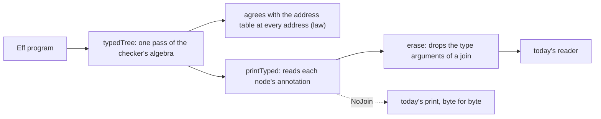

# 2026-10-07 the design note of the typed print (the plan's slice PRINT, steps 2 to 5)

Status: a research note (history, not authority). It rules nothing. It is the coordinator's
design note that the plan asks for before PRINT's steps 2 to 5
(`docs/research/2026-10-06-next-slices-plan.md`, section 5.4). It puts two choices to the owner,
each with a recommendation; every other point follows from the tree and the probe.

## 1. The one thing to know first

**The printer needs the checker's answer at each node it prints with a type argument, and the
tree already has that answer as a specification.** The address table
(`src/Effect4/Program/Typing/Table.lean`, decisions row 302) gives the checker's answer at every
address, and its own note says that a pass that checks each node once is the slice that must
answer it. So the typed print is two pieces: a typed tree made in one pass, proved equal to the
table at every address, and a printer that reads it.

## 2. Why the print needs types

Two interim guards stand in the checker today. Each refuses a program where tsgo would infer a
type argument the checker did not choose.

- **At a binder term** (`Bounds.termGuard`, `Bounds.matchTerm`; decisions row 299, point 10).
- **At a row's request** (`checkRow`; decisions rows 312 and 315).

tsgo forms no join of two inference candidates (`docs/research/2026-10-06-print-probe.md`).
Where the checker answers a join, the printed call must carry the join as its type arguments.
The plan's step UNGUARD removes both guards once the printer writes them: `matchTerm` then says
`matchB` at both sites.

The probe of step 1 measured every printed form. 38 of 44 forms take type arguments at a join,
and tsgo accepts each and refuses the red control with one member too few. Six forms have no
place for a type argument, and tsgo needs none at any of them (the Boolean test of `select`, a
native field read, a native record update, a native tuple index, `length` and `isSome`).

## 3. What each site prints

| Site | The type arguments | Where the checker has them |
| --- | --- | --- |
| a row with a binder term (`Ref.modify` and the seven others) | the match's bindings after the term binds (`bindTerm`) | `checkRow`'s bindings at the call |
| a host row with a template | the request's bindings | `checkRow`'s bindings at the call |
| an eliminator (`optionCase`, `caseTag`, `caseTagR`, the fiber and scope rules) | the lifted rule's least arguments (`Eliminator.adjoint`, `src/Effect4/Laws/Program/UnionRule.lean`) | the rule's answer at the node |
| a template atom (`get`, `take`, `cons`, …) | none: the prelude's declaration takes the argument's whole type and computes the join | — |

**A finding for the call instance.** The call instance of slice H9 (`CallInstance`,
`src/Effect4/Program/Typing/Call.lean`) keeps the operation, the request type and the two
instantiated columns. It does not keep the bindings, and the printer needs them. The typed tree
of section 4 keeps them, and `CallInstance` becomes a projection of it.

## 4. The design

1. **The typed tree.** A fold of the checker's algebra paired with the syntax: the generated
   product of two algebras (`EffAlgebra`, `cataFam`). Each node keeps its `EffTy`, and each call
   keeps its instance with its bindings. One pass, so the cost is the checker's.
2. **Its law.** At every address its annotation is the address table's entry
   (`typedTree_at_eq_table`). The proof is an agreement of folds (`hom_eq_cata_eff`), not a
   pairwise induction.
3. **The printer.** `printTyped` is today's template printer over the typed tree: a template
   row gains type-argument holes, filled from the node's annotation where the annotation is a
   join, and left out elsewhere.
4. **The connector.** Under `NoJoin` (no site of section 3 answers a join) the typed print is
   today's print, byte for byte. While the guards stand, every admitted program has `NoJoin`
   (`check_noJoin`). So the truth lane's 73 modules and the corpus are unchanged until UNGUARD.
5. **The reader.** A named map erases a join's type arguments from printed syntax; the reader is
   today's reader after it. One law carries every read law over: the erased typed print is
   today's print.

## 5. The two choices for the owner

1. **Type arguments only at a join, or at every site that has a place.** Recommended: only at a
   join. Every printed module of today stays byte for byte, and a printed call carries a type
   argument exactly where tsgo cannot infer it. The alternative prints more and moves every
   golden file.
2. **A typed tree, or a second printer that re-checks each child.** Recommended: the typed tree.
   The plan's step 2 drafted a second printer that asks `termTy` at each argument. It costs a
   check per node, and it has no law beside the table. The typed tree costs one check, its law
   is the table's, and it is the program as data with its types: the call instances, the
   refusals and the printer read one object.

## 6. The slices

| Slice | What | Size | Gates by reach |
| --- | --- | --- | --- |
| P1 | the typed tree and its law against the address table | M: a product fold and one agreement of folds | build of its modules; `Test` |
| P2 | `printTyped` with type-argument holes, and the connector under `NoJoin` | M: the template table's rows gain holes | the truth lane, the target lane, the corpus (byte for byte) |
| P3 | the erasure map and the read law | S | the reader's batteries; the truth lane |
| UNGUARD | `matchTerm` says `matchB` at both sites; the joins print | S in the tree, with the owner's hearing of each widening (the plan, section 5.4) | every TypeScript lane |

## What this does not establish

- That a typed tree in one pass fits the checker's algebra without a change to it. No part of
  it is compiled.
- That the 38 forms take their type arguments from the annotation with no second spelling. The
  probe wrote them by hand.
- Anything about the six forms with no place: they need none, by the probe.
