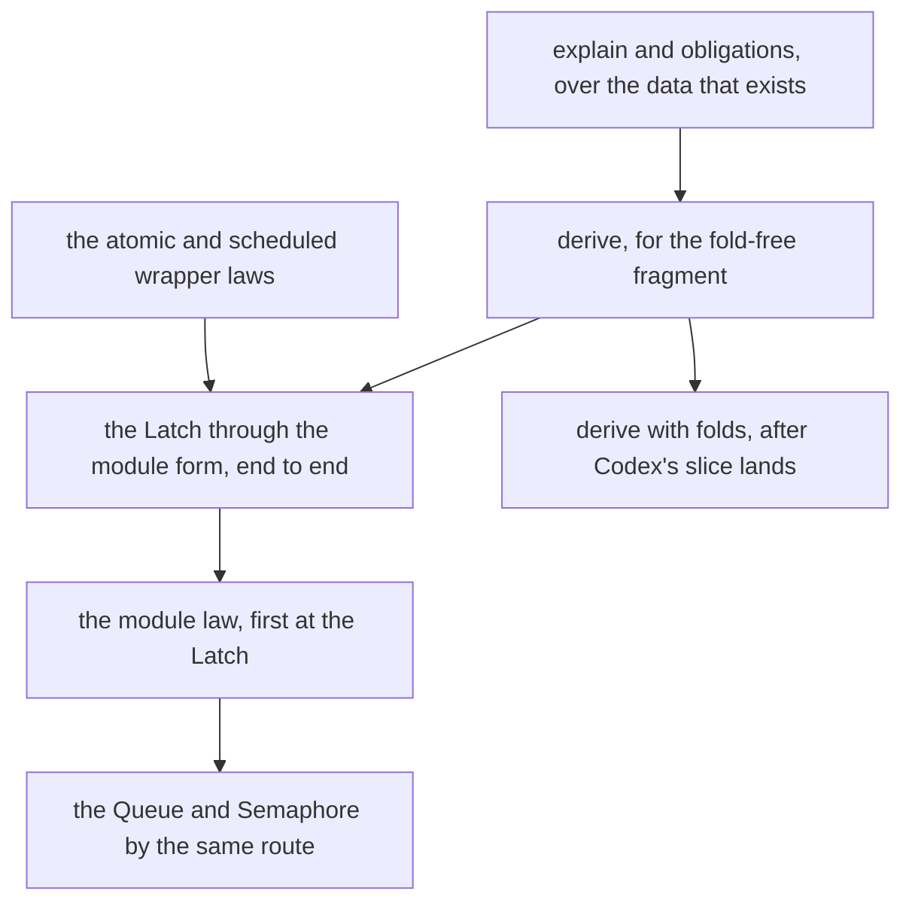

# Where ergonomics comes from: the agent's authoring language

Status: research note (history, not authority). Base: `1e4145bc` (`refactor/phase1-phase3`).

On 2026-10-08 the owner asked three questions about the module toolkit:

- which tools would an agent want, building a verified module for a person, with a semantics the
  person can read;
- what that implies for the APIs and for the proof obligations beneath them;
- where ergonomics comes from, how it connects to each level of abstraction, and how to make that
  understandable.

## 1. The one thing to know first

Ergonomics comes from the algebra, by three mechanisms:

- **Every level is a free object with folds.** So every question about a value has the same answer
  at every level: a fold, built from its children's answers.
- **Laws are proved once, at the algebra.** So an author proves only what the algebra leaves
  open: the meaning they want, and the choice of wrapper.
- **The author's form and the stored data are an exact embedding.** So an author writes in the
  form they think in, and the stored data is derived from it.

One rule finds the next improvement: **work that an author repeats is a law at the wrong level.**
Each piece of boilerplate in slices L1 to L3, and in Codex's fold slice, has a level where it
becomes a consequence (§4).

## 2. The ladder

Each level has the same five entries. Learning one row teaches the shape of all of them.

| Level | Stored data (free object) | The author writes | Meaning (a fold) | Laws proved once | The author still owes |
| --- | --- | --- | --- | --- | --- |
| type | `Ty`, `Store.Val` | a Lean structure, `deriving Modeled` | the carrier fold | `member`, `codec_roundtrip` | nothing |
| step | `Step Γ t` | a Lean function of the model's state | `Step.eval` | `Step.sound`, `Step.typed`, `Step.frame` | nothing, when the step is derived (§5) |
| operation | a step and a wrapper | the wrapper's name | the wrapper's law | one law per wrapper | the choice of wrapper |
| module | the module form (row 331) | `module Queue mirrors "Queue.ts"` | the module's model | the module law (§6) | the model and its source anchors |
| program | `Eff` | operations, by their invocations | `meaning`, the run | `run_eq_meaning` and its siblings | the program |

The rightmost column is the whole cost of authoring. Today its entries are larger than this
table says. Section 4 lists the difference, and section 6 lists the proofs that close it.

Two facts make the ladder understandable:

- **The author's text is the meaning.** At the module level the author writes the model. It is
  plain Lean over a derived state type, citing each operation's rc.112 or latest (Effect 4.0.1)
  lines. That text is what a person reads, and the implementation is derived from it.
- **Each level answers the same questions.** What is written, what is stored, what it means, what
  is guaranteed, and what is still owed. An agent asks them at any level, of any part.

## 3. The tools I would want, as the agent

The loop for one request from a person: understand, state the meaning, derive the
implementation, prove, compare with Effect, and explain. Each tool rests on one row of the
ladder.

| Tool | I give | I get back | It rests on |
| --- | --- | --- | --- |
| `find` | a name, a type or a phrase | modules, operations, steps and claims, each with its status | the implementation map (row 331) and the semantics registry |
| `explain` | any part, by name and path, at any level | what is written, its type, its meaning, its checks, its footprint, its obligations with status, its children, its source lines | each answer is a fold; each status comes from the proof graph |
| `run model` | a model, a start state, a list of operations | each state and reply, decoded to Lean values | the model is ordinary Lean, so it evaluates |
| `explore` | a model, a bound, an invariant | every sequence of operations up to the bound; the first counterexample | decidable models; the result is a finite evaluation, labelled so |
| `derive` | an operation of the model | its step, with a kernel-checked value equation; or a refusal at a path with a hint | the derivation's lemma bank (§5) |
| `module` | the module form | the authoring record, the wrappers, the obligations as placed goals, the map row | the wrapper laws and the module law (§6) |
| `obligations` | any part | each owed statement: proved, modulo goals, or open; and its placement | `proof_goal`, `#plan_status`, the registry |
| `prove` | an owed statement | a proof by the generated tactics, or the residual goals in readable form | the aesop banks and the generated certificates |
| `compare` | a module and named clients | the native runs against latest, graded by row 330, point 4 | the native runner, the live codec (L4) and the Conform driver (L5) |
| `impact` | an edit of a model, a field or a step | the steps, statements and claims whose answers change | the footprint folds and the reading footprint (§6) |
| `report` | a module | the model's text, each guarantee with its theorem and premises, each limit, each signed difference | the claims' titles and the controlled English of `docs/core/controlled-english.md` |

Every tool answers data, never text that must be parsed. So an MCP tool is a thin wrapper over
the same Lean function, with its contract written later.

## 4. Where the burden is today: boilerplate as a law at the wrong level

| Repeated work | Where it showed | The level that absorbs it |
| --- | --- | --- |
| a per-step value equation, proved by cases | each `*_eval` theorem of slice L3 | the step level: derive the step from the model, with its certificate (§5) |
| an encoding connector for each module (`cellVal_image`) | Semaphore, Pool, the Queue | the type level: `deriving Modeled` on the model's state, with L6's identity context |
| carrier types in statements (`CarrierAt L .nat` against `Nat`) | slice L2's binder errors; probe REIFY-1's first run | the type level: statements in Lean types, with the carrier only behind `Modeled.toC` |
| inputs and binders by position | overwatch finding CW-01 | the step level: named inputs and binders, which Lean elaboration turns into positions |
| removal, `any` and map folds written per module | overwatch finding CW-03: five removals in four modules | a library of derived steps, each with its value lemma |
| the wrapper reading replies by position | `tupleAt reply 0`, `1`, `2` in the Queue's operations | the operation level: reply records and one law per wrapper |
| agreement and typing statements written per operation | slice L3's ten theorems | the module level: the module form generates them |
| semantics registry entries, placements, roots and the generated report | each slice's receipt | the module level: the form places its own obligations |
| knowing what is proved and what is open | reading the registry and the receipts | `explain` and `obligations`, measured |

## 5. Deriving a step from the model

The step level can owe nothing. An author writes the operation as an ordinary Lean function of
the model's state. A derivation walks the function's elaborated term and writes the step. It
writes the value equation's proof too, from one lemma for each construct of the fragment:

| Lean construct | Step | Lemma, proved once |
| --- | --- | --- |
| `if p then a else b` | `ite` | the value of `ite` at a decided condition |
| `a ≤ b`, `a < b`, `a = b`, `&&`, `!` | `lt`, `eq`, `and`, `not` | each condition's value is `decide` of the proposition |
| `s.f` | `get` with `field_ref%` | the projection of the carrier is the field |
| `{ s with f := v }` | `set` | the overwrite of the carrier is the update |
| `(a, b)` | `pair` | the carrier of a pair |
| `xs.length`, `xs ++ ys`, `xs.take n`, `xs.drop n`, `xs.head?` | the list words | each word's value is the list function |
| `xs.foldl f init` | `fold` (Codex's slice) | the fold's value is `List.foldl` |
| `xs.filter p`, `xs.any p`, `xs.map f` | the derived-step library | each derived step's value lemma |

A construct outside the table refuses at its path, with the nearest construct inside it.

**Evidence: probe REIFY-1** (`docs/research/2026-10-08-agent-authoring/ReifyProbe.lean`). A Lean
model of `takeIfAvailable` over a derived structure, and the step written by hand as a derivation
would write it. The value equation against the Lean function closes in one fixed shape:

1. split on the condition;
2. rewrite the condition's value;
3. simplify the model;
4. close by `rfl`.

The probe's first run also met the carrier problem of §4. A carrier-typed tuple is not a Lean
tuple at the implicit transparency, so `rw` failed. The probe is a finite check of one function,
and it proves nothing about other functions.

**What this changes.** The model is then the source of the step, not a second text beside it. The
trust rests on two things: the model agrees with Effect, which `compare` grades; and each
derivation's certificate, which the kernel checks. The independent-model rule of the gaps plan
keeps its purpose: the model is still written against rc.112 or latest, and never against the
step.

## 6. The proof obligations beneath the tools

Ranked by what they unlock. Each serves the requirement in its row.

| Obligation | Requirement | State | It makes this tool honest |
| --- | --- | --- | --- |
| the module law: steps that agree, under wrappers that keep their laws, give a module whose expansion agrees with its model at the checked clients | R10 (DI-89; rows 79, 230, 329, 330) | open; `queue-expansion-agrees`, `semaphore-expansion-agrees` and `pool-expansion-agrees` are proposed | `module`, `report` |
| one law for each wrapper: atomic, waitRetry, waitAnswer, scheduled, transact, pullLoop | R10, R12 (rows 221, 222, 240) | open; the wrappers have scope and typing laws only | `module`, `obligations` |
| a sufficient embedded budget for an owned operation | R12 (row 226) | open; no theorem states a bound | the wrapper laws' run statements |
| the derivation's lemma bank, and a certificate for each derived step | R10, helpers of `step-language-sound` | new; probe REIFY-1 shows the shape | `derive` |
| the identity context backed by a table, with injectivity | R10 (slice L6) | open | models with abstract identities |
| the reading footprint: equal inputs on the read set give equal values | R12, `step-read-footprint` (row 331's design) | new | `impact`; the transaction's wake |
| the transaction attempt as one machine step | R4, R10 (`atomic-attempt-isolation`, row 331) | new | transactional modules |
| simulation across schedules | R10 (row 329) | open | the module law's statement |

Three things need no new proof:

- `explore` and `run model` answer finite evaluations, and the report labels them so;
- `find`, `explain` and `obligations` read the proof graph and the registry, which measure;
- a generated statement is an ordinary theorem, so the kernel checks it, and meta code adds no
  trust.

## 7. What I would build first

- `explain` and `obligations` first: they need no new proof, and they make every later step
  visible.
- The Latch next: it is the smallest module, its steps are already native, and two of its wrappers
  (atomic and scheduled) are the simplest.
- The first module law at the Latch shows the whole ladder working once, end to end.

## What this does not establish

This note is a design and one finite probe. It states no theorem of the tree, and the probe proves
nothing beyond its one function. The tools of §3 do not exist yet. Their names are proposals.
