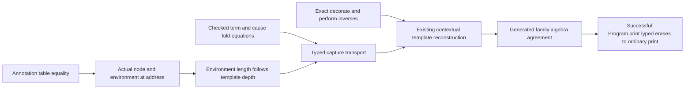

# P2b erasure connection

Merge note: add the exact nested `runIn` inverse after the P3 commit.
The remaining context steps introduce no new print refusal.

Evidence status: the term and cause equations are checked.
The program connection, depth helpers, and nested inverse remain candidates.

## Placement

These helpers serve `exact-codecs`, R8, the typed-print erasure claim.
Their consumer is the successful `Program.printTyped` erasure equation.
The equation uses the current P3 spelling and readable premises unchanged.
It is not the annotation-absence equation.
It states no target execution or compiler inference result.

## Checked leaves

`EraseTermTypes.eraseTerm_printTerm` in the checked typed law patch states:

```lean
PrintEliminators.term sig env const t = .ok x →
  EraseTermTypes.eraseTerm env.length x = printTerm env.length t
```

`EraseTermTypes.eraseCause_typedCause` states the analogous cause equation.
Both use the generated algebra agreement laws.
Neither needs a typing premise beyond successful typed printing.
The old stored-fold projection fallback retains its original printed syntax.

## Small local relation

For a node layer, retain its exact source node and its printing depth.
The local relation is:

```lean
def ContextMatches (ctx : PrintEliminators.Context Op) (node : Node Op) (n : Nat) : Prop :=
  ctx.node = node ∧ ctx.env.length = n
```

The source node is essential because `withHeadTypes` does not test its spelling argument.
A caller must connect `decorate` to the template for that exact node.
The local erased equation needs no equality between table child answers and recomputed answers.
Those answers choose inserted types; the inverse removes their exact approved positions.
The checked-program receipt still derives their provenance from the annotation table.

The length clause is sufficient for the local node equation.
It is required for row requests and operation bodies.
It also connects template lambda names to option, tag, and release inverses.
It need not become a premise on every term leaf.
Successful `PrintEliminators.printArg` already checks its slot environment length against template depth.
The cause branch makes the same check.

## Actual context lookup candidate

For successful lookup, prove this statement before the family lift:

```lean
theorem contextAtTable_annotate_facts
    {s : Signature Op} {env0 : TyEnv} {p : Eff Op} {path : List Nat}
    {ctx : PrintEliminators.Context Op}
    (found : PrintEliminators.contextAtTable (annotate s env0 p) p path = some ctx) :
    (Node.eff p).at_ path = some ctx.node ∧
    ∃ rho : NodeEnv,
      (Node.eff p).envAt s (.env env0) path = some rho ∧
      ctx.env = rho.tyEnv ∧ ctx.path = path ∧
      ctx.entries = some (annotate s env0 p)
```

Proof route: unfold `contextAtTable`; split its three successful Option binds.
Use `annotate_eq_table` at the successful `find?` lookup.
`List.mem_of_find?_eq_some` gives the table entry membership.
`List.find?_some` gives its path equality.
Unfold `table` and `List.mem_map` to recover the exact `Node.envAt` answer.
Every selected entry at that path has the same computed environment.
No address uniqueness premise is necessary.

Existing declarations consumed:

| Declaration | Path | Role |
| --- | --- | --- |
| `annotate_eq_table` | `src/Effect4/Laws/Program/Typing/Annotate.lean` | Annotation/table equality, unchanged |
| `table_eq_tableAt` | same | Root table as subtree table |
| `tableAt_eq_cons` | same | Root and child table decomposition |
| `childAddresses_map_tableEntryAt` | same | Child entries use one `childEnv` step |
| `mem_addresses_iff` | `src/Effect4/Laws/Program/Typing/Table.lean` | Address membership identifies a source node |
| `focusAt_eq_some` | `src/Effect4/Laws/Program/Typing/Focus.lean` | Exact environment and type, for effect focuses only |
| `hasTy_extSlotEnv` | `src/Effect4/Laws/Program/Typing/Table.lean` | Extended slot typing, not a length theorem |
| `NodeHasTy.child_step` | `src/Effect4/Laws/Program/Typing/Replace.lean` | Typed child environment, conditional on its stated reach premise |

## Depth transport candidate

No existing law equates successful `childEnv` lengths with template depths.
Prove this step for actual constructor arguments and the selected template.
The argument index and the child index differ.
Let `j` count child arguments before argument `i`, as `Templates.atAddress` does.
For actual source argument `i = .child fam child`, prove:

```lean
node.childEnv s parentEnv j = some childEnv →
  parentEnv.tyEnv.length = n →
  childEnv.tyEnv.length =
    Templates.argDepth nodeFamily (.child fam) n (row.out.levelAt i)
```

The statement also retains the exact source view, selected row, and argument lookup premises.
For template families, prove constructor fields through the generated source algebra.
Use `Node.childEnv` and `Templates.argDepth` for each field.
Use existing `Decision.arms_length` and `Decision.binds` at select.
A layer or layer child resets to zero on both sides.
The statement spine has no selected template row.
Prove its cons step separately: bindYield extends by one; other statements extend by zero.
The existing printed declaration count supplies the same extension.

Operation body length has a smaller independent candidate:

```lean
(Node.eff (.perform op request)).extSlotEnv s env .opTerm = some bodyEnv →
  bodyEnv.length = env.length + 1
```

Its proof follows the exact `.opTerm` definition and `List.length_append`.
No typing premise is necessary once the environment lookup answers.
The request uses `ctx.env.length = n`; the body uses this extension law.

## Counterexample to arbitrary context length

Take `env = [.list (.union .nat .string)]` and printing depth zero.
Print the term `fold none (var 0) (lit (nat 0)) (var 1)` through that environment.
The typed term uses callback names `a1` and `a2` with checked types.
The inverse at depth zero accepts canonical names `a0` and `a1`.
It therefore retains that annotation; the ordinary print uses different callback names.
This is a raw-context counterexample, not a `Program.printTyped` counterexample.
The actual program starts with `env.length` and transports that length along its source address.
No new guard or refusal repairs this mismatch; actual context agreement supplies the premise.

## Full route



Use the P3 family proof and its capture lookup and reconstruction lemmas.
Replace raw term identity at typed leaf captures with the checked success equations.
Keep the statement declaration count and layer reset unchanged.
Normalize decorated node syntax before the template match.
For rowCall, erase requests and binder bodies before the complete row inverse.
Keep proper operation-owned generics at their program occurrence.
The source-component certificate algebra retains the node at each address.
The final equation follows from generated family agreement, including joined output.

The annotation-absence fast path remains a separate equation without typing premises.
Cache sharing does not change `annotate_eq_table` or claim one-pass term inference.
