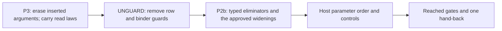

# UNGUARD and P2b: implementation plan

Status: implementation in progress. This note records scope and proof placement before proof work.

The owner approves P2b in the UNGUARD landing on 2026-10-08.
The ruling includes options, lists and folds, fibers, exits, and all four cause-inspection operations.
Existing successful raw answers remain unchanged. Every retained union member must support its operation.

## Base and ownership

Base: `c51f9e6b7c456d952d0fe408a274432f4c9aebd5`.
Branch: `codex/unguard`.
The coordinator owns decisions, the semantics registry, its generated report, the Lake configuration, and `docs/STATE.md`.
This slice proposes their updates in its receipt.

## Order

## Obligations, placed before work

| Obligation | Concept and property | Claim and consumer | Reach and hypotheses | Exclusions | Requirement |
| --- | --- | --- | --- | --- | --- |
| Erasure of inserted call arguments | `exact-codecs`: reconstruction modulo a named normalizer | Proposed typed-print erasure claim; existing `read_print` and `read_exact` consumers | Successful typed printing; preserve operation-carried and row-declared type arguments; preserve method syntax | No target typing or execution theorem; unsupported type spellings still refuse | R8 |
| Typed-print connector | `exact-codecs`: agreement of the two prints | Existing `typed-print-connector`; consumers of `printTyped_eq_print` | `NoJoin` at every site the typed printer changes | Does not promise unchanged bytes at a join | R8 |
| Row checking through bounds | `subtyping-algebra`: bounds matching and instantiated row columns | `template-match-complete`; row typing, call instances, and the slot table | Existing formation, environment, operation, and binder-term hypotheses; `matchB` replaces `matchTerm` | No host agreement or general checker monotonicity follows | R4 |
| Converted union rules | `subtyping-algebra`: upper and least answers | `union-rule-extend`; option selection, fold, fiber actions, scope close, and cause queries | Every retained normalized member supports the member rule; retain existing successful raw answers | No new target support for currently refused fiber actions; no liveness claim | R14; closed-input consumers also serve R4 |
| Address-table agreement | `initial-algebras-folds`: annotation agreement | Existing `annotate-table` | Keep `annotate_eq_table` unchanged | No new cost or runtime-address claim | R14 |
| Printed generic order | `exact-codecs`: stated host boundary | Host declarations and the actual printed calls | Template variable order, `.var 0` first; inspect the selected data-first overload | Finite compiler controls do not certify arbitrary host implementations | R8 |

Each helper names its consumer and the claim that consumer serves.
Each new or repaired theorem appears in the final receipt with its actual statement and axiom result.

## Finish criteria

- Commit P3 before removing the row guards.
- Keep `annotate_eq_table` unchanged.
- Remove the obsolete checker guard and its laws.
- Retain the `NoJoin` connector with its exact hypotheses.
- Run actual printed W1, W2, and P2b controls under pinned tsgo 7.
- Check both successful union members and an insufficient-type-argument refusal.
- Check the generated host declaration's parameter order.
- Keep every row of the corpus index unchanged.
- Run each Lean command through `scratch/lean-slot.sh`, one at a time.
- Run the requested final gates and retain exact results.
- Propose coordinator-owned changes without editing their files.
- Hand back verified commits and `2026-10-08-codex-unguard-receipt.md`.

## Evidence boundaries

Source scouts identify definitions and candidate proof routes. Their candidates are not Lean proofs.
The pinned compiler supplies TypeScript judgments through the existing target oracle.
Finite execution results remain separate from kernel-checked theorems.
All earlier open requirements remain open unless a landed theorem supplies their named property.

## TypeScript API use

The compiler remains `@typescript/native-preview` at `7.0.0-dev.20260629.1`.
Its installed `dist/api/sync/api.d.ts` and `dist/ast/index.d.ts` define the callable API.
`tools/target/checker.ts` remains the only compiler driver.
`tools/target/oracle.ts` remains its data interface.

The widening checks open one compiler client and batch related sources in one project.
A second snapshot records changed negative controls through `fileChanges.changed`.
Each type-inspection cache belongs to its compiler project.
No type identifier crosses a project or snapshot boundary.

The compiler parses each actual emitted call before a control changes it.
The control removes a union member at its parsed type-argument span.
Its required diagnostic must point inside the affected argument.
The result retains every unexpected diagnostic, including dependency diagnostics.

The checks compare inferred columns through assignments and the compiler's assignability API.
Rendered type strings describe results.
Their equality decides no result.
Unresolved types and unintended `any` or `unknown` remain refusals.
The selected declaration's parameter identities check generic order through its input and result positions.

A successful compiler check establishes only the named TypeScript judgment.
The truth lane separately observes both selected union members and the stored-cell update.
The reader laws separately establish reconstruction after erasure.
