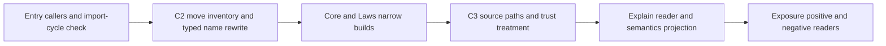

# Library cutover scout receipt

The coordinator must address named module references before C2 and the explanation tool's trust treatment before C3.
These are preflight findings about the plan, not regressions in Claude's active work.

## Scope and pins

Role: independent cutover scout. Evidence: source inspection and finite probes. Scope: C1–C4, decisions row 332.

Base and head: `01c83fbc0f319999faf9a9ab306137a95f6dd303`.
The isolated branch is `codex/cutover-scout-20261008`.
The worktree is `/Users/pooks/.codex/worktrees/module-design-review/lean4-effect4`.
No production source changes, commits, or pushes occur.
No full sweep runs.

The reviewed plan is `git:01c83fbc:docs/research/2026-10-08-library-cutover-plan.md`.
The reviewed design is `git:01c83fbc:docs/research/2026-10-08-library-shape.md`.

## Checked findings

| Finding | Decisive artifact | Consequence if the plan remains literal | Smallest correction |
| --- | --- | --- | --- |
| Import rewriting needs every header form | `src/Effect4/Modules/Queue/Data.lean` uses `public meta import`; Latch, Pool, Queue, and Semaphore use `meta import` | The stated `import`/`public import` rewrite leaves imports of removed files | Rewrite all four forms, preserving their modifiers and every other byte |
| Gate exceptions name modules rather than declarations | `auditImplementationModules`, `Test/Audit/AxiomGate.lean` | The two step elaborator exceptions name removed modules | Change the two module names to `Effect4.Step.Elab` and `Effect4.Step.Elab.Inputs` |
| Registry defaults name modules rather than declarations | `Concept.defaultModules`, `tools/Tools/SemanticsRegistry.lean` | `buildReport`, `tools/Tools/Semantics.lean`, refuses defaults whose modules are absent | Rewrite the moved module names while retaining every theorem pointer |
| The Latch model needs no table import | `State`, `wake`, `flush`, `close`, `awaitLatch`, `withdraw`, `src/Effect4/Laws/Modules/Latch/Model.lean` | Moving its unchanged import makes core reach Laws | Remove the unused table import before moving the model |
| The Stream model also contains laws | `Cursor.drain_ended`, `Cursor.drain_chunks`, `Cursor.collects`, `src/Effect4/Laws/Modules/Stream/Model.lean` | Moving the whole file puts these laws in core, contrary to the proposed split | Move the model definitions and keep these three unchanged theorem statements in Laws |
| Explain enters a new trust scope | `Tools.Explain.render`, `Tools.Explain.explain`, `Tools.Explain.canonicalJson`, `tools/Tools/Explain.lean` | Their unchanged dependencies exceed the semantic axiom ceiling after relocation | Give moved instrumentation explicit audit treatment, or split it and admit exact implementation declarations |
| C3 has source-path consumers outside imports | `SEMANTICS_SOURCES`, `Makefile`; the report's `inputs`, `tools/Tools/Semantics.lean` | The make prerequisite names a deleted file; JSON provenance names the old input | Update both source paths with the registry move |
| The exposure scan does not check entry exports | `scan`, `tools/Tools/Exposure.lean` | An entry can export an unlisted internal module while the user-import report stays empty | Add an explicit entry-import allowlist check, or narrow the stated claim |

The Latch model's table mention occurs only in documentation.
The proposed table split therefore lacks a core consumer at this base.
Keep `Table`, `Table.Injective`, `Table.renew`, and `Table.Injective.decides` in Laws unless a real core consumer requires them.

The source probe measures the current move inventory rather than copying the plan's earlier counts.
Its retained output gives every affected import and named-module reference.

The public declaration namespaces remain stable across the proposed moves.
Private helper names can contain their defining module's path.
`src/Effect4/Modules/Step/Elab/Inputs.lean` contains such private helpers.
The claim that no declaration name changes should cover public names only.

## Probe placement and trust result

No new theorem is stated or proved.
The finite trust probe reads existing declarations through `ProofGraph.reachedAxiomsMany`, `tools/ProofGraph/Axioms.lean`.

| Placement item | Value |
| --- | --- |
| Concept | `translation-simulation`, the module-law consumer's trust prerequisite |
| Claim | The C3 cutover places existing explanation instrumentation inside the audited tree |
| Reach | Every declaration owned by `Tools.Explain` in the pinned non-module environment |
| Limits | No relocated build, semantic theorem, host run, or whole-tree acceptance |
| Consumer | C3's audit treatment under decisions row 332 |

The probe retains its exact declaration list in `2026-10-08-cutover-scout-trust.txt`.
The result applies to unchanged source dependencies.
A future split or header change requires another scoped inspection.

```text
Tools.Explain: 223 declarations; 41 reach Classical.choice
Tools.Explain.canonicalJson: some ([propext, Quot.sound, Classical.choice])
Tools.Explain.schemaText: some ([propext, Quot.sound, Classical.choice])
Tools.Explain.render: some ([propext, Quot.sound, Classical.choice])
Tools.Explain.explain: some ([propext, Quot.sound, Classical.choice])
Tools.Explain.Explanation.text: some ([propext])
Tools.Explain.elabExplain: some ([propext, Quot.sound, Classical.choice])
```

The trust finding concerns implementation instrumentation.
It grants no exemption to a semantic theorem or a runtime definition.
The exact declaration list includes compiler-generated helpers and remains available for review.

## Executed controls and commands

```sh
LEAN_NUM_THREADS=3 lake build Tools.Explain
# Exit 0. Build completed successfully (119 jobs).

python3 docs/research/2026-10-08-cutover-scout-source-audit.py
# Exit 0. Retained output: 2026-10-08-cutover-scout-source-audit.txt.

LEAN_NUM_THREADS=3 lake env lean -DwarningAsError=true \
  docs/research/2026-10-08-cutover-scout-trust.lean
# Exit 0. Retained output: 2026-10-08-cutover-scout-trust.txt.
```

The source controls exercise four import-header forms and verify that a second rewrite changes nothing.
The negative controls show that the narrower pattern misses both meta forms.
Another control retains namespace declarations and the theorem reference `Effect4.Modules.Step.sound` unchanged.
This is a finite source rewrite check, not acceptance by Lean's header parser.

## Proposed landing controls

| Slice | Positive control | Negative control |
| --- | --- | --- |
| C1 | Compile an entry-only caller that derives `Modeled`, uses `field_ref%`, `record_step%`, and named fold inputs | A wrong field or shadowed fold input still refuses through the entry import |
| C1 | A caller imports `Effect4.Run` and reads the tape | A static import graph refuses `Run → Run.Tape → Run`; move the implementation into `Run.Basic` first |
| C2 | Existing `Test.Program.StepInputs`, `Test.Program.LatchRegistration`, and `Test.Program.QueueAgreement` still compile through moved imports | A retained old module name is reported before compilation; no global replacement changes theorem namespaces |
| C2 | A pinned import-closure check confirms core reaches no Laws module | The same checker rejects a synthetic core edge to the old Latch model's table module |
| C3 | Existing `Test.Audit.Explain` still accepts its own step and theorem readers | The scoped trust reader detects unadmitted moved implementation dependencies |
| C4 | The import scan accepts an entry-only fixture using Lean's actual header parser | The same scanner rejects an internal import, a proof-internal import, and a tool import |
| C4 | The entry-import check accepts exactly its declared re-exports | Adding one unlisted import to an entry is detected, even when all user files import entries |

Reuse the existing scanner when giving it fixture roots.
Do not create a second exposure classifier for negative controls.
The existing `Test.Audit.Exposure` checks table entries, not refusal by the scanner.
Add the enforcing command's own refusal reader before switching report mode to refusal mode.

## Ordered landing checklist



1. Pin C1's head and verify each entry's available operations and elaborators.
2. Keep importers of specialization sites non-module, as decisions row 202 requires.
3. Count C2's files from the landing head and review the explicit move mapping.
4. Distinguish import names, module-valued fields, declaration references, and source paths before rewriting.
5. Remove the Latch model's unused import and separate the Stream model's laws.
6. Update roots, architecture areas, exposure prefixes, semantics registry defaults, and exact module exceptions with C2.
7. Build the moved modules and their named direct consumers with `LEAN_NUM_THREADS=3`.
8. Use a scoped import-closure reader for core and Laws before claiming the separation gate's result.
9. Update C3's make prerequisites and report provenance paths.
10. Inspect the moved explanation instrumentation's dependencies and declare its exact audit treatment.
11. Run the existing explanation readers and inspect the generated semantics differences.
12. Move acceptance imports and document examples to the entries.
13. Add positive and negative scanner readers before enabling refusal mode.

The plan requests C2's library-root and module-closure gates.
Their current implementation lives inside the full `#effect4_axiom_gate` command in `Test/Audit/AxiomGate.lean`.
A narrow root build alone does not execute those gates.
Record a scoped closure check distinctly if the owner has not requested a full sweep.

## Changed files and open work

Only these research artifacts change:

- `docs/research/2026-10-08-cutover-scout-source-audit.py`
- `docs/research/2026-10-08-cutover-scout-source-audit.txt`
- `docs/research/2026-10-08-cutover-scout-trust.lean`
- `docs/research/2026-10-08-cutover-scout-trust.txt`
- `docs/research/2026-10-08-cutover-scout-receipt.md`

The proposed landing controls remain open until the relevant slices land.
The strict language check and `git diff --check` pass.
No production correction is made by this scout.
The finite checks establish preflight obligations only.
