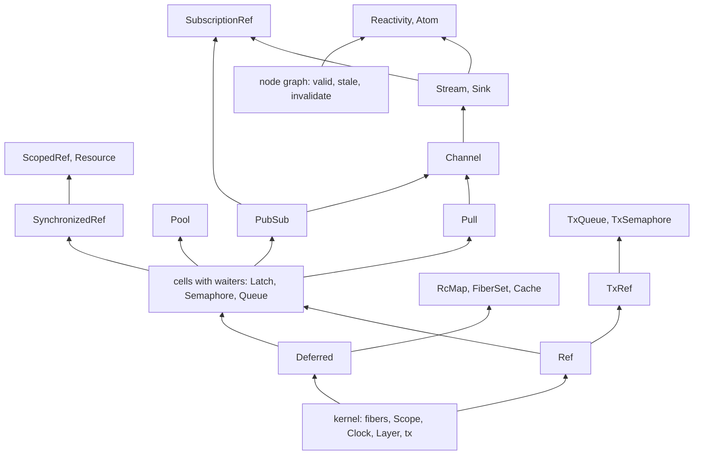

# Effect's building blocks: the kernel, the compositions, the stream stack and reactivity

Status: research note (history, not authority). Base: `28fb4389` (`refactor/phase1-phase3`).
Source: latest (Effect 4.0.1), vendored at `vendor/effect-4.0.1/src/`. The import graph is
measured by a script over each module's value imports (type-only imports excluded).

On 2026-10-08 the owner said that Effect's choice of modules is close to an ideal map of general
computational semantics. The library should be a map of that surface, built from Effect's own
building blocks. Stream comes next, and stream and reactivity derive from the frame machine.
This note measures that claim.

## 1. The one thing to know first

- **The claim holds, with two refinements.** Every stateful module of latest is built from a
  small kernel: fibers, `Ref`, `Deferred`, `Scope`, the clock, the layer memo and the transaction
  journal. Effect also implements `Latch`, `Semaphore` and `Queue` as kernel classes, but each
  is a cell with waiters. This tree derives all three from `Ref` and `Deferred`.
- **Stream adds no new kind of waiting.** A `Pull` is an `Effect` whose failure channel carries
  `Cause.Done` (`Pull.ts`, `Pull`). `Channel` transforms pulls, and is built from `Queue`, `PubSub`,
  `Latch`, `Semaphore`, `Scope` and `Fiber`. `Stream` and `Sink` wrap `Channel`. So the stream stack
  is a composition, but it is the largest one: 37,000 lines with documentation. It brings a
  protocol (end of input) and a second algebra of combinators.
- **Reactivity has a part that is not a fiber construct.** Its invalidation service is built from
  `Queue`, `Stream` and `Fiber`. `AtomRegistry` at its centre is a synchronous graph of nodes,
  each uninitialized, stale or valid, with `invalidate` and `setValue`
  (`reactivity/AtomRegistry.ts`, `NodeImpl`). That is the structure of incremental recomputation,
  the same one as the splice of probe LIVE-1 (`docs/research/2026-10-08-live-authoring.md`).
  Reactivity derives from the frame machine for its effects, and from the algebra of
  incremental folds for its graph.

## 2. The layers, measured

| Layer | Modules of latest | Built from, by value import | In this tree |
| --- | --- | --- | --- |
| kernel: fibers and the scheduler | `Fiber`, `Scope`, `Clock`, `Layer`, `Effect.tx` (`internal/effect.ts`) | the runtime itself | the frame machine: fork, await, race, mask, `scopeMake`, `sleep`, `clockNow`, layers; the transaction attempt is ruled, not built (row 331) |
| kernel: one cell | `MutableRef`, `Ref` | `MutableRef` | `refMake` and the `ref…With` family |
| kernel: one-shot waiting | `Deferred` | its own suspension (`DeferredImpl`) | `deferredMakeOf`, `deferredAwait`, `deferredSucceed`, `deferredFail`, `deferredPoll`, `deferredIsDone` |
| cells with waiters, kernel classes in Effect | `Latch`, `Semaphore`, `Queue` | their own suspension; `Queue` speaks `Pull`'s end | composed modules: the Latch, the Semaphore, the Queue (rows 219 to 222, 330) |
| compositions | `PubSub` (`Deferred`, `Latch`, `MutableList`, `Scope`); `Pool` (`Queue`, `Semaphore`, `Scope`, `Fiber`); `SynchronizedRef` (`Ref`, `Semaphore`); `ScopedRef` (`SynchronizedRef`, `Scope`); `Resource` (`ScopedRef`); `RcMap` (`Deferred`, `Fiber`, `Scope`); `FiberSet`, `FiberMap`, `FiberHandle` (`Deferred`, `Fiber`); `Cache`, `ScopedCache` (`Deferred`, maps); `PartitionedSemaphore`; `LayerMap` (`Layer`, `RcMap`) | measured imports | `Pool` composed; the rest open |
| the stream stack | `Pull`, `Channel`, `Stream`, `Sink`, `Take` | `Pull` on `Effect`; `Channel` on `Pull`, `Queue`, `PubSub`, `Latch`, `Semaphore`, `Scope`, `Fiber`; `Stream` and `Sink` on `Channel` | `Stream.Source` and the pull row (row 205); the pull's end as a value (row 331) |
| transactional | `TxRef`, `TxQueue`, `TxSemaphore`, and the other `Tx` modules | `TxRef`, over `Effect.tx` | none; gap G4 |
| reactivity | `Reactivity`, `Atom`, `AtomRegistry`, `AtomRef` (`reactivity/`) | `Queue`, `Stream`, `Fiber`, `SubscriptionRef`; `AtomRegistry`'s own node graph | none |

`SubscriptionRef` is built from `PubSub`, `Semaphore` and `Stream`, so it follows the stream
stack.

## 3. What it means for the library

- **The library is Effect's module map.** Each composed module keeps latest's name and its place
  in the graph above. Its building blocks are the ones latest imports, unless this tree's smaller
  kernel derives one of them. The `Queue` is the first such case.
- **The order of authoring follows the graph upward.** A module is authored after its building
  blocks. The catalogue brief's order (`docs/research/2026-10-08-module-catalogue-brief.md`)
  changes in one place: `SubscriptionRef` needs `Stream`, so it moves after the stream stack.
- **The stream stack is the next building block.** Its parts in this tree:
  - `Pull` is the protocol: a pull answers a chunk or the end, as a value. Row 331 rules it, a
    justified divergence from latest's failure channel;
  - `Channel` is a pull transformer: a stored definition and its captures (row 331), the shape of
    `Channel.fromTransform`;
  - its building blocks are the `Queue`, the `Latch`, the `Semaphore` and `Scope`, which exist,
    and `PubSub`, which is first in the catalogue.
- **Reactivity waits for the stream stack and for one new structure.** The node graph is the
  splice law's structure. It is pure data with an incremental law, so it belongs beside the edit
  session of row 334, not in the frame machine.

## 4. A proposal for the decisions register

**The library's organization (representation).** The library mirrors latest's module map. A
module's composition follows latest's own building blocks, except where this tree's kernel
derives a building block that latest implements natively. Each module records its building
blocks as data, so the implementation map of row 331 can draw the graph of section 2.
Recommendation: rule it as the owner stated it on 2026-10-08.

## 5. What this note does not establish

- The import graph shows what a module may use, not what each operation uses.
- That `Latch`, `Semaphore` and `Queue` are cells with waiters is shown here by construction:
  slices L1 to L3 built them so. No theorem relates them to latest's classes. The module law
  (G10) would.
- The line counts include documentation and examples.
- `AtomRegistry` was read at its node states and two methods, not in full.
- Nothing was run.
