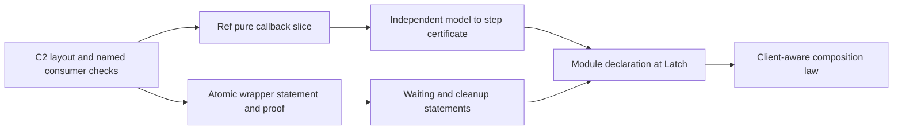

# Forward foundation scout receipt

Correct the catalogue's PartitionedSemaphore scope and the proof report's consumption claim before using either to direct implementation.
The C1 authoring entry works in a checked caller.
The C2 source edits already address several rename hazards.

## Scope and checkpoint

Role: independent design and correctness scouts, using three GPT-6.1 Sol agents.
Evidence: inspected sources, checked finite Lean controls, and finite runs of vendored Effect 4.0.1 under Bun 1.4.2.
Reviewed report and plans: `01c83fbc0f319999faf9a9ab306137a95f6dd303`.
Reviewed C1: `96e3fd10935c55e709710b0922964f0192671606`.
The review branch is `codex/cutover-scout-20261008`.
The source head of this packet is C1; only research artifacts follow it.

The scouts inspect Claude's active repository session through a bounded recent log tail.
They verify its working directory and compare its reports against the tree.
They do not message Claude or change its working tree.
C2 remains work in progress at this checkpoint.
No full sweep, merge into the implementation branch, or push runs.

## Confirmed findings and actions

| ID | Finding | Evidence and consequence | Smallest next action |
| --- | --- | --- | --- |
| FF-01 | The proof report's graph omits real consumers | An ordinary definition, statement, or data instance can use a theorem that `measure` calls `unconsumed` | Keep direct citations as their own measure; add structural reach through existing declaration-dependency machinery |
| FF-02 | Report totals have narrower meanings than their labels | A finite control counts eight reached names but seven graph members; absent roots disappear; ordinary instance edges count zero | Report missing roots, external endpoints, unfinished dependency walks, and the exact grouping beside raw edge counts |
| FF-03 | PartitionedSemaphore cannot reuse Semaphore's reservation model | Effect 4.0.1 reserves partial permits and distributes per partition; the retained Lean and host controls distinguish both choices | Correct the brief, define the independent reservation model, and retain cancellation and iterator state |
| FF-04 | Moving Explain changes its audit scope | The scoped reader finds `Classical.choice` in existing explanation and rendering declarations | Review exact instrumentation and rendering admissions before C3; leave the semantic proof ceiling unchanged |
| FF-05 | The exposure scanner lacks the promised entry-export check | `Tools.Exposure.scan` walks user roots; it does not compare each entry's imports against declared exports | Add that comparison to the existing scanner, with accepted and rejected fixtures, before C4 claims enforcement |

FF-01 and FF-02 concern `Tools.LoadPaths` in `tools/Tools/LoadPaths.lean` at `0f8a228e`.
The checked controls and their limits are in `2026-10-08-load-path-probes-receipt.md`.
The population classifier findings there predate this tool.
The fixtures do not measure how much the historical whole-graph figures change.

`ProofGraph.usedConstantsOf` in `tools/ProofGraph/Axioms.lean` already reads declaration statements and bodies.
Reuse it for structural reach through ordinary definitions.
Keep semantic necessity, direct citations, search availability, and planned consumers as separate questions.
A higher edge ratio is not a correctness result or an improvement by itself.
Moving a helper across a measured module grouping can change that ratio without changing behavior.
Keep the owner's prohibition on deletion from these measurements.

FF-03 and the qualified Ref, PubSub, and SynchronizedRef scopes are in `2026-10-08-catalogue-scout-receipt.md`.
Their finite observations establish neither fairness nor compatibility across all schedules.

FF-04 and FF-05 concern future cutover acceptance, not defects in landed C1.
`2026-10-08-cutover-scout-receipt.md` retains the exact declarations and checks.
A rendering declaration's admission remains by exact name under AGENTS.md.
A blanket relaxation for semantic laws is not a correction.

## C1 checked; C2 still active

The entry-only caller imports `Effect4.Author` and `Effect4.Run`.
It derives a record model, constructs and reads named fields, and evaluates captured list operations.
Its negative controls reject a missing input, a shadowed fold binder, and a missing required field.
The tape reader is visible through the public Run entry.
`2026-10-08-c1-entry-probe.lean` contains this caller.

The source closure check finds no Laws import under Author, Emit, Library, or Run at C1.
The Run declaration body is byte-identical after its header moves to `Run.Basic`.
`2026-10-08-c1-entry-source.py` reproduces those source checks at the pinned commit.
These checks do not execute the whole-library import or axiom gate.

The initial caller draft reverses `Step.get` arguments and omits concrete types for finite evaluation.
The retained caller corrects those fixture errors and passes.
They are not findings against the entries.

The inspected C2 working edits already rewrite every old Modules import header under src, Test, and tools.
They update the step Lean elaborator module exceptions and retain the public Step theorem names.
They also separate Stream's three model laws into the Laws tree.
These are source observations during active work, not reproduced C2 build results.

The Latch model's table import is unused at the reviewed base.
Removing it avoids the proposed table split if no other core consumer needs that table.
The active edits instead introduce `Library.Table`; assess that choice against an actual consumer.
This is a smaller-design suggestion, not a correctness blocker.

## The next implementation slices



1. Finish C2's moved imports, source-path consumers, and scoped separation checks before authoring new Library files.
2. Start Ref with checked pure callbacks and existing native operations.
3. Keep arbitrary JavaScript closures and unsafe operations outside that first Ref profile.
4. Choose Ref.set's observed result before claiming its connection to Effect's declared void result.
5. Place one atomic wrapper statement, then waiting, cleanup, and scheduled delivery statements with their distinct premises.
6. Give PartitionedSemaphore its own partial-reservation and cancellation model before deriving its steps.
7. Include PubSub subscription finalization and shutdown, not only publish and poll transitions.
8. Keep SynchronizedRef's client calls and cleanup in the composition observation.

G3 generates steps from an independently transcribed model and checks their value equation.
That certificate establishes the derivation; it does not establish the model's connection to Effect.
Its data belongs in core, and its certificate belongs in Laws.
Unsupported Lean source syntax needs a located refusal.
Stored steps remain data in the existing Term and Eff route.
Handle correspondence, allocation, membership, codec admission, and schedule observations keep their own claims.

## Reproduced checks

Run from the review worktree:

```sh
LEAN_NUM_THREADS=3 lake build Tools.LoadPaths
LEAN_NUM_THREADS=3 lake build Effect4.Author Effect4.Run
LEAN_NUM_THREADS=3 lake env lean -DwarningAsError=true docs/research/2026-10-08-load-path-probes.lean
LEAN_NUM_THREADS=3 lake env lean -DwarningAsError=true docs/research/2026-10-08-c1-entry-probe.lean
LEAN_NUM_THREADS=3 lake env lean -DwarningAsError=true docs/research/2026-10-08-catalogue-scout-controls/ExistingSemaphore.lean
LEAN_NUM_THREADS=3 lake env lean -DwarningAsError=true docs/research/2026-10-08-cutover-scout-trust.lean
python3 docs/research/2026-10-08-cutover-scout-source-audit.py
python3 docs/research/2026-10-08-c1-entry-source.py
bun docs/research/2026-10-08-catalogue-scout-controls/host-values.ts
bun docs/research/2026-10-08-catalogue-scout-controls/host-waits.ts
```

The coordinator replays these narrow checks after reading the agents' fixtures.
Every retained check exits zero.
Lean commands run serially within the review worktree with `LEAN_NUM_THREADS=3`.
The reporting fixture's eleven theorem declarations have empty axiom sets.
The Explain axiom output is the finding recorded above, not a passing semantic trust result.
No TypeScript compiler runs; Bun executes the vendored sources directly.
The host ordering checks use selected runs and waits; they prove no scheduling bound.

## Retained work

This packet adds the aggregate receipt, three agent receipts, and their replayable research controls.
It adds no production module or proof obligation.
The agent receipts list their exact changed files and original worktrees.
The aggregate review worktree retains copies together for replay and review.
The implementation owner retains the rulings, active files, and landing decisions.
