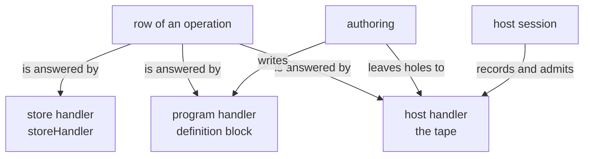

# 2026-10-08 Where authoring meets the host session

Status: research note (history, not authority). Base: `0906b0e7` (branch `refactor/phase1-phase3`).
Commit `5c26f121` landed during the seat, and it changed no file under `src/`. Seat HOST, for the
coordinator. No tracked file changed. The one probe is
`docs/research/2026-10-08-host-authoring-boundary/BoundaryProbe.lean`, a finite probe.

The owner asked on 2026-10-08: where does the authoring work meet the host session? Should the two
be separate, how, and where are the semantics of that boundary?

Words of this note. Each is defined here, before its first use.

- A **composed module** is an Effect module of rc.112 written as `Eff` programs over cells,
  deferreds and steps. The Queue and the Latch are two (R10; rows 330 and 331).
- A **client** of a composed module is a program that calls its operations (row 230).
- A **filling** is one of two programs that answer the same operation calls of one client: the
  library's, or a model's (`docs/research/2026-10-08-seat-SIM-design.md` §4.1).
- An **internal wait** is a park whose registration is no host row: a deferred's await, a join, a
  race. A host call is the other kind of park.
- The **crossing data** are the values that pass from authoring to a host session.
- The **authoring record** is the record that `eff_module` writes
  (`src/Effect4/Program/Authoring/Module.lean`).
- A run is **reached** when an open and run commands give it (`Run.Reached`,
  `src/Effect4/Laws/Run.lean`). It is **funded** when its tape leaves no run command unread
  (`funded`, `src/Effect4/Run/Tape.lean`).
- A tape is **settled** at a command budget when each decision had enough fuel (`Suffices`,
  `src/Effect4/Laws/Machine/Approximation.lean`). A run is **budget-quiet** when the operation
  budget forces none of its yields (`docs/research/2026-10-08-seat-SIM-design.md` §2.5).
- The **decision map** of a two-program law answers each decision of one run with decisions of
  the other (the SIM note, §2.4). The **image tape** is the tape that it gives.
- A **posted helper** is the detached fiber that carries a step's wake to a waiter (`posted`,
  `src/Effect4/Modules/Waiting.lean`; rows 238 and 240).

"Handler" keeps its dictionary meaning: a function that answers a row's operations.

## 1. The one thing to know first

- **The boundary is the handler of each row.** Row 328 gives one row three handlers: the store,
  the program and the host. Authoring decides which rows the program answers, by definitions and
  composed modules. It leaves the other rows to the host, and a hole is a row left on purpose. The
  host session is the host's handler, and it checks each reply at the type that the checker gives
  its call. DI-69's meaning composes the three handlers (`meaningUnder`,
  `src/Effect4/Laws/Program/DenoteRows.lean`).
- **The session carries a module law's host premise.** A session refuses every reply that reply
  admission refuses, and a refused run command changes nothing (`step_refused`,
  `src/Effect4/Laws/Api/Runner.lean`). So a module law stated at every admitted tape needs no host
  specification. One bridge is missing: from the session's executable reply admission to the
  proof's ghost admission (`admit_sound`, an open part of R6).
- **Today the two sides do not compose (finite probe).** A program that installs a composed
  module's definitions has an empty call table at its session. So the session refuses a reply at
  a template row that it admits when the same client writes the operation inline. The cause is
  one missing case of the focus step (`Node.childEnv`, `src/Effect4/Program/Typing/Focus.lean`).
  The address table and the agent's query function read the same step.

## 2. The two sides today

### 2.1 Authoring

Authoring takes an authored module and gives a built program. Each row of the table is read from
the source named in it.

| Part | What it is | Where |
| --- | --- | --- |
| input | `Module NativeOp`: host rows (`RowDef`), services, shared layers, definitions (`DefSrc`), and `main`. Each program part is a Lean function `Src Op := Env → List Nat → Except Refusal (Eff Op)` | `src/Effect4/Program/Authoring.lean` |
| composed modules | `eff_module` writes an authoring record of invocations and definitions. `install` prepends its definitions to a module | `src/Effect4/Program/Authoring/Module.lean`; `src/Effect4/Modules/Queue/Defs.lean` |
| authoring elaboration | `elaborateModule` gives one `Eff`. With a definition it puts a block at the root (`Eff.defs`), main at child 1 | `src/Effect4/Program/Authoring.lean` |
| program admission | `admitProgram` at `⟨table, []⟩`: the signature's lawfulness, formation, typing, and inhabited columns | `src/Effect4/Program/Admission.lean` |
| output | `Api.Built`: the row table, the program, the certificate `AdmittedProgram program ⟨table, []⟩`, and the row names | `src/Effect4/Api/Built.lean`; `Author.build`, `src/Effect4/Api/Author.lean` |
| not in the output | a target profile; the module laws (theorems about the definitions); the model; the module form, which row 331 rules and no code builds yet | — |

The module form of row 331 sits above `eff_module`. It generates the authoring record, the owed
statements and a row of the implementation map. None of it reaches `Built`: only the elaborated
definition block does.

### 2.2 The host session

The host session holds a run of a built program and checks every host reply.

| Part | What it is | Where |
| --- | --- | --- |
| entries | `Run.open` takes a `Built` and cannot refuse. `HostSession.start` takes a program, a table and a header, and it runs program admission again | `src/Effect4/Run.lean`; `src/Effect4/Api/HostSession.lean` |
| state | the machine; the ledger of held calls, stored replies, consumed and retired calls; the call table made at open; the journal and its phases | `Session`, `Run` |
| input | run commands: a control, a bind, a reply receipt, a reply application | `Command`, `src/Effect4/Api/Runner.lean` |
| output | `Observation` (protocol state, outcome, exit, awaited calls, receipts, retired calls, frontier reasons, fibers), `Work`, `MachineView`, `funded`, `atRest` | `src/Effect4/Run.lean`; `src/Effect4/Run/Tape.lean` |
| laws | `open_total`, `journal_replays`, `allows_answer` (`src/Effect4/Laws/Run.lean`); `step_refused`; `reply_commute`, `preflight_success_prepared_fits` (`src/Effect4/Laws/Api/HostSession.lean`); `session_eq_ref`, `reached_callInstance`, `origin_addresses_call` (`src/Effect4/Laws/Api/SessionRef.lean`); `funded_replays` (`src/Effect4/Laws/Run/Tape.lean`) | proved |

`open_total` states that the two entries agree. The refusing start on the built program's table
and header answers the session that `Run.open` gives. `session_eq_ref` relates a recorded, funded
run to the reference machine's replay of the run's tape, at any built program and row table.

### 2.3 Where the two sides meet today

They meet at five places, each read in the source:

1. `Run.open` takes the `Built`, so the certificate crosses inside Lean.
2. `HostSession.start` takes the program and the table, and it runs program admission again. A
   holder that erases the certificate needs it: the OCaml session of row 326, point 2.
3. Both entries run the checker once, to make the call table (`HostSession.callTable`). There
   the checker's answer at each call enters the session's checks.
4. The header pins the row table, and `start` refuses another (row 115). The header keeps the row
   table only (row 21).
5. The header's `profile` string names a host binding. Row 326, point 4, renames it `binding`.

The diagram shows the path of a program from authoring to a run. It shows calls and data flow
only, and it claims no law.

```mermaid
flowchart LR
  subgraph authoring["Authoring, in Lean"]
    MF["module form, ruled by row 331"]
    REC["authoring record<br/>eff_module"]
    MOD["authored module<br/>Module"]
    ELAB["authoring elaboration<br/>elaborateModule"]
    ADM["program admission<br/>admitProgram"]
    BUILT["program with its certificate<br/>Api.Built"]
    LAWS["module laws<br/>src/Effect4/Laws/Modules"]
  end
  subgraph session["Host session"]
    OPEN["entry that cannot refuse<br/>Run.open"]
    START["entry that refuses<br/>HostSession.start"]
    TABLE["call table<br/>callTable"]
    RUN["run and journal<br/>Run"]
    PRE["reply admission<br/>preflight"]
    VIEW["observation<br/>Run.observe"]
  end
  HOST["host"]
  MF -->|generates| REC
  REC -->|installs definitions into| MOD
  MOD -->|is elaborated by| ELAB
  ELAB -->|gives the program to| ADM
  ADM -->|certifies| BUILT
  LAWS -.->|are stated about the definitions of| MOD
  BUILT -->|is taken by| OPEN
  BUILT -->|gives program and row table to| START
  OPEN -->|makes| TABLE
  START -->|makes| TABLE
  OPEN -->|gives| RUN
  START -->|gives| RUN
  HOST -->|sends each reply to| PRE
  TABLE -->|gives the call's instance to| PRE
  PRE -->|stores an admitted reply in| RUN
  RUN -->|is read as| VIEW
```



### 2.4 A correction to the one-page state

`docs/STATE.md` says that the session's face is `Live.open`, `Live.start`, `Live.feed` and
`Live.view`. Row 326 rules that face, and no code builds it yet. `Run.Reached` still stands in the
law graph (`src/Effect4/Laws/Run.lean`), and no file `src/Effect4/Run/Event.lean` exists. The
session API note's slices DM1 to DM4, DM6 and DM7 are item 4 of the state's next steps
(`docs/research/2026-10-07-session-api-design.md`, §5). Its slice DM5, the call table at open,
landed with row 323. This note reads today's `Run` and `HostSession`, and it names the ruled face
only.

## 3. The seven judgments by side

The table places each judgment of `docs/core/controlled-english.md` §4 by the side that decides
it. Each entry is a reading of the named source.

| Judgment | Authoring decides it | The session decides it | Note |
| --- | --- | --- | --- |
| formation | `admitSig` and `Formation.checkInput` inside `admitProgram` | again in `start` only, for a holder with no certificate | `checkTable` refuses a row that breaks the host row's shape |
| canonical form | normal forms and the stored first-order program; `Built.bytes` | no | the session relies on it: a call's instance holds normal forms (`CallInstance`, `src/Effect4/Program/Typing/Call.lean`) |
| membership | none: the checker types terms, not values | at every reply: `externalValue` (`src/Effect4/Program/Compile.lean`) and `admitInstance` (`src/Effect4/Program/Admit.lean`) | the session checks a value against the checker's answer at the call |
| inhabitance | `admitColumn` (`src/Effect4/Program/Columns.lean`) on the program's and the rows' columns | no | the session's check implies inhabitance (`inhabited_of_hasTy`, `src/Effect4/Laws/Program/Typed/Membership.lean`), so an empty column admits no success reply |
| profile support | the target profile's data (`ProfileData`, `src/Effect4/Program/Profile.lean`) for printing and lowering | at a lowered face only: the OCaml engine refuses past the bound (row 321) | the header's `profile` is a binding name, not profile support (row 326) |
| codec admission | none: it publishes each row's Schema (Decision 12), the description a value is decoded under | none in Lean: a reply arrives as a `Val` | it belongs to each process crossing: the run commands' derived codecs (`src/Effect4/Api/RunnerBytes.lean`), and a host adapter's decoding at the call's instance (Route A) |
| reply admission | no | `preflight`, `admit`, `admitInstance` | it reads the call's instance, which the checker computes at open |

Reply admission is the only judgment that the session alone decides. Membership is the judgment
both sides share: authoring makes the type, and the session checks the value. The session also
makes two checks that are none of the seven judgments. Call correlation matches a reply to its
recorded call, and `HostProtocol.allows` checks the protocol's transition
(`src/Effect4/Api/HostProtocol.lean`).

## 4. Where composed modules touch the host

### 4.1 Which operations call the host (reading)

| Operations | Host calls | Evidence |
| --- | --- | --- |
| the first-order operations of the Queue, Semaphore, Pool and the Latch | none of their own: one step of the cell, deferred hints and posted helpers | `src/Effect4/Modules/Waiting.lean`; `src/Effect4/Modules/Queue/Ops.lean` |
| the operations that take a program: Semaphore's `withPermits`, Pool's `make` and `use`, a stream's source | the host calls of that program, run at times the module decides | `src/Effect4/Modules/Semaphore/Ops.lean`; `src/Effect4/Modules/Pool/Ops.lean`; `src/Effect4/Modules/Stream/Source.lean` |
| a stream over `Source.host` | open, pull and close are host rows | `src/Effect4/Modules/Stream/Source.lean`; `src/Effect4/Program/Stream.lean` |
| a transaction attempt | none: row 223 excludes host effects from an atomic body | row 223; row 331, point 1 |
| a definition's invocation | none: the row is a program row, "never by the host" | `DefDecl.row`, `src/Effect4/Program/Eff.lean` |

So a host call reaches a composed module only through a program that its client supplies. Row 328
keeps such operations expanded inline, since a definition takes no program as its request.

A module's wait is an internal wait. `Deferred.await` parks the fiber through `Name.registerAwait`
(`awaitDeferred_is_a_park`, `src/Effect4/Machine/Stores.lean`). A host call parks it through
`Name.externalRegister`. `requestOf` (`src/Effect4/Program/Admit.lean`) reads only the second kind.
So the session's awaited calls, its frontier and its reply admission see host calls alone.

### 4.2 What the session shows (finite probe, part A)

The probe installs the Queue's definitions and declares one host row, `Host.fetch`. In run 1, a
child takes from an empty queue, and the root calls the host, offers the answer and joins the
child. Run 2 is a root that takes from an empty queue and does nothing else.

| Moment | Protocol state | Outcome | Frontier reasons | What holds each live fiber | Work view |
| --- | --- | --- | --- | --- | --- |
| run 1, after the start | `awaitingAsync` | frontier | `awaitHost` of the root alone | root: host call; child: internal wait | the root's call; no runnable fiber, armed owner or timer |
| run 1, after the reply 7 and two flushes | `terminated` | finished | none | none | empty; the root's exit is 7 |
| run 2, after the start and a flush | `parked` | frontier | none | root: internal wait | empty; no exit; not stuck, not finished |

So the session shows three different things:

- **Beside a host call**, an internal wait is named by no reason and by no field of the work view.
  Only `Observation.fibers` lists the waiting child.
- **Alone**, an internal wait gives a frontier with an empty reason list. At a live, unfinished
  machine, an empty frontier is a deadlock (`frontier_empty_iff_deadlocked`,
  `src/Effect4/Laws/Api/Frontier.lean`). It is neither a stuck run nor an empty reading.
- **After the host's reply**, the posted helper wakes the child at the next flush. A reply
  application does not drain the dispatcher, so the flush is the caller's choice.

### 4.3 The host cannot answer an internal wait (finite probe, controls)

Each control below is a `#guard` of the probe at run 1's start, at the child's park.

| Route a host could try | What the session does |
| --- | --- |
| build a claim at the child's key (`Call.at`) | no call stands there: `none`, and a receipt plays no run command |
| bind a forged claim (`bindCall`) | refused: `staleCall` |
| the machine's check of the answer (`admit`) | refused: `notExternal` |
| an answer given as a control (`advance`) | refused: `directAnswer` |

So a composed module's state is private to the program. A host answer enters only as a value at a
host call. The interim rule (row 97) keeps internal handles out of every answer and error column.
The reply check refuses a success that holds one (`docs/core/host-boundary.md` §5). A host may
see a cell's handle in a request, but it cannot hand the cell back. Only the client's code passes
a host answer to a module's operation.

### 4.4 Against R12 and the host boundary

R12 asks that a frontier name what it awaits. The frontier names each decision that can move the
run: a host key, a timer, or scheduling work (`frontierReasons`, `src/Effect4/Api/Frontier.lean`).
An internal wait is no decision. It waits on a step of another fiber, so no reason names it, and
R12-b reads the empty list as a deadlock. Two gaps remain:

- R12's open part on stability over internal decisions names no observation for a deadlock's
  cause. The view could name each internal wait and its address (proposal P4, §7).
- The docstring of `frontierReasons` calls the frontier an Effect4 observation that rc.112 lacks.
  The probe ran no rc.112 program.

`docs/core/host-boundary.md` §4.6 already routes deferred deliveries outside external admission.
The probe's controls are four finite instances of that rule.

### 4.5 The command

Run the probe through the slot script:

```text
scratch/lean-slot.sh lake env lean docs/research/2026-10-08-host-authoring-boundary/BoundaryProbe.lean
```

The last run printed its readings and no error, with exit status 0, at the default budget
(`Api.Budget`). Its output is `docs/research/2026-10-08-host-authoring-boundary/BoundaryProbe.out.txt`.
Before the first run, `lake build --no-build` reported every import up to date.

## 5. The module law across the boundary

### 5.1 What the law quantifies over today

R10 asks that a composed module's law relate its expansion to a profile (row 79). Row 330, point
3, fixes its clients: a precisely checked client subset, against an abstract transition model. The
SIM note proposes the statement `Refines`. Every settled, budget-quiet tape of the library's
filling has such a tape of the model's filling, with related observations. Every
host answer is a decision of the tape. The decision map renames each fiber and token, so a host
answer to a client's call maps to the same answer at the related call. The SIM note says that a
client with host rows needs R6's admission of host answers (§4.3), and it stops there.

### 5.2 Which host answers the law should range over

| Quantifier | What it gives | Why |
| --- | --- | --- |
| every tape | a law about ill-typed host answers too | too strong: a step's agreement holds at typed inputs (`Step.sound`, `src/Effect4/Laws/Modules/Step.lean`), and a model state holds typed values only |
| every lawful `HostSpec` | a law for each host that a lawful specification allows | it constrains no answer's type: `LawfulHostSpec` (`src/Effect4/Program/Profile.lean`) bounds scalars and retained work only. R6 leaves the host relation open, and the owner parked it |
| every admitted tape (`AdmittedTape`, `src/Effect4/Laws/Program/Typed/Assembly.lean`) | a law for every tape whose host answers fit their parked calls | the quantifier of M7's route at host answers (`obsTyped_admitted`); a session's tape holds only answers that reply admission passed, and P2 states it in the ghost form |

The recommendation is the third. A host's answers reach a module only as values that the client
passes to its operations. Reply admission bounds each one to its call's instance. So no host
specification is needed, and none is useful: a lawful host may still answer any value.

Lawfulness of a host matters for two other claims. Host progress is an assumption (`host-progress`,
`docs/core/semantics.md` §2.9). Host conformance relates a real binding to a `HostSpec` (DI-57).
Neither is a premise of a module law.

### 5.3 What the session must give for a law to reach a run

| Guarantee | Statement | Status |
| --- | --- | --- |
| G1 the session reads the reference | `session_eq_ref` | proved, for a recorded, funded run |
| G2 the session's tape is admitted | every answer of `tapeOf s` fits its parked call, in the ghost form | missing: proposal P2; it needs `admit_sound`'s value half (R6) |
| G3 the run is budget-quiet | a run whose command budget stays below every fiber's operation budget | proposed in the SIM note (`budget-quiet-below`, slice S2) |
| G4 the image tape is a session tape of the model's filling | each renamed answer is admitted at the related call of the other filling | fails today when one filling holds a definition block: §5.4 |
| G5 the run is funded | the tape leaves no run command unread | readable by a replay today (`funded`); the view's flag is slice DM4 |

### 5.4 The two fillings disagree at the session today (finite probe, part B)

One client calls the template host row of row 183, `List<A>` to `Option<A>`, on the list `[1]`. It
also offers 3 to a queue. Filling 1 writes the Queue's `offer` inline. Filling 2 invokes the
installed definitions, so its program holds a block at the root.

| Reading | Filling 1, inline | Filling 2, definitions |
| --- | --- | --- |
| the host call's address | `[1, 0]` | `[1, 1, 0]` |
| the session's call table | 9 entries; the host call's instance answers `Option<number>` | empty; no instance |
| the reply `some 1` | admitted (`preflight`); the program answers it | refused: `envelope` |
| the reply `none` | admitted | admitted, through the row's own columns |
| the address table | every address has an environment; no refusal | one address of 117 has one; one refusal, `definitionBlock` at the root |

`Author.build` admits both programs. So installing a module changes the session's reply admission
at a host call that no module operation touches. The cause is `Node.childEnv`: it has no case for
`Eff.defs`, and it answers `none` there. `callAt`, the address table (`table`,
`src/Effect4/Program/Typing/Table.lean`) and the focus all read it. The expression checker refuses
a block (`TypeReason.definitionBlock`), while program admission types a block by the module check
(`ModuleHasTy`, `src/Effect4/Laws/Program/Definitions.lean`). The PROC-4 receipt records the focus
limit inside a definition's body (`docs/research/2026-10-08-procedures-proc4-receipt.md`). The
probe adds the main program, the session's call table and the address table's refusal.

The repair is at the focus step. At a root block the step must change the signature, as the
module check does (`checkModule`, `src/Effect4/Program/Definitions.lean`). The main program takes
`sig.withDefs decls` and the empty environment. Each body takes that signature and its request's
environment (`ModuleHasTy.defs`). Today the step keeps one signature along a path, so its state
gains the signature. Its law is proposal P1 (§7).

### 5.5 A module that runs a client's program

Some operations run a program that the client supplies (§4.1). A stream pulls its source, and
Pool's `make` runs its acquisition once for each item. The module decides when and how often the
host sees those calls. Row 230 makes a module's public requests part of its profile. So the law's
observation should keep those host calls in order, and the model should make the same calls. The
law then holds for every admitted reply tape of those calls: the upstream is any admitted sequence
of chunks. Owner question 2 (§8) asks this.

## 6. The proposed separation

### 6.1 What crosses, and what never crosses

| Crosses from authoring to a session | Never crosses |
| --- | --- |
| the program as canonical bytes, with its definition block | the authoring functions: `Src`, `DefSrc` bodies, `LayerSrc`, the authoring record |
| the row table, with any hole rows appended (`SigApp.withHoles`, `src/Effect4/Program/Sketch.lean`) | the module form, the model, and the Lean functions that a step is derived from |
| the header: version, session name, binding name | proofs: the certificate's propositions, the module laws, the step laws |
| the budgets: command fuel and compile fuel | a `HostSpec` and a `Reactor`: relations and Lean functions |
| in Lean only, the certificate inside `Built` | the call table as data: each holder makes it at open |

A step crosses only as terms inside a definition's body: steps are first-order data (row 330,
point 1). No module certificate crosses. The authoring side can still tie a run to a module's
claims. The block names each definition (`Eff.defsOf`, `src/Effect4/Program/Definitions.lean`).
A digest of the canonical bytes names the program (`sha256`,
`src/Effect4/Store/Carrier/Digest.lean`).

The call table stays derived on both holders. A lowered session runs program admission in its
refusing start, so it holds the checker anyway, and it makes the table itself. A table from the
wire would need a check that only the checker can make.

### 6.2 Who owns each judgment and each law

| Owner | Judgments | Laws |
| --- | --- | --- |
| authoring | formation, canonical form, inhabitance, profile support of a construct | the checker's laws (`check_sound`, `check_complete`); the block's typing (`defs_conservative`, `invoke_hasTy`, `checkModule_sound`); the step laws; each module law (R10) |
| the session | reply admission, call correlation, the protocol's transitions | `open_total`, `journal_replays`, `step_refused`, `reply_commute`, `session_eq_ref`, the typed replies (row 323) |
| a lowered session | profile support of a value | the OCaml engine's refusal past the bound (row 321); finite runs only (R8) |
| the wire, at each process crossing | codec admission | `decode_iff` (`src/Effect4/Laws/Schema/Codec.lean`); the program byte codec |
| both | membership: authoring makes the type, the session checks the value | `fits_hasTy` (`src/Effect4/Laws/Program/Typed/Membership.lean`) joins the proof's membership to the session's check |

The separation is clean when three conditions hold:

1. A session reads nothing of authoring but the crossing data. R13 states it as a congruence:
   equal recorded inputs give equal replay observations. Its top node is `journal_replays`.
2. The session's checks at a host call depend on the program's declarations, not on its
   handlers' bodies. Part B of the probe breaks this today, and P1 restores it.
3. Each authoring law about a client holds at every admitted tape, so every session run meets its
   premise. P2 and P3 state it.

### 6.3 One tool server or two

The recommendation is two services over one data contract, which one process may host for now.
The reasons, each from the tree:

1. **Authoring needs a Lean environment.** `eff_module` runs Lean elaboration, and so would the
   proposed module form and `derive`. `#explain` and `#obligations` read the environment's
   theorems and the semantics registry (`tools/Tools/Explain.lean`, `5c26f121`). A proof runs the
   kernel.
2. **The session needs the machine and the checker only.** Row 326 makes its first lowered form
   OCaml, entered by the refusing start. That start needs no certificate from Lean.
3. **The two hold different state.** A session holds a journal and a ledger for each run. The
   query function stores no session (`tools/Tools/Query.lean`, row 305).
4. **The two face different inputs.** A session admits replies from a host, outside the agent's
   control. The session note withholds the `wire` event from an agent's tools, since an agent
   could forge its claims (§3.3).
5. **The authoring tools call the session as a client.** `compare` runs a module's clients
   (`docs/research/2026-10-08-agent-authoring.md` §3), and an agent that fills a hole by a reply
   runs a sketch. Each sends crossing data, as any host does.

| Service | Tools | What it reads |
| --- | --- | --- |
| authoring | find, explain, obligations, run model, explore, derive, module, prove, impact, report (the agent-authoring note, §3); the query function's operations (row 305) | the Lean environment, the semantics registry, program bytes |
| the session | open, start, feed with a control, a hold, a receipt or an application, view (row 326; the session API note, §3) | crossing data and run commands |
| a client of the session | compare; a hole filled by a reply | crossing data |

The API surface's D-F (2026-09-17) recommended one Lean server. Its reason was that only a Lean
host holds a `Built`, and so opens a run with `open_total`. Row 326 later put the lowered session
behind the refusing start. An in-Lean session keeps `open_total` for the authoring service's own
runs.

### 6.4 The semantics of the boundary

These theorems and definitions already state parts of it:

| Statement | What it says at the boundary | Status |
| --- | --- | --- |
| `meaningUnder` (`src/Effect4/Laws/Program/DenoteRows.lean`) | the meaning of a program under any host, a partial handler of the row signature, summed with the store's handler | definition (DI-69) |
| `denoteRows_straight`, `meaningUnder_append`, `denoteR_straightRows` | the host meaning extends `denote`; C2 for host rows; the erasure law | proved (row 313) |
| `session_eq_ref` | the session reads the reference machine's replay of its tape | proved, funded runs |
| `open_total` | the certificate's crossing and the refusing start agree | proved |
| `reached_callInstance`, `start_callInstance` | the session's call table is the checker's `instanceAt` | proved |
| `instance_prepared_success`, `preflight_success_prepared_fits` | an admitted reply is a member at its call's instance, prepared unchanged | proved, rows whose answer allocates nothing |
| `admitted_typed`, `obsTyped_admitted` | the typed state at every admitted tape | proved, ghost admission |
| `frontier_empty_iff_deadlocked` | an empty frontier is a deadlock | proved |
| `denoteRows_eq_session` (`src/Effect4/Laws/Api/SessionMeaning.lean`) | the meaning under a run's reply tape is the run's observation | planned goal, `StraightRows` |
| goal G5 of the procedures note | the block's handler goes before the host's | proposed (slice PROC-5) |

These statements are missing, and §7 places each:

- P1: every host call of an admitted program has its instance in the call table, with or without
  a definition block.
- P2: the tape of a reached, funded session is admitted in the ghost form.
- P3: a module law at every admitted tape, read on two sessions of its two fillings.
- P4: the view names each internal wait.

The diagram below shows the three handlers of a row and who supplies each. It claims no law.



## 7. Placement of each proposed obligation

Each block gives the five fields of `AGENTS.md`'s placement rule. Each claim id is proposed; the
slice that lands it adds it to `tools/Tools/SemanticsRegistry.lean`.

**P1. The call instance of every host call** (proposed claim `block-call-instance`).

- Concept: `host-session-protocol`; property: reply admission at the call's checked instance.
- Question: claim `block-call-instance` (role preservation), a step of `reply-at-call-instance`
  (R6). Consumers: `preflight` through `HostSession.callTable`; the address table (claim
  `address-table`); P3.
- Reach: every program that program admission admits at `⟨table, []⟩`, with or without a block at
  its root. Every address of a host call, in the main program or in a body. The instance at
  `sig.withDefs decls`. A body's address at the environment of its request. Rows 323 and 328.
- Does not establish: that the expansion of layer references keeps a call at its address
  (`expansion-keeps-call`). Handle rows; delayed cell reads (row 100). Anything of a run.
- Unlocks: R6, typed replies for every program built with composed modules. R14, the address
  table and the focus inside such a program, which the query function answers. R10, through P3.
  Red control: the probe's part B.

**P2. The session's tape is admitted** (proposed claim `session-tape-admitted`).

- Concept: `host-session-protocol`; property: R6's receipt and application theorems, the value
  half of `admit_sound`.
- Question: claim `session-tape-admitted` (role preservation). Consumers: P3; M7's route at host
  answers (`obsTyped_admitted`) read on a session.
- Reach: every reached, funded run (`Run.Reached`, `funded`). Rows whose answer column allocates
  nothing (`allocates`). Success and failure completions. The session's two budgets: `AdmittedTape`
  takes one budget for both, so the statement must take them apart. Rows 97 to 100.
- Does not establish: handle rows, which wait on row 97's declarations. Delayed cell reads. Host
  progress. A lowered session.
- Unlocks: R6, and with it row 99's public typed guarantee for programs that use host services.

**P3. A module law, read on sessions** (an amendment of the proposed claims
`semaphore-expansion-agrees`, `queue-expansion-agrees` and `two-run-faces`).

- Concept: `translation-simulation`; property: a composed module's law, `Agrees profile module
  expansion` (R10), and its reading on a session.
- Question: the module claims take `AdmittedTape` on both fillings for clients with host rows. The
  reading `refines_session` (SIM slice S2) adds that the image tape is a session tape of the model's
  filling, by P1 and P2. Consumer: R10's open part for each composed module.
- Reach: clients that name the handle only as an operation's argument (row 330, point 3).
  Budget-quiet tapes whose host answers are admitted. The observation `PublicView ρ`, with the
  host calls of each client's program that the module runs (owner question 2). Rows 79, 230, 329
  and 330.
- Does not establish: liveness, the order of service, agreement with rc.112, host progress, a
  lowered session.
- Unlocks: R10, a law of a composed module that holds on every session run of its clients.

**P4. The view names each internal wait** (proposed claim `view-names-waits`).

- Concept: `reactive-scheduling`; property: R12's classification of a live run.
- Question: claim `view-names-waits` (role inversion). Consumer: the session's view (slice DM3),
  and an agent that diagnoses a deadlock.
- Reach: every frame machine. Each live fiber that has not exited is in one of four states. It
  is runnable, parked on a host call, asleep on a timer, or in an internal wait. The view names
  each internal wait with its registration and its address.
- Does not establish: which fiber can end the wait. Progress, liveness, or R12-c.
- Unlocks: R12, its open part on stability over internal decisions, with a named observation.

## 8. Decisions for the owner

1. **Meaning: which host answers a module's law ranges over.** (a) Every admitted tape. (b) Every
   lawful `HostSpec`, R6's parked relation. (c) Every tape. **Recommended: (a).** Section 5.2
   gives the reasons. A host's lawfulness stays with host progress and host conformance.
2. **Meaning: are the host calls of a client's program public, when a module runs it?** Pool's
   acquisition and a stream's source are the cases (§5.5). (a) Yes. The law's observation keeps
   those calls in order, and the model makes the same calls. (b) No: the law hides them.
   **Recommended: (a)**, by row 230's public requests. Streams and Pool meet it first.
3. **Representation: what the view shows at an internal wait.** (a) A field that names each
   internal wait with its registration and its address, and a flag for an empty frontier at a live
   machine. No frontier reason is added. (b) Nothing, as today. **Recommended: (a)**, in slice DM3.
4. **Domain: one tool server or two.** (a) Two services over one data contract: authoring in a
   Lean environment, the session where its engine runs. (b) One Lean server, as D-F proposed.
   **Recommended: (a)**, by §6.3. One process may host both while the contract is written.

The repair of the focus step (§5.4) is no question for the owner: it removes one cause, and P1
places its law.

## 9. What this note does not establish

- No theorem is stated or proved here. P1 to P4 are proposals.
- The probe is a finite probe: one budget, one script per run, two clients, on the frame machine.
  It proves nothing about other programs.
- The probe ran no rc.112 program and no OCaml engine. What rc.112 shows at a deadlock is not
  measured here.
- The reading of a lowered session follows row 326 and the session API note, not code: `Live` is
  not built.
- The claim that a lawful `HostSpec` may answer any value is a reading of `LawfulHostSpec`'s two
  fields.
- That a module's step agreement fails at an ill-typed input is not shown. The note shows only
  that no law covers it.
- The host boundary stays where `docs/core/host-boundary.md` puts it. Host progress stays an
  assumption, and per-row cancellation stays open (R6).
