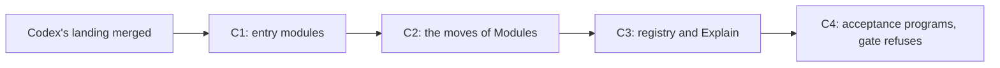

# The library cutover: four slices from the exposure classes to moved files

Status: plan (history, not authority). Base: `eebb9852` (`refactor/phase1-phase3`), with Codex's
branch `codex/module-folds` read at its rebase onto `1253079c`. Rulings: decisions row 332. Design:
`docs/research/2026-10-08-library-shape.md`.

## 1. The one thing to know first

- **The cutover starts when Codex's landing merges.** Codex edits the module files and the roots
  until then. Each slice below is a path move with a narrow build, in one commit.
- **The moves are mechanical.** The composed modules already declare path-free namespaces
  (`Effect4.Queue`, `Effect4.Queue.Model`). So a move changes module names and import lines, and
  no declaration name.
- **The models move to the core cleanly.** The Queue's, the Pool's and the Semaphore's models
  import nothing. The Stream's imports two core modules. Only the Latch's imports a law module,
  `Laws.Modules.Table`, whose data half moves with it.
- **The gate refuses at the end.** Today the exposure report finds 32 imports of 24 modules that a
  user may not make (`#exposure_report`, `tools/Tools/Exposure.lean`). After slice C4 it finds
  none, and the gate refuses a new one.

## 2. The target layout

| Path | Exposure | Holds |
| --- | --- | --- |
| `src/Effect4/Author.lean` | entry | program authoring, `deriving Modeled`, the step language, the wrappers |
| `src/Effect4/Run.lean` | entry | exists: runs, tapes, the host session |
| `src/Effect4/Emit.lean` | entry | the printer, Schema documents, the codec, the canonical schemas |
| `src/Effect4/Library.lean` | entry | every composed module |
| `src/Effect4/Library/<M>/` | module library | `Model.lean`, the data, the steps, the operations of `<M>` |
| `src/Effect4/Step/` | internal | the step language: `Step`, its elaborators, inputs, lists, renaming |
| `src/Effect4/Laws/Author.lean` | proof | the step laws, the wrapper laws, `#explain`, `#obligations` |
| `src/Effect4/Laws/Library/<M>/` | proof | `<M>`'s value, reading, typing and agreement laws |
| `src/Effect4/Laws/Step/` | proof | the shared step laws |
| `tools/ProofGraph/Registry.lean` | tool | the semantics registry, moved from `tools/Tools/` |

`<M>` ranges over Queue, Semaphore, Pool, Latch and Stream.

## 3. The moves

| From | To | Files |
| --- | --- | --- |
| `src/Effect4/Modules/{Queue,Semaphore,Pool,Latch,Stream}/` | `src/Effect4/Library/<M>/` | 22 |
| `src/Effect4/Modules/Step.lean`, `Step/` | `src/Effect4/Step.lean`, `Step/` | 7 |
| `src/Effect4/Modules/Words.lean`, `Waiting.lean` | `src/Effect4/Library/Words.lean`, `Waiting.lean` | 2 |
| `src/Effect4/Laws/Modules/<M>/Model.lean` | `src/Effect4/Library/<M>/Model.lean` | 5 |
| `src/Effect4/Laws/Modules/<M>/` (the rest) | `src/Effect4/Laws/Library/<M>/` | 30 |
| `src/Effect4/Laws/Modules/Step.lean`, `Step/`, and the shared laws | `src/Effect4/Laws/Step/` | 16 |
| `tools/Tools/SemanticsRegistry.lean` | `tools/ProofGraph/Registry.lean` | 1 |
| `tools/Tools/Explain.lean` | `src/Effect4/Laws/Author/Explain.lean` | 1 |

The shared laws are `Ascribe`, `Checking`, `Cons`, `Construction`, `Option`, `Reading`,
`Store`, `Table`, `Tuples` and `Waiting` of `src/Effect4/Laws/Modules/`. The counts are of
Codex's branch on 2026-10-08, and the slice recounts them.

- **The Latch's table splits.** `Laws/Modules/Table.lean` holds data the Latch's model reads, and
  one theorem. The data moves with the model to the core, and the theorem stays in the proof
  graph.
- **The step language's namespace stays** `Effect4.Modules` in slice C2, so that the move is a
  pure path move. A later slice renames it, with the dictionary's word for it.
- **The registry moves into `ProofGraph`.** It imports only Lean, as the seam library requires.
  The proof graph already imports `ProofGraph`, so `Explain` can live in it.

## 4. The slices

| Slice | What | Check |
| --- | --- | --- |
| C1 | The five entry modules as re-exports of today's paths; the roots import them; `ArchitectureRoles` marks them entry | `lake build` of each entry module; the exposure battery |
| C2 | The moves of §3's first six rows by `git mv`, and every import line rewritten by one script | `lake build Effect4 Effect4.Laws`, at two threads; the module-closure and library-root gates |
| C3 | The registry and `Explain` moved; `Effect4.Laws.Author` re-exports `Explain` | `lake build Effect4.Laws.Author Tools`; `make gen-semantics` byte-identical |
| C4 | Each acceptance program under `Test/Dogfood/` imports entry modules only; the report's user roots add the documents' examples; the gate refuses | `#exposure_report` reports none; the dogfood batteries |

**The script.** One Python script reads the moves table, runs `git mv`, and rewrites each `import`
and `public import` line that names a moved module. It writes no other byte. Its input is the
table, so a rerun on a clean tree is the identity.

**What the entry modules re-export**, read from the exposure report's 24 modules:

- `Effect4.Author`: `Api.Author`, `Program.Authoring.*`, `Codegen.Forms`, `Library.Words`, the
  step language, `Schema.Modeled.Derive`, `Schema.FieldRef.Elab`.
- `Effect4.Run`: today's, and `Run.Tape`.
- `Effect4.Library`: the composed modules, and `Program.Stream`.
- `Effect4.Laws.Author`: the laws an acceptance program reads. These are `Laws.Program.Author`,
  the authoring laws, `DenoteB`, `MeaningEq`, `Typed.Denotation`, `Laws.Run` with its rows and
  tape, and the semantics attribute.

The report also finds `ProofGraph.Plan` and `Tools.SemanticsRegistry` in one acceptance
program. Both are tools: C4 moves that program's plan check to `Test/Audit/`.

## 5. Risks

- **Rebuild.** C2 rebuilds every dependent of the moved modules: the proof graph's module laws
  and the module batteries. Lake's cache restores none of it, because the module names change.
  The slice runs `lake build` once, at two threads.
- **Open branches.** A branch that edits a moved file conflicts. The coordinator lists the open
  branches before C2 and lands it when none edits `src/Effect4/Modules/` or
  `src/Effect4/Laws/Modules/`.
- **Generated files.** The architecture map and the semantics report name module paths. C2 and
  C3 regenerate them (`make gen-architecture`, `make gen-semantics`).

## 6. Repairs that join the cutover

The defect class of decisions row 333 has two more members. A reader walks a whole program at one
typing signature, and a definition block stops it.

| Reader | Today on a program with a block | Repair |
| --- | --- | --- |
| `Sketch.check` (`src/Effect4/Program/Sketch.lean`), and the query tool's `check` | refuses with `definitionBlock` | check by the module check; the sketch laws lift by the parts |
| `Sketch.table`, `Sketch.refusals` and the query tool's `table` and `refusals` | one entry with an environment; the refusal `definitionBlock` | a program table over the parts: the block's root, its bodies' spine, and each part's table |

These are slice S1, after C2, because the sketch is authoring. Its laws are placed with the
splice law of `docs/research/2026-10-08-live-authoring.md` §4.

## 7. What this plan does not establish

- No file moved. The counts are of one branch on one day.
- The exposure gate checks import lines. Lean's module system cannot hide an internal type that
  an entry module's signature names, so the class stays declared data.
- Built artifacts for outside users wait, by row 332, point 3.
