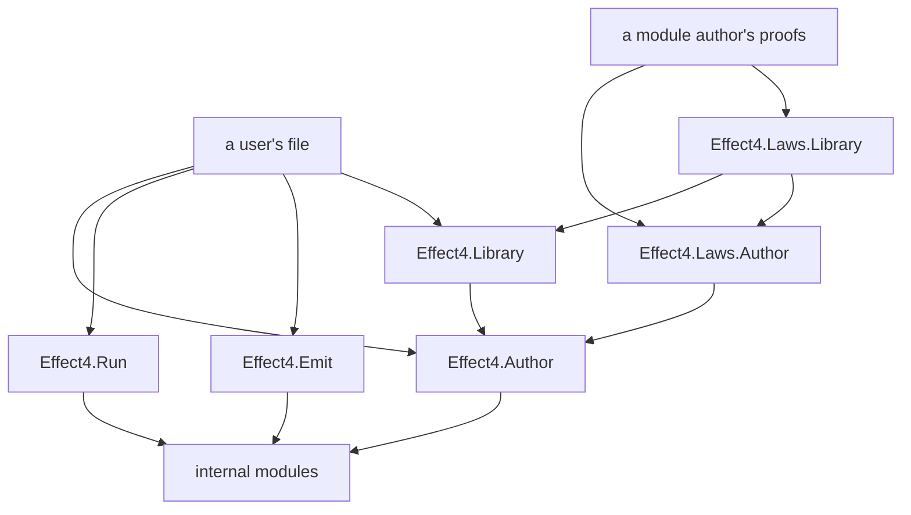

# The library's shape: what a user imports, what ships built, what stays internal

Status: research note (history, not authority). Base: `57dac2ad` (`refactor/phase1-phase3`).

On 2026-10-08 the owner asked that the tree be organized for use as a library. A user's import
should be clean. The note separates what a user imports, what ships built, what is internal, and
what the authoring surface exposes. The owner also confirmed that models move out of the proof
graph.

## 1. The one thing to know first

- **Today no entry point exists.** The acceptance programs under `Test/Dogfood/` import 25
  distinct modules of the tree by name, from `Effect4.Program.Authoring.Loops` to
  `Effect4.Laws.Program.DenoteB` (§2). A user of the library would do the same.
- **The proposal has four exposure classes and five entry modules** (§3, §4). Each source file has
  one class, written as data beside its architecture area. A gate checks that a user's file
  imports only entry modules.
- **Each composed module splits in two** (§5). What runs lives in the core: the model, the steps
  and the operations. Why it is right lives in the proof graph: the certificates and the laws. So
  the models move to the core, and `derive_step` splits into a data half and a proof half.
- **The move waits for Codex's landing.** Codex edits the module files now, so the files move in
  the first slice after its merge (§7).

## 2. The tree today, measured

| Area | Lean files |
| --- | --- |
| `src/Effect4/Laws` | 359 |
| `src/Effect4/Program` | 74 |
| `src/Effect4/Store` | 28 |
| `src/Effect4/Codegen` | 28 |
| `src/Effect4/Modules` | 21 |
| `src/Effect4/Machine` | 20 |
| `src/Effect4/Schema` | 15 |
| `src/Effect4/Api` | 12 |
| `src/Effect4/Data` | 10 |

The counts come from `find src/Effect4 -name "*.lean"` on 2026-10-08.

- The root `Effect4` (`src/Effect4.lean`) imports 138 modules, and `Effect4.Laws` imports 258. Each
  root exists so that the library-root gate reaches every source. Neither is a user's import.
- `docs/core/api-surface.md` §1 names four faces: `Author`, `Run`, `Supervision` and the older
  `Api`. A program also needs the authoring words, the loops, the ascription and the modules,
  which no face re-exports.
- The architecture roles (`tools/Tools/ArchitectureRoles.lean`) give each area a column, a height
  and a role. They give no exposure.

## 3. The four exposure classes

An **exposure** is the class of a source file by who may import it by name.

| Exposure | Who imports it by name | It may change | Examples |
| --- | --- | --- | --- |
| entry | every user | by a ruled row | `Effect4.Author`, `Effect4.Run` |
| module library | a user who calls a prebuilt composed module | by a ruled row | `Effect4.Library.Queue` |
| internal | the tree's own modules and its batteries | freely, under the gates | `Effect4.Machine.Stores`, `Effect4.Program.Typing.Rules` |
| proof | a module author, a tool, a reviewer | by a ruled row for a placed theorem | `Effect4.Laws.Author`, `Effect4.Laws.Library.Queue` |

An internal module's types may appear in the entry modules' signatures: `Ty` and `Step` do. Lean's
module system cannot hide them, so the class is declared data, and a gate checks it, not Lean
visibility.

The tools of `docs/research/2026-10-08-agent-authoring.md` §3 split by what they read. A tool that
writes data, such as `derive_step`, is authoring, so `Effect4.Author` exposes it. A tool that
reads the proof graph, such as `#explain` and `#obligations`, reads placements and standings,
so `Effect4.Laws.Author` exposes it. The core never imports the proof graph.

## 4. The entry modules

| Entry module | What it re-exports | Its user |
| --- | --- | --- |
| `Effect4.Author` | program authoring (`Program.Authoring.*`, `Api.Author`), `deriving Modeled`, the step language with named inputs, `field_ref%`, `record_step%`, `fold_step%`, `derive_step`, `eff_module` and the module form, the wrappers | an agent or a person who writes a program or a module |
| `Effect4.Run` | runs, tapes, the host session | a program's runner |
| `Effect4.Emit` | printing to TypeScript, Schema documents, the codec, each answer's canonical schema | a TypeScript client, a code generator |
| `Effect4.Library` | every prebuilt composed module, each also importable alone | a program that uses a Queue or a Latch |
| `Effect4.Laws.Author` | the shared laws: the step laws, the derivation's lemma bank and `derive_step_eval`, the wrapper laws, the module law; `#explain` and `#obligations` | a module author who proves, and every reader of the proof graph |

The root `Effect4` keeps its job: it imports everything, for the gates. The five entry modules sit
beside it.

## 5. One composed module, split in two

The Latch is the first module through this layout, after Codex's landing.

| File | Library | Holds |
| --- | --- | --- |
| `src/Effect4/Library/Latch/Model.lean` | core | the state and its operations as ordinary Lean, citing rc.112 or latest (Effect 4.0.1) by line |
| `src/Effect4/Library/Latch/Steps.lean` | core | `derive_step` of each operation: data only |
| `src/Effect4/Library/Latch.lean` | core | the module form: the operations, their wrappers, the authoring record |
| `src/Effect4/Laws/Library/Latch.lean` | proof graph | `derive_step_eval` of each step, the agreement and typing statements, the module law |

- **Why the model moves.** The derived step must run, so it lives in the core. Its source, the
  model, must be visible there too. The core never imports the proof graph.
- **The derivation splits.** `derive_step` writes the step in the core. `derive_step_eval` writes
  its certificate in the proof graph, from the bank. Each half has one job and one library.
- **The model keeps its independence where it matters.** It transcribes rc.112 or latest, never the
  step. The `compare` tool grades it against the native runs.
- **The name.** `Modules` becomes `Library`. In this tree a module is a Lean file, by the
  dictionary of `docs/core/controlled-english.md`. A composed module is an entry of the library.

## 6. How the shape is kept

| Rule | Checked by | Mode at first |
| --- | --- | --- |
| each area of `ArchitectureRoles` declares its exposure | the roles register's totality check | refuses a missing class |
| a user's file imports only entry and module-library modules | a new import gate over the acceptance programs and the documents' examples | reports, then refuses |
| an entry module re-exports only what its exposure row lists | the same gate | reports, then refuses |
| a module-library file imports `Effect4.Author` and internal modules, never the proof graph | the library-root gate, as today | refuses |
| `Effect4.Laws.Library.*` imports its library module and `Effect4.Laws.Author` | the architecture map's direction check | reports |

The exposure classes are data, so the architecture map draws them, and `#explain` reports each
declaration's class.

**What ships built.** Lake's artifact cache already restores built modules across worktrees. A
user of the library would want the core and the proof graph built for them, not rebuilt. Whether
to publish built artifacts, and how, is a question of distribution for the owner (§8).

## 7. Order

1. After Codex's landing: the exposure column in `ArchitectureRoles`, and the import gate in
   report mode.
2. The entry modules `Effect4.Author`, `Effect4.Emit`, `Effect4.Library` and `Effect4.Laws.Author`.
   `Effect4.Run` exists.
3. The Latch in the layout of §5: its model moved to the core, its steps derived, its certificates
   in the proof graph.
4. The rename from `Modules` to `Library`, for the Queue, Semaphore, Pool and Stream.
5. The acceptance programs move to entry imports. Then the gate refuses.

## 8. Decisions for the owner

1. **The entry modules' names (representation).** Recommendation: `Effect4.Author`, `Effect4.Run`,
   `Effect4.Emit`, `Effect4.Library` and `Effect4.Laws.Author`.
2. **The rename of `Modules` to `Library` (representation).** Recommendation: yes, after Codex's
   landing, in one slice.
3. **Built artifacts for users (domain).** Recommendation: decide when the first project outside
   this repository imports the library; until then, Lake's local cache serves.

## What this does not establish

This note is a design over a measured inventory. No file moved, no gate exists yet, and the counts
are of 2026-10-08.
