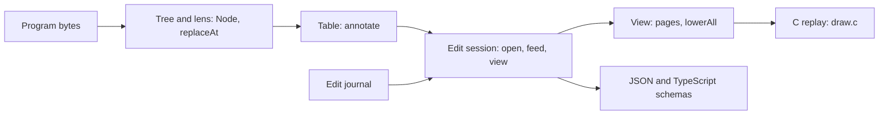

# Live authoring from the algebra: the tree, the table, the edit protocol and the edge

Status: research note (history, not authority). Base: `1253079c` (`refactor/phase1-phase3`).
Probe: `docs/research/2026-10-08-live-authoring/LiveProbe.lean`, output beside it.

On 2026-10-08 the owner asked four things by voice. The text is the coordinator's reading.

- Build live authoring off the algebra. The lens laws and the initial algebra's folds should give
  editing, updating and incremental typing "for free", packaged as data structures.
- Consolidate the native view probe of another session into deep modules: visualization,
  editing, updating, incremental typing. Keep it simple at first.
- Can the other data structures be derived, the tree and the update protocol too? They become
  the interfaces, and they lower directly to a foreign function interface.
- Review the earlier sessions and probes first, and ground the theory in compiler and editor
  research, so that nothing is derived twice.

"Lenz laws" is read as "the lens laws", and "algebra divide 2ling" as "algebra-driven tooling".

## 1. The one thing to know first

- **Most of it exists.** The tree, its lens laws, the table, holes, the focus and the query tool
  are landed. A native renderer was probed between 2026-10-06 and 2026-10-07 (§2). This note adds one law and one protocol on top.
- **The missing law is the splice** (§4). An edit that keeps its focus's type changes the address
  table only inside the edited subtree. Probe LIVE-1 checks it at every typed address of three
  programs: 133 of 133 edits splice exactly. This is incremental typing, and it is the classic
  result for attribute grammars (Reps, Teitelbaum and Demers 1983, recalled).
- **The update protocol is the journal pattern again** (§5). Edits are a free monoid acting on
  the program through the path lens, as host replies act on a run. Undo comes from the lens's
  get-put law. The face reuses the session API's `open`, `feed` and `view`.
- **The edge is data** (§6). Each message is first-order data with a canonical schema. The same
  codecs serve TypeScript, the C renderer and OCaml. lean4-flow fits as an optional
  driver at the edge, never as the semantics.

## 2. What earlier sessions already did

| Piece | Where it landed or was probed | Its law | What it gives live authoring |
| --- | --- | --- | --- |
| The tree: one kinded node over the seven sorts | `Node`, generated `child` and `setChild` (`src/Effect4/Program/NodeLenses.lean`) | the generated lens equations | a uniform rose tree with typed views, rowan's design (2026-09-16 precedents note, §6) |
| The path lens | `Node.at_`, `Node.replaceAt` (`src/Effect4/Program/Refs.lean`), Codex's slice B (`2026-10-03-program-path-editing/receipt.md`) | put-get `replaceAt_spec`, get-put `replaceAt_self`, put-put `replaceAt_overwrite`, `at_replaceAt_disjoint` (`src/Effect4/Laws/Program/References.lean`) | edits, undo, and disjoint edits that commute |
| Typed replacement | `NodeHasTy.replace_envAt` (`src/Effect4/Laws/Program/Typing/Replace.lean`) | `check_replace_focusAt` | an edit at the focus's type keeps the whole program's type, with no new check of the program |
| The focus | `focusAt` (`src/Effect4/Program/Typing/Focus.lean`) | `focusAt_typed`, `hasTy_focusAt` | what may stand at a place: its environment and type |
| The address table | `table`, and `annotate` in one traversal (seat TABLE; `src/Effect4/Program/Typing/Annotate.lean`) | `annotate_eq_table`, `refusals_head`, `refusals_nil_iff` | every node's environment and type, and every refusal |
| Holes | `Sketch` (seat SKETCH; `src/Effect4/Program/Sketch.lean`) | `holes_conservative`, `Sketch.check_fill_focusAt`, `Sketch.check_omit_focusAt` | omit and fill, Hazelnut's empty hole as a host row |
| The tool face | the query tool (seat QUERY; `tools/Tools/Query.lean`) | each operation names its law | JSON lines over canonical program bytes |
| The theory | seat GAP's study (`2026-10-06-seat-GAP-study.md`) | read in full: Hazelnut, live programming with typed holes, marking, bidirectional type slicing, Huet, McBride | the focus as a derivative; running to a hole; GAP §8.9's operations, each with its law |
| Incremental folds | `2026-09-16-ts-ast-algebra-precedents.md` §6 and §7 | recalled: Reps and others 1983, Roslyn, rowan, Adapton, Salsa | store widths, not positions; build no Adapton, Salsa or lens framework |
| The picture | the native view probe (`2026-10-06-native-view*.md`, `2026-10-07-native-view-*.md`, the folder `2026-10-06-native-view-probe/`) | five probe laws in `Scene.lean`, among them `lowerAll_append` | pages as data, lowered in Lean to device calls, replayed by C (`draw.c`); the difference of two lists is the repaint set (its proposal E) |
| The session face | the session API note (`2026-10-07-session-api-design.md`), row 326 | the session's contracts | `Live.open`, `feed`, `view`, with byte codecs for each |
| A whole program's parts | today, `Program/Typing/Parts.lean` (decisions row 333) | `checkModule_programCallAt` | the readers reach inside a definition block |

## 3. The derived structures, and the law each brings

Every structure below is derived from the signature (`binders.json`, the generated folds and
lenses). None is written by hand per constructor.

| Structure | Derived from | The law that comes with it |
| --- | --- | --- |
| the tree (`Node`) | the family's signature | the lens equations of `child` and `setChild` |
| an address, every address | the generated path fold (`foldMapAt`) | `mem_addresses_iff` |
| an edit and its undo | the path lens | put-get, get-put, put-put |
| the environment at an address | the step `Node.childEnv`, folded along a path | `NodeHasTy.child_step` |
| the address table | the checker's fold with a record at each node | `annotate_eq_table` |
| the splice of the table after an edit | the table as a fold, and the path lens | **owed**: the splice law (§4) |
| a page | a fold of the table and the type's layer | the native view's page rules, today a second statement in `view.c` (its finding 5) |
| device calls | `lowerAll`, a monoid map over page operations | `lowerAll_append`, in the probe |
| the repaint set | the splice law, then `lowerAll_append` | **owed**: the splice law; the rest follows |

The path from an edit to the screen is one chain of folds. The edit splices the table. The
table's segment gives the page's segment, and the lowering maps a segment to its device calls.
Each link that is a monoid map keeps a difference a difference. So an edit repaints its own
subtree and nothing else, when its type is kept.

## 4. Probe LIVE-1: the splice

**What it checks.** At every address of a program, the edit wraps the sub-program in `suspend`,
which keeps its type. The probe computes the edited program's table twice. Once again from the
root (`annotate`). Once as the splice: the old table outside the edited subtree, with the new
sub-program's own table, at the focus's environment, in its place.

| Program | Typed addresses | Edits that keep the type | Splice equals the table again |
| --- | --- | --- | --- |
| seat HOST's client: a queue, a host call, an offer | 39 | 39 | 39 |
| a loop of offers, then a take | 87 | 87 | 87 |
| a handler, a finalizer and a choice | 7 | 7 | 7 |

**An edit that changes the type.** The edit `exit` changes the answer column. In the third
program it changes up to five entries outside its subtree: the nodes above it, and the siblings
that read its type. This is the cost that the splice avoids.

**An edit session as a pure machine.** `Live.step` in the probe splices when the type is kept,
and computes again from the root when it is not. After a run of 17 edits of both kinds the
session's table is the table of its program, in two programs. One edit that keeps the type
shows 2 addresses again, of 95.

The probe is a finite evaluation over three programs with no layer reference. It proves
nothing about other programs.

**The law to state** (proposed claim `edit-splices-table`).

- Concept: `initial-algebras-folds`. Property: the address table is a fold, and an edit is a lens
  update. It serves R14 (program as data: regions, the focus, holes).
- Question: claim `edit-splices-table`, role preservation. Its premises: the focus
  `focusAt s env0 p a = some f`; the kept type `effTy s f.env q' = some f.ty`; the edit
  `(Node.eff p).replaceAt a (.eff q') = some (.eff p')`. Its conclusion: `annotate s env0 p'` is the splice at `a` of `annotate s env0 p` with
  `annotate s f.env q'`. Consumers: `Sketch.fillAt` at the focus's type (seat QUERY's `fill`), the edit
  session's coherence, the repaint set.
- Reach: one signature; a program of the structural checker, with no block; an edit of a program
  node. The parts of `Program/Typing/Parts.lean` lift it to a whole program, one part at a time.
  The table lists a node before its children, so a subtree is one segment.
- Does not establish: an edit that changes the type, which computes again; a run; a page. Nor
  layer references: Codex's slice B keeps a control where an edit of equal layer type removes a
  referenced target. The refusal paths inside the new subtree are relative to it, and the
  statement must shift them, or restrict to a typed `q'`.
- Unlocks: R14, live editing at the cost of the edited subtree; the view's repaint set; seat
  GAP's `hole.fill` without a new check of the context.
- The proof's route: `tableAt_eq_cons` (`src/Effect4/Laws/Program/Typing/Annotate.lean`) unfolds
  the table one node at a time. Along the path, `NodeHasTy.child_step` gives each sibling's
  environment from the earlier siblings' types. Those types are unchanged, by the typed
  replacement law at each prefix of the path. Off the path, `at_replaceAt_disjoint` keeps every
  subtree.

## 5. The update protocol

**Edits are a journal.** An edit is data: an address and a program, or one of seat GAP's
operations (`omit`, `fill`). A list of edits acts on a program by the path lens. This is the
pattern of the run, whose journal of commands acts on the machine (`replay_unique`,
`journal_replays`, `src/Effect4/Laws/Run.lean`). The same three laws are owed, and two follow
from the lens laws already proved:

| Law | Its source |
| --- | --- |
| a run of edits is the fold of one edit | by definition, as `Live.run` in the probe |
| undo: the edit back to the old sub-program restores the program exactly | get-put, `replaceAt_spec`'s third part |
| two edits at disjoint addresses commute | `at_replaceAt_disjoint`, with put-put |
| the session's table is its program's table, after every run | the splice law, and a new check where the type changes |
| the repaint set is the edited subtree, when the type is kept | the splice law |

**The face reuses the session's.** The session API note (2026-10-07, row 326) gives a run the
face `open`, `feed` and `view`. Each event and the view have byte codecs. An edit
session takes the same face: `open` a program, `feed` an edit, `view` its table and its pages.
One face then covers editing and running. Hazel's live programming joins them: running to a hole
and filling it (seat GAP's §7.4).

## 6. The edge: data across the foreign function interface

- **Every message is first-order data.** An edit holds canonical program bytes, as the query
  tool's do. A table entry, a delta and a view are records. Each takes `deriving Modeled`, as
  `#explain`'s answers do (`tools/Tools/Explain.lean`), so each has a canonical JSON form and a
  TypeScript schema from `Codegen.Schema`.
- **The C renderer reads device calls.** `lowerAll` in Lean writes the stream, and `draw.c`
  replays it. The native view's proposal B lands the three forms of a picture as data. The
  lowering is a function, and C keeps only the replay, the window and text shaping.
- **lean4-flow** (`github.com/predictable-machines/lean4-flow`, read on 2026-10-08):
  - MIT, version 0.1.0, 24 commits, toolchain `v4.32.0`; this tree is on `v4.33.1`.
  - `Flow` is a function over `IO`, with Kotlin's cold and hot streams: `SharedFlow`, `StateFlow`.
  - `ReactiveProgramDefinition` has a pure `update : σ → α → σ` and `IO` side effects.
  - No law is stated. `StateFlow.update` reads, then emits, outside its atomic block.
  - Its `update` slot is where `Live.step` goes. Our pure machine owns the semantics and the laws;
    the library would only carry events to it and views out of it.
  - The probe adds no dependency. Adding one is the owner's decision (§8).

## 7. The deep modules, kept small

| Module | State | Owns |
| --- | --- | --- |
| `Program/Typing/Parts.lean` | landed today | a whole program's parts and readers |
| an edit session (name open) | proposed | the edit, `step`, `run`, the splice, the delta |
| the view | probed in the native view | pages, the picture's three forms, `lowerAll` |
| the driver | outside the interface | events in, views out: a loop, or lean4-flow |

## 8. Decisions for the owner

1. **Representation: is a view a face of the language with claims, or a tool whose laws are
   tests?** The native view note asked this as its question 2. The splice law is a law of the
   table, a face with claims. Recommendation: the table and the edit session are a face with
   claims; the picture's layout stays a tool until a person uses the window.
2. **Domain: lean4-flow as the driver.** (a) Add it as a dependency of the driver only. (b)
   Write the loop ourselves on the session's `feed`. Recommendation: (b) for now. Ours is one
   fold, and the library brings a toolchain step and no laws. Revisit when several event sources
   must merge.
3. **Representation: one face for editing and running.** Recommendation: yes, `open`, `feed` and
   `view`, with an edit as one more kind of event.

The splice law needs no ruling. It is placed in §4, and its proof route reuses landed laws.

## 9. What this note does not establish

- No theorem is stated or proved here. The splice law is a proposal with a finite probe.
- The probe covers three programs, none with a layer reference or a block, at one signature.
- The incremental-evaluation literature is recalled, not read. The 2026-09-16 note marks Reps and
  others, Roslyn, Adapton and Salsa as recalled, and no text is filed here.
- lean4-flow was read from its repository's pages on 2026-10-08. It was not built or run.
- The cost model counts entries of the table, not time.
