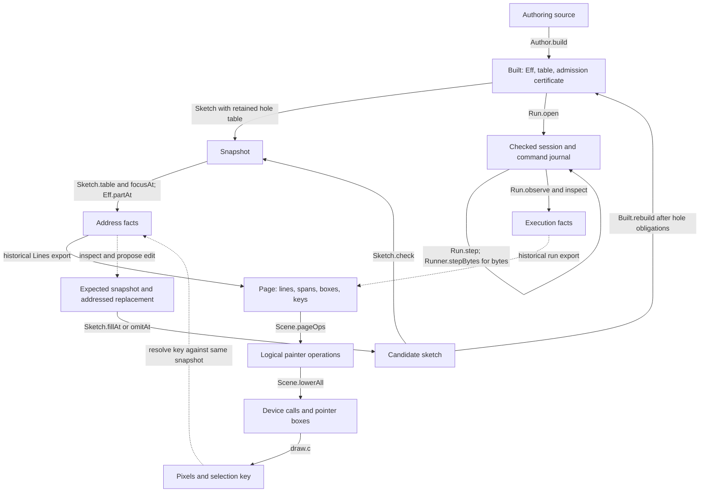

# Live rendering: connect the existing structures before adding tooling

The existing structures support one stored program and several views.
Three small shared functions can connect editing, checking, and refreshed views.
The connection needs source identity, retained hole data, and explicit evidence labels.

Status: research note, not authority.
Base: `979be0ad8b86f356dc83aa7f6bdab46228684a32`.
Branch: `codex/live-rendering-scout`.
The changed paths are this note and `docs/research/2026-10-08-live-rendering-scout-evidence/`.
The primary checkout supplies ignored rendering research and remains read only.
The cloud organization seat owns broader organization.

Here, a **snapshot** means an exact program with its application tables, hole table, and source identity.
A **view packet** means display data and its references to that snapshot.
These are proposed records beside `Eff`, not another program representation.

## Question and finishing criteria

Connect the existing rendering probes to the landed authoring and execution structures.
Finish with declaration names, an integration map, bounded controls, three shared functions, and retained evidence.
Add no production module, theorem, dependency, or general transport tool.

## What was read or run

| Item | Evidence kind | Scope |
| --- | --- | --- |
| `AGENTS.md`, `docs/STATE.md`, and named core authorities | reading | Ownership, writing, judgments, R14, and host session contracts |
| `git:c181a009:docs/research/2026-10-08-s1-overwatch-receipt.md` | historical checked receipt | Root focus attribution, part context, and slot reader gaps |
| `docs/research/2026-10-08-live-authoring.md` | reading of a proposed design and finite probe receipt | Structural table splice and proposed edit session |
| `docs/research/2026-10-08-host-authoring-boundary.md` | historical finite probe receipt | Definition blocks previously hid host calls; landed `Parts` now supplies those readers |
| `docs/research/2026-10-07-session-api-design.md` | reading of a ruled interface and unchecked sketch | The proposed `Live` spelling and its slices |
| Four native rendering notes of October 6 and 7 | historical finite probe receipts | Outline, graph, source, TypeScript, schema, selection, and lowering |
| `Scene.lean` and `lower-run.txt` in the native rendering probe | source reading and retained historical output | Probe laws, device calls, pointer boxes, and finite C comparisons |
| `BoundaryProbe.lean` in this note's evidence directory | finite evaluation, reproduced here | Address reuse and retained hole data |

The evidence directory retains exact copies of the four rendering notes, `Scene.lean`, and `lower-run.txt`.
`source-manifest.json` records their original paths, hashes, and observed primary head.
The same manifest pins the landed declarations inspected below.
The completed evidence check confirms every retained snapshot matches its recorded hash.
The scoped language check reports no findings.
`live-declaration-search.txt` retains the declaration and alias search results.
Historical rendering comparisons were not rerun.

## Integration map

Solid arrows name landed functions or the historical rendering probe.
Dashed arrows name proposed adapter connections.

The probe's printed TypeScript page is a display of text.
`ModuleEmission.readModule`, in `src/Effect4/Laws/Api/ModuleReadable.lean`, instead reads emitted syntax declarations back to the original program.
Its premises include a lawful table and `moduleReadable` or `blockReadable`.
It establishes no pixel, source span, MCP transport, or general TypeScript execution claim.

## Findings

### 1. One location already has most of its data

Evidence: source reading at the pinned base.

| Owner | Landed declarations | Consumer and limit |
| --- | --- | --- |
| `src/Effect4/Program/Refs.lean` | `Node.at_`, `Node.replaceAt` | All structural edits; paths name structural children, not source offsets |
| `src/Effect4/Program/Typing/Parts.lean` | `Part`, `Eff.partAt`, `programFocusAt`, `programCallAt`, `programCalls` | A block body uses its declared request and enclosing definition signature |
| `src/Effect4/Program/Sketch.lean` | `Sketch`, `Sketch.check`, `focusAt`, `sigAt`, `tableEntry`, `table`, `fillAt`, `omitAt` | Root module checking differs from structural checking inside a part |
| `src/Effect4/Program/Typing/Table.lean` | `Table.Entry`, `Node.extSlotTerm`, `Node.extSlotEnv` | Missing environment, absent program result, and located refusal remain distinct |
| `src/Effect4/Program/Typing/Annotate.lean` | `annotate` | One structural traversal; no block-wide incremental cache follows from its interface |
| `src/Effect4/Api/Author.lean` | `Built.rebuild` | Whole candidate admission at the retained table; result type may change |

`Sketch.check_fill_focusAt`, in `src/Effect4/Laws/Program/Sketch.lean`, keeps the sketch's checked type under its stated filling premises.
It requires the filling to pass the structural checker at `Sketch.sigAt`, in the focus environment, at exactly the focus type.
The root filling premise therefore excludes a definition block.
The theorem establishes neither unchanged behavior nor progress.

`checkModule_replace_programFocusAt`, in `src/Effect4/Laws/Program/Typing/Parts.lean`, supplies replacement inside a resolved module part.
The historical overwatch receipt retains its scoped axiom evidence for the changed law modules.
This scout does not reproduce that audit or strengthen its scope.

The query's `slotsAt`, in `tools/Tools/Query.lean`, still reconstructs the empty application signature independently.
The same file's root focus still names structural `focusAt_typed` for a module root.
The overwatch receipt already retains both boundaries.
A common resolved location removes repeated context reconstruction and wrong proof attribution.

### 2. An address needs its snapshot

Evidence: thirteen finite guards in this scout.

The same path `[0]` names a leaf in one checked program and a suspension in another.
Both filling requests accept that address and keep its local type.
The request's `id` is returned unchanged, including `old-revision`.
It is a correlation value, not a revision check.

`Tools.Query.Request` carries program bytes, a path, and replacement bytes.
It carries neither application tables nor a retained hole table.
`tools/Drivers/Query.lean` explicitly retains no state between lines.
This stateless interface makes no stale revision claim.
A stateful MCP or window adapter must compare the expected snapshot before committing an edit.

An omitted sketch checks with its hole table.
Its program bytes alone fail the fresh query's check.
The omission answer reports `needsHoleTable` and a hole count, but it does not transport that table.
Keep application row positions and hole rows with the program across the next update.

### 3. Rendering keys are useful display data

Evidence: retained historical probes and current source reading.

The native probe links a node key across outlines, graphs, source text, and printed text.
`Lines.lean` uses keys such as `n:<program>:<path>` and separate keys for rows, calls, fibers, and source lines.
`Scene.Page` stores lines, spans, boxes, and references.
`Scene.Op` lowers through `Scene.lowerAll` to `Scene.Dev`.
Only pointer boxes retain a key in the lowered stream.
Ordinary fills carry no object identity.

The origin probe copies marked authoring definitions and reads paths through deliberate refusals.
Its source places carry file coordinates, without revision identity.
Its printed spans compare prints after hole omission.
Those joins remain finite probe results, not landed source correspondence theorems.

The retained lowering output reports stream, image, and pointer comparisons on its named finite fragment.
Its five probe laws include `lowerAll_append` and `pick_append`.
Those laws are outside the semantics registry and the library axiom gate.
Text shaping remains the external painter's work.
MCP transmission or application display does not apply a Lean proof to a returned selection.

### 4. A table splice does not determine the repaint set

Evidence: source reading; the rendering conclusion remains open.

The splice claim remains proposed at this base.
The primary seat's ongoing splice work is outside this scout's scope.

Even a proved table splice would not establish subtree-only repaint for the current page layout.
`Scene.lineOps` sets vertical position from the line's rank.
An inserted suspension shifts every later line, despite keeping its checked type.
`Scene.gutterCols`, `labelCols`, `pageSize`, and graph extent also read the whole page.
Selection bands depend on keys related across pages.

`lowerAll_append` distributes lowering over an already fixed operation list.
It says nothing about which operations `pageOps` changes after an edit.
Separate changed address facts from changed geometry and changed device calls.
Start by refreshing the affected page; retain full-page comparison as the control for later incremental rendering.

### 5. Execution control exists under the current names

Evidence: exact declaration and alias search across `src` and `tools`, restricted to `*.lean`.

No declaration or alias provides the session's proposed `Live.open`, `start`, `feed`, or `view` at this base.
The search finds the unrelated membership predicate `Typed.Live`.
This is a public spelling gap, not absent execution functionality.
The session design labels its proposed interface an unchecked sketch.
Row 326 rules that interface; `docs/STATE.md` describes its face ahead of those implementations.

| Functionality | Landed owner and declarations |
| --- | --- |
| Open with retained admission evidence | `Run.open`, `src/Effect4/Run/Basic.lean` |
| Refusing external start | `HostSession.start`, `src/Effect4/Api/HostSession.lean` |
| Feed recorded control and reply work | `Run.step`, `play`, `control`, `receive`, `answer`, and `Api.Runner.step` |
| Read first-order execution facts | `Run.observe`; `Run.inspect` separately retains the machine |
| Cross a byte interface | `Runner.stepBytes`, `replayBytes`, `observeBytes`, `outstandingBytes`, `src/Effect4/Api/RunnerBytes.lean` |
| Resolve checked calls | `HostSession.callTable`, `instanceAt`, `Session.callInstance`, through `programCalls` and `programCallAt` |

The checked call table reads `program.expandRefs`.
Display paths into stored syntax must not silently become paths into expanded syntax.
No general address correspondence between those forms is established by this scout.
Host commands already check session identity, call order, and stale calls.
Those checks do not supply edit revision checks or transfer an existing run to an edited program.

## Three proposed shared functions

These are interface proposals, not production declarations or new theorem obligations.
Their data are records over existing sorts.
Their arrows compute data or return located refusal; none adds program syntax.

| Function | Small shared structure | Real consumers |
| --- | --- | --- |
| `inspect(snapshot, path)` | Snapshot identity plus resolved root-or-part context, node, environment, signature, slots, checker answer, and applicable evidence scope | Query focus and slots; source, outline, and graph selections; filling checks |
| `apply(snapshot, expected, edit)` | Exact old/new identities, candidate sketch with retained tables, structural failure or located check refusal, and refreshed address facts | Query fill/omit; window edits; a future MCP adapter |
| `present(snapshot, facts, readerState)` | Existing page rows, keys, references, optional origin/span associations, and separate proof/display evidence labels | C viewer, terminal export, MCP view, and regression comparisons |

Compare exact content or a controlled revision identity when accepting an edit.
A digest can index cached content; digest equality alone supplies no proved program equality.
A display key resolves through `inspect` against the same snapshot before an operation uses it.
A refused edit retains the prior snapshot and reports the candidate's refusal separately.
A sketch may display checked facts modulo holes without carrying executable admission.
Execution opens a newly admitted `Built`; migration of an existing run remains open.

## What the organization seat should retain

Retain `Eff` as the sole stored program syntax and the existing generated children and folds.
Retain `Part` context across focus, slots, tables, and filling checks.
Retain root module evidence separately from structural part evidence.
Retain optional facts, located refusals, and checked facts modulo holes as distinct states.
Retain exact application tables, hole tables, source identities, and old/new edit identities.
Retain the historical render probe's keys, references, hit boxes, and retained comparisons.
Retain codegen reconstruction separately from display correspondence and host execution evidence.
Retain the existing command journal and explicit reply application choices.

Do not let general organization choose rendering geometry, add another program representation, or silently ratify the open picture semantics.
The rendering notes leave picture laws outside the ten semantic concepts.
Any later theorem needs the project's five-field placement and a real consumer before proof work starts.

## Commands, results, and limits

| Command | Result |
| --- | --- |
| `git switch -c codex/live-rendering-scout 979be0ad8b86f356dc83aa7f6bdab46228684a32` | The prior review branch remains intact |
| `LEAN_NUM_THREADS=3 lake build Tools.Query` | Exit zero; 310 jobs |
| `LEAN_NUM_THREADS=3 lake env lean -DwarningAsError=true docs/research/2026-10-08-live-rendering-scout-evidence/BoundaryProbe.lean` | Exit zero; 13 finite guards |
| `python3 docs/research/2026-10-08-live-rendering-scout-evidence/capture.py` | 24 source pins; six exact retained artifacts |
| `lake env lean --version` | Lean 4.33.1; compiler commit `819816b2e0a3bf405af45ae5c7af2491d8f5bee6` |

The first probe draft had syntax errors; the corrected draft passes.
Those draft failures establish no refusal property.
No new theorem lands, and no scoped or whole-library axiom gate runs here.
The only reproduced behavioral evidence is the finite probe above.
No window, C painter, MCP transport, TypeScript compiler, or edited-program execution runs here.
The source review establishes the current connections and gaps; the three shared functions remain proposed.
