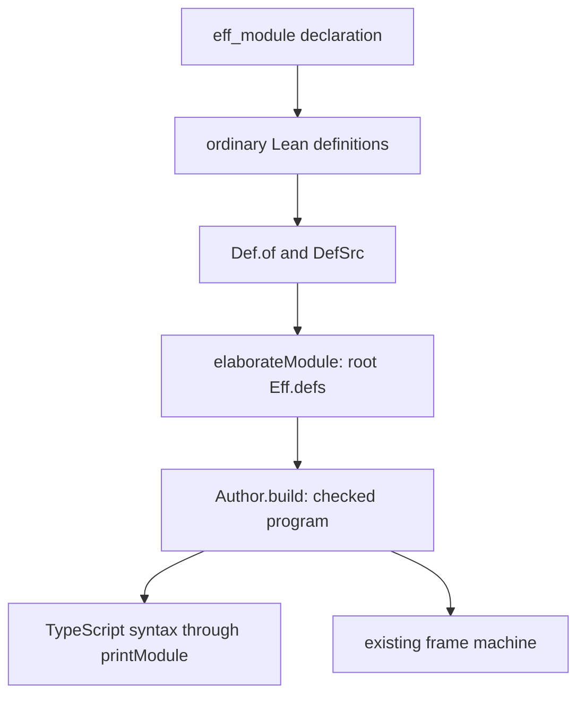

# Declarative module authoring

Status: implementation design. Base: `f0ca3dcb30741622ea08341ae8ebc8499b1f4291`.

## The change

An author declares each operation once in `eff_module`.
The command generates an authoring record, its constructor, its invocations and its definition list.
The author chooses an instance name once and installs that instance in an authored module.

This extends `Def.of` in `src/Effect4/Program/Authoring/Defs.lean`.
It uses `DefSrc`, `Module.defs` and `elaborateModule` in `src/Effect4/Program/Authoring.lean`.
The program IR remains `Eff` in `src/Effect4/Program/Eff.lean`.

## Findings at the base

`Params.uncurry` supplies `unit` for a missing argument and discards surplus arguments.
`Def.of` does not compare the parameter count with the operation's arity.
A finite probe shows program admission accepting a definition whose body receives an invented argument.
Another shows program admission accepting a zero-argument operation whose declaration states a parameter.

`Defined.call` resolves its name against the module's definition list.
A finite probe dispatches to another body installed under that name.
The authoring record reduces accidental mismatches by constructing invocations and their list together.
It does not make names identify bodies independently of the enclosing module.

Queue repeats its operation parameters and declared columns, then assembles its list by hand.
Each call repeats the message type and an optional suffix.
The new constructor captures the specialization and name once.

## Authoring contract

```lean
eff_module Definitions (A : Ty) where
  take (queue : handleTy A) : A := Queue.take A queue;
  offer (queue : handleTy A) (message : A) : .bool := Queue.offer A queue message
```

Semicolons separate operation declarations.
`Definitions.make "numbers" .nat` constructs one instance.
Its `take` and `offer` fields are ordinary curried authoring functions.
Its `defs` field holds the matching source definitions in declaration order.
Its `install` method adds them to an existing module.
Its `module` method supplies them beside a main program.

| Input | Meaning |
| --- | --- |
| Group binders | Lean construction parameters, fixed when the instance is made |
| Operation binders | Named request parameters, each with an explicit `Ty` expression |
| Answer | The definition's declared answer type |
| `error` | The declared error type, defaulting to `.never` |
| `requires` | The declared service requirements, defaulting to `[]` |
| Operation body | An existing authoring expression, checked against the generated curried type |
| Instance name | The explicit prefix shared by the instance's operation names |

`Name.definition.operation` constructs one `Defined` value under an exact runtime spelling.
Existing Queue entry points use this generated declaration to retain their old names.
Their parameter metadata and bodies have one authoring declaration.

The low-level `Def.of` checks parameter count against `Params.arity` through a default Lean proof.
The macro also constructs its metadata and argument function from the same binders.
Duplicate names and collisions with generated members are command errors.
Runtime parameters accept terms of the program, not Lean functions or program bodies.

## Composition and names

Installation retains existing rows, services, layers, definitions and the main program.
It prepends definitions in their written order.
Existing duplicate-name refusal remains active.
An author installs dependencies explicitly, using their instances' `install` methods.
The command neither selects service implementations nor discards duplicate definitions.

`Package` remains a host library's rows and services, as decisions row 328 requires.
Two specializations use distinct instance names.
Automatic specialization names need a canonical identity policy and stay outside this slice.

The optional `using self` header supplies a record of named invocations before building bodies.
An operation uses `self.other` for a forward invocation or `self.operation` for recursion.
These invocations resolve through the existing definition scope.

`Def.qualifiedName` in `src/Effect4/Program/Authoring/Defs.lean` gives generated operations printable TypeScript binding names.
It retains ASCII letters and digits, escapes other UTF-8 bytes, and separates the two components with `$`.
Finite controls exercise punctuation, Unicode and ambiguous-looking names.

## Evidence and proof placement



`Author.build` lives in `src/Effect4/Api/Author.lean`.
The command adds authoring functions, not a new program representation or admission certificate.
The ordinary body checker checks each declared row.

| Proof role | Existing evidence | Scope |
| --- | --- | --- |
| Invocation typing | `invoke_hasTy`, `src/Effect4/Laws/Program/Definitions.lean` | A block's signature, the declaration's request and row |
| Conservative extension | `defs_conservative`, the same file | Programs that invoke no definition |
| Target reconstruction | `readModule_printModule_defs`, `src/Effect4/Laws/Codegen/Module.lean` | The theorem's readability, names and requirement premises |
| Authoring plumbing | Focused finite checks in the new authoring batteries | Generated declarations, invocations, installation and refusals |
| Module execution | Queue and Semaphore finite scenarios | Each recorded program, fuel and schedule |

No new semantic theorem is assigned by this slice.
The existing claims retain their concepts and requirements in `tools/Tools/SemanticsRegistry.lean`.
The general inlining observation remains G7 under decisions row 329.
Generic stored definitions remain G8 under decisions row 328.
This command does not establish scheduling laws, liveness or the host execution boundary.
Queue and Semaphore request types fail the existing `DefDecl.readable` predicate.
Their modules print to TypeScript, but `Api.readModule` refuses the definition headers.
The older Queue definitions have the same refusal. This slice retains that reader boundary.

## Finishing checks

1. Reject missing and surplus parameter declarations at `Def.of` construction.
2. Exercise zero, one and several runtime parameters through the command.
3. Check answer, error and requirement declarations through ordinary program admission.
4. Check names, duplicate binders, generated-member collisions and declaration order.
5. Run two Queue specializations in one module.
6. Run Semaphore's immediate and waiting cases through generated invocations.
7. Check explicit dependency installation and the missing-dependency refusal.
8. Compare existing Queue programs before and after the compatibility migration.
9. Build the changed modules and direct dependents with `LEAN_NUM_THREADS=3`.
10. Record exact commands, results and remaining obligations in the receipt.

## Later mechanization

The declaration command can accept generated entries without changing the stored program language.
Record views, step laws and module contracts remain owned by the module procedure.
Its plan is `docs/research/2026-10-05-claude-lead/module-factory-plan.md`.
Higher-order forms remain expanded until their own representation is ruled.
Dependency deduplication requires an explicit identity and content rule before implementation.
