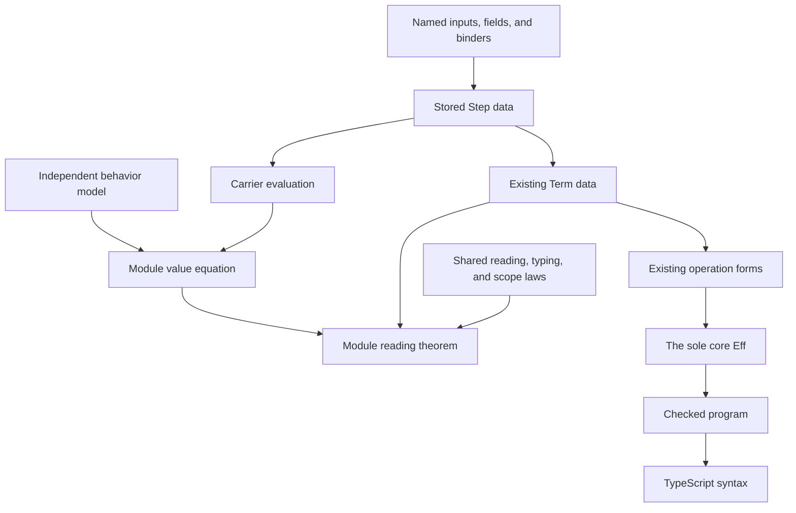

# The module-authoring foundation

A module author declares the inputs once, writes typed steps, and supplies an independent behavior model.
Shared laws connect each step to the existing term language.

## Named inputs and list operations

This example captures `amount` inside a map without naming a position or shifting an input.

```lean
import Effect4

open Effect4.Program Effect4.Program.Authoring Effect4.Modules

step_context% BumpInputs (amount : .nat, values : .list .nat)

def bump := step_inputs% BumpInputs =>
  Step.Lists.map values (item_step% values with value => .add value amount)

def bumpSource (amount values : TermSrc) : TermSrc :=
  bump.term (input_sources% (BumpInputs) {values := values, amount := amount})
```

`step_context%` owns the names and their types.
Both `step_inputs%` and `input_sources%` read that declaration.
The caller may reorder named source arguments.
Unknown, repeated, missing, and shadowed names refuse during Lean elaboration.

`fold_step%` names the accumulator and item when a shared list operation does not fit.
Nested bodies may capture the outer inputs and locally derived steps.

```lean
def sumBumped := step_inputs% BumpInputs =>
  fold_step% values from total := .nat 0 with value =>
    .add total (.add value amount)
```

The implementation lives in `src/Effect4/Step/Elab/Inputs.lean`.
`Test/Program/StepInputs.lean` checks reordering, captures, nested folds, and refused names.
The elaborator stores ordinary indexed data.
It stores no Lean expression, function, or runtime object.
No exact inverse from stored data to the original author text is claimed.

## Schemas, records, and result shapes

A `FieldRef` names a field through `field_ref%`.
The schema and field name determine its type; the expected result checks it.
`record_step%` reads the declared required-field schema from the expected result type.
Its author supplies each required field once, in any order.
It refuses unknown fields, missing fields, duplicate fields, optional fields, and unreadable schema expressions.
The separate Step checks retain canonical name order, type formation, and normality.

`Semaphore.Data.waiter` in `src/Effect4/Library/Semaphore/Data.lean` is a concrete consumer:

```lean
def waiter {Γ : List Ty} (id : Step Γ idTy) (need : Step Γ .nat)
    (hint : Step Γ idTy) (stamp : Step Γ .nat) : Step Γ waiterTy :=
  record_step% { id := id, need := need, hint := hint, stamp := stamp }
```

One tuple constructor accepts a typed list of items.
The two-item and three-item builders reuse it and retain their existing result types and flat encodings.
Named wrapper reply records remain the next operation-interface slice under row 331.

## Shared behavior and the remaining author work

| Shared operation | Its carrier value | Concrete use |
| --- | --- | --- |
| `Step.Lists.map` | `List.map` | Queue hint renewal and Pool item updates |
| `Step.Lists.filterMap` | Select and map in one fold | Pool leased-item updates |
| `Step.Lists.filter`, `removeBy` | Retain or remove every matching item | Semaphore, Queue, and Pool withdrawal |
| `Step.Lists.any` | `List.any` | Queue enrolment and Pool outstanding leases |
| `Step.Lists.removeFirst` | A match flag and `List.eraseP` | Latch cleanup with duplicate registrations |
| `Step.Lists.headOr` | First item, or the supplied default | Pool's available stamp |

`Step.getOrElse` consumes an option through the existing native operation.
Its reading law requires both source children to translate and read.
It does not introduce lazy effectful branching.

Each module still proves a value equation between its step and its independent model.
The model names the behavior it specifies; it is not defined from the generated step.
A future model-to-step derivation may generate this equation with a kernel-checked certificate.
That certificate would establish the derivation, while the model's relation to Effect remains a separate claim.

## The connection to existing proofs and targets



| Claim | Declaration and source | Actual premises and limit |
| --- | --- | --- |
| Term reads the step value | `Step.sound`, `src/Effect4/Laws/Step.lean` | Input readings and canonical records; folds need scope alignment; identity comparison needs `DeferredIdentity` |
| Term has the indexed type | `Step.typed`, same source | Native atom typing, typed inputs and `Step.Facts`; folds need type-scope alignment |
| Untouched fields keep their value | `Step.frame`, same source | A field outside an update spine's writes |
| Translation keeps input scope | `Step.scoped`, `src/Effect4/Laws/Step/Scope.lean` | Scoped caller sources |
| Model transition reads correctly | Each module's `*_agrees` in `src/Effect4/Laws/Library/` | Its independent value equation and unchanged module premises |

Scope and identity requirements come from one structural requirements fold.
Exact encoding, membership, codec admission, allocation, and behavior simulation remain separate claims.
The opaque interpretation supplies no deferred-identity comparison law.
A table's injectivity relates key comparison to the model's request numbers; it does not prove allocation.

Subterm sharing remains open because `Term` has no local binding constructor.
Shared source builders remove repeated authoring work; they do not prove reduced execution cost.
The ruled module form, wrappers, transactions, and pull transformers consume this foundation in later slices.
Row 332 places the library rename and public entry modules after this landing.
A transaction's state observation, dynamic read set, isolation, and work bound each need their named statements.
Neither a pure step law nor a finite host comparison establishes whole-module compatibility across schedules.
