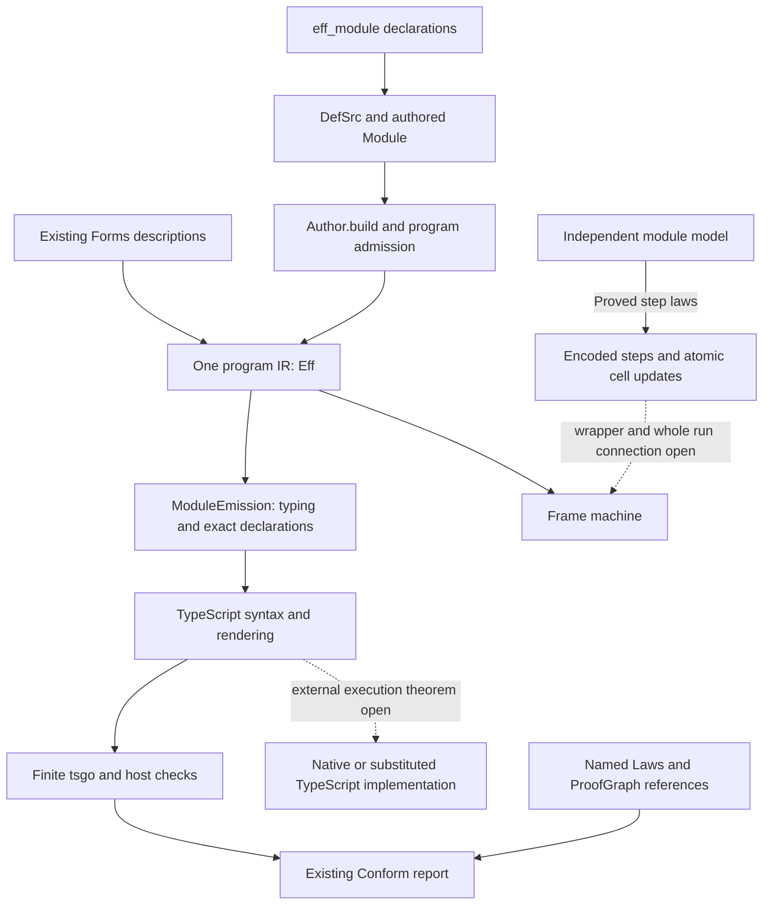

# Module authoring and compatibility exploration

Status: checked exploration, with proposed next slices.
Base: `f0ca3dcb30741622ea08341ae8ebc8499b1f4291`.
Authoring implementation head: `c7e63c9612911ce323df33525122227872a21b27`.
Authoring receipt head: `3f5aadaeb554c2da125eacbe3a8b16a8c4821050`.
This note changes no module contract or decisions row.

## Finding

The authoring and evidence infrastructure supports a repeatable module procedure now.
It does not supply a theorem relating arbitrary TypeScript modules to their generated replacements.
The missing connection includes each waiting wrapper and the scheduling of a whole module.
The procedure can generate repeated declarations while retaining those open obligations.

Semaphore is the next module for this procedure.
Its stored operation declarations already use `eff_module` in `src/Effect4/Modules/Semaphore/Defs.lean`.
Pool follows after its deliberately different profile has an explicit comparison target.
The existing contracts own those choices: `Test/contracts/semaphore.contract.md` and `Test/contracts/pool.contract.md`.

## One authored implementation

This syntax is implemented and checked by the authoring batteries.

```lean
import Effect4.Api.Author
import Effect4.Modules.Semaphore.Defs

open Effect4 Effect4.Program Effect4.Program.Authoring

eff_module Gate where
  tryTake (gate : .refOf Semaphore.cellTy) (count : .nat) : .bool :=
    Semaphore.takeIfAvailable gate count

def gateApi := Gate.make "gate"

def application : Module NativeOp := gateApi.module (eff do
  let gate ← Semaphore.make 2
  gateApi.tryTake gate (nat 1))

def checked := Api.Author.build application
```

The operation body and its declared columns each have one owner.
The command generates names, definitions, invocations and installation.
`Author.build` checks the declarations and the application through the existing checker.
`Api.emitModule` retains the typing and production evidence for the TypeScript declarations.
`Api.printModule` projects the target syntax from that result.
Both functions live in `src/Effect4/Api.lean`.

The command already accepts construction parameters, error columns, service requirements and recursive named invocations.
It does not derive an intended behavior from a function name.
A user states that behavior in the existing module contract and Laws graph.



`Codegen.Forms` remains the owner of recognized forms in `src/Effect4/Codegen/Forms.lean`.
An ordinary user operation needs no new constructor or entry in that table.
It becomes a definition within `Eff`.
The new authoring record is construction machinery; it is not stored program content.

## Existing proof connections

The following inventory records the inspected statements, not an aggregate compatibility grade.

| Connection | Declaration and path | Scope and boundary |
| --- | --- | --- |
| Definition checking | `checkModule_sound`, `checkModule_complete`, `invoke_hasTy`, `defs_conservative`; `src/Effect4/Laws/Program/Definitions.lean` | Declared rows and program typing; no whole-module behavior |
| Semaphore step to its model | `semaphore_steps_agree`; `src/Effect4/Laws/Modules/Semaphore/Steps.lean` | Reply and encoded state; no waiting wrapper or whole walk |
| Pool step to its model | `pool_steps_agree`; `src/Effect4/Laws/Modules/Pool/Steps.lean` | Reply, encoded state and selected waiters; the project's chosen Pool profile |
| Step to the actual cell | `step_updates`, `step_keeps_cell`, `cell_read`; `src/Effect4/Laws/Modules/Store.lean` | The reading and typing premises of one store operation |
| One-step refinement and composition | `Projects`, `Refines`, `projects_compose`, `projects_induces_refines`; `src/Effect4/Laws/Machine/Refinement.lean` | A supplied relation at one labelled step; no automatic module instance |
| Frame machine to reference | `run_eq_ref_table_noPreload`; `src/Effect4/Laws/Program/Table/Agreement.lean` | One program, explicit decisions and sufficient budgets, no preloaded answers; no external Effect runtime |
| Straight transformations | `StraightEq`, `run_agrees_at_bound`; `src/Effect4/Laws/Program/MeaningEq.lean` | Exit and stores on the straight fragment; no waiting or concurrency |
| TypeScript declaration production | `ModuleEmission`; `src/Effect4/Codegen/Checked.lean` | Retained formation, core typing and exact printed declarations; no target execution theorem |
| Definition reconstruction | `readModule_printModule_defs`; `src/Effect4/Laws/Codegen/Module.lean` | Readable requests and the stated names and requirement premises |
| Reported proof references | `ProofRef.validate`; `tools/ProofGraph/Proof.lean` | The named theorem, frozen proposition, universes and transitive axioms |

The whole-operation connections remain proposed in the semantics registry.
Their declarations and open parts are derived in `generated/semantics.md`.

| Existing obligation | Placement | Missing connection and consumer |
| --- | --- | --- |
| `semaphore-expansion-agrees` | `translation-simulation`, R10 | The wrapper's run and the walk across visits; a Semaphore client's behavior law |
| `pool-expansion-agrees` | `translation-simulation`, R10 | Borrower and closer wrappers, wake across helpers and protected lease; a Pool client's behavior law |
| `pool-close-waits` | `scope-lifetime-finalization`, R11 | Outstanding returns and finalizer executions across a whole run |
| G7, stored invocation to expansion | Procedures plan, decisions rows 328 and 329 | One named observation across the call and its expansion |
| External TypeScript execution | R8 and DI-49; `docs/core/system-map.md` and `docs/core/lcnf-route.md` | The target execution boundary, beyond production or reconstruction of syntax |

No theorem or planned goal is added by this exploration.
A future obligation keeps the existing placement and names its observation, fragment, hypotheses and consumer before proof work starts.
Step agreement supplies none of the omitted waiting, cleanup or progress arguments.

## A finite native comparison

The retained experiment compares generated implementations with native Effect modules.
It checks the same generated cases on the Lean machine at fuel 1000 first.
It then runs their TypeScript declarations and the native calls against the installed pin.
The TypeScript compiler is tsgo `7.0.0-dev.20260629.1`; Effect is `4.0.0-rc.112`.

| Input and observation | Generated implementation | Native Effect | Evidence |
| --- | --- | --- | --- |
| Semaphore: total 2, take 1, release 1, try 2, try 1 | `[1, 2, true, false]` | `[1, 2, true, false]` | Tested agreement on these immediate answers |
| Semaphore: total 2, take 1, release 3 | `[1, 2]` | `[1, 4]` | Tested counterexample outside the public law's balanced-release premise |
| Pool: size 1, acquisition fails with 77; observe constructor exit | Failure 77 | Success with the marker `made` | Tested difference in construction failure behavior |

The measured results live in `docs/research/2026-10-08-module-compatibility-results.json`.
The native Pool stores the failed acquisition result inside an item.
Returning the pool does not assert that later borrowing succeeds.

These differences already belong to the selected contracts.
Semaphore uses natural subtraction, while the pin subtracts without clamping.
The pinned implementation is `SemaphoreImpl.releaseUnsafe`, `vendor/effect-4.0.0-rc.112/src/Semaphore.ts:257-269`.
Pool acquires eagerly in `acquireAll`, `src/Effect4/Modules/Pool/Ops.lean`.
The pin captures acquisition exits in `allocate`, `vendor/effect-4.0.0-rc.112/src/Pool.ts:877-920`.
Its constructor returns the pool after starting background work at lines 383-397 of that pinned file.

The current truth scenarios run expanded project implementations on Effect primitives.
Those scenarios do not compare them with native Pool or Semaphore.
The two kinds of finite check remain distinct in the report.

## Reporting without a second status system

Use `Conform.Report` in `tools/Conform/Core/Report.lean`.
Each row keeps its subject, outcome, evidence method, message and detailed observation.
The expected identities are declared before reading any measured result.
Missing results remain unresolved, duplicates refuse, and unexpected identities fail the report's coverage check.

`Conform.Evidence` in `tools/Conform/Core/Evidence.lean` supplies the existing evidence vocabulary.
Its methods are not a total order across unrelated claims.
A module therefore gets separate rows for typing, step agreement, target production, finite execution and whole-module simulation.
A tested difference remains visible beside a proved property of the project's own model.
A single percentage would hide the difference in scope.

The exploratory report includes its open proof connections and deliberately returns exit 2.
Its output accounts for all five declared subjects.
It records one finite agreement, two counterexamples and two unresolved connections.
Those numbers describe this experiment, not the module's API coverage.
No runtime-census row changes.

A later report producer reads proof status from `ProofGraph` and the existing semantics registry.
It must not create another manually maintained proof-status table.
Source export inventory, profile exclusions and observed behavior need distinct subjects.
Every omitted native API remains explicit in that inventory.

## The clean next slices

1. Keep the current authoring declaration as the only owner of the parameters, columns and body.
2. Generate readable TypeScript aliases from that declaration's parameter metadata.
3. Reuse the existing native comparisons and Conform report for each declared profile.
4. Land the already designed schedule simulation and Semaphore's whole-operation connection.
5. Add Pool after selecting the exact compatibility profile and retaining its signed differences.

Friendly target aliases can adapt the existing tuple request to ordinary function arguments.
They must derive their argument types from the same declaration and refuse colliding exports.
They change no cell representation or operation body.
The current printer exports the generated operation constants; it does not produce Effect's overloaded, pipeable public interface.

There are authoring limits to retain during that work.
`eff_module` reserves generated member names, including `make`, `install` and `module`.
A general API generator needs an explicit source-name mapping or a separate factory namespace before copying native export names mechanically.
The current constructors also use positive literal arguments fixed where a program is written.

`Pool.make` accepts an acquisition program, and `Pool.use` accepts a body builder.
They therefore remain expanded under decisions row 328.
The same applies to Semaphore's protected forms.
Construction-time specialization can capture a fixed body today, but it changes the higher-order calling interface.
It does not supply a runtime closure representation.

Arbitrary TypeScript extraction also needs rules for object state, callbacks, scopes and posted tasks.
Parsing a native class does not establish those rules or a simulation.
Start with generated declarations over the existing core operations, then add extraction rules for named supported source forms.

## Two implementation routes

The default route generates TypeScript from the authored body.
The body, its Lean laws and its emitted syntax therefore keep one program identity.
Target typechecking and finite target execution still retain their own evidence.

A substituted implementation calls handwritten or imported TypeScript instead.
That route needs a target binding for an exact definition identity and a stated representation relation.
A native Semaphore object is not the current reference to a modeled Semaphore cell.
Matching operation names and answer types does not connect those representations.

A future target binding should reference the existing declaration instead of copying its parameter and column metadata.
It should reuse `TypeScript.Module` and the existing binding-origin checks.
It should refuse unknown identities, duplicate bindings and missing representation adapters.
It carries linkage information; it does not become another program IR or certify behavior by itself.
The generated implementation remains available as the comparison implementation.

Lean-to-OCaml LCNF lowering is a separate route.
Its finite compiler checks do not prove native Effect compatibility.
`docs/core/lcnf-route.md` owns that boundary.

## Simulation decisions already recorded

Decisions row 329 still owns three open choices.
This exploration recommends the existing plan's choices without recording an owner ruling.

| Choice | Recommendation | Consequence |
| --- | --- | --- |
| Scheduling domain | Runs without an operation-count-induced yield | Retain existing machine behavior and state the restriction in each law |
| Independent module model | The spinner model from the simulation note | Prove behavior inclusion; do not claim an identical wake policy |
| Public clients | Clients that use the handle through operations | Retain a client premise until the deferred hidden-handle representation supplies it |

The simulation design is `docs/research/2026-10-08-seat-SIM-design.md`.
Its operation-count controls explain why equal operation results do not establish interchangeable concurrent behavior.
These choices precede the universal scheduling claim, not ordinary authoring or finite comparisons.

## Reproduce the exploration

```sh
LEAN_NUM_THREADS=3 lake build Conform.Core.Report
LEAN_NUM_THREADS=3 lake env lean -DwarningAsError=true --run docs/research/2026-10-08-module-compatibility-probe.lean emit /private/tmp/effect4-module-compatibility/generated
python3 docs/research/2026-10-08-module-compatibility-host.py --modules /Users/pooks/Dev/lean4-effect4/ts/eff/node_modules
LEAN_NUM_THREADS=3 lake env lean -DwarningAsError=true --run docs/research/2026-10-08-module-compatibility-probe.lean report /private/tmp/effect4-module-compatibility/observations.json docs/research/2026-10-08-module-compatibility-results.json
```

The build, emitter and host driver exit zero.
The report command exits 2 because the universal proof connections remain unresolved.
It also retains both measured counterexamples.
The report contains tool pins and digests of the probes, generated files, direct native implementations and local prelude inputs.
The pins also record the program source commit and tracked changes.
Those digests do not certify the entire runtime dependency closure.
The source guard controls reject missing, duplicate and unexpected observations without a passing grade.

The added files are this note, the two probes and the generated experimental report.
The state page links this exploration.
No production module, frozen contract, semantics registry or decisions row changes in this exploration.
The report is bounded and host-only where it compares target execution.
