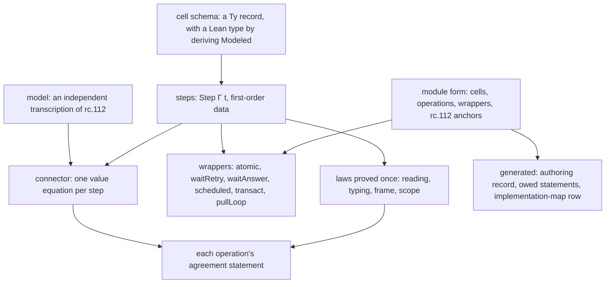
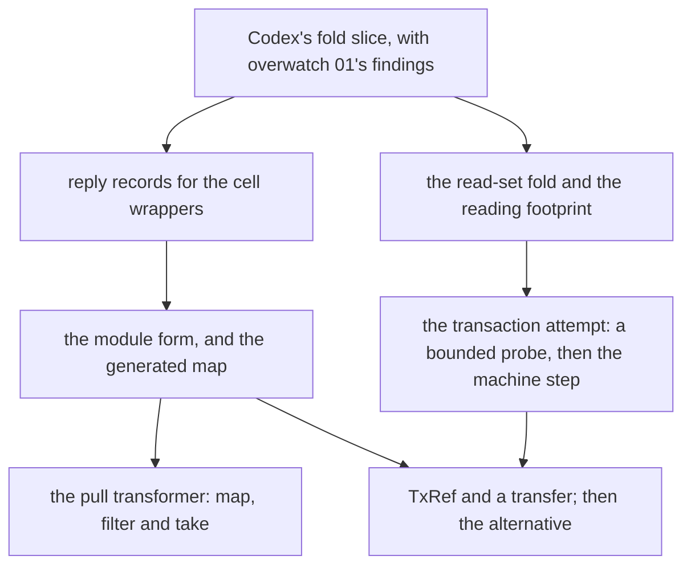

# Module kinds, the module form, and transactions

Status: research note (history, not authority). Base: `663732e3` (`refactor/phase1-phase3`).

On 2026-10-08 the owner asked for three things. Keep the form `module Queue mirrors "Queue.ts"`.
Look into the open transaction work. Keep the modules simple, deep and easy to follow. This note
answers the first two, and it serves the third.

## 1. The one thing to know first

- **One step language serves three kinds of module.** A cell module, a transactional module and a
  pull transformer differ only in the wrapper around their steps (§2).
- **A composed module becomes one data value, the module form** (§4). It mirrors one module of
  rc.112, operation by operation. The `eff_module` authoring record, the wrappers, the owed
  statements and the implementation map's row are generated from it.
- **A transaction is a step over several cells, run in one atomic attempt** (§6). For a step body,
  the conditions of rows 223 and 226 hold by construction. Row 80's relation to rc.112 stays open.
  One machine decision is the owner's (§10).

Three words are new here:

- A **module kind** is the class of a composed module by its state and its wrapper: cell module,
  transactional module or pull transformer.
- The **module form** is the one data value that states a composed module (§4).
- A **reply record** is the record type of a step's answer that one wrapper reads by field name (§5).

"Step" and "wrapper" keep the tree's meanings. A step is `Step Γ t`
(`src/Effect4/Modules/Step.lean`). A wrapper is the effectful program around a step, as in
`src/Effect4/Modules/Waiting.lean`.

## 2. The picture



An author writes four things: the cell schema, the steps, the model and the value equations. The
module form names how they fit. Everything else is generated or proved once. The value equations
stay hand work on purpose: they are where the independent model meets the implementation.

## 3. What a module is made of: the Latch

rc.112 writes a module's synchronous transition as a method whose name ends in `Unsafe`, and its
effect as the method without the suffix. A step is the transition, and a wrapper is the effect.
The Latch class is `vendor/effect-4.0.0-rc.112/src/internal/effect.ts`, lines 5568 to 5651.

| rc.112 member | Lines | Our step | Our wrapper |
| --- | --- | --- | --- |
| `open` | 5612–5616 | `wake true` | atomic, then a scheduled flush when the reply asks |
| `release` | 5617 | `wake false` | the same |
| `scheduleUnsafe`, `flushScheduled` | 5577–5599 | inside `wake`; `flush` | the posted flush |
| `await` | 5624–5640 | `awaitLatch`; `withdraw` for its cleanup | waitRetry |
| `closeUnsafe`, `close` | 5641–5646 | `close` | atomic |
| `isOpen` | 5648–5650 | `isOpen` | atomic |
| `whenOpen` | 5647 | none | `await`, then the caller's body |
| `openUnsafe` | 5618–5623 | `wake true`, then `flush` | atomic with inline delivery: not modelled |

The analogy has one exception. `openUnsafe` resumes its waiters inline (`flushWaiters`), while
`open` schedules them. So `openUnsafe` is a different wrapper, not a different step. The map of
§8 records such a row as a wrapper the tree does not have.

## 4. The module form

The owner chose the form `module Queue mirrors "Queue.ts"`. A sketch of the Latch and the Queue:

```lean
module Latch mirrors "Latch.ts" where
  cell := Latch.cellRecord
  make (isOpen : .bool) := Data.initial                        -- makeUnsafe, make
  op «open» : .bool := scheduled (Data.wake true) (flush := Data.flush)
  op release : .bool := scheduled (Data.wake false) (flush := Data.flush)
  op close : .bool := atomic Data.close
  op isOpen : .bool := atomic Data.isOpen
  op await : .unit := waitRetry (attempt := Data.awaitLatch) (withdraw := Data.withdraw)

module Queue (A : Ty) mirrors "Queue.ts" where
  cell := Queue.cellRecord A
  make (capacity : Nat) := Data.empty capacity
  op take : A := waitRetry (attempt := Data.take) (withdraw := Data.withdrawTake)
  op offer (message : A) : .bool := waitAnswer (attempt := Data.offer) (withdraw := Data.withdrawOffer)
  op poll : .option A := atomic Data.poll
  op size : .nat := atomic Data.size
```

Each operation carries its rc.112 anchors, by file and member, as `AGENTS.md` requires. The form
generates four things:

1. The authoring record: today's `eff_module` output (`src/Effect4/Program/Authoring/Module.lean`), with
   its invocations, definitions and installation.
2. The wrapper terms, from the wrapper's name and the step's reply record.
3. The list of owed statements for each operation: its agreement, its typing, its scope, and its
   wrapper's law. Each item names its claim, so `#plan_status` shows what is open.
4. One row of the implementation map (§8).

The form checks what a reader would otherwise check by eye:

- each step's reply type is its wrapper's reply record;
- each step passes `normal` and `canonical`;
- each operation names an rc.112 member that exists in the vendored source;
- a wrapper the tree does not have refuses, with the member's name.

## 5. Wrappers and their reply records

Today each module invents its reply layout, and its wrapper reads it by position: Queue's `take`
reads `tupleAt reply 0`, `1` and `2` (`src/Effect4/Modules/Queue/Ops.lean`). A reply record names
the fields once for each wrapper. The wrapper then reads them by name, and its law is proved once,
for every step whose reply has that record.

| Wrapper | Reply record | Users, landed or planned | Law, proved once |
| --- | --- | --- | --- |
| atomic | `result`, and the requests to resolve | Queue's `poll` and `size`; the Latch's `close` and `isOpen` | one atomic step, then the posts in order |
| waitRetry | `result : option`, the requests to resolve, the requests to wake | Queue's `take`; Semaphore's `take`; Pool's `get`; the Latch's `await` | rows 221 and 222: the wait and its withdrawal |
| waitAnswer | the same, and the wake carries the answer | Queue's `offer` | row 240 |
| scheduled | `result`, and whether to post the flush | the Latch's `open` and `release` | one flush per batch (rc.112's `scheduleUnsafe`) |
| protectedBy | none: it wraps the caller's body | Semaphore's `withPermits`; Pool's `use` | row 276, point 1 |
| transact | the outcome, the cells' next values, the requests to wake | none yet (§6) | the attempt and its retry |
| pullLoop | emit a chunk, pull again, or end | none yet (§7) | the loop over the upstream |

Each law here is concept `translation-simulation` or `reactive-scheduling`, requirement R10 or
R12. None of them is placed yet. Each one is placed in the slice that proves it (§9).

## 6. Transactions

### 6.1 What exists

No transaction code exists in the tree. The design work does:

- **Ruled 2026-10-05.** Row 223 fixes the atomic body. Row 224 fixes the alternative: Harris's rule,
  on retry only. Row 226 fixes the work limits: a proved embedded budget, or a full driver
  suspension.
- **Open.** Row 80 holds the relation to rc.112 and the erasure of versions. Row 84 holds the
  embedded budget's connector.
- **Proposed claims** in `tools/Tools/SemanticsRegistry.lean`: `atomic-attempt-isolation`,
  `atomic-attempt-agreement` with `tx-choice-rollback-union`, `embedded-budget-sufficient` and
  `wait-registration-no-gap`.
- **The note of 2026-10-05** (`docs/research/2026-10-05-claude-lead/transactions-and-clock.md`). Its
  F5 gives one wrapper for a queue and a transaction, in a finite model. Its F8 says the
  reference meaning is one atomic step, and the buffer and versions belong to the OCaml route's
  lowering. Its
  proposal 5 asked for this design note after the Queue and Semaphore.
- **The finite model** `docs/research/2026-10-05-claude-lead/tx-probes/TxModel.lean`, with
  `queueTrace`, `transferTrace`, `eitherTrace` and the red control `lostWakeWhenSplit`.

### 6.2 How rc.112 runs a transaction

The runtime is `vendor/effect-4.0.0-rc.112/src/Effect.ts`, lines 24205 to 24400.

- `tx` (24271–24311): a nested call reuses the outer state, so nesting is flat. The outer call
  runs the body interruptibly, inside `uninterruptibleMask`, in a loop.
- Each access of a `TxRef` enters the journal with the cell's version
  (`vendor/effect-4.0.0-rc.112/src/TxRef.ts`, `modify` from line 166). A read is a `modify` that
  writes the same value (line 368).
- The body can yield, so another fiber can commit during it. The loop runs the body again when a
  version moved (`isTransactionConsistent`, 24313).
- A success commits: each changed cell gets a new version and value. Then every waiter of every
  journal cell is posted (`commitTransaction`, 24343).
- `txRetry` (24397) sets a flag and interrupts the body. The loop then registers the request on
  every journal cell (`awaitPendingTransaction`, 24322), and it runs again on a wake.

The 2026-10-05 note's probes show two defects of the pin, both repaired in 4.0.0 and 4.0.1. TX1:
the registration checks no version, so a commit during the attempt is lost and the request waits for
ever. TX2: a commit
that only read a cell wakes that cell's waiters.

### 6.3 The design: a transaction body is a step

The step language already holds what F5's model asks of a body: a pure function of a snapshot.

- **The body.** A transaction body is a step over its cells' values and its arguments. It
  answers an outcome (`commit r`, `retry` or `fail e`) and, for each cell, its next value as an
  option. `none` means the body did not write the cell.
- **The read set.** A new fold of the step language records the inputs that an evaluation reads,
  in their dynamic order. A branch not taken reads nothing. This is row 223's dynamic order, with
  no static overestimate.
- **The attempt.** One atomic step reads every cell, evaluates the body and applies its outcome.
- **A retry** registers the request on the cells in the read set, in the same atomic step. The
  decision and the registration are one transition (row 221), so TX1 cannot occur.
- **A commit** writes the written cells. It names each request that waits on a written cell, and
  the wrapper posts their wakes after the step (row 238). This is the release's rule, not TX2.
- **Cleanup.** A woken request's next attempt, and its withdrawal on interruption, remove its
  entries from all its cells. Semaphore's `take` does the same with its own entry today.
- **Composition.** Flat nesting is one step built from two. It needs a `let` in the step
  language, which can translate by substitution, since `Term` has no `let`.
- **The alternative** (row 224) is a combinator on outcomes. When the left body retries, its
  writes are dropped by construction, since nothing is written before the commit. The read set
  is the union of both bodies' reads, by the same fold.

So the transaction wrapper is `waitRetry` with an attempt over several cells. This is F5's one
wrapper, now as data with laws.

### 6.4 Why the ruled conditions hold for a step body

| Condition | Source | Why a step body meets it |
| --- | --- | --- |
| no allocation, host effect or reentrant call | row 223 | no constructor of `Step` performs one |
| no general loop | row 223 | the only iteration is `fold`, bounded by its list |
| no recovery from a failure inside the body | row 223 | no constructor catches |
| flat nesting: only the outer attempt commits | row 223 | composition gives one step |
| the commit's notifications finish before any receiver runs | row 223 | the wrapper posts them after the step (row 238) |
| reads and writes in their dynamic order | row 223 | the read-set fold; written cells by their options |
| no step of another fiber inside the attempt | row 80, `atomic-attempt-isolation` | the attempt is one machine step (option A of §10) |
| a sufficient budget for the attempt | row 226 | one step needs one unit (option A of §10) |
| inline completion, observer delivery, a protected-context change, a stored program's call | `docs/core/machine-state.md` §5 | a step performs none of them |

The last row matters most. Section 5 of `docs/core/machine-state.md` asks for an admission
judgment that excludes four routes by which another fiber runs. A step has no constructor for
any of them, so the judgment is the step's type.

### 6.5 Transactional modules reuse cell-module steps

Row 223 says that transition bodies are shared across modules. With steps as data the sharing is
literal. These are candidates, each owed a bounded probe first (proposal 6 of the 2026-10-05
note):

- `TxQueue.take` retries unless Queue's `poll` step answers a message.
- `TxSemaphore.take` retries unless Semaphore's `takeIfAvailable` step takes.
- A transfer between two `TxRef` cells is one step over two cells: row 233's step 6 consumer.
- A take from either of two queues is the alternative of two takes: row 224's consumer.

### 6.6 What stays open

- **Row 80, the relation to rc.112.** Our attempt is the serial reference. The expected relation:
  rc.112 agrees with it on runs where no other fiber commits during an attempt. Row 329's
  "budget-quiet" premise is the candidate condition for bodies in row 223's fragment. No theorem
  states the relation. Elsewhere rc.112 can run the body more times, and TX1 shows a run where the
  pin waits for ever.
- **Versions.** The reference has none. A lowering that runs fibers in parallel owes them, with a
  refinement to the reference (F8).
- **A handle read from a cell inside the attempt.** The body cannot then access that handle's
  cell in the same attempt. The first profile refuses it.
- **Which release's rules.** The design follows 4.0.1: check and register in one step, and wake
  on a write. Under row 253 a migration slice runs when a feature needs it, and this is one.

### 6.7 Placement of the new obligations

| Obligation | Concept and claim | Reach | Not established | Unlocks |
| --- | --- | --- | --- | --- |
| the read set's value: evaluation with the read set answers `eval` | `translation-simulation`, helper of `step-language-sound` | every step and interpretation | a run | the next row |
| the reading footprint: inputs equal on the read set give equal values | `translation-simulation`, a new claim `step-read-footprint` | every step | writes, a run | no lost wake, R12 |
| no lost wake: a commit names every request whose read set it wrote | `reactive-scheduling`, `wait-registration-no-gap` | every transaction body | delivery, liveness | the transact wrapper's law, R12 |
| the alternative drops the left writes and reads both | `translation-simulation`, `tx-choice-rollback-union` | every two bodies | a run | row 224's consumer, R10 |
| the attempt is isolated | `atomic-attempt-isolation` | option A: by the machine's step | rc.112's runs | `atomic-attempt-agreement`, R10 |

The reading footprint is the open obligation of the L2 receipt
(`docs/research/2026-10-08-seat-MODULES-L2-receipt.md`, §7). Transactions are its consumer.

## 7. Pull transformers

rc.112 builds streams from pulls:

- a `Pull` is an effect whose end is a failure `Done` with a leftover
  (`vendor/effect-4.0.0-rc.112/src/Pull.ts`, line 40);
- a `Channel` turns the upstream's pull and a scope into the downstream's pull
  (`vendor/effect-4.0.0-rc.112/src/Channel.ts`, `fromTransform`, line 283);
- a `Stream` is a channel of non-empty chunks with no upstream
  (`vendor/effect-4.0.0-rc.112/src/Stream.ts`, line 122);
- `Channel.fromQueue` is `fromPull(Effect.succeed(Queue.take(queue)))` (`Channel.ts`, line 1204).

The tree's `Stream.Source` (`src/Effect4/Modules/Stream/Source.lean`) is `fromTransform` with no
upstream. Its pull answers `Chunk` or `End` as a value (`pulledTy`,
`src/Effect4/Program/Stream.lean`).

A pull transformer is a state record and one step: `(state, the upstream's answer)` to
`(state, emit a chunk, pull again, or end)`. `map`, `filter`, `take`, `takeWhile`, `drop`, `scan`,
`mapAccum`, `grouped` and `zipWithIndex` are each one step of this shape. The pullLoop wrapper
drives the step, and its law is proved once. The upstream is an argument: a reference to a stored
definition with its captured state. Section 5 of `docs/core/machine-state.md` already proposes
such references.

## 8. The implementation map

The map is a generated table, like `generated/semantics.md`. Its rows come from two inputs:

- the denominator: each exported member of each rc.112 module, read from the vendored source;
- the numerator: the module forms, with their anchors, and the proof graph's statuses.

| Column | Taken from |
| --- | --- |
| rc.112 module and member | `vendor/effect-4.0.0-rc.112/src/<Module>.ts` |
| module kind | the module form |
| our operation, step and wrapper | the module form |
| model, agreement, typing, wrapper law | the proof graph: proved, modulo goals, or open |
| native check | the module's native runner results |
| signed difference | a ruled decisions row, or none |

The modules fall into four groups by kind. Each group's fit is a candidate, not a result.

| Group | rc.112 modules |
| --- | --- |
| cell modules | Latch, Semaphore, Queue, Pool, Deferred, PubSub, PartitionedSemaphore, RcRef, RcMap, ScopedRef, SubscriptionRef, SynchronizedRef, FiberHandle, FiberSet, FiberMap, Cache, ScopedCache |
| transactional modules | TxRef, TxQueue, TxSemaphore, TxDeferred, TxHashMap, TxHashSet, TxChunk, TxPriorityQueue, TxPubSub, TxReentrantLock, TxSubscriptionRef |
| pull transformers | Pull, Channel, Stream, Sink |
| data modules | Array, Chunk, Option, HashMap and the like: Schema's side, not composed modules |

A member that no operation mirrors is a row with an empty numerator. So the map shows coverage
by measurement, and no number in it is written by hand.

## 9. Order



## 10. Decisions for the owner

1. **The transaction attempt (representation).** Option A is a new machine operation: one
   synchronous step over several cells with one pure body. It generalizes `refStep`'s modify rows
   (`src/Effect4/Machine/Stores.lean`) and transcribes the serial meaning of rc.112's `tx`.
   Isolation and the budget then hold by the step's size. Option B composes `Ref` steps under a
   prevented yield, and it owes row 226's connector and the isolation proof. Recommendation: A.
2. **The rules of which release (meaning).** Follow 4.0.1 for transactions, as the first
   migration slice that a feature needs (row 253). The pin's TX1 and TX2 become signed
   differences.
3. **A handle read inside an attempt (domain).** Refuse it in the first profile.
4. **The pull's end (representation).** Keep `End` as a value, and record rc.112's `Done`
   failure as a signed difference. The alternative models `Done` as a failure.
5. **A channel's upstream (representation).** A reference to a stored definition with its
   captured state.

## What this does not establish

This note is a design. It states no theorem, no build result and no host result. The fits in §8
are candidates. The reading of rc.112 cites the vendored source. The probes it cites are finite
evaluations, and they prove nothing about the tree.
