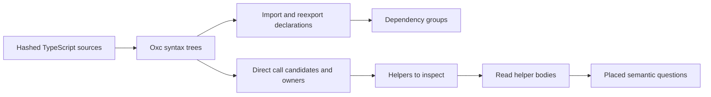

# The module survey: independent scout receipt

The survey supports source navigation and planning, not a behavioral dependency graph.
Its helper frequencies do not rank semantic primitives.
The coordinator fixes the concrete shadowing and source-walk defects found by this review.

Status: read-only review, finite parser fixtures and finite source execution.
Seat base: `cfe68cbcf5af26a890534e2b54acf993c4af603e`.
The review edits no survey tool, owner document or semantics registry.
The matching evidence directory retains inputs, probes and raw outputs.
`inputs.json` records the input paths, hashes, versions and measured report counts.

## What the mechanical survey establishes

The retained report contains 496 modules and 3,796 syntactic non-type import or reexport edges.
It contains 31,150 direct call candidates and 19,127 unresolved call candidates.
These counts come from the coordinator's generated report, checked against its source hashes.
The review verifies all 496 source hashes.

The graph keeps explicit type-only declarations outside its value-edge set.
It retains mixed imports, side-effect imports and value reexports.
Import aliases resolve to their imported spelling.
The call owner is a top declaration or class method.
Calls inside a nested helper retain the outer owner; nested helper targets remain unresolved.
The graph resolves no callback target, dynamic dispatch, local alias, execution order or behavior.
It analyzes no inferred type-only usage or emitted runtime import.
Cycles form groups, rather than an invented dependency order.



## Concrete parser findings and checks

| Fixture | Initial observation | Retained final observation |
| --- | --- | --- |
| Named class expression shadows an import | a class-local call becomes a false imported call | unresolved, as required |
| A switch case shadows an import | a case-local call becomes a false imported call | unresolved, as required |
| Computed method and field keys contain calls | the walk omits executed key expressions | all six key and body sites appear |
| A parameter default precedes a body `var` binding | the imported default call disappears | the imported call appears |
| A comment contains an emoji and an accent | source slicing may differ from parser offsets | the retained expression is exactly `E[k]` |

The coordinator also adds destructured-default and parameter-property controls.
The final survey battery passes nine tests and 23 assertions under Bun 1.4.2.
The independent retained fixtures confirm the four repairs above.

The corpus shape probe finds no current import collision in a named class expression or switch.
It finds no computed method or field key that contains a call.
It finds no default-exported function or class declaration.
Its five possible runtime-TypeScript nodes are ambient declarations.
The tiny fixtures show real walk defects, without establishing their presence in this source pin.

A remaining metadata distinction affects real source.
`await_` in `vendor/effect-4.0.1/src/Queue.ts` is exported later as `await`.
The retained survey marks its declaration's `exported` field false.
That field records an export on the declaration itself.
Call it `directlyExported`, or retain local export aliases before using it to classify private helpers.
The same distinction applies to reserved-name exports in `vendor/effect-4.0.1/src/Effect.ts`.

## Three body-grounded questions

### Waiting, delivery and withdrawal

The source anchors are in `vendor/effect-4.0.1/src/Queue.ts`:
`awaitTake`, `releaseTakers`, `takeOfferUnsafe` and `releaseCapacity`.
They check or register in one callback and commit before resuming a caller.
`waitForPermits` and `SemaphoreImpl.releaseUnsafe` supply the Semaphore anchors, in `vendor/effect-4.0.1/src/Semaphore.ts`.
`pollForItem`, `BackPressureStrategy.handleSurplus` and `strategyCompletePollersUnsafe` supply the PubSub anchors, in `vendor/effect-4.0.1/src/PubSub.ts`.
They retain a Deferred that may hold an answer before the resume callback is installed.

| Placement field | Existing question |
| --- | --- |
| Concept and property | `reactive-scheduling`; notification debt and request withdrawal |
| Question and pointer | `waiting-request-obligation-preserved`, an open part in `tools/ProofGraph/Registry.lean`; no goal states its wrapper-run clause |
| Reach and observation | committed module state, request token, notification debt, accepted continuation; distinguish retry wakes from answer wakes |
| Exclusions | no FIFO, fairness, liveness or host callback execution theorem |
| Consumers and requirement | `waitRetryAt`, `waitAnswer`, `postAll` in `src/Effect4/Library/Waiting.lean`; R10 to R12 |

The existing `waitRetryAt_answers` and `waitAnswer_answers` prove typing in `src/Effect4/Laws/Step/Waiting.lean`.
They prove no wrapper run.
Useful controls retain notification before await, cancellation before commit, interruption after commit and an old token after rearming.
A red implementation resumes before deletion, permitting caller reentry to observe stale registration.

### Acquisition and installed cleanup

`SemaphoreImpl.withPermits` keeps a mask across acquisition and hook installation, in `vendor/effect-4.0.1/src/Semaphore.ts`.
It restores the wait and body, then releases at the body's exit.
`subscribe` and `unsubscribe` register and close subscription resources under a mask, in `vendor/effect-4.0.1/src/PubSub.ts`.

| Placement field | Existing question |
| --- | --- |
| Concept and property | `scope-lifetime-finalization`; cleanup debt of a committed activation |
| Question and pointer | `semaphore-protected-permit` and `pool-lease-return`, open parts in `tools/ProofGraph/Registry.lean`; no goal states their run clauses |
| Reach and observation | committed acquisition, installed hook, retained frontier and release count; completed cleanup discharges the debt |
| Exclusions | no finalization liveness or host lifetime; a frontier remains open |
| Consumers and requirement | `protectedBy` in `src/Effect4/Library/Waiting.lean`; Semaphore and Pool; R12 |

`protectedBy_has` in `src/Effect4/Laws/Step/Waiting.lean` proves typing only.
`compiled_region_bracket` in `src/Effect4/Laws/Program/MaskBracket.lean` keeps its later-stack-shape premise.
It does not establish that shape throughout a module's run or prove cleanup delivery.
`Test/Program/SemaphoreTraces.lean` retains the three relevant red controls, traces 4, 5 and 8.
They expose a hook installed too late, a wait masked incorrectly and an incorrect restore under a masked caller.

### Completion, leftover and ordinary failure

The anchors are `isDoneCause`, `filterDone` and `doneExitFromCause`, in `vendor/effect-4.0.1/src/Pull.ts`.
`isDoneCause` finds any Done reason.
`filterDone` permits Done beside an interruption, but an ordinary failure or defect defeats clean completion.
It strips only Done reasons when another failure remains.
It keeps the first Done leftover.
`doneExitFromCause` uses that classification, rather than `isDoneCause` alone.

| Placement field | Candidate question, not an assigned proof |
| --- | --- |
| Concept and property | `translation-simulation`; proposed pure completion classification at an explicit adapter |
| Question and pointer | proposed `pull-completion-adapter`, role compatibility against Effect 4.0.1; no registered pointer yet |
| Reach and observation | explicit first-order reason profile, leftover, remaining failure reasons and selected branch |
| Exclusions | no scheduler, Channel transformation, whole-stream run, host handle or codec claim |
| Consumer and requirement | future Pull outcome matching and Channel finalization; R10 |

Decisions row 331 deliberately stores clean End as a value.
The current stream profile supplies no raw Cause.Done representation.
An adapter and its fragment must therefore be placed before an agreement proof starts.
No new theorem is stated or proved by this receipt.

| Actual finite source execution | `isDoneCause` | `filterDone` and selected exit |
| --- | --- | --- |
| Done with leftover `tail` | true | success, retaining `tail` |
| Done and interruption | true | success, retaining `tail` |
| Done and ordinary failure | true | failure, retaining the ordinary failure |
| Ordinary failure without Done | false | failure, retaining the ordinary failure |

The third case is the red control for treating any Done marker as success.
The first case detects dropping the leftover.
These are JavaScript probes executed by Bun against the vendored source.
They are finite source execution, not TypeScript checking, Lean proofs or generated-target tests.

## Helper frequency is not a primitive ranking

The report measures `Function.dual` at 1,387 sites in 126 modules.
Its body dispatches argument arity and returns curried calls, in `vendor/effect-4.0.1/src/Function.ts`.
That frequency identifies shared wrappers. It identifies no new machine primitive.
`Predicate.hasProperty` likewise identifies tag or shape checks.
The three questions above come from helper bodies and existing obligations, rather than frequency alone.

## Reproduce the retained checks

The probes retain their exact original source-worktree imports.
`inputs.json` records that worktree and the source, parser and runtime hashes.
Match those inputs before treating a rerun as the same check.

```sh
bun docs/research/2026-10-08-module-survey-scout-evidence/pull-four-cases.mjs
bun docs/research/2026-10-08-module-survey-scout-evidence/survey-fixtures.mjs
bun docs/research/2026-10-08-module-survey-scout-evidence/corpus-shapes.mjs
```

Run the survey battery from the recorded source worktree:

```sh
bun test tools/ModuleSurvey/survey.test.mjs
```

The retained runtime is Bun 1.4.2 and the parser is oxc-parser 0.147.0.
The manifest hashes the Bun executable, parser entry, native parser binding and shared ingest parser entry.
It also hashes the survey source, battery, generated reports and retained evidence.
No tsgo, Lake, whole battery or push runs in this review.
