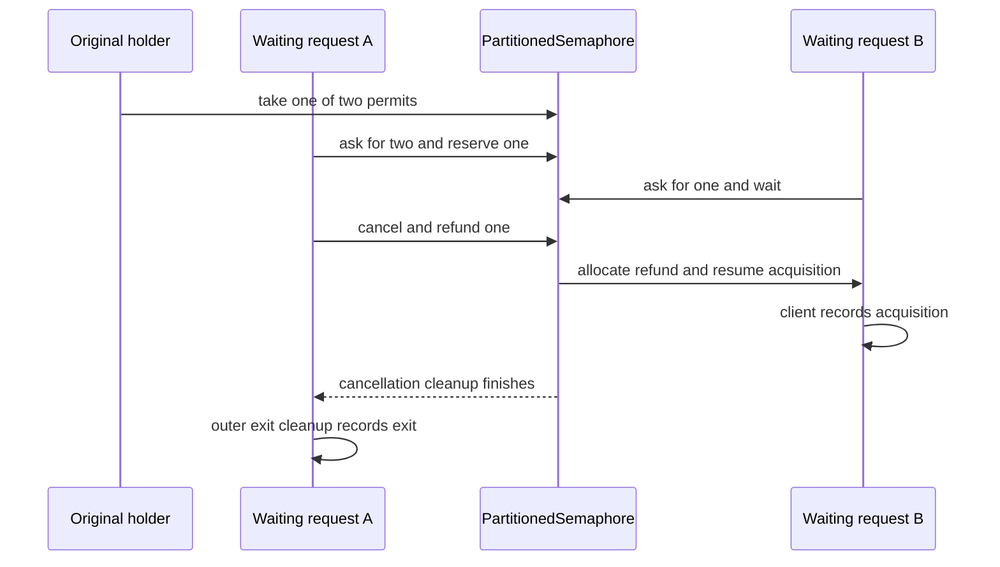
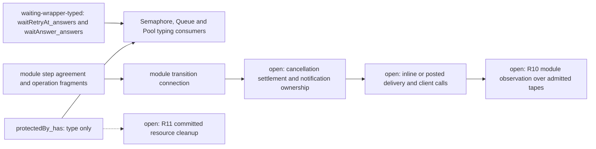

# Waiting: common plumbing and module-owned settlement

Cancellation can produce another acquisition before the canceled request finishes its cleanup.
The shared waiting interface must keep that module-owned behavior.
It must also keep work that the module already commits.

Evidence status: finite host controls checked and local sources inspected.
Proof role: controls and a proposed next contract for production modules.
Scope: the retained natural inputs on Effect 4.0.1, with its default scheduler.

Base: `979be0ad8b86f356dc83aa7f6bdab46228684a32`.
Rows 330, 331, 333, and 335 bound this preparation.
The coordinator owns production declarations and semantics registry additions.

## Finishing criteria

The work finishes when one additional cancellation edge has replayable positive and wrong controls.
The mapping must distinguish registration, reservation, selection, cancellation ownership, delivery, and client observation.
Every proposed proof obligation must name its placement and actual consumer.
The final diff must contain only this seat's research files.

## Prior evidence and the additional edge

The prior plan is `git:8bb77baa:docs/research/2026-10-08-partitioned-semaphore-plan.md`.
Its host packet is `git:8bb77baa:docs/research/2026-10-08-partitioned-semaphore-probes-receipt.md`.
Its source constraints are `git:8bb77baa:docs/research/2026-10-08-partitioned-semaphore-probes/source-boundaries.md`.
Its retained observations are `git:8bb77baa:docs/research/2026-10-08-partitioned-semaphore-probes/observations.json`.

That packet checks partial reservation, solo refunds, reentrant public release, and ordering.
It leaves cancellation after selection as source evidence.
This packet does not claim a deterministic reproduction of that selected-cancellation boundary.

The additional edge joins cancellation settlement with successor delivery.
At capacity two, an original holder takes one permit.
Request A asks for two and reserves the remaining permit.
Request B asks for one and waits behind A's partition.
Canceling A returns its reservation through allocation.
B acquires before A's outer exit cleanup runs.
The free count remains zero until B returns its permit.

A second control distinguishes provisional reservation from committed partial work.
A Queue of capacity two holds message 10.
An offer of messages 20 and 30 accepts 20 and waits with 30.
Canceling that producer leaves messages 10 and 20.
The control observes no message 30.
This batch control constrains the richer Queue profile, beyond the current production wrappers' single-message offer.

The [packet](2026-10-08-module-waiting-probe/README.md) records commands, inputs, predictions, and output.

## What actually shares

`Waiter` in `src/Effect4/Library/Waiting.lean` supplies `hint`, `attempt`, and `withdraw`.
Its attempt controls the choice between waiting and answering.
Its withdrawal is module-supplied program syntax.
The generic wrapper does not prescribe a resource refund.

| Module and actual consumer | Registration | Reservation and selection | Cancellation ownership | Delivery mode | Client observation |
| --- | --- | --- | --- | --- | --- |
| `Semaphore.take`, `src/Effect4/Library/Semaphore/Ops.lean` | `taker` checks and enrols in one cell step | `Model.visit` removes the earliest fitting waiter, without a permit reservation | `Model.withdraw` removes the request; a waiting request holds no permit | `release` posts one `walk` helper; each selected hint resumes a retry inside the helper | Release reply, retry commit, interruption, protected body's exit and release |
| `Pool.lease` and `Pool.use`, `src/Effect4/Library/Pool/Ops.lean` | `borrower` checks open state and idle items in one cell step | `Model.select` removes a fixed prefix at helper execution; no item reservation | `Model.withdraw` removes the request; committed leases use stamped `giveBack` | Posted helper selects once, then `resolveAll` resumes retries in order | Client acquisition calls, lease commit, body calls, return, close and finalization |
| `Queue.take`, `src/Effect4/Library/Queue/Ops.lean` | Attempt checks readiness and arrival order in one cell step | A hint invites retry; consumption commits in the taker's own step | `Model.withdrawTake` removes the taker and may name its successor | `postAll` posts a helper per selected hint | Messages committed and returned, public calls, interruption and termination |
| `Queue.offer`, `src/Effect4/Library/Queue/Ops.lean` | Attempt accepts or registers the pending message in one cell step | Acceptance commits the message and decides the answer; the receiver does not retry | `Model.withdrawOffer` removes pending work and keeps accepted work | `waitAnswer` consumes the decided answer; `postAll` supplies delivery | Accepted message stays after interruption; the batch source control keeps only its accepted prefix |
| Latch registration and flush, `src/Effect4/Library/Latch/Model.lean` | `awaitLatch` checks open state and appends in one transition | `wake` moves registrations into the attached batch; `flush` detaches it | `withdraw` searches waiting registrations first, then the attached batch; no lookup into a detached batch | One posted flush per attached batch; detached delivery resumes in order | Open flag, release, interruption and client continuation; no retry of the open flag after selection |
| Latest (Effect 4.0.1) `PartitionedSemaphore.take` | Callback rechecks availability, then reserves and registers | Partial reservation precedes enrolment; each allocation reduces need; final allocation removes and resumes | Captured request and remainder own the refund, including after removal; refund runs the allocator | Final allocation resumes inline; cancellation refund can resume another client inline | Available count, allocation, acquired request, cancellation settlement, client calls and wrapper exit |

The module definitions anchor these rows.
`Semaphore.Model.visit` and `Semaphore.Model.withdraw` live in `src/Effect4/Library/Semaphore/Model.lean`.
`Pool.Model.select` and `Pool.Model.withdraw` live in `src/Effect4/Library/Pool/Model.lean`.
`Queue.Model.take`, `Queue.Model.withdrawTake`, and `Queue.Model.withdrawOffer` live in `src/Effect4/Library/Queue/Model.lean`.
`Latch.Model.awaitLatch`, `Latch.Model.withdraw`, and `Latch.Model.flush` live in `src/Effect4/Library/Latch/Model.lean`.
The Latch wrapper remains an obligation beyond those transitions.

The common part is the wait registration, request identity, notification, and restored interruption boundary.
Resource ownership, selection, and delivery remain module parameters.
A common waiter record with one refund rule would combine different meanings.
A common delivery rule that posts all notifications would change the checked PartitionedSemaphore cancellation trace.

## Smallest shared interface

Keep `Waiter.attempt` and `Waiter.withdraw` as the shared program interface.
Keep `waitRetryAt` for a notification that invites another attempt.
Keep `waitAnswer` for a notification that carries a decided answer.
Keep `protectedBy` for acquisition and body cleanup under one mask.

The actual consumers already include Semaphore's `taker`, Queue's take and offer, and Pool's `borrower`.
The shared interface needs a behavior contract before a broader new wrapper.
A proof-side contract can relate these existing pieces to module transitions.
It must parameterize cancellation settlement and notification interpretation.
It must retain original request data until the module settles ownership.
These proof-side parameters introduce no second stored program representation.

Use separate cancellation clauses for an uncommitted wait, a provisional reservation, and a completed commit.
A provisional reservation can feed the allocator during cleanup.
A completed commit stays committed when the caller's continuation is interrupted.
Selection alone states neither acquisition success nor cleanup completion.
The delivery clause must permit client execution inside the signaling or cleanup operation.
A final operation reply reads the state at its source-defined observation point.

`waitAnswerAt` is a possible authoring follow-up, analogous to `waitRetryAt`.
It would supply a caller's restore to the decided-answer form.
Its first current consumer would be `Queue.offer` through `waitAnswer`.
Its candidate next consumer would be PartitionedSemaphore's protected acquisition.
That candidate requires its delivery and cancellation contract first.
The existing typing laws do not license that substitution.
This seat implements no new form.

## Source anchors

All source line ranges below name the vendored Effect 4.0.1 snapshot.
The packet hashes its selected runtime inputs and compares installed source bytes with those vendor bytes.

| Source declaration | Path and inspected range | Constraint |
| --- | --- | --- |
| `makeUnsafe`, `releaseUnsafe`, `take` | `vendor/effect-4.0.1/src/PartitionedSemaphore.ts`, 117–245 | Registration rechecks; reservation and remaining need differ; cleanup refunds through allocation; resume occurs inline |
| `waitForPermits`, `SemaphoreImpl.take`, `releaseUnsafe`, `withPermits` | `vendor/effect-4.0.1/src/Semaphore.ts`, 214–330 | Notification invites retry; release posts a live scan; protected acquisition installs cleanup under its mask |
| `offerAll`, `waitToOffer`, `releaseCapacity` | `vendor/effect-4.0.1/src/Queue.ts`, 908–1018 and 2512–2578 | Accepted prefix enters the buffer; cancellation deletes pending work; capacity release may resume a producer inline |
| `callbackOptions`, `asyncFinalizer` | `vendor/effect-4.0.1/src/internal/effect.ts`, 1136–1202 | A yielded callback resumes by fiber evaluation; interrupted asynchronous acquisition runs its cancellation program |
| `Latch.scheduleUnsafe`, `flushScheduled`, `await` | `vendor/effect-4.0.1/src/internal/effect.ts`, 5825–5912 | Attached batches coalesce; flush detaches before resume; cleanup searches waiting registrations then attached batch |

## Existing proof graph and its limits

The registry is `tools/ProofGraph/Registry.lean`.
The generated propositions are `generated/semantics.md` at this base.
This seat inspects those records and declarations without rebuilding their graph.
The table takes each claim role, concept, and witness name from `Tools.Semantics.registry` in `tools/ProofGraph/Registry.lean`.

| Claim or open part | Exact existing evidence and consumer | Boundary still open |
| --- | --- | --- |
| `waiting-wrapper-typed`, `store-typing`, compatibility | `Effect4.Modules.waitRetryAt_answers`; `Effect4.Modules.waitAnswer_answers` is its decided-answer helper; `src/Effect4/Laws/Step/Waiting.lean`; consumers include `Effect4.Semaphore.take_types`, `Effect4.Queue.offer_types`, and `Effect4.Pool.lease_answers` | The `Answers` judgment checks type at scopes under its premises; it states no run, cancellation settlement, or delivery |
| `protected-form-typed`, `store-typing`, compatibility | `Effect4.Modules.protectedBy_has`, same law file; `Effect4.Semaphore.withPermits_types` and `Effect4.Pool.use_types` consume it | The `Has` judgment checks the body's effect type; it states no resource return at an exit |
| `semaphore-steps-agree`, `translation-simulation`, simulation | `Effect4.Semaphore.Model.semaphore_steps_agree`, `src/Effect4/Laws/Library/Semaphore/Steps.lean`; `Effect4.Semaphore.take_attempt`, `Effect4.Semaphore.take_withdrawal`, and `Effect4.Semaphore.visit_attempt` in the module's law `Ops.lean` connect operation fragments | R10's proposed `semaphore-expansion-agrees` lacks the wrapper's run, the walk across visits, and the protected form's run |
| `pool-steps-agree`, `translation-simulation`, simulation | `Effect4.Pool.Model.pool_steps_agree`, `src/Effect4/Laws/Library/Pool/Steps.lean`; `Effect4.Pool.withdraw_attempt` and `Effect4.Pool.select_attempt` in the module's law `Ops.lean` connect operation fragments | R10's proposed `pool-expansion-agrees` lacks wrapper and cross-helper delivery; R11 lacks lease-return and close completion |
| `queue-steps-agree`, `translation-simulation`, simulation | `Effect4.Queue.Model.queue_steps_agree`, `src/Effect4/Laws/Library/Queue/Steps.lean`; `Effect4.Queue.take_withdrawal` and `Effect4.Queue.offer_withdrawal` in the module's law `Ops.lean` connect cancellation fragments | R10's proposed `queue-expansion-agrees` lacks whole-run wrapper and delivery agreement |
| `queue-first-step-invariant`, `reactive-scheduling`, preservation | `Effect4.Queue.Model.first_step_inv`, `src/Effect4/Laws/Library/Queue/Invariant.lean`; its model run lifts through `Effect4.Queue.Model.first_run_flags` | This model fact supplies only the model half of registration and notification ownership; it states no signal delivery |
| `latch-steps-agree`, `translation-simulation`, simulation | `Effect4.Latch.Model.latch_steps_agree`, `src/Effect4/Laws/Library/Latch/Steps.lean` | State and reading connections do not supply the flush wrapper or interruption delivery |
| `latch-registration-agrees`, `translation-simulation`, simulation | `Effect4.Latch.Model.latch_registration_agrees`, `src/Effect4/Laws/Library/Latch/Registration.lean` | Registration and withdrawal readings do not supply interruption delivery or posted-flush execution |

The shared typing witnesses are registered claims.
The broader behavior questions below occur as proposed open parts, without planned goal declarations for these clauses.
Do not replace those missing behavior obligations with additional typing helpers.

## Next contract placement

No theorem or planned goal lands in this packet.
The table places the next obligations before any proof work.
The proposed property adds reservation settlement to the existing waiting-obligation question.
The coordinator must record its exact proposition before implementation or proof dispatch.

| Obligation | Concept and required property | Question and role | Reach and premises | What it does not establish | Consumer and requirement |
| --- | --- | --- | --- | --- | --- |
| Registration and notification ownership | `reactive-scheduling`; registration without a gap and retained notification obligation | Existing proposed `wait-registration-no-gap` and `waiting-request-obligation-preserved`; proposed preservation clause, no goal declared | One existing `Waiter` attempt; checked cell step, fresh request and hint correspondence, caller restore, and sufficient work | Resource reservation, delivered answer, fairness, or host progress | Semaphore `taker`, Queue take and offer, Pool `borrower`; R10–R12 |
| Module-owned cancellation settlement | `scope-lifetime-finalization`; resource cleanup obligation, with a proposed reservation clause | Extend the existing proposed `waiting-request-obligation-preserved`; proposed preservation clause, no goal declared | Original request, remaining need, waiting or selected reservation, actual interruption delivery, unique unsettled owner, and sufficient cleanup work | Arbitrary scheduler progress or whole-module agreement; completed commits do not become reservations | PartitionedSemaphore cancellation allocator and Queue withdrawal; R10 and R11 |
| Notification interpretation and delivery | `translation-simulation`; equal public observation on the checked client subset | Existing proposed module-expansion and `posted-wake-profile-agrees` questions; proposed compatibility clause, no goal declared | Retry versus decided answer, selected identity mapping, source-defined delivery mode, compatible admitted tape, client calls retained under row 333 | No unrestricted client identity observation, arbitrary host tape, fairness, or budget sufficiency | Semaphore `walk`, Pool `wake`, Queue `postAll`; separate inline clause for PartitionedSemaphore; R10 |
| Protected completed acquisition | `scope-lifetime-finalization`; at-most-once cleanup and exactly-once cleanup after completed exit | Existing proposed `semaphore-protected-permit` and `pool-lease-return`; proposed preservation and completion clauses, no goal declared | Committed ownership, one mask, installed exit hook, actual restored caller flag, completed cleanup or retained frontier | A typed form alone does not prove the region's carrying fact or cleanup progress | Semaphore `withPermits` and Pool `use`; R11 |

Rows 330 and 333 require public interruption, cleanup, and ordered client host calls in the observation.
The correspondence must quantify over reply-admitted tapes.
Host lawfulness and host progress remain at `docs/core/host-boundary.md`.
Request identities still require the contextual handle mapping of G9.

## Broader follow-ups for the coordinator

Record retry or decided-answer behavior in each module's data contract.
Record cancellation ownership separately from the notification's delivery mode.
Generate wrapper obligations from the module form only after those meanings are explicit.
Consider named carrier packing for law callers independently of these waiting contracts.
Leave proof-graph organization and reporting tools to the organizational seat.
