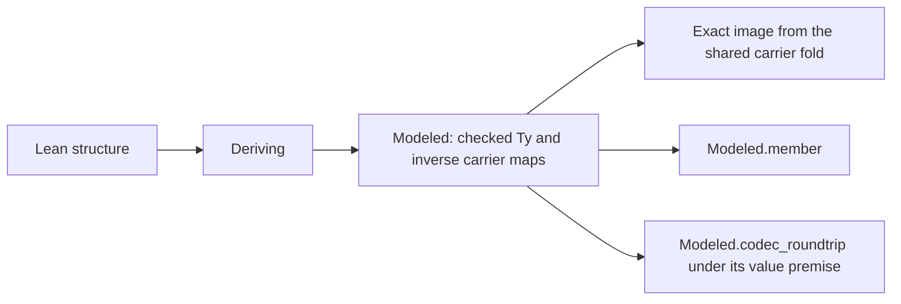

# Module overwatch 01: landed L1 and L2 in progress

L1 provides a useful shared abstraction for its declared data profile.
Its deriving step still requires a field instance to expose its implementation.
Reuse the field instance's existing checked-domain proof to remove that requirement.
A retained positive control verifies that this correction supports the surrounding maps and inverse laws.

## Reviewed state

The landed implementation is `a2d1dc7aa7e8bfea426b71cb7e00f5e821dc08a9`.
The preceding review is [MODULES revision 2 review](2026-10-08-modules-r2-review.md).
The governing decision is row 330 in `docs/core/decisions.md`.
The slice plan is [MODULES revision 3](2026-10-08-seat-MODULES-r3.md).

The review branch is `codex/module-design-review`.
Its head is the commit containing this receipt.
The production checkout remains under Claude's ownership.
This review changes only its own probes and receipt.
Three GPT-6.1 Sol agents inspect separate parts; the coordinator reproduces the executable findings.

Claude's repository session is `9ebf38b2-8b2f-44e5-8fd9-2dc0cb5a1f50`.
A bounded session-log read confirms work on the contextual carrier, field references and step laws.
The checkout still has L1 at HEAD while those L2 files change.
Claude's visible reports remain separate from the coordinator's reproduced results.
Internal thinking fields are not read.

## What the checks establish

[review.py](2026-10-08-modules-overwatch-01/review.py) reproduces the checks.
[results.json](2026-10-08-modules-overwatch-01/results.json) records commands, exits, outputs, source digests and probe digests.

| Subject | Result | Reach |
| --- | --- | --- |
| narrow L1 build | passes | deriving, the Modeled laws, the Modeled battery and the semantics registry |
| declared refusal controls | pass in the battery | malformed names, unsupported identities, renames, parameters, universes, proof fields and dependent fields |
| extra authoring controls | pass | empty, inherited, nested-namespace, escaped-name and implicit-field structures |
| declaration audit | passes | the five new L1 modules, under the existing axiom ceilings |
| import separation | passes | the three new core modules reach no Laws module |
| revision 3 native runner | passes | the named clients under Effect rc.112 and the pinned tsgo 7 |
| native failure controls | pass | distinct Boolean/number results, a crash, a nonexistent ruling, no clients, a stale difference and wrong pins |

The exact compiler is tsgo `7.0.0-dev.20260629.1`.
The native run uses Effect `4.0.0-rc.112` and bun `1.4.2`.
The original Latch batch remains an expected counterexample; the coalescing batch agrees on its retained client.
These native checks establish finite observations, not a module run theorem.

The declaration audit uses the repository's `ProofGraph.Audit` and `ProofGraph.Axioms` helpers.
It checks every declaration in the selected modules, including generated declarations.
Only `Effect4.Schema.Modeled.Derive` receives the existing named meta exception for `Classical.choice`.
The generated instances and the semantic laws receive no such exception.
The selected audit is not the whole-tree axiom gate.

## Confirmed findings

### OW-01: deriving depends on a field implementation being visible [P2]

`deriveModeled` in `src/Effect4/Schema/Modeled/Derive.lean` first accepts a field with an existing `Modeled` instance.
It then generates the enclosing checked-domain proof using `by decide`.
That computation needs to unfold the field's type declaration.
The field's supplied proof is unused.

[opaque.lean](2026-10-08-modules-overwatch-01/opaque.lean) defines a valid opaque `Modeled Flag` with a checked body.
The instance already supports `Modeled.member`.
The enclosing monomorphic `Holder` has one independent `Flag` field.
`derive_modeled Holder` fails because the generated decision procedure cannot unfold the field instance.

This is an authoring failure for a valid composition.
It does not refute the membership theorem.
The project's trust rules explicitly permit an opaque declaration with a checked body.

[opaque-composed.lean](2026-10-08-modules-overwatch-01/opaque-composed.lean) supplies the enclosing instance explicitly.
It decides only the concrete name ordering and reuses the child's `Modeled.checked` proof.
Its maps, inverse equations and membership reader all compile.
The child implementation remains opaque throughout.

**Correction:** generate the checked-domain proof by composing field proofs.
Decide the concrete field ordering separately.
The generator should require only the public `Modeled` contract from each field.
Keep the failing generated case and the passing compositional case as paired controls.

### OW-02: generated-name collisions produce recovery declarations [P3]

[collision.lean](2026-10-08-modules-overwatch-01/collision.lean) defines `Token.modeledTy` before invoking deriving.
The command reports the name collision, then continues generating declarations against the existing incompatible type.
It emits further errors, including recovery declarations that depend on `sorryAx`.
The trailing checks find `Token.modeled_checked` and `Token.modeledToC` in that failed environment.

The file fails compilation, as it should.
This is a diagnostic and command-atomicity issue, not an accepted false proof.

**Correction:** check every generated name before emitting any declaration.
Make generation restore the prior environment after a later Lean elaborator error.
Report the collision once, at the deriving command.

## Assessment of the abstraction

The ordinary interface is small: declare a structure and add `deriving Modeled`.
An author who needs field renames uses `derive_modeled` once.
The declaration supplies the type, its image and the inverse maps.
Membership and the conditional JSON law come from the shared theory.
No per-record membership theorem is required.



`Model.member` and `Modeled.codec_roundtrip` are the registry pointers for `modeled-membership` and `modeled-codec`.
Their definitions live in `src/Effect4/Laws/Schema/Modeled.lean`.
The first is an encoding-to-membership theorem on the checked domain.
The second retains `Ty.isCodecValue` at the normalized type as a premise.
Neither establishes the TypeScript codec or host execution.

The carrier and refusal corrections from the preceding review are present in L1.
A custom instance must now supply `Modeled.checked`.
Noncanonical records and unsupported nested identities cannot enter that class through inverse equations alone.

Inherited structures derive their direct parent fields, such as `toParent`, as nested records.
The retained positive control checks that shape.
Document it before treating deriving as a substitute for an existing flattened external schema.

## L2 observation, still in progress

[l2-snapshot.json](2026-10-08-modules-overwatch-01/l2-snapshot.json) identifies the inspected source versions.
The field-law file changes during the review, so the packet records both observed versions.
This is source inspection, not an independently built L2 landing.

The new `Model.algAt` parameterizes the existing carrier fold by `Model.Leaves`.
The legacy `Model.alg` uses `Leaves.refused`, and the existing `Modeled.checked` restriction remains.
`Leaves.opaque` instead carries a stored value through `Image.ident`.
This supports carrying an existing identity field through a step without claiming its membership judgment.

That is a useful shared interpretation, not evidence of premature whole-cell deriving.
Semaphore can retain `Model.cellVal tb s` and its existing table while changing its numeric fields.
The required table and allocation premises remain in that connector.
L6 still owns whole-cell deriving through role-specific encodings.

The field-reference data contains positions and names, with reads and writes computed from those positions.
The machine read/write statements require ascending names.
The checker statements require a record type in normal form.
The field laws explicitly establish no membership at `Leaves.opaque`.

The later visible step source translates through the existing term builders.
Its reading statement assumes source terms that read the input encodings.
Its typing statement separately assumes source terms typed at their declared input types.
Keep these premises when connecting the step to an actual module.
The step's model agreement and its run behavior remain separate obligations.

## Next review checkpoint

The last independently built implementation is L1 at `a2d1dc7a`.
OW-01 and OW-02 remain open.
The preceding carrier defects and the named native failure controls reproduce as corrected.

On the next substantive L2 change, check:

- the completed step laws, their semantics registry placement and proof dependencies;
- the concrete Semaphore connector with existing waiter values and its table;
- field selection generated from the declaration, without repeated names or positions in author code;
- the step algebra and fold generated from its constructor declarations, or an explicit scoped reason for hand-maintained machinery;
- the author-facing example, including what remains handwritten and why.

Require contextual membership evidence wherever a later claim needs actual allocated handles.
An exact raw-value image alone does not provide it.
Keep the `Forms → core Eff → checked program → TypeScript syntax` route as the program path.
Generic structures, optional properties and the live target codec remain the plan's declared later work.
Their absence is not a new regression in L1.

## Reproduce

Run from the isolated review worktree:

```sh
python3 docs/research/2026-10-08-modules-overwatch-01/review.py
```

The runner first requires the reviewed source files to match L1's commit.
It records successful controls and the two expected failures separately.
A later implementation repair requires a new receipt rather than silently changing these expectations.

The receipt passes the repository's strict language check.
No full sweep, production edit, main-branch merge or push occurs.
