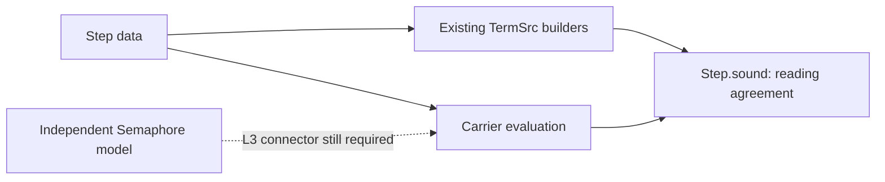

# Module overwatch 02: landed L2

L2 supplies shared reading, typing and field laws with their stated premises.
The focused build and declaration audit pass at `09da9715a5d6eb07b78b8c512ca565430379e0cf`.
The main authoring weakness is positional field selection.
A schema insertion can change the selected field while both step checks pass.
Generate named references from the existing schema before module authors depend on those positions.

## Reviewed state

The previous reviewed implementation is L1 at `a2d1dc7a`.
The previous receipt is [overwatch 01](2026-10-08-modules-overwatch-01.md).
The reviewed implementation is L2 at `09da9715`.
The review branch is `codex/module-overwatch-l2`, in the existing isolated review worktree.
Its head is the commit containing this receipt.
This review changes only its probes and receipt.

Row 330 in `docs/core/decisions.md` remains the governing ruling.
The [revision 3 plan](2026-10-08-seat-MODULES-r3.md) and [L2 receipt](2026-10-08-seat-MODULES-L2-receipt.md) define the slice.
Three GPT-6.1 Sol reviewers inspect the laws, the authoring interface and the concrete module connections.
The coordinator reproduces the executable controls.

A bounded read of Claude's session confirms L2's landing and work on L3.
The session is `9ebf38b2-8b2f-44e5-8fd9-2dc0cb5a1f50`, with this repository as its working directory.
Only visible text and tool descriptions enter the review.
Claude reports new Semaphore data, encoding connectors and replacement proof bodies.
The production checkout contains those uncommitted changes.
They are not part of this L2 verification.

## Reproduced evidence

[review.py](2026-10-08-modules-overwatch-02/review.py) checks source digests against the reviewed commit before running Lean.
[results.json](2026-10-08-modules-overwatch-02/results.json) records the commands, toolchain, outputs and source digests.

| Check | Result | Scope |
| --- | --- | --- |
| narrow build | passes | L2 laws, its battery, the L1 battery and the semantics registry |
| declaration audit | passes | every declaration in the selected L2 modules and the selected L1 modules |
| core import closure | passes | the selected core modules import no law module |
| field insertion | reproduces | the same position selects a different field, with both checks accepted |
| schema reuse | passes | the existing Semaphore field declaration supplies the example's schema |
| shared update | passes | factoring Latch's clearing update keeps its existing step and frame-law application |
| scope controls | pass | raw identities, duplicate names, normal-form certification and update-spine restrictions |
| previous deriving controls | reproduce | OW-01 and OW-02 remain open; the explicit compositional correction still compiles |

The audit uses the existing `ProofGraph.Audit` and `ProofGraph.Axioms` helpers.
It includes generated declarations and the final `FieldRef.frame_laws` declaration.
Semantic declarations stay within `[propext, Quot.sound]`.
Only the previously admitted deriving metaprogram receives its existing `Classical.choice` exception.
This is a selected declaration audit, not the whole-tree gate.
No host comparison or TypeScript check runs in this review.

## OW-03: positional fields can silently change meaning [P2]

`Test.Program.StepLanguage.takenF` selects a field by counting positions in `Test/Program/StepLanguage.lean`.
`FieldRef` in `src/Effect4/Schema/FieldRef.lean` checks that the selected position has the expected type.
It does not record the author's intended field name separately.

[positions.lean](2026-10-08-modules-overwatch-02/positions.lean) uses Semaphore's existing schema as its positive control.
The reference to the third field selects `taken` and reads three.
The control inserts a natural-number field named `available` before the existing fields.
The same reference expression now selects `permits` and reads ten.
Both schemas are canonical, and both steps pass `canonical` and `normal`.
Selecting `taken` at its new position restores the result three.

This is an author-intent failure, not a false theorem.
The laws correctly describe the field the author accidentally selected.
An independent module agreement supplies the separate check for this change.
The consequence grows when deriving sorts fields or an existing record gains another field of the same type.

**Correction:** generate named references from the declaration that already owns the schema.
Keep `FieldRef` as the stored data.
A small Lean elaborator can select a name against the expected schema and emit the existing positional constructors.
For example, the following authoring helper is proposed, not implemented:

```lean
abbrev semFields := Ty.canon Effect4.Semaphore.cellFields

def takenF : FieldRef semFields .nat :=
  field_ref% "taken"
```

The helper must refuse a missing, duplicate, optional or wrongly typed field.
It must also refuse a schema it cannot inspect.
Structure deriving can expose those checked references as named declarations for later step authoring.

## Further improvements to keep small

`Test.Program.StepLanguage.semFields` repeats Semaphore's schema.
[existing-seams.lean](2026-10-08-modules-overwatch-02/existing-seams.lean) verifies reuse of `Ty.canon Effect4.Semaphore.cellFields` instead.
This removes one manual copy without changing the representation.

`Step.spineAlg` in `src/Effect4/Modules/Step.lean` refuses a projection from a reply/state pair.
Consequently, `releaseNext` repeats part of the battery's `release` to apply the frame law.
[frame-sharing.lean](2026-10-08-modules-overwatch-02/frame-sharing.lean) factors their clearing update into one expression.
Its equality controls and frame-law reader pass.
The branch condition still occurs in both expressions.
A richer projection analysis remains a later improvement when a consumer needs it.

`StepAlgebra` and `Step.cata` in `src/Effect4/Modules/Step.lean` repeat the constructor declarations by hand.
All current interpretations correctly use that fold.
Before extending the language substantially, generate these mechanical declarations or record the scoped reason for keeping them manual.
The existing fold generator's support for this indexed family remains unverified.
This review does not claim that registering another manifest entry suffices.

## What the laws establish

`Step.sound` relates the translated term to `Step.eval` when input terms read the encoded inputs and the reading check passes.
`Step.typed` requires typed input terms, the native atom signature and the typing check.
`Step.frame` requires an update spine of the identified input and an untouched field name.
`Step.frame_read` additionally requires ascending record names.
These declarations live in `src/Effect4/Laws/Modules/Step.lean`.
Their semantics registry pointers and consumers are present.

`Ty.normalize_of_certNormal` in `src/Effect4/Laws/Program/TyNormal.lean` makes certification sufficient for normal form.
It does not make certification necessary, or imply carrier support.
`FieldRef.frame_laws` in `src/Effect4/Laws/Schema/FieldRef.lean` connects positional carrier operations to the machine's named record operations.

[safety-controls.lean](2026-10-08-modules-overwatch-02/safety-controls.lean) retains the identity distinction.
A raw natural number can inhabit the opaque carrier of a deferred type and pass both step checks.
Its encoded value fails deferred membership.
The reading theorem remains applicable to that raw encoding.
The existing law documentation excludes membership, so this is a scope control rather than a new defect.



L3 must connect that evaluation to the independent Semaphore model through `Model.cellVal tb`.
The existing `takeIfAvailable_attempt` retains allocation and membership premises in `src/Effect4/Laws/Modules/Semaphore/Ops.lean`.
Agreement with generated evaluation alone does not discharge that connection.
The `Forms → core Eff → checked program → TypeScript syntax` path remains the program path.
No general run simulation or Effect runtime compatibility follows from L2 alone.

## Checkpoint

Last independently checked implementation: `09da9715`.
L2's substantive review is finished within the scope above.
OW-01 and OW-02 remain open, with unchanged findings.
OW-03 is the new authoring finding.
L3 remains in progress in the production checkout.
Pool and Queue migrations also start during this run.
Those working-tree changes await their own review.

The next review checks the independent Semaphore connector, unchanged theorem statements and their concrete consumers.
It also checks whether schema reuse and generated field selection remove the manual bookkeeping.
List folds, target codecs, broad module grading and whole-cell deriving retain their planned slice boundaries.

Run the retained packet from the review worktree:

```sh
python3 docs/research/2026-10-08-modules-overwatch-02/review.py
```

No production edit, full sweep, implementation merge or push occurs.
